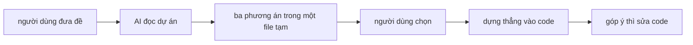
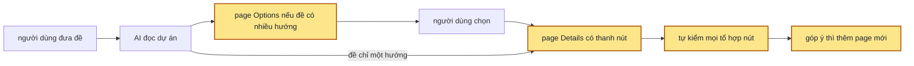

## 1. Problem

Muốn xem trước một màn hình trước khi code thì hiện chỉ có hai cách, và cách nào cũng thiếu. Skill
ui-ux đang dùng cho ra một file phác thảo nằm trong thư mục tạm, vòng sau ghi đè vòng trước, chỉ chuyển
được phương án, màu, khổ màn và bốn trạng thái cố định. Muốn xem màn chịu được nhiều tuần dữ liệu, ngưỡng
cảnh báo khác hay một role khác thì phải sửa tay dữ liệu giả, và chọn xong là skill đi thẳng vào code.
Claude Design có nhiều page và có nút vặn dữ liệu, nhưng nằm ngoài repo này. Hai đề đang chờ cho thấy rõ
chỗ hổng: đề quota timeline cần thử vài cách hiển thị trên một design system lấy bằng một lệnh, đề cải
thiện trang Insights cần bám đúng design system và component của dự án đang có.

## 2. Goal

- Gọi skill với một requirement thì skill đọc design system được đưa (file mô tả, file token, component
  của dự án) và màn liên quan nếu có, báo một dòng đã lấy những gì, rồi mới vẽ. Đề có từ hai hướng hiển
  thị khác nhau thật thì có page Options: 2–3 phương án dựng thật trên cùng dữ liệu, mỗi phương án có lý
  do và ưu nhược. Đề chỉ có một hướng hợp lý thì vào thẳng page Details.
- Page Details mở thẳng bằng trình duyệt, không cần server, là dùng như app thật: tab, menu, modal, lọc,
  sắp xếp, thêm xoá chạy trên dữ liệu giả. Page có đủ trạng thái có dữ liệu, đang tải, rỗng, lỗi, cộng
  các trạng thái riêng của đề.
- Thanh trên đầu page Details có bốn nhóm nút: variables đổi dữ liệu, tweak đổi cấu hình (role, kiểu bố
  cục, độ dày), khổ màn desktop / tablet / mobile, và sáng / tối. Vặn nút nào thì UI đổi ngay, thứ đang
  mở trên page (modal, tab) không mất. Chép link gửi đi thì mở ra đúng các giá trị đang xem. Design
  system chỉ có một giao diện thì giao diện còn lại do skill suy ra, và thanh ghi rõ là suy ra.
- Mọi page của một requirement nằm chung một thư mục trong `.design`, trên thanh có menu chuyển page: một page
  Options, và mỗi phương án được chọn đúng một page Details. Góp ý thì sửa thẳng page đó tới khi xong; chỉ
  khi chọn thêm một phương án khác mới có page mới.
- Mỗi page giao ra đã qua lệnh tự kiểm: không lỗi console, không cuộn ngang ở 375px, ở mọi tổ hợp tweak ×
  sáng tối × trạng thái.

**Ngoài scope:** chuyển prototype thành code của dự án (đã có công cụ khác); gọi API thật; bộ luật gu
thẩm mỹ riêng kiểu skill ui-ux (skill theo design system được đưa); ghi vào code của dự án được đọc.

## 3. Mental model

**Bây giờ chạy thế nào** — Người dùng nhờ AI thiết kế một màn. AI đọc dự án, viết một bản tóm tắt, rồi vẽ
một file phác thảo có ba phương án trong thư mục tạm. Người dùng bấm thanh trên cùng để chuyển phương án,
màu, khổ màn, bốn trạng thái, rồi chọn một phương án. AI dựng thẳng phương án đó vào code của dự án. Có
góp ý thêm thì AI sửa code: bản phác thảo cũ không còn để so, và muốn thử dữ liệu hay role khác thì phải
sửa tay.



**Sau plan chạy thế nào** — Cùng đường đó, khác bốn chỗ. AI chỉ vẽ page Options khi đề có nhiều hướng thật;
đề một hướng thì đi thẳng. Chọn xong, AI không dựng vào code mà dựng page Details: một file HTML dùng như
app thật, thanh trên cùng có nút vặn dữ liệu, cấu hình, khổ màn, sáng tối. Mỗi page qua lệnh tự kiểm trước
khi giao. Góp ý vòng sau sửa thẳng page Details đó; chọn thêm phương án khác thì có thêm một page.



**Hành vi đổi ra sao**

| #     | Tình huống | Bây giờ | Sau plan |
| ----- | ---------- | ------- | -------- |
| `BH1` | Đề có nhiều cách hiển thị | Ba phương án trong một file tạm, chọn xong dựng vào code | Page Options dựng thật trên cùng dữ liệu, có lý do và ưu nhược; chọn xong ra page Details |
| `BH2` | Đề chỉ có một hướng hợp lý | Vẫn vẽ ba phương án | Vào thẳng page Details, không có page Options |
| `BH3` | Muốn xem màn chịu dữ liệu khác (nhiều tuần, ngưỡng thấp, tên dài, số 0) | Sửa tay dữ liệu giả rồi mở lại | Vặn nút variables trên thanh, UI đổi ngay |
| `BH4` | Muốn xem với role khác hay kiểu bố cục khác | Không có | Đổi tweak trên thanh, menu, nút và quyền đổi theo |
| `BH5` | Xem trên điện thoại, máy tính bảng | Khung 375px | Khung mobile và tablet chạy media query thật, nút trên thanh vẫn điều khiển được |
| `BH6` | Design system chỉ có giao diện sáng, hoặc chỉ có tối | Chỉ có giao diện đó | Có cả sáng lẫn tối; giao diện suy ra được ghi rõ trên thanh |
| ~~`BH7`~~ | ~~Góp ý vòng hai~~ | ~~Sửa code, bản trước mất~~ | ~~Page mới trong cùng thư mục, page cũ mở lại y như trước~~ — bỏ 2026-10-05, thay bằng `BH10` |
| `BH8` | Gửi link cho người khác | Link giữ phương án, màu, khổ, trạng thái | Link giữ mọi giá trị đang vặn |
| `BH9` | Đang mở modal trên page rồi vặn một biến | Không có biến để vặn | Modal vẫn mở, nội dung đổi theo dữ liệu mới |
| `BH10` | Góp ý vòng hai trên một phương án | Sửa code của dự án | Sửa thẳng page Details của phương án đó, vẫn một page; menu page ghi ngày sửa và góp ý cuối |
| `BH11` | Xem rồi muốn thử thêm phương án khác | Vẽ lại cả file phác thảo | Thêm một page Details cho phương án đó, page phương án cũ giữ nguyên |

**Không đụng:** skill ui-ux (bản cài và bản tham khảo); code của dự án được đọc, skill chỉ ghi vào thư mục
`.design` ở chỗ đang làm việc.

---

## 4. Probe

### P1 — Lệnh lấy design system của đề quota cho ra gì, có đủ token để dựng không?

**Biết để làm gì:** ra file token dùng thẳng được thì chỉ cần chép; ra tài liệu mô tả thì skill phải có
bước chuyển mô tả thành token, và phải biết tài liệu đó có mấy giao diện.
**Cách chạy lại:** `cd "$(mktemp -d)" && npx -y getdesign@0.6.25 add claude`, rồi đọc `DESIGN.md`
**Kết quả:** ra `DESIGN.md` 589 dòng. Đầu file là YAML: `colors` (25 màu), `typography` (thang chữ;
tiêu đề `Copernicus, Tiempos Headline`, thân `StyreneB, Inter`), `rounded`, `spacing`, `components` (29
mục, tham chiếu dạng `{colors.primary}`). Thân file có Overview, Colors, Typography, Layout, Elevation,
Shapes, Components, Do's and Don'ts, Responsive. **Chỉ có giao diện sáng** (`canvas: #faf9f5`). —
2026-10-05, getdesign 0.6.25

### P2 — Dự án của đề Insights khai design system ở đâu, có giao diện sáng không?

**Biết để làm gì:** token nằm trong file CSS thì dán thẳng giá trị được, không phải chuyển từ tài liệu mô
tả; chỉ có giao diện tối thì skill phải tự suy ra giao diện sáng.
**Cách chạy lại:** trong `/Users/andy/Code/LLM-Proxy/ats-proxy-v2`:
`grep -nE 'dark-only|@theme|prefers-color-scheme' packages/ui/src/tokens.css` · `ls packages/ui/src/*.tsx`
· `grep -n '/insights' apps/control-plane/src/web/app.tsx`
**Kết quả:** React 19 + Tailwind v4 + react-router 7 + `lucide-react`. Token ở
`packages/ui/src/tokens.css` trong `@theme`, đặt tên theo khoá của `DESIGN.md` (`colors.primary` →
`--color-primary`, `typography.display-xl` → `--text-display-xl` + `--text-display-xl--line-height`…).
File ghi "Hệ dark-only", không có `prefers-color-scheme`. `DESIGN.md` 2049 dòng, cùng định dạng P1, thêm
khoá `motion`, `icons`. 32 component ở `packages/ui/src` (button, card, data-table, stat-tile, bar-chart,
heatmap…). Trang `/insights` là `routes/insights.tsx` 668 dòng cùng 7 trang con. — 2026-10-05

### P3 — Mở page bằng `file://` thì ghi URL, iframe chính nó và gửi giá trị vào iframe có chạy không?

**Biết để làm gì:** Chrome có lúc chặn ghi URL trên trang `file://`; chặn thì giá trị phải nằm ở chỗ khác
(phần `#` của URL, hay bắt chạy server), và khung mobile phải nghĩ cách khác.
**Cách chạy lại:** `PW_DIR=<thư mục có node_modules/playwright> node .test/design-uiux/000-probe-file-protocol/run.mjs`
— page dùng Alpine 3 + Tailwind v4 bản trình duyệt + `pages.js` + iframe `?frame=1`
**Kết quả:** chạy hết. `history.replaceState` ghi `?weeks=9` không lỗi, `navigation` vẫn 1 lượt; modal
đang mở vẫn mở, số trong modal đổi theo; iframe nhận `postMessage` đổi sang 7; mở lại URL ở tab mới ra 9;
Tailwind lấy đúng `--color-canvas`; 0 lỗi console. Thẻ nằm ngoài `x-data` thì Alpine không vẽ, nên `body`
phải mang `x-data`. — 2026-10-05, Chrome 154.0.8037.93, Playwright 1.x

## 5. Decisions

**Ai quyết:** 🤖 = agent tự quyết, chưa hỏi ai — **chỗ người duyệt phải soi** · 👤 = user chốt lúc bàn (luật 22).

### D0 👤 — Sản phẩm cuối là HTML prototype, không dựng vào codebase

**Lý do:** chuyển HTML thành code đã có công cụ khác lo.

### ~~D1~~ — Mỗi requirement một thư mục `.design/NNN-slug/`, mỗi page một file, vòng sau thêm file chứ không ghi đè

**Lý do:** giữ được lịch sử quyết định để mở lại và so, như project trong Claude Design. → DS2
**Đổi (2026-10-05):** bỏ — người dùng chốt mỗi phương án một page, góp ý sửa thẳng page đó; thay bằng D21.

### D2 👤 — Page Options chỉ có khi đề có từ hai hướng hiển thị khác nhau thật

**Lý do:** đề một hướng mà vẫn bày ba phương án là bắt người dùng chọn giữa ba bản gần giống nhau. → DS7

### D3 👤 — "Như thật" là tương tác UI trên dữ liệu giả đầy đủ, đủ trạng thái, không gọi API

**Lý do:** prototype để xem và bấm thử, không để chạy logic thật. → DS6

### D4 👤 — Variables và tweak đều là nút có sẵn, người dùng không phải chọn; variables đổi dữ liệu, tweak đổi cấu hình UI

**Lý do:** chốt lúc bàn; hai nhóm đứng riêng trên thanh để người xem biết đang vặn loại gì. → DS3

### D5 👤 — Mọi page Details có khổ desktop / tablet / mobile và sáng / tối

**Lý do:** yêu cầu từ đầu; hai nhóm này là nút cố định của thanh, page không tự khai. → DS5

### D6 🤖 — Vặn nút thì vẽ lại ngay và ghi giá trị lên URL, không tải lại trang

**Lý do:** ô số phải gõ hay kéo; tải lại mỗi lần đổi thì mất modal đang mở và chỗ đang cuộn — dựa vào `P3`. → DS5
**Phương án đã loại:** mỗi nút là một link tải lại trang như skill ui-ux — hợp với nút chọn, không hợp ô số.

### D7 🤖 — Page dùng Alpine.js qua CDN: thanh ghi giá trị vào một store, state riêng của page nằm trong từng khối

**Lý do:** vặn biến chỉ vẽ lại phần phụ thuộc biến đó, modal đang mở và ô đang gõ giữ nguyên (BH9) — dựa vào `P3`; `body` mang `x-data`.
**Phương án đã loại:** JS thuần vẽ lại cả trang mỗi lần đổi — modal đóng, mất focus; tự viết cơ chế giữ
state là dựng lại một thư viện nhỏ.

### D8 🤖 — Phần khung chung (thanh, menu page, khổ, sáng tối, đọc ghi URL) là shell của skill, copy vào từng thư mục design

**Lý do:** page đã giao phải mở lại vẫn chạy như lúc giao, không phụ thuộc bản shell sau này. → DS1 · DS2
**Phương án đã loại:** mọi page trỏ về shell trong thư mục skill — cập nhật skill là đổi hình page cũ.

### D9 🤖 — Khổ mobile và tablet là iframe của chính page kèm `frame=1`; thanh bên ngoài gửi giá trị vào bằng `postMessage`

**Lý do:** media query chạy thật; mở bằng `file://` thì trang cha không đọc thẳng được vào iframe, còn
`postMessage` thì chạy — dựa vào `P3`. → DS5

### D10 🤖 — Page chạy được khi mở thẳng file: danh sách page là `pages.js` nạp bằng thẻ `<script>`, không `fetch`

**Lý do:** Chrome chặn `fetch` file local khi mở bằng `file://`; bắt chạy server là thêm một bước cho người xem — dựa vào `P3`. → DS2

### D11 🤖 — Token lấy từ design system được đưa: có file token CSS thì dán nguyên khối `@theme`, chỉ có `DESIGN.md` thì chuyển theo bảng; không có gì thì dùng bộ mặc định của skill

**Lý do:** dựa vào `P1` · `P2` — hai đề, hai dạng nguồn, cùng một cách đặt tên. → DS4
**Phương án đã loại:** chép tay mã màu vào page — lệch design system ở lần sửa đầu tiên.

### D12 🤖 — Design system thiếu giao diện nào thì skill suy ra theo vai màu, thanh ghi "Tối (suy ra)" hay "Sáng (suy ra)"

**Lý do:** dựa vào `P1` · `P2` — đề 01 chỉ có sáng, đề 02 chỉ có tối, mà §2 đòi đủ hai. → DS4
**Phương án đã loại:** ẩn nút sáng / tối khi design system chỉ có một giao diện — trái §2.

### D13 🤖 — Font thương mại không tải được (Copernicus, StyreneB) thì dùng font gần nhất trên Google Fonts, báo một dòng lúc giao

**Lý do:** dựa vào `P1` — tên font có trong token nhưng không có nguồn tải; để trình duyệt tự rơi về font hệ thống là lệch giọng chữ. → DS4

### D14 👤 — Prototype dùng Tailwind v4 bản trình duyệt, class viết theo tên token (`bg-canvas`, `text-ink`)

**Lý do:** viết nhanh, CSS riêng của page gần như bằng không, và mọi màu đi qua token nên không lệch design system. → DS4
**Phương án đã loại:** CSS viết tay — mỗi page tự đặt tên class, khó giữ đồng bộ giữa các page.
**Đổi (2026-10-05):** bỏ lý do "class trùng class dự án để chuyển sang code" — prototype chỉ là HTML, không nối với code.

### D15 👤 — Dự án có component thì prototype vẽ cho trông giống component đó (dáng, cỡ, trạng thái), đọc từ code và `DESIGN.md`

**Lý do:** dựa vào `P2` — dự án có 32 component; page phải trông như app đang có thì mới so được với hiện trạng. → DS7
**Đổi (2026-10-05):** bỏ yêu cầu chép nguyên chuỗi class của component — prototype chỉ là HTML, không cần trùng code.

### D16 🤖 — Hiện trạng của màn cần cải thiện đọc từ code; ảnh chụp chỉ khi người dùng đưa ảnh hay URL đang chạy

**Lý do:** dựa vào `P2` — app của đề 02 cần docker và DB mới chạy; page Options của đề cải thiện có khối "đang có gì". → DS7
**Phương án đã loại:** skill tự dựng app để chụp — tốn thời gian, hay hỏng vì thiếu dữ liệu.

### D17 🤖 — Lệnh tự kiểm `check.mjs` viết mới, gọn; Playwright cài vào thư mục tạm, không cài vào dự án

**Lý do:** đo đúng những gì skill hứa trong DS2–DS6, không đo gu. → DS8
**Phương án đã loại:** chép `probe.mjs` 4447 dòng của skill ui-ux — phần lớn đo gu riêng của skill đó.
**Đổi (2026-10-05):** phạm vi kiểm mở rộng từ "lỗi console và cuộn ngang" sang toàn bộ contract đầu ra, theo D20.

### D20 👤 — Đầu ra của skill được kiểm bằng code: chỉ giao link khi `check.mjs` ra exit 0

**Lý do:** người dùng chốt giữa lúc dựng — đầu ra skill phải verify bằng code, không bằng lời khai. Mỗi
hứa hẹn ở DS2–DS6 có một phép kiểm trong `check.mjs`. → DS8

### D21 👤 — Mỗi phương án được chọn đúng một page Details; góp ý sửa thẳng page đó, page mới chỉ khi chọn thêm phương án

**Lý do:** người dùng chốt giữa lúc dựng — làm một page cho tới khi xong, không rải bản nháp. Thư mục
`.design/NNN-slug/` vẫn một đề một thư mục. → DS2 · DS7

### D18 🤖 — Lấy từ skill ui-ux ba thứ: khung lý do và ưu nhược trên page Options, đánh số khối trên mọi page, nút gợi ý góp ý chép được

**Lý do:** người dùng góp ý bằng số khối ("bỏ khối 3") và bằng câu có sẵn, không phải tả lại bằng lời. → DS6 · DS7

### D19 🤖 — Thư mục `.design` nằm ở thư mục làm việc lúc gọi skill; khi chạy thử thì đó là `.test/design-uiux/NNN-slug/`

**Lý do:** đề 02 đọc một repo khác; skill không ghi vào repo đó (§2 Ngoài scope). → DS9

## 6. Design

### DS1 — Cấu trúc file skill

```
skills/design-uiux/
  SKILL.md                 # luồng DS7, bảng chuyển token DS4, luật khai nút DS3
  shell/
    shell.js               # đọc window.DESIGN, vẽ thanh, store, URL, iframe, menu page
    shell.css              # thanh, menu page, khung iframe, số khối
    default-design.md      # bộ token khi đề không đưa design system (YAML như DESIGN.md), tối suy ra
  templates/
    options.html           # khung page Options: phương án, khung lý do, số khối
    details.html           # khung page Details: khai DESIGN, Alpine, bốn trạng thái
  scripts/
    new-design.mjs         # init (tạo .design/NNN-slug) · page (thêm page từ mẫu, ghi pages.js) · tokens
    tokens.mjs             # DS4: DESIGN.md hoặc CSS có @theme → tokens.js, suy ra giao diện còn thiếu
    check.mjs              # DS8
```

**Đổi (2026-10-05):** `tokens-default.css` thành `default-design.md`, đi qua cùng bộ chuyển với design system
thật; bỏ `templates/pages.js`, `new-design.mjs` tự ghi `pages.js` để số thứ tự và field không gõ tay.

`README.md` của repo thêm một dòng cho `design-uiux`.

### DS2 — Thư mục `.design` và danh sách page

```
.design/001-quota-timeline/
  _shell/                  # copy từ skills/design-uiux/shell/ lúc tạo thư mục (D8)
  tokens.js                # DS4
  pages.js
  01-options.html
  02-week-timeline.html    # phương án A; góp ý vòng sau sửa thẳng file này
  03-week-grid.html        # chỉ có khi người dùng chọn thêm phương án B
  shots/                   # ảnh của check.mjs
```

`pages.js` gán `window.DESIGN_PAGES = [...]`, mỗi phần tử:

| field | kiểu | bắt buộc | ghi chú |
| ----- | ---- | -------- | ------- |
| `file` | `string` | ✓ | `02-week-timeline.html` |
| `title` | `string` | ✓ | hiện trong menu page |
| `kind` | `"options" \| "details"` | ✓ | |
| `from` | `string` | | file sinh ra page này (`01-options.html`), để biết nhánh quyết định |
| `note` | `string` | | một dòng: chọn gì, góp ý gì |
| `updated` | `string` | ✓ | `YYYY-MM-DD` |

`NNN` đếm riêng trong từng `.design`, lấy số lớn nhất đang có cộng 1; `NN` của page đếm trong thư mục.
`new-design.mjs init` và `page` làm cả hai việc đếm này.

### DS3 — Khai báo nút của page

Mỗi page Details gán `window.DESIGN` trước khi nạp shell:

```js
window.DESIGN = {
  variables: [
    { key: "weeks", label: "Số tuần", type: "number", min: 1, max: 12, default: 4 },
    { key: "warnAt", label: "Cảnh báo", type: "number", unit: "%", min: 0, max: 100, default: 50 },
    { key: "state", label: "Trạng thái", type: "select", options: ["data", "loading", "empty", "error"], default: "data" },
  ],
  tweaks: [
    { key: "role", label: "Role", type: "select", options: ["admin", "viewer"], default: "admin" },
    { key: "layout", label: "Bố cục", type: "select", options: ["grid", "list"], default: "grid" },
  ],
  presets: [{ label: "Dữ liệu dày", values: { weeks: 12, warnAt: 20 } }],
};
```

| `type` | field thêm | nút vẽ ra |
| ------ | ---------- | --------- |
| `number` | `min` · `max` · `step` · `unit` | ô số có đơn vị |
| `select` | `options` (chuỗi, hoặc `{ value, label }`) | ô chọn |
| `toggle` | — | công tắc |
| `text` | `maxLength` | ô chữ (thử tên dài) |

- Nhãn của `options` hiện bằng tiếng của đề; `value` giữ nguyên trên URL.
- Page Options chỉ khai `variables` (dữ liệu chung cho mọi phương án), không khai `tweaks`.
- Nút nào vặn mà UI không đổi thấy được thì không khai.

### DS4 — Chuyển `DESIGN.md` thành token CSS

**Đổi (2026-10-05):** token nằm trong `tokens.js`, không phải `tokens.css`. Mở page bằng `file://` thì Tailwind
bản trình duyệt không đọc được stylesheet ngoài; `tokens.js` chèn `<style type="text/tailwindcss">` bằng
`document.write`, khai `@theme static` để mọi biến đều có, kể cả biến chưa class nào dùng.

| YAML trong `DESIGN.md` | Biến trong `@theme` của `tokens.js` |
| ---------------------- | ------------------------------------ |
| `colors.<k>` | `--color-<k>` |
| `typography.<k>.fontSize` | `--text-<k>` |
| `typography.<k>.lineHeight` · `letterSpacing` · `fontWeight` | `--text-<k>--line-height` · `--text-<k>--letter-spacing` · `--text-<k>--font-weight` |
| `typography.display-*.fontFamily` | `--font-display` |
| `fontFamily` còn lại | `--font-sans` (mono thì `--font-mono`) |
| `rounded.<k>` | `--radius-<k>` |
| `spacing.<k>` | `--spacing-<k>` |
| `components.*` | không thành biến; đọc để vẽ component cho đúng dáng (D15) |

**Đổi (2026-10-06):** khoảng cách tên trùng bề rộng khung (`xs`, `sm`, `md`, `lg`, `xl`…) thì khai thêm
`--max-width-<k>`, `--min-width-<k>`, `--width-<k>` bằng bề rộng khung mặc định của Tailwind (`sm` = 24rem).
Không có ba biến này, Tailwind v4 đọc `max-w-sm` thành `--spacing-sm` (12px): modal và đoạn chữ bị ép còn
một chữ mỗi dòng. `@utility max-w-sm` không đè được lớp có sẵn, nên phải khai bằng biến.

- Dự án đã có file token CSS thì dán nguyên khối `@theme` của dự án, bỏ bước chuyển (D11).
- Giao diện suy ra (D12) khai dưới `:root[data-theme="dark"]` hay `[data-theme="light"]`:
  - màu trung tính giữ khoảng cách độ sáng tới nền; chữ, viền đi ra xa nền mới; nền và bề mặt (`canvas`,
    `surface-*`) luôn sáng hơn nền mới, nên card nổi lên ở cả hai giao diện;
  - màu nhấn giữ sắc, lệch độ sáng tới khi tương phản với nền mới ≥ 4.5:1; `primary`, `on-primary`,
    `surface-dark*`, `on-dark*`, `scrim`, `shadow` giữ nguyên; `-active` / `-hover` giữ khoảng chênh với
    màu gốc nhưng đổi chiều.
  - `window.DESIGN_THEME = { base, derived, source, fonts }` để thanh ghi "(suy ra)" và tin giao nêu font thay.
- Font: tên đầu tiên không có trên Google Fonts thì nạp font thay ghi trong bảng của `SKILL.md`
  (Copernicus → một serif có trên Google Fonts, StyreneB → Inter), báo lúc giao (D13).
- Ngoài `tokens.js` không có mã màu nào trong page.

### DS5 — URL và state

| Tham số URL | Ý nghĩa | Mặc định |
| ----------- | ------- | -------- |
| `<key>` của variables, tweaks | giá trị đang vặn | `default` trong `window.DESIGN`; bằng mặc định thì không ghi |
| `kho` | `desktop` · `tablet` (768) · `mobile` (375) | `desktop` |
| `theme` | `light` · `dark` | giao diện gốc của design system |
| `frame` | `1` = đang ở trong iframe, ẩn thanh | không có |

```
mở page → shell đọc URL → Alpine.store("design") → page vẽ theo store
vặn nút → store đổi → history.replaceState ghi URL → page vẽ lại phần phụ thuộc, không tải lại
kho ≠ desktop → thân page thành iframe 375 / 768 của chính URL + frame=1
            → vặn nút → postMessage({ type: "design:set", values }) vào iframe → store trong iframe đổi
```

- Thanh có ba cụm theo thứ tự: menu page · variables · tweaks, rồi khổ và sáng tối dạt phải.
- Giao diện suy ra thì nút ghi "Tối (suy ra)" / "Sáng (suy ra)".

### DS6 — Trạng thái và dữ liệu giả bắt buộc

- Mọi page Details có variable `state` với ít nhất `data` · `loading` · `empty` · `error`; trạng thái
  riêng của đề (quá hạn, vượt ngưỡng, sắp reset) thêm vào cùng ô chọn.
- Dữ liệu giả có ca biên: tên dài tràn hai dòng, số `0`, số chín chữ số, thiếu ảnh hay thiếu mô tả, danh
  sách một phần tử.
- Nút thấy được nào cũng phải làm gì đó trên page (mở, đổi, thêm, xoá dữ liệu giả), hoặc bị khoá kèm
  `title` nói vì sao.
- Mỗi khối chính có `data-block="<số>"`, hiện số nhỏ ở góc; cùng khối ở các page giữ cùng số (D18).

### DS7 — Luồng trong `SKILL.md`

| Bước | Ra cái gì | Dừng chờ? |
| ---- | --------- | --------- |
| 1. Đọc đề và dự án | Dòng `Đọc:` — nguồn design system, file token, component dùng lại, màn hiện trạng (D15, D16) | Không |
| 2. Quyết có page Options | Có khi đề có từ hai hướng hiển thị khác nhau về bố cục, không chỉ khác màu (D2) | Không |
| 3a. Page Options | 2–3 phương án dựng thật, khung lý do: vì sao, ưu, nhược, hợp khi; đề cải thiện có khối "đang có gì"; một phương án khuyên dùng | **Có** — người dùng chọn |
| 3b. Page Details | Page theo DS3, DS5, DS6 | Không |
| 4. Tự kiểm | `check.mjs` sạch, tối đa ba vòng sửa | Không |
| 5. Giao | Link `file://` từng page; các mặc định đã chọn thay người dùng (giao diện suy ra, font thay, cách hiểu từ mơ hồ); dữ liệu nào là giả | Không |

- Góp ý vòng sau sửa thẳng page Details của phương án đó, rồi `new-design.mjs touch` ghi ngày sửa và góp ý
  vào `pages.js`. Page mới chỉ khi người dùng chọn thêm một phương án khác (`from` trỏ page Options).
- Người dùng trả lời `ok` mà không chọn phương án nào thì dựng phương án khuyên dùng.

### DS8 — CLI của `check.mjs`

```bash
node skills/design-uiux/scripts/check.mjs <thư mục .design/NNN-slug | page.html> [--pw <dir>] [--no-shots]
```

| Lượt | Phép kiểm | Hứa ở |
| ---- | --------- | ----- |
| tĩnh | đủ `_shell/shell.js`, `_shell/shell.css`, `tokens.js`, `pages.js` | DS2 |
| tĩnh | `pages.js` đủ field, `kind` hợp lệ, `file` và `from` tồn tại; mọi `.html` có trong `pages.js` | DS2 |
| tĩnh | thứ tự nạp `tokens.js` → `pages.js` → shell → Tailwind → Alpine (defer); có `<main id="design">` | DS5 |
| tĩnh | không mã màu (`#hex`, `rgb()`, `hsl()`, `oklch()`) trong page | DS4 |
| trình duyệt | không lỗi console, lỗi JS, request hỏng; có `data-block`; menu page đủ số page | DS2 · DS6 |
| trình duyệt | nút khai có trên thanh; **vặn từng nút thì `#design` đổi**, không đổi là khai thừa | DS3 |
| trình duyệt | page Details có `state` đủ `data` · `loading` · `empty` · `error` | DS6 |
| trình duyệt | page Options: 2–3 `data-option`, đúng một `data-recommended`, mỗi khối có `data-option-reason` · `-pros` · `-cons` · `-fit` và nút `data-copy`; không khai tweaks | DS7 |
| trình duyệt | đổi giá trị không tải lại trang; URL ghi lại mở ở tab mới ra đúng giá trị | DS5 |
| trình duyệt | `kho=tablet` / `mobile`: page trong iframe rộng đúng 768 / 375, không thanh bên trong, vặn trên thanh thì iframe đổi | DS5 |
| trình duyệt | giao diện suy ra có "(suy ra)" trên nút | DS4 |
| trình duyệt | mọi tổ hợp tweak × sáng tối × `state`, cộng từng preset, ở 375 và 1280px: không lỗi, không cuộn ngang, nút trong page có xử lý hoặc khoá kèm `title` | DS6 |
| trình duyệt | **chữ đè chữ**: so từng dòng chữ (`getClientRects`), cắt theo khối cha có `overflow` khác `visible`, để chữ bị `truncate` / `line-clamp` không tính | DS6 |
| trình duyệt | ô số trên thanh hiện đủ giá trị đang vặn, không bị cắt | DS3 |
| trình duyệt | **chữ bị ép**: đoạn từ 4 chữ mà số dòng ≥ 80% số chữ; **khung nổi** (`position: fixed`) lọt ra ngoài màn hình | DS6 |
| trình duyệt | **lượt bấm**: ở 375 và 1280px, bấm từng loại thứ bấm được trong `#design` (cùng khối, cùng class chỉ bấm một, tối đa 60), mỗi lần từ page mới mở, chờ hiệu ứng rồi đo như lượt tổ hợp; chữ trong modal không tính là đè chữ của trang bên dưới | DS6 |

**Đổi (2026-10-06):** thêm hai dòng cuối. Modal "Ngưỡng" của đề 01 hẹp còn 50px mà `check.mjs` vẫn ra 0
lỗi: lượt tổ hợp chỉ vặn thanh nút, không bấm gì trong page, nên modal, sheet, hàng mở rộng chưa bao giờ
được đo.

- Lỗi gom theo page và nội dung: một dòng, kèm số tổ hợp dính và hai ví dụ.
- Ảnh vào `<thư mục design>/shots/`: tổ hợp tweak mặc định × sáng tối × `state` × hai khổ, từng preset, khung tablet / mobile, và mỗi cú bấm mở ra khung nổi mới (`--bam-<nhãn nút>`).
- Exit `0` khi sạch, `1` khi có lỗi, `2` khi không chạy được (thiếu Playwright, không mở được Chrome).

### DS9 — Test Strategy

| Fixture | Thư mục chạy thử | Kiểm cái gì |
| ------- | ---------------- | ----------- |
| `templates/details.html` | `.test/design-uiux/001-shell/` | page mẫu của skill qua `new-design.mjs`; `gate.mjs` kiểm hành vi riêng của page mẫu |
| Bản gài lỗi của page mẫu | `.test/design-uiux/002-check-planted/` | bảy lỗi gài, mỗi lỗi `check.mjs` phải bắt một dòng |
| Đề 01 `.refer/design-requirement-01.md` | `.test/design-uiux/003-quota-timeline/` | không có codebase, token chuyển từ `DESIGN.md` của getdesign, chỉ có sáng nên tối phải suy ra, có page Options |
| Đề 02 `.refer/design-requirement-02.md` | `.test/design-uiux/004-insights/` | có codebase, dán `@theme` của dự án, dùng component của dự án, chỉ có tối nên sáng phải suy ra; repo dự án không đổi |
| Đề 03 "Dựng màn cài đặt thông báo: ba công tắc email, push, tin nhắn, một nút lưu" | `.test/design-uiux/005-notify-settings/` | đề một hướng, không được ra page Options |

Mỗi thư mục chạy thử giữ `.design/` do skill sinh, và log của lượt chạy theo quy ước `CLAUDE.md`.

## 7. Phases

**Legend:** 🤖 = agent tự kiểm được (chạy lệnh, test, grep) · 👤 = cần người kiểm (số đo thật, UI, hạ tầng).

- [x] 👤 plan này được duyệt — 2026-10-05, Andy: "cần probe gì thì probe đi, xong triển khai"

### Phase 1 — shell chạy được trên một page Details mẫu

**Goal:** mở `templates/details.html` bằng `file://` là vặn được variables, tweak, khổ, sáng tối, chuyển page.
**Cover:** DS2 · DS3 · DS5

**Actions:**

- [x] 🤖 `shell/shell.js`: đọc `window.DESIGN`, vẽ thanh ba cụm, nút theo bảng `type`; màn ≤ 720px gập nút sau nút "Nút (n)" (D4) — 2026-10-05
- [x] 🤖 `shell/shell.js`: đọc ghi URL bằng `history.replaceState`, `Alpine.store("design")`, `body` mang `x-data` (D6, D7) — 2026-10-05
- [x] 🤖 `shell/shell.js`: `kho=tablet|mobile` dựng iframe + `frame=1`, gửi giá trị bằng `postMessage` (D9) — 2026-10-05
- [x] 🤖 `shell/shell.js`: menu page đọc `window.DESIGN_PAGES`, chuyển page giữ `kho`, `theme` (D10) — 2026-10-05
- [x] 🤖 `shell/shell.css` · `shell/default-design.md` · `scripts/tokens.mjs` (tối suy ra) — 2026-10-05; tokens.mjs chạy được trên default-design.md, DESIGN.md của getdesign, tokens.css của ats-proxy-v2
- [x] 🤖 `templates/details.html`: danh sách có tab, modal mời, modal xoá, ô tìm; tweak `role` (viewer: nút mời, nút xoá khoá kèm `title`), `layout`, `density`; `state` đủ bốn giá trị; hai preset — 2026-10-05
- [x] 🤖 `scripts/new-design.mjs` `init` + `page`: `.test/design-uiux/001-shell/.design/001-members/` có hai page, `pages.js` có `from` · `note` — 2026-10-05

**Gate:**

- [x] 🤖 Playwright mở `file://…/details.html`, đổi một `number` → URL có tham số mới, `performance.getEntriesByType("navigation")` vẫn một lượt (không tải lại) — DS5 · BH3 — `gate.mjs`: gõ Số người = 3 → 3 dòng, `?count=3`, 1 lượt navigation
- [x] 🤖 Mở modal, đổi một variable → modal còn mở, nội dung đổi — BH9 — `gate.mjs`: modal mời mở, count = 5 → modal vẫn mở, 5 dòng phía sau
- [x] 🤖 Mở URL đã ghi ở tab mới → thanh và UI ra đúng các giá trị đó — DS5 · BH8 — `gate.mjs`: count=5, role=viewer, ô chọn trên thanh = viewer
- [x] 🤖 `kho=mobile` → iframe rộng 375; đổi variable trên thanh → chữ trong iframe đổi — DS5 · BH5 — `gate.mjs`: `innerWidth` 375 (lần đầu ra 373 vì viền ăn bề rộng, đã sửa bằng `content-box`), count = 2 → iframe 2 dòng
- [x] 🤖 `role=viewer` → nút xoá và nút mời bị khoá kèm `title` nói vì sao — DS3 · BH4 — `gate.mjs` 2026-10-05: mọi nút "Xoá …" `disabled` + `title`, nút mời cũng vậy
- [x] 🤖 Menu page có đủ hai mục trong `pages.js`; chuyển page giữ `kho=mobile&theme=dark` — DS2 — `gate.mjs`: bấm mục hai → `02-members-v2.html?kho=mobile&theme=dark`; cả lượt 9/9 ✓, log ở `.test/design-uiux/001-shell/gate.log`
- [ ] 👤 Bạn mở page mẫu, vặn thử từng nhóm nút — <ngày + ai xác nhận>

### Phase 2 — lệnh tự kiểm bắt được lỗi

**Goal:** `check.mjs` chạy hết tổ hợp nút của một page và báo đúng lỗi.
**Cover:** DS8

**Actions:**

- [x] 🤖 `scripts/check.mjs` theo DS8; in lệnh cài Playwright vào thư mục tạm khi chưa có (D17, D20) — 2026-10-05
- [x] 🤖 Bảy bản gài lỗi của `details.html` ở `.test/design-uiux/002-check-planted/`: khối 500px · `throw` khi `state=error` · nút khai không dùng · nút câm · mã màu · thiếu `empty` · page ngoài `pages.js` — 2026-10-05

**Gate:**

- [x] 🤖 `check.mjs` trên page mẫu → exit 0; số tổ hợp in ra = tweak × theme × state × 2 khổ + preset — DS8 — `✓ 2 page · 272 tổ hợp · 0 lỗi` = 2 × (8 × 2 × 4 + 2 × 2) × 2, 46 giây
- [x] 🤖 Bản khối 500px → exit 1, dòng lỗi ghi "cuộn ngang" ở 375 — DS8 — `10-overflow.html [68 chỗ, vd 375px …]: cuộn ngang 141px`
- [x] 🤖 Bản `throw` → exit 1, dòng lỗi ghi đúng tổ hợp `state=error` — DS8 — 32 chỗ, đều `state=error` (8 tweak × 2 theme × 2 khổ); năm lỗi gài còn lại mỗi lỗi một dòng; bản shell cũ bị bắt `iframe rộng 373px, cần đúng 375px`
- [x] 🤖 Bản token cũ của đề 01 (`max-w-sm` = 12px) → exit 1, bắt modal "Ngưỡng" và đoạn chữ trạng thái rỗng — DS8 — 2026-10-06, `.test/design-uiux/006-modal-squeezed/check.log`: `[375px bấm "Ngưỡng"; 1280px bấm "Ngưỡng"]: chữ bị ép mỗi dòng một chữ` và `[48 chỗ, vd 375px … state=empty]`; token mới → ba đề 0 lỗi (642 · 199 · 88 tổ hợp), hai gate vẫn 11/11

### Phase 3 — gọi skill là ra thư mục `.design`

**Goal:** `/design-uiux <đề>` đọc dự án, quyết page Options, dựng page, tự kiểm, giao link.
**Cover:** DS1 · DS4 · DS6 · DS7

**Actions:**

- [x] 🤖 `SKILL.md`: luồng DS7, bảng chuyển token DS4 kèm bảng font thay, luật trạng thái DS6, luật khai nút DS3 (D2, D11, D12, D13, D15, D16, D19) — 2026-10-05, 5 bước + vòng sau + bảng bẫy đã gặp
- [x] 🤖 `templates/options.html`: phương án xếp dọc (đủ rộng để dựng thật), khung lý do, nút gợi ý góp ý chép được, số khối (D18) — 2026-10-05
- [x] 🤖 `templates/details.html`: thêm `data-block` cho khối chính, nút khoá có `title`; mở thẳng khuôn thì hiện câu "Đây là khuôn" (DS6) — 2026-10-05
- [x] 🤖 `README.md`: thêm dòng `design-uiux` — 2026-10-05
- [x] 🤖 Symlink `.claude/skills` đã trỏ `skills/` để chạy bản trong repo — 2026-10-05, `.claude/skills -> ../skills`, `design-uiux` có trong danh sách skill

**Gate:**

- [x] 🤖 Chuyển `DESIGN.md` của getdesign theo DS4 → `tokens.js` có đủ 25 `--color-*`, có khối `[data-theme="dark"]` — DS4 — 2026-10-05: 25 `--color-*`, khối dark có
- [x] 🤖 `check.mjs` trên page sinh ra không báo "mã màu ngoài tokens.js" — DS4 — 2026-10-05, `002-from-templates`: `✓ 2 page · 144 tổ hợp · 0 lỗi`
- [x] 🤖 Page Details sinh ra có `state` đủ bốn giá trị, mọi `button` hoặc có xử lý hoặc có `disabled` + `title` — DS6 — 2026-10-05, cùng lượt `check.mjs` trên (hai phép kiểm này nằm trong check)
- [x] 🤖 `SKILL.md` có đủ năm bước của DS7, bước 3a là chỗ dừng duy nhất — DS7 — 2026-10-05, `grep '^## Bước'` ra 1 · 2 · 3a · 3b · 4 · 5; chỉ 3a có "dừng chờ"
- [x] 🤖 `ls skills/design-uiux` khớp cây DS1 — DS1 — 2026-10-05, 9 file: SKILL.md · shell/{shell.js, shell.css, default-design.md} · templates/{options, details}.html · scripts/{new-design, tokens, check}.mjs

### Phase 4 — chạy thử ba đề

**Goal:** ba đề của DS9 ra được thư mục `.design` sạch `check.mjs`.
**Cover:** DS9

**Actions:**

- [x] 🤖 Đề 01 trong `.test/design-uiux/003-quota-timeline/`: chạy `npx -y getdesign@latest add claude` ở đó, rồi gọi skill — 2026-10-05; getdesign ghi vào gốc git repo, đã chuyển về và thêm `--out ./DESIGN.md` vào SKILL.md
- [x] 🤖 Đề 02 trong `.test/design-uiux/004-insights/`, đọc repo `ats-proxy-v2` — 2026-10-05, đọc `routes/insights.tsx`, `packages/ui/src/{tokens.css, card.tsx, stat-strip.tsx, shell/}`; page Options có khối "Đang có gì"
- [x] 🤖 Đề 03 trong `.test/design-uiux/005-notify-settings/` — 2026-10-05, đi thẳng page Details, token mặc định của skill; `check.mjs` bắt "saveResult vặn không đổi UI" → đổi thành `state=saveFail`
- [x] 🤖 Đề 01 vòng hai: góp ý "thêm cột tóm tắt bên phải mỗi tuần" sửa thẳng page Details đã chọn — 2026-10-05, `02-week-timeline.html`
- [x] 🤖 Đề 01: người dùng chọn thêm phương án B → thêm một page Details cho B — 2026-10-05, `03-week-grid.html`

**Gate:**

- [x] 🤖 `check.mjs` trên cả ba thư mục `.design` → exit 0 — DS9 — 2026-10-05: quota 3 page · 612 tổ hợp · 0 lỗi; insights 2 page · 176 · 0; notify 1 page · 84 · 0 (`.test/design-uiux/final-check.log`)
- [x] 🤖 Đề 01 có `01-options.html` với 2–3 phương án; tin giao có dòng `Đọc:` nêu `DESIGN.md` của getdesign — BH1 — 2026-10-05, 3 `data-option` (check.mjs kiểm), dòng `Đọc:` ở tin giao lượt chạy thử
- [x] 🤖 Đề 03 không có page `kind: "options"` trong `pages.js` — BH2 — 2026-10-05, `grep -c '"kind": "options"'` → 0
- [x] 🤖 Đề 01 nút sáng tối ghi "Tối (suy ra)"; đề 02 ghi "Sáng (suy ra)" — BH6 — 2026-10-05, `DESIGN_THEME.derived` = dark / light; check.mjs kiểm nhãn "(suy ra)" trên mọi page
- [x] 🤖 Đề 02: `tokens.js` chứa mọi biến trong khối `@theme` của `packages/ui/src/tokens.css`; `git -C /Users/andy/Code/LLM-Proxy/ats-proxy-v2 status --short` trước và sau lượt chạy giống nhau — 2026-10-05, 115/115 biến; git status sạch trước và sau (gate.mjs)
- [x] 🤖 Đề 01 vòng hai: vẫn đúng một page Details cho phương án A, có cột tóm tắt; `pages.js` không thêm mục, mục đó có `note` là góp ý và `updated` mới — BH10 — 2026-10-05, `touch` ghi note "chọn A; góp ý vòng hai: thêm cột tóm tắt…"
- [x] 🤖 Đề 01 chọn thêm B: `pages.js` có thêm đúng một mục `kind: "details"` với `from` là page Options; `shasum` page của A trước và sau trùng nhau — BH11 — 2026-10-05, `03-week-grid.html` from `01-options.html`; `shasum -c` → OK

### Phase 5 — nghiệm thu

**Goal:** mỗi bullet §2 có một lượt kiểm thật trên ba đề đã chạy, kết quả ghi cạnh ô tick.
**Cover:** —

**Actions:**

- [ ] 👤 Bạn mở page Options và page Details của đề 01, bấm thử như người dùng thật, đặt cạnh bản Claude Design của cùng đề
- [ ] 👤 Bạn mở page Details của đề 02, so với trang `/insights` đang chạy
- [x] 🤖 Chạy lại `check.mjs` trên ba thư mục `.design`, giữ output — 2026-10-05, `.test/design-uiux/final-check.log`

**Gate** — một dòng ứng một bullet §2:

- [ ] 👤 §2 bullet 1: đề 01 và 02 có dòng `Đọc:` đúng nguồn design system; đề 01 ra page Options, đề 03 vào thẳng page Details — <ngày + ai xác nhận> · BH1 · BH2
- [ ] 👤 §2 bullet 2: mở page Details đề 01, 02 bằng `file://`, không server; tab, modal, lọc, xoá chạy; bốn trạng thái xem được — <ngày + ai xác nhận>
- [ ] 👤 §2 bullet 3: đề 01 vặn số tuần, ngưỡng cảnh báo, ngưỡng nguy hiểm → UI đổi ngay; đổi tweak, khổ mobile, sáng tối; chép link mở tab mới ra đúng giá trị; đề 01 có "Tối (suy ra)", đề 02 có "Sáng (suy ra)" — <ngày + ai xác nhận> · BH3 · BH4 · BH5 · BH6 · BH8 · BH9
- [ ] 👤 §2 bullet 4: menu page đề 01 có Options, một Details cho A (đã có góp ý vòng hai) và một Details cho B chọn thêm; không page nào là bản nháp `-v2` — <ngày + ai xác nhận> · BH10 · BH11
- [x] 🤖 §2 bullet 5: `check.mjs` trên ba thư mục → exit 0, số tổ hợp đã chạy mỗi page ghi cạnh ô tick — 2026-10-05: quota 612 / 3 page, insights 176 / 2 page, notify 84 / 1 page, 0 lỗi; gate hành vi: quota 11/11, insights 11/11
- [x] 🤖 `python3 skills/write-plan/verify.py .docs/001-design-uiux.md` — 0 ERROR — 2026-10-05, 0 ERROR · 0 WARN
