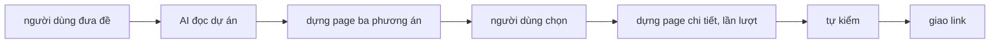
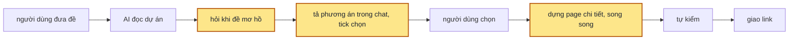

> **Nối tiếp:** [001](001-design-uiux.md) — dựng xong skill: thanh nút, token, lệnh tự kiểm, chạy thử ba đề. Plan này sửa cách chọn phương án, thêm bước hỏi khi đề mơ hồ.
> **Lật:** D2 · D16 · D18 của [001](001-design-uiux.md) (phần page Options). **Giữ:** mọi D còn lại, gồm D21 (mỗi phương án một page, góp ý sửa thẳng page đó).

## 1. Problem

Đề có nhiều hướng thì skill dựng một page Options đủ ba phương án thật. Page này tốn công ngang một page
chi tiết mà người dùng chỉ xem một lần để chọn. Ba phương án lại được chọn theo hình dáng, không theo
việc người dùng cần làm. Ở đề quota, lưới tuần × ngày và biểu đồ chồng các tuần cùng trả lời một câu
"thói quen dùng ra sao", còn câu hay gặp nhất, "tuần này còn đủ tới reset không", thì không phương án
nào trả lời. Đề nói mơ hồ thì skill tự đoán rồi dựng luôn, tới lúc giao mới báo đã đoán gì. Người dùng
chọn hai ba phương án thì các page được dựng lần lượt từng cái một.

## 2. Goal

- Đề còn mơ hồ (chưa rõ ai dùng, dùng lúc nào, có dữ liệu gì) thì skill hỏi trước khi vẽ. Mỗi câu hỏi
  có sẵn đáp án để chọn, đáp án khuyên dùng đứng đầu, hỏi tới khi đủ rõ. Thứ đọc được từ dự án thì
  skill không hỏi.
- Đề có nhiều hướng thì skill tả 2–3 phương án ngay trong cuộc trò chuyện: các tình huống dùng của đề,
  mỗi phương án trả lời nhanh nhất tình huống nào và chịu chậm ở đâu, kèm một bản phác bằng chữ.
  Người dùng tick chọn từ 1 tới 3 phương án. Không còn page Options.
- Không hai phương án nào chỉ khác nhau ở bố cục, độ dày hay màu. Khác ở những thứ đó thì là một nút
  cấu hình trên thanh của cùng một page.
- Các phương án được chọn được dựng cùng lúc, mỗi phương án một page trong cùng thư mục. Các page dùng
  chung một bộ dữ liệu giả và cùng nút dữ liệu, nên đặt cạnh nhau là so được trên cùng con số.
- Page giao ra vẫn qua lệnh tự kiểm như trước, thêm phép kiểm các page cùng thư mục có chung nút dữ liệu.
- Mỗi thư mục design có một bản tóm tắt chung, mở ra là thấy ngay: đề tóm trong vài dòng, mọi quyết định đã
  chốt kèm ai quyết (người dùng chọn, tự trả lời khi chạy `--auto`, hay AI tự đoán), design system đang dùng, và
  danh sách page (đã dựng hay còn chờ chọn). Thêm page ở vòng sau thì danh sách này đổi theo.
- Trên thanh, các page của một thư mục hiện thành nút A, B, C theo phương án; đưa chuột (hay chạm giữ) vào một nút thì
  hiện mô tả ngắn: phương án đó trả lời câu hỏi gì, nhìn theo đơn vị nào, chịu chậm ở đâu.
- Gọi skill kèm `--auto` thì skill không dừng hỏi gì: câu hỏi làm rõ tự lấy đáp án khuyên dùng, bước chọn
  phương án tự chọn tất cả. Lúc giao, skill kể lại mọi thứ đã tự chọn.

**Ngoài scope:** các cải tiến khác của skill sẽ được thêm vào plan này thành phase mới, mỗi lần một nhóm;
những gì chưa có dòng ở §2 thì chưa thuộc plan.

## 3. Mental model

**Bây giờ chạy thế nào**: người dùng đưa đề. AI đọc dự án rồi dựng một page có ba phương án thật, giao
link và chờ. Người dùng mở page, xem, rồi nhắn chọn A hay B. AI dựng page chi tiết cho phương án đó,
chọn thêm phương án thì dựng tiếp page sau, lần lượt từng page. Mỗi page qua lệnh tự kiểm rồi mới giao.



**Sau plan chạy thế nào**: cùng đường đó, khác ba chỗ.
- Đề mơ hồ thì AI hỏi vài câu có sẵn đáp án trước.
- Thay cho page ba phương án, AI tả các phương án ngay trong cuộc trò chuyện, theo các tình huống dùng
  của đề, rồi cho tick chọn 1–3 phương án.
- AI soạn sẵn một bản tóm tắt chung (đề, dữ liệu giả, nút dữ liệu), giao mỗi phương án cho một agent
  con, các agent con dựng cùng lúc.

Người dùng chọn đúng thứ mình cần ngay trong cuộc trò chuyện, không phải chờ một page chỉ để chọn.



**Hành vi đổi ra sao**

| #     | Tình huống | Bây giờ | Sau plan |
| ----- | ---------- | ------- | -------- |
| `BH1` | Đề có nhiều cách hiển thị | Page có ba phương án thật, mở page xem rồi nhắn chọn | Chat tả 2–3 phương án theo tình huống dùng, kèm bản phác bằng chữ; tick chọn 1–3 |
| `BH2` | Hai hướng chỉ khác nhau ở bố cục (lưới hay danh sách, thoáng hay gọn) | Thành hai phương án riêng | Gộp thành một phương án, khác biệt thành nút cấu hình trên thanh |
| `BH3` | Đề mơ hồ | AI tự đoán, lúc giao mới báo đã đoán gì | AI hỏi vài câu có sẵn đáp án, đủ rõ mới tả phương án |
| `BH4` | Chọn hai hay ba phương án | Dựng lần lượt từng page | Dựng cùng lúc; các page cùng số liệu, cùng nút dữ liệu |
| `BH5` | Xem xong muốn thêm một phương án chưa chọn | Page mới dựng từ page ba phương án | AI nhắc lại các phương án còn lại, tick thêm, có thêm một page; page cũ không đổi |
| `BH6` | Đề chỉ có một hướng hợp lý | Vào thẳng page chi tiết | Không đổi: không hỏi chọn phương án, vào thẳng page chi tiết |
| `BH8` | Mở lại một thư mục design sau vài ngày, muốn biết đã chốt gì | Không có chỗ nào ghi; phải đọc lại cuộc trò chuyện | Mở bản tóm tắt: bốn mục đầu là đề tóm tắt, các quyết định và ai quyết, design system, danh sách page |
| `BH9` | Đang xem page A, muốn sang B và nhớ B khác A ở đâu | Mở menu thả xuống, đọc tên page | Bấm nút B trên thanh; đưa chuột vào B là thấy câu hỏi trung tâm và cái hy sinh của B |
| `BH7` | Chạy thử skill, không muốn ngồi trả lời | Phải chờ chọn trên page Options | Gọi kèm `--auto`: không câu hỏi nào, dựng hết các phương án; tin giao kể các câu đã tự trả lời |

**Không đụng:** thanh nút trên page, cách lấy token và suy ra sáng tối, các phép kiểm bố cục của lệnh tự
kiểm, page chi tiết đã giao ở các lần chạy trước.

---

## 4. Probe

### P1 — Hai lệnh tự kiểm chạy cùng lúc trên hai page của cùng một thư mục design có giẫm nhau không?

**Biết để làm gì:** không giẫm thì mỗi agent con tự kiểm page của mình ngay khi dựng xong; giẫm (ảnh ghi
đè, Chrome tranh nhau) thì chỉ agent chính được kiểm, sau khi mọi agent con xong.
**Cách chạy lại:** chạy song song `check.mjs` trên `02-week-timeline.html` và `03-week-grid.html` của
`.test/design-uiux/003-quota-timeline/.design/001-quota-timeline/`
**Kết quả:** không giẫm. Hai lượt cùng exit 0 (318 và 312 tổ hợp), tổng 57 giây; ảnh của hai page tên
khác nhau trong cùng `shots/`. — 2026-10-06, Chrome 154

## 5. Decisions

**Ai quyết:** 🤖 = agent tự quyết, chưa hỏi ai — **chỗ người duyệt phải soi** · 👤 = user chốt lúc bàn (luật 22).

### D0 👤 — Bỏ page Options: phương án tả trong chat, người dùng tick chọn 1–3 bằng câu hỏi chọn nhiều

**Lý do:** page Options tốn công như một page chi tiết mà chỉ xem một lần. Lật D2 · D18 của 001. → DS2
**Phương án đã loại:** giữ page Options mà dựng sơ sài: vẫn phải chờ một vòng giao link chỉ để chọn.

### D1 👤 — Tối đa 3 phương án, khác nhau rõ ràng theo một phương pháp; khác bố cục là nút cấu hình, không phải phương án

**Lý do:** người dùng chốt lúc bàn: đổi bố cục một chút thì thanh nút đã làm được. → DS2

### D2 🤖 — Phương án tìm từ tình huống dùng: mỗi phương án lấy một câu hỏi của người dùng làm trung tâm, qua ba phép thử

**Lý do:** đề quota cho thấy chọn theo hình dáng sẽ ra hai phương án trùng câu hỏi và bỏ sót câu hay gặp
nhất; bảng tình huống × phương án bắt được cả hai. → DS2
**Phương án đã loại:** liệt kê kiểu hiển thị (timeline, lưới, biểu đồ) rồi chọn ba, vì đó là cách đã ra bộ trùng.

### D3 🤖 — Mỗi phương án trong chat có bản phác bằng chữ, câu hỏi trung tâm, cái hy sinh, hợp khi; câu hỏi tick chỉ giữ tên và một dòng

**Lý do:** câu hỏi chọn nhiều không hiện được bản phác bên cạnh đáp án, nên phần nhìn phải nằm trong chat
ngay trước câu hỏi. Khối "Đang có gì" của đề cải thiện cũng chuyển vào đây (lật D16 của 001). → DS2

### D4 👤 — Đề mơ hồ thì hỏi bằng câu có sẵn đáp án để chọn, tới khi đủ rõ

**Lý do:** người dùng chốt lúc bàn. → DS3

### D5 🤖 — "Đủ rõ" là viết được 3 tình huống dùng và biết dữ liệu có gì; mỗi lượt ≤ 4 câu, tối đa 3 lượt, hết lượt mà còn mơ hồ thì ghi giả định

**Lý do:** cần một điểm dừng đo được, không thì hỏi mãi; ba lượt mà chưa rõ thì đoán có ghi lại vẫn tốt
hơn bắt người dùng trả lời tiếp. → DS3

### D6 👤 — Mỗi phương án được chọn do một agent con dựng, các agent con chạy song song

**Lý do:** người dùng chốt lúc bàn: chọn ba phương án không phải chờ ba lượt nối nhau. → DS5

### D7 🤖 — Agent chính dựng trước thư mục, page trống của từng phương án và `brief.md`; agent con chỉ sửa page của mình, tự kiểm page đó; agent chính kiểm cả thư mục rồi giao

**Lý do:** dựa vào `P1`: hai lượt kiểm song song không giẫm nhau. → DS4 · DS5
**Phương án đã loại:** mỗi agent con tự tạo page: các agent tranh nhau ghi `pages.js`, số page trùng nhau.

### D8 🤖 — Mọi page trong một thư mục khai cùng bộ nút dữ liệu (cùng `key` variables); `check.mjs` kiểm

**Lý do:** §2 hứa so các phương án trên cùng con số; mỗi agent con tự đặt nút thì mất điều đó. → DS6

### D9 🤖 — Thư mục design của các lần chạy trước không kiểm lại bằng `check.mjs` mới

**Lý do:** thư mục cũ có page Options, mà `check.mjs` mới không còn hiểu loại page này. Các thư mục đó
chỉ nằm trong `.test/`, giữ để so với lần chạy mới. → DS6

### D10 👤 — Cờ `--auto`: câu hỏi làm rõ tự lấy đáp án khuyên dùng, chọn phương án thì chọn tất cả, mọi lựa chọn tự động ghi vào `## Giả định`

**Lý do:** người dùng chốt giữa lúc làm, để chạy thử skill mà không phải ngồi trả lời. → DS8

### D11 👤 — `brief.md` xếp lại: bốn mục đầu cho người đọc (tóm tắt đề, quyết định kèm ai quyết, design system, pages), bốn mục sau cho agent con

**Lý do:** người dùng chốt sau lượt chạy thử: quyết định đang rải ở ba mục, không nhìn một chỗ mà thấy. → DS9

### D12 👤 — Menu page trên thanh thành nút A B C; đưa chuột vào hiện mô tả phương án

**Lý do:** người dùng chốt khi xem page: tên page dài mà không nói phương án khác nhau ở đâu. → DS10

## 6. Design

### DS1 — Cấu trúc file skill (cũ → mới)

| File | Cũ | Mới |
| ---- | -- | --- |
| `SKILL.md` | Bước 2 quyết page Options · 3a page Options · 3b page Details | Bước 2 hỏi khi mơ hồ (DS3) · 3 chọn phương án (DS2) · 4 dựng song song (DS5) · 5 kiểm · 6 giao |
| `templates/options.html` | khuôn page Options | **xoá** |
| `templates/brief.md` | — | khuôn bản tóm tắt chung (DS4) |
| `templates/details.html` | khuôn page Details | không đổi |
| `scripts/new-design.mjs` | `page … --kind options\|details [--from]` | `page … --title [--option "<một dòng>"] [--note]`; `init` chép `brief.md` |
| `shell/shell.js` | menu page ghi "Options/Details · ngày · từ <file>" | menu page ghi "<option> · ngày" |
| `scripts/check.mjs` | có nhánh kiểm page Options | bỏ nhánh đó; thêm phép kiểm ở DS6 |

### DS2 — Chọn phương án

**Phương pháp** (D2):

1. Liệt kê 3–5 **tình huống dùng** thật trong đề: ai, lúc nào, muốn biết hay làm gì.
2. Rút **câu hỏi chính** của từng tình huống.
3. Mỗi phương án chọn một câu hỏi làm trung tâm và khai ba thứ: **câu hỏi trung tâm** (lên đầu, chiếm chỗ
   lớn nhất) · **đơn vị chính** người dùng nhìn vào (tuần, session, ngày, người…) · **cái hy sinh** (câu
   hỏi nào trả lời chậm đi).
4. Bảng **tình huống × phương án**, mỗi ô `nhanh` / `được` / `chậm`.
5. Ba phép thử, trượt phép nào thì xử lý ngay:

| Phép thử | Trượt khi | Xử lý |
| -------- | --------- | ----- |
| tweak | B dựng được từ A bằng một nút trên thanh (bố cục, độ dày, grid/list, đổi loại biểu đồ trên cùng dữ liệu) | B thành tweak của A |
| thắng | phương án không `nhanh` ở tình huống nào | bỏ |
| trùng | hai phương án `nhanh` ở cùng nhóm tình huống, hay cùng hy sinh một thứ | gộp |

Còn 2–3 phương án thì hỏi người dùng chọn. Còn 1 thì vào thẳng bước dựng, không hỏi.

**Trong chat, trước câu hỏi** (D3), theo thứ tự:
- dòng `Đọc:`;
- đề cải thiện thì thêm khối "Đang có gì": hiện trạng, chỗ đang vướng;
- bảng tình huống × phương án;
- mỗi phương án một khối: tên, bản phác bằng chữ ≤ 10 dòng, câu hỏi trung tâm, đơn vị chính, cái hy
  sinh, hợp khi.

**Câu hỏi** (AskUserQuestion): `multiSelect: true`, mỗi phương án là một đáp án, `label` là tên ≤ 5 chữ,
`description` là câu hỏi trung tâm. Phương án thắng tình huống hay gặp nhất đứng đầu, kèm "(Khuyên dùng)".
- Không tick gì thì hỏi lại một lần.
- Chọn "Other" kèm chữ thì đọc như góp ý: sửa phương án rồi hỏi lại.

### DS3 — Hỏi khi đề mơ hồ

**Mơ hồ** khi một trong hai điều sau còn chưa trả lời được từ đề hay từ dự án (D5):
- viết được 3 tình huống dùng chưa (ai dùng, lúc nào, để làm gì);
- dữ liệu có gì (thực thể, trường, đơn vị, khoảng giá trị).

| Luật | Giá trị |
| ---- | ------- |
| số câu mỗi lượt | ≤ 4, một lần gọi AskUserQuestion |
| đáp án mỗi câu | 2–4, đáp án khuyên dùng đứng đầu, ghi "(Khuyên dùng)" |
| không hỏi | thứ đọc được từ dự án; thứ có mặc định hợp lý (ghi mặc định lúc giao) |
| hỏi gì trước | câu nào đổi bộ tình huống, rồi tới câu đổi dữ liệu, cuối cùng mới tới chi tiết |
| điểm dừng | đủ rõ theo định nghĩa trên, hoặc hết 3 lượt; hết lượt thì ghi giả định vào `brief.md` và lúc giao |

### DS4 — `brief.md` của thư mục design

`new-design.mjs init` chép khuôn `templates/brief.md`; agent chính điền trước khi giao cho agent con. Mục bắt buộc:

| Mục | Nội dung |
| --- | -------- |
| `## Đề` | đề gốc, cộng các câu trả lời lúc hỏi (DS3) |
| `## Đọc` | design system, màn hiện có, component vẽ theo |
| `## Tình huống` | bảng tình huống × phương án (DS2) |
| `## Phương án` | mỗi phương án: tên, file page, câu hỏi trung tâm, đơn vị chính, cái hy sinh; ghi rõ phương án nào đã chọn |
| `## Dữ liệu chung` | thực thể, số lượng, giá trị mẫu, ca biên; mọi page sinh dữ liệu giả theo mục này |
| `## Nút dữ liệu chung` | bảng `key` · `type` · khoảng · `default` của variables, có `state` và các giá trị của nó |
| `## Giả định` | những gì đã đoán thay người dùng |

Khuôn có chỗ trống dạng `<…>`. Còn chỗ trống nào thì `check.mjs` báo lỗi (DS6).

**Đổi (2026-10-06):** bảng mục ở trên thay bằng khung của DS9; luật chỗ trống `<…>` giữ nguyên.

**Đổi (2026-10-06):** khuôn thêm mục `## Số kiểm chéo ở mặc định` (3–5 con số agent chính tự tính). Ở đề 01, hai agent
con đọc cùng công thức "% session đã dùng" mà có thể ra 81% hay 6% tuỳ cách hiểu session đang chạy; con số cụ thể chốt
cách hiểu. Mục này không nằm trong danh sách mục bắt buộc của `check.mjs`, để brief của các lượt chạy trước vẫn hợp lệ.

### DS5 — Dựng song song

```
agent chính: init → điền brief.md → page cho từng phương án đã chọn (--option) → gọi N agent con trong một lượt
agent con k: đọc SKILL.md bước dựng + brief.md → sửa đúng file page của phương án k → check.mjs <page k> tới khi sạch
agent chính: đợi đủ N → check.mjs <thư mục> → mở ảnh → giao
```

- Lời giao cho agent con gồm: đường dẫn `SKILL.md`, `brief.md` và file page của nó; tên phương án; luật
  "chỉ sửa file này".
- Chỉ một phương án thì agent chính tự dựng, không gọi agent con.
- Chọn thêm phương án ở vòng sau: thêm page bằng `--option`, cập nhật mục `## Phương án`, gọi một agent con.

### DS6 — `pages.js` và `check.mjs`

`pages.js`, mỗi phần tử:

| field | bắt buộc | cũ → mới |
| ----- | -------- | -------- |
| `file` · `title` · `updated` | ✓ | giữ |
| `kind` | | bỏ |
| `from` | | bỏ |
| `option` | | mới: tên phương án và câu hỏi trung tâm, một dòng |
| `note` | | giữ |

`check.mjs`:

| Lượt | Phép kiểm | Cũ → mới |
| ---- | --------- | -------- |
| tĩnh | `pages.js` đủ `file` · `title` · `updated`; `file` tồn tại | bỏ `kind`, `from` |
| tĩnh | có `brief.md`, không còn chỗ trống `<…>`, đủ các mục ở DS4 | mới |
| trình duyệt | mọi page có `state` đủ `data` · `loading` · `empty` · `error` | trước chỉ page Details |
| trình duyệt | kiểm cả thư mục: mọi page khai cùng bộ `key` variables | mới (D8) |
| trình duyệt | hợp đồng page Options | bỏ |
| trình duyệt | lượt bấm gộp thứ bấm được theo khối, thẻ, class, hàm xử lý | thêm nhãn khi nhãn ≤ 16 chữ cái |

**Đổi (2026-10-06):** thêm dòng cuối. Ở đề mơ hồ, nút "Đổi hạn" cùng class và cùng hàm xử lý với "Gỡ chặn" nên lượt
bấm chỉ bấm "Gỡ chặn", modal Đổi hạn chưa bao giờ được đo. Nhãn ngắn là hành động khác nhau; nhãn dài (tên việc,
dòng bảng) vẫn gộp.

### DS7 — Test Strategy

| Fixture | Thư mục chạy thử | Kiểm cái gì |
| ------- | ---------------- | ----------- |
| Đề 01 `.refer/design-requirement-01.md` | `.test/design-uiux/007-quota-pick/` | không có page Options; bảng tình huống trong chat; người dùng tick ≥ 2 phương án, các agent con dựng cùng lúc |
| Đề 02 `.refer/design-requirement-02.md` | `.test/design-uiux/008-insights-pick/` | khối "Đang có gì" trong chat; repo dự án không đổi |
| Đề mơ hồ "Làm trang báo cáo cho team" | `.test/design-uiux/009-vague-report/` | skill hỏi trước khi tả phương án; câu nào cũng có đáp án sẵn |
| Đề 03 "Dựng màn cài đặt thông báo: ba công tắc email, push, tin nhắn, một nút lưu" | `.test/design-uiux/010-notify-one/` | không hỏi gì, vào thẳng dựng một page |
| Đề mơ hồ trên, chạy với `--auto` | `.test/design-uiux/012-vague-auto/` | không câu hỏi nào; dựng đủ mọi phương án; `## Giả định` ghi từng câu đã tự trả lời |
| Bản gài lỗi | `.test/design-uiux/011-check-planted/` | `brief.md` còn chỗ trống; hai page khác bộ nút dữ liệu; page thiếu `state`: mỗi lỗi `check.mjs` bắt một dòng |

### DS8 — Cờ `--auto`

Bật khi lời gọi skill có `--auto` (`/design-uiux --auto <đề>`), hay người dùng nói rõ "tự chọn hết, đừng hỏi".

| Chỗ thường dừng hỏi | Có `--auto` |
| ------------------- | ----------- |
| Hỏi khi đề mơ hồ (DS3) | vẫn soạn đủ câu hỏi và đáp án như khi hỏi thật, nhưng không gọi AskUserQuestion: lấy đáp án khuyên dùng của từng câu, coi như một lượt trả lời |
| Chọn phương án (DS2) | vẫn in bảng tình huống và từng phương án như khi hỏi thật, rồi chọn tất cả các phương án qua ba phép thử |

- Mỗi câu đã tự trả lời ghi vào `## Giả định` của `brief.md`: `Hỏi: <câu> → tự chọn: <đáp án> (--auto)`.
  **Đổi (2026-10-06):** ghi thành một dòng trong bảng `## Quyết định` với cột "Ai quyết" là `--auto` (DS9).
- Tin giao có một dòng "Chạy `--auto`" kèm danh sách đó, để người dùng sửa bằng góp ý vòng sau.
- Mọi bước khác, gồm tự kiểm và giao, giữ nguyên.

### DS9 — Khung `brief.md`

| Mục | Bắt buộc | Nội dung |
| --- | -------- | -------- |
| `## Tóm tắt đề` | ✓ | 2–4 dòng: màn gì, cho ai, để làm gì |
| `## Quyết định` | ✓ | bảng `Câu hỏi` · `Chọn` · `Ai quyết`; mọi câu hỏi làm rõ, bước chọn phương án, mọi giả định |
| `## Design system` | ✓ | nguồn token, giao diện gốc và suy ra, font thay, component vẽ theo |
| `## Màn hiện có` | chỉ đề cải thiện | các khối đang có, chỗ đang vướng (khối "Đang có gì" đã in ra chat) |
| `## Pages` | ✓ | bảng `File` · `Phương án` · `Câu hỏi trung tâm` · `Đơn vị chính` · `Hy sinh` · `Trạng thái`; phương án chưa chọn cũng có dòng, `File` là `—` |
| `## Tình huống` | ✓ | bảng tình huống × phương án |
| `## Dữ liệu chung` | ✓ | như DS4 |
| `## Nút dữ liệu chung` | ✓ | như DS4 |
| `## Số kiểm chéo ở mặc định` | ✓ | 3–5 con số agent chính tự tính |
| `## Đề gốc` | ✓ | đề nguyên văn |

`check.mjs` (tĩnh), thêm vào phép kiểm `brief.md` của DS6:

| Phép kiểm | Báo lỗi khi |
| --------- | ----------- |
| đủ mục | thiếu một mục bắt buộc ở bảng trên |
| cột "Ai quyết" | ô không phải `người dùng`, `--auto` hay `AI đoán` |
| bảng `## Pages` khớp `pages.js` | file trong `pages.js` không có dòng, hay dòng có file mà `pages.js` không có |

### DS10 — Nút phương án trên thanh

`pages.js`, thêm vào bảng của DS6:

| field | bắt buộc | Nội dung |
| ----- | -------- | -------- |
| `option` | khi thư mục có ≥ 2 page | `"<chữ> · <tên phương án>"`, ví dụ `"A · Dự báo tuần"` |
| `question` | khi có `option` | câu hỏi trung tâm |
| `unit` | | đơn vị chính |
| `tradeoff` | | cái hy sinh |

`new-design.mjs page … --option "A · <tên>" --question "<…>" [--unit "<…>"] [--tradeoff "<…>"]`.

| Thanh | Hiện gì |
| ----- | ------- |
| thư mục 1 page | tên page, không có nút chữ |
| ≥ 2 page | nút chữ (A, B, C) của mọi page, nút của page đang mở được tô; cạnh đó là tên phương án đang mở |
| đưa chuột, focus bằng Tab, hay chạm giữ một nút | khung nhỏ: `option`, `question`, đơn vị chính và hy sinh nếu có, ngày sửa và góp ý cuối nếu có |
| bấm một nút | sang page đó, giữ `kho` và `theme` |

`check.mjs`: thư mục ≥ 2 page thì page nào cũng có `option` bắt đầu bằng một chữ cái không trùng page khác, và có `question`.

## 7. Phases

**Legend:** 🤖 = agent tự kiểm được (chạy lệnh, test, grep) · 👤 = cần người kiểm (số đo thật, UI, hạ tầng).

- [x] 👤 plan này được duyệt — 2026-10-06, Andy: "oke triển khai đi"

### Phase 1 — script và lệnh tự kiểm theo luồng mới

**Goal:** `new-design.mjs` tạo thư mục có `brief.md` và page có `option`; `check.mjs` bắt được ba lỗi mới.
**Cover:** DS4 · DS6

**Actions:**

- [x] 🤖 `templates/brief.md` theo DS4 (D7) — 2026-10-06, bảy mục, chỗ trống dạng `<…>`
- [x] 🤖 `new-design.mjs`: `init` chép `brief.md`; `page` bỏ `--kind`, `--from`, thêm `--option` (D7) — 2026-10-06; lượt chạy đề 01 lộ thêm lỗi cũ: gọi qua symlink `.claude/skills/` thì script không làm gì mà vẫn exit 0 (so `argv[1]` với đường thật), đã sửa bằng `realpathSync`
- [x] 🤖 `shell/shell.js`: menu page ghi `option` · ngày — 2026-10-06
- [x] 🤖 `check.mjs`: bỏ nhánh page Options; kiểm `brief.md`; kiểm `state` trên mọi page; kiểm cùng bộ `key` variables (D8, D9) — 2026-10-06; bộ key lấy từ bảng "Nút dữ liệu chung" của `brief.md`, nên agent con kiểm riêng page của mình cũng bắt được; brief còn chỗ trống thì chưa so
- [x] 🤖 Xoá `templates/options.html` — 2026-10-06; khuôn `details.html` bỏ nhắc `--kind`
- [x] 🤖 Ba bản gài lỗi ở `.test/design-uiux/011-check-planted/` — 2026-10-06: `002-brief-blank` · `003-keys-differ` · `004-state-missing`

**Gate:**

- [x] 🤖 `init` + hai `page --option` → thư mục có `brief.md`, `pages.js` hai mục có `option`, không có `kind` — DS4 · DS6 — 2026-10-06, `011-check-planted/.design/001-members`
- [x] 🤖 Ba bản gài lỗi → mỗi bản exit 1, đúng một dòng lỗi nói đúng chỗ — DS6 — 2026-10-06: `brief.md [dòng 8, dòng 12, dòng 16]: còn chỗ trống chưa điền` · `02-members-activity.html: variables khác bảng "Nút dữ liệu chung" của brief.md: thiếu longNames` · `01-members-list.html: variable state thiếu: error`; log `011-check-planted/*.check.log`
- [x] 🤖 Hai page mẫu điền đủ `brief.md` → `check.mjs` exit 0 — 2026-10-06, `✓ 2 page · 288 tổ hợp · 0 lỗi`

### Phase 2 — `SKILL.md` theo luồng mới

**Goal:** đọc `SKILL.md` là biết khi nào hỏi, chọn phương án ra sao, giao việc cho agent con thế nào.
**Cover:** DS1 · DS2 · DS3 · DS5 · DS8

**Actions:**

- [x] 🤖 `SKILL.md`: mental model, bảng file, lệnh; bước 2 hỏi khi mơ hồ (D4, D5); bước 3 chọn phương án (D0, D1, D2, D3); bước 4 dựng song song kèm mẫu lời giao cho agent con (D6, D7); bước 5 kiểm, bước 6 giao; vòng sau; frontmatter `description` không còn nhắc page Options — 2026-10-06, bước 1–6 + vòng sau + bẫy (thêm hai dòng)
- [x] 🤖 `SKILL.md`: cờ `--auto` theo DS8 (D10) — 2026-10-06, mục "Cờ `--auto`" ngay dưới bảng lệnh
- [x] 🤖 `README.md`: dòng `design-uiux` khớp luồng mới — 2026-10-06

**Gate:**

- [x] 🤖 `grep -n "Options\|options.html\|--kind" skills/design-uiux/` → 0 dòng — DS1 — 2026-10-06, 0 dòng
- [x] 🤖 `SKILL.md` có bảng ba phép thử, định nghĩa "mơ hồ" và điểm dừng, mẫu lời giao cho agent con — DS2 · DS3 · DS5 — 2026-10-06, bước 3 bảng phép thử, bước 2 định nghĩa + bảng luật (điểm dừng 3 lượt), bước 4 khối "Lời giao cho mỗi agent con"
- [x] 🤖 `ls skills/design-uiux` khớp bảng DS1 — DS1 — 2026-10-06, 9 file: không còn `templates/options.html`, có `templates/brief.md`
- [x] 🤖 `SKILL.md` có bảng của DS8: hai chỗ dừng hỏi và cách `--auto` thay thế — DS8 — 2026-10-06

### Phase 3 — chạy thử theo DS7

**Goal:** năm lượt chạy của DS7 đi qua luồng mới, ra thư mục sạch `check.mjs`.
**Cover:** DS7

**Actions:**

- [x] 🤖 Đề 01 ở `007-quota-pick/`: người dùng tick phương án, các agent con dựng song song — 2026-10-06, người dùng chọn A và B; vòng sau thêm C
- [x] 🤖 Đề 02 ở `008-insights-pick/` — 2026-10-06, chat có khối "Đang có gì" + bảng T1–T4 × A, B, C; người dùng chọn B và C; hai agent con gọi cùng một lượt; số kiểm chéo khớp ($1,401.88 · tran.binh 31% · 4 account)
- [x] 🤖 Đề mơ hồ ở `009-vague-report/`: người dùng trả lời các câu hỏi — 2026-10-06, một lượt ba câu (Trưởng nhóm · Tiến độ công việc · Theo tuần), chọn A; một phương án nên agent chính tự dựng; `✓ 1 page · 162 tổ hợp · 0 lỗi`
- [x] 🤖 Đề 03 ở `010-notify-one/` — 2026-10-06, không câu hỏi nào; thân page lấy lại từ lượt `005` (cùng đề), thêm `brief.md`; `✓ 1 page · 88 tổ hợp · 0 lỗi`
- [x] 🤖 Đề mơ hồ chạy lại với `--auto` ở `012-vague-auto/` — 2026-10-06, ba agent con gọi cùng một lượt; số kiểm chéo khớp (23/37 · minh.tran 1 việc chặn)

**Gate:**

- [x] 🤖 Năm thư mục chạy đề → `check.mjs` exit 0, ghi số page, số tổ hợp — DS7 — 2026-10-06: `007` 3 page · 714 · `008` 2 page · 664 · `009` 1 page · 162 · `010` 1 page · 88 · `012` 3 page · 486; đều 0 lỗi, log `check.log` trong từng thư mục
- [x] 🤖 Đề 01: trước câu hỏi chọn, chat có bảng tình huống × phương án; không phương án nào trượt ba phép thử; không có page Options — BH1 · BH2 — 2026-10-06, `007/chat-pick.md`; mỗi phương án `nhanh` ở nhóm tình huống riêng (A: T1 T2 · B: T3 · C: T4)
- [x] 🤖 Đề 01: các agent con được gọi trong cùng một lượt; page của chúng có cùng bộ `key` variables — BH4 — 2026-10-06, hai lần gọi trong một tin; `check.mjs` không báo lệch bảng nút; số kiểm chéo khớp (50% · 81% · 36%)
- [x] 🤖 Đề mơ hồ: câu hỏi đầu tiên đến trước mọi bản phác; mỗi câu có 2–4 đáp án — BH3 — 2026-10-06, `009`: lượt hỏi một gồm 3 câu (3 · 4 · 3 đáp án) trước bảng tình huống; dừng sau một lượt vì viết được 4 tình huống
- [x] 🤖 Đề 03: không có câu hỏi chọn phương án, `pages.js` một mục — BH6 — 2026-10-06, `010`
- [x] 🤖 Đề 01 thêm một phương án chưa chọn → thêm đúng một page; `shasum` các page cũ không đổi — BH5 — 2026-10-06, thêm `03-habit-grid.html` bằng một agent con; `shasum -c sha-before-add-c.txt` → OK cả hai
- [x] 🤖 Đề 02: `git -C /Users/andy/Code/LLM-Proxy/ats-proxy-v2 status --short` trước và sau giống nhau — 2026-10-06, cả hai rỗng (`008/repo-status-{before,after}.txt`)
- [x] 🤖 Đề mơ hồ `--auto`: không lần gọi AskUserQuestion nào; số page bằng số phương án qua ba phép thử; `## Giả định` có một dòng `(--auto)` cho mỗi câu đã tự trả lời — DS8 · BH7 — 2026-10-06, `012`: 0 lần gọi, 3 page = 3 phương án, 4 dòng `(--auto)` (3 câu làm rõ + chọn phương án); `✓ 3 page · 486 tổ hợp · 0 lỗi`

### Phase 4 — `brief.md` khung mới

**Goal:** mở `brief.md` của một thư mục design là thấy đề tóm tắt, quyết định kèm ai quyết, design system, danh sách page.
**Cover:** DS9

**Actions:**

- [x] 🤖 `templates/brief.md` theo DS9 (D11) — 2026-10-06, 9 mục; `## Màn hiện có` chỉ thêm khi đề cải thiện một màn
- [x] 🤖 `check.mjs`: danh sách mục bắt buộc mới; kiểm cột "Ai quyết"; kiểm bảng `## Pages` khớp `pages.js` — 2026-10-06
- [x] 🤖 `SKILL.md`: các chỗ nhắc `## Đề`, `## Phương án`, `## Giả định` đổi theo khung mới; `--auto` ghi vào `## Quyết định` — 2026-10-06, bước 4 có bốn gạch tả bốn mục đầu
- [x] 🤖 Chuyển `brief.md` của `007`, `008`, `009`, `010`, `012` và các bản ở `011-check-planted/` sang khung mới — 2026-10-06; giữ nguyên ba mục cho agent con, viết lại mục cho người đọc; `008` có `## Màn hiện có`
- [x] 🤖 Hai bản gài lỗi mới ở `011-check-planted/`: `006-pages-mismatch` (bảng Pages thiếu một page), `007-who-decided` (ô "Ai quyết" ghi sai) — 2026-10-06

**Gate:**

- [x] 🤖 Năm thư mục chạy đề với brief khung mới → `check.mjs` exit 0 — DS9 · BH8 — 2026-10-06: 714 · 664 · 162 · 88 · 486 tổ hợp, đều 0 lỗi (`check-brief-v2.log` trong từng thư mục)
- [x] 🤖 Hai bản gài lỗi mới → mỗi bản exit 1, đúng một dòng lỗi; năm bản gài cũ vẫn ra đúng lỗi cũ — DS9 — 2026-10-06: `bảng ## Pages thiếu page có trong pages.js: 02-members-activity.html` · `cột "Ai quyết" … ghi "Andy"`; `001` sạch, `002`–`005` ra đúng lỗi cũ

### Phase 5 — nút phương án trên thanh

**Goal:** thanh của page có nút A B C, đưa chuột vào thấy mô tả phương án.
**Cover:** DS10

**Actions:**

- [x] 🤖 `new-design.mjs page`: nhận `--question`, `--unit`, `--tradeoff` (D12) — 2026-10-06
- [x] 🤖 `shell/shell.js` + `shell.css`: nút chữ thay menu thả xuống, khung mô tả khi hover, focus, chạm giữ (D12) — 2026-10-06, chỉ sửa `pagesMenuHtml` và rule `.ds-pages*`; phiên thêm `--page-width` sửa cùng hai file, hai bên báo nhau trước khi sửa
- [x] 🤖 `check.mjs`: kiểm `option` có chữ riêng và có `question` khi thư mục ≥ 2 page — 2026-10-06; số nút trên thanh đếm theo `[data-ds-option]`, thư mục một page cần 0 nút
- [x] 🤖 `SKILL.md`: lệnh `page` có ba cờ mới; bước 4 dùng — 2026-10-06; sơ đồ đầu file đổi sang mermaid theo `mermaid-diagram-design` (lint sạch, đã xem ảnh nền sáng và tối); frontmatter `description` viết dạng `>-` vì chuỗi `tweak: role` làm YAML lỗi
- [x] 🤖 Cập nhật `pages.js` và chép `_shell/` mới vào `007`, `008`, `012`; `009`, `010` một page cũng chép `_shell/` mới — 2026-10-06; kèm sinh lại `tokens.js` có `--max-width-page` và đổi khối ngoài cùng sang `max-w-page` để qua phép kiểm bề rộng trang mới (`008` dùng `full` theo `AppShell`, `010` dùng `42rem`)

**Gate:**

- [x] 🤖 Playwright trên `007`: thanh có 3 nút A B C, nút của page đang mở được tô; hover nút C → khung có câu hỏi trung tâm của C; bấm C → mở `03-habit-grid.html` giữ `theme=dark` — DS10 · BH9 — 2026-10-06, `007/gate-options.mjs` 12/12 ở 1280 (hover) và 375 (chạm giữ 600ms, không chuyển page)
- [x] 🤖 Thư mục `010` một page: không có nút chữ, thanh hiện tên page — DS10 — 2026-10-06, cùng script, "Cài đặt thông báo"
- [x] 🤖 Bản gài lỗi `011-check-planted/.design/008-option-letter` (hai page cùng chữ A) → exit 1, đúng một dòng — DS10 — 2026-10-06: `pages.js [01-members-list.html; 02-members-activity.html]: chữ A trùng với page khác`
- [x] 🤖 Năm thư mục chạy đề → `check.mjs` exit 0 — 2026-10-06: 714 · 664 · 162 · 88 · 486 tổ hợp, 0 lỗi (`check-options.log`)

### Phase 6 — nghiệm thu

**Goal:** mỗi bullet §2 có một lượt kiểm thật, kết quả ghi cạnh ô tick.
**Cover:** —

**Actions:**

- [x] 👤 Bạn trả lời câu hỏi của đề mơ hồ và tick phương án của đề 01, 02 như lúc dùng thật — 2026-10-06, Andy: đề 01 chọn A + B (vòng sau thêm C), đề 02 chọn B + C, đề mơ hồ trả lời Trưởng nhóm · Tiến độ công việc · Theo tuần rồi chọn A
- [ ] 👤 Bạn mở các page của đề 01 đặt cạnh nhau, so trên cùng con số

**Gate** — một dòng ứng một bullet §2:

- [ ] 👤 §2 bullet 1: đề mơ hồ được hỏi trước khi vẽ, câu nào cũng chọn được đáp án, không hỏi thứ có trong dự án — <ngày + ai xác nhận> · BH3
- [ ] 👤 §2 bullet 2: đề 01, 02 tả phương án trong chat theo tình huống dùng, tick được 1–3, không có page Options — <ngày + ai xác nhận> · BH1 · BH5 · BH6
- [ ] 👤 §2 bullet 3: không hai phương án nào chỉ khác bố cục — <ngày + ai xác nhận> · BH2
- [ ] 👤 §2 bullet 4: các page của đề 01 dựng cùng lúc, cùng số liệu, cùng nút dữ liệu — <ngày + ai xác nhận> · BH4
- [x] 🤖 §2 bullet 5: `check.mjs` trên năm thư mục chạy đề của DS7 → exit 0 — 2026-10-06, sau khi chuyển brief sang khung mới: 714 · 664 · 162 · 88 · 486 tổ hợp, 0 lỗi
- [ ] 👤 §2 bullet 6: mở `brief.md` của `007` và `012`, bốn mục đầu đủ đề tóm tắt, quyết định kèm ai quyết, design system, danh sách page — <ngày + ai xác nhận> · BH8
- [ ] 👤 §2 bullet 7: trên page của `007`, bấm qua lại A B C, đưa chuột vào từng nút đọc mô tả — <ngày + ai xác nhận> · BH9
- [ ] 👤 §2 bullet 8: chạy `--auto` không hỏi gì, tin giao kể đủ các câu đã tự trả lời — <ngày + ai xác nhận> · BH7
- [x] 🤖 `python3 ~/.claude/skills/write-plan/verify.py .docs/002-design-uiux-improve.md` — 0 ERROR — 2026-10-06, 0 ERROR · 0 WARN
