> **Nối tiếp:** [002](002-design-uiux-improve.md) — xong luồng hỏi khi đề mơ hồ, chọn phương án trong chat, dựng các page song song. Plan này lo phần 002 chưa đụng tới: page dựng ra trông thế nào.

## 1. Problem

Skill dạy chọn phương án nào và kiểm page có vỡ hay không, nhưng chưa có dòng nào nói thế nào là đẹp. Mỗi
agent con tự quyết cách dùng design system được đưa. Soi 28 page của các lần chạy thử trước, page nào lệnh tự
kiểm cũng báo sạch, vậy mà cả 28 page đều có chỗ nhích lệch vài pixel lẻ nằm ngoài thang khoảng cách (2px,
3px, 9px, 34px), 22 page kéo khối ra khỏi chỗ bằng số âm, và page Insights báo "sắp chạm trần" bằng màu cam
trang trí trong khi design system có sẵn màu cảnh báo.

## 2. Goal

- Mỗi nguyên tắc và giới hạn của skill tách hai phần: phần đo được do lệnh tự kiểm bắt, phần không đo được
  thành danh sách tự kiểm cho agent dựng page. Skill thêm luật mà luật đó chưa có kiểm thì lệnh tự kiểm dừng,
  báo skill lệch.
- Page phạm phần đo được thì lệnh tự kiểm báo lỗi kèm tên luật, chưa sạch thì không giao. Chạy lệnh trên các
  page chạy thử cũ, mọi lỗi báo ra đều là lỗi thật.
- Agent dựng page trả về danh sách tự kiểm, mỗi dòng đạt hay trượt; dòng còn trượt hiện trong tin giao.
- Design system nói rõ khác một giới hạn (tài liệu viết ra, hay component của dự án đang làm vậy) thì page
  theo design system, bản tóm tắt chung ghi giới hạn đã nhường kèm dẫn chứng, lệnh tự kiểm bỏ qua đúng giới
  hạn đó. Nguyên tắc thì design system không đè được.
- Lúc giao, skill nói giới hạn nào đã nhường cho design system, vì sao.

**Ngoài scope:** bộ design system mặc định của skill khi đề không đưa design system nào (để plan sau; plan này giữ bộ token dự phòng đang có). Không mượn thư viện component, bố cục mẫu từng loại màn, hay các luật chủ skill ui-ux đã chốt theo gu riêng.

## 3. Mental model

**Bây giờ chạy thế nào** — Người dùng chọn phương án xong, agent chính viết bản tóm tắt chung (đề, dữ liệu,
nút vặn) rồi gọi mỗi phương án một agent con. Agent con đọc phần "viết một page" và bản tóm tắt, viết page
bằng token của design system, chạy lệnh tự kiểm. Lệnh này chỉ đo chỗ vỡ: cuộn ngang, chữ đè chữ, khung nổi
lọt ra ngoài. Sạch thì giao link. Dùng màu nào cho việc gì, cỡ chữ nào, khoảng cách bao nhiêu là agent con tự
nghĩ, không có gì để bám, cũng không có gì bắt.


**Sau plan chạy thế nào** — Cùng đường đó, thêm bốn chỗ. Agent chính đọc design system, so với danh sách
giới hạn, ghi vào bản tóm tắt giới hạn nào design system nói khác. Agent con đọc bộ nguyên tắc và giới hạn
trước khi viết. Viết xong, nó đi danh sách tự kiểm cho những gì máy không đo được (màu có đúng nghĩa không,
câu chữ có nói được việc không), sửa chỗ trượt. Rồi lệnh tự kiểm đo mọi phần đo được của từng luật: tương
phản chữ, màu dùng đúng vai, cỡ chữ và khoảng cách trong thang, bóng, số nút chính mỗi khối, rê chuột có làm
xô chỗ không… Lệnh này bỏ qua giới hạn đã ghi là nhường. Lúc giao có thêm dòng giới hạn đã nhường và dòng tự
kiểm còn trượt.

```mermaid
flowchart LR
  A([người dùng chọn phương án]) --> B[agent chính viết bản tóm tắt chung] --> G[ghi giới hạn nào nhường design system]:::new --> R[agent con đọc nguyên tắc và giới hạn]:::new --> C[agent con dựng page] --> S[đi danh sách tự kiểm phần máy không đo]:::new --> D[lệnh tự kiểm: chỗ vỡ + mọi phần đo được]:::new --> E([giao link + giới hạn đã nhường + dòng tự kiểm còn trượt]):::new
  classDef new fill:#fde68a,stroke:#b45309,stroke-width:2px,color:#1b2230
```



**Hành vi đổi ra sao**

| #      | Tình huống | Bây giờ | Sau plan |
| ------ | ---------- | ------- | -------- |
| `BH1`  | Agent con nhích chữ lệch 2–3px cho thẳng icon | lệnh tự kiểm sạch | báo đúng dòng đó kèm tên luật, gợi ý giá trị trong thang |
| `BH2`  | Kéo khối ra khỏi chỗ bằng số âm để căn giữa hay tràn mép | sạch | báo, trừ khi ngay trên dòng có ghi chú lý do; điểm bắt đầu của hiệu ứng trượt vào thì không báo |
| `BH3`  | Card trong trang có bóng, design system không nói gì về bóng | sạch | báo: bóng chỉ cho lớp nổi |
| `BH4`  | Card có bóng, tài liệu design system viết rõ card nổi bằng bóng | sạch | không báo; bản tóm tắt ghi giới hạn bóng đã nhường, kèm câu trích |
| `BH5`  | Núm công tắc, tab đang chọn trong nhóm nút có bóng nhỏ; ô nhập có viền sáng khi bấm vào | sạch | vẫn sạch |
| `BH6`  | Báo "sắp chạm trần" bằng màu phụ của design system, ngoài biểu đồ | sạch | báo: màu phụ chỉ cho biểu đồ, trạng thái dùng màu trạng thái |
| `BH7`  | Chữ xám nhạt trên nền xám, ở giao diện tối do skill suy ra | sạch | báo tỉ lệ tương phản đo được và mức tối thiểu |
| `BH8`  | Hai nút tô màu nhấn trong cùng một khối | sạch | báo: mỗi khối một nút chính |
| `BH9`  | Rê chuột vào một tab làm cả hàng tab xô đi 1px | sạch | báo phần tử bị xô và số px |
| `BH10` | Tô xanh cho chi phí tăng (máy không biết số đó tốt hay xấu) | không ai nhắc | agent con đi dòng "màu đúng nghĩa" trong danh sách tự kiểm; còn trượt thì tin giao nêu ra |
| `BH11` | Người sửa skill thêm một luật mà quên viết kiểm cho phần đo được | không ai biết | lệnh tự kiểm dừng ngay, báo luật nào chưa có kiểm |
| `BH12` | Lúc giao link | không nói gì về cách dùng design system | thêm dòng giới hạn đã nhường và dòng tự kiểm còn trượt |

**Không đụng:** cách hỏi khi đề mơ hồ, cách tìm và chọn phương án, shell (toolbar, panel), bộ token dự phòng, page của các lần chạy thử cũ.

---

## 4. Probe

### P1 — Các page chạy thử cũ có bao nhiêu chỗ phạm kiểm tĩnh sắp thêm, và có chỗ nào không sửa được không?

**Biết để làm gì:** gần như page nào cũng phạm mà mỗi chỗ đều sửa được thì kiểm làm lỗi chặn giao được; có loại không sửa được trong thang thì phải làm cảnh báo hay thêm ngoại lệ
**Cách chạy lại:** danh sách page: `find .test/design-uiux -name '[0-9][0-9]-*.html' -not -path '*/_shell/*' -not -path '*check-planted*' -not -name '*options*'`; đếm bằng `grep -ohE '(^|[ "'"'"'])(text|p[trblxy]?|m[trblxy]?|gap(-[xy])?|space-[xy]|rounded(-[a-z]+)?|shadow|leading|tracking)-\[[^]]+\]'` và `grep -ohE '(^|[ "'"'"'])-(m[trblxy]?|space-[xy]|translate-[xy]|inset(-[xy])?|top|left|right|bottom)-[0-9a-z./]+'` trên danh sách đó; bóng thì `grep -n shadow` rồi đọc từng chỗ
**Kết quả:** 28 page của 13 lần chạy, 2026-10-06. Giá trị tự đặt: 28/28 page, nhiều nhất `mt-[2px]` 36 chỗ, `py-[2px]` 33, `mt-[3px]` 23, `gap-[2px]` 13; chỗ nào cũng có class trong thang thay được (`py-0.5`, `gap-0.5`) hay là nhích để căn, đổi sang `items-*`/`leading` được. Số âm: 22/28 page, `-translate-x-1/2` 31, `-translate-y-1/2` 24, `-inset-y-1` 12, `-mx-xs` 4; 8 chỗ nằm trong thuộc tính `x-transition` (điểm bắt đầu trượt vào). Bóng trong trang: `shadow-sm` trên núm công tắc (page notify) và tab đang chọn của nhóm nút (page members); còn lại nằm trên modal, panel, toast

## 5. Decisions

**Ai quyết:** 🤖 = agent tự quyết, chưa hỏi ai — **chỗ người duyệt phải soi** · 👤 = user chốt lúc bàn (luật 22).

### D0 👤 — Mượn nguyên tắc và giới hạn của ui-ux; không mượn component mẫu, bố cục mẫu, luật chủ skill ui-ux đã chốt

**Lý do:** nguyên tắc và giới hạn đúng với design system nào cũng được; component, bố cục và luật đã chốt gắn với bộ token và gu riêng của skill kia → DS2
**Phương án đã loại:** chép nguyên thư mục `references/` của ui-ux (~17k dòng) — cãi nhau với design system được đưa, agent con không đọc hết

### D1 👤 — Thứ tự ưu tiên: nguyên tắc > design system > giới hạn

**Lý do:** nguyên tắc là đúng sai (tương phản, màu nói trạng thái), giới hạn là gu mặc định; design system được đưa phải thắng gu của skill. ui-ux cũng cho phong cách của dự án đè gu nhưng không đè nguyên tắc → DS2 · DS3

### D2 🤖 — Design system "nói rõ khác" một giới hạn chỉ khi tài liệu design system viết ra hay component dự án đang làm vậy; chỉ có token thì chưa đủ

**Lý do:** design system nào cũng khai token bóng, khai màu phụ; có token không có nghĩa là dùng cho card hay cho trạng thái
**Chi tiết:** agent chính ghi từng giới hạn nhường kèm câu trích hay đường dẫn component → DS4

### D3 🤖 — Nguyên tắc và giới hạn nằm ở một file mới `principles.md` trong skill; `SKILL.md` chỉ trỏ tới, agent con được giao đọc

**Lý do:** agent chính lúc hỏi và chọn phương án không cần phần này; agent con thì cần đủ → DS1
**Phương án đã loại:** chép vào mục "Viết một page" của `SKILL.md` — mỗi lượt gọi skill nạp thêm phần không dùng

### D4 🤖 — Bỏ hai thứ không hợp prototype: `N10` của ui-ux (skill lo hình, người dùng lo logic) và luật không vẽ vòng focus

**Lý do:** prototype giả lập logic bằng dữ liệu giả nên `N10` không áp được; luật vòng focus là gu chủ skill ui-ux chốt, không phải đúng sai → DS2

### ~~D5~~ — Lệnh tự kiểm thêm đúng ba kiểm: giá trị tự đặt ngoài thang, số âm không ghi chú, bóng trên khối trong trang

**Đổi (2026-10-06):** bỏ — user yêu cầu mọi phần đo được phải kiểm bằng code, thay bằng D8

### D6 🤖 — Kiểm mới là lỗi chặn giao, không phải cảnh báo

**Lý do:** chỗ nào trong 28 page cũ cũng có cách sửa trong thang hay ghi chú lý do, nên không có lỗi nào kẹt mãi — dựa vào `P1`
**Đổi (2026-10-06):** áp cho mọi kiểm của D8, không chỉ ba kiểm

### D7 👤 — Bộ design system mặc định khi đề không đưa: làm ở plan sau

**Lý do:** plan này chỉ lo cách dùng design system; khi không có thì vẫn dùng bộ token dự phòng `shell/default-design.md`

### D8 👤 — Mỗi luật tách hai phần: phần đo được kiểm bằng code, phần không đo được là danh sách tự kiểm của agent con

**Lý do:** agent tự chấm bài mình viết dễ nói "đạt"; phần nào máy đo được thì không để agent tự khai → DS5 · DS9

### D9 🤖 — Mọi kiểm gu nằm ở file riêng `scripts/principles-check.mjs`, `check.mjs` gọi; mỗi kiểm mang ID luật

**Lý do:** `check.mjs` đã 529 dòng; file riêng đi đôi với `principles.md`, mỗi kiểm một dòng trong bảng DS5
**Phương án đã loại:** chạy nguyên `probe.mjs` của ui-ux — đo theo token và gu của ui-ux (tokens.css, thanh cuộn, vòng focus), cãi design system; vẫn chép cách đo tương phản, chữ cắt, vùng bấm, rê chuột từ đó

### D10 🤖 — `check.mjs` dừng (exit 2) khi một luật trong `principles.md` không có kiểm nào, hay một kiểm trỏ luật không có

**Lý do:** không có cách này thì luật mới thêm sau sẽ lại chỉ nằm trên giấy → DS5

### D11 🤖 — Vai màu của design system suy theo tên token và độ đậm màu; màu phụ chỉ dùng trong khối biểu đồ

**Lý do:** máy cần biết màu nào là nhấn, trạng thái, trung tính, phụ thì mới kiểm `G1`, `N5`; tên token là chỗ duy nhất design system nói vai. Tên lạ đoán sai thì brief nhường `G1` → DS7

### D12 🤖 — Page phải đánh dấu đủ để máy đo: thẻ tiêu đề theo thứ bậc, thuộc tính "đang chọn", khối biểu đồ, hộp thoại

**Lý do:** `N3`, `G1`, `G3`, `N1` chỉ đo được khi page nói phần tử nào là tiêu đề, cái nào đang chọn, đâu là biểu đồ → DS8

### D14 🤖 — Dạng nút của `G10` chỉ tính loại nền, có viền, độ đậm chữ; không tính chiều cao, bo góc, màu

**Lý do:** nút nhỏ trong dòng bảng và nút nguy hiểm tô `error` là cùng dạng với nút thường; tính chiều cao hay màu thì một page bình thường đã vượt 4 → DS5
**Đổi (2026-10-06):** thêm lúc viết `principles.md` ở Phase 1

### D15 🤖 — Bộ token dự phòng đổi `success`, `warning`, `error` sang màu đậm hơn để chữ trạng thái đạt 4.5 : 1

**Lý do:** `#1f9d55` 3.49, `#b7791f` 3.64, `#d64545` 4.38 trên nền trắng; để vậy thì `N13` chặn mọi chữ trạng thái của page dùng bộ dự phòng. Đổi màu không phải dựng bộ mặc định mới (D7)
**Đổi (2026-10-06):** thêm lúc chạy khuôn qua kiểm mới, Phase 2

### D16 🤖 — `N7` xét cả state: trong các khối đổi chữ theo state, ít nhất một khối có lối làm tiếp; nút khoá kèm `title` cũng tính

**Lý do:** đòi từng khối đổi chữ đều có nút thì báo nhầm khối đầu trang (chỉ đổi số đếm); role thiếu quyền thì nút khoá kèm lý do là đúng → DS5
**Đổi (2026-10-06):** thêm khi khuôn và bản gài lỗi báo nhầm

### D17 🤖 — Kiểm được tinh chỉnh theo bộ đo báo nhầm: 12 chỗ báo nhầm, sửa kiểm chứ không thêm lối bỏ qua

**Lý do:** ba vòng chạy trên 19 page cũ lộ báo nhầm ở `N6`, `N13`, `N9`, `N4`, `G1`, `N7`, `G8`, `G7`; mỗi chỗ thu hẹp đúng kiểm đó, ghi ở `.test/design-uiux/017-taste-planted/old-pages.md` → DS5
**Đổi (2026-10-06):** thêm khi chạy Phase 2–4

### D13 🤖 — Kiểm báo nhầm thì sửa kiểm, không thêm lối bỏ qua trong page; 28 page cũ là bộ đo báo nhầm

**Lý do:** lối bỏ qua trong page thì agent con dùng nó thay vì sửa; báo nhầm phải chết ở bộ đo trước khi tới người dùng → DS6

## 6. Design

### DS1 — Cấu trúc file skill (cũ → mới)

| File | Đổi gì |
| ---- | ------ |
| `skills/design-uiux/principles.md` | **mới**: thứ tự ưu tiên · `N1`–`N13` · `G1`–`G10` · đánh dấu trong page (DS8) · danh sách tự kiểm (DS9). Mỗi luật có dòng `**Máy kiểm:**` và `**Tự kiểm:**` |
| `skills/design-uiux/scripts/principles-check.mjs` | **mới**: các kiểm của DS5, mỗi kiểm khai `{ rule: "N5", … }` |
| `skills/design-uiux/scripts/check.mjs` | gọi `principles-check.mjs` ở lượt tĩnh và từng lần đo; đọc bảng DS4; đối chiếu ID với `principles.md` (D10) |
| `skills/design-uiux/SKILL.md` Bước 1 | thêm một gạch: đọc design system xong thì đối chiếu bảng `G`, giới hạn nào design system nói khác thì ghi vào brief (D2) |
| `SKILL.md` Bước 4 | mục `## Design system` của brief có bảng DS4; lời giao agent con: "Đọc trước" thêm `principles.md`, "Trả về" thêm danh sách tự kiểm theo DS9 |
| `SKILL.md` "Viết một page" | một câu trỏ `principles.md`, không chép luật (D3) |
| `SKILL.md` Bước 5 | gạch "mở ảnh ra xem" đổi thành: đi danh sách tự kiểm DS9 trên ảnh trong `shots/` |
| `SKILL.md` Bước 6 | thêm hai mục: giới hạn đã nhường kèm dẫn chứng; dòng tự kiểm còn trượt (`BH12`) |
| `skills/design-uiux/templates/brief.md` | mục `## Design system` có khung bảng DS4 |
| `skills/design-uiux/templates/details.html` | đúng đánh dấu DS8 (một `h1`, khối mẫu có `h2`) |

### DS2 — Nguyên tắc: ánh xạ ui-ux → design-uiux

Mỗi `N` trong `principles.md`: một câu luật, 2–5 dòng giải thích cho prototype, `**Máy kiểm:**` (ID kiểm ở DS5), `**Tự kiểm:**` (dòng ở DS9, nếu có). Bỏ các dòng "Đã dính" trỏ về component của ui-ux.

| ui-ux | design-uiux | Đổi khi mượn |
| ----- | ----------- | ------------ |
| Theo quy ước số đông | `N1` | máy kiểm ba quy ước cụ thể; ý chung là tự kiểm |
| Dự án đã có ngôn ngữ màu thì theo dự án | phần "Thứ tự ưu tiên" đầu file | thành luật D1 |
| `N1` không nhảy chỗ | `N2` | thêm câu "giữ chỗ chỉ để khớp phần tử bên cạnh" (từ năm câu soi bằng mắt) vào tự kiểm |
| `N2` mỗi trạng thái được dựng | `N3` | nối với variable `state` và preset ca biên đã có; "ca biên trông cố ý" vào tự kiểm |
| `N3` một tín hiệu một ý | `N4` | thêm "mỗi khối một nút chính", "một vùng không đè quá ba thứ" |
| `N4` màu nói trạng thái | `N5` | màu trạng thái lấy từ token trạng thái của design system (DS7) |
| `N5` cùng vai cùng khuôn | `N6` | thêm: giữa các page cùng thư mục design; cách viết số và đơn vị đồng nhất trong khối lặp |
| `N6` chữ nói được việc | `N7` | giữ |
| `N7` không làm hộ | `N8` | giữ |
| `N8` không che, không cắt | `N9` | giữ |
| `N9` chuột, phím, tay | `N10` | bỏ phần không vẽ vòng focus (D4); giữ hover, `cursor-pointer`, vùng bấm ≥ 32px |
| `N10` skill lo hình | — | bỏ (D4) |
| `N11` không số âm | `N11` | ghi chú lý do là comment HTML ngay dòng trên |
| `N12` chữ trong khối | `N12` | "một bậc của thang" là thang chữ của design system |
| `P3` tương phản | `N13` | 4.5 : 1 chữ thường, 3 : 1 chữ lớn và icon mang nghĩa; token của design system trượt thì dùng token đậm hơn của chính nó |

### DS3 — Giới hạn `G1`–`G10`

| ID | Giới hạn | Đọc theo design system | Máy kiểm (DS5) |
| -- | -------- | ---------------------- | -------------- |
| `G1` | Một màu nhấn: nút chính, tab đang chọn, link | vai màu theo DS7; màu phụ chỉ trong khối biểu đồ | màu Tailwind có sẵn; màu phụ ngoài biểu đồ |
| `G2` | Một họ chữ cho nội dung | font thứ hai chỉ khi design system khai vai cho nó (`--font-display`, `--font-mono`) | font ngoài `--font-*` |
| `G3` | Cỡ chữ chỉ trong thang; tên trang > tiêu đề khối > tên thẻ, mỗi bậc một nấc | thang `--text-*` của `tokens.js` | giá trị tự đặt; cỡ ngoài thang; thứ bậc tiêu đề |
| `G4` | Khoảng cách chỉ trong thang | thang `--spacing-*` của `tokens.js`, cộng lưới 4px của Tailwind | giá trị tự đặt |
| `G5` | Bo góc chỉ trong thang; khối lồng thì bo trong ≤ bo ngoài | thang `--radius-*` của `tokens.js` | giá trị tự đặt; bo ngoài thang; bo con lớn hơn cha |
| `G6` | Bóng chỉ cho lớp nổi và núm nhỏ của control | token `--shadow-*` | bóng trong trang |
| `G7` | Viền: một token đường tóc, tối đa một bậc đậm hơn | token viền của design system | số màu viền |
| `G8` | Lồng khối tối đa 2 tầng | — | đếm tầng khung |
| `G9` | Dòng chữ đọc dài tối đa 75 ký tự | — | ký tự mỗi dòng |
| `G10` | Tối đa 4 dạng nút trong một thư mục design, không tính nút chỉ có icon | bộ nút của design system nếu có | số dạng nút |

Mọi `G` design system đè được theo D2: có dòng trong bảng DS4 thì kiểm của `G` đó bỏ qua. Không `N` nào đè được.

### DS4 — Bảng "Giới hạn nhường cho design system" trong `brief.md`

Nằm trong mục `## Design system`, sau phần nguồn token:

```markdown
### Giới hạn nhường cho design system

| Giới hạn | Design system nói | Dẫn chứng |
| -------- | ----------------- | --------- |
| G6 | card nổi bằng `shadow-md` | DESIGN.md: "Cards sit on a soft shadow…" |
```

- Không giới hạn nào nhường: giữ heading, thay bảng bằng dòng `Không có.`
- Cột `Giới hạn` là một ID `G1`–`G10`; `check.mjs` báo lỗi ID lạ, ID `N*`, và ô `Dẫn chứng` rỗng.
- Có dòng `G<n>` thì mọi kiểm mang `rule: "G<n>"` bỏ qua cho cả thư mục.

### DS5 — Các kiểm của `principles-check.mjs`

Lượt **tĩnh** đọc file page; lượt **trang** chạy ở mọi tổ hợp `check.mjs` đã đo (tweak × sáng tối × `state` × preset, 375 và 1280px); lượt **bấm** chạy cùng lượt bấm đã có; lượt **thư mục** gom kết quả mọi page.

| Luật | Lượt | Báo khi | Không báo |
| ---- | ---- | ------- | --------- |
| `G3` `G4` `G5` | tĩnh | class `text-[…]` · `p*-[…]` · `m*-[…]` · `gap*-[…]` · `space-*-[…]` · `rounded*-[…]` · `shadow-[…]` · `leading-[…]` · `tracking-[…]`; thuộc tính `style` có `font-size` · `padding` · `margin` · `gap` · `border-radius` · `box-shadow` | `z-[…]`, `max-w-[…]`, `w-[…]`, `h-[…]`, `size-[…]`, `grid-cols-[…]`, `top-[…]`…; `style` chỉ có `width` · `height` · `left` · `top` · `transform` (biểu đồ) |
| `G1` | tĩnh | class màu của bảng Tailwind (`bg-blue-500`, `text-rose-700`…) | class màu theo tên token |
| `N11` | tĩnh | class `-m*-` · `-space-*-` · `-translate-*-` · `-inset-*` · `-top-` `-left-` `-right-` `-bottom-` mà dòng đó và dòng trên không có `<!--` | class trong thuộc tính `x-transition*` |
| `N13` | trang | chữ đang hiện, màu chữ trộn lên lớp nền đặc phía sau: < 4.5 : 1 (chữ dưới 24px, dưới 18.66px nếu đậm), < 3 : 1 (chữ lớn); placeholder < 4.5 : 1 | control đang khoá; chữ trên ảnh; chữ đang chạy hiệu ứng lặp; chữ trong `aria-hidden="true"` (logo) |
| `N5` | trang | phần tử không chữ, nền màu không trung tính (DS7), không `aria-label`/`title`, cha không có chữ khác | trong `[data-chart]` |
| `G1` | trang | chữ, nền hay viền dùng màu phụ (DS7) | trong `[data-chart]` |
| `G7` | trang | > 2 màu viền trung tính khác nhau (viền ≥ 1px, không trong suốt) | viền màu nhấn, trạng thái, màu phụ |
| `G2` | trang | `font-family` của chữ không bắt đầu bằng một font khai trong `--font-*` | — |
| `G3` | trang | cỡ chữ ngoài thang `--text-*` (thang Tailwind nếu design system không có); không có hay có hơn một `h1`; `h1` ≤ `h2` hay `h2` ≤ `h3` về cỡ | — |
| `G9` | trang | khối chữ ≥ 2 dòng mà số ký tự / số dòng > 75 | — |
| `N12` | trang | nhóm ≥ 3 khối anh em cùng thẻ và class (khối lặp): một khối có > 3 cỡ chữ; `h3` đầu khối cắt một dòng khi khối hẹp hơn nửa khung | dòng bảng (`tr`) |
| `N9` | trang | chữ bị cắt (`…` hay `line-clamp`) không có `title`; phần còn đọc được < 8 ký tự; phần bị giấu có số kèm đơn vị, hay ô chỉ có một con số bị cắt | — |
| `N4` | trang | > 1 nút có chữ, nền nhấn đặc trong một `data-block` hay một lớp nổi; > 3 phần tử `absolute` chồng lên cùng một khung; cùng một câu (≥ 2 từ, không phải nút, không phải tiêu đề) lặp ở ≥ 80% khối của một nhóm khối lặp ≥ 5 | công tắc, `aria-checked`, `aria-pressed`, tab; trong `[data-chart]` |
| `G5` | trang | bo góc ngoài thang `--radius-*`, `0`, tròn hẳn; khối con có nền hay viền bo lớn hơn khối cha chứa nó | — |
| `G6` | trang | `box-shadow` độ nhoè > 0 trên phần tử ≥ 64px mỗi chiều, không nằm trong khối `fixed`/`absolute` | độ nhoè 0 (`ring-*`); phần tử < 64px |
| `G8` | trang | > 2 tầng khung lồng nhau (phần tử ≥ 64px mỗi chiều, có viền hay nền khác cha) trong trang; lớp nổi đếm lại từ 0 | lớp phủ `fixed` từ 90% màn |
| `N6` | trang | trong một nhóm khối lặp, cùng vị trí mà số tiền viết khác cách (`4,5 triệu` cạnh `850.000 đ`, `$` cạnh `đ`) | đơn vị khác loại (`$` cạnh `M token`, `%`) |
| `N1` | trang | lớp nổi `role="dialog"` không có nút `aria-label` "Đóng"/"Close" ở góc trên phải; từ 640px, hàng nút cuối dialog hay form có nút chính không đứng phải nhất; `input[required]` mà nhãn không có `*` màu `error` | — |
| `N3` | trang | phần tử `aria-selected`/`aria-pressed`/`aria-current` = `true` giống hệt anh em `false` ở nền, màu chữ, viền, độ đậm | — |
| `N7` | trang | ở `state` = `empty` hay `error`, có khối `data-block` đổi chữ (chữ đang hiện) theo `state` mà không khối nào trong số đó có nút hay link bấm được (hay nút khoá kèm `title`), và không có nút nào chỉ hiện ở state đó | — |
| `N10` | trang | phần tử có `@click` không phải `button`/`a`/`input`/`label`/`summary`, không `tabindex`; thứ bấm được có `cursor` khác `pointer`; ở 375px vùng bấm < 32px (đo bằng `elementFromPoint` ở mép 32px) | thứ đang khoá |
| `N2` | bấm | rê vào từng loại thứ bấm được: phần tử khác trong `#design` dịch > 0.5px; bấm một phần tử trong hàng (tab, chip, nhóm nút): anh em dịch > 0.5px | nội dung bên dưới hàng đổi theo cú bấm |
| `N8` | bấm | form mở từ nút có nhãn bắt đầu bằng Thêm · Tạo · Mời · Mới · Add · New · Create · Invite có ô chữ đã có giá trị hay checkbox đã tick | radio (luôn có một lựa chọn) |
| `N9` | bấm | lớp nổi vừa mở (có thứ bấm được) che nút mở nó | hộp thoại; lớp cao từ 60% màn (sheet); toast chỉ có chữ |
| `G10` | thư mục | > 4 dạng nút (loại nền: đặc, nhạt, không nền × có viền × độ đậm chữ) trên mọi page | nút chỉ có icon; cỡ nút khác nhau |

Mỗi lỗi một dòng, đầu dòng là ID luật để agent con mở đúng mục trong `principles.md`:

```text
01-blockers.html dòng 88: [G4] giá trị tự đặt ngoài thang `mt-[3px]` — dùng class trong thang, căn chữ với icon bằng items-* hay leading
01-blockers.html (1280 · dark · data): [N13] "Đã dùng 82%" tương phản 3.1 : 1, cần 4.5 : 1
01-blockers.html (1280 · light · data): [G1] màu phụ accent-amber trên chữ ngoài khối biểu đồ <p data-block=2>
```

`check.mjs` đối chiếu trước khi đo (D10): tập ID heading `N*`/`G*` trong `principles.md` = tập `rule` trong `principles-check.mjs`; lệch thì in `skill lệch: N14 chưa có kiểm` và exit 2.

### DS6 — Test Strategy

| Fixture | Thư mục chạy thử | Kiểm cái gì |
| ------- | ---------------- | ----------- |
| Bản gài lỗi | `.test/design-uiux/017-taste-planted/` | mỗi dòng của DS5 có một page phạm và một page gần giống mà không phạm, liệt kê ở `cases.md`; cộng ca brief có dòng `G6` (card bóng không báo) và brief có `G12` (báo ID lạ) |
| Khuôn trống | `.test/design-uiux/017-taste-planted/blank/` | page vừa tạo từ `templates/details.html` không dính kiểm nào của DS5 |
| Skill lệch | `.test/design-uiux/017-taste-planted/skew/` | bản sao skill có thêm `N14` trong `principles.md` → `check.mjs` exit 2 |
| 28 page cũ (bộ đo báo nhầm, D13) | `.test/design-uiux/017-taste-planted/old-pages.md` | mỗi lỗi báo ra ghi `đúng` hay `nhầm` kèm lý do; số `nhầm` = 0 |
| Đề 01 `.refer/design-requirement-01.md` (quota, design system `npx getdesign@latest add claude`), chạy `--auto` | `.test/design-uiux/018-quota-taste/` | `check.mjs` exit 0; trạng thái "sắp hết quota" dùng token trạng thái, không dùng màu phụ; agent con trả danh sách tự kiểm; tin giao có giới hạn nhường |
| Đề 03 "Dựng màn cài đặt thông báo: ba công tắc email, push, tin nhắn, một nút lưu", design system là `default-design.md` cộng một câu "Cards sit on a soft shadow (`shadow-md`)" | `.test/design-uiux/019-card-shadow-ds/` | brief có dòng `G6` kèm câu trích; card có bóng; `check.mjs` exit 0 |

```bash
node skills/design-uiux/scripts/check.mjs <thư mục design> --pw "$TMPDIR/design-uiux-pw"
```

**Baseline:** 28/28 page cũ dính giá trị tự đặt, 22/28 dính số âm — 2026-10-06, đếm bằng grep ở `P1`

### DS7 — Vai màu suy từ `tokens.js`

| Vai | Token nào | Được dùng ở |
| --- | --------- | ----------- |
| nhấn | tên bắt đầu `primary` | nút chính, thứ đang chọn, link |
| trạng thái | tên có `success` · `warning` · `error` · `danger` · `info` | báo trạng thái, kèm chữ hay icon (`N5`) |
| trung tính | độ đậm màu (chroma oklch) < 0.04, đo ở cả hai giao diện | nền, chữ, viền |
| phụ | mọi màu còn lại (`accent-*`, `brand-*`…) | chỉ trong `[data-chart]` |

Màu đọc từ trang đang chạy (computed style) rồi so với bảng màu của `tokens.js` ở đúng giao diện đang đo; màu trong suốt một phần (`bg-primary/10`) tính theo màu gốc.

### DS8 — Đánh dấu trong page

| Thứ | Đánh dấu | Kiểm dựa vào |
| --- | -------- | ------------ |
| tên trang | đúng một `h1` | `G3` |
| tiêu đề khối | `h2` | `G3` |
| tên trong khối lặp (card, mục) | `h3` | `G3` · `N12` |
| thứ đang chọn (tab, chip, mục menu, trang) | `aria-selected` · `aria-pressed` · `aria-current` | `N3` |
| khối biểu đồ, chú thích của nó | `data-chart` trên khối bọc | `G1` · `N5` |
| modal, sheet, panel trượt | `role="dialog"`; nút đóng có `aria-label="Đóng"` | `N1` |
| trường bắt buộc | `required` trên ô | `N1` |

### DS9 — Danh sách tự kiểm của agent con

Phần không đo được của từng luật, mỗi dòng một câu trả lời được bằng đạt hay trượt khi nhìn ảnh trong `shots/`:

| Luật | Dòng tự kiểm |
| ---- | ------------ |
| `N1` | người dùng lần đầu mở page có chỗ nào phải hỏi "cái này nghĩa là gì" hay "bấm đâu để…" không |
| `N2` | khoảng trống giữ chỗ nào không làm thứ quan trọng thẳng hàng với phần tử bên cạnh |
| `N3` | hai trạng thái khác nghĩa (xong và đang chạy, lỗi và chờ) có khác hình khi che chữ đi không; ca biên ("0 ảnh", thiếu ảnh, thiếu mô tả) có trông cố ý không |
| `N4` | có ý nào nói hai lần bằng hai cách (icon + màu + chữ cùng một ý) không; thứ nặng nhất trên màn có phải thứ trả lời "đang xem gì" không |
| `N5` | màu có theo tốt hay xấu không (chi phí tăng không tô xanh) |
| `N6` | hai thứ cùng vai mà khác khuôn (khác cỡ, khác bo, khác cách viết) có không |
| `N7` | câu lỗi, câu rỗng có nói chuyện gì, vì sao, làm gì tiếp không; có câu nào bịa luật mà page không kiểm không |
| `N8` | có số đếm hay giá trị nào bịa cho có không |
| `N9` | thứ bị cắt có phải thứ người dùng cần để quyết định không (tên, giá, tên đối tượng sắp xoá) |
| `N12` | chữ trong khối có gom theo nghĩa không: trong nhóm gần, giữa nhóm xa |
| `G1` | design system đặt tên màu lạ: vai màu ở DS7 có đoán đúng không; sai thì ghi `G1` vào brief |
| `G3` | phần nào trông như tiêu đề mà không dùng thẻ tiêu đề |
| `G8` | khối nào lồng nhau mà không có viền hay nền (máy không đếm được) |

Agent con trả về khối này, mỗi page một khối; dòng `[ ]` kèm chỗ và lý do chưa sửa:

```text
Tự kiểm 01-blockers.html
- [x] N1 …
- [ ] N5 khối 3 tô xanh khi số cảnh báo tăng — chưa sửa: brief chưa nói tăng là tốt hay xấu
```

Agent chính chép các dòng `[ ]` vào tin giao (Bước 6).

## 7. Phases

**Legend:** 🤖 = agent tự kiểm được (chạy lệnh, test, grep) · 👤 = cần người kiểm (số đo thật, UI, hạ tầng).

- [x] 👤 plan này được duyệt — 2026-10-06, Andy ("duyệt triển khai")

### Phase 1 — agent con dựng page theo nguyên tắc, trả danh sách tự kiểm

**Goal:** gọi skill, agent con đọc `principles.md`, đánh dấu page theo DS8, trả về danh sách tự kiểm.
**Cover:** DS2 · DS3 · DS8 · DS9 · DS1 (một phần)

**Actions:**

- [x] 🤖 `skills/design-uiux/principles.md`: thứ tự ưu tiên, `N1`–`N13` theo DS2, `G1`–`G10` theo DS3, đánh dấu DS8, danh sách tự kiểm DS9 (D0 · D1 · D4 · D8 · D12) — 2026-10-06, 13 `N` · 10 `G` · 23 dòng Máy kiểm · 13 dòng Tự kiểm
- [x] 🤖 `SKILL.md` Bước 1: gạch đối chiếu design system với bảng `G` (D2) — 2026-10-06, gạch "Giới hạn nhường cho design system"
- [x] 🤖 `SKILL.md` lời giao agent con: "Đọc trước" có `principles.md`, "Trả về" có khối tự kiểm DS9 (D3 · D8) — 2026-10-06
- [x] 🤖 `SKILL.md` "Viết một page", Bước 5, Bước 6: trỏ `principles.md`, không chép luật; Bước 6 chép dòng tự kiểm `[ ]` (D3) — 2026-10-06, Bước 6 thêm mục 6, 7
- [x] 🤖 `templates/details.html`: một `h1`, khối mẫu có `h2` (D12) — 2026-10-06, thêm: tên thành viên `h3`, modal `role="dialog"` + nút ✕ `aria-label="Đóng"`, `*` đỏ cho ô `required`, `pl-[34px]` → `pl-9`, `py-[2px]` → `py-0.5`, icon tìm căn bằng `flex` thay `-translate-y-1/2`, modal `z-40` → `z-[1100]`

**Gate:**

- [x] 🤖 `grep -c '^\*\*N[0-9]' skills/design-uiux/principles.md` ra 13 · `grep -cE '^\*\*G[0-9]' …` ra 10 · mỗi luật có dòng `**Máy kiểm:**` — DS2 · DS3 — 2026-10-06: 13 · 10 · 23/23
- [x] 🤖 mỗi dòng bảng DS9 có trong mục `**Tự kiểm:**` của đúng luật; bảng DS8 có trong `principles.md` — DS8 · DS9 — 2026-10-06, Tự kiểm ở N1–N9, N12, G1, G3, G8 = 13 dòng DS9
- [x] 🤖 `grep -n 'principles.md' skills/design-uiux/SKILL.md` có ở Bước 1, lời giao agent con, "Viết một page", Bước 5 · `SKILL.md` không chép thân luật nào — 2026-10-06, 7 chỗ; `grep '^\*\*[NG][0-9]'` trong SKILL.md rỗng
- [x] 🤖 `grep -n 'Đã dính\|vòng focus' skills/design-uiux/principles.md` rỗng (D4) — 2026-10-06, rỗng
- [x] 👤 đọc `principles.md` một lượt: luật nào gắn với gu riêng của ui-ux mà lọt vào — 2026-10-06, Andy mở file rồi bảo "làm hết đi", không nêu luật nào; câu "nút nguy hiểm nền nhạt" (gu ui-ux) đã bỏ khi viết (D14)
- [x] 🤖 page dựng từ khuôn mới qua `check.mjs` hiện có: 146 tổ hợp, chỉ còn lỗi `brief.md` chưa điền (đúng, bản trống) — 2026-10-06, `.test/design-uiux/016-template-principles/members.check.log`

### Phase 2 — khung kiểm, kiểm tĩnh, bảng giới hạn nhường

**Goal:** `check.mjs` gọi `principles-check.mjs`, bắt kiểm tĩnh của DS5, đọc bảng DS4, dừng khi skill lệch.
**Cover:** DS4 · DS5 (một phần)

**Actions:**

- [x] 🤖 `scripts/principles-check.mjs`: khung khai kiểm `{ rule, pass, run }`; kiểm tĩnh `G3`/`G4`/`G5`, `G1`, `N11` (D9 · D6) — 2026-10-06, `checks` 28 dòng; `staticIssues`
- [x] 🤖 `check.mjs`: gọi lượt tĩnh; đối chiếu ID với `principles.md`, lệch thì exit 2 (D10); đọc bảng DS4, bỏ kiểm của `G` đã nhường — 2026-10-06
- [x] 🤖 `templates/brief.md` và `SKILL.md` Bước 4: bảng "Giới hạn nhường cho design system" (D2) — 2026-10-06
- [x] 🤖 bản gài lỗi cho các dòng tĩnh của DS5, ca brief `G6`/`G12`, ca skill lệch — 2026-10-06, `make.py` 61 ca
- [x] 🤖 chạy trên 28 page cũ, ghi từng lỗi `đúng`/`nhầm` vào `old-pages.md`; `nhầm` thì sửa kiểm (D13) — 2026-10-06, 19 page (28 tính cả bản chép trùng), 3 vòng

**Gate:**

- [x] 🤖 bản gài lỗi: mỗi ca phạm ra đúng một dòng có ID luật, ca không phạm ra 0 dòng — DS5 · BH1 · BH2 — 2026-10-06, `verify.log`: 61/61 ca đúng
- [x] 🤖 brief có `G12` → báo ID lạ; brief có `G6` → kiểm `G6` không chạy — DS4 · BH4 — 2026-10-06, ca `yield-unknown-bad`, `yield-g6-ok`
- [x] 🤖 ca skill lệch → exit 2, in `skill lệch: N14 chưa có kiểm` — BH11 — 2026-10-06, `skew/exit` = 2, `skew/check.log`
- [x] 🤖 28 page cũ: số `nhầm` = 0 cho các kiểm tĩnh — 2026-10-06, 0 nhầm; G4 48, N11 26, G3/G6 tĩnh đúng

### Phase 3 — kiểm màu và chữ trên trang

**Goal:** `check.mjs` bắt `N13`, `N5`, `G1`, `G7`, `G2`, `G3`, `G9`, `N12`, `N9` (lượt trang) ở mọi tổ hợp.
**Cover:** DS7 · DS5 (một phần)

**Actions:**

- [x] 🤖 `principles-check.mjs`: đọc vai màu từ `tokens.js` theo DS7 (D11) — 2026-10-06
- [x] 🤖 kiểm `N13`: chép cách trộn màu chữ lên nền đặc từ `probe.mjs` mục 15 (D9) — 2026-10-06, tỉ lệ khớp số tính tay (4.48, 3.28, 4.28)
- [x] 🤖 kiểm `N5`, `G1`, `G7`, `G2`, `G3`, `G9`, `N12`, `N9` lượt trang theo DS5; `N9` chép cách đo chữ cắt từ `probe.mjs` mục 2, 18d — 2026-10-06
- [x] 🤖 bản gài lỗi cho từng kiểm trên; chạy 28 page cũ, ghi `old-pages.md` — 2026-10-06

**Gate:**

- [x] 🤖 bản gài lỗi: chữ `muted` trên nền `surface-soft` ở giao diện tối → `[N13]` kèm tỉ lệ; `accent-amber` trên chữ ngoài biểu đồ → `[G1]`; cùng màu trong `[data-chart]` → 0 dòng — DS7 · BH6 · BH7 — 2026-10-06, ca `n13-bad`, `g1-accent-bad`, `g1-accent-chart-ok`
- [x] 🤖 mỗi kiểm còn lại của phase này: ca phạm một dòng, ca không phạm 0 dòng — DS5 — 2026-10-06, 61/61
- [x] 🤖 28 page cũ: số `nhầm` = 0 cho các kiểm của phase này — 2026-10-06, 0 nhầm; N13 623 · G1 75 · N9 42 · G7 1 đúng

### Phase 4 — kiểm khối, tương tác, thư mục

**Goal:** `check.mjs` bắt mọi dòng còn lại của DS5; mọi luật trong `principles.md` có kiểm.
**Cover:** DS5 · DS1

**Actions:**

- [x] 🤖 kiểm `N4`, `G5`, `G6`, `G8`, `N6`, `N1`, `N3`, `N7`, `N10` lượt trang theo DS5; `N10` chép cách đo vùng bấm từ `probe.mjs` mục 5 — 2026-10-06
- [x] 🤖 kiểm `N2`, `N8`, `N9` lượt bấm; `N2` chép cách đo vị trí khối theo sau từ `probe.mjs` (`readFollowerTops`) — 2026-10-06
- [x] 🤖 kiểm `G10` lượt thư mục — 2026-10-06
- [x] 🤖 comment đầu `check.mjs` liệt kê lượt mới; bản gài lỗi; chạy 28 page cũ, ghi `old-pages.md` — 2026-10-06

**Gate:**

- [x] 🤖 bản gài lỗi: card `shadow-lg` trong trang → `[G6]`; núm công tắc `shadow-sm`, ô nhập `ring-2` → 0 dòng; hai nút nền nhấn một khối → `[N4]`; rê tab xô hàng 1px → `[N2]` — DS5 · BH3 · BH5 · BH8 · BH9 — 2026-10-06, ca `g6-card-bad/ok`, `n4-primary-bad`, `n2-hover-bad`
- [x] 🤖 mỗi kiểm còn lại của phase này: ca phạm một dòng, ca không phạm 0 dòng — DS5 — 2026-10-06, 61/61
- [x] 🤖 page trống từ khuôn: 0 dòng của DS5 · đối chiếu ID `principles.md` ↔ `principles-check.mjs` khớp đủ 23 luật — DS1 — 2026-10-06, `016-template-principles/members-v2.check.log` chỉ còn lỗi brief trống; 23/23 luật có kiểm
- [x] 🤖 28 page cũ: số `nhầm` = 0 cho mọi kiểm — 2026-10-06, 1209 dòng lỗi, 0 nhầm (`old-pages.md`)

### Phase 5 — chạy thử theo DS6

**Goal:** hai lần chạy thật qua `.claude/skills` ra page sạch mọi kiểm, có danh sách tự kiểm, brief ghi đúng giới hạn nhường.
**Cover:** DS6

**Actions:**

- [x] 🤖 chạy Đề 01 (`--auto`) vào `.test/design-uiux/018-quota-taste/`, lưu chat và log — 2026-10-06, 3 agent con song song, `giao.md`
- [x] 🤖 chạy Đề 03 với design system có câu về bóng card vào `.test/design-uiux/019-card-shadow-ds/` — 2026-10-06, agent chính tự dựng (một phương án)

**Gate:**

- [x] 🤖 018: `check.mjs` exit 0 · trạng thái "sắp hết quota" dùng token trạng thái · mỗi agent con trả khối tự kiểm DS9 · tin giao có giới hạn nhường và dòng tự kiểm còn trượt — DS6 · BH10 · BH12 — 2026-10-06, 3 page · 498 tổ hợp · 0 lỗi; không page nào dùng `accent-*`, cảnh báo là chấm `bg-warning`
- [x] 🤖 019: brief có dòng `G6` kèm câu trích · card có `shadow-md` · `check.mjs` exit 0 — DS6 · BH4 — 2026-10-06, 46 tổ hợp · 0 lỗi; bỏ dòng nhường thì `[G6]` 4 chỗ (`no-yield.check.log`)
- [ ] 👤 mở ảnh 1280 và 375 của 018 cạnh 007 (cùng đề 01, trước plan này): page mới trông gọn hơn, không mất gì — <ngày + ai xác nhận>

### Phase 6 — nghiệm thu

**Goal:** mỗi bullet §2 có một lượt chạy thật, kết quả ghi lại cạnh ô tick.
**Cover:** —

**Actions:**

- [x] 🤖 đọc lại chat và log của 017, 018, 019 theo từng bullet §2 — 2026-10-06
- [ ] 👤 Andy đọc `principles.md` và tin giao của 018

**Gate:**

- [x] 🤖 §2 bullet 1: mỗi luật có dòng `**Máy kiểm:**`; ca skill lệch exit 2 — BH11 — 2026-10-06, 23/23; `skew` exit 2
- [x] 🤖 §2 bullet 2: bản gài lỗi 017 ra đúng từng dòng DS5; `old-pages.md` 0 `nhầm`; page 018 exit 0 — BH1 · BH2 · BH3 · BH6 · BH7 · BH8 · BH9 — 2026-10-06, 61/61; 0 nhầm; 018 exit 0
- [ ] 👤 §2 bullet 3: khối tự kiểm của 018 có đủ dòng DS9, dòng trượt có trong tin giao — <ngày + ai xác nhận> · BH10
- [x] 🤖 §2 bullet 4: brief 019 có dòng `G6` kèm dẫn chứng, kiểm `G6` không chạy, page theo design system — BH4 — 2026-10-06
- [ ] 👤 §2 bullet 5: tin giao 018 và 019 có dòng giới hạn đã nhường — <ngày + ai xác nhận> · BH12
- [x] 🤖 `python3 .claude/skills/write-plan/verify.py .plan/003-design-uiux-principles.md` — 0 ERROR — 2026-10-06, 0 ERROR · 0 WARN
