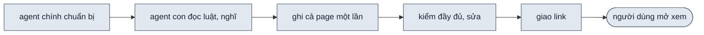
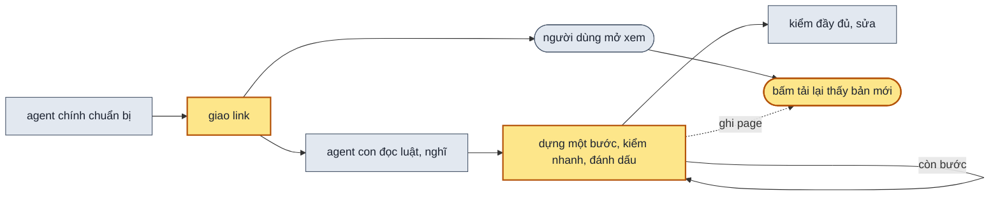

> **Huỷ (2026-10-08):** Andy quyết huỷ plan này. Code Phase 1 (nhãn trạng thái, nút tải lại, page mới tạo là màn chờ, `details.html` → `example.html`) đã revert về commit `76dea99`; bản diff lưu ở `.test/design-uiux/027-huy-004/phase1.patch` và `page.html`. Phase 2–4 không làm. Theo dõi tiến độ thiết kế làm lại ở plan 006, dùng bản diff trên làm đầu vào. Plan [005](005-design-uiux-spec-skill-dong-bo.md) không còn chờ plan này.

> **Nối tiếp:** [002](002-design-uiux-improve.md) — các page dựng song song, mỗi agent con một page. Plan này đổi cách một agent con dựng page của nó: từng bước, xem được trong lúc dựng.
> **Lật:** D20 của [001](001-design-uiux.md), phần "chỉ giao link khi `check.mjs` ra exit 0": link đưa ngay khi page còn đang dựng; báo xong vẫn chỉ khi exit 0. **Giữ:** D21 của 001; D6 · D7 của 002.

## 1. Problem

Người dùng báo skill thiết kế giao diện chạy lâu và rối. Lần chạy thử ngày 2026-10-07 (thiết kế lại màn đăng nhập,
hai phương án) mất 13 phút. Mỗi agent con dựng một page mất khoảng 9,5 phút và ~145k token. Trong 3–5 phút đầu nó
chỉ đọc và nghĩ, chưa ghi dòng nào, rồi ghi cả page trong một lần. Suốt thời gian đó người dùng không có gì để xem,
không biết đang tới đâu, và thấy sai hướng cũng không ngắt sớm được.

## 2. Goal

- Ngay khi agent con bắt đầu dựng, người dùng đã có link của từng page. Mở link thấy màn "đang dựng" kèm danh sách
  các bước, không phải một màn mẫu không liên quan.
- Trong lúc dựng, mỗi lần bấm nút tải lại trên thanh công cụ là thấy bản mới nhất. Các bước đã xong được đánh
  dấu, phần đã dựng hiện ra. Trạng thái đang chọn, khổ màn, sáng tối và vị trí cuộn giữ nguyên sau khi tải lại.
- Bản đầu tiên xem được (đủ các khối, dữ liệu mặc định) hiện ra trong khoảng 3 phút đầu của agent con, không phải
  đợi cả page xong.
- Thanh công cụ của mỗi page luôn cho biết page đang ở đâu: đang dựng, hay đang sửa theo góp ý (kèm số bước đã
  xong), hoặc đã xong kèm ngày sửa cuối. Bấm vào thấy danh sách bước, cả các bước của những vòng góp ý trước.
- Agent con bị ngắt giữa chừng, gọi lại thì làm tiếp từ bước chưa xong, không dựng lại từ đầu.
- Page chỉ được giao là xong khi mọi bước đã đánh dấu xong và kiểm đầy đủ sạch. Page dựng từ trước vẫn mở và kiểm
  như cũ, thanh công cụ ghi là đã xong.

**Ngoài scope:** kết quả kiểm trên thanh công cụ · panel không tự mở ở hai lề khi trang tràn hết màn · chốt sẵn kiểu nút, ô nhập dùng chung cho các page · sửa luật dấu `*` và luật tương phản · tự tải lại khi file đổi.

## 3. Mental model

**Bây giờ chạy thế nào** — Agent chính đọc dự án, chọn phương án, viết bản tóm tắt chung, rồi gọi mỗi phương án
một agent con. Agent con đọc hết luật và bản tóm tắt, nghĩ vài phút, rồi ghi cả page trong một lần. Sau đó nó chạy
kiểm đầy đủ (khoảng 30 giây, hơn trăm tổ hợp) và sửa tới khi sạch. Agent chính đợi mọi agent con xong, kiểm cả thư
mục một lần nữa, rồi mới đưa link. Người dùng chỉ được mở xem sau khi tất cả đã xong.



**Sau plan chạy thế nào** — Agent chính đưa link ngay khi gọi agent con. Page lúc đó là màn "đang dựng" có sẵn
danh sách bước. Agent con không ghi một lần nữa mà đi từng bước: dựng một phần, kiểm nhanh (khoảng 1–5 giây, một
tổ hợp), đánh dấu bước đó xong, rồi sang bước sau. Người dùng bấm tải lại lúc nào cũng thấy phần đã xong. Kiểm đầy
đủ chỉ chạy ở bước cuối. Người dùng góp ý thì mỗi ý thành một bước mới trong cùng danh sách, sửa cũng đi từng bước
như lúc dựng. Thanh công cụ luôn ghi page đang dựng, đang sửa hay đã xong.



**Hành vi đổi ra sao**

| #     | Tình huống | Bây giờ | Sau plan |
| ----- | ---------- | ------- | -------- |
| `BH1` | người dùng mở link lúc agent con vừa bắt đầu | chưa có link, link chỉ đưa khi mọi page xong | màn "Đang dựng phương án A" kèm danh sách bước, chưa bước nào xong |
| `BH2` | bấm tải lại giữa chừng | không có nút tải lại; nhấn F5 thì thấy màn mẫu "Thành viên" hay page dở dang không biết tới đâu | thấy các khối đã dựng, thanh công cụ ghi "Đang dựng 3/6"; bấm vào thấy bước nào xong, bước nào đang làm; trạng thái, khổ màn, vị trí cuộn giữ nguyên |
| `BH3` | chọn một trạng thái chưa dựng tới (vd lỗi khi mới xong bước khung) | — | page hiện như trạng thái mặc định; danh sách bước cho thấy bước "trạng thái lỗi" chưa xong |
| `BH4` | agent con bị ngắt rồi được gọi lại | dựng lại cả page từ đầu | đọc danh sách bước trong page, làm tiếp từ bước đầu tiên chưa xong |
| `BH5` | page dựng xong | giao khi kiểm sạch; thanh công cụ không nói gì về trạng thái | thanh công cụ ghi "✓ Xong · 07/10"; kiểm đầy đủ báo lỗi nếu còn bước chưa đánh dấu |
| `BH6` | mở hay kiểm một page dựng trước plan này | — | mở, kiểm như cũ; thanh công cụ ghi "✓ Xong · <ngày sửa cuối>"; kiểm đầy đủ không đòi danh sách bước |
| `BH7` | người dùng góp ý một page đã xong | agent sửa cả page rồi báo; ngày sửa chỉ thấy khi rê chuột vào nút phương án | thanh công cụ ghi "Đang sửa 1/3"; danh sách có nhóm "Góp ý vòng 2" liệt kê từng ý; sửa xong về "✓ Xong · <ngày>" |

**Không đụng:** bước hỏi làm rõ và chọn phương án; bộ nguyên tắc, giới hạn thiết kế và cách kiểm đầy đủ chúng.

---

## 4. Probe

### P1 — Kiểm nhanh một tổ hợp (mở Chrome, mở page ở 1280px giá trị mặc định, chụp một ảnh) tốn bao nhiêu giây?

**Biết để làm gì:** dưới ~5 giây thì kiểm được sau từng bước dựng; vài chục giây như kiểm đầy đủ thì phần nghĩ
được cắt bớt lại tốn sang phần chờ kiểm, và chỉ nên kiểm ở cuối
**Cách chạy lại:** `node .test/design-uiux/021-probe-quick-check/probe-quick.mjs <page.html>`, ba lần liền
**Kết quả:** 1,89s lần đầu (Chrome nguội), 1,08s và 1,11s các lần sau — 2026-10-07, Playwright ở
`$TMPDIR/design-uiux-pw`, Chrome hệ thống, page `020-login-pilot-app/01-vao-thang.html`. Chưa tính lượt dò nguyên
tắc trên tổ hợp đó (kiểm đầy đủ: ~30s cho ~120 tổ hợp, tức ~0,25s mỗi tổ hợp)

## 5. Decisions

**Ai quyết:** 🤖 = agent tự quyết, chưa hỏi ai — **chỗ người duyệt phải soi** · 👤 = user chốt lúc bàn (luật 22).

### D0 👤 — Agent con dựng page theo danh sách bước: mỗi bước ghi file, kiểm nhanh, đánh dấu xong rồi mới sang bước sau

**Lý do:** người dùng thấy page lớn dần thay vì đợi một cục; lỗi lộ ra khi page còn nhỏ, sửa rẻ
**Phương án đã loại:** giữ một lần ghi, chỉ cắt luật cho agent nghĩ ít hơn — chỉ bớt 1–3 phút, người dùng vẫn đợi tới cuối

### D1 👤 — Người dùng xem bản mới bằng nút tải lại trên thanh công cụ, không tự tải lại

**Lý do:** page mở qua `file://`, trình duyệt không cho dò file đổi; giá trị đang vặn đã nằm trong URL nên tải lại không mất
**Phương án đã loại:** server cục bộ tự tải lại — thêm một tiến trình phải bật, tắt, chiếm cổng, cho một việc một cú bấm làm được

### D2 🤖 — Danh sách bước nằm ngay trong page (`window.DESIGN.build`), shell vẽ nó lên thanh công cụ; không có file checklist riêng

**Lý do:** page là file duy nhất agent con được sửa, nên không tranh ghi; một nguồn cho cả agent đọc khi chạy tiếp lẫn người xem → DS2
**Phương án đã loại:** `NN-slug.checklist.md` — hai nơi (md và page) dễ lệch, người xem page không thấy; `pages.js` — các agent con song song tranh nhau ghi

### D3 🤖 — Sáu bước cố định cho mọi page, `new-design.mjs page` ghi sẵn; agent con được thêm bước, không được bớt

**Lý do:** bước 1 ra ngay bản xem được (khung + dữ liệu mặc định); các bước sau mỗi bước một thứ người xem vặn thấy được → DS2
**Phương án đã loại:** agent con tự đặt bước — mỗi page một kiểu, kiểm đầy đủ không biết lấy gì để so

### D4 🤖 — `check.mjs --quick` kiểm tĩnh cộng một tổ hợp ở 1280px; kiểm đầy đủ chỉ ở bước cuối

**Lý do:** dựa vào `P1` — một tổ hợp ~1s, đủ rẻ để chạy sau mỗi bước; page đang dở thì các trạng thái chưa dựng chắc chắn trượt kiểm đầy đủ → DS3

### D5 🤖 — Page mới tạo là màn chờ "Đang dựng"; màn mẫu "Thành viên" thành file ví dụ chỉ để đọc

**Lý do:** link đưa sớm thì cái người dùng thấy đầu tiên là page mới tạo; thấy màn "Thành viên" là hiểu nhầm. Agent con vẫn cần ví dụ cách khai nút và viết khối → DS4

### D6 🤖 — Agent chính đưa link ngay sau khi gọi agent con chạy nền; tin giao cuối giữ như cũ

**Lý do:** link sớm là điều kiện để người dùng theo dõi và ngắt được; tin cuối vẫn cần kết quả kiểm cả thư mục → DS5
**Phương án đã loại:** giữ D20 của 001 nguyên văn (link chỉ khi exit 0) — người dùng lại đợi tới cuối

### D7 🤖 — Page không có danh sách bước được coi là đã xong

**Lý do:** page dựng trước plan này vẫn mở và kiểm như cũ, không phải sửa → DS2 · DS3

### D8 👤 — Thanh công cụ luôn hiện trạng thái page: đang dựng, đang sửa theo góp ý, hay xong kèm ngày sửa cuối

**Lý do:** người mở page biết ngay mình đang xem bản dở hay bản xong, sửa lần cuối khi nào → DS1
**Phương án đã loại:** chỉ hiện lúc đang dựng — xong rồi thì không biết bản đang xem là bản nào; kèm kết quả kiểm — `check.mjs` phải ghi file, trong khi lệnh đó chỉ đọc

### D9 🤖 — Vòng góp ý thêm bước vào cùng danh sách, mỗi bước ghi số vòng; bước của vòng cũ giữ nguyên

**Lý do:** một nguồn cho mọi vòng; xem lại được góp ý nào đã sửa, sửa lúc nào → DS2
**Phương án đã loại:** mỗi vòng xoá danh sách cũ viết lại — mất dấu các góp ý đã làm

## 6. Design

### DS1 — Shell: nút tải lại và nhãn trạng thái

**Đổi (2026-10-07):** nhãn trạng thái ở cột trái của toolbar, không trong view-controller — để cạnh nút tải lại thì
A B C lệch khỏi giữa trang và toolbar tràn ở 375px. Vị trí cuộn ghi mỗi lần rời trang (`pagehide`), chỉ cuộn lại khi lần
mở là tải lại — thanh không dính mép trên, tải lại giữa trang thường là bằng phím. Màn ≤ 480px bỏ nút số khối.

Nút tải lại ở cuối `.ds-bar-view` (view-controller); nhãn trạng thái ở cột 1 của `.ds-toolbar`:

| Khối | Selector | Hiện khi | Làm gì |
| ---- | -------- | -------- | ------ |
| nút tải lại | `[data-ds-reload]`, icon `refresh-cw`, `title` "Tải lại" / "Reload" | luôn | `location.reload()`; `pagehide` ghi `scrollY` vào `sessionStorage['ds-scroll:<file>']` |
| nhãn trạng thái | `[data-ds-status]`, thuộc tính `data-state` là `building` · `revising` · `done` | luôn | bấm mở danh sách `[data-ds-status-list]`; Esc hay bấm ngoài thì đóng |

Nhãn trạng thái đọc `build` (DS2) và dòng của page trong `pages.js`:

| Điều kiện | `data-state` | Chữ (vi / en) |
| --------- | ------------ | ------------- |
| còn bước `round` 1 chưa xong | `building` | "Đang dựng a/b" / "Building a/b" — a, b đếm bước vòng 1 |
| vòng 1 xong, còn bước vòng n ≥ 2 chưa xong | `revising` | "Đang sửa a/b" / "Revising a/b" — a, b đếm bước vòng n |
| mọi bước xong, hay không có `build` | `done` | "✓ Xong · dd/mm" / "✓ Done · dd/mm" — ngày là `updated` của page trong `pages.js`; không có `updated` thì "✓ Xong" |

Danh sách: nhóm theo vòng, tiêu đề nhóm "Dựng" rồi "Góp ý vòng 2", "Góp ý vòng 3"…; mỗi bước một dòng, ✓ xong · ●
bước đầu tiên chưa xong · ○ còn lại. Không có `build` thì danh sách chỉ một dòng "Page dựng trước khi có danh sách bước".

- Lần mở là tải lại (`performance.getEntriesByType("navigation")[0].type === "reload"`): đọc `ds-scroll:<file>`, cuộn tới đó, xoá khoá. Giá trị vặn đọc lại từ URL như hiện có.
- Khung mobile / tablet (iframe `frame=1`): không vẽ cả hai, vì tải lại page cha là tải lại luôn iframe.
- Chữ theo `lang` của page, như các chữ khác của shell.

### DS2 — Danh sách bước dựng

```js
window.DESIGN = {
  // …variables, tweaks, presets như hiện có
  build: [
    { step: "Khung các khối, dữ liệu mặc định", done: false },
    { step: "Đang tải · rỗng · lỗi", done: false },
    { step: "Trạng thái riêng của đề", done: false },
    { step: "Tương tác: bấm, gõ, mở, đóng", done: false },
    { step: "Preset và ca biên", done: false },
    { step: "Kiểm đầy đủ và tự kiểm", done: false },
  ],
};
```

| Bước | Xong khi | Lệnh kiểm |
| ---- | -------- | --------- |
| 1 | khai đủ `variables` theo bảng "Nút dữ liệu chung", `tweaks`; mọi `data-block` có mặt, hiện đúng `state` mặc định | `check.mjs <page> --quick` |
| 2 | ba `state` `loading` · `empty` · `error` đã dựng | `--quick --state loading`, rồi `empty`, rồi `error` |
| 3 | các `state` riêng trong brief đã dựng | `--quick --state <từng giá trị>` |
| 4 | mọi nút bấm được làm gì đó, hay khoá kèm `title` | `--quick` |
| 5 | `presets` khai xong, ca biên dựng xong | `--quick --preset <từng nhãn>` |
| 6 | kiểm đầy đủ exit 0, danh sách tự kiểm đã đi | `check.mjs <page>` |

- Đánh dấu bước: sửa `done: false` → `true` trong cùng lượt sửa page vừa làm xong bước đó.
- Bước thêm của agent con chèn trước bước kiểm đầy đủ. Bước kiểm đầy đủ luôn là bước cuối của vòng nó.
- Agent con được gọi lại: đọc `build`, làm từ bước đầu tiên `done: false`.
- Page không có `build`: coi như mọi bước đã xong (D7).
- Field `round`: bỏ trống là vòng 1 (dựng). Vòng góp ý n = số vòng lớn nhất đang có + 1.

Vòng góp ý — trước khi sửa page, người sửa thêm vào cuối `build`:

```js
{ step: "Góp ý: đưa Quên mật khẩu xuống dưới nút Đăng nhập", done: false, round: 2 },
{ step: "Góp ý: bỏ dòng giới thiệu ở chân trang", done: false, round: 2 },
{ step: "Kiểm đầy đủ", done: false, round: 2 },
```

Mỗi ý góp ý một bước, chữ bắt đầu bằng "Góp ý: ". Làm từng bước, `--quick` sau mỗi bước, kiểm đầy đủ ở bước cuối
vòng, rồi `new-design.mjs touch` như hiện có để `pages.js` ghi ngày sửa.

### DS3 — CLI Surface của `check.mjs`

```text
node check.mjs <page.html> --quick [--state <giá trị>] [--preset "<nhãn>"] [--pw <dir>]
node check.mjs <thư mục design | page.html> [--pw <dir>] [--no-shots]      # kiểm đầy đủ, như hiện có
```

| Phần kiểm | `--quick` | đầy đủ |
| --------- | --------- | ------ |
| lượt tĩnh: file khung, thứ tự nạp, mã màu, brief, `pages.js`, bộ key `variables`, kiểm tĩnh của nguyên tắc | có | có |
| mở page: lỗi console, lỗi JS, request hỏng | có, 1280px | có |
| bố cục và dò nguyên tắc | một tổ hợp: 1280px, sáng, tweak mặc định, `state` theo `--state` hay preset theo `--preset` | mọi tổ hợp, hai khổ |
| nút vặn mà UI không đổi, lượt bấm, URL mở lại, khung tablet / mobile, 1920px, cả thư mục | không | có |
| `build` còn bước `done: false` | không | lỗi: `còn bước chưa xong: <tên bước>` |
| ảnh | một ảnh `shots/<page>--quick.png` | như hiện có |

- `--quick` nhận đúng một page; đưa thư mục thì exit 2 kèm câu hướng dẫn.
- Exit như hiện có: 0 sạch · 1 có lỗi · 2 không chạy được.
- `--quick` in dòng cuối `✓ quick · <page> · <n> lỗi · <giây>s`.

### DS4 — Page mới tạo và file ví dụ

| File | Vai |
| ---- | --- |
| `templates/page.html` | khuôn `new-design.mjs page` chép ra: `<head>` đúng thứ tự nạp như hiện có; `window.DESIGN` có `lang`, `variables: []`, `tweaks: []`, `build` đủ 6 bước (DS2); `<main id="design">` chỉ có một khối chờ "Đang dựng <phương án>" |
| `templates/example.html` | màn "Thành viên" hiện có (đổi tên từ `templates/details.html`), chỉ để đọc cách khai nút, viết khối, dựng `state`; không lệnh nào chép nó ra |

`new-design.mjs page` thay `<title>` và chữ phương án trong khối chờ bằng `--title`, `--option`.

### DS5 — Cấu trúc SKILL.md

| Mục | Đổi gì |
| --- | ------ |
| Mental model | sơ đồ: nút "giao link" đứng ngay sau "brief + page trống"; hộp agent con thành vòng "dựng một bước → kiểm nhanh → đánh dấu" |
| Bước 4, "Gọi agent con" | lời giao: đọc `templates/example.html` thay khuôn; dựng theo `build`, mỗi bước kiểm theo bảng DS2; bị gọi lại thì làm tiếp từ bước chưa xong |
| Bước 4, sau khi gọi agent con | agent chính in ngay link `file://` từng page, kèm câu "đang dựng, bấm tải lại trên thanh công cụ để xem bản mới" |
| "Viết một page" → "Dựng một page theo bước" | bảng sáu bước của DS2; luật viết HTML, khai nút giữ nguyên |
| Bước 5 | agent con: `--quick` sau mỗi bước, kiểm đầy đủ ở bước 6; agent chính: kiểm cả thư mục như hiện có |
| Vòng sau | góp ý một page: thêm bước vòng mới vào `build` theo DS2 trước khi sửa, đi từng bước, `touch` khi xong vòng |
| Các khối điều khiển | bảng view-controller thêm nút tải lại và nhãn trạng thái |
| Bẫy đã gặp | thêm dòng "Viết cả page một lần" → người dùng đợi tới cuối, lỗi dồn một chỗ → đi theo `build` |
| `scripts/new-design.mjs`, `scripts/check.mjs` (đầu file) | dòng cách dùng có `--quick`, `templates/page.html` |

### DS6 — Test Strategy

| File / lệnh | Vai |
| ----------- | --- |
| `scripts/test-shell.mjs` | thêm phép: nút tải lại có ở 1600 / 700 / 375px; vặn `state`, cuộn xuống, bấm tải lại → URL, `state`, `scrollY` giữ nguyên; page có `build` 2/6 → nhãn "Đang dựng 2/6", danh sách đúng ✓ ● ○; có bước vòng 2 chưa xong → "Đang sửa a/b", danh sách có nhóm "Góp ý vòng 2"; mọi bước xong → "✓ Xong · <ngày trong `pages.js`>"; không có `build` → "✓ Xong" kèm dòng "Page dựng trước khi có danh sách bước" |
| `.test/design-uiux/017-taste-planted/run.sh` + `verify.py` | hồi quy: mọi ca vẫn ra đúng phán quyết trong `expect.json` |
| `.test/design-uiux/<NNN>-quick/` | ca cho `--quick`: page có `build` dở (kiểm đầy đủ phải báo "còn bước chưa xong"); page bước 1 xong mà `state=error` chưa dựng (`--quick` sạch, đầy đủ báo lỗi) |
| `.test/design-uiux/<NNN>/watch-build.mjs` | công cụ đo: 2 giây đọc page một lần, ghi giờ mỗi lần một bước đổi sang xong, vào `build.log` |

**Baseline:** lần chạy 020 (màn đăng nhập, 2 page) — 13 phút tổng; agent con 556s và 588s; lần ghi page đầu tiên ở
giây 319 và 321 của agent con; người dùng có link ở phút 13 — 2026-10-07.

## 7. Phases

**Legend:** 🤖 = agent tự kiểm được (chạy lệnh, test, grep) · 👤 = cần người kiểm (số đo thật, UI, hạ tầng).

- [x] 👤 plan này được duyệt — 2026-10-07, Andy ("triển khai đi")

### Phase 1 — mở page thấy trạng thái, bấm tải lại thấy bản mới

**Goal:** tạo page bằng `new-design.mjs page` là ra màn chờ có danh sách bước; sửa `build` trong file rồi bấm tải lại thì nhãn trạng thái đổi theo.
**Cover:** DS1 · DS2 · DS4

**Actions:**

- [x] 🤖 `templates/details.html` → `templates/example.html` (`git mv`); `templates/page.html` mới theo DS4 (D5) — 2026-10-07
- [x] 🤖 `scripts/new-design.mjs` lệnh `page` chép `templates/page.html`, thay tiêu đề và tên phương án (D3 · D5) — 2026-10-07
- [x] 🤖 `shell/shell.js` + `shell/shell.css`: nút tải lại, giữ vị trí cuộn, nhãn trạng thái ba dạng và danh sách bước theo vòng, theo DS1 (D1 · D2 · D8) — 2026-10-07
- [x] 🤖 `shell/PRINCIPLES.md`: thêm nút tải lại và nhãn trạng thái vào phần mô tả view-controller — mục "Trạng thái page và tải lại", 2026-10-07
- [x] 🤖 `scripts/test-shell.mjs`: các phép mới của DS6 — page mẫu chép từ `example.html`, thêm thư mục `003-build-test`; 2026-10-07

**Gate:**

- [x] 🤖 `node skills/design-uiux/scripts/test-shell.mjs --pw $TMPDIR/design-uiux-pw` — mọi phép ✓, gồm các phép mới — DS1 · BH2 — 64/64 ✓, exit 0, `.test/design-uiux/022-shell-status/test-shell.log`, 2026-10-07
- [x] 🤖 page vừa tạo bằng `new-design.mjs page` mở ra có khối "Đang dựng <phương án>" và nhãn "Đang dựng 0/6"; grep không còn chữ "Thành viên" trong page đó — DS2 · DS4 · BH1 — phép "page mới tạo: màn chờ có tên phương án" ✓ trong test-shell, 2026-10-07
- [x] 🤖 page `020-login-pilot-app/01-vao-thang.html` (không có `build`) mở ra có nhãn "✓ Xong · <ngày trong `pages.js`>", phần còn lại của toolbar như trước — BH6 — bản chép ở `023-old-page-new-shell`, cả 2 page "Xong 07/10", A B và nút tải lại có, không lỗi JS, 2026-10-07
- [ ] 👤 mở page chờ, sửa tay hai bước sang `done: true`, bấm tải lại: thấy "Đang dựng 2/6", danh sách đúng, trạng thái và vị trí cuộn giữ nguyên; sửa tiếp hết sáu bước xong rồi thêm hai bước vòng 2: thấy "✓ Xong", rồi "Đang sửa 0/2" kèm nhóm "Góp ý vòng 2" — <ngày + ai xác nhận> · BH5 · BH7

### Phase 2 — kiểm nhanh sau từng bước

**Goal:** `check.mjs --quick` chạy trong vài giây trên một page đang dựng; kiểm đầy đủ chặn page còn bước chưa xong.
**Cover:** DS3

**Actions:**

- [ ] 🤖 `scripts/check.mjs`: cờ `--quick`, `--state`, `--preset` theo DS3 (D4)
- [ ] 🤖 `scripts/check.mjs`: kiểm đầy đủ báo `còn bước chưa xong` khi `build` có bước `done: false`; không có `build` thì bỏ qua (D7)
- [ ] 🤖 `.test/design-uiux/<NNN>-quick/`: hai ca của DS6

**Gate:**

- [ ] 🤖 `--quick` trên `01-vao-thang.html` và `02-xem-truoc.html` của lần chạy 020: exit 0, mỗi lần ≤ 5 giây — <số giây> — DS3
- [ ] 🤖 ca page bước 1 xong, `state=error` chưa dựng: `--quick` exit 0; kiểm đầy đủ exit 1 — DS3 · BH3
- [ ] 🤖 ca `build` còn bước chưa xong: kiểm đầy đủ exit 1, có dòng `còn bước chưa xong: <tên bước>` — BH5
- [ ] 🤖 `--quick` đưa thư mục: exit 2 kèm câu hướng dẫn
- [ ] 🤖 kiểm đầy đủ thư mục `020-login-pilot-app/.design/001-login-redesign`: vẫn exit 0, 240 tổ hợp — BH6
- [ ] 🤖 `017-taste-planted`: `bash run.sh && python3 verify.py` — mọi ca khớp `expect.json` — <số ca>

### Phase 3 — skill chạy theo bước, đưa link sớm

**Goal:** gọi `/design-uiux`, người dùng có link ngay khi agent con bắt đầu, và page lớn dần qua từng lần tải lại.
**Cover:** DS5 · DS6

**Actions:**

- [ ] 🤖 `skills/design-uiux/SPEC.md`: thêm sub-scope cho dựng theo bước, đưa link sớm, nhãn trạng thái và nút tải lại, `--quick`, kèm dòng Nghiệm thu và kịch bản phủ chúng; technical design 3.4–3.6 và lý do tương ứng (plan 005, D6)
- [ ] 🤖 `skills/design-uiux/SKILL.md`: các mục theo DS5 (D0 · D6) — kèm dòng `spec:` gắn mã các sub-scope vừa thêm
- [ ] 🤖 `README.md` của repo: dòng mô tả `design-uiux` nhắc dựng theo bước, nút tải lại, nếu README có tả cách skill chạy
- [ ] 🤖 `.test/design-uiux/<NNN>/watch-build.mjs` theo DS6
- [ ] 🤖 chạy thử `--auto` đề "thiết kế lại màn hình login của …/pilot-app" vào `.test/design-uiux/<NNN>-login-steps/`, kèm `watch-build.mjs` cho từng page
- [ ] 🤖 chạy thử `--auto` lại đề của `018-quota-taste` (màn dữ liệu) vào `.test/design-uiux/<NNN>-quota-steps/`, kèm `watch-build.mjs`
- [ ] 🤖 chạy thử ngắt: dừng một agent con sau khi bước 2 đánh dấu xong, gọi agent con mới cùng lời giao, ghi lại bước đầu tiên nó sửa
- [ ] 🤖 chạy thử vòng góp ý trên page A của lần chạy màn đăng nhập: hai ý "đưa Quên mật khẩu xuống dưới nút Đăng nhập", "bỏ dòng giới thiệu ở chân trang", kèm `watch-build.mjs`

**Gate:**

- [ ] 🤖 `node scripts/spec-check.mjs skills/design-uiux` exit 0 sau khi thêm sub-scope của plan này vào SPEC (plan 005)
- [ ] 🤖 cả hai lần chạy: link page có trong chat trước khi bước 1 của page đó đánh dấu xong (so giờ tin nhắn với `build.log`) — DS5 · BH1
- [ ] 🤖 cả hai lần chạy: bước 1 đánh dấu xong ≤ 3 phút sau khi agent con bắt đầu (baseline: lần ghi đầu tiên ở giây ~320) — <giây> — DS6
- [ ] 🤖 cả hai lần chạy: `build.log` có ít nhất 5 mốc giờ khác nhau cho 6 bước, tức là không đánh dấu dồn một lượt — <số mốc>
- [ ] 🤖 cả hai lần chạy: thời gian mỗi agent con ≤ 11 phút (baseline 9,5 phút) · kiểm đầy đủ cả thư mục exit 0 — <số phút, số tổ hợp>
- [ ] 🤖 lần chạy ngắt: agent con mới không sửa phần của bước 1–2; lượt sửa đầu tiên của nó thuộc bước 3 — BH4
- [ ] 🤖 vòng góp ý: `build` có 3 bước `round: 2` (2 ý + kiểm đầy đủ), bước vòng 1 giữ nguyên; `build.log` có mốc riêng cho từng bước vòng 2; `pages.js` có `updated` và `note` mới; kiểm đầy đủ exit 0 — BH7

### Phase 4 — nghiệm thu

**Goal:** mỗi bullet §2 có một lượt chạy thật, kết quả ghi cạnh ô tick.
**Cover:** —

**Actions:**

- [ ] 👤 gọi `/design-uiux` với một đề thật, mở link ngay khi có, bấm tải lại vài lần trong lúc dựng; dựng xong góp ý một ý, bấm tải lại trong lúc sửa
- [ ] 🤖 gom `build.log`, giờ đưa link, giờ xong của các lần chạy Phase 3 vào `.test/design-uiux/<NNN>-login-steps/nhan-xet.md`

**Gate** — một dòng ứng một bullet §2:

- [ ] 👤 §2 bullet 1: có link ngay khi agent con bắt đầu, mở ra thấy màn "đang dựng" và danh sách bước — <ngày + ai xác nhận> · BH1
- [ ] 👤 §2 bullet 2: bấm tải lại giữa chừng thấy phần mới, bước đã xong có dấu, trạng thái và vị trí cuộn giữ nguyên — <ngày + ai xác nhận> · BH2 · BH3
- [ ] 🤖 §2 bullet 3: bước 1 xong ≤ 3 phút ở cả hai đề của Phase 3 — <giây từng page>
- [ ] 👤 §2 bullet 4: nhãn trạng thái đi đúng "Đang dựng a/6" → "✓ Xong · <ngày>" → "Đang sửa a/b" → "✓ Xong · <ngày mới>" qua lượt dựng và góp ý ở trên; bấm vào thấy nhóm "Dựng" và "Góp ý vòng 2" — <ngày + ai xác nhận> · BH5 · BH7
- [ ] 🤖 §2 bullet 5: lần chạy ngắt làm tiếp từ bước 3 — <bằng chứng: lượt sửa đầu tiên> · BH4
- [ ] 🤖 §2 bullet 6: kiểm đầy đủ chặn page còn bước dở; thư mục 020 dựng trước plan vẫn exit 0 và mở ra ghi "✓ Xong" — BH5 · BH6
- [ ] 🤖 `python3 ~/.claude/skills/write-plan/verify.py .plan/004-design-uiux-dung-theo-buoc.md` — 0 ERROR
