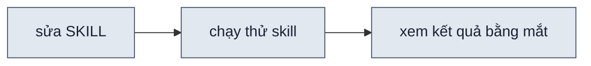
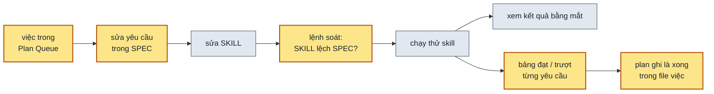

## 1. Problem

Một skill có hai file: **SPEC** là thiết kế (skill phải làm gì, vì sao làm vậy), **SKILL** là thực thi (agent làm
từng bước thế nào). Có hai chỗ hở:

- **Không có gì giữ SKILL theo đúng SPEC.** Sửa thiết kế mà quên sửa SKILL thì agent không làm theo, vì nó chỉ đọc
  SKILL. Ở skill thiết kế giao diện: nhãn "đang dựng / đã xong" trên thanh công cụ đã làm xong mà SKILL chưa nhắc
  một chữ; SPEC lại chưa có danh sách yêu cầu nào, nên không có gì để đem ra so.
- **Không có cách xác nhận SKILL chạy ra đúng điều SPEC hứa.** 25 lần chạy thử trong thư mục thử của skill, mỗi lần
  một đề chọn tuỳ lúc, không lần nào ghi yêu cầu nào đạt. Lúc này SKILL còn bảo agent dựng page từ một file khuôn đã
  đổi tên — lỗi chỉ lộ ra khi có người chạy thật.

## 2. Goal

**Việc 1 — SKILL tuân theo thiết kế của SPEC**

- SPEC của skill thiết kế giao diện có danh sách yêu cầu chia nhóm, mỗi yêu cầu một mã; phần thiết kế kỹ thuật ghi
  mình phục vụ yêu cầu nào.
- Yêu cầu nào cũng có ít nhất một mục trong SKILL thực thi nó; mục nào trong SKILL cũng trỏ về yêu cầu nó thực thi,
  hoặc ghi rõ không thực thi yêu cầu nào. Một lệnh ở gốc repo soát cả hai chiều, lệch thì báo lỗi; với skill thiết kế
  giao diện, lệnh chạy sạch.
- Lệnh in được bảng đối chiếu: mỗi yêu cầu đặt cạnh các mục SKILL thực thi nó, để người duyệt đọc một lượt thấy nội
  dung khớp.

**Việc 2 — SKILL hoạt động đúng**

- Yêu cầu nào cũng có cách nghiệm thu ghi sẵn trong plan đưa nó vào: kiểm bằng lệnh nào hay chạy kịch bản nào, đạt
  khi thấy gì.
- Plan này có một bộ kịch bản chạy thử phủ mọi yêu cầu. Chạy hết bộ thì ra một bảng: mỗi yêu cầu đạt hay trượt, kèm
  bằng chứng. Mọi yêu cầu đạt.
- Skill có một file ghi việc đã làm và việc đang chờ. Việc đã hoàn thành ghi các yêu cầu nó đưa vào SPEC; việc chưa
  làm nằm ở hàng chờ, ghi trước được mà SPEC không đổi. Yêu cầu trong SPEC mà không việc nào đưa vào thì lệnh soát
  báo.

**Chung**

- Skill có SPEC mà chưa có danh sách yêu cầu thì lệnh bỏ qua, ghi một dòng, không báo lỗi.
- Hướng dẫn chung của repo ghi luật: SPEC là yêu cầu và thiết kế, file việc ghi đã đổi gì và sắp đổi gì, SKILL thực
  thi; một việc đi từ hàng chờ thành plan, sửa SPEC, SKILL, lệnh soát, chạy thử, rồi plan được ghi là xong.

**Đổi (2026-10-08):** việc 2 bullet 1–3 — SPEC chỉ còn yêu cầu và thiết kế; trạng thái sang file việc của skill,
cách nghiệm thu và kịch bản sang plan.

**Ngoài scope:** viết danh sách yêu cầu, cách nghiệm thu, kịch bản cho các skill khác · các yêu cầu của kế hoạch dựng
page theo từng bước (kế hoạch đó đã huỷ).

## 3. Mental model

**Bây giờ chạy thế nào** — Người sửa skill mở SKILL, sửa một luật, chạy thử skill trên một đề nghĩ ra lúc đó, xem
kết quả bằng mắt. Skill phải làm được những gì thì nằm trong đầu người viết và trong các bản kế hoạch cũ. Không có
gì so SKILL với thiết kế, và không biết lần chạy thử vừa rồi đã đụng tới những yêu cầu nào.



**Sau plan chạy thế nào** — Việc muốn làm được ghi một dòng vào hàng chờ của file việc. Được duyệt thì viết plan,
ghi trong plan mỗi yêu cầu nghiệm thu ra sao. Người sửa skill sửa SPEC trước: thêm hay sửa một yêu cầu có mã. Rồi
sửa SKILL, đánh dấu mã ở mục vừa sửa. Lệnh soát báo ngay chỗ SKILL lệch SPEC (việc 1). Chạy thử thì không chọn đề
tuỳ lúc mà chạy kịch bản của plan, ghi kết quả vào bảng đạt / trượt từng yêu cầu (việc 2). Đạt thì plan được ghi là xong trong file việc, kèm các mã yêu cầu nó chạm tới.



**Hành vi đổi ra sao**

| #     | Tình huống | Bây giờ | Sau plan |
| ----- | ---------- | ------- | -------- |
| `BH1` | thêm một yêu cầu vào SPEC mà quên sửa SKILL | không ai biết, tới lúc agent làm thiếu | lệnh soát báo yêu cầu đó chưa có trong SKILL |
| `BH2` | yêu cầu đã làm trong code mà SKILL không nhắc | agent chạy skill không biết có nó | lệnh soát báo yêu cầu đó chỉ có trong code, kèm tên file |
| `BH3` | đánh dấu một mã yêu cầu không có (gõ nhầm, yêu cầu đã bỏ) | — | lệnh soát báo đúng dòng đó |
| `BH4` | chạy lệnh soát trên skill có SPEC kiểu cũ, chưa có danh sách yêu cầu | — | lệnh ghi "bỏ qua", không báo lỗi |
| `BH5` | người mới muốn hiểu skill thiết kế giao diện làm gì, chạy ra sao | đọc SKILL 400 dòng và bốn bản kế hoạch | đọc SPEC: mục tiêu, yêu cầu, thiết kế kỹ thuật, lý do |
| `BH6` | SKILL có một mục không trỏ về yêu cầu nào, cũng không ghi là cố ý | không ai biết luật đó phục vụ gì | lệnh soát báo mục đó |
| `BH7` | một yêu cầu chưa có cách nghiệm thu | — | lệnh soát báo yêu cầu đó · **bỏ:** cách nghiệm thu nằm trong plan, lệnh không đọc |
| `BH8` | muốn biết skill có làm đúng mọi yêu cầu không | chạy một đề tuỳ lúc, xem bằng mắt, không biết đã phủ gì | chạy bộ kịch bản, ra bảng đạt / trượt từng yêu cầu kèm bằng chứng |
| `BH9` | duyệt xem nội dung SKILL có đúng ý SPEC không | mở hai file, tự dò | lệnh in bảng mỗi yêu cầu cạnh các mục SKILL thực thi nó |
| `BH10` | ghi trước một yêu cầu mới, chưa định làm ngay | lệnh soát báo yêu cầu đó thiếu trong SKILL | ghi "chưa làm", lệnh không báo, chỉ đếm vào số yêu cầu chưa làm · **bỏ:** thay bằng `BH13` |
| `BH11` | ghi một yêu cầu là xong mà chưa ai chạy thử | không ai biết | lệnh soát báo yêu cầu đó thiếu bằng chứng nghiệm thu · **bỏ:** việc chỉ xuống đã hoàn thành khi gate nghiệm thu của plan đã tick |
| `BH12` | SKILL đã thực thi một yêu cầu mà SPEC vẫn ghi chưa làm | — | lệnh soát báo SPEC chưa cập nhật trạng thái · **bỏ:** SPEC không còn trạng thái |
| `BH13` | ghi trước một việc mới, chưa định làm ngay | lệnh soát báo yêu cầu đó thiếu trong SKILL | thêm một mục vào Plan Queue, SPEC không đổi, lệnh không báo |
| `BH14` | yêu cầu có trong SPEC mà không việc nào đưa vào | — | lệnh soát báo yêu cầu đó chưa có trong file việc |
| `BH15` | muốn biết skill đã đổi gì, còn việc gì đang chờ | đọc lại các bản kế hoạch cũ | mở file việc: hai danh sách, mỗi việc đã xong ghi yêu cầu nó đưa vào |

**Không đụng:** cách skill thiết kế giao diện chạy — SKILL và code chỉ thêm dòng đánh dấu nằm trong comment; chạy
thử mà lộ lỗi thì sửa SKILL đúng chỗ lỗi.

---

## 5. Decisions

**Ai quyết:** 🤖 = agent tự quyết, chưa hỏi ai — **chỗ người duyệt phải soi** · 👤 = user chốt lúc bàn (luật 22).

### D0 👤 — SPEC.md là nơi thiết kế, SKILL.md và code là nơi thực thi; đổi skill đi từ SPEC xuống

**Lý do:** yêu cầu và lý do có một chỗ đứng trước; SKILL.md chỉ lo cho agent chạy đúng → DS1

### D1 👤 — Feature requirement chia scope và sub-scope, mỗi cái có mã `F<n>` · `F<n>.<m>`

**Lý do:** danh sách phẳng mười dòng thì quá chi tiết để đọc lướt, gộp năm dòng thì mất chỗ trỏ cụ thể → DS1
**Phương án đã loại:** bảng phẳng `F1`–`F10` — dài, khó thấy nhóm

### D2 👤 — Technical design là section riêng ngay sau Feature requirement, mỗi phần ghi mã nó phục vụ

**Lý do:** technical design dựa vào feature requirement mà làm; ghi mã thì thấy phần nào phục vụ gì → DS1

### D3 👤 — Mọi sub-scope phải có trong SKILL.md; mã gắn trong code không thay được

**Lý do:** agent chạy skill chỉ đọc SKILL.md; yêu cầu chỉ nằm trong code là yêu cầu agent không biết → DS3

### D4 🤖 — Gắn mã bằng comment `spec:` ngay dưới tiêu đề mục SKILL.md và ở đầu file code; gắn mã scope là phủ mọi sub-scope của nó

**Lý do:** không đổi chữ agent và người đọc thấy; một mẫu duy nhất để script tìm → DS2
**Phương án đã loại:** ghi mã vào tiêu đề mục — đổi tiêu đề người dùng và agent đọc, tiêu đề dài ra

### D5 🤖 — Lệnh soát là một script ở gốc repo, chạy cho mọi skill có SPEC.md; SPEC chưa có Feature requirement thì bỏ qua

**Lý do:** luật SPEC/SKILL.md ở CLAUDE.md áp cho cả bốn skill có SPEC; bỏ qua để các skill chuyển dần → DS3
**Phương án đã loại:** script trong `skills/design-uiux/scripts/` — skill khác không dùng được, phải chép

### D6 🤖 — SPEC của design-uiux chỉ tả những gì SKILL.md đang làm; hành vi của plan 004 do 004 thêm vào SPEC ở Phase 3

**Lý do:** Phase 1–2 của plan này không phải chờ 004, lệnh soát sạch được ngay → DS4
**Phương án đã loại:** SPEC làm đích, chấp nhận lệnh đỏ — hai plan dính nhau từ Phase 1
**Đổi (2026-10-08):** 004 bị huỷ, code Phase 1 của nó đã revert; SPEC vẫn chỉ tả những gì SKILL.md đang làm

### D7 🤖 — Lệnh soát kiểm cấu trúc (mỗi yêu cầu có chỗ thực thi, có cách nghiệm thu); làm đúng hay không do bộ kịch bản chạy thử trả lời

**Lý do:** đọc file không biết được agent chạy ra gì; hai việc cần hai loại bằng chứng → DS3 · DS8
**Đổi (2026-10-08):** thêm vế kịch bản chạy thử — người dùng đưa "SKILL.md hoạt động đúng" vào scope

### D8 🤖 — Mục `##` / `###` nào của SKILL.md cũng phải có dòng `spec:`; mục cố ý không thực thi yêu cầu nào ghi `spec: —`

**Lý do:** soát được chiều SKILL → SPEC; mục im lặng thì không phân biệt được quên gắn với cố ý → DS2 · DS3
**Phương án đã loại:** chỉ soát chiều SPEC → SKILL — luật trong SKILL không có yêu cầu đứng sau vẫn lọt

### D9 👤 — SPEC chỉ tả yêu cầu và thiết kế, như PRD gộp với tài liệu kiến trúc; cách nghiệm thu từng sub-scope và bộ kịch bản chạy thử nằm trong plan; kết quả mỗi lần chạy nằm ở `.test/`

**Lý do:** SPEC tả skill đang là gì; nghiệm thu là việc của một lần đổi, nên đi theo plan của lần đổi đó → DS7 · DS8
**Đổi (2026-10-08):** người dùng lật, đổi 🤖 sang 👤. Câu cũ: "Cách nghiệm thu từng sub-scope và bộ kịch bản chạy thử nằm trong SPEC" — SPEC lẫn thứ chỉ đúng cho một lượt làm

### ~~D10~~ — Bộ kịch bản chạy sau khi 004 xong Phase 3

**Lý do:** 004 Phase 3 viết lại phần lớn SKILL.md; chạy trước thì kết quả bỏ đi. Working tree lúc này cũng đang lẫn: khuôn page đã đổi tên mà SKILL.md chưa theo → DS8
**Phương án đã loại:** chạy ngay trên SKILL.md hiện tại — tốn bốn lượt chạy cho bản sắp thay
**Đổi (2026-10-08):** bỏ — 004 bị huỷ, không còn bản SKILL.md nào sắp thay → D11

### D11 👤 — Bộ kịch bản chạy ngay trên SKILL.md hiện tại, sau khi revert code Phase 1 của 004

**Lý do:** người dùng huỷ 004; revert xong thì SKILL.md, shell và khuôn page khớp lại commit cuối, không còn gì phải chờ → DS8

### D12 👤 — Mỗi skill có `PLANS.md` cạnh SPEC, hai mục Plan (việc đã viết plan) và Plan Queue (việc chưa viết plan); mỗi việc một mục có Mục tiêu và bảng mã yêu cầu nó chạm tới

**Lý do:** người dùng ghi trước nhiều việc chưa làm ngay; ghi ở hàng chờ thì SPEC không đổi. SPEC chỉ chứa yêu cầu đã có, nên lệnh soát không cần trạng thái → DS3 · DS9
**Phương án đã loại:** dùng thẳng `.plan/` — không có chỗ cho việc chưa thành plan, không nhìn được theo từng skill
**Đổi (2026-10-08):** PLANS.md là optional — người dùng: SKILL.md và SPEC.md bắt buộc, PLANS.md optional; skill không có file này thì `spec-check` bỏ qua phần PLANS.md
**Đổi (2026-10-08):** hai mục từ "Chưa hoàn thành (hàng chờ, `chờ duyệt` · `đang làm`) và Đã hoàn thành (mỗi việc ghi mã yêu cầu nó đưa vào SPEC)" thành Plan · Plan Queue theo `agents/.docs/003-PLANS.md` → DS9
**Đổi (2026-10-08):** người dùng lật. Câu cũ: "Trạng thái từng sub-scope (`chưa làm` · `đang làm` · `xong`) là một cột của bảng Nghiệm thu trong SPEC; `xong` bắt buộc trỏ tới bảng kết quả có dòng của nó đạt" — SPEC không mô tả trạng thái

### ~~D13~~ 🤖 — Bảng kết quả nghiệm thu để ở `.nghiem-thu/<tên-skill>/NNN-<slug>.md` (được track); thư mục chạy thử nặng vẫn ở `.test/`

**Lý do:** `.test/` bị gitignore, bằng chứng của `xong` mà chỉ ở đó thì clone về máy khác mọi dòng `xong` đều báo thiếu → DS8
**Phương án đã loại:** bảng kết quả trong `.test/` — mất khỏi git; trong thư mục skill — đi theo skill khi cài, người dùng skill không cần
**Đổi (2026-10-08):** bỏ — người dùng: nghiệm thu đi qua lượt chạy thử là đủ, không cần thư mục `.nghiem-thu/` → D14

### D14 👤 — Bảng kết quả nghiệm thu là `ket-qua.md` trong thư mục chạy thử `.test/<tên-skill>/NNN-nghiem-thu-<slug>/`

**Lý do:** nghiệm thu là một lượt chạy thử; bảng kết quả nằm cạnh chat, log, ảnh nó dẫn chứng → DS8
**Chấp nhận:** `.test/` bị gitignore, máy không có lượt chạy thì `spec-check` báo thiếu bằng chứng cho mọi dòng `xong`
**Đổi (2026-10-08):** `spec-check` không còn đọc bảng kết quả (D12), câu Chấp nhận hết đúng; bảng vẫn ở chỗ này

## 6. Design

### DS1 — Cấu trúc SPEC.md

| § | Tên | Nội dung |
| - | --- | -------- |
| 1 | Mục tiêu | một câu: skill làm gì cho ai |
| 2 | Feature requirement | scope và sub-scope có mã (mẫu dưới); bảng ranh giới phương án / tweak / variable |
| 3 | Technical design | các phần của skill, mỗi phần mở đầu bằng dòng `**Scope:** \`F3.1\`` ngay dưới tiêu đề |
| 4 | Vì sao thiết kế như vậy | bảng quyết định · lý do |
| 5 | I/O | input, output, verify, mutate; bảng vai trò từng file |
| 6 | Không thuộc phạm vi | gạch đầu dòng |

```markdown
- **`F1` Tên scope**
  - `F1.1` Mô tả sub-scope.
```

**Đổi (2026-10-08):** mã ở mục 3 chuyển từ tiêu đề xuống dòng **Scope:** ngay dưới — người dùng: tiêu đề không mang mã.

**Đổi (2026-10-08):** mục 2 bỏ bảng Nghiệm thu và Kịch bản chạy thử (D9); thêm một dòng trỏ sang PLANS.md (DS9).

### DS2 — Cú pháp gắn mã

| Chỗ | Mẫu | Ví dụ |
| --- | --- | ----- |
| mục `##` / `###` SKILL.md | dòng riêng ngay dưới tiêu đề mục, bắt buộc | `<!-- spec: F1.1 F1.3 F3.1 -->` · `<!-- spec: — -->` |
| file `.md` khác của skill | như trên, không bắt buộc | `<!-- spec: F5.2 -->` |
| file code | comment cuối khối comment đầu file, không bắt buộc | `// spec: F3.1` |

- Mã cách nhau bằng dấu cách hay dấu phẩy. Mã scope (`F2`) tính cho mọi sub-scope `F2.x`.
- `spec: —` chỉ dùng trong SKILL.md, cho mục không thực thi yêu cầu nào (`## Mental model`, `## Bẫy đã gặp`).
- SPEC.md tự nó không gắn mã; các mã SPEC nhắc ngoài mục 2 phải có trong mục 2.

### DS3 — CLI Surface `scripts/spec-check.mjs`

```text
node scripts/spec-check.mjs [skills/<tên> …] [--list | --matrix]
```

| Kiểm | Việc | Lỗi in ra |
| ---- | ---- | --------- |
| sub-scope không có mã gắn trong SKILL.md | 1 | `F4.1 chưa có trong SKILL.md` · có gắn trong code thì thêm `(chỉ có ở shell/shell.js:6)` |
| mục `##` / `###` SKILL.md không có dòng `spec:` | 1 | `SKILL.md:383 mục "Bẫy đã gặp" chưa có dòng spec:` |
| chỗ gắn mã mà SPEC không khai | 1 | `scripts/tokens.mjs:317 gắn F9.9, mà SPEC không có` |
| SPEC nhắc mã ngoài mục 2 mà mục 2 không khai | 1 | `SPEC.md:265 nhắc F7, mà mục Feature requirement không có` |
| sub-scope không có plan `done` hay `approved` nào chạm tới | 2 | `F4.3 chưa có trong PLANS.md: chưa việc done hay approved nào chạm tới nó` |
| mã trong bảng mà SPEC không có (trừ dòng `new` của việc chưa `done`) | 2 | `PLANS.md:65 F4.9 có trong 002 mà SPEC không có` |
| status hay tiêu đề không hợp mục (Plan: `NNN` · `draft` `approved` `done`; Plan Queue: `PQ-NN` · `new`) | 2 | `PLANS.md:90 PQ-01 status "approved", ở mục Plan Queue cần new` |
| việc không có **Mục tiêu** | 2 | `PLANS.md:105 PQ-02 chưa có dòng **Mục tiêu:**` |
| **Plan** trỏ file không có · thay đổi ngoài `new` `update` `remove` `fix` | 2 | `PLANS.md:39 001 trỏ tới ../../.plan/001-khong-co.md, mà không có file đó` |

**Đổi (2026-10-08):** bỏ các kiểm bảng Nghiệm thu, kịch bản, ba trạng thái, bằng chứng của `xong` (D9 · D12);
thêm các kiểm PLANS.md. Dòng `new` của việc chưa `done` được nhắc mã SPEC chưa có — việc đó sẽ thêm yêu cầu mới.

- Không đưa skill thì soát mọi `skills/*/SPEC.md`. SPEC không có mục `## N. Feature requirement` hay không có
  sub-scope: in `– <skill> · bỏ qua: …`, không tính lỗi.
- `--list` in từng sub-scope và mọi chỗ gắn nó.
- `--matrix` in bảng markdown `Mã · Yêu cầu · Mục SKILL.md thực thi · Việc đưa vào` để người duyệt đọc.
- Skill không có PLANS.md: bỏ qua các kiểm PLANS.md, không tính lỗi.
- Dòng kết: `✓ <skill> · <n> sub-scope · PLANS.md: <a> draft · <b> approved · <c> done · <d> new` (hay `PLANS.md: không có`), hoặc `✗ <skill> · <n> lỗi`.
- Exit `0` khớp · `1` lệch · `2` không chạy được (thư mục không có, không skill nào có SPEC).

### DS4 — SPEC và gắn mã của design-uiux

SPEC: năm scope `F1` làm rõ đề và chọn hướng · `F2` tuỳ chỉnh khi xem · `F3` như app thật, theo design system ·
`F4` sửa theo góp ý · `F5` kiểm bằng code. Không có trong SPEC (D6): dựng theo danh sách bước, đưa link sớm, nhãn
trạng thái và nút tải lại, `check.mjs --quick`.

| Chỗ | Mã |
| --- | -- |
| SKILL.md `## Mental model` · `## Bẫy đã gặp` · `## Bước 4` | `—` |
| SKILL.md `### Gọi agent con` | `F1.3` `F5.1` `F5.2` |
| SKILL.md `### Các khối điều khiển` | `F2` |
| SKILL.md `### Cờ --auto` | `F1.4` |
| SKILL.md `## Bước 1` | `F1.1` `F1.3` `F3.1` |
| SKILL.md `## Bước 2` | `F1.1` |
| SKILL.md `## Bước 3` | `F1.2` |
| SKILL.md `### Agent chính chuẩn bị` | `F1.2` `F1.3` |
| SKILL.md `### Viết một page` | `F2.1` `F2.2` `F3.1` `F3.2` `F3.3` |
| SKILL.md `## Bước 5` | `F5.1` `F5.2` `F5.3` |
| SKILL.md `## Bước 6` | `F1.4` `F5.3` |
| SKILL.md `## Vòng sau` | mọi sub-scope của `F4` |
| `principles.md` | `F5.2` |
| `shell/shell.js` | `F2` `F4.2` |
| `scripts/tokens.mjs` · `new-design.mjs` · `check.mjs` · `principles-check.mjs` | `F3.1` · `F1.2` `F4` · `F1.3` `F5.1` · `F5.2` |

Mục nào dư hay thiếu so với bảng này thì `spec-check.mjs` báo; bảng là điểm bắt đầu, không phải giới hạn.

**Đổi (2026-10-08):** `### Gọi agent con` gắn `F1.3` `F5.1` `F5.2` thay vì `—` — lời giao cho agent con đòi bộ key chung, `check.mjs` tới khi sạch và khối Tự kiểm; `shell/shell.js` giữ `F4.2` — `F4` sau khi gỡ phần 004 là "Sửa theo góp ý", và `F4.2` (nút phương án ghi ngày sửa) do shell vẽ.

### DS5 — CLAUDE.md

Mục `### SPEC thiết kế, SKILL.md và code thực thi` dưới `## SKILL.md và SPEC.md`: khung DS1, luật mọi sub-scope
phải có trong SKILL.md và mọi mục SKILL.md phải có dòng `spec:` kèm lý do, cú pháp DS2, thứ tự đổi skill (SPEC →
SKILL.md → lệnh soát → kịch bản của yêu cầu vừa đổi), lệnh DS3, chỗ để kết quả chạy kịch bản (DS8), ba trạng thái và luật bằng chứng của `xong` (DS7).

**Đổi (2026-10-08):** gộp với `## SKILL.md và SPEC.md` thành một mục `## SPEC.md, SKILL.md, PLANS.md`, mở đầu bằng luật
SKILL.md và SPEC.md bắt buộc, PLANS.md optional, có ba mục con
SPEC.md · PLANS.md · SKILL.md theo đúng SPEC: ba file mỗi file một câu hỏi, khung PLANS.md (DS9),
đường đi của một việc từ Plan Queue tới plan `done`; bỏ ba trạng thái và bảng Nghiệm thu.

### DS6 — Test Strategy cho `spec-check.mjs`

| Ca | Cách tạo (trên bản chép tạm của skill) | Mong đợi |
| -- | -------------------------------------- | -------- |
| repo hiện tại | `node scripts/spec-check.mjs`, không chép | `design-uiux` ✓, ba skill còn lại "bỏ qua", exit 0 |
| mã lạ trong code | thêm `// spec: F9.9` vào một file | lỗi đúng dòng đó, exit 1 — BH3 |
| SPEC nhắc mã lạ | đổi một tiêu đề mục 3 sang `F7` | lỗi `SPEC.md:<dòng> nhắc F7`, exit 1 — BH3 |
| sub-scope chỉ có trong code | xoá dòng `spec:` của một mục SKILL.md mà code có gắn | lỗi `… chưa có trong SKILL.md (chỉ có ở …)` và lỗi mục thiếu dòng `spec:`, exit 1 — BH2 · BH6 |
| sub-scope mới chưa gắn đâu | thêm `F1.5` vào SPEC | lỗi `F1.5 chưa có trong SKILL.md` và `F1.5 chưa có cách nghiệm thu`, exit 1 — BH1 · BH7 |
| mục SKILL.md mới không gắn mã | thêm `## Bước 7 — Thử` vào SKILL.md | lỗi `mục "Bước 7 — Thử" chưa có dòng spec:`, exit 1 — BH6 |
| nghiệm thu trỏ kịch bản lạ | đổi một ô kịch bản trong bảng Nghiệm thu sang `K9` | lỗi `… bằng K9, mà mục Kịch bản chạy thử không có`, exit 1 — BH7 |
| yêu cầu mới ghi chưa làm | thêm `F1.5` vào SPEC kèm dòng nghiệm thu trạng thái `chưa làm` | không lỗi, dòng kết đếm 1 chưa làm, exit 0 — BH10 |
| ghi xong không bằng chứng | đổi một dòng sang `xong`, cột Bằng chứng `—` | lỗi thiếu bằng chứng, exit 1 — BH11 |
| SKILL làm trước SPEC | đổi một sub-scope đã gắn trong SKILL.md sang `chưa làm` | lỗi `… ghi chưa làm mà SKILL.md đã gắn`, exit 1 — BH12 |
| thư mục không có | `node scripts/spec-check.mjs /nope` | exit 2 |

**Đổi (2026-10-08):** bỏ các ca kịch bản lạ, chưa làm, xong không bằng chứng, chưa làm mà đã gắn (D12). Thêm:

| Ca | Cách tạo | Mong đợi |
| -- | -------- | -------- |
| sub-scope mới, plan approved đưa vào | thêm `F1.5` vào SPEC, gắn ở SKILL.md, ghi dòng `new` vào bảng của plan `approved` | không lỗi, exit 0 — BH13 |
| không có PLANS.md | xoá file | không lỗi, dòng kết `PLANS.md: không có`, exit 0 |
| sub-scope không việc nào chạm tới | bỏ dòng `F4.3` khỏi plan `done` | lỗi `… chưa có trong PLANS.md`, exit 1 — BH14 |
| việc done ghi mã lạ | đổi một mã sang `F4.9` | lỗi `PLANS.md:<dòng> F4.9 …`, exit 1 — BH3 |
| việc new ghi update mã lạ | đổi `F4` `update` của `PQ-01` sang `F7` | lỗi, exit 1 — BH3 |
| việc ở Plan Queue mà status approved · ở Plan mà status new · ở Plan Queue mà tiêu đề là số plan | sửa một mục | lỗi đúng mục, exit 1 |
| việc thiếu Mục tiêu · Plan trỏ file không có · thay đổi lạ | sửa một mục | lỗi đúng dòng, exit 1 |

### DS7 — Cách nghiệm thu từng sub-scope

Mỗi sub-scope một dòng: kiểm bằng lệnh nào hay kịch bản nào (DS8), đạt khi thấy gì.

| Mã | Kiểm bằng | Đạt khi |
| --- | --- | --- |
| `F1.1` | `K2` · `K3` | `K2`: câu hỏi soạn sẵn có ≤ 4 câu, mỗi câu 2–4 đáp án, đáp án khuyên dùng đứng đầu; mỗi câu là một dòng `--auto` trong `## Quyết định` của `brief.md`. `K3`: không câu nào hỏi design system, bề rộng trang hay màn đang có; dòng `Đọc:` nói lấy chúng từ đâu |
| `F1.2` | `K1` · `K2` | chat có bảng tình huống × phương án và bản phác từng phương án ngay trước câu hỏi chọn; mỗi phương án được chọn là một page, nút A B C đúng chữ đã in |
| `F1.3` | `K1` · `check.mjs` | `check.mjs` không báo page nào lệch bộ key variables hay bề rộng trang; số kiểm chéo agent con trả về khớp `brief.md` |
| `F1.4` | `K1` | không dừng hỏi lần nào; mỗi câu tự trả lời là một dòng `--auto` trong `## Quyết định` của `brief.md`; phần `--auto` của tin giao mở đầu bằng "Chạy `--auto`, đã tự trả lời:" |
| `F1.5` | `K1` · `K3` | chọn từ hai phương án thì mỗi phương án một agent con, cùng một lượt gọi; mỗi agent con trả báo cáo riêng |
| `F1.6` | `K1` · `K2` | `## Quyết định` của `brief.md` có mỗi câu hỏi, lựa chọn và điều phải đoán một dòng, cột "Ai quyết" là `người dùng` · `--auto` · `AI đoán` |
| `F2.1` | `test-shell.mjs` · `K1` | `test-shell.mjs` mọi phép ✓; ở page của `K1`, vặn variable hay chọn preset trong data-panel thì page đổi |
| `F2.2` | `test-shell.mjs` · `K1` | vặn tweak ở config-panel thì page đổi; `check.mjs` không báo nút vặn mà UI không đổi |
| `F2.3` | `test-shell.mjs` · `K1` | khổ tablet / mobile đúng bề rộng; sáng / tối đổi được; giao diện suy ra có chữ "(suy ra)" |
| `F2.4` | `test-shell.mjs` · `K1` | nút A B C chuyển page, giữ khổ màn và sáng tối; rê vào thấy câu hỏi trung tâm của phương án |
| `F2.5` | `check.mjs` | phép "URL mở lại" của `check.mjs` qua: mở URL đang xem ở tab mới ra đúng giá trị |
| `F3.1` | `K1` · `K3` | `K1`: `tokens.js` lấy từ `DESIGN.md`, giao diện tối ghi là suy ra. `K3`: `tokens.js` lấy từ file CSS `@theme` của dự án. `check.mjs` không báo mã màu trong page |
| `F3.2` | `K1` · `check.mjs` | lượt bấm của `check.mjs` không báo nút câm; ảnh `--bam-*` cho thấy modal, lọc, thêm, xoá chạy trên dữ liệu giả |
| `F3.3` | `K1` · `check.mjs` | mọi page có `state` đủ `data` · `loading` · `empty` · `error` cộng trạng thái riêng của đề; `check.mjs` exit 0 |
| `F3.4` | `K1` · `K3` | `brief.md` có bảng "Giới hạn nhường cho design system", mỗi dòng kèm dẫn chứng; tin giao nêu giới hạn đã nhường; `check.mjs` không báo giới hạn đã nhường |
| `F4.1` | `K4` | sửa đúng page của phương án được góp ý, không có page mới; `check.mjs` exit 0 |
| `F4.2` | `K4` | rê nút phương án thấy ngày sửa và góp ý vừa làm |
| `F4.3` | `K4` | `## Dữ liệu chung` của `brief.md` đổi theo góp ý, mọi page đổi theo; `check.mjs` cả thư mục exit 0 |
| `F5.1` | `K1` | tin giao có số page, số tổ hợp, số lỗi của `check.mjs` cả thư mục |
| `F5.2` | `K1` | `check.mjs` không dừng vì luật thiếu phép kiểm; agent con trả khối "Tự kiểm"; dòng còn `[ ]` có trong tin giao |
| `F5.3` | `K1` | tin giao chỉ nói sạch khi `check.mjs` exit 0; còn lỗi thì kể từng dòng kèm lý do chưa sửa |

- Ô "Kiểm bằng" là mã kịch bản `K<n>`, tên lệnh của skill, hay `người xem` (kèm việc phải xem).
- Kiểm bằng lệnh thì "Đạt khi" ghi exit code hay dòng kết mong đợi; kiểm bằng kịch bản thì ghi thứ thấy được trong
  thư mục kết quả hay trong chat.

**Đổi (2026-10-08):** bảng chuyển từ mục 2 của SPEC vào plan, bỏ cột Trạng thái và Bằng chứng (D9 · D12). Tên cũ:
"Bảng Nghiệm thu trong SPEC".

### DS8 — Kịch bản chạy thử của design-uiux

Mỗi kịch bản một dòng `K<n>` · đề · cách gọi · phủ mã nào.

| Mã | Đề và cách gọi | Phủ |
| -- | -------------- | --- |
| `K1` | `--auto`, đề có nhiều hướng (quota theo tuần), design system chỉ có giao diện sáng, không có codebase | `F1.2` `F1.3` `F1.4` `F2` `F3` `F5` |
| `K2` | `--auto`, đề mơ hồ một dòng | `F1.1` `F1.2` |
| `K3` | `--auto`, đề cải thiện một màn trong một codebase có file CSS `@theme` và layout có `max-width` | `F1.1` `F1.3` `F3.1` |
| `K4` | góp ý trên page của `K1`: một ý đổi bố cục, một ý đổi dữ liệu chung | `F4` |

**Đổi (2026-10-08):** `K2` chạy `--auto` — người dùng muốn mọi kịch bản tự chạy; không còn kiểm được nhánh người dùng bỏ một phương án.

Kết quả mỗi lượt chạy bộ kịch bản: thư mục chạy `.test/design-uiux/NNN-nghiem-thu-<slug>/`, mỗi kịch bản một thư
mục con `K<n>/` (chứa `.design/`, log, chat); bảng kết quả `ket-qua.md` trong cùng thư mục (D14):

```markdown
| Mã | Kết quả | Bằng chứng |
| --- | --- | --- |
| `F1.1` | đạt | `.test/design-uiux/028-nghiem-thu-005/K2/chat.md` dòng 12: AskUserQuestion 3 câu, câu đầu "(Khuyên dùng)" |
| `F3.3` | trượt | `K1/…/02-tuan.html` thiếu `state=empty` — sửa SKILL.md "Viết một page", chạy lại K1 |
```

- Mỗi sub-scope trong SPEC có đúng một dòng. Trượt thì sửa SKILL.md (hay code), chạy lại đúng kịch bản đó, ghi kết
  quả mới đè dòng cũ kèm lần chạy.

**Đổi (2026-10-08):** bộ kịch bản chuyển từ SPEC vào plan (D9).

### DS9 — `PLANS.md` của skill

Đặt cạnh SPEC.md (`skills/<tên>/PLANS.md`), theo dạng `.docs/003-PLANS.md` của repo `agents`. Hai mục: **Plan** —
việc đã viết plan, theo thứ tự viết; **Plan Queue** — việc chưa viết plan, theo thứ tự định làm. Mỗi việc một mục:

```markdown
### 005 · <tên plan>                       ← ở Plan Queue là `### PQ-NN · <tên>`

- **Plan:** [005-<slug>.md](../../.plan/005-<slug>.md)   ← chỉ ở Plan
- **Status:** approved
- **Mục tiêu:** <vì sao làm, xong thì thấy được gì, đầu vào nếu có>

| Mã     | Thay đổi | Tóm tắt   |
| ------ | -------- | --------- |
| `F1.4` | update   | <vài chữ> |
```

- Status: Plan Queue luôn `new`; Plan `draft` → `approved` → `done`. Viết plan cho `PQ-NN` thì chuyển mục sang Plan
  với số plan; `PQ-NN` bỏ, không dùng lại.
- **Mục tiêu** bắt buộc, đủ để người chưa theo dõi đọc là hiểu việc.
- Thay đổi: `new` · `update` · `remove` (như `agents`) · `fix` — chữ yêu cầu giữ nguyên, SKILL.md hay code làm chưa
  đúng. Việc không đổi yêu cầu nào thì không có bảng.
- Mọi sub-scope của SPEC nằm trong ít nhất một plan `done` hay `approved`. Mã trong bảng phải có trong SPEC, trừ dòng
  `new` của việc chưa `done`.

Bản đầu của design-uiux: plan 001–003 `done`, plan này `approved`; theo dõi tiến độ thiết kế (thay 004) là `PQ-01`,
12 vấn đề tìm được ở Phase 3 là `PQ-02`.

**Đổi (2026-10-08):** từ hai bảng (Đã hoàn thành · Chưa hoàn thành) thành hai mục Plan · Plan Queue, mỗi việc một mục
có Mục tiêu và bảng Mã · Thay đổi — người dùng: việc chờ phải nói rõ mục đích, trình bày theo `agents/.docs/003-PLANS.md`.

## 7. Phases

**Legend:** 🤖 = agent tự kiểm được (chạy lệnh, test, grep) · 👤 = cần người kiểm (số đo thật, UI, hạ tầng).

**Đổi (2026-10-08):** các ô đọc nội dung (SPEC, `--matrix`, PLANS.md) chuyển từ 👤 sang 🤖 — người dùng: việc kiểm làm bằng script được thì dùng script; phần cần đọc hiểu giao agent con context mới soát, ghi lý do từng dòng.

- [x] 👤 plan này được duyệt — 2026-10-08, Andy ("triển khai đi")

### Phase 1 — SPEC của design-uiux có yêu cầu, cách kiểm từng yêu cầu và kịch bản chạy thử

**Goal:** mở `skills/design-uiux/SPEC.md` đọc được mục tiêu, năm scope có sub-scope, cách nghiệm thu từng sub-scope, bốn kịch bản, technical design ghi mã từng phần.
**Cover:** DS1 · DS7 · DS4 (một phần)

**Actions:**

- [x] 🤖 `skills/design-uiux/SPEC.md`: mục tiêu, Feature requirement năm scope, Technical design 3.1–3.6, lý do, I/O, phạm vi (D0 · D1 · D2) — 2026-10-08, viết trước khi tách plan
- [x] 🤖 `SPEC.md`: gỡ hành vi của plan 004 — `F4.1` link sớm, `F4.2` nhãn trạng thái, danh sách bước ở 3.5, `--quick` ở 3.6, nhãn trạng thái và nút tải lại ở 3.4, các dòng lý do tương ứng ở mục 4; đổi `F4` thành "Sửa theo góp ý" (D6) — 2026-10-08; `F4` có ba sub-scope: sửa thẳng page, ngày sửa trên nút phương án, đổi dữ liệu chung thì mọi page đổi
- [x] 🤖 sơ đồ 3.5: bỏ vòng "dựng từng bước", "link đưa sớm" thành "giao link" (D6) — 2026-10-08
- [x] 🤖 `SPEC.md` mục 2: bảng `### Nghiệm thu` mỗi sub-scope một dòng theo DS7 (D9) — 2026-10-08, 18 dòng
- [x] 🤖 `SPEC.md` mục 2: bảng thành `### Trạng thái và nghiệm thu`, thêm cột Trạng thái, Bằng chứng theo DS7; mọi sub-scope `đang làm` (D12) — 2026-10-08, 18 dòng `đang làm`
- [x] 🤖 `SPEC.md` mục 2: `### Kịch bản chạy thử` `K1`–`K4` theo DS8 (D9) — 2026-10-08; `K3` chạy `--auto` để agent tự chạy được

**Gate:**

- [x] 🤖 `python3 ~/.claude/skills/mermaid-diagram-design/verify.py skills/design-uiux/SPEC.md` — 0 ERROR; ảnh render nền tối đọc được — 3 block, 0 ERROR, 1 WARN (block 3.2 thiếu `~~~`, hình vẫn đúng); xem ảnh 3.3, 3.5 — 2026-10-08
- [x] 🤖 `grep -nE "quick|build|tải lại|Đang dựng|link đưa sớm" skills/design-uiux/SPEC.md` không ra dòng nào thuộc hành vi của 004 — DS4 · D6 — còn 3 dòng "tải lại", đều nói tải lại trình duyệt giữ giá trị trên URL (`F2.5`), 2026-10-08
- [x] 🤖 bảng Nghiệm thu có đúng một dòng cho mỗi sub-scope; mọi `K<n>` trong bảng có trong mục Kịch bản; mỗi kịch bản phủ ít nhất một mã — DS7 — `spec-check.mjs` kiểm cả ba, exit 0, 2026-10-08
- [x] 🤖 agent con context mới đọc SPEC từ mục 1 tới mục 3, kể lại được skill làm gì và các phần nối với nhau thế nào; mục 1–6 đúng khung — `.test/spec-check/010-soat-noi-dung/ket-qua.md` việc 3: kể lại 5 câu đúng luồng, đủ sáu mục đúng thứ tự · DS1 · BH5 — 2026-10-08

### Phase 2 — lệnh soát SPEC với SKILL.md (việc 1)

**Goal:** `node scripts/spec-check.mjs` soát cả hai chiều SPEC ↔ SKILL.md và cách nghiệm thu, chạy sạch trên repo; `--matrix` in được bảng đối chiếu.
**Cover:** DS2 · DS3 · DS4 · DS5 · DS6

**Actions:**

- [x] 🤖 `scripts/spec-check.mjs` bản đầu: sub-scope thiếu trong SKILL.md, mã lạ, SPEC nhắc mã lạ, `--list` (D3 · D5) — 2026-10-08
- [x] 🤖 `scripts/spec-check.mjs`: mục SKILL.md thiếu dòng `spec:`, nhận `spec: —`, bảng Nghiệm thu, kịch bản lạ, `--matrix` theo DS3 (D7 · D8) — 2026-10-08; thêm kiểm "kịch bản không phủ sub-scope đó"
- [x] 🤖 `scripts/spec-check.mjs`: ba trạng thái, bằng chứng của `xong`, `chưa làm` mà SKILL.md đã gắn, dòng kết đếm trạng thái theo DS3 (D12 · D14) — 2026-10-08; dòng kết "18 sub-scope: 0 xong · 18 đang làm · 0 chưa làm"
- [x] 🤖 gắn mã vào 10 mục SKILL.md, `principles.md`, 5 file code theo DS2 (D4) — 2026-10-08
- [x] 🤖 SKILL.md: `spec: —` cho các mục không thực thi yêu cầu nào theo DS4 (D8) — 2026-10-08, 3 mục `—`, `Gọi agent con` gắn mã (xem Đổi ở DS4)
- [x] 🤖 `shell/shell.js`: `spec: F2 F4.2` → `spec: F2`; `new-design.mjs`: `spec: F1.2 F4.3` → `spec: F1.2 F4`; SKILL.md `## Vòng sau`: `F4.3` → `F4` (D6) — 2026-10-08; `shell.js` giữ `F2 F4.2` (xem Đổi ở DS4)
- [x] 🤖 `CLAUDE.md` mục DS5 bản đầu — 2026-10-08
- [x] 🤖 `CLAUDE.md`: thêm luật `spec: —`, bảng Nghiệm thu, kịch bản, chỗ để kết quả theo DS5 (D8 · D9) — 2026-10-08
- [x] 🤖 `.plan/004-design-uiux-dung-theo-buoc.md` Phase 3: thêm action "SPEC thêm sub-scope cho dựng theo bước, link sớm, nhãn trạng thái, kèm dòng Nghiệm thu và kịch bản; gắn mã ở SKILL.md; `spec-check.mjs` sạch" (D6) — 2026-10-08, thêm một action và một Gate; verify 004 0 ERROR

**Gate:**

- [x] 🤖 `node scripts/spec-check.mjs` — `design-uiux` ✓, `brainstorm-v1` · `fetch-page` · `mermaid-diagram-design` bỏ qua, exit 0 — DS3 · DS4 · BH4 — "18 sub-scope đều có trong SKILL.md và có cách nghiệm thu", 2026-10-08
- [x] 🤖 ba ca trạng thái của DS6 (BH10 · BH11 · BH12) trên bản chép tạm ra đúng kết quả — DS6 · BH10 · BH11 · BH12 — 5 ca (thêm ca `xong` có bằng chứng đạt → exit 0, ca bằng chứng ghi trượt → exit 1), tổng 13 ca đúng, `.test/spec-check/001-ca-loi/run.log`, 2026-10-08
- [x] 🤖 bảy ca lỗi của DS6 trên bản chép tạm: mỗi ca ra đúng dòng lỗi, exit 1; thư mục không có → exit 2 — DS6 · BH1 · BH2 · BH3 · BH6 · BH7 — 8 ca (thêm ca kịch bản không phủ sub-scope) đúng lỗi, `.test/spec-check/001-ca-loi/run.sh` · `run.log`, 2026-10-08
- [x] 🤖 `node --check` mọi file code vừa gắn mã · `node skills/design-uiux/scripts/test-shell.mjs --pw $TMPDIR/design-uiux-pw` vẫn mọi phép ✓ — 64/64 ✓, exit 0, 2026-10-08
- [x] 🤖 agent con context mới đọc `--matrix`: mỗi yêu cầu đặt cạnh các mục SKILL.md thực thi nó, nội dung mục đúng ý yêu cầu — lượt 1 `.test/spec-check/010-soat-noi-dung/ket-qua.md`: 15/18 khớp; sửa; lượt 2 `.test/spec-check/013-sau-soat/soat-lai.md`: 20/21 khớp, `F1.5` lệch nhẹ (một phương án thì agent chính tự dựng) đã sửa chữ SPEC · DS3 · BH9 — 2026-10-08
- [x] 🤖 CLAUDE.md có cú pháp `spec:` và `spec: —`, luật hai chiều, bảng Nghiệm thu, kịch bản, lệnh `spec-check.mjs` — DS5 · DS2 — mục "SPEC thiết kế, SKILL.md và code thực thi", 2026-10-08

### Phase 3 — chạy bộ kịch bản (việc 2)

**Goal:** chạy `K1`–`K4` trên SKILL.md đã qua 004 Phase 3, ra `nghiem-thu.md` mọi sub-scope đạt.
**Cover:** DS8

**Actions:**

- [x] 🤖 004 huỷ: revert code Phase 1 của 004 về commit `76dea99`, gắn lại dòng `spec:` cho `shell.js`, `new-design.mjs`; SPEC bỏ dòng `page.html` · `example.html` (D11) — 2026-10-08; `spec-check.mjs` exit 0, `test-shell.mjs` 51/51 ✓, diff lưu ở `.test/design-uiux/027-huy-004/`
- [x] 🤖 chạy `K1`, `K3` vào `.test/design-uiux/NNN-nghiem-thu-<slug>/K1/`, `K3/`; `K4` trên page của `K1` — 2026-10-08, `.test/design-uiux/028-nghiem-thu-005/`; K1 3 page · 562 tổ hợp · 0 lỗi, K3 434 · 0, K4 trên bản chép của K1, 562 · 0
- [x] 🤖 chạy `K2` (`--auto`) vào `K2/` — 2026-10-08, 3 page · 576 tổ hợp · 0 lỗi
- [x] 🤖 điền `.test/design-uiux/028-nghiem-thu-005/ket-qua.md` theo DS8, mỗi sub-scope một dòng kèm bằng chứng (D14) — 2026-10-08, 18 dòng đạt
- [x] 🤖 SPEC: sub-scope đạt đổi sang `xong`, cột Bằng chứng trỏ tới bảng kết quả (D12) — 2026-10-08, 18/18; sửa thêm "Đạt khi" của `F1.4` cho đúng ý SKILL.md (phần `--auto` mở đầu, không phải cả tin)
- [x] 🤖 sub-scope trượt: sửa SKILL.md hay code đúng chỗ, chạy `spec-check.mjs`, chạy lại kịch bản đó, ghi kết quả mới — không sub-scope nào trượt. 12 vấn đề các agent ghi trong `K*/van-de.md` (lệnh grep thiếu nháy trong zsh, số `data-block` không chốt chung, cặp màu trượt N13…) gom ở mục "Vấn đề tìm được, chưa sửa" của bảng kết quả, chờ người dùng quyết

**Gate:**

- [x] 🤖 `.test/design-uiux/028-nghiem-thu-005/ket-qua.md` có đúng một dòng cho mỗi sub-scope của SPEC, cột Kết quả toàn "đạt" — DS8 · BH8 · <số sub-scope> — 18/18 đạt
- [x] 🤖 `node scripts/spec-check.mjs skills/design-uiux` exit 0, dòng kết "<n> xong · 0 đang làm · 0 chưa làm" — DS7 · BH11 — "18 xong · 0 đang làm · 0 chưa làm", 2026-10-08
- [x] 🤖 mỗi dòng có bằng chứng trỏ được tới file trong thư mục kết quả (đường dẫn, dòng, ảnh) — DS8 — mỗi dòng trỏ `K*/chat.md` kèm số dòng, `check.log`, ảnh `shots/`, `shell/test-shell.log` — 18 dòng, 2026-10-08
- [x] 🤖 `node skills/design-uiux/scripts/check.mjs` trên thư mục `.design/` của `K1` và `K3` exit 0 — <số tổ hợp> — K1 562, K3 434 tổ hợp, 0 lỗi

### Phase 4 — SPEC chỉ còn yêu cầu và thiết kế, tiến độ sang PLANS.md

**Goal:** mở `skills/design-uiux/PLANS.md` thấy các plan kèm yêu cầu chúng chạm tới và Plan Queue; SPEC không còn trạng thái hay nghiệm thu; `spec-check` soát SPEC ↔ SKILL.md ↔ PLANS.md.
**Cover:** DS9

**Actions:**

- [x] 🤖 SPEC: gỡ `### Trạng thái và nghiệm thu`, `### Kịch bản chạy thử`; mục 2 thêm dòng trỏ PLANS.md (D9) — 2026-10-08; "kiểm bằng · đạt khi" 18 dòng chép vào DS7
- [x] 🤖 `skills/design-uiux/PLANS.md` theo DS9: plan 001–003 đã hoàn thành, `Q1` (plan này) đang làm, `Q2` · `Q3` chờ duyệt (D12) — 2026-10-08
- [x] 🤖 `scripts/spec-check.mjs`: bỏ đọc bảng Nghiệm thu, kịch bản, trạng thái, bằng chứng; thêm bốn kiểm PLANS.md theo DS3; `--matrix` cột "Việc đưa vào" (D12) — 2026-10-08
- [x] 🤖 `CLAUDE.md`: mục `### SPEC, PLANS.md, SKILL.md` theo DS5 (D9 · D12) — 2026-10-08
- [x] 🤖 SKILL.md và SPEC.md bắt buộc, PLANS.md optional: CLAUDE.md ghi luật, `spec-check` bỏ qua phần PLANS.md khi skill không có file (D12) — 2026-10-08
- [x] 🤖 ca thử DS6 viết lại ở `.test/spec-check/003-ca-loi-plans/run.sh` — 2026-10-08, 12 ca
- [x] 🤖 PLANS.md theo dạng `agents/.docs/003-PLANS.md`: hai mục Plan · Plan Queue, mỗi việc `### NNN · tên` hay `### PQ-NN · tên` với Plan · Status · Mục tiêu và bảng Mã · Thay đổi · Tóm tắt; `spec-check` đọc dạng này (D12) — 2026-10-08, 12 vấn đề thành bảng `fix` của `PQ-02`; ca thử ở `.test/spec-check/007-ca-loi-plan-queue/`

**Gate:**

- [x] 🤖 `grep -nE "Trạng thái và nghiệm thu|Kịch bản chạy thử|chưa làm|ket-qua|Bằng chứng" skills/design-uiux/SPEC.md` không ra dòng nào — D9 — 0 dòng, 2026-10-08
- [x] 🤖 `node scripts/spec-check.mjs` — design-uiux ✓, ba skill còn lại bỏ qua, exit 0 — DS3 · DS9 — "18 sub-scope · PLANS.md: 0 draft · 1 approved · 3 done · 2 new", 2026-10-08
- [x] 🤖 ca DS6 mới: sub-scope không việc nào chạm tới, mã lạ, status hay tiêu đề sai mục, thiếu Mục tiêu, Plan trỏ file không có, thay đổi lạ → exit 1 đúng dòng lỗi; plan approved đưa sub-scope mới, không có PLANS.md → exit 0 — DS6 · BH13 · BH14 — 18 ca đúng, `.test/spec-check/012-phuc-vu/run.log`, 2026-10-08
- [x] 🤖 agent con context mới đối chiếu bảng PLANS.md với §2 · §6 của plan 001–003: mỗi plan ghi đúng yêu cầu nó chạm tới — lượt 1 `.test/spec-check/010-soat-noi-dung/ket-qua.md`: 7/9 đúng; sửa, mỗi plan ghi từng sub-scope; lượt 2 `.test/spec-check/013-sau-soat/soat-lai.md`: 23/25 đúng, 2 sai và 2 thiếu đã sửa · DS9 · BH15 — 2026-10-08

### Phase 5 — nghiệm thu

**Goal:** mỗi bullet §2 có một lượt chạy thật, kết quả ghi cạnh ô tick.
**Cover:** —

**Actions:**

- [x] 🤖 chạy lại `spec-check.mjs` cả repo, `--matrix` cho design-uiux, và bảy ca lỗi trên bản chép tạm, giữ output — 2026-10-08, 13 ca, `.test/spec-check/001-ca-loi/run.log`, `002-matrix-design-uiux/matrix.md`
- [x] 🤖 soát nội dung bằng agent con context mới thay cho người đọc: 18 sub-scope cạnh mục SKILL.md, bảng PLANS.md của 001–003, đọc SPEC mục 1–3 — 2026-10-08, `.test/spec-check/010-soat-noi-dung/ket-qua.md`: 15 khớp · 2 thiếu (`F2.5`, `F4.3`) · 1 lệch (`F1.3` bề rộng riêng); PLANS 7 đúng · 2 sai
- [x] 🤖 sửa theo phát hiện: SPEC thêm `F1.5` `F1.6` `F3.4`, `F1.3` ghi ngoại lệ bề rộng, `F5.1` viết đúng phạm vi máy kiểm; SKILL.md thêm URL (`F2.5`), số kiểm chéo và `check.mjs` cả thư mục khi đổi dữ liệu chung (`F4.3`), đoạn sản phẩm và lệnh ra khỏi "Các khối điều khiển", gắn mã còn thiếu; PLANS.md mỗi plan ghi từng sub-scope, 001–003 `approved` khớp front matter; `spec-check` cấm mã scope ở mục Plan (D12) — 2026-10-08, 21 sub-scope, 19 ca `.test/spec-check/013-sau-soat/run.log`
- [x] 🤖 sau Phase 4: chạy lại ca thử và `--matrix` — 2026-10-08, 12 ca `.test/spec-check/003-ca-loi-plans/run.log`, `004-matrix-plans/matrix.md`

**Gate** — một dòng ứng một bullet §2:

- [x] 🤖 §2 việc 1, bullet 1: SPEC design-uiux có yêu cầu có mã, technical design ghi mã phục vụ — `spec-check` đọc ra 5 scope · 21 sub-scope; 6/6 phần của mục 3 có dòng **Scope:** (`grep -A2 "^### 3\." SPEC.md`) · BH5 — 2026-10-08
- [x] 🤖 §2 việc 1, bullet 2: `spec-check.mjs` exit 0 trên repo; thêm sub-scope chưa gắn, hay mục SKILL.md không gắn → exit 1 — BH1 · BH6 — exit 0; ca "sub-scope mới chưa gắn đâu", "mục SKILL.md mới không gắn mã" exit 1
- [x] 🤖 §2 việc 1, bullet 3: bảng `--matrix` (`.test/spec-check/013-sau-soat/matrix.md`) đọc một lượt thấy nội dung SKILL.md khớp từng yêu cầu — agent con soát `.test/spec-check/013-sau-soat/soat-lai.md`: 20/21 khớp, dòng còn lại đã sửa · BH9 — 2026-10-08
- [x] 🤖 §2 việc 2, bullet 1: mọi sub-scope có một dòng "kiểm bằng · đạt khi" trong DS7 — 21 dòng, khớp 21 sub-scope của SPEC, 2026-10-08
- [x] 🤖 §2 việc 2, bullet 2: bảng kết quả toàn "đạt", mọi file và "dòng N" bằng chứng trỏ tới có thật — `check.py` trên `.test/design-uiux/028-nghiem-thu-005/ket-qua.md` 18/18 và `029-nghiem-thu-005-k4/ket-qua.md` 6/6 (`F1.5` `F1.6` `F3.4` mới, `K4` chạy lại trên SKILL.md đã sửa), exit 0; gài dòng sai, file không có → exit 1 · BH8 — 2026-10-08
- [x] 🤖 §2 việc 2, bullet 3: PLANS.md có Plan · Plan Queue; `PQ-01` ghi `F6` `new` chưa có trong SPEC → exit 0; bỏ một mã khỏi plan `approved` → "chưa có trong PLANS.md", exit 1 — BH13 · BH14 — `.test/spec-check/013-sau-soat/run.log`, 2026-10-08
- [x] 🤖 §2 chung, bullet 1: ba skill có SPEC kiểu cũ ra dòng "bỏ qua", không lỗi — BH4 — `brainstorm-v1` · `fetch-page` · `mermaid-diagram-design` "bỏ qua", exit 0
- [x] 🤖 §2 chung, bullet 2: CLAUDE.md có ba file mỗi file một câu hỏi, đường đi của một việc, lệnh soát — mục "SPEC.md, SKILL.md, PLANS.md" và "Chạy thử skill" (luật `--auto`), 2026-10-08
- [x] 🤖 `python3 ~/.claude/skills/write-plan/verify.py .plan/005-design-uiux-spec-skill-dong-bo.md` — 0 ERROR — 0 ERROR · 0 WARN, 2026-10-08
