> **Nối tiếp:** [005](005-design-uiux-spec-skill-dong-bo.md) — chạy bốn kịch bản, mọi yêu cầu đạt, gom 12 chỗ SKILL.md mơ hồ hay sai. Plan này sửa 5 chỗ trong số đó, những chỗ làm đầu ra sai mà máy kiểm vẫn báo sạch.

## 1. Problem

Khi nghiệm thu plan 005, cả bốn lần chạy thử đều đạt, nhưng các agent chạy thử ghi lại những chỗ phải tự đoán. Có năm chỗ làm hỏng kết quả mà không ai hay:

- Ở ba trên bốn lần chạy, lệnh tìm file màu của dự án hỏng ngay trên shell mặc định của macOS. Nó không ra kết quả nào, và agent dễ hiểu nhầm là dự án không có design system.
- Máy kiểm bỏ sót hai loại hỏng. Loại thứ nhất: một khung trong biểu đồ hiện sai sau khi người xem vặn số, chỉ thấy trên ảnh. Loại thứ hai: một hộp thoại chỉ mở được khi một con số khác mặc định, nên máy không bao giờ bấm tới.
- Các page dựng song song trong cùng một thư mục lệch nhau. Cùng một khối mang số khác nhau ở mỗi page. Nút chính mỗi page một màu, vì màu gốc của design system không đủ đọc và mỗi agent tự sửa một kiểu. Người xem so phương án sẽ thấy cả những khác biệt không do hướng thiết kế tạo ra.
- Không có code dự án mà tài liệu design system ghi bề rộng nội dung, thì skill vẫn dùng bề rộng mặc định.

## 2. Goal

- Lệnh tìm file màu và tìm màn trong hướng dẫn của skill chạy được cả trên zsh lẫn bash, và ra đúng file có trong dự án.
- Khi một page hiện khác đi giữa lúc người xem vặn nút tại chỗ và lúc mở lại đúng link đó, máy kiểm báo lỗi.
- Máy kiểm bấm cả những nút chỉ hiện khi một giá trị khác mặc định, và báo lỗi ở hộp thoại hay khung chúng mở ra.
- Các page trong một thư mục dùng chung một bảng số khối và một cách xử lý cặp màu không đủ đọc, cả hai chốt trong bản tóm tắt trước khi dựng. Máy kiểm báo khi page dùng số khối ngoài bảng, hoặc khi nút chính các page khác màu.
- Không có code dự án mà tài liệu design system ghi bề rộng nội dung, thì mọi page dùng bề rộng đó.

**Ngoài scope:** 7 chỗ còn lại của mục "Vấn đề tìm được" trong kết quả nghiệm thu 005: lời giao thiếu tiếng trả về, câu đọc ra hai nghĩa, vòng góp ý, máy kiểm đọc chữ "PR #482" thành mã màu… Các chỗ đó nằm ở mục chờ `PQ-03`.

## 3. Mental model

**Bây giờ chạy thế nào** — Agent chính đọc design system. Nó tạo thư mục, tạo một page trống cho mỗi phương án, rồi gọi các agent con cùng lúc, mỗi agent con dựng một page. Bản tóm tắt chung có dữ liệu chung, các nút vặn chung và vài con số để đối chiếu. Bản tóm tắt không nói khối nào mang số mấy, cũng không nói làm gì với cặp màu không đủ đọc. Agent con nào gặp thì tự quyết. Máy kiểm chạy từng page qua mọi tổ hợp nút: mỗi tổ hợp vặn tại chỗ, đo, chụp. Lượt bấm luôn mở page ở giá trị mặc định rồi mới bấm.

```mermaid
flowchart LR
  A[đọc design system] --> B[tạo thư mục và page trống] --> C[viết bản tóm tắt] --> D[agent con dựng page] --> E[máy kiểm từng page]
  E --> F[giao link]
  style A fill:#DCEBFB,stroke:#2b6cb0,color:#1b2230
  style B fill:#DCEBFB,stroke:#2b6cb0,color:#1b2230
  style C fill:#DCEBFB,stroke:#2b6cb0,color:#1b2230
  style D fill:#DFE3F5,stroke:#4c5bab,color:#1b2230
  style E fill:#DCEBFB,stroke:#2b6cb0,color:#1b2230
  style F fill:#DCEBFB,stroke:#2b6cb0,color:#1b2230
```



**Sau plan chạy thế nào** — Cùng đường đó, khác bốn chỗ:

- Lúc tạo thư mục, skill in ra các cặp màu dưới mức đủ đọc. Agent chính chốt cách xử lý từng cặp vào bản tóm tắt.
- Bản tóm tắt có thêm bảng số khối, nên agent con chỉ theo bảng, không tự quyết.
- Máy kiểm thêm hai phép. Phép thứ nhất so page vặn tại chỗ với page mở lại từ link. Phép thứ hai so số khối và màu nút chính giữa các page.
- Lượt bấm mở page ở đúng tổ hợp mà nút đó hiện ra.

```mermaid
flowchart LR
  A[đọc design system] --> B[tạo thư mục và page trống] --> C[viết bản tóm tắt] --> D[agent con dựng page] --> E[máy kiểm từng page]
  E --> F[giao link]
  B --> G[in cặp màu không đủ đọc]:::new --> C
  E --> H[so các page với nhau]:::new --> F
  style A fill:#DCEBFB,stroke:#2b6cb0,color:#1b2230
  style B fill:#DCEBFB,stroke:#2b6cb0,color:#1b2230
  style C fill:#DCEBFB,stroke:#2b6cb0,color:#1b2230
  style D fill:#DFE3F5,stroke:#4c5bab,color:#1b2230
  style E fill:#fde68a,stroke:#b45309,stroke-width:2px,color:#1b2230
  style F fill:#DCEBFB,stroke:#2b6cb0,color:#1b2230
  classDef new fill:#fde68a,stroke:#b45309,stroke-width:2px,color:#1b2230
```



**Hành vi đổi ra sao**

| #     | Tình huống | Bây giờ | Sau plan |
| ----- | ---------- | ------- | -------- |
| `BH1` | Agent chạy lệnh tìm file màu trên macOS | shell báo "no matches found", agent tưởng không có design system | lệnh ra đường dẫn file màu của dự án |
| `BH2` | Một khung trong biểu đồ hiện sai sau khi vặn nút | máy báo sạch, chỉ thấy trên ảnh | máy báo nút nào, giá trị nào làm page lệch với khi mở lại link |
| `BH3` | Hộp thoại chỉ mở được khi mục tiêu bằng 0 | máy không bao giờ bấm tới | máy bấm nó ở tổ hợp có mục tiêu bằng 0, đo và chụp như mọi cú bấm khác |
| `BH4` | Ba page dựng song song cùng có khối "bảng session" | mỗi page đánh một số | cùng số, lấy từ bảng trong bản tóm tắt |
| `BH5` | Nút chính của design system không đủ đọc | mỗi page sửa một kiểu, máy báo sạch | bản tóm tắt chốt một cách; page nào khác màu thì máy báo |
| `BH6` | Không có code dự án, tài liệu design system ghi bề rộng 1200px | page rộng 1024px | page rộng 1200px, bản tóm tắt ghi lấy từ tài liệu |

**Không đụng:** shell (toolbar, panel), cách chọn phương án, vòng góp ý.

---

## 4. Probe

### P1 — `x-show` trong `x-for` có hiện sai sau khi đổi store không, và so page đổi tại chỗ với page mở mới từ cùng URL có bắt được không?

**Biết để làm gì:** không tái hiện được thì không viết được phép kiểm hay test cho nó, phải dừng ở chỗ ghi luật vào SKILL.md. Tái hiện được thì cần biết cách so nào bắt được mà không báo nhầm ở page lành.
**Cách chạy lại:** `.test/design-uiux/030-probe-xshow-xfor/`: `node probe.mjs $TMPDIR/design-uiux-pw .design/001-probe/01-xfor.html` (6 biến thể tự viết); `node probe2.mjs $TMPDIR/design-uiux-pw k2c/03-tong-ket-12-thang.html` (page C của K2 trong 028, đổi 4 chỗ `:class hidden` lại thành `x-show`)
**Kết quả:** 2026-10-08, Alpine 3 (CDN), Playwright Chromium.

- 6 biến thể tự viết (key theo id hay index, có `x-transition`, mảng trong data, `x-show` trên gốc `x-for`): 0 lệch.
- Page C dựng lại: 5/17 lần vặn lệch. Ví dụ `state=empty`, `day=31`, `target=0`: page đổi tại chỗ hiện thừa 11–12 khung mà page mở mới không có.
- Bản gốc của page C (`:class hidden`): 0/17 lệch.
- `check.mjs` trước plan chạy trên page dựng lại: 184 tổ hợp, không báo lỗi nào về khung thừa (`030-probe-xshow-xfor/check-truoc.log`).
- Nguyên nhân (thêm V7–V9 vào `probe.mjs`, `probe-style.log`): `x-show` cùng `:style` **dạng chuỗi** trên một phần tử. Khi `:style` tính lại, Alpine ghi đè cả thuộc tính `style`, mất `display: none` của `x-show`. Có `x-for` (V7) hay không (V8) đều lệch. `:style` dạng object (V9) không lệch. Hai phần tử lệch của page C đều có `:style` chuỗi.

## 5. Decisions

**Ai quyết:** 🤖 = agent tự quyết, chưa hỏi ai — **chỗ người duyệt phải soi** · 👤 = user chốt lúc bàn (luật 22).

### D0 👤 — Mỗi vấn đề đi ba bước: tái hiện lỗi trên bản hiện tại, sửa, chạy lại đúng phép tái hiện

**Lý do:** người dùng đặt cách làm này. Tái hiện trước thì biết lỗi còn, và phép tái hiện thành luôn test nghiệm thu.

### D1 👤 — Plan 006 lấy 5 vấn đề làm trước của PQ-02; 7 vấn đề còn lại sang `PQ-03`, `PQ-02` bỏ

**Lý do:** người dùng chọn làm trước các lỗi làm hỏng đầu ra mà không ai hay. ID `PQ-NN` không dùng lại (CLAUDE.md).

### D2 👤 — `F1.3` đổi chữ: mọi page dùng chung thêm một bảng số khối và một cách xử lý cặp màu không đủ đọc

**Lý do:** chữ `F1.3` chỉ nói dữ liệu, nút dữ liệu, bề rộng. Hai thứ mới là yêu cầu mới, nên đây là `update`, không phải `fix`.

### D3 👤 — Cặp màu không đủ đọc do `init` in ra lúc tạo thư mục; agent chính chốt cách xử lý vào `brief.md`

**Phương án đã loại:** chạy `check.mjs` trên page trống. Cách này chỉ thấy những màu khuôn page có dùng, bỏ sót chữ `text-primary` ở giao diện suy ra như K3 gặp.

### D4 🤖 — Bắt lỗi vẽ lại bằng hai phép: lượt tĩnh báo `x-show` cùng `:style` chuỗi; lượt vặn so page vặn tại chỗ với page mở mới từ URL

**Lý do:** dựa vào `P1`. Phép tĩnh chỉ đúng nguyên nhân đã biết và gợi ý cách sửa. Phép so bắt cả nguyên nhân chưa biết: page lành ra 0 lệch, page hỏng lệch đúng ở nút gây lỗi.
**Phương án đã loại:** cấm `x-show` trong `x-for`. `P1` cho thấy `x-for` không phải nguyên nhân.

### D5 🤖 — Lượt bấm gom thứ bấm được ở mọi tổ hợp của lượt quét; mỗi thứ được bấm ở tổ hợp đầu tiên nó hiện ra

**Lý do:** lượt quét đã mở page ở từng tổ hợp. Gom ở đó thì không thêm lượt mở. Chữ ký gộp như cũ giữ trần 60 cú bấm.
**Phương án đã loại:** bấm mọi thứ ở mọi tổ hợp, vì số lượt bấm nhân lên theo số tổ hợp (562 tổ hợp ở K1).

### D6 🤖 — Máy kiểm số khối chỉ ở mức "số có trong bảng Khối"; khối nào là khối nào do agent theo bảng

**Lý do:** máy không biết khối mang ý gì. Bảng trong brief và lời giao lo phần đó, Phase 4 soát bằng mắt.

### D7 👤 — Không có codebase mà design system ghi bề rộng nội dung thì dùng số đó

**Lý do:** bề rộng là của sản phẩm, không phải của skill. `64rem` chỉ là mặc định khi không nguồn nào nói.

## 6. Design

### DS1 — Lệnh và luật ở Bước 1 của SKILL.md

| Chỗ | Bây giờ | Sau plan |
| --- | ------- | -------- |
| tìm file `@theme` | `grep -rl "@theme" --include=*.css . \| grep -v node_modules` | `grep -rl "@theme" --include='*.css' . \| grep -v node_modules` |
| tìm route | `grep -rn "<đường dẫn>" --include=*.tsx` | `grep -rn "<đường dẫn>" --include='*.tsx' .` |
| bề rộng, không codebase | bỏ cờ, mặc định `64rem` | design system ghi bề rộng nội dung (`max-width`, "content width") thì `--page-width <số đó>`; không ghi thì bỏ cờ, `64rem` |

### DS2 — Phép so page vặn tại chỗ với page mở mới (`check.mjs`)

- Lượt tĩnh: phần tử có cả `x-show` và `:style` / `x-bind:style` mà giá trị không mở đầu bằng `{` thì báo `dòng <n>: x-show cùng :style chuỗi — :style tính lại sẽ xoá display:none của x-show; viết :style dạng object { height: … }`.
- Chỗ chạy: vòng "vặn từng nút", sau mỗi `setStore(page, { [key]: value })`.
- Mỗi page lấy danh sách phần tử đang hiện trong `#design`: thẻ, 3 class đầu, chữ của phần tử lá (≤ 20 ký tự).
- Page vặn tại chỗ có thừa hay thiếu phần tử so với page mở mới thì báo: `vặn "<key>"=<value> tại chỗ hiện khác khi mở lại link: thừa <n> (<vd>), thiếu <m> (<vd>) — Alpine không vẽ lại, thường do x-show trong x-for; dùng :style dạng object hay :class 'hidden'`.

### DS3 — Lượt bấm theo tổ hợp (`check.mjs`)

- Lượt quét tổ hợp gọi `clickTargets` ở mỗi tổ hợp không phải preset, gom theo chữ ký, giữ `values` của tổ hợp đầu tiên thấy nó.
- Lượt bấm: mở page, `setStore(clicker, { ...defaults, ...values })`, rồi tìm phần tử theo vị trí, như bây giờ.
- Tên ảnh `--bam-*` giữ nguyên dạng.

### DS4 — Khuôn `brief.md` và lời giao

`## Design system` thêm bảng, đặt trước "Giới hạn nhường":

```markdown
### Cặp màu không đủ đọc

| Cặp | Giao diện | Tương phản | Dùng thay |
| --- | --------- | ---------- | --------- |
| `on-primary` trên `primary` | sáng | 3.28 : 1 | <cách xử lý agent chính chốt> |
```

Mục mới `## Khối`, sau `## Nút dữ liệu chung`:

```markdown
| Số | Khối | Có ở page |
| -- | ---- | --------- |
| 1 | <tên khối> | <A · B · C> |
```

Lời giao cho agent con thêm hai dòng: `data-block` lấy đúng số trong bảng "Khối"; cặp màu trong bảng "Cặp màu không đủ đọc" dùng đúng cột "Dùng thay".
SKILL.md "Nút dữ liệu chung" thêm câu: mỗi variable chung phải đổi thấy được ở mọi page. Variable chỉ có nghĩa ở một phương án thì làm thành tweak của page đó.

### DS5 — `init` in cặp màu không đủ đọc (`tokens.mjs`, `new-design.mjs`)

- `tokens.mjs` xuất `weakPairs(sourcePath)` trả `[{ fg, bg, theme, ratio }]`. Mỗi phần tử là một cặp dưới 4.5 : 1, xét ở cả giao diện gốc và giao diện suy ra.
- Cặp được xét: token `on-<x>` trên `<x>`; mọi token màu không phải nền (`canvas`, `surface-*`), viền (`hairline*`), lớp phủ (`scrim*`, `shadow*`), trên `canvas` và `surface-card`.
- `new-design.mjs init` in ra stderr, stdout vẫn chỉ có đường dẫn thư mục:

```text
Cặp màu dưới 4.5 : 1 (N13) — chốt cách dùng vào "Cặp màu không đủ đọc" của brief.md:
  sáng  on-primary trên primary   3.28 : 1
  sáng  muted-soft trên canvas    3.91 : 1 (suy ra)
```

### DS6 — Phép so cả thư mục (`check.mjs`)

- `brief.md` có bảng `## Khối` thì page dùng `data-block` ngoài cột Số bị báo: `data-block="<n>" không có trong bảng "Khối" của brief.md`.
- Nút chính: `principles-check.mjs` ghi thêm `primary: "<token nền> / <token chữ>"` vào mỗi nút nền đặc màu nhấn trong danh sách `buttons`. `check.mjs` gom theo page, ở 1280px, giao diện sáng, tổ hợp mặc định. Nếu hơn một cặp, thì báo: `nút chính các page khác màu: <file> <cặp> · <file> <cặp> — theo "Cặp màu không đủ đọc" của brief.md`.

### DS7 — Test Strategy `scripts/test-check.mjs`

Cùng kiểu `test-shell.mjs`: script dựng `.design/` trong thư mục tạm bằng `new-design.mjs`, ghi page từ `scripts/fixtures/check/*.html`, chạy `check.mjs`, rồi so dòng lỗi.

| Ca | Fixture | Mong đợi |
| -- | ------- | -------- |
| C1 | `xshow-style.html`: biểu đồ có khung chỉ hiện ở cột đang chạy, `x-show` cùng `:style` chuỗi | có dòng "x-show cùng :style chuỗi" và dòng "tại chỗ hiện khác khi mở lại link" — DS2 |
| C2 | `xshow-style-ok.html`: như C1, `:style` dạng object | không dòng nào như C1 |
| C3 | `hidden-dialog.html`: nút "Đặt mục tiêu" chỉ hiện khi `target = 0`, mở hộp thoại `z-50` (nằm dưới toolbar) | có dòng `bấm "Đặt mục tiêu"` kèm lỗi khung nổi — DS3 |
| C4 | thư mục hai page, page B dùng `data-block="9"` ngoài bảng Khối | có dòng `data-block="9"` — DS6 |
| C5 | thư mục hai page, nút chính A `bg-primary text-on-primary`, B `bg-primary-active text-on-primary` | có dòng "nút chính các page khác màu" — DS6 |

```bash
node skills/design-uiux/scripts/test-check.mjs --pw "$TMPDIR/design-uiux-pw"
```

**Baseline:** trước plan, `check.mjs` không báo C1 (`P1`). C3, C4, C5 chưa chạy.

## 7. Phases

**Legend:** 🤖 = agent tự kiểm được (chạy lệnh, test, grep) · 👤 = cần người kiểm (số đo thật, UI, hạ tầng).

- [x] 👤 plan này được duyệt — 2026-10-08, người dùng trả lời "oke, lưu plan 006 và triển khai"

### Phase 0 — ghi doc nguồn

**Goal:** SPEC và PLANS của design-uiux khớp plan này.
**Cover:** —

**Actions:**

- [x] 🤖 `SPEC.md` `F1.3`: "Mọi page dùng chung: một bộ dữ liệu, một bộ nút dữ liệu, một bề rộng trang, một bảng số khối, một cách xử lý cặp màu không đủ đọc." (D2) — 2026-10-08
- [x] 🤖 `SPEC.md` mục 3: phần thiết kế của brief nhắc bảng Khối và bảng Cặp màu không đủ đọc (D2) — 2026-10-08; 3.1 bảng file, 3.5 agent, 3.6 máy kiểm (thêm Scope `F1.3`), mục 4 thêm một dòng lý do
- [x] 🤖 `PLANS.md`: thêm `006` ở Plan, bảng mã `F1.3` update · `F3.1` fix · `F5.1` fix · `F5.4` fix; `PQ-02` bỏ, 7 vấn đề còn lại thành `PQ-03` (D1) — 2026-10-08

**Gate:**

- [x] 🤖 `node scripts/spec-check.mjs skills/design-uiux` exit 0 — 2026-10-08: 28 sub-scope · 0 draft · 4 approved · 1 done · 2 new
- [x] 🤖 `python3 ~/.claude/skills/write-plan/verify.py .plan/006-design-uiux-sua-loi-nghiem-thu-005.md` — 0 ERROR — 2026-10-08: 0 ERROR · 0 WARN

### Phase 1 — Bước 1 đọc đúng design system và bề rộng

**Goal:** lệnh ở Bước 1 chạy được trên zsh; không có codebase thì bề rộng lấy từ design system.
**Cover:** DS1

**Actions:**

- [x] 🤖 tái hiện: chạy hai lệnh `grep` chép nguyên từ SKILL.md bằng `zsh -c` trong `.test/design-uiux/031-…` có `src/app.css` chứa `@theme` → `no matches found` (D0) — 2026-10-08: zsh báo `no matches found: --include=*.css` và `--include=*.tsx`, exit 1 — `.test/design-uiux/031-bo-thu-006/grep-truoc.log`
- [x] 🤖 SKILL.md Bước 1: thêm nháy cho hai lệnh, sửa luật bề rộng theo DS1 (D7) — 2026-10-08; thêm câu vì sao phải có nháy
- [x] 🤖 khuôn `brief.md`: dòng "Bề rộng trang" nhắc nguồn có thể là design system — 2026-10-08

**Gate:**

- [x] 🤖 hai lệnh mới chép từ SKILL.md chạy bằng `zsh -c` và `bash -c` ra `./src/app.css` — DS1 · BH1 — 2026-10-08: zsh và bash đều ra `./src/app.css`, `./src/routes/insights.tsx`, exit 0 — `031-bo-thu-006/grep-sau.log`
- [x] 🤖 `grep -n "\-\-include=\*" skills/design-uiux/SKILL.md` không ra dòng nào thiếu nháy — DS1 — 2026-10-08: 0 dòng

### Phase 2 — máy kiểm không báo sạch khi page hỏng

**Goal:** `check.mjs` báo lỗi vẽ lại sau khi vặn nút, và bấm tới nút chỉ hiện ở giá trị khác mặc định.
**Cover:** DS2 · DS3 · DS7 (một phần)

**Actions:**

- [x] 🤖 `scripts/fixtures/check/` C1, C2, C3; `scripts/test-check.mjs` chạy ba ca theo DS7 — 2026-10-08
- [x] 🤖 tái hiện: `test-check.mjs` trên `check.mjs` chưa sửa → C1 và C3 trượt (không có dòng mong đợi) (D0) — 2026-10-08: C1 thiếu cả hai dòng, C3 thiếu dòng bấm, C2 đạt — `031-bo-thu-006/test-check-truoc.txt`
- [x] 🤖 `check.mjs`: phép so tại chỗ với mở mới theo DS2 (D4) — 2026-10-08; thêm phép tĩnh x-show cùng :style chuỗi; lượt vặn đi hết mọi giá trị, không dừng ở giá trị đầu tiên làm UI đổi
- [x] 🤖 `check.mjs`: lượt bấm theo tổ hợp theo DS3 (D5) — 2026-10-08; bỏ qua `aria-disabled="true"` và phần tử khổ này không hiện (K3, K2 báo nhầm "không bấm được" ở bản đầu)
- [x] 🤖 SKILL.md Bước 5: liệt kê hai phép mới; bảng "Bẫy đã gặp" thêm dòng `x-show` cùng `:style` chuỗi — 2026-10-08

**Gate:**

- [x] 🤖 `test-check.mjs` C1 · C2 · C3 đạt — DS2 · DS3 · BH2 · BH3 — 2026-10-08: 3/3 — `031-bo-thu-006/test-check-sau-p2.txt`
- [x] 🤖 `check.mjs` chạy lại trên `.design/` của K1, K2, K3 trong `028-nghiem-thu-005` vẫn 0 lỗi (không báo nhầm), ghi thời gian chạy so với trước — DS2 · DS3 — 2026-10-08: phép so lúc vặn và lượt bấm không báo nhầm. Lỗi mới đều đúng: phép tĩnh x-show cùng :style chuỗi K1 1 chỗ (kiểm tay: tắt "So với TB" rồi vặn số tuần thì vạch TB hiện lại — `030-probe-xshow-xfor/probe3-k1c.log`), K3 8 chỗ (`:style` chuỗi trên menu, toast). Thời gian K1 96 giây → 186 giây (bản cũ và bản mới chạy song song) — `031-bo-thu-006/k-sau-p3/`
- [x] 🤖 `test-shell.mjs` mọi phép ✓ — 2026-10-08: 51 ✓, 0 ✗

### Phase 3 — các page cùng thư mục không lệch nhau

**Goal:** bản tóm tắt chốt số khối và cách xử lý cặp màu trước khi dựng; máy kiểm báo page lệch.
**Cover:** DS4 · DS5 · DS6 · DS7

**Actions:**

- [x] 🤖 tái hiện: `check.mjs` (bản Phase 2) trên `.design/` của K1 trong `028-nghiem-thu-005` → 0 lỗi dù nút chính lệch màu (D0) — 2026-10-08: K1 chỉ báo phép tĩnh x-show, không báo nút chính lệch — `031-bo-thu-006/k-sau-p2/K1.log`
- [x] 🤖 `tokens.mjs` `weakPairs`, `new-design.mjs init` in ra stderr theo DS5 (D3) — 2026-10-08
- [x] 🤖 khuôn `brief.md`: bảng "Cặp màu không đủ đọc", mục `## Khối` theo DS4 — 2026-10-08
- [x] 🤖 SKILL.md Bước 4: agent chính điền hai bảng trước khi gọi agent con; lời giao thêm hai dòng; câu variable chung theo DS4 — 2026-10-08; Bước 5 liệt kê hai phép cả thư mục
- [x] 🤖 `check.mjs` · `principles-check.mjs`: hai phép thư mục theo DS6 (D6) — 2026-10-08; nút chính gom ở mọi tổ hợp 1280px sáng vì nút chính K1 chỉ hiện ở state rỗng, lỗi
- [x] 🤖 fixtures C4, C5 và thêm vào `test-check.mjs` — 2026-10-08

**Gate:**

- [x] 🤖 `new-design.mjs init` với `K1/DESIGN.md` in `on-primary trên primary 3.28 : 1`; stdout chỉ có đường dẫn — DS5 · BH5 — 2026-10-08: stderr có `sáng  on-primary trên primary 3.28 : 1`, stdout chỉ một dòng đường dẫn — `031-bo-thu-006/init-k1/`
- [x] 🤖 `check.mjs` trên `.design/` của K1 trong `028` báo "nút chính các page khác màu" — DS6 · BH5 — 2026-10-08: "01-du-bao.html nền primary, chữ #181715 · 02-session.html nền primary-active, chữ #ffffff · 03-cac-tuan.html nền primary, chữ #181715" — `k-sau-p3/K1-nut-chinh.log`
- [x] 🤖 thư mục mới từ `init` có `brief.md` chứa `### Cặp màu không đủ đọc` và `## Khối`; lời giao trong SKILL.md có hai dòng của DS4 — DS4 · BH4 — 2026-10-08: `init-k1-moi/.design/001-k1/brief.md` có `### Cặp màu không đủ đọc` (dòng 25) và `## Khối` (dòng 67); lời giao SKILL.md có hai dòng "data-block lấy đúng số", "Cặp màu có trong bảng"
- [x] 🤖 `test-check.mjs` C1–C5 đạt — DS6 · DS7 · BH4 — 2026-10-08: 5/5 trên bản cuối — `031-bo-thu-006/test-check-cuoi.txt`
- [x] 🤖 `node scripts/spec-check.mjs skills/design-uiux` exit 0 — 2026-10-08: exit 0, 28 sub-scope

### Phase 4 — nghiệm thu

**Goal:** chạy lại K1, K2, K3 của 005 trên SKILL.md mới; năm vấn đề không còn.
**Cover:** —

**Actions:**

- [x] 🤖 chạy K1, K2, K3 `--auto` vào `.test/design-uiux/NNN-nghiem-thu-006/`, mỗi kịch bản một agent, cùng đề và đầu vào như `028` — 2026-10-08: `.test/design-uiux/032-nghiem-thu-006/`. Plan 008 sửa `check.mjs` giữa lượt chạy (thêm "tối đa hai phương án"), nên K1 và K3 có 1 lỗi không thuộc plan này. K2 kiểm bằng bản chụp: 0 lỗi
- [x] 🤖 mỗi kịch bản ghi `van-de.md` như 005; gom vào `ket-qua.md` — 2026-10-08: `032-nghiem-thu-006/ket-qua.md`

**Gate** — một dòng ứng một bullet §2:

- [x] 🤖 §2 bullet 1: `K3/chat.md` có dòng `Đọc:` lấy token từ `packages/ui/src/tokens.css`; không `van-de.md` nào ghi lệnh `grep` hỏng — BH1 — 2026-10-08: `K3/doc-du-an.md` dòng 8 ra `packages/ui/src/tokens.css` exit 0; dòng `Đọc:` lấy token từ đó; 0 `van-de.md` nhắc grep
- [x] 🤖 §2 bullet 2: `test-check.mjs` C1 đạt trên bản cuối — BH2 — 2026-10-08: C1 ✓ C2 ✓ — `031-bo-thu-006/test-check-ban-cuoi.txt` (8/8 ca)
- [x] 🤖 §2 bullet 3: `test-check.mjs` C3 đạt trên bản cuối — BH3 — 2026-10-08: C3 ✓, `bấm "Đặt mục tiêu" (target=0)` báo khung nổi dưới toolbar
- [x] 🤖 §2 bullet 4: `brief.md` của K1, K2, K3 có bảng Khối và bảng Cặp màu; `check.mjs` cả thư mục 0 lỗi; mở `data-block` từng page đối chiếu bảng Khối, khớp tên khối — BH4 · BH5 — 2026-10-08: ba brief có cả hai bảng; số khối mọi page khớp cột "Có ở page" (`032-nghiem-thu-006/doi-chieu-khoi.md`); `check.log` không báo khối ngoài bảng hay nút chính lệch; còn lại: cùng số khối nhưng khác hình (N6), ghi vào PQ-04
- [x] 🤖 §2 bullet 5: `brief.md` của K1 ghi bề rộng `1200px` lấy từ `DESIGN.md`; `tokens.js` có `"width":"1200px"` — BH6 — 2026-10-08: `K1/.design/001-quota-ai-theo-tuan/brief.md` dòng 38 `1200px` lấy từ "Max content width: ~1200px centered."; `tokens.js` `"width":"1200px"`
- [x] 🤖 `python3 ~/.claude/skills/write-plan/verify.py .plan/006-design-uiux-sua-loi-nghiem-thu-005.md` — 0 ERROR — 2026-10-08: 0 ERROR · 0 WARN, status done
