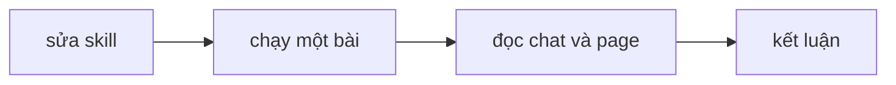
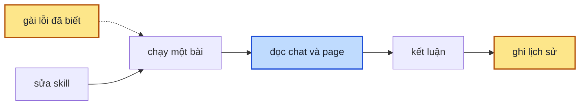

> **Nối tiếp:** [005](005-design-uiux-spec-skill-dong-bo.md) — bốn kịch bản chạy thử báo đạt mọi yêu cầu, nhưng
> plan 006 vẫn phải sửa 5 lỗi làm hỏng đầu ra. Plan này làm cho bộ bài mẫu tự chứng minh được nó bắt lỗi.

## 1. Problem

Skill design-uiux có ba bài mẫu để chạy thử sau mỗi lần sửa, nhưng chưa bài nào được chạy, và chưa ai biết chúng có
bắt được lỗi không. Đã có tiền lệ: bốn kịch bản chạy thử trước đó báo đạt mọi yêu cầu, trong khi skill còn 5 lỗi làm
hỏng page mà không ai hay. Ba bài hiện tại không bài nào nhìn tới 8 trên 28 yêu cầu của skill; vài dòng chấm theo cảm
giác ("dáng giống bảng của dự án"); kết quả chạy nằm ở thư mục không commit nên không so được giữa các lần.

## 2. Goal

- Một lệnh in mỗi yêu cầu của skill kèm bài mẫu hay phép kiểm đang nhìn tới nó, và báo lỗi khi có yêu cầu không ai nhìn tới, kể cả yêu cầu thêm sau này.
- Mỗi dòng quan sát chỉ ra file phải mở và một điều đếm hay trích ra được; hai người chấm độc lập cùng một lượt chạy cho cùng kết luận.
- Mỗi bài có ít nhất một lỗi gài sẵn; gài lỗi đó vào bản chép của skill thì bài trượt đúng dòng nó nhắm.
- Chạy một bài hai lần trên cùng một bản skill thì mọi dòng ra cùng kết luận.
- Mỗi lượt chạy để lại một dòng trong file lịch sử được commit: ngày, bản skill, bài, số dòng đạt trên tổng, các dòng trượt.

**Ngoài scope:** sửa skill theo những gì các lượt chạy tìm ra. Chỗ SKILL.md mơ hồ ghi sang hàng chờ sửa của skill.

## 3. Mental model

**Bây giờ chạy thế nào** — Người sửa skill xong thì chọn một bài, chép đầu vào ra một thư mục chạy thử, dán đề, đợi
skill dựng page. Rồi chính người đó đọc chat, mở page, đối chiếu với bảng quan sát và tự kết luận "có vẻ được". Không
ai biết bài đó có trượt nổi khi skill hỏng không, và kết quả nằm lại trên máy đã chạy.



**Sau plan chạy thế nào** — Cùng đường đó, khác ba chỗ. Một agent khác người chạy chấm từng dòng theo bảng quan sát,
mỗi dòng kèm chỗ trích bằng chứng. Kết quả thành một dòng trong file lịch sử commit cùng repo. Và một lần cho mỗi bài,
người ta cố ý gài một lỗi đã biết vào bản chép của skill rồi chạy: bài phải trượt đúng dòng, không trượt thì bài yếu.



Ô xanh: người đọc chat và page là một agent khác người chạy, chấm theo bảng.

**Hành vi đổi ra sao**

| #     | Tình huống | Bây giờ | Sau plan |
| ----- | ---------- | ------- | -------- |
| `BH1` | skill thêm một yêu cầu mới | không ai biết chưa có bài nào nhìn tới nó | lệnh soát bài mẫu báo lỗi, chỉ ra yêu cầu đó |
| `BH2` | skill hỏng chỗ đọc file màu của dự án | bài vẫn có thể được chấm đạt | bài 01 trượt dòng nói design system lấy từ đâu |
| `BH3` | hai người chấm cùng một lượt | dòng chấm theo cảm giác cho hai kết luận | cùng kết luận ở mọi dòng |
| `BH4` | muốn so skill với lần chạy tuần trước | phải lục thư mục chạy thử trên máy đã chạy | đọc file lịch sử trong repo |

**Không đụng:** cách skill chạy (SKILL.md, script, shell). Plan chỉ sửa bài mẫu và công cụ quanh nó.

---

## 5. Decisions

**Ai quyết:** 🤖 = agent tự quyết, chưa hỏi ai — **chỗ người duyệt phải soi** · 👤 = user chốt lúc bàn (luật 22).

### D0 👤 — Giữ đúng 3 bài; chỗ hở vá trong bài có sẵn, không thêm bài

**Lý do:** người dùng muốn 2–3 bài; mỗi lượt chạy tốn ~15 phút, thêm bài là thêm chi phí mọi lần sửa skill.

### D1 🤖 — Độ phủ và chữ trong bảng quan sát do một script soát, không viết tay

**Lý do:** bảng phủ viết tay lệch ngay khi SPEC thêm yêu cầu (PQ-01 sẽ thêm `F6`). → DS1
**Phương án đã loại:** mở rộng `scripts/spec-check.mjs` — lệnh đó chạy cho mọi skill, bài mẫu mới chỉ design-uiux có.

### D2 👤 — Vá `F3.4` bằng `DESIGN.md` chỉ có chữ trong project bài 01, viết khác giới hạn `G6`

**Lý do:** SKILL.md chỉ tính design system "nói khác" khi tài liệu viết ra hay component đang làm; token thôi không đủ. → DS2

### D3 👤 — `F1.9` chỉ tạo điều kiện: app bài 01 rộng 1024px, đề thêm trưởng ca cần đủ 9 cột

**Lý do:** yêu cầu có điều kiện, không ép skill gặp được; dòng quan sát có thêm kết quả `không chạm`. → DS2
**Đổi (2026-10-08):** 1152px thay 1024px — 1024px trùng bề rộng mặc định `64rem`, bài không phân biệt được agent đọc `app-shell.tsx` hay dùng mặc định.

### D4 🤖 — Lỗi gài lưu thành patch, chỉ áp lên bản chép của skill

**Lý do:** patch chạy lại được; áp lên repo thì một lượt quên gỡ là hỏng skill thật. → DS7

### D5 🤖 — Người chấm khác người chạy, chỉ đọc `sample.md` và thư mục kết quả

**Lý do:** người chạy biết mình định làm gì nên dễ chấm đạt cho ý định thay vì cho đầu ra. → DS4

### D6 🤖 — Chạy lặp 2 lượt mỗi bài; dòng lệch thì sửa câu, hay ghi sang hàng chờ nếu do SKILL.md

**Lý do:** hai lượt đủ thấy dòng lệch; câu quan sát mơ hồ là lỗi của bài, SKILL.md mơ hồ là lỗi của skill (PQ-03). → DS5

### D7 🤖 — Lịch sử chạy ở `samples/history.md`, commit cùng repo

**Lý do:** `.test/` bị gitignore. → DS4

### D8 🤖 — Mọi lượt chạy của plan này dùng một bản chụp cố định của skill

**Lý do:** plan 006 đang sửa SKILL.md cùng lúc; chạy trên repo thì hai lượt lặp có thể khác bản. → DS5

## 6. Design

### DS1 — Lệnh soát bài mẫu

```bash
node skills/design-uiux/samples/lint.mjs                 # soát, exit 1 nếu có lỗi
node skills/design-uiux/samples/lint.mjs --compare <a> <b>   # so cột Kết quả của hai result.md
```

| Soát | Lỗi khi |
| ---- | ------- |
| phủ | sub-scope `F<n>.<m>` trong mục 2 của `SPEC.md` không nằm trong dòng quan sát nào, cũng không nằm trong bảng `## Phủ ở chỗ khác` của `README.md` |
| mã lạ | dòng quan sát ghi mã mà SPEC không có, hay ghi mã scope (`F5`) thay vì sub-scope |
| bảng | bảng dưới `## Quan sát` và `## Vòng góp ý` không có đúng ba cột `Mã` · `Mở file` · `Đạt khi` |
| chữ cảm tính | ô `Đạt khi` chứa: giống, hợp lý, rõ, đẹp, dễ, phù hợp, tốt, ổn |

Dòng ghi `—` ở cột `Mã` là quan sát ngoài SPEC: được giữ, không tính phủ. Đầu ra: bảng `Mã · Bài · Chỗ khác`, dòng
cuối `✓ N sub-scope · M dòng quan sát` hay danh sách lỗi.

### DS2 — Vá bài 01

| Thứ | Đổi |
| --- | --- |
| `project/DESIGN.md` | mới, chỉ có chữ: mục "Đơn hoả tốc" nói dòng đơn hoả tốc nằm trong card nổi có bóng `shadow-lg` để thấy từ xa (khác `G6`) |
| `project/src/styles/tokens.css` | `--container-content: 1152px` |
| đề | thêm câu: trưởng ca cuối ca vẫn cần xem đủ 9 cột để đối soát với hãng vận chuyển |
| `## Quan sát` | thêm dòng `F1.8`, `F1.9` (kết quả được `không chạm`), `F3.4`; viết lại theo DS3 |

### DS3 — Dòng quan sát

| Cột | Ghi |
| --- | --- |
| `Mã` | một hay vài sub-scope, hay `—` |
| `Mở file` | đường dẫn trong thư mục chạy thử: `chat.md`, `.design/*/brief.md`, `check.log`, `subagent-*.md`, `shots/` |
| `Đạt khi` | điều đếm được ("≥ 2 page"), có hay không có một chuỗi ("có dòng `G6`"), hay so hai chỗ ("`pages.js` khớp `## Pages`") |

Người chạy phải để lại trong thư mục chạy thử: `chat.md` (mọi chữ in ra chat, đánh số dòng được), `check.log` (lần
`check.mjs` cả thư mục cuối cùng), `subagent-<x>.md` (báo cáo từng agent con).

### DS4 — Phiếu chấm và lịch sử

`<thư mục chạy thử>/result.md`:

```markdown
# Kết quả · <bài> · <thư mục>

Ngày: 2026-10-08 · Bản skill: <commit> + SKILL.md <8 ký tự sha256> · Người chấm: agent

| # | Mã | Kết quả | Bằng chứng |
| - | -- | ------- | ---------- |
| Q1 | `F1.7` `F3.1` | đạt | `chat.md` dòng 3: "Đọc: design system từ `src/styles/tokens.css`…" |
| G1 | `F4.1` | trượt | `.design/001-don-hang/` có thêm `04-gom-hoa-toc.html` |
```

`#` là `Q<n>` theo thứ tự dòng ở `## Quan sát`, `G<n>` ở `## Vòng góp ý`. `Kết quả` ∈ `đạt` · `trượt` · `không chạm`.

`samples/history.md`: một dòng mỗi lượt —
`Ngày · Bản skill · Bài · Lỗi gài · Đạt / tổng · Trượt · Không chạm · Thư mục`.

### DS5 — Chạy lặp

```bash
SNAP=$TMPDIR/design-uiux-snap-<sha8>; mkdir -p $SNAP && cp -R skills/design-uiux $SNAP/
node skills/design-uiux/samples/prepare.mjs <bài> --skills $SNAP --slug lan-1   # rồi lan-2
```

3 bài × 2 lượt trên cùng `$SNAP`; mỗi lượt một agent chạy, một agent chấm. Lượt `lan-1` của bài 01 có thêm một agent
chấm thứ hai, ghi `result-2.md`. `lint.mjs --so` so từng cặp.

### DS6 — Chuẩn bị thư mục chạy thử

```bash
node skills/design-uiux/samples/prepare.mjs <bài> [--skills <thư mục chứa design-uiux>] [--slug <chữ>]
```

| Việc | Kết quả |
| ---- | ------- |
| tạo thư mục | `.test/design-uiux/NNN-sample-<bài>[-<slug>]/`, `NNN` = số lớn nhất đang có + 1 |
| chép đầu vào | nội dung `project/` của bài nếu có; không chép `sample.md` |
| trỏ skill | `.claude/skills` → `--skills` (mặc định `skills/` của repo) |
| in ra stdout | JSON `{ dir, prompt, feedback: [...] }`: khối ```` ```text ```` dưới `## Đề` và dưới `## Vòng góp ý` |

### DS7 — Lỗi gài

`samples/faults/L<n>.patch`, `diff -u` trên `SKILL.md`. Áp:
`cp -R $SNAP $TMPDIR/design-uiux-L<n> && patch $TMPDIR/design-uiux-L<n>/design-uiux/SKILL.md < L<n>.patch`.

| Lỗi | Sửa gì trong SKILL.md | Bài | Phải trượt dòng |
| --- | --------------------- | --- | --------------- |
| L1 | Bước 1: bỏ nguồn file CSS `@theme` và câu "File CSS có `@theme` thắng `DESIGN.md`" | 01 | `F3.1`: `tokens.js` lấy từ `tokens.css` |
| L2 | "Viết một page": bỏ "cộng trạng thái riêng của đề" ở luật `state` | 02 | `F3.3`: trạng thái riêng |
| L3 | bỏ cả mục "Bước 2 — Đề mơ hồ thì hỏi" | 03 | `F1.1`: câu hỏi đã soạn in ra |
| L4 | Vòng sau: bỏ bullet "Góp ý đổi dữ liệu chung" | 01 | `F4.3`: `## Dữ liệu chung` đổi, mọi page đổi |

Patch không áp được vì SKILL.md đã đổi thì viết lại patch, giữ mã `L<n>`.

## 7. Phases

**Legend:** 🤖 = agent tự kiểm được (chạy lệnh, test, grep) · 👤 = cần người kiểm (số đo thật, UI, hạ tầng).

- [x] 👤 plan này được duyệt — 2026-10-08, người dùng: "lưu plan và triển khai"

### Phase 0 — ghi doc nguồn

**Goal:** PLANS.md có mục 007; SPEC mục 5 tả `samples/` đúng các file sắp có.
**Cover:** —

**Actions:**

- [x] 🤖 `skills/design-uiux/PLANS.md`: mục `### 007 · Bài mẫu đạt chuẩn để chạy thử skill`, không bảng mã (không đổi yêu cầu) — 2026-10-08
- [x] 🤖 `skills/design-uiux/SPEC.md` mục 5: dòng `samples/` nhắc `lint.mjs`, `prepare.mjs`, `history.md` — 2026-10-08, thêm 2 dòng

**Gate:**

- [x] 🤖 `node scripts/spec-check.mjs skills/design-uiux` exit 0, PLANS.md đếm thêm một việc `approved` — 28 sub-scope · 5 approved (trước 4)
- [x] 🤖 `python3 ~/.claude/skills/write-plan/verify.py .plan/007-design-uiux-bai-mau-dat-chuan.md` — 0 ERROR — 2026-10-08, sạch

### Phase 1 — phủ đủ yêu cầu

**Goal:** `lint.mjs` chạy được và báo sạch trên ba bài đã vá.
**Cover:** DS1 · DS2

**Actions:**

- [x] 🤖 `samples/lint.mjs`: bốn phép soát và `--compare` theo DS1 (D1) — 2026-10-08
- [x] 🤖 `samples/README.md`: bảng `## Phủ ở chỗ khác` cho `F2.1`–`F2.5` → `scripts/test-shell.mjs` — 2026-10-08, 5 dòng
- [x] 🤖 bài 01: `DESIGN.md`, bề rộng 1152px, câu đối soát trong đề (D2 · D3) — 2026-10-08

**Gate:**

- [x] 🤖 `lint.mjs` exit 0, 28/28 sub-scope có chỗ phủ — DS1 · BH1 — 2026-10-08, `✓ 28 sub-scope · 3 bài · 37 dòng quan sát`
- [x] 🤖 bỏ thử dòng `F3.4` khỏi bài 01 → `lint.mjs` exit 1, chỉ ra `F3.4`; thêm thử `F6.1` vào SPEC bản chép → exit 1 — DS1 · BH1 — 2026-10-08, cả hai exit 1, in đúng mã (`LINT_SPEC=<bản chép>`)
- [x] 🤖 `node skills/design-uiux/scripts/new-design.mjs tokens` trên `tokens.css` bài 01 với `--page-width 1152px` ra `"width":"1152px"`; không cờ thì `64rem` — DS2 — 2026-10-08

### Phase 2 — dòng quan sát kiểm được, phiếu chấm, chuẩn bị chạy

**Goal:** chuẩn bị một lượt chạy bằng một lệnh; mọi dòng quan sát viết theo DS3.
**Cover:** DS3 · DS4 · DS6

**Actions:**

- [x] 🤖 viết lại `## Quan sát`, `## Vòng góp ý` của ba bài theo DS3; thêm mục "Người chạy để lại" vào `README.md` — 2026-10-08, 37 dòng
- [x] 🤖 `samples/README.md`: khuôn `result.md` theo DS4; cách chạy đổi sang `prepare.mjs` (D5) — 2026-10-08
- [x] 🤖 `samples/history.md`: bảng rỗng theo DS4 (D7) — 2026-10-08
- [x] 🤖 `samples/prepare.mjs` theo DS6 — 2026-10-08

**Gate:**

- [x] 🤖 `lint.mjs` exit 0, không ô `Đạt khi` nào có chữ cảm tính — DS3 — 2026-10-08; gài thử "trông giống" và mã `F5` → exit 1, in cả hai
- [x] 🤖 `prepare.mjs 01-orders-screen` tạo thư mục có `src/routes/orders.tsx`, không có `sample.md`, `.claude/skills/design-uiux/SKILL.md` đọc được; JSON có `prompt` và 2 `feedback` — DS6 — 2026-10-08, symlink `../../../../skills`
- [x] 🤖 `prepare.mjs 03-vague-prompt` tạo thư mục chỉ có `.claude/`; `feedback` rỗng — DS6 — 2026-10-08; `--skills /tmp` → exit 2 "không thấy …/SKILL.md"
- [x] 🤖 `lint.mjs --so` trên hai `result.md` mẫu, một dòng khác kết quả → exit 1, in dòng đó — DS4 — 2026-10-08, in `Q2 "đạt" · "trượt"`; cùng file → `✓ 2 dòng`

### Phase 3 — chạy lặp

**Goal:** biết mỗi bài cho cùng kết luận khi chạy lại trên cùng bản skill.
**Cover:** DS5

**Actions:**

- [x] 🤖 chụp skill vào `$SNAP`, ghi sha256 của `SKILL.md` (D8) — 2026-10-08, `3d95ecd` + working tree của plan 006, SKILL.md `a07e3f8a`
- [ ] 🤖 3 bài × 2 lượt, mỗi lượt một agent chạy `--auto`, một agent chấm ra `result.md` (D5)
- [ ] 🤖 lượt `lan-1` bài 01: agent chấm thứ hai ra `result-2.md`
- [ ] 🤖 6 dòng vào `samples/history.md`
- [ ] 🤖 dòng lệch: sửa câu quan sát, hay ghi sang PQ-03 nếu do SKILL.md (D6)

**Gate:**

- [ ] 🤖 `lint.mjs --so` từng cặp `lan-1` / `lan-2` exit 0 cho cả ba bài — DS5 · BH3
- [ ] 🤖 `lint.mjs --compare result.md result-2.md` bài 01 exit 0 — DS5 · BH3
- [ ] 🤖 `history.md` có 6 dòng, mỗi dòng trỏ thư mục có thật

### Phase 4 — gài lỗi

**Goal:** mỗi bài đã chứng minh được nó trượt khi skill hỏng chỗ nó nhắm.
**Cover:** DS7

**Actions:**

- [x] 🤖 `samples/faults/L1.patch`…`L4.patch` theo DS7, viết trên `$SNAP` (D4) — 2026-10-08, cả bốn `patch` áp được lên bản chép
- [ ] 🤖 mỗi lỗi một lượt chạy và một lượt chấm; 4 dòng vào `history.md`, cột `Lỗi gài` ghi `L<n>`
- [ ] 🤖 lỗi không làm bài trượt: sửa dòng quan sát hay bài rồi chạy lại, hay thay lỗi khác cùng bài

**Gate:**

- [ ] 🤖 L1 → bài 01 trượt dòng `F3.1` — DS7 · BH2
- [ ] 🤖 L2 → bài 02 trượt dòng `F3.3` — DS7
- [ ] 🤖 L3 → bài 03 trượt dòng `F1.1` — DS7
- [ ] 🤖 L4 → bài 01 trượt dòng `F4.3` — DS7
- [ ] 🤖 mỗi bài có ít nhất một lỗi gài làm nó trượt đúng dòng; các dòng khác của lượt đó giữ kết quả như `lan-1`

### Phase 5 — nghiệm thu

**Goal:** mỗi bullet §2 có bằng chứng từ các lượt chạy thật.
**Cover:** —

**Actions:**

- [ ] 🤖 đọc lại `history.md` và các `result.md`, đối chiếu từng bullet §2

**Gate:**

- [ ] 🤖 §2 bullet 1: `lint.mjs` exit 0 trên repo; bỏ một mã hay thêm mã mới vào SPEC bản chép → exit 1 · BH1
- [ ] 🤖 §2 bullet 2: mọi ô `Đạt khi` qua `lint.mjs`; hai agent chấm bài 01 `lan-1` cùng kết luận · BH3
- [ ] 🤖 §2 bullet 3: ba bài đều có lỗi gài làm trượt đúng dòng · BH2
- [ ] 🤖 §2 bullet 4: ba cặp `lan-1` / `lan-2` cùng kết luận
- [ ] 🤖 §2 bullet 5: `history.md` có 10 dòng, mỗi dòng đủ cột · BH4
- [ ] 🤖 `python3 ~/.claude/skills/write-plan/verify.py .plan/007-design-uiux-bai-mau-dat-chuan.md` — 0 ERROR
