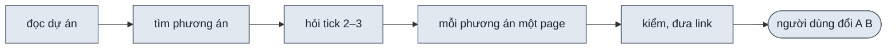
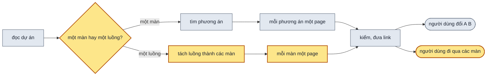

> **Lật:** D0 · D10 của [002](002-design-uiux-improve.md): không còn hỏi tick phương án, `--auto` không còn câu chọn phương án để thay · D1 của 002: tối đa hai phương án thay vì ba. **Giữ:** D2 · D6 · D7 của 002.

## 1. Problem

Đề nào skill cũng tìm 2–3 phương án rồi hỏi người dùng tick. Người dùng phải đọc bảng so sánh và chọn trước khi có gì
để xem. Đề là một luồng nhiều màn (onboarding, đăng ký, thanh toán) cũng đi đúng đường đó: skill tìm phương án cho cả
luồng, không tách luồng thành từng màn. Không ai biết luồng có mấy màn, cũng không xem được từng màn riêng. Mỗi agent
con tự quyết gộp các màn vào một page hay không, nên hai lần chạy cùng một đề ra hai kiểu khác nhau.

## 2. Goal

- Trước khi tìm phương án, skill nói rõ đề là **một màn** (người dùng làm việc trên đúng một màn hình: sửa màn có sẵn
  hay tạo màn mới) hay **một luồng** (người dùng đi qua nhiều màn hình nối nhau). Không xếp được thì skill hỏi người
  dùng.
- Đề một màn ra hai page phương án A và B, dựng cùng lúc, không hỏi người dùng chọn; không bao giờ quá hai, kể cả khi
  đề xin nhiều hơn. Nếu chỉ tìm được một hướng khác biệt thật, thì skill dựng một page và nói lý do trong chat.
- Đề một luồng ra đúng một phương án. Chat có bảng các màn của luồng. Mỗi màn là một page.
- Trong thư mục luồng, người xem đi từ màn đầu tới màn cuối bằng nút trong page hay dãy màn trên toolbar. Chữ đã nhập
  ở màn trước vẫn còn khi quay lại.

**Ngoài scope:** tiến độ dựng hiện trên page (plan 009) · luồng có nhánh rẽ (mỗi luồng là một dãy màn thẳng; nhánh lỗi
là một trạng thái của màn đó) · nhiều phương án cho một luồng.

## 3. Mental model

**Bây giờ chạy thế nào** — Người dùng đưa đề "thiết kế luồng onboarding 3 màn". Agent đọc dự án, tìm 2–3 phương án
cho cả luồng, in bảng so sánh rồi hỏi người dùng tick. Người dùng tick hai phương án. Agent chuẩn bị bản tóm tắt
chung, gọi hai agent con dựng song song. Mỗi agent con tự quyết gộp ba màn vào một page hay không, rồi dựng và kiểm.
Khi mọi agent con xong, agent chính kiểm cả thư mục rồi đưa link. Trên thanh công cụ có nút A B để đổi giữa hai
phương án.

**Sau plan chạy thế nào** — Agent đọc dự án, rồi xếp đề: một màn hay một luồng.

- **Một màn**, ví dụ "thiết kế lại màn đăng nhập": agent tìm phương án theo tình huống dùng như bây giờ, lấy hai
  phương án A và B. Nó in bản phác cả hai vào chat rồi dựng luôn, không hỏi tick. Thanh công cụ vẫn có nút A B.
- **Một luồng**, ví dụ onboarding 3 màn: agent không tìm phương án. Nó tách luồng thành các màn, mỗi màn một dòng
  (tên, để làm gì, nhận gì từ màn trước, đưa gì cho màn sau), in bảng đó vào chat rồi dựng mỗi màn một page. Trên
  thanh công cụ, chỗ nút A B thành dãy "1 · Welcome → 2 · Đăng ký → 3 · Hồ sơ". Bấm "Tiếp tục" trong page thì sang
  màn sau, chữ đã gõ đi theo.

**Hành vi đổi ra sao**

| #     | Tình huống | Bây giờ | Sau plan |
| ----- | ---------- | ------- | -------- |
| `BH1` | đề "thiết kế lại màn đăng nhập" | in 2–3 phương án, hỏi tick | chat nói "một màn", in bản phác A và B, dựng hai page cùng lúc; không có câu hỏi chọn |
| `BH2` | đề "cho tôi 3 phương án màn đăng nhập" | in phương án, hỏi tick | dựng hai page A, B, không hỏi; chat ghi "đề xin 3, mỗi màn tối đa hai phương án A/B" |
| `BH3` | đề một màn mà chỉ có một hướng khác biệt thật | còn một phương án thì dựng một page, không nói gì | dựng một page; chat nói vì sao không có B (hướng kia chỉ khác bố cục, đã là một nút ở config-panel) |
| `BH4` | đề "luồng onboarding 3 màn: Welcome, Đăng ký, Hồ sơ" | tìm phương án cho cả luồng, hỏi tick; ba màn có thể nằm chung một page | chat nói "một luồng", in bảng 3 màn, dựng 3 page; thanh công cụ "1 · Welcome → 2 · Đăng ký → 3 · Hồ sơ" |
| `BH5` | trong luồng, gõ email ở màn 2, bấm "Tiếp tục" rồi "Quay lại" | — | sang page màn 3, về lại màn 2, email vẫn còn trong ô |
| `BH6` | đề "làm phần đăng ký cho app" — không rõ một màn hay một luồng | — | lượt hỏi làm rõ có câu "một màn hay cả luồng?"; `--auto` lấy đáp án khuyên dùng và ghi lại |
| `BH7` | sau khi giao A và B, người dùng muốn xem hướng C đã nhắc trong chat | nói "dựng thêm C" thì có page thứ ba | agent dựng C thay page A hay B mà người dùng chỉ; thư mục vẫn hai page |

**Không đụng:** cách tìm phương án theo tình huống dùng và ba phép thử · bộ nguyên tắc, giới hạn thiết kế và cách
kiểm chúng · data-panel, config-panel, khổ màn, sáng tối · cách dựng một page.

---

## 4. Probe

### P1 — Trên `file://` trong Chrome, `sessionStorage` có giữ khi sang một file HTML khác cùng thư mục, và iframe có đọc chung với page cha không?

**Biết để làm gì:** được thì chữ đã gõ đi theo giữa các màn mà không cần URL; không được thì chỉ còn mang chữ trên URL hay bỏ tính năng
**Cách chạy lại:** `node .test/design-uiux/033-probe-session-file/probe.mjs` — `a.html` ghi khoá rồi nhúng iframe `c.html`, chuyển sang `b.html` đọc lại
**Kết quả:** iframe đọc được khoá của page cha; `b.html` đọc được khoá của `a.html` và khoá iframe ghi — 2026-10-08, Chrome hệ thống qua Playwright `channel: "chrome"`

## 5. Decisions

**Ai quyết:** 🤖 = agent tự quyết, chưa hỏi ai — **chỗ người duyệt phải soi** · 👤 = user chốt lúc bàn (luật 22).

### D0 👤 — Agent xếp đề vào một màn hay một luồng trước khi tìm phương án; không xếp được thì hỏi ở lượt hỏi làm rõ

**Lý do:** một màn cần so hướng; một luồng cần thấy đủ các màn nối nhau — hai việc khác nhau từ đầu → DS1
**Phương án đã loại:** chữ "step / flow" — "step" nghe như một bước trong flow · "single page / multiple pages" — "page" đã là file HTML, đề một màn ra hai page

### D1 👤 — Đề một màn: dựng hai phương án A và B cùng lúc, không hỏi người dùng chọn

**Lý do:** có hai bản để so mà không phải đọc bảng rồi tick; mỗi phương án một agent con như D6 của 002 → DS1
**Phương án đã loại:** hỏi tick 2–3 (D0 của 002) — người dùng chờ một lượt trước khi có gì để xem

### D2 👤 — Đề một màn tối đa hai phương án, kể cả khi đề xin nhiều hơn

**Lý do:** so A/B là so từng cặp, như A/B testing; người dùng muốn xem hướng thứ ba thì agent dựng nó thay A hay B → DS1

### D3 👤 — Đề một màn mà ba phép thử chỉ còn một hướng: dựng một page, chat nói lý do

**Lý do:** bịa B chỉ khác bố cục là bắt người dùng so hai bản gần giống nhau; khác bố cục đã là nút ở config-panel → DS1

### D4 👤 — Đề một luồng: một phương án; agent tách luồng thành các màn, in bảng màn vào chat rồi dựng luôn

**Lý do:** nhiều phương án × nhiều màn là quá nhiều page để so; sai màn thì góp ý sau → DS1 · DS2
**Phương án đã loại:** hỏi xác nhận bảng màn — thêm một lượt chờ trước khi có link

### D5 👤 — Luồng: mỗi màn một page; toolbar hiện dãy màn thay nút A B; nút trong page sang màn trước, sau

**Lý do:** mỗi page dựng song song được; đi qua luồng giống đi qua các màn thật → DS2 · DS3
**Phương án đã loại:** cả luồng trong một page, màn là một nút vặn — một agent dựng tuần tự, page lớn, lâu có bản đầu

### D6 🤖 — Chữ người xem nhập ở một màn đi theo sang màn khác qua `sessionStorage` của thư mục design, không qua URL

**Lý do:** chữ đang gõ không phải giá trị vặn; để trên URL thì link chép mang theo mật khẩu mẫu, link dài — dựa vào `P1` → DS2
**Phương án đã loại:** không mang theo — quay lại màn trước thấy ô trống, không giống luồng thật

### D7 🤖 — Mỗi page của luồng do một agent con dựng song song; brief thêm bảng `## Luồng` để các màn nối khớp nhau

**Lý do:** giống D6 · D7 của 002 cho phương án; bảng Luồng chốt màn nào nhận gì, đưa gì để agent con không tự đoán → DS2

## 6. Design

### DS1 — Xếp đề và số phương án (SKILL.md Bước 2, Bước 3)

| Loại | Nhận ra khi | Ví dụ |
| --- | --- | --- |
| **một màn** | đề nói tới một màn: sửa màn có sẵn, tạo một màn mới, một modal, một trang cài đặt | "thiết kế lại màn đăng nhập", "màn Đơn hàng nhìn rối" |
| **một luồng** | đề liệt kê ≥ 2 màn nối nhau, hay gọi tên một luồng: onboarding, đăng ký, thanh toán, "luồng", "các bước", "wizard" | "luồng onboarding 3 màn", "luồng đặt lịch từ chọn dịch vụ tới thanh toán" |
| chưa rõ | đề gọi tên một phần của app mà không nói một màn hay nhiều | "làm phần đăng ký cho app" |

- Chưa rõ: Bước 2 thêm câu "Một màn hay cả luồng?" với hai đáp án. Đáp án khuyên dùng là **một màn** khi đề nhắc đúng
  một màn có sẵn trong dự án, ngược lại là **một luồng**. `--auto` lấy đáp án khuyên dùng.
- `## Quyết định` của `brief.md` thêm dòng `Loại đề` · `một màn` hay `một luồng` · ai quyết (`AI đoán` khi agent tự xếp).

| Loại | Số page | Agent làm | Chat in ra |
| --- | --- | --- | --- |
| một màn | 2 (A, B) | bảng tình huống × phương án, ba phép thử như hiện có; lấy hai phương án `nhanh` ở hai nhóm tình huống hay gặp nhất; không gọi AskUserQuestion | `Đọc:` · "Đang có gì" (đề sửa màn) · bảng tình huống × phương án · khối A, khối B · dòng `Hướng khác:` nếu còn C |
| một màn, đề xin ≥ 3 phương án | 2 (A, B) | như trên | như trên, thêm dòng "Đề xin <n>; mỗi màn tối đa hai phương án A/B" |
| một màn, ba phép thử còn 1 | 1 | dựng phương án đó; agent chính tự dựng như hiện có | khối A · dòng `Chỉ một hướng: <lý do>` — ví dụ "hướng kia chỉ khác bố cục, đã là nút Bố cục ở config-panel" |
| một luồng | số màn | không tìm phương án; tách luồng theo DS2 | `Đọc:` · bảng Luồng · một dòng "Một luồng: một phương án, mỗi màn một page" |

`## Pages` của `brief.md` ghi cả phương án không dựng (trạng thái `chưa chọn`). Người dùng muốn xem hướng đó thì agent
dựng nó thay page A hay B mà người dùng chỉ, không thêm page thứ ba. Page bị thay đổi trạng thái thành `chưa chọn`.

### DS2 — Luồng: bảng màn, `pages.js`, chuyển màn

Bảng `## Luồng` trong `brief.md`, agent chính điền trước khi gọi agent con, in nguyên vào chat:

| Màn | Tên | Để làm gì | Nhận từ màn trước | Đưa cho màn sau | Trạng thái riêng | File |
| --- | --- | --- | --- | --- | --- | --- |
| 1 | Welcome | biết app làm gì, bắt đầu | — | — | — | `01-welcome.html` |
| 2 | Đăng ký | tạo tài khoản | — | `form.email` | `email-trung`, `mat-khau-yeu` | `02-dang-ky.html` |
| 3 | Hồ sơ | đặt tên, ngân sách | `form.email` | `form.name`, `form.budget` | — | `03-ho-so.html` |

- Mỗi màn một page, tạo bằng `new-design.mjs page "$D" <slug> --title "<luồng> · <tên màn>" --screen "<n> · <tên màn>"
  --purpose "<để làm gì>"`. `--screen` và `--option` không cùng một thư mục; trộn thì exit 1.
- `pages.js`: mục màn có `screen`, `purpose` thay `option`, `question`. Thứ tự trong file là thứ tự màn.
- Nhánh lỗi của một màn là `state` của page đó, không là màn riêng. Luồng có nhánh rẽ: ngoài scope (§2).
- Mọi page trong thư mục luồng dùng chung "Nút dữ liệu chung", "Khối", "Cặp màu không đủ đọc" như các page phương án.

Shell với thư mục luồng (`pages.js` có `screen`):

| Khối | Làm gì |
| --- | --- |
| dãy màn (chỗ option-switcher) | "1 · Welcome → 2 · Đăng ký → 3 · Hồ sơ"; màn đang xem đậm; rê vào thấy `purpose`; hẹp ≤ 480px chỉ còn số; bấm thì sang page đó, giữ cả query |
| `$store.design.next()` · `prev()` | sang page của màn sau, trước theo thứ tự `pages.js`, giữ cả query; màn cuối gọi `next()` thì không làm gì |
| `$store.design.form` | object chung cho mọi page của thư mục; ghi vào `sessionStorage['ds-form:<thư mục design>']` mỗi lần đổi, đọc lại khi mở page; nút về mặc định xoá nó (D6) |

Page của màn khai ô nhập bằng `x-model="$store.design.form.<key>"`, key đúng cột "Đưa cho màn sau" của bảng Luồng.

### DS3 — Máy kiểm với thư mục luồng (`check.mjs`)

| Phần kiểm | Làm gì |
| --- | --- |
| lượt tĩnh | `## Luồng` khớp `pages.js`: cùng số màn, cùng thứ tự, cùng file; page của màn 1..n−1 có lời gọi `next()`, page 2..n có `prev()` |
| lượt bấm | cú bấm làm page chuyển sang một file trong `pages.js` là hợp lệ: ghi ảnh, quay lại, không báo lỗi |
| lượt đi luồng (cả thư mục) | mở màn 1 ở mặc định, bấm thứ gọi `next()` tới màn cuối; điền ô `form.*` bằng chữ mẫu trước khi sang; tới màn n, `prev()` một lần, ô của màn n−1 còn chữ. Không tới được thì lỗi `không sang được màn <k>` |
| thư mục phương án | ≥ 3 page có `option` thì lỗi `quá hai phương án` |

### DS4 — SPEC.md và SKILL.md

Sub-scope trong SPEC:

| Mã | Thay đổi | Chữ |
| --- | --- | --- |
| `F1.11` | new | Agent xếp đề vào một màn (người dùng làm việc trên một màn hình) hay một luồng (người dùng đi qua nhiều màn hình nối nhau) trước khi tìm phương án. |
| `F1.12` | new | Nếu chưa xếp được đề là một màn hay một luồng, thì agent hỏi người dùng trong lượt hỏi làm rõ. |
| `F1.2` | update | Khi đề là một màn, agent dựng hai phương án A và B và không hỏi người dùng chọn. |
| `F1.13` | new | Nếu đề một màn xin hơn hai phương án, thì agent dựng hai phương án A và B và nói lý do trong chat. |
| `F1.14` | new | Nếu ba phép thử chỉ còn một phương án, thì agent dựng một page và nói lý do trong chat. |
| `F1.15` | new | Khi đề là một luồng, agent dựng đúng một phương án. |
| `F1.16` | new | Khi đề là một luồng, agent in bảng các màn của luồng vào chat trước khi dựng. |
| `F1.17` | new | Mỗi màn của luồng là một page. |
| `F1.4` | update | Với `--auto`, agent chọn đáp án khuyên dùng thay người dùng, không dừng hỏi. |
| `F1.5` | update | Nếu thư mục có từ hai page trở lên, thì mỗi page do một agent con dựng, các agent con chạy song song. |
| `F2.4` | update | Người xem chuyển giữa các phương án bằng nút A B. |
| `F2.6` | new | Trong lúc xem thư mục luồng, người xem chuyển màn bằng dãy màn trên toolbar hay nút trong page. |
| `F2.7` | new | Khi người xem chuyển màn trong luồng, chữ đã nhập ở các màn giữ nguyên. |
| `F5.8` | new | Khi kiểm thư mục luồng, máy kiểm đi được từ màn đầu tới màn cuối bằng nút trong page. |

SPEC mục 2: bảng "Hai bản khác nhau ở" thêm dòng **màn của luồng** (người xem đổi bằng dãy màn). Mục 3: 3.1 thêm bảng
`## Luồng`; 3.4 thêm dãy màn, `next()` · `prev()` · `form`; 3.5 luồng agent có bước xếp đề; 3.6 thêm lượt đi luồng.
Mục 4: dòng "tối đa 3 phương án" thành "tối đa 2, A/B"; thêm lý do của D0 · D1 · D3 · D4 · D5 · D6.

SKILL.md:

| Mục | Đổi gì |
| --- | --- |
| frontmatter `description` | "xếp đề là một màn hay một luồng; một màn ra hai phương án A/B dựng song song, không hỏi; một luồng ra một phương án, mỗi màn một page" thay câu "tả 2–3 phương án … cho người dùng tick chọn" |
| Mental model | sơ đồ: nhánh một màn / một luồng thay hộp "người dùng tick 1–3"; bảng file: `pages.js` có `screen`; `brief.md` có `## Luồng` |
| Các khối điều khiển | option-switcher: nút A B; thư mục luồng thì là dãy màn |
| Cờ `--auto` | bỏ dòng Bước 3 (không còn câu chọn phương án) |
| Bước 2 | câu hỏi "Một màn hay cả luồng?" khi chưa xếp được (DS1) |
| Bước 3 | "Xếp đề và số phương án" theo DS1: nhánh một màn giữ cách tìm phương án, bỏ AskUserQuestion; nhánh một luồng là bảng màn (DS2) |
| Bước 4 | luồng: `page --screen --purpose` cho từng màn, điền `## Luồng` trước khi gọi agent con; lời giao nói màn trước, sau, key `form.*` |
| Viết một page | page của màn dùng `$store.design.next()` · `prev()` · `form` theo DS2 |
| Bước 6 | luồng: link màn đầu và bảng màn; một màn chỉ một page: câu lý do của D3 |
| Vòng sau | muốn xem hướng chưa dựng: thay A hay B (D2); luồng thêm, bớt màn: sửa `## Luồng`, `page --screen`, sửa `next()` · `prev()` của màn kề |
| Bẫy đã gặp | "để chữ đã nhập trong state Alpine riêng của page" → sang màn khác mất chữ; "gộp các màn của luồng vào một page" → không xem được từng màn |
| dòng `spec:` | gắn mọi mã mới vào đúng mục |

### DS5 — Test Strategy

| File / lệnh | Vai |
| ----------- | --- |
| `scripts/test-shell.mjs` | thư mục luồng 3 page → dãy "1 · … → 2 · … → 3 · …", không có nút A B; `next()` sang page 2 giữ query; `form.email` gõ ở page 2, `next()` rồi `prev()` → ô còn chữ; nút về mặc định xoá `form` |
| `scripts/test-check.mjs` + `scripts/fixtures/check/` | thư mục luồng 3 page đủ nút → exit 0, lượt bấm không báo lỗi khi page chuyển sang file khác; bản page 2 thiếu nút sang màn 3 → exit 1 `không sang được màn 3`; thư mục 3 page `option` → exit 1 `quá hai phương án` |
| `samples/` | bài 01 (sửa màn Đơn hàng) phủ `F1.2` · `F1.5` · `F1.11`; bài 02 (onboarding 3 màn) phủ `F1.15`–`F1.17` · `F2.6` · `F2.7` · `F5.8`; bài 03 (đề mơ hồ) phủ `F1.12`; `lint.mjs` exit 0 |

## 7. Phases

**Legend:** 🤖 = agent tự kiểm được (chạy lệnh, test, grep) · 👤 = cần người kiểm (số đo thật, UI, hạ tầng).

- [x] 👤 plan này được duyệt — 2026-10-08, người dùng: "oke triển khai 008"

### Phase 0 — ghi doc nguồn

**Goal:** SPEC và PLANS của design-uiux khớp plan này.
**Cover:** —

**Actions:**

- [x] 🤖 `SPEC.md` mục 2: các sub-scope theo bảng DS4 (D0 · D1 · D2 · D4 · D5) — 2026-10-08, 14 mã; bảng "Hai bản khác nhau ở" thêm dòng màn của luồng
- [x] 🤖 `SPEC.md` mục 3, 4: technical design và lý do theo DS4 — 2026-10-08: 3.1 · 3.4 · 3.5 · 3.6; mục 4 thêm 10 dòng lý do
- [x] 🤖 `PLANS.md`: mục `### 008`, bảng mã theo DS4 — 2026-10-08, status `approved`

**Gate:**

- [x] 🤖 `node scripts/spec-check.mjs skills/design-uiux` exit 0 — 2026-10-08, đạt sau Phase 2: `✓ 38 sub-scope`. Lần chạy đầu ở Phase 0 exit 1, 8 lỗi đều là "`F1.11`–`F1.17`, `F5.8` chưa có trong SKILL.md", vì mục SKILL.md gắn các mã này viết ở Phase 2
- [x] 🤖 `python3 ~/.claude/skills/write-plan/verify.py .plan/008-design-uiux-mot-man-luong.md` — 0 ERROR — 2026-10-08, 0 ERROR · 0 WARN

### Phase 1 — thư mục luồng: mỗi màn một page, đi qua được

**Goal:** tạo một thư mục luồng 3 màn bằng `new-design.mjs page --screen`, mở ra đi từ màn 1 tới màn 3 bằng nút trong page, chữ đã nhập còn khi quay lại.
**Cover:** DS2 · DS3

**Actions:**

- [x] 🤖 `scripts/new-design.mjs`: `page --screen --purpose`, chặn trộn với `--option` (D5) — 2026-10-08; thêm chặn `--screen` sai dạng `<n> · <tên>`
- [x] 🤖 `templates/brief.md`: mục `## Luồng` theo DS2 (D7); dòng `Loại đề` trong `## Quyết định` theo DS1 — 2026-10-08
- [x] 🤖 `shell/shell.js` + `shell/shell.css`: dãy màn, `next()` · `prev()`, `form` trong `sessionStorage` (D5 · D6) — 2026-10-08; khung mobile / tablet nhờ trang cha chuyển màn và gửi `form` lên bằng `postMessage`
- [x] 🤖 `references/shell-principles.md`: mục dãy màn — 2026-10-08, mục "Dãy màn: thấy mình đang ở đâu trong luồng"
- [x] 🤖 `scripts/check.mjs`: lượt tĩnh, lượt bấm, lượt đi luồng, chặn quá hai phương án theo DS3 (D2) — 2026-10-08; lượt tĩnh bỏ comment HTML trước khi tìm `next(`
- [x] 🤖 `scripts/test-shell.mjs` · `scripts/test-check.mjs` · `scripts/fixtures/check/`: các ca của DS5 — 2026-10-08: test-shell thêm 8 phép luồng; test-check thêm C6 · C7 · C8, fixture `luong-man.html`, `luong-brief.md`

**Gate:**

- [x] 🤖 `node skills/design-uiux/scripts/test-shell.mjs --pw $TMPDIR/design-uiux-pw` — mọi phép ✓, gồm các phép luồng: dãy màn đúng, `next()` giữ query, `form.email` còn sau `next()` rồi `prev()` — DS2 · BH4 · BH5 — 2026-10-08: 59/59 ✓, exit 0, `.test/design-uiux/044-shell-luong/test-shell.log`; ảnh `flow-1280.png`, `flow-375.png`
- [x] 🤖 `node skills/design-uiux/scripts/test-check.mjs` — bản thiếu nút exit 1 `không sang được màn 3`; bản đủ nút exit 0; thư mục 3 page `option` exit 1 `quá hai phương án` — DS3 — 2026-10-08: C1–C8 ✓; C6 `✓ 3 page · 60 tổ hợp · 0 lỗi`; log ở `.test/design-uiux/045-check-luong/`
- [x] 🤖 `new-design.mjs page` với `--screen` vào thư mục đã có page `--option` → exit 1 — DS2 — 2026-10-08, phép "new-design: … từ chối" ✓ trong test-shell, gồm cả chiều ngược lại và `--screen` sai dạng
- [x] 🤖 `check.mjs` trên `.design/` của K1, K2, K3 trong `028-nghiem-thu-005` vẫn 0 lỗi (thư mục phương án không bị lượt luồng báo nhầm) — DS3 — 2026-10-08: không lượt nào báo lỗi luồng, dãy màn, bảng Luồng; mỗi thư mục có đúng một lỗi mới của 008 là "thư mục phương án có 3 page" — `.test/design-uiux/050-check-k-cu/K*.log`
  **Đổi (2026-10-08):** Gate đọc là "không lỗi nào do 008 báo nhầm" thay vì "0 lỗi": cả ba thư mục có 3 page A B C, nên phép chặn quá hai phương án báo đúng luật mới; các lỗi còn lại (`## Khối`, `x-show` cùng `:style`, nút chính khác màu) là phép kiểm của plan 006 trên bài cũ

### Phase 2 — skill xếp đề và dựng theo loại đề

**Goal:** gọi `/design-uiux` với đề một màn ra A và B không hỏi; đề một luồng ra bảng màn và mỗi màn một page.
**Cover:** DS1 · DS4 · DS5

**Actions:**

- [x] 🤖 `SKILL.md` theo DS4 và DS1, kèm dòng `spec:` (D0 · D1 · D2 · D3 · D4 · D7) — 2026-10-08: Bước 3 tách "Một màn" · "Một luồng"; Bước 4 gọi mọi agent con một lượt cho cả A/B lẫn các màn; mục "Page của một màn trong luồng"
- [x] 🤖 ba bài mẫu và `samples/README.md` theo DS5 — 2026-10-08: bài 01 thêm `F1.11` · `F1.14`, sửa `F1.2`; bài 02 viết lại bảng Quan sát cho luồng; bài 03 đề đổi thành "làm phần báo cáo", thêm `F1.12`; README phủ `F1.13` bằng test-check C8
- [x] 🤖 `README.md` của repo: dòng mô tả `design-uiux` nếu có tả số phương án — 2026-10-08, thay câu "2–3 phương án … tick chọn"

**Gate:**

- [x] 🤖 `node scripts/spec-check.mjs skills/design-uiux` exit 0 — DS4 — 2026-10-08, `✓ 38 sub-scope`
- [x] 🤖 `node skills/design-uiux/samples/lint.mjs` exit 0, mọi sub-scope mới có bài hay phép kiểm nhìn tới — DS5 — 2026-10-08, `✓ 38 sub-scope · 3 bài · 44 dòng quan sát`
- [x] 🤖 `grep -n "AskUserQuestion" skills/design-uiux/SKILL.md` không còn dòng nào ở Bước 3; `grep -n "2–3\|A B C" skills/design-uiux/SKILL.md` ra 0 dòng — DS1 · BH2 — 2026-10-08: `2–3\|A B C` ra 0 dòng. Bước 3 còn 1 dòng `AskUserQuestion` (dòng "Không hỏi người dùng chọn, không gọi AskUserQuestion"), là câu cấm gọi, không phải lệnh gọi

### Phase 3 — nghiệm thu

**Goal:** mỗi bullet §2 có một lượt chạy thật, kết quả ghi cạnh ô tick.
**Cover:** —

**Actions:**

- [x] 🤖 chạy bài 01 (một màn), 02 (một luồng), 03 (đề mơ hồ) `--auto` theo `samples/README.md`, vào `.test/design-uiux/<NNN>-nghiem-thu-008-*/` — 2026-10-08: `046-mau-01-…`, `047-mau-02-…`, `048-mau-03-…`, bản skill chụp `SKILL.md 30b362ba`; chạy bằng `chuan-bi.mjs` trước khi `samples/` đổi tên, nên file trong các thư mục này giữ tên cũ (`agent-con-*.md`, `check-truoc-gop-y.log`)
- [x] 🤖 chạy thêm bài 01 với đề sửa thành "cho tôi 3 phương án", và một góp ý "muốn xem hướng C thay B" — 2026-10-08: `049-mau-01-…-ba-pa`; tin giao không còn hướng `chưa chọn` nên góp ý gửi là "Cho tôi thêm một phương án thứ ba."
- [ ] 👤 gọi `/design-uiux` với một đề thật một màn và một đề thật một luồng; đi hết luồng trên trình duyệt

**Gate** — một dòng ứng một bullet §2:

- [x] 🤖 §2 bullet 1: bài 01 `chat.md` có "một màn", bài 02 có "một luồng"; bài 03 — câu hỏi đã soạn có "một màn hay cả luồng", `brief.md` có dòng `Loại đề` · `--auto` — 2026-10-08: 046 "Một màn: dựng A và B song song", `Loại đề` `một màn` · `AI đoán`; 047 "Một luồng: một phương án, 3 màn…"; 048 `chat.md` dòng 16 "3. Loại đề · Một màn hay cả luồng?", `brief.md` `Loại đề` · `một luồng…` · `--auto` · BH6
- [x] 🤖 §2 bullet 2: bài 01 — `chat.md` không có câu hỏi chọn phương án; thư mục có đúng 2 `NN-*.html`, `pages.js` có A và B, 2 file `subagent-*.md`; bản "3 phương án" vẫn 2 page, chat có dòng "Đề xin 3"; góp ý "hướng C thay B" xong vẫn 2 page — 2026-10-08: 046 2 page, `option` A · Hàng đợi theo hạn bàn giao, B · Theo chuyến; `agent-con-a.md` · `agent-con-b.md` (tên cũ) gọi cùng một lượt; 049 `chat.md` dòng 61 "Đề xin 3 phương án; mỗi màn tối đa hai…", sau góp ý `pages.js` có A và C (C dựng đè `02-…`), vẫn 2 page; 0 lỗi cả bốn lần `check.mjs` · BH1 · BH2 · BH7
  BH3 (ba phép thử chỉ còn một hướng → một page, dòng `Chỉ một hướng:`) chưa lượt nào gặp: cả 046 và 049 đều còn ≥ 2 hướng sau ba phép thử. Luật nằm ở bảng "Sau ba phép thử" của SKILL.md Bước 3, chưa có bằng chứng chạy.
- [x] 🤖 §2 bullet 3: bài 02 — `chat.md` có bảng Luồng 3 dòng; 3 page, `pages.js` có `screen` — 2026-10-08: 047 bảng màn Welcome · Đăng ký · Hồ sơ trong `chat.md` trước link đầu tiên; `## Luồng` 3 dòng có `.html`; 3 page, 3 mục `screen`, 0 mục `option`; 3 agent con gọi cùng một lượt · BH4
- [ ] 👤 §2 bullet 4: bài 02 và đề luồng thật — `check.mjs` cả thư mục exit 0 gồm lượt đi luồng; trên trình duyệt đi từ màn 1 tới màn cuối bằng nút trong page, quay lại thấy chữ đã gõ — <ngày + ai xác nhận> · BH5
  Phần máy (2026-10-08): 047 `✓ 3 page · 232 tổ hợp · 0 lỗi`, 048 `✓ 3 page · 314 tổ hợp · 0 lỗi`, cả hai gồm lượt đi luồng (đi tới màn cuối, quay lại màn trước ô còn chữ). Còn chờ người dùng đi hết luồng trên trình duyệt.
- [x] 🤖 `python3 ~/.claude/skills/write-plan/verify.py .plan/008-design-uiux-mot-man-luong.md` — 0 ERROR — 2026-10-08, 0 ERROR · 0 WARN
