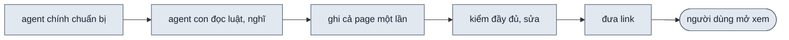
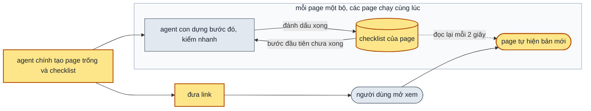

> **Nối tiếp:** [004](004-design-uiux-dung-theo-buoc.md) đã huỷ — plan này làm lại phần xem page trong lúc dựng (`PQ-01`), dùng thiết kế §6 và bản diff Phase 1 của 004 làm đầu vào.
> **Lật:** D20 của [001](001-design-uiux.md), phần "chỉ giao link khi exit 0" · D1 · D2 của 004: tự tải lại thay nút tải lại, danh sách bước dựng ở file riêng. **Giữ:** D0 · D3–D9 của 004.
> **Phụ thuộc:** Phase 0–3 không chờ [008](008-design-uiux-mot-man-luong.md) — hai plan chạy song song. Cùng sửa `shell.js`, `new-design.mjs`, `check.mjs`, `SKILL.md` nhưng khác vùng (DS7); plan nào ghép sau thì gộp phần trùng file. Phase 4 cũng không chờ 008 `done`: bài 02 (đề một luồng) chỉ cần code luồng của 008 có mặt, và code đó đã xong Phase 3 của 008. Nếu nghiệm thu 008 sửa tiếp phần luồng, thì chạy lại các dòng Gate Phase 4 dùng bài 02. 009 sửa thẳng cây làm việc chính, cùng lúc với 007, 008, 010: mỗi lần sửa một file chung thì đọc lại file đó ngay trước khi sửa, chỉ sửa vùng của 009 theo DS7.

## 1. Problem

Lần chạy ngày 2026-10-07 (màn đăng nhập, hai phương án) mất 13 phút. Mỗi agent con dựng một page mất ~9,5 phút; 3–5
phút đầu nó chỉ đọc và nghĩ, chưa ghi dòng nào, rồi ghi cả page một lần. Link chỉ có khi mọi page đã xong và kiểm
sạch. Suốt 13 phút đó người dùng không có gì để xem, không biết đang tới đâu, thấy sai hướng cũng không ngắt sớm
được. Agent bị ngắt giữa chừng thì gọi lại phải dựng lại cả page.

Hai agent con của lần chạy đó đã dựng song song: 556s và 588s, chồng thời gian lên nhau. Đây là thứ phải giữ, vì
không có nó thì hai page mất gần 19 phút. Thứ chậm không phải việc chia agent, mà là người dùng phải đợi tới cuối mới
thấy page.

## 2. Goal

**Checklist từng page** — trọng tâm của plan. Tiến độ trên page và việc làm tiếp sau khi bị ngắt đều đọc từ checklist
này, không đọc từ đâu khác.

- Mỗi page có một danh sách bước dựng (checklist) riêng, ở một file cạnh page. Page là một màn
  của luồng, hoặc phương án A hay B của đề một màn. Agent con dựng page theo đúng danh sách đó và đánh dấu từng bước
  khi bước đó xong.
- Khi người dùng góp ý, mỗi ý thành một bước mới trong cùng danh sách, ghi số vòng. Bước của vòng cũ giữ nguyên.
- Khi agent con bị ngắt rồi được gọi lại, nó đọc danh sách và làm tiếp từ bước dựng đầu tiên chưa xong. Page dựng từ
  trước, không có danh sách, vẫn mở và kiểm như cũ.

**Tiến độ trên page**

- Link từng page có trong chat trước khi page có khối đầu tiên. Mở ra thấy khối "Đang dựng" kèm danh sách bước dựng.
- Khi một bước trong danh sách được đánh dấu xong, page đang mở tự hiện bản mới, không cần bấm gì. Giá trị đang vặn,
  khổ màn, sáng tối và vị trí cuộn giữ nguyên.
- Nếu người xem đang gõ trong ô nhập, thì page đợi tới khi rời ô mới tải lại. Điều này đúng ở cả ba khổ desktop,
  tablet, mobile.
- Toolbar luôn cho biết page đang dựng, đang sửa theo góp ý (kèm số bước đã xong) hay đã xong kèm ngày sửa cuối.

**Các page dựng song song**

- Mọi page của một lần chạy dựng cùng lúc, mỗi page một agent con: A và B của đề một màn, hoặc mọi màn của một luồng.
  Việc chia agent con có sẵn từ 008 (`F1.5`). Plan này giữ điều đó: mỗi page có checklist và tiến độ riêng, không page
  nào chờ page khác.

**Ngoài scope:** server cục bộ · nút tải lại tay · kết quả kiểm hiện trên toolbar · số phương án, một màn hay một
luồng (plan 008).

## 3. Mental model

**Bây giờ chạy thế nào** — Agent chính đọc dự án, chuẩn bị bản tóm tắt chung, gọi mỗi page một agent con. Agent con
đọc luật vài phút, ghi cả page một lần, rồi kiểm đầy đủ (~30 giây, hơn trăm tổ hợp) và sửa tới khi sạch. Agent chính
đợi mọi agent con xong, kiểm cả thư mục, rồi mới đưa link. Người dùng góp ý thì agent sửa cả page rồi báo; người dùng
chỉ biết page đã đổi khi được báo.



**Sau plan chạy thế nào** — Mọi thứ xoay quanh checklist của từng page. Checklist là danh sách sáu bước dựng, nằm ở
một file cạnh page: khung các khối, các trạng thái tải · rỗng · lỗi, trạng thái riêng, tương tác, bộ dữ liệu mẫu,
kiểm đầy đủ. Agent chính tạo page trống cùng checklist của nó, rồi đưa link ngay, trước khi ai bắt đầu dựng.

Checklist được dùng ở ba chỗ:

- Agent con đọc checklist để lấy bước đầu tiên chưa xong. Nó dựng bước đó, kiểm nhanh khoảng một giây, rồi đánh dấu
  xong. Agent bị ngắt rồi được gọi lại cũng đọc đúng chỗ đó, nên làm tiếp chứ không dựng lại cả page.
- Page đang mở trên trình duyệt cứ hai giây đọc lại checklist. Khi thấy bước mới được đánh dấu, page tự tải lại và
  giữ nguyên mọi thứ đang xem. Toolbar đếm số bước đã xong.
- Khi người dùng góp ý, mỗi ý thành một bước mới cuối checklist. Lúc sửa, page cũng tự cập nhật như lúc dựng.

Mỗi page có checklist riêng và agent con riêng, nên các page dựng cùng lúc, không page nào chờ page khác. Kiểm đầy đủ
là bước cuối của checklist, chỉ chạy một lần.



**Hành vi đổi ra sao**

| #     | Tình huống | Bây giờ | Sau plan |
| ----- | ---------- | ------- | -------- |
| `BH1` | người dùng mở link lúc page vừa bắt đầu dựng | chưa có link, link chỉ đưa khi mọi page xong | page hiện khối "Đang dựng <tên>", toolbar "Đang dựng 0/6", bấm vào thấy sáu bước dựng |
| `BH2` | để page mở, agent xong bước dựng 1 | — | trong vài giây page tự tải lại, hiện các khối; toolbar "Đang dựng 1/6"; giá trị đang vặn và vị trí cuộn giữ nguyên |
| `BH3` | người xem đang gõ vào ô tìm kiếm khi bước dựng mới xong | — | page chưa tải lại; con trỏ rời ô thì tải |
| `BH4` | chọn một trạng thái chưa dựng tới (vd lỗi khi mới xong bước khung) | — | page hiện như trạng thái mặc định; danh sách cho thấy bước "Đang tải · rỗng · lỗi" chưa xong |
| `BH5` | page dựng xong | giao khi kiểm sạch; toolbar không nói gì | toolbar "✓ Xong · 08/10" |
| `BH6` | người dùng góp ý hai ý cho page đã xong | agent sửa cả page rồi báo | toolbar "Đang sửa 0/3", page tự hiện bản mới sau mỗi ý; xong về "✓ Xong · <ngày>"; danh sách có nhóm "Góp ý vòng 2" |
| `BH7` | agent dựng bị ngắt sau bước dựng 2, gọi lại | dựng lại cả page | làm tiếp từ bước dựng 3 |
| `BH8` | mở hay kiểm một page dựng trước plan này | — | mở, kiểm như cũ; toolbar "✓ Xong · <ngày sửa cuối>"; không tự tải lại |
| `BH9` | đề có nhiều page (A và B, hay ba màn của luồng) | các page dựng song song nhưng link chỉ có khi page chậm nhất xong | link mọi page có cùng lúc khi bắt đầu; mỗi page một nhãn tiến độ riêng, đi theo checklist của nó; page xong trước hiện "✓ Xong" trong lúc page khác còn "Đang dựng" |
| `BH10` | một agent con bị ngắt trong lúc page khác đang dựng | — | agent chính chỉ gọi lại agent đó; page khác vẫn có bước mới xong trong lúc chờ |
| `BH11` | người xem đang gõ trong ô nhập ở khổ tablet hay mobile (page nằm trong iframe) khi bước mới xong | — | page chưa tải lại; rời ô thì tải, như khổ desktop |

**Không đụng:** bước hỏi làm rõ, số phương án, một màn hay một luồng · bộ nguyên tắc, giới hạn thiết kế và cách kiểm
đầy đủ chúng · data-panel, config-panel, khổ màn, sáng tối.

---

## 4. Probe

### P1 — Kiểm nhanh một tổ hợp (mở Chrome, mở page ở 1280px giá trị mặc định, chụp một ảnh) tốn bao nhiêu giây?

**Biết để làm gì:** dưới ~5 giây thì kiểm được sau từng bước dựng; vài chục giây thì chỉ nên kiểm ở cuối
**Cách chạy lại:** `node .test/design-uiux/021-probe-quick-check/probe-quick.mjs <page.html>`, ba lần liền
**Kết quả:** 1,89s lần đầu (Chrome nguội), 1,08s và 1,11s các lần sau — 2026-10-07, chạy trong plan 004, Playwright
ở `$TMPDIR/design-uiux-pw`, Chrome hệ thống, page `020-login-pilot-app/01-vao-thang.html`. Chạy lại trên page của 008
(`046-…/01-hang-doi-theo-han.html`): 2,15s · 1,98s · 1,63s — 2026-10-08, `.test/design-uiux/053-probe-009/ket-qua.log`

### P2 — Page mở bằng `file://` trong Chrome có đọc lại được một file `.js` vừa đổi nội dung mà không tải lại page không?

**Biết để làm gì:** được thì page tự biết có bản mới mà không cần server; không được thì chỉ còn nút tải lại tay hay
server cục bộ
**Cách chạy lại:** `node .test/design-uiux/032-probe-poll-file/probe.mjs` — page chèn `<script src="prog.js?t=<giờ>">`
mỗi 300ms; script đổi nội dung file, rồi xoá file
**Kết quả:** thấy nội dung mới sau 109ms (một lượt đọc); file bị xoá thì thẻ script báo lỗi nạp, không treo — 2026-10-08,
Chrome hệ thống qua Playwright `channel: "chrome"`. Chạy lại cùng ngày: 81ms, file bị xoá vẫn báo lỗi nạp.

### P3 — Nhiều agent con cùng chạy kiểm nhanh một lúc thì mỗi lượt còn dưới 5 giây không?

**Biết để làm gì:** các page dựng song song nên các lượt `--quick` chồng nhau; chậm quá 5 giây thì không kiểm nhanh sau từng bước được
**Cách chạy lại:** `node .test/design-uiux/053-probe-009/p3-song-song.mjs <page.html> 1 2 3 4` — N tiến trình chạy
`probe-quick.mjs` của P1 cùng lúc
**Kết quả:** N=1 1,42s · N=2 1,58s · N=3 tối đa 2,03s · N=4 tối đa 2,98s mỗi lượt — 2026-10-08, page của 008 như P1

### P4 — Page đọc checklist đúng lúc agent đang ghi thì đọc phải gì?

**Biết để làm gì:** đọc phải file ghi dở mà coi là page không có checklist thì page ngừng theo dõi giữa chừng
**Cách chạy lại:** `node .test/design-uiux/053-probe-009/p4-ghi-do.mjs ["ghi thẳng" | "tạm + rename"]` — Node ghi đè
file ~9KB khoảng 700 lần mỗi giây trong 8 giây; page đọc lại mỗi 5ms
**Kết quả:** ghi thẳng: 151 trên ~1660 lượt đọc nạp được nhưng thiếu dữ liệu (59 lượt là lỗi cú pháp). Ghi ra file tạm
rồi rename: 2, 3, 5 lượt qua ba lần chạy. Cả hai cách, thẻ script không lần nào báo `error`: file ghi dở trông như
nạp thành công mà không có dữ liệu, không bao giờ trông như file không có — 2026-10-08

### P5 — Trên `file://`, tải lại có giữ được vị trí cuộn, và trang cha có biết người xem đang gõ trong iframe không?

**Biết để làm gì:** khổ tablet, mobile đặt page trong iframe `frame=1`; việc theo dõi tiến độ chỉ chạy ở trang cha
**Cách chạy lại:** `node .test/design-uiux/053-probe-009/p5-cuon-iframe.mjs`
**Kết quả:** `location.reload()` cho navigation type `reload`, `scrollY` 1234 lấy lại được từ `sessionStorage`. Khi
người xem gõ trong iframe, trang cha thấy `document.activeElement` là `IFRAME`, `contentDocument` là `null`. Tin
`postMessage` từ iframe lên trang cha thì tới được — 2026-10-08

## 5. Decisions

**Ai quyết:** 🤖 = agent tự quyết, chưa hỏi ai — **chỗ người duyệt phải soi** · 👤 = user chốt lúc bàn (luật 22).

### D0 👤 — Page tự tải lại khi có bước dựng mới xong; người xem đang gõ trong ô nhập thì đợi rời ô

**Lý do:** người dùng muốn thấy tiến độ liên tục mà không phải bấm; tải lại giữa lúc gõ làm mất chữ — dựa vào `P2` · `P5` → DS2
**Phương án đã loại:** nút tải lại tay (D1 của 004) — người dùng phải nhớ bấm · server cục bộ — thêm tiến trình phải bật, tắt, chiếm cổng

### D1 🤖 — Danh sách bước dựng nằm ở file riêng `NN-slug.progress.js`, chỉ người dựng page đó ghi, qua lệnh `new-design.mjs progress`

**Lý do:** shell phải đọc lại danh sách mà không tải page; page chỉ đọc lại được file `.js` riêng — dựa vào `P2` → DS1
**Phương án đã loại:** danh sách trong page (D2 của 004) — đọc được chỉ sau khi tải lại · trong `pages.js` — agent con tranh nhau ghi

### D2 🤖 — Page chỉ tự tải lại khi một bước dựng được đánh dấu xong, không phải mỗi lần agent ghi file

**Lý do:** bước dựng được đánh dấu sau khi kiểm nhanh sạch, nên người xem chỉ thấy bản đã chạy được → DS1 · DS2
**Phương án đã loại:** tải lại mỗi lần ghi — thấy bản đang sửa dở, có lúc page trắng vì lỗi JS

### D3 👤 — Có `check.mjs --quick`: một tổ hợp ở 1280px, chạy trước khi đánh dấu mỗi bước dựng; kiểm đầy đủ chỉ ở bước cuối

**Lý do:** bản lỗi JS thì page trắng đúng lúc người dùng đang xem; một tổ hợp ~1–2s, bốn page cùng kiểm vẫn ≤ 3s — dựa vào `P1` · `P3` → DS3

### D4 🤖 — Sáu bước dựng cố định cho mọi page; agent được chèn bước trước bước kiểm đầy đủ, không được bớt

**Lý do:** bước 1 ra ngay bản xem được; mỗi bước sau thêm một thứ người xem vặn thấy (D3 của 004) → DS1
**Phương án đã loại:** agent tự đặt bước — mỗi page một kiểu, kiểm đầy đủ không biết lấy gì để so

### D5 🤖 — Page không có file tiến độ được coi là đã xong và không tự tải lại

**Lý do:** page dựng trước plan này mở và kiểm như cũ, không phải sửa → DS1 · DS2

### D6 🤖 — Đưa link ngay sau khi tạo page trống: một page thì trước bước dựng 1, nhiều page thì ngay khi gọi các agent con chạy nền

**Lý do:** link sớm là điều kiện để người dùng xem và ngắt được; tin giao cuối vẫn đợi kiểm cả thư mục sạch → DS5
**Phương án đã loại:** giữ D20 của 001 nguyên văn (link chỉ khi exit 0) — người dùng lại đợi tới cuối

### D7 🤖 — Vòng góp ý thêm bước vào cùng danh sách, mỗi bước ghi số vòng; bước của vòng cũ giữ nguyên

**Lý do:** page tự cập nhật trong lúc sửa như lúc dựng; xem lại được góp ý nào đã sửa (D9 của 004) → DS1
**Phương án đã loại:** mỗi vòng xoá danh sách cũ viết lại — mất dấu các góp ý đã làm

### D8 🤖 — Lệnh `progress` ghi checklist ra file tạm rồi rename; shell gặp lượt đọc thiếu dữ liệu thì bỏ qua, đọc lại lượt sau

**Lý do:** ghi thẳng thì page đọc phải file ghi dở; rename giảm gần hết nhưng vẫn còn vài lượt khi ghi dồn dập. File
ghi dở luôn trông như nạp được mà thiếu dữ liệu, không trông như file không có, nên shell phân biệt được: chỉ thẻ
script báo `error` mới là "không có file" (D5) — dựa vào `P4` → DS1 · DS2
**Phương án đã loại:** chỉ dựa vào rename — vẫn còn lượt đọc hỏng · coi lượt thiếu dữ liệu là không có file — page
ngừng theo dõi giữa lúc đang dựng

### D9 🤖 — Ở khổ tablet, mobile, page trong iframe báo lên trang cha khi người xem vào và rời ô nhập, bằng `postMessage`

**Lý do:** trang cha không đọc được vào iframe trên `file://`, nên không tự biết người xem đang gõ — dựa vào `P5` → DS2
**Phương án đã loại:** trang cha đọc `iframe.contentDocument` — luôn ra `null` trên `file://`

### D10 🤖 — Song song lấy nguyên từ 008; checklist và tiến độ của page nào thuộc riêng page đó, không có bước nào chờ chung

**Lý do:** mỗi page một agent con chạy cùng lúc là `F1.5` của 008, plan này không làm lại. Plan này chỉ phải không
thêm chỗ bắt các page chờ nhau: mỗi page một file checklist, chỉ agent của page đó ghi (D1); link mọi page đưa cùng
lúc khi bắt đầu (D6); agent con bị ngắt thì agent chính chỉ gọi lại agent đó → DS1 · DS5
**Phương án đã loại:** một checklist chung cho cả thư mục — các agent con tranh nhau ghi · gọi lại cả lượt khi một
agent bị ngắt — page đang dựng tốt bị dựng lại

## 6. Design

### DS1 — File tiến độ và lệnh `progress`

`<NN-slug>.progress.js`, cạnh page, `new-design.mjs page` tạo:

```js
(window.DESIGN_PROGRESS ||= {})["01-dang-nhap.html"] = {
  rev: 0,
  build: [
    { task: "Khung các khối, dữ liệu mặc định", done: false, round: 1 },
    { task: "Đang tải · rỗng · lỗi", done: false, round: 1 },
    { task: "Trạng thái riêng của đề", done: false, round: 1 },
    { task: "Tương tác: bấm, gõ, mở, đóng", done: false, round: 1 },
    { task: "Preset và ca biên", done: false, round: 1 },
    { task: "Kiểm đầy đủ và tự kiểm", done: false, round: 1, final: true },
  ],
};
```

| Bước dựng | Xong khi | Kiểm trước khi đánh dấu |
| --------- | -------- | ----------------------- |
| 1 | khai đủ `variables` theo "Nút dữ liệu chung", `tweaks`; mọi `data-block` có mặt, đúng `state` mặc định | `check.mjs <page> --quick` |
| 2 | `state` `loading` · `empty` · `error` đã dựng | `--quick --state loading`, rồi `empty`, rồi `error` |
| 3 | các `state` riêng trong brief đã dựng | `--quick --state <từng giá trị>` |
| 4 | mọi nút bấm được làm gì đó, hay khoá kèm `title` | `--quick` |
| 5 | `presets` khai xong, ca biên dựng xong | `--quick --preset "<từng nhãn>"` |
| 6 | kiểm đầy đủ exit 0, danh sách tự kiểm đã đi | `check.mjs <page>` |

```text
node new-design.mjs progress <thư mục design> <file> --done <n>                     # bước dựng n xong, rev + 1
node new-design.mjs progress <thư mục design> <file> --insert "<việc>"              # chèn trước bước final của vòng đang mở
node new-design.mjs progress <thư mục design> <file> --round "<ý 1>" ["<ý 2>" …]    # vòng góp ý mới: mỗi ý "Góp ý: <ý>", thêm bước final "Kiểm đầy đủ"
node new-design.mjs progress <thư mục design> <file>                                 # in danh sách, bước dựng đầu tiên chưa xong
```

- `--done` chỉ nhận bước dựng đầu tiên chưa xong của vòng đang mở; sai thì exit 1 kèm tên bước đó.
- `--round` khi vòng trước còn bước dựng chưa xong thì exit 1.
- `round` của vòng mới = `round` lớn nhất + 1. Bước dựng của vòng cũ giữ nguyên.
- Agent bị gọi lại chạy lệnh không cờ, làm từ bước dựng nó in ra. Bước đó có thể đã làm dở trên page, nên agent đọc
  page hiện có trước, làm tiếp trên đó, không chép lại khuôn.
- Mọi lần ghi của `progress` ghi ra `<file>.tmp` rồi rename đè lên file thật (D8).
- Mỗi page một file; chỉ agent dựng page đó chạy `progress` trên file đó (D1 · D10).
- Page không có file tiến độ: coi như mọi bước dựng xong (D5).

### DS2 — Shell: theo dõi tiến độ và nhãn trạng thái

`shell.js`, chỉ ở page cha (không chạy khi `frame=1`; tải lại page cha là tải lại iframe). Ngoại lệ duy nhất: page
`frame=1` báo việc vào, rời ô nhập lên page cha (D9).

| Việc | Cách |
| --- | --- |
| đọc tiến độ | mỗi 2s, khi `document.visibilityState === "visible"`: xoá mục của page trong `window.DESIGN_PROGRESS`, chèn `<script src="<NN-slug>.progress.js?t=<Date.now()>">`, xoá thẻ sau `load` / `error` |
| không có file | lần đọc đầu `error` → coi là xong (D5), dừng đọc |
| đọc phải file ghi dở | `load` mà mục của page không có, hay thiếu `rev` · `build` → bỏ lượt này, giữ trạng thái cũ, đọc lại sau 2s (D8) |
| có bước dựng mới xong | `rev` khác lần đọc trước → tải lại (D2) |
| người xem đang gõ, khổ desktop | `document.activeElement` là ô gõ chữ: `textarea`, `[contenteditable]`, `input` kiểu text · search · email · password · tel · url · number → đợi `focusout` rồi tải lại (D0). `select`, thanh kéo, ô tick không tính: chúng giữ con trỏ sau khi chọn, tính vào thì page đợi mãi |
| người xem đang gõ, khổ tablet · mobile | page `frame=1` gửi `postMessage({ type: "design:typing", typing })` mỗi lần `focusin` · `focusout`, `typing` là con trỏ có đang ở ô gõ chữ; page cha giữ cờ này, cờ bật thì đợi tin `typing: false` rồi tải lại (D0 · D9) |
| lỗi cú pháp khi đọc trúng file ghi dở | shell chặn lỗi của `*.progress.js` khỏi console (`preventDefault` trên sự kiện `error`) (D8) |
| giữ vị trí cuộn trong khung tablet · mobile | page `frame=1` ghi `scrollY` kèm giờ vào `sessionStorage['ds-scroll-frame:<file>']` lúc `pagehide`; lần mở trong 10 giây sau thì cuộn lại |
| giữ vị trí cuộn | `pagehide` ghi `scrollY` vào `sessionStorage['ds-scroll:<file>']`; lần mở có `performance.getEntriesByType("navigation")[0].type === "reload"` thì cuộn lại, xoá khoá |
| giữ giá trị vặn | đã nằm trên URL, tải lại đọc lại như hiện có |

Nhãn `[data-ds-status]` ở cột 1 của `.ds-toolbar`, `data-state`:

| Điều kiện | `data-state` | Chữ (vi / en) |
| --------- | ------------ | ------------- |
| còn bước dựng `round: 1` chưa xong | `building` | "Đang dựng a/b" / "Building a/b" |
| vòng 1 xong, vòng n ≥ 2 còn bước chưa xong | `revising` | "Đang sửa a/b" / "Revising a/b" — đếm bước vòng n |
| mọi bước xong, hay không có file | `done` | "✓ Xong · dd/mm" / "✓ Done · dd/mm" — ngày là `updated` của page trong `pages.js`; không có thì "✓ Xong" |

Bấm nhãn mở `[data-ds-status-list]`: nhóm "Dựng", "Góp ý vòng 2", …; mỗi bước dựng một dòng: ✓ xong · ● bước đầu tiên
chưa xong · ○ còn lại. Không có file thì một dòng "Page dựng trước khi có danh sách bước". Esc hay bấm ngoài thì đóng.

### DS3 — CLI Surface của `check.mjs`

```text
node check.mjs <page.html> --quick [--state <giá trị>] [--preset "<nhãn>"] [--pw <dir>]
node check.mjs <thư mục design | page.html> [--pw <dir>] [--no-shots]      # kiểm đầy đủ, như hiện có
```

| Phần kiểm | `--quick` | đầy đủ |
| --------- | --------- | ------ |
| lượt tĩnh: thứ tự nạp, mã màu, brief, `pages.js`, bộ key `variables`, kiểm tĩnh của nguyên tắc | có | có |
| mở page: lỗi console, lỗi JS, request hỏng | có, 1280px | có |
| bố cục và dò nguyên tắc | một tổ hợp: 1280px, sáng, tweak mặc định, `state` theo `--state` hay preset theo `--preset` | mọi tổ hợp, hai khổ |
| nút vặn mà UI không đổi, lượt bấm, URL mở lại, khung tablet / mobile, 1920px, cả thư mục | không | có |
| file tiến độ còn bước dựng chưa xong, ngoài bước `final` của vòng đang mở | không | lỗi `còn bước chưa xong: <tên bước>` |
| ảnh | `shots/<page>--quick.png` | như hiện có |

- `--quick` nhận đúng một page; đưa thư mục thì exit 2 kèm câu hướng dẫn.
- Exit như hiện có: `0` sạch · `1` có lỗi · `2` không chạy được.
- `--quick` in dòng cuối `✓ quick · <page> · <n> lỗi · <giây>s`.

### DS4 — Khuôn page

| File | Vai |
| ---- | --- |
| `templates/page.html` | khuôn `new-design.mjs page` chép ra: `<head>` đúng thứ tự nạp; `window.DESIGN` có `lang`, `variables: []`, `tweaks: []`; `<main id="design">` chỉ có khối chờ "Đang dựng <tên>" |
| `templates/example.html` | màn "Thành viên" (đổi tên từ `templates/details.html`), chỉ để đọc cách khai nút, viết khối, dựng `state`; không lệnh nào chép nó ra |

`new-design.mjs page` thay `<title>` và chữ trong khối chờ bằng `--title` và cờ tên page (`--option`, hay `--screen`
khi plan 008 đã có; không có thì dùng `--title`), rồi tạo `<NN-slug>.progress.js` theo DS1.

### DS5 — SPEC.md và SKILL.md

Sub-scope trong SPEC:

| Mã | Thay đổi | Chữ |
| --- | --- | --- |
| `F4.4` | new | Khi người dùng góp ý một page, mỗi ý thành một bước dựng mới trong danh sách bước dựng của page đó. |
| `F5.6` | new | Agent chạy kiểm nhanh một tổ hợp trước khi đánh dấu một bước dựng xong. |
| `F5.7` | new | Nếu page còn bước dựng chưa xong ngoài bước kiểm đầy đủ, thì máy kiểm báo lỗi. |
| `F6` | new | scope **Tiến độ dựng**: các sub-scope `F6.1`–`F6.6` dưới đây |
| `F6.1` | new | Khi agent bắt đầu dựng một page, agent đưa link page đó trong chat trước khi page có khối đầu tiên. |
| `F6.2` | new | Agent dựng page theo danh sách bước dựng và đánh dấu từng bước khi bước đó xong. |
| `F6.3` | new | Khi một bước dựng được đánh dấu xong, page đang mở tự tải lại và giữ nguyên giá trị đang xem và vị trí cuộn. |
| `F6.4` | new | Nếu người xem đang gõ trong ô nhập ở bất kỳ khổ màn nào, thì page đợi tới khi con trỏ rời ô mới tải lại. |
| `F6.5` | new | Toolbar hiện page đang dựng, đang sửa theo góp ý hay đã xong. |
| `F6.6` | new | Nếu agent dựng page bị ngắt, thì agent được gọi lại làm tiếp từ bước dựng đầu tiên chưa xong. |
| `F6.7` | new | Nếu một agent con bị ngắt trong lúc các agent con khác đang dựng, thì agent chính chỉ gọi lại agent bị ngắt. |

SPEC mục 3: 3.1 thêm `progress.js`; 3.4 thêm nhãn trạng thái và đọc tiến độ; 3.5 luồng agent theo D6 · D10; 3.6 thêm
`--quick`. Mục 4 thêm lý do của D0 · D1 · D2 · D3 · D6 · D8 · D9 · D10.

SKILL.md:

| Mục | Đổi gì |
| --- | --- |
| frontmatter `description` | thêm "page tự hiện tiến độ trong lúc dựng; link có ngay khi bắt đầu dựng" |
| Mental model | sơ đồ: nút "giao link" đứng ngay sau "brief + page trống"; hộp dựng thành vòng "dựng một bước → kiểm nhanh → đánh dấu"; bảng file thêm `progress.js`, `templates/page.html`, `templates/example.html` |
| Các khối điều khiển | thêm nhãn trạng thái; câu tự tải lại khi có bước mới xong |
| Bước 4 | một page: agent chính in link trước bước dựng 1; nhiều page: gọi agent con chạy nền rồi in link ngay, kèm câu "page tự hiện bản mới, để mở là thấy" (D6); lời giao đọc `templates/example.html` thay khuôn, dựng theo `progress`, bị gọi lại thì chạy `progress` không cờ và đọc page hiện có trước; một agent con bị ngắt thì agent chính chỉ gọi lại agent đó, cùng lời giao, các agent khác để chạy tiếp (D10) |
| "Viết một page" → "Dựng một page theo bước" | bảng sáu bước dựng của DS1; luật viết HTML, khai nút giữ nguyên |
| Bước 5 | `--quick` trước mỗi `progress --done`; kiểm đầy đủ ở bước dựng 6; agent chính kiểm cả thư mục như hiện có |
| Vòng sau | `progress --round` trước khi sửa, đi từng bước dựng, `touch` khi xong vòng |
| Bẫy đã gặp | "ghi cả page một lần" → người dùng đợi tới cuối, lỗi dồn một chỗ; "đánh dấu bước dựng trước khi `--quick` sạch" → page trắng khi người dùng đang xem |
| `scripts/new-design.mjs`, `scripts/check.mjs` (đầu file) | dòng cách dùng có `progress`, `--quick`, `templates/page.html` |
| dòng `spec:` | gắn `F4.4` · `F5.6` · `F5.7` · `F6.*` vào đúng mục |

### DS6 — Test Strategy

| File / lệnh | Vai |
| ----------- | --- |
| `scripts/test-shell.mjs` | file tiến độ 2/6 → "Đang dựng 2/6", danh sách ✓ ● ○ đúng; đổi file sang 3/6 → page tự tải lại trong ≤ 4s, URL và `scrollY` giữ nguyên; focus một `input` rồi đổi file → không tải lại, `blur` → tải lại; như vậy ở khổ mobile với `input` trong iframe; file thành nửa nội dung → nhãn giữ nguyên, vẫn đọc tiếp, đổi về file đủ 3/6 → tải lại; vòng 2 dở → "Đang sửa a/b", có nhóm "Góp ý vòng 2"; xong hết → "✓ Xong · <ngày>"; không có file → "✓ Xong", không có request đọc lại sau lần đầu |
| `scripts/test-check.mjs` + `scripts/fixtures/check/` | page bước dựng 1 xong mà `state=error` chưa dựng → `--quick` exit 0, đầy đủ exit 1; file tiến độ còn bước 3 chưa xong → đầy đủ exit 1 `còn bước chưa xong`; chỉ còn bước `final` → không báo; `--quick` đưa thư mục → exit 2 |
| `scripts/test-progress.mjs` | `progress --done` sai thứ tự exit 1; `--round` khi vòng trước dở exit 1; `--insert` chèn trước `final`; `rev` tăng đúng 1 mỗi lần ghi; xong mỗi lệnh không còn `<file>.tmp` |
| `samples/watch-progress.mjs` | đọc mọi `*.progress.js` của một thư mục design mỗi 2s; mỗi lần `rev` của một page đổi thì ghi một dòng vào `progress.log`: giờ, file page, `rev`, tên bước vừa xong |
| `samples/` | dòng quan sát cho `F6.*` · `F4.4` · `F5.6` · `F5.7` đọc `progress.log` và `chat.md`; `lint.mjs` exit 0 |

**Baseline:** lần chạy 020 (màn đăng nhập, 2 page) — 13 phút tổng; agent con 556s và 588s; lần ghi page đầu tiên ở
giây 319 và 321 của agent con; người dùng có link ở phút 13 — 2026-10-07.

### DS7 — Chạy song song với plan 008

| File | 009 sửa | 008 sửa |
| --- | --- | --- |
| `shell/shell.js` · `shell.css` | đọc tiến độ, tự tải lại, nhãn trạng thái ở cột 1 toolbar | dãy màn ở chỗ option-switcher, `next()` · `prev()` · `form` |
| `scripts/new-design.mjs` | lệnh `progress`; `page` chép `templates/page.html`, tạo `progress.js` | `page --screen --purpose` |
| `scripts/check.mjs` | `--quick`; lỗi `còn bước chưa xong` | lượt đi luồng; lỗi `quá hai phương án` |
| `SKILL.md` | Bước 4 phần gọi agent con và lời giao, "Dựng một page theo bước", Bước 5, Vòng sau | Bước 2, Bước 3, Bước 4 phần luồng, Bước 6 |
| `SPEC.md` · `PLANS.md` | `F4.4` · `F5.6` · `F5.7` · `F6` | `F1.*` · `F2.4` · `F2.6` · `F2.7` · `F5.8` |

- Plan nào ghép sau thì gộp phần trùng file, chạy lại `test-shell.mjs`, `test-check.mjs`, `spec-check.mjs` trên bản
  đã gộp trước khi tick Gate của phase đó.
- Khi cả hai đã ghép: page của màn trong luồng có thêm điều kiện ở bước dựng 4 — "có nút sang màn trước, sau".

## 7. Phases

**Legend:** 🤖 = agent tự kiểm được (chạy lệnh, test, grep) · 👤 = cần người kiểm (số đo thật, UI, hạ tầng).

- [x] 👤 plan này được duyệt — 2026-10-08, Andy duyệt trong chat; giữ `F6.7` làm yêu cầu riêng

### Phase 0 — ghi doc nguồn

**Goal:** SPEC và PLANS của design-uiux khớp plan này.
**Cover:** —

**Actions:**

- [x] 🤖 `SPEC.md` mục 2: các sub-scope theo bảng DS5 (D0 · D3) — 2026-10-08: 10 sub-scope, scope `F6` mới
- [x] 🤖 `SPEC.md` mục 3, 4: technical design và lý do theo DS5 — 2026-10-08: thêm cả mục 5 I/O
- [x] 🤖 `PLANS.md`: mục `### 009`, bảng mã theo DS5 — 2026-10-08: 10 dòng, gồm `F6.7`

**Gate:**

- [x] 🤖 `node scripts/spec-check.mjs skills/design-uiux` không báo lỗi nào của 009 ngoài "chưa có trong SKILL.md" cho `F5.6` · `F5.7` · `F6.*` (Phase 3 gắn) — 2026-10-08: còn đúng 9 mã đó, cộng `F3.6`–`F3.9` của plan 010
- [x] 🤖 `python3 ~/.claude/skills/write-plan/verify.py .plan/009-design-uiux-tien-do-dung.md` — 0 ERROR

### Phase 1 — checklist từng page, page tự hiện tiến độ

**Goal:** tạo page bằng `new-design.mjs page` ra màn chờ kèm checklist riêng; `progress --done` thì page đang mở tự tải lại, nhãn đổi theo.
**Cover:** DS1 · DS2 · DS4

**Actions:**

- [x] 🤖 `git mv templates/details.html templates/example.html`; `templates/page.html` theo DS4, lấy từ `027-huy-004/page.html` — 2026-10-08: khối chờ mang `data-ds-waiting`, không mang `data-block`
- [x] 🤖 `scripts/new-design.mjs`: `page` chép `templates/page.html`, tạo `progress.js`; lệnh `progress` theo DS1, ghi qua file tạm (D1 · D4 · D5 · D7 · D8) — 2026-10-08: `test-progress.mjs` 14/14
- [x] 🤖 `shell/shell.js` + `shell/shell.css`: đọc tiến độ, bỏ lượt đọc thiếu dữ liệu, tự tải lại, giữ vị trí cuộn, đợi rời ô nhập ở mọi khổ, nhãn trạng thái theo DS2 (D0 · D2 · D8 · D9); lấy phần nhãn từ `027-huy-004/phase1.patch` — 2026-10-08: `test-shell.mjs` 70/70
- [x] 🤖 `references/shell-principles.md`: mục nhãn trạng thái và tự tải lại — 2026-10-08: mục "Nhãn tiến độ và tự tải lại"
- [x] 🤖 `scripts/test-shell.mjs` (phần tiến độ) · `scripts/test-progress.mjs` theo DS6 — 2026-10-08: page mẫu của `test-shell.mjs` lấy thân từ `templates/example.html` và đánh dấu xong cả sáu bước

**Gate:**

- [x] 🤖 `node skills/design-uiux/scripts/test-shell.mjs --pw $TMPDIR/design-uiux-pw` — mọi phép ✓, gồm các phép tiến độ của DS6 — DS2 · BH2 · BH3 · BH5 · BH8 · BH11 — 2026-10-08: 70/70 ✓, gồm 11 phép tiến độ
- [x] 🤖 `node skills/design-uiux/scripts/test-progress.mjs` — mọi ca ✓ — DS1 · BH6 · BH7 — 2026-10-08: 14/14 ✓
- [x] 🤖 page vừa tạo bằng `new-design.mjs page` mở ra có khối "Đang dựng <tên>", nhãn "Đang dựng 0/6"; `grep -c "Thành viên"` trên page đó ra 0 — DS4 · BH1 — 2026-10-08: `.test/design-uiux/055-tien-do-shell/smoke.log` dòng 1; `test-progress.mjs` ca 2
- [ ] 👤 mở page chờ trong Chrome, chạy `progress --done 1` rồi `--done 2` ở terminal: page tự tải lại mỗi lần, "Đang dựng 2/6", vị trí cuộn giữ nguyên; gõ dở vào ô nhập khi chạy `--done 3` thì page đợi tới khi rời ô — <ngày + ai xác nhận> · BH2 · BH3

### Phase 2 — kiểm nhanh sau từng bước dựng

**Goal:** `check.mjs --quick` chạy trong vài giây trên page đang dựng; kiểm đầy đủ chặn page còn bước dựng dở.
**Cover:** DS3

**Actions:**

- [x] 🤖 `scripts/check.mjs`: `--quick`, `--state`, `--preset` theo DS3 (D3) — 2026-10-08; thêm: bỏ qua request hỏng và console của `*.progress.js` (page cũ không có file)
- [x] 🤖 `scripts/check.mjs`: đọc `progress.js`, báo `còn bước chưa xong` trừ bước `final`; không có file thì bỏ qua (D5) — 2026-10-08: ca C11 · C12
- [x] 🤖 `scripts/test-check.mjs` + `scripts/fixtures/check/`: bốn ca của DS6 — 2026-10-08: C10–C13, fixture `buoc-1.html`; page của các ca cũ đánh dấu xong bước 1–5

**Gate:**

- [x] 🤖 `--quick` trên hai page đã dựng xong: exit 0, mỗi lần ≤ 5 giây — DS3 — 2026-10-08: 2,0s · 1,6s trên bản chép của `046-…-nghiem-thu-008` ở `.test/design-uiux/056-check-quick/design-046/`. `020-login-pilot-app` không dùng được: brief của nó thiếu `## Khối` (luật của 006/007, có trước 009) nên `--quick` ra 1 lỗi đó, 1,6–1,7s
- [x] 🤖 `node skills/design-uiux/scripts/test-check.mjs` — mọi ca ✓, gồm bốn ca mới — DS3 · BH4 — 2026-10-08: 13/13 ✓
- [x] 🤖 kiểm đầy đủ một thư mục dựng trước plan (không có `progress.js`) với shell mới vẫn exit 0 — BH8 — 2026-10-08: `056-check-quick/design-046/001-don-hang` 2 page · 330 tổ hợp · 0 lỗi

### Phase 3 — skill dựng theo bước, đưa link sớm

**Goal:** gọi `/design-uiux`, người dùng có link ngay khi bắt đầu dựng, page lớn dần trên trình duyệt mà không bấm gì.
**Cover:** DS5 · DS6 · DS7

**Actions:**

- [x] 🤖 `SKILL.md` theo DS5, kèm dòng `spec:` (D6) — 2026-10-08: mục "Dựng một page theo bước", in link trong "Gọi agent con", gọi lại riêng agent bị ngắt, Vòng sau theo `--round`, 6 dòng bẫy; viết lại lỗi gài `samples/faults/L2.patch` · `L4.patch` cho SKILL.md mới (L3 · L5 · L7 đã hỏng từ 008, để 007)
- [x] 🤖 `samples/watch-progress.mjs`; dòng quan sát trong ba bài mẫu và `samples/README.md` theo DS6 — 2026-10-08: bài 01 thêm 5 dòng, bài 02 thêm 2; `F5.7` · `F6.3`–`F6.6` vào "Phủ ở chỗ khác"
- [x] 🤖 nếu plan 008 đã ghép: gộp phần trùng file theo DS7, thêm điều kiện bước dựng 4 cho page của màn — 2026-10-08: hai plan cùng sửa một cây làm việc, không có bước gộp; bước 4 có điều kiện `next()` · `prev()` · `form`

**Gate:**

- [x] 🤖 `node scripts/spec-check.mjs skills/design-uiux` exit 0 — DS5 — 2026-10-08: 52 sub-scope
- [x] 🤖 `node skills/design-uiux/samples/lint.mjs` exit 0, mọi sub-scope của DS5 có bài hay phép kiểm nhìn tới — DS6 — 2026-10-08: 52 sub-scope · 4 bài · 68 dòng
- [x] 🤖 trên bản đã gộp với 008 (nếu 008 đã ghép): `test-shell.mjs`, `test-check.mjs`, `spec-check.mjs` đều exit 0 — DS7 — 2026-10-08: 70/70 · 13/13 · 0 lỗi

### Phase 4 — nghiệm thu

**Goal:** mỗi bullet §2 có một lượt chạy thật, kết quả ghi cạnh ô tick.
**Cover:** —

**Actions:**

- [ ] 🤖 chạy bài 01 và bài 02 `--auto` theo `samples/README.md`, kèm `watch-progress.mjs`, vào `.test/design-uiux/<NNN>-nghiem-thu-009-*/`
- [ ] 🤖 chạy hai góp ý của bài 01 kèm `watch-progress.mjs`
- [ ] 🤖 chạy thử ngắt trên bài 01: dừng agent con của page A sau khi bước dựng 2 của nó được đánh dấu, để agent của page B chạy tiếp, rồi gọi lại agent A cùng lời giao; ghi lượt sửa đầu tiên của agent A
- [ ] 👤 gọi `/design-uiux` với một đề thật, mở link ngay khi có, để page mở suốt lúc dựng; góp ý một ý

**Gate** — một dòng ứng một bullet §2:

- [ ] 🤖 §2 bullet 1: cả hai bài — mỗi page có `progress.js` riêng; `progress.log` ghi đủ sáu bước dựng của từng page, đánh dấu theo đúng thứ tự — <bằng chứng> · BH1
- [ ] 🤖 §2 bullet 2: hai góp ý của bài 01 — danh sách của page có nhóm "Góp ý vòng 2" với hai bước; sáu bước vòng 1 giữ nguyên — <bằng chứng> · BH6
- [ ] 🤖 §2 bullet 3: lần chạy ngắt có lượt sửa đầu tiên của agent A thuộc bước dựng 3; trong lúc agent A bị ngắt, `progress.log` vẫn có mốc mới của page B; thư mục `020-login-pilot-app` dựng trước plan vẫn kiểm exit 0 và mở ra ghi "✓ Xong" — <bằng chứng> · BH7 · BH8 · BH10
- [ ] 🤖 §2 bullet 4: cả hai bài — giờ link xuất hiện trong `chat.md` trước mốc `rev 1` đầu tiên của page đó trong `progress.log` — <giờ> · BH1
- [ ] 👤 §2 bullet 5: lượt chạy thật — page tự hiện bản mới sau mỗi bước dựng, không bấm gì; vặn một nút rồi cuộn xuống, lần tải lại sau vẫn giữ; `progress.log` có ≥ 5 mốc giờ khác nhau cho 6 bước dựng — <ngày + ai xác nhận> · BH2 · BH4
- [ ] 👤 §2 bullet 6: lượt chạy thật — gõ vào một ô nhập lúc agent đang dựng, ở khổ desktop rồi ở khổ mobile; cả hai lần page không tải lại cho tới khi rời ô — <ngày + ai xác nhận> · BH3 · BH11
- [ ] 👤 §2 bullet 7: nhãn đi đúng "Đang dựng a/6" → "✓ Xong · <ngày>" → "Đang sửa a/b" → "✓ Xong · <ngày mới>"; bấm vào thấy nhóm "Dựng" và "Góp ý vòng 2" — <ngày + ai xác nhận> · BH5 · BH6
- [ ] 🤖 §2 bullet 8: bài 01 (hai page A, B) và bài 02 (mỗi màn một page) — trong `progress.log`, mốc `rev 1` của mọi page đều đến trước mốc bước dựng cuối của page xong sớm nhất, tức các page dựng chồng thời gian; link mọi page có trong `chat.md` trong cùng một tin — <giờ từng page> · BH9
- [ ] 🤖 `python3 ~/.claude/skills/write-plan/verify.py .plan/009-design-uiux-tien-do-dung.md` — 0 ERROR
