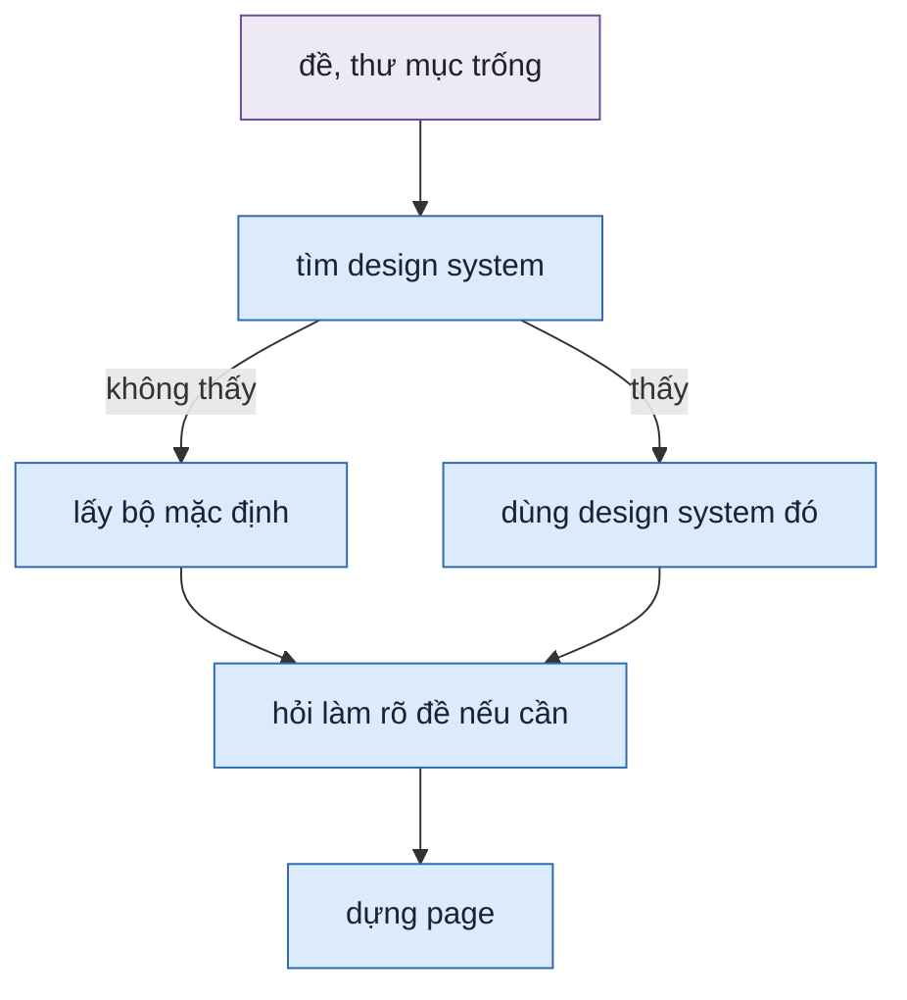
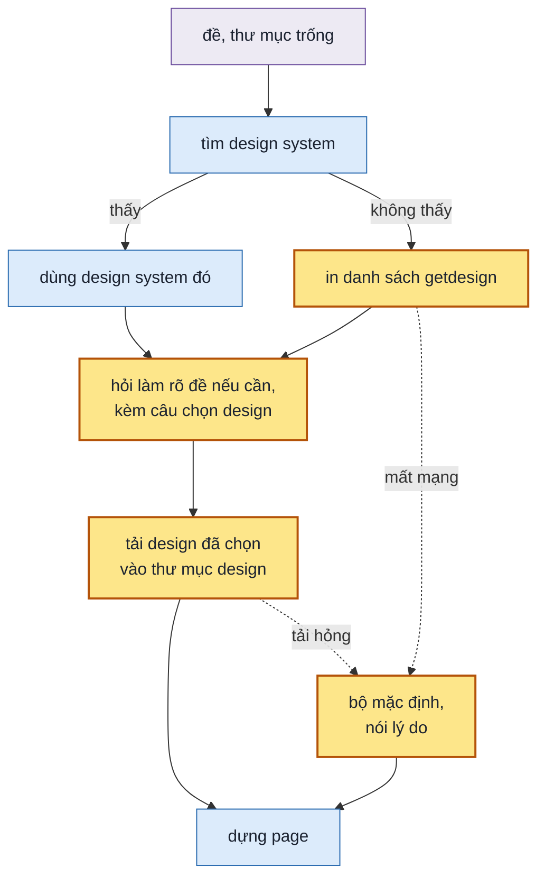

## 1. Problem

Khi đề không nói dùng design system nào và thư mục làm việc không có code của dự án, skill dựng page bằng bộ màu mặc
định của nó: nền trung tính, một màu nhấn xanh, chữ Inter. Mọi prototype dựng kiểu đó trông giống hệt nhau, dù đề là
app tài chính hay app nghe nhạc. Người dùng không được hỏi, cũng không biết có lựa chọn khác. getdesign.md có sẵn 76
bộ design tải về được bằng một lệnh, nhưng skill chỉ dùng tới khi đề tự ghi lệnh đó. Khi đề ghi lệnh, skill tải file
ra thẳng thư mục làm việc, ngoài thư mục `.design/` mà skill hứa chỉ ghi vào đó.

## 2. Goal

- Khi đề không nói dùng design system nào và thư mục làm việc không có design system, chat có danh sách các design
  của getdesign mà skill dùng được, mỗi dòng một tên và một câu mô tả. Ngay sau đó là một câu hỏi bốn đáp án: bốn
  design hợp đề nhất, đáp án khuyên dùng đứng đầu. Người dùng gõ được tên khác trong danh sách.
- Page dựng bằng màu và chữ của design được chọn. File design nằm trong thư mục design của lần chạy đó. Bản tóm tắt
  của thư mục design ghi tên design và ai chọn.
- Skill không ghi file nào ra ngoài `.design/`, kể cả khi đề tự ghi lệnh `npx getdesign@latest add <tên>`.
- Chạy với `--auto` thì skill vẫn in danh sách và câu hỏi, tự lấy đáp án khuyên dùng, và lúc giao kể lại đã chọn gì.
- Nếu không lấy được danh sách hay tải design hỏng, thì page dựng bằng bộ mặc định và chat nói lý do.

**Ngoài scope:** đọc design chỉ có phần chữ mà không có bảng màu đầu file (8 trên 76 bộ) · các design trả phí trên
site getdesign.md · xem trước design bằng ảnh trước khi chọn.

## 3. Mental model

**Bây giờ chạy thế nào** — Người dùng gọi skill với một đề, trong thư mục trống. Skill tìm design system theo thứ tự:
đề có ghi lệnh tải không, dự án có file màu không, có file design ở gốc không. Không thấy gì thì skill lấy luôn bộ
mặc định, không nói với ai. Skill hỏi làm rõ đề nếu cần, rồi dựng page. Người dùng mở link và thấy nền xám, nút xanh,
như mọi lần chạy khác không có design system.



**Sau plan chạy thế nào** — Cùng đường đó, chỉ khác ở nhánh "không thấy". Skill lấy danh sách design của getdesign,
bỏ những bộ không có bảng màu, in phần còn lại vào chat. Câu chọn design đi cùng lượt hỏi làm rõ đầu tiên, nên người
dùng không phải chờ thêm một lượt. Người dùng chọn xong thì skill tải đúng bộ đó vào thư mục design và dựng page theo
nó. Mất mạng thì skill quay về bộ mặc định như bây giờ, và nói ra trong chat.



**Hành vi đổi ra sao**

| #     | Tình huống | Bây giờ | Sau plan |
| ----- | ---------- | ------- | -------- |
| `BH1` | thư mục trống, đề không nói design system, chạy thường | page nền xám nút xanh, không ai hỏi | chat in danh sách design, hỏi một câu bốn đáp án; chọn "claude" thì page nền kem, nút cam đất |
| `BH2` | như trên, chạy `--auto` | page nền xám nút xanh | chat vẫn in danh sách và câu hỏi; skill tự lấy đáp án khuyên dùng; tin giao kể lại design đã chọn |
| `BH3` | người dùng gõ tên design không có trong bốn đáp án | — | tên có trong danh sách thì dùng bộ đó; không có thì skill hỏi lại câu đó |
| `BH4` | không vào được mạng, hay getdesign báo lỗi | — | page dựng bằng bộ mặc định; chat có một dòng nói không lấy được danh sách hay không tải được, kèm lỗi |
| `BH5` | đề ghi sẵn lệnh `npx getdesign@latest add claude` | file design nằm ở thư mục làm việc, ngoài `.design/` | file design nằm trong thư mục design; ngoài `.design/` không có file mới |
| `BH6` | dự án có file màu hay file design ở gốc | dùng design system của dự án, không hỏi | như bây giờ: không in danh sách, không hỏi chọn design |

**Không đụng:** toolbar và panel bọc quanh page · máy kiểm page · cách tìm phương án, tách luồng, dựng song song.

---

## 4. Probe

Số liệu: getdesign 0.6.25, ngày 2026-10-08. Chạy lại cả ba: `zsh .test/design-uiux/052-probe-getdesign/chay.sh` từ gốc
repo; kết quả lần chạy ở `ket-qua.log` cùng thư mục.

### P1 — Bao nhiêu design của getdesign tải được và `tokens.mjs` đọc được?

**Biết để làm gì:** site ghi "550+" mà CLI chỉ có một phần; bộ nào `tokens.mjs` không đọc được thì chọn xong vẫn
không dựng được page. Đọc được hết thì chỉ cần chuyển `getdesign list`; không hết thì phải lọc hay phải dạy
`tokens.mjs` đọc thêm dạng khác.
**Cách chạy lại:** `chay.sh` phần P1: đếm dòng `getdesign list`; chạy `buildTokens` và `weakPairs` của `tokens.mjs`
trên từng file `templates/*.md` của gói (`probe-tokens.mjs`); `curl` thử `getdesign.md/design-md/<tên>/DESIGN.md`.
**Kết quả:** `getdesign list` ra 76 dòng, lấy từ `templates/manifest.json` trong gói; khớp 76 mục ở
`getdesign.md/.well-known/agent-skills/index.json`. Design ngoài 76 bộ trả 404 (`aerotime`). `tokens.mjs` đọc được
68/76; 8 bộ chỉ có phần chữ, không có YAML đầu file: `kraken`, `lamborghini`, `lovable`, `mastercard`, `spotify`,
`starbucks`, `tesla`, `theverge`. Bản trên site của 8 bộ đó cũng không có YAML.

### P2 — `getdesign add --out` có ghi đúng đường dẫn được đưa, và báo lỗi thế nào?

**Biết để làm gì:** không có `--out` thì lệnh ghi vào gốc git repo gần nhất. Nếu `--out` cũng không đáng tin, thì
skill phải tự chép file thay vì gọi `add`.
**Cách chạy lại:** `chay.sh` phần P2, trong thư mục tạm.
**Kết quả:** `--out .design/x/DESIGN.md` ghi đúng chỗ, tự tạo thư mục cha, exit 0; đích đã có file mà thiếu `--force`
thì exit 1. Tên không có trong danh sách: exit 1, stderr `Error: Unknown brand: <tên>` kèm danh sách tên.

### P3 — Không vào được registry npm thì `npx getdesign@latest` làm gì?

**Biết để làm gì:** treo lâu thì skill phải đặt giới hạn thời gian; thoát nhanh thì chỉ cần đọc mã thoát.
**Cách chạy lại:** `chay.sh` phần P3: `npm_config_registry=http://127.0.0.1:9 npm_config_fetch_retries=0 npx -y getdesign@latest list`.
**Kết quả:** exit 1 trong dưới 1 giây, stdout rỗng, kể cả khi gói đã có trong cache `npx`.

## 5. Decisions

**Ai quyết:** 🤖 = agent tự quyết, chưa hỏi ai — **chỗ người duyệt phải soi** · 👤 = user chốt lúc bàn (luật 22).

### D0 👤 — Không có design system thì agent in danh sách getdesign, người dùng chọn một, skill tải bộ đó và dựng page theo nó

**Lý do:** người dùng đặt yêu cầu ngày 2026-10-08 (`PQ-05`). "Không có design system" nghĩa là đề không chỉ định và
Bước 1 không thấy file CSS có `@theme` hay `DESIGN.md`. Như vậy luồng này chạy cả khi có codebase mà codebase không có
token; người dùng đồng ý cách hiểu này ở `PQ-05`.

### D1 🤖 — Danh sách lấy từ gói npm `getdesign`, không lấy từ site

**Lý do:** dựa vào `P1`: chỉ 76 bộ trong gói là tải được; phần còn lại của "550+" trên site trả 404.

### D2 🤖 — Danh sách chỉ gồm bộ mà `tokens.mjs` đọc được; bộ chỉ có phần chữ bị bỏ, lệnh kể tên ra stderr

**Lý do:** dựa vào `P1`: 8/76 bộ không có YAML. Chọn một bộ rồi mới báo không dựng được thì người dùng phải chọn lại.
**Phương án đã loại:** agent tự chép màu từ phần chữ thành YAML. Agent phải tự đoán vai màu (nền, chữ, nhấn) cho 8 bộ, dễ sai; giữ cho plan sau nếu cần.

### D3 🤖 — Lệnh `new-design.mjs designs` in danh sách đã lọc, đọc thẳng `templates/` của gói qua `npx -p getdesign@latest`

**Lý do:** `getdesign list` không cho biết bộ nào có YAML; lọc phải mở từng file. Gói đổi cấu trúc thì lệnh thoát mã
2, và agent đi nhánh bộ mặc định (D8). → DS1
**Phương án đã loại:** agent tự chạy `getdesign list` rồi tải thử từng bộ: 76 lần tải mỗi lần chạy.

### D4 🤖 — `init --getdesign <tên>` tải bằng `getdesign add --out` vào thư mục tạm, sinh token, rồi chép `DESIGN.md` vào thư mục design

**Lý do:** dựa vào `P2`. Đường dẫn thư mục design chỉ có sau khi `init` đặt số, nên agent không tự đưa `--out` đúng chỗ
được. Tải hay sinh token hỏng thì `init` dừng trước khi tạo thư mục. Đề tự ghi lệnh getdesign cũng đi đường này. → DS1

### D5 👤 — Câu hỏi có bốn đáp án, cả bốn là design getdesign hợp đề nhất (đáp án khuyên dùng đứng đầu); tên khác gõ qua "Other"

**Lý do:** AskUserQuestion cho tối đa 4 đáp án mỗi câu. Bộ mặc định chỉ còn là chỗ lùi khi mất mạng hay tải lỗi; nó qua kiểm tương phản, còn `claude` của getdesign có 19 cặp dưới 4.5 : 1 (nút chính 3.28) nên không thay được. → DS2
**Đổi (2026-10-08):** bỏ đáp án "Bộ mặc định của skill"; bốn đáp án đều là design getdesign — Andy chốt, theo đề xuất của phiên skills-cf.

### D6 🤖 — Câu chọn design đi chung lượt hỏi đầu tiên của Bước 2, và không tính vào giới hạn 3 lượt hỏi làm rõ

**Lý do:** hỏi một lượt riêng là thêm một lần người dùng phải chờ. Câu này không làm rõ đề, nên không ăn vào số lượt
dành cho đề. Đề không mơ hồ thì lượt đó chỉ có câu chọn design. → DS2

### D7 🤖 — Agent in đủ danh sách đã lọc vào chat trong một khối code, mỗi dòng `tên - mô tả`, trước câu hỏi

**Lý do:** người dùng yêu cầu liệt kê; ba gợi ý không đủ để người dùng biết còn gì. Khối code giữ 68 dòng gọn, không thành 68 gạch đầu dòng. → DS2

### D8 🤖 — Nếu `designs` hay `init --getdesign` thoát mã 2, thì agent dựng bằng bộ mặc định và không hỏi lại

**Lý do:** dựa vào `P3`: mất mạng thì `npx` thoát ngay; hỏi lại người dùng cũng không có mạng hơn. Mã 1 (tên lạ, bộ không
có YAML) là lỗi chọn, agent hỏi lại câu chọn design. → DS1

### D9 🤖 — `tokens.js` ghi nguồn là `getdesign <tên>` thay cho `DESIGN.md`

**Lý do:** bài mẫu và người đọc biết page dựng theo bộ nào mà không phải mở `brief.md`. → DS1

## 6. Design

### DS1 — CLI Surface của `new-design.mjs`

```bash
node $SKILL/scripts/new-design.mjs designs
node $SKILL/scripts/new-design.mjs init <slug> [--root .design] [--tokens <DESIGN.md | file CSS có @theme> | --getdesign <tên>] [--page-width <…>]
```

| Lệnh | stdout | stderr | Exit |
| --- | --- | --- | --- |
| `designs` | mỗi bộ đọc được một dòng `tên - mô tả`, theo thứ tự `manifest.json` | `68/76 bộ có token; bỏ (chỉ có chữ): kraken, …` | `0` |
| `designs`, `npx` hỏng hay gói không có `templates/manifest.json` | — | `new-design: không lấy được danh sách getdesign: <lỗi>` | `2` |
| `init --getdesign <tên>` | đường dẫn thư mục design | cặp màu yếu như `--tokens` | `0` |
| `init --getdesign <tên lạ>` | — | `new-design: getdesign không có <tên>` | `1` |
| `init --getdesign <bộ chỉ có chữ>` | — | `new-design: <tên> chỉ có phần chữ, không có token` | `1` |
| `init --getdesign`, `npx` hỏng | — | `new-design: không tải được <tên> từ getdesign: <lỗi>` | `2` |
| `init --tokens … --getdesign …` | — | `new-design: chỉ dùng một trong --tokens, --getdesign` | `1` |

- `designs`: `npx -y -p getdesign@latest -c` chạy một lệnh `node` in `realpath` của `getdesign` → thư mục gói →
  `templates/manifest.json`. Mỗi mục: `buildTokens(templates/<file>)` không ném lỗi thì giữ.
- `init --getdesign <tên>`: `npx -y getdesign@latest add <tên> --out <tmp>/DESIGN.md` → `buildTokens(<tmp>/DESIGN.md,
  { source: "getdesign <tên>" })` → tạo `<root>/NNN-slug/`, chép `DESIGN.md` vào đó, ghi `tokens.js`. Mọi lỗi xảy ra
  trước khi tạo thư mục design.
- Phân loại lỗi `add`: stderr có `Unknown brand` → exit 1; còn lại → exit 2.
- `fail(message, code = 1)`: thêm tham số mã thoát.
- `tokens.mjs`: `buildTokens(path, { pageWidth, source })`; `meta.source = source ?? basename(path)`.

### DS2 — Câu chọn design: ví dụ vào–ra

Dòng `Đọc:` ở Bước 1 khi không có design system:

> Đọc: không có design system (đề không chỉ định, không có file `@theme` hay `DESIGN.md`); sẽ hỏi chọn một bộ của getdesign; bề rộng trang mặc định `64rem`.

Trong chat, ngay trước lần gọi AskUserQuestion đầu tiên:

````markdown
Design của getdesign dùng được (68 bộ):

```text
airbnb - Travel marketplace. Warm coral accent, photography-driven, rounded UI.
…
zapier - Automation platform. Warm orange, friendly illustration-driven.
```
````

| Phần | Giá trị |
| --- | --- |
| `header` | `Design` |
| `question` | `Dựng page theo design nào? Gõ tên khác trong danh sách nếu muốn.` |
| đáp án 1–4 | `label` = tên design, đáp án 1 thêm ` (Khuyên dùng)`; `description` = mô tả của getdesign và một câu vì sao hợp đề |

- Cách chọn bốn design: cùng ngành với app trong đề trước (tài chính → `wise`, `revolut`, `stripe`); rồi tới tính chất
  app (công cụ nhập liệu nhiều → nền sáng, ít ảnh). Bỏ bộ mà mô tả nói về ảnh lớn hay trang giới thiệu khi đề là app
  công cụ.
- `## Quyết định` của `brief.md`: dòng `Design system` · `<tên>` · `người dùng` / `--auto`.
- `## Design system` của `brief.md`: `getdesign <tên> (DESIGN.md trong thư mục này)`.
- "Other" mà tên không có trong danh sách đã in, hay `init --getdesign` exit 1: agent nói tên đó không dùng được, hỏi
  lại đúng câu này một lần nữa. Lần thứ hai vẫn không dùng được thì agent lấy đáp án khuyên dùng, ghi `AI đoán`.
- `designs` hay `init --getdesign` exit 2: chat có dòng `Không lấy được design của getdesign (<lỗi>); dựng bằng bộ mặc
  định.`; `## Quyết định` ghi `Design system` · `bộ mặc định` · `AI đoán`.

### DS3 — SPEC.md và SKILL.md

Sub-scope trong SPEC, scope `F3`:

| Mã | Thay đổi | Chữ |
| --- | --- | --- |
| `F3.6` | new | Nếu đề không chỉ định design system và dự án không có file CSS có `@theme` hay `DESIGN.md`, thì agent in vào chat danh sách các design của getdesign mà `tokens.mjs` đọc được. |
| `F3.7` | new | Khi agent đã in danh sách design của getdesign, agent hỏi người dùng chọn một design bằng câu có sẵn đáp án: bốn design hợp đề nhất. |
| `F3.8` | new | Khi người dùng chọn một design của getdesign, page lấy màu, chữ, khoảng cách từ `DESIGN.md` của design đó, tải vào thư mục design. |
| `F3.9` | new | Nếu không lấy được danh sách design hay không tải được design đã chọn, thì agent dựng bằng `shell/default-design.md` và nói lý do trong chat. |
| `F3.1` | fix | (chữ giữ nguyên) đề ghi lệnh getdesign thì tải qua `init --getdesign`, không ghi `./DESIGN.md` |

SPEC mục 3: 3.2 sơ đồ thêm nguồn "getdesign (người dùng chọn)" giữa `DESIGN.md` và `default-design.md`; 3.5 bước 1–2 của
agent chính thêm câu chọn design. Mục 4 "Hỏi và chọn phương án" thêm lý do D2 · D5 · D6. Mục 5 Input: "lệnh
`getdesign`" thành "design của getdesign, đề chỉ định hay người dùng chọn". Mục 6 bỏ dòng "Bộ design system mặc định đầy
đủ khi đề không đưa gì", thay bằng "Đọc design chỉ có phần chữ, không có YAML đầu file".

SKILL.md:

| Mục | Đổi gì |
| --- | --- |
| frontmatter `description` | thêm "không có design system thì cho chọn một bộ của getdesign" |
| bảng lệnh ở Mental model | thêm `designs`, `init --getdesign` theo DS1 |
| Cờ `--auto` | thêm dòng: câu chọn design → lấy đáp án khuyên dùng |
| Bước 1, Design system | 1. đề chỉ định lệnh getdesign → ghi tên để dùng `init --getdesign <tên>` (bỏ `--out ./DESIGN.md`); 4. không có gì → chạy `designs`, giữ output cho Bước 2; exit 2 → bộ mặc định; dòng `Đọc:` theo DS2 |
| Bước 2 | mục mới "Chọn design của getdesign": in danh sách, câu hỏi theo DS2, đi chung lượt đầu, không tính vào 3 lượt; tên lạ thì hỏi lại |
| Bước 4, lệnh `init` | `--tokens <nguồn>` hay `--getdesign <tên>`; exit 2 thì chạy lại không cờ, in dòng của DS2 |
| Bước 6, tin giao | `--auto` kể design đã tự chọn |
| Bẫy đã gặp | "`getdesign add` không có `--out` ghi vào gốc git repo" → dùng `init --getdesign` |
| dòng `spec:` | `F3.6` · `F3.7` · `F3.9` ở Bước 1, Bước 2; `F3.8` ở Bước 4 |

### DS4 — Test Strategy

| File / lệnh | Vai |
| --- | --- |
| `scripts/test-new-design.mjs` | `designs` exit 0, ≥ 60 dòng, có `claude -`, không có dòng bắt đầu bằng `kraken`; `init --getdesign claude` → thư mục có `DESIGN.md`, `tokens.js` có `"source":"getdesign claude"`; `init --getdesign khong-co` exit 1, không thêm thư mục; `init --getdesign kraken` exit 1; `designs` và `init --getdesign claude` với `npm_config_registry=http://127.0.0.1:9` exit 2, không thêm thư mục; `--tokens` cùng `--getdesign` exit 1 |
| `samples/02-onboarding-flow/sample.md` | bỏ câu "Không có design system, tự chọn" khỏi đề; dòng `F1.7` bỏ vế "không câu hỏi nhắc design system"; dòng `F3.1` đổi sang `"source":"getdesign `; thêm dòng `F3.6` (khối code ≥ 60 dòng `tên - mô tả` đứng trước câu hỏi đầu tiên), `F3.7` (câu hỏi có 4 đáp án đều là tên trong danh sách, đáp án 1 có `Khuyên dùng`), `F3.8` (`.design/*/DESIGN.md` có; tên trong `tokens.js` trùng dòng `Design system` của `## Quyết định`) |
| `samples/03-vague-prompt/sample.md` | dòng `F1.1`, `F1.7` thêm "không tính câu chọn design" |
| `samples/01-orders-screen/sample.md` | thêm dòng `F3.6`: `chat.md` không có chuỗi `getdesign` |
| `samples/README.md` | bảng "Phủ ở chỗ khác": `F3.9` → `test-new-design.mjs` (mã thoát 2) và lượt mất mạng ở nghiệm thu plan 010 |
| `samples/faults/L1.patch` | đổi phần đầu cho khớp Bước 1 mới, vẫn gỡ đoạn `grep @theme` |

**Baseline:** bốn lần chạy bài 02 trước plan (`035`, `036`, `040`, `047` trong `.test/design-uiux/`): `tokens.js` đều có
`"source":"default-design.md"`, `chat.md` không có chữ `getdesign`.

## 7. Phases

**Legend:** 🤖 = agent tự kiểm được (chạy lệnh, test, grep) · 👤 = cần người kiểm (số đo thật, UI, hạ tầng).

- [x] 👤 plan này được duyệt — 2026-10-08, Andy ("oke triển khai")

### Phase 0 — ghi doc nguồn

**Goal:** SPEC và PLANS của design-uiux khớp plan này.
**Cover:** —

**Actions:**

- [x] 🤖 `SPEC.md` mục 2: `F3.6`–`F3.9` theo bảng DS3 (D0) — 2026-10-08
- [x] 🤖 `SPEC.md` mục 3, 4, 5, 6 theo DS3 — 2026-10-08; 3.2 sơ đồ thêm nguồn getdesign, 3.5 bước 1–2, mục 4 thêm 6 dòng lý do, mục 5 Input và bảng file, mục 6 hai dòng
- [x] 🤖 `PLANS.md` mục `### 010`: bảng mã theo DS3 — 2026-10-08, 5 dòng

**Gate:**

- [x] 🤖 `node scripts/spec-check.mjs skills/design-uiux` chỉ báo `F3.6`–`F3.9` chưa có mục SKILL.md, không lỗi nào khác — 4 lỗi, đúng bốn mã đó
- [x] 🤖 `python3 ~/.claude/skills/write-plan/verify.py .plan/010-design-uiux-chon-design-getdesign.md` — 0 ERROR · 0 WARN

### Phase 1 — lấy danh sách và tải design bằng một lệnh

**Goal:** `new-design.mjs designs` in danh sách đã lọc; `init --getdesign claude` ra thư mục design có `DESIGN.md` của claude.
**Cover:** DS1

**Actions:**

- [x] 🤖 `scripts/tokens.mjs`: `buildTokens` nhận `source` (D9) — 2026-10-08
- [x] 🤖 `scripts/new-design.mjs`: `fail(message, code)`, lệnh `designs`, cờ `init --getdesign`, dòng cách dùng đầu file theo DS1 (D1 · D2 · D3 · D4 · D8) — 2026-10-08; lỗi thì xoá thư mục tạm
- [x] 🤖 `scripts/test-new-design.mjs` theo DS4 — 2026-10-08, 6 ca G1–G6

**Gate:**

- [x] 🤖 `node skills/design-uiux/scripts/test-new-design.mjs` — mọi ca ✓ — DS1 · BH4 — 6/6 ca ✓, 2026-10-08
- [x] 🤖 trong thư mục tạm là một git repo: `init x --getdesign claude` xong, `git status --porcelain` chỉ có `.design/` — DS1 · BH5 — ca G2 của `test-new-design.mjs`: `?? .design/`
- [x] 🤖 `node skills/design-uiux/scripts/test-check.mjs` và `test-shell.mjs` vẫn exit 0 — 2026-10-08: `test-check.mjs` 0 ca trượt; `test-shell.mjs` exit 0, 70 phép ✓ (lần chạy đầu lỗi do `shell.js` của plan 009 đang sửa dở; chạy lại sau khi 009 sửa xong shell)

### Phase 2 — skill hỏi chọn design

**Goal:** gọi `/design-uiux` trong thư mục trống thì chat có danh sách và câu chọn design; chọn xong page dựng theo bộ đó.
**Cover:** DS2 · DS3 · DS4

**Actions:**

- [x] 🤖 `SKILL.md` theo DS3 và DS2, kèm dòng `spec:` (D5 · D6 · D7) — 2026-10-08; mục mới "Chọn design của getdesign" ở Bước 2
- [x] 🤖 `templates/brief.md`: chỗ ghi `getdesign <tên>` ở `## Design system` — 2026-10-08
- [x] 🤖 bài mẫu 01, 02, 03, `samples/README.md`, `faults/L1.patch` theo DS4 — 2026-10-08; bài 02 thêm dòng `F3.6` · `F3.7` · `F3.8`

**Gate:**

- [ ] 🤖 `node scripts/spec-check.mjs skills/design-uiux` exit 0 — DS3
  2026-10-08: không còn lỗi `F3.*`; exit 1 vì 9 mã `F5.6` · `F5.7` · `F6.*` của plan 009 chưa có mục SKILL.md (009 đang làm
  Phase 1). Tick khi 009 xong Phase 3.
- [ ] 🤖 `node skills/design-uiux/samples/lint.mjs` exit 0, `F3.6`–`F3.9` có bài hay phép kiểm nhìn tới — DS4
  2026-10-08: `F3.6` bài 01 02 · `F3.7` `F3.8` bài 02 · `F3.9` `test-new-design.mjs` G5. Exit 1 vì `F4.4` · `F5.6` · `F5.7` ·
  `F6.*` của plan 009 chưa có bài. Tick cùng dòng trên.
- [x] 🤖 `git apply --check` trên bản chép của skill: `L1.patch` áp được — DS4 — 2026-10-08, `patch` theo README áp sạch,
  bản chép không còn lệnh `grep @theme`. L3 · L4 · L5 · L7 không áp được vì Bước 2, `## Quyết định`, "Vòng sau" đã đổi từ plan 008
  trước plan này; để `PQ` riêng.
- [x] 🤖 grep `--out ./DESIGN.md` trong `SKILL.md` ra 0 dòng — DS3 · BH5 — 0 dòng
- [x] 🤖 `SKILL.md` Bước 2 có đủ ba chuỗi của DS2: `(Khuyên dùng)`, `Không lấy được design của getdesign`, dòng `Design system` của `## Quyết định`; không còn `Bộ mặc định của skill` — DS2 — 2026-10-08, sau khi đổi D5

### Phase 3 — nghiệm thu

**Goal:** mỗi bullet §2 có một lượt chạy thật, kết quả ghi cạnh ô tick.
**Cover:** —

**Actions:**

- [ ] 🤖 chạy bài 02 `--auto` theo `samples/README.md` vào `.test/design-uiux/<NNN>-nghiem-thu-010-bai-02/`
- [ ] 🤖 chạy bài 01 `--auto` vào `.test/design-uiux/<NNN>-nghiem-thu-010-bai-01/`
- [ ] 🤖 chạy bài 03 bằng `claude -p` trong thư mục chạy thử, kèm `npm_config_registry=http://127.0.0.1:9 npm_config_fetch_retries=0`, vào `.test/design-uiux/<NNN>-nghiem-thu-010-mat-mang/`
- [ ] 🤖 chạy một đề có dòng `npx getdesign@latest add claude` `--auto` trong thư mục tạm là git repo, vào `.test/design-uiux/<NNN>-nghiem-thu-010-de-co-lenh/`
- [ ] 👤 gọi `/design-uiux` thường (không `--auto`) trong thư mục trống với một đề app tài chính; lượt đầu gõ một tên không có trong danh sách qua "Other", lượt sau gõ `wise`

**Gate** — một dòng ứng một bullet §2:

- [ ] 🤖 §2 bullet 1: bài 02 — `chat.md` có khối code ≥ 60 dòng `tên - mô tả`, không dòng nào bắt đầu bằng `kraken`; ngay sau là câu hỏi 4 đáp án, cả 4 là tên trong khối danh sách — <bằng chứng> · BH2
- [ ] 🤖 §2 bullet 2: bài 02 — `.design/*/DESIGN.md` có; `tokens.js` có `"source":"getdesign <tên>"` trùng dòng `Design system` của `## Quyết định`; `check.log` dòng cuối `0 lỗi` — <bằng chứng> · BH2
- [ ] 🤖 §2 bullet 3: đề có lệnh getdesign — `git status --porcelain` chỉ có `.design/`; `tokens.js` có `"source":"getdesign claude"` — <bằng chứng> · BH5
- [ ] 🤖 §2 bullet 4: bài 02 — không lượt nào dừng chờ trả lời; tin giao có dòng design đã tự chọn. Bài 01 — `chat.md` không có `getdesign` — <bằng chứng> · BH2 · BH6
- [ ] 🤖 §2 bullet 5: lượt mất mạng — `tokens.js` có `"source":"default-design.md"`; chat có dòng `Không lấy được design của getdesign` — <bằng chứng> · BH4
- [ ] 👤 §2 bullet 1, 2 khi chạy thường: tên lạ thì skill hỏi lại; chọn `wise` thì page mở ra màu của wise — <ngày + ai xác nhận> · BH1 · BH3
- [ ] 🤖 `python3 ~/.claude/skills/write-plan/verify.py .plan/010-design-uiux-chon-design-getdesign.md` — 0 ERROR
