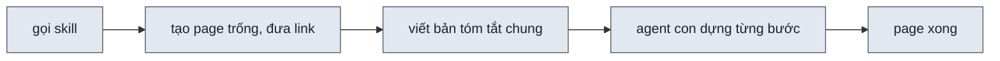
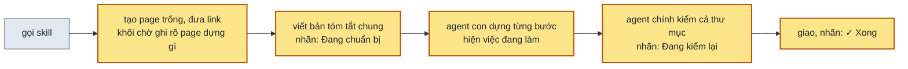

> **Nối tiếp:** [009](009-design-uiux-tien-do-dung.md) cho người dùng mở page ngay lúc bắt đầu dựng và thấy page lớn dần. Plan này sửa những chỗ người mở link sớm đọc không hiểu.
> **Lật:** D6 của [009](009-design-uiux-tien-do-dung.md), phần thời điểm in link: link in ngay sau khi tạo page trống, trước khi viết brief, không đợi lúc gọi agent con. **Giữ:** mọi D khác của 009.
> **Phụ thuộc:** [009](009-design-uiux-tien-do-dung.md) có code trước: plan này sửa trên lệnh `progress`, nhãn tiến độ và khối chờ của 009. Nếu 009 nghiệm thu sau khi plan này xong Phase 3, thì dòng nhãn trong Gate của 009 tính từ "Đang chuẩn bị", và tiêu chí `F6.1` của 009 tìm dòng `Mở ngay được` thay cho `Đang dựng, mở ngay được`.

## 1. Problem

Lượt review ngày 2026-10-09, trên màn "Lịch hẹn hôm nay" với hai phương án, người dùng mở link ngay khi có và gặp năm
chỗ khó hiểu. Chat nói agent đang viết bản tóm tắt chung, mà page ghi "Đang dựng 0/6". Chấm xanh cạnh nhãn đứng yên,
nên không biết agent còn chạy hay đã dừng. Một bước dựng kéo dài 2–3 phút mà chỉ thấy tên bước. Khối chờ kể chuyện
("Page tự hiện phần mới mỗi khi…") thay vì nói page này dựng gì. Tên phương án "A · Tìm nhanh để đánh dấu đến" không
nói màn nào, ai tìm, tìm cái gì.

Lượt chạy thật sau phase 4 vẫn ra khối chờ khó hiểu. Page A ghi "A · Ô tìm bệnh nhân ở đầu trang", dù page có dải
tổng trong ngày, tải từng bác sĩ, ô tìm, lọc trạng thái và bảng lịch hẹn theo giờ. Người xem đọc tên tưởng page chỉ có
ô tìm. Phụ đề "Trả lời: <câu hỏi>" chỉ nêu một trong ba nhu cầu của đề. Dòng "Đơn vị chính · Hy sinh" là chữ agent
dùng để so phương án; người xem đọc không hiểu "hy sinh khung giờ trống" là gì trên page.

Lượt chạy sau phase 5 cũng ngày 2026-10-09 thấy nhãn "✓ Xong · 09/10" trong lúc agent vẫn đang chạy. "09/10" là ngày
sửa cuối, mà đọc lên giống 9 trên 10 bước, dù danh sách chỉ có 7 bước. Nhãn sang "Xong" khi agent con đánh dấu bước
kiểm đầy đủ. Sau đó agent chính còn kiểm cả thư mục, sửa tới ba vòng, rồi mới giao.

## 2. Goal

- Trong lúc agent chính còn viết bản tóm tắt chung, nhãn tiến độ ghi "Đang chuẩn bị". Khi agent bắt đầu dựng, nhãn
  chuyển sang "Đang dựng 0/6".
- Trong lúc page đang chuẩn bị, đang dựng hay đang sửa, nhãn tiến độ có chuyển động: vòng lan ra từ chấm, vệt sáng
  chạy trên thanh tiến độ ở đáy nhãn. Nhãn ghi luôn việc agent đang làm. Khi page xong, nhãn đứng yên.
- Bấm nhãn tiến độ thấy việc agent đang làm trong bước dở, một dòng thụt vào ngay dưới bước đó. Dòng đổi theo agent
  mà page không tải lại. Khi bước xong, dòng mất.
- Trước khi page có khối đầu tiên, page hiện: tên màn, tên phương án (hay tên màn của luồng), bố cục page (hay việc
  của màn) và các việc page tiện cho. Page không có câu hướng dẫn, không có chữ "nhanh", "hy sinh", "đơn vị chính".
- Tên phương án là cụm danh từ tả cách cả page được bày. Người chưa đọc bản tóm tắt chung đọc tên là biết page có
  gì.
- Khi mọi bước dựng đã xong mà agent chính chưa giao, nhãn ghi "Đang kiểm lại". Nhãn chỉ ghi "✓ Xong" sau khi agent
  chính đánh dấu bước giao.
- Nhãn "✓ Xong" không có con số. Ngày sửa cuối nằm ở dòng cuối danh sách bước, dạng "Sửa lần cuối 9 thg 10".

**Ngoài scope:** số bước dựng và thứ tự các bước · cách page tự tải lại · nội dung page từ bước dựng 1 trở đi.

## 3. Mental model

**Bây giờ chạy thế nào** — Người dùng gọi skill. Agent chính tạo page trống và đưa link ngay. Rồi agent chính viết
bản tóm tắt chung vài phút, xong mới gọi các agent con dựng. Người mở link lúc này thấy nhãn "Đang dựng 0/6" dù chưa
ai dựng. Khối chờ ghi "Đang dựng", tên phương án do agent tự đặt, và một câu hướng dẫn. Mỗi agent con dựng sáu bước,
mỗi bước 2–3 phút. Giữa hai lần đánh dấu bước xong, nhãn và danh sách bước không đổi gì.



**Sau plan chạy thế nào** — Cùng đường đó. Page trống mở ra với khối chờ ghi tên màn, tên phương án viết thành cụm
danh từ, câu hỏi trung tâm và cái hy sinh. Trong lúc viết bản tóm tắt chung, nhãn ghi "Đang chuẩn bị". Viết xong,
agent chính đánh dấu bước chuẩn bị của mọi page rồi mới gọi agent con, nên nhãn chuyển sang "Đang dựng 0/6" đúng lúc
có người dựng. Trong mỗi bước, agent con ghi việc đang làm, và danh sách bước hiện việc đó ngay dưới bước dở. Khi
agent con xong, nhãn ghi "Đang kiểm lại" trong lúc agent chính kiểm cả thư mục. Agent chính đánh dấu bước giao ngay
trước khi giao, lúc đó nhãn mới ghi "✓ Xong".



**Hành vi đổi ra sao**

| #     | Tình huống | Bây giờ | Sau plan |
| ----- | ---------- | ------- | -------- |
| `BH1` | mở link lúc agent chính đang viết bản tóm tắt chung | nhãn "Đang dựng 0/6", chấm đứng yên | nhãn "Đang chuẩn bị · Viết brief chung", chấm có vòng lan; bấm vào thấy "● Viết brief chung" |
| `BH2` | để page mở giữa một bước dựng | chấm đứng yên; danh sách chỉ có tên bước | nhãn ghi "Đang dựng 1/6 · <việc đang làm>", thanh ở đáy nhãn tô 1/6 và có vệt sáng chạy; dưới bước dở trong danh sách cũng có dòng việc đang làm, vd "Chuẩn bị dữ liệu", đổi theo agent mà page không tải lại |
| `BH3` | một bước dựng xong | page tự tải lại, nhãn tăng một bước | như cũ; dòng việc đang làm của bước đó mất |
| `BH4` | mở link trước khi có khối đầu tiên, đề một màn | "Đang dựng" · "A · Tìm nhanh để đánh dấu đến" · câu hướng dẫn | "LỊCH HẸN HÔM NAY" · "A · Bảng lịch hẹn theo giờ, tìm và lọc ở trên" · bố cục: thứ gì trên cùng, thứ gì chiếm phần lớn trang · "Tiện cho: tìm lịch hẹn của bệnh nhân vừa bước vào · …" |
| `BH5` | mở link trước khi có khối đầu tiên, đề một luồng | "Đang dựng" · "2 · Đăng ký" · câu hướng dẫn | tên luồng · "2 · Đăng ký" · việc của màn |
| `BH6` | agent chính đã giao | "✓ Xong · 09/10", đọc giống 9 trên 10 bước | "✓ Xong", không có chấm nhấp nháy; bấm vào thấy dòng cuối "Sửa lần cuối 9 thg 10" |
| `BH7` | agent con đã đánh dấu bước kiểm đầy đủ, agent chính còn kiểm cả thư mục | "✓ Xong · 09/10" | "Đang kiểm lại · Kiểm lại và giao", chấm có vòng lan; danh sách có nhóm "Giao" với "● Kiểm lại và giao" |
| `BH8` | mở vòng góp ý trên page đã giao | "Đang sửa 0/n"; xong vòng thì "✓ Xong" ngay | "Đang sửa 0/n"; xong vòng thì "Đang kiểm lại" tới khi agent chính giao |

**Không đụng:** sáu bước dựng và thứ tự của chúng · cách page tự tải lại và giữ vị trí cuộn · nội dung page từ bước
dựng 1 trở đi.

---

## 5. Decisions

**Ai quyết:** 🤖 = agent tự quyết, chưa hỏi ai — **chỗ người duyệt phải soi** · 👤 = user chốt lúc bàn (luật 22).

### D0 👤 — Bấm nhãn tiến độ thấy việc con của bước dở, một dòng thụt vào ngay dưới bước; bước xong thì dòng mất

**Lý do:** một bước dựng kéo dài 2–3 phút; chỉ thấy tên bước thì người xem không biết agent đang làm gì trong bước → DS1

### D1 🤖 — Việc con ghi vào chính bước dở (`doing`) qua `progress --doing`; ghi việc con không tăng `rev`

**Lý do:** page chỉ tải lại khi page đổi; việc con không đổi page, nên shell chỉ vẽ lại danh sách → DS1
**Phương án đã loại:** việc con thành bước riêng — số bước đổi theo từng page, "a/6" mất nghĩa · tăng `rev` — page
tải lại vài lần trong một bước mà không có gì mới

### D2 🤖 — Chấm nhãn tiến độ mờ rõ theo nhịp 1,6 giây khi page chưa xong; đứng yên khi người xem tắt chuyển động

**Lý do:** chấm đứng yên không phân biệt được agent đang chạy hay đã dừng → DS1
**Đổi (2026-10-09):** nhãn chưa xong có vòng lan từ chấm, việc con ngay trên nhãn, thanh tiến độ ở đáy với vệt sáng
chạy — người dùng thấy chấm mờ rõ chưa đủ gây ấn tượng; so sáu hướng ở `.test/design-uiux/061-nhan-dang-lam/demo.html`, người dùng giao agent chọn

### D3 👤 — Khối chờ chỉ có dữ liệu của page: tiêu đề là concept, phụ đề là nội dung cụ thể; bỏ chữ "Đang dựng" và câu hướng dẫn

**Lý do:** khối chờ là thứ người mở link sớm đọc đầu tiên; câu hướng dẫn kể chuyện, còn nhãn tiến độ trên toolbar đã
nói page đang ở đâu → DS2

### D4 🤖 — Khối chờ có dòng tên màn, lấy từ phần trước ` · ` của `--title`

**Lý do:** thiếu tên màn thì tên phương án không có gì để bám → DS2
**Phương án đã loại:** thêm cờ `--screen-name` — tên màn đã nằm sẵn trong `--title`

### D5 🤖 — Bước chuẩn bị nằm riêng, ngoài sáu bước dựng; agent chính đánh dấu bằng `progress --prepared` cho mọi page sau khi điền xong brief, trước khi gọi agent con

**Lý do:** nhãn phải nói đúng việc đang diễn ra; sáu bước dựng giữ nguyên số để `--done <n>` khớp bảng bước → DS3
**Phương án đã loại:** thêm bước chuẩn bị làm bước 1 — số bước dựng lệch bảng sáu bước, "a/6" thành "a/7" · tạo page
sau khi xong brief — link đến muộn, và bảng `## Pages` của brief cần tên file do lệnh `page` in ra

### D6 👤 — Tên phương án là cụm danh từ tả cách cả page được bày, đủ đối tượng; SKILL.md có cặp ví dụ đúng / sai

**Lý do:** SKILL.md chỉ bảo đặt "tên", nên agent nén ý thành chuỗi động từ thiếu chủ thể, đối tượng. Tên tả "thứ
chiếm trung tâm" thì agent chọn một widget ("Ô tìm bệnh nhân ở đầu trang"), người xem tưởng page chỉ có widget đó → DS4
**Phương án đã loại:** tên tả thứ chiếm trung tâm page — thu cả page về một widget

### D7 🤖 — Agent chính in link mọi page ngay sau lệnh `page`, trước khi viết brief

**Lý do:** viết brief mất vài phút; in link lúc gọi agent con thì người dùng không bao giờ thấy "Đang chuẩn bị", và
có link muộn hơn vài phút → DS3
**Phương án đã loại:** giữ lúc in link như 009 — bỏ phí trạng thái chuẩn bị và vài phút xem được page

### D8 👤 — Khối chờ tả bố cục page và các việc page tiện cho; không in câu hỏi trung tâm, đơn vị chính, cái hy sinh

**Lý do:** người xem cần biết page bày thế nào và dùng vào việc gì. "Nhanh", "hy sinh", "đơn vị chính" là chữ agent
dùng để so phương án ở bước 3, đọc trên page không hợp → DS2
**Phương án đã loại:** "Nhanh khi: …" và "Chậm khi: …" — vẫn là chữ so phương án, người xem không cần

### D9 🤖 — Cờ `--layout` và `--good-for` thay `--question`, `--unit`, `--tradeoff`; khung mô tả của nút phương án và bảng `## Pages` dùng cùng hai thứ

**Lý do:** khối chờ, khung mô tả, bảng `## Pages` và khối phương án trong chat cùng tả một page cho người đọc, nên
dùng chung chữ. Câu hỏi trung tâm, đơn vị chính, cái hy sinh vẫn là cách agent so phương án ở bước 3, nằm ở bảng
`## Tình huống` → DS2

### D10 👤 — Nhãn "✓ Xong" không có con số; ngày sửa cuối là dòng cuối danh sách bước, viết "9 thg 10"

**Lý do:** "09/10" đứng cạnh nhãn đọc thành 9 trên 10 bước → DS6
**Phương án đã loại:** giữ ngày trên nhãn, đổi sang "9 thg 10" — nhãn dài thêm, mà ngày không giúp biết page xong chưa

### D11 👤 — Bước giao của agent chính nằm riêng, sau mọi vòng; agent chính đánh dấu nó ngay trước khi giao; `--round` mở lại bước này

**Lý do:** bước kiểm đầy đủ là của agent con. Sau bước đó agent chính còn kiểm cả thư mục và sửa tới ba vòng. Nhãn
báo xong lúc agent con xong thì sai đúng lúc người xem đang đợi → DS6
**Phương án đã loại:** thêm bước kiểm cả thư mục vào danh sách bước dựng — agent con không làm được bước đó, và "a/6"
đổi số · `check.mjs` cả thư mục tự đánh dấu khi exit 0 — còn lỗi sau ba vòng thì agent vẫn giao, nhãn đứng ở "Đang
kiểm lại" mãi

### D12 🤖 — Bước tên "Kiểm lại và giao", cờ `progress --delivered`, nhãn "Đang kiểm lại"

**Lý do:** vòng góp ý một page không bắt buộc kiểm cả thư mục, nên tên bước không ghi "cả thư mục". Cờ gọi theo lúc
chạy, ngay trước khi giao, để agent không đánh dấu sớm → DS6

## 6. Design

### DS1 — Nhãn tiến độ: chuyển động và việc con

```text
node new-design.mjs progress <thư mục design> <file> --doing "<việc con>"   # việc con của bước dở, rev giữ nguyên
```

```js
{ task: "Khung các khối, dữ liệu mặc định", done: false, round: 1, doing: "Chuẩn bị dữ liệu" }
```

| Chỗ | Hành vi |
| --- | --- |
| `--doing` | ghi `doing` vào bước dựng đầu tiên chưa xong, ghi đè việc con trước; không tăng `rev`; chữ rỗng thì exit 1; mọi bước đã xong thì exit 1 |
| `--done` | xoá `doing` của bước vừa xong |
| `progress` không cờ | in việc con dưới bước ● bằng dòng `↳ <việc con>` |
| `shell.js` | bước ● có `doing` thì thêm `<li data-step="doing">` ngay sau nó; `rev` giữ nguyên thì vẽ lại danh sách, không tải lại; nhãn chỉ vẽ lại khi nội dung đổi, để chuyển động không giật về đầu |
| `shell.css` | `li[data-step="doing"]` thẳng mép chữ của bước trên, chữ 12px, màu `--ds-bar-muted`; nhãn khác `done`: `.ds-status-dot::after` chạy `ds-ripple` 1,4s; `[data-ds-status-doing]` "· <việc con>" cắt ở 22ch, mới đổi thì có `data-fresh` chạy `ds-slide-in`; `.ds-status-track` ở đáy, `--ds-done` = số bước xong / số bước của vòng, vệt `ds-sweep` 1,6s chạy trên phần còn lại; ≤ 720px ẩn việc con; `prefers-reduced-motion: reduce` thì không chạy |
| `SKILL.md` | dòng lệnh `--doing`; "Dựng một page theo bước" bước 2 ghi việc con, 2–4 việc một bước, vài chữ, không tên file; lời giao agent con; nhãn tiến độ trong "Các khối điều khiển" |

| Test | Ca |
| --- | --- |
| `scripts/test-progress.mjs` | `--doing` ghi vào bước dở, `rev` giữ nguyên · lần hai ghi đè · chữ rỗng exit 1 · `--done` xoá `doing` · mọi bước xong thì `--doing` exit 1 |
| `scripts/test-shell.mjs` | `--doing` → dòng việc con ngay sau `li[data-step="current"]` và "· <việc con>" trên nhãn có `data-fresh`; đổi việc con → dòng đổi, 0 lần tải lại; `--done` → 0 dòng việc con; 2/6 → `--ds-done` 33.3%; nội dung không đổi qua hai lượt đọc → chấm vẫn là phần tử cũ |

### DS2 — Khối chờ

`templates/page.html`, `<section data-ds-waiting>`; `new-design.mjs page` điền theo cờ:

| Dòng | Thẻ | Lấy từ | Vd đề một màn | Vd đề một luồng |
| --- | --- | --- | --- | --- |
| tên màn | `p`, chữ nhỏ in hoa, `text-muted` | phần trước ` · ` đầu tiên của `--title` | LỊCH HẸN HÔM NAY | MỞ TÀI KHOẢN |
| tiêu đề | `h1` | `--option` hay `--screen`, không có thì `--title` | A · Ô tìm bệnh nhân ở đầu trang | 2 · Đăng ký |
| phụ đề | `p`, `text-lg` | `<--layout>` hay `<--purpose>` | Trên cùng là dải tổng ca trong ngày và tải ba bác sĩ. Ngay dưới là ô tìm tên hay số điện thoại và nút lọc trạng thái. Phần lớn trang là bảng lịch hẹn xếp theo giờ, mỗi dòng có nút "Đã đến". | Tạo tài khoản bằng email |
| dòng nhỏ | `p`, `text-sm text-muted` | `Tiện cho: <--good-for>` | Tiện cho: tìm lịch hẹn của bệnh nhân vừa bước vào · lọc người không đến để gọi lại · tra giờ hẹn khi khách gọi điện | — |

- Cờ nào không có thì bỏ cả dòng của nó, không để `{{…}}` trong page.
- `--title` không có ` · ` thì không có dòng tên màn.
- Khối chờ không có chữ "Đang dựng" và câu hướng dẫn.
- `test-progress.mjs`: đọc `h1`, `p` trong `<section data-ds-waiting>` của một page phương án và một page màn, so đúng
  thứ tự và chữ ở bảng trên; không còn `{{`.

### DS3 — Bước chuẩn bị

```js
(window.DESIGN_PROGRESS ||= {})["01-tim-nhanh.html"] = {
  rev: 0,
  prep: { task: "Viết brief chung", done: false },
  build: [ /* sáu bước dựng như 009 */ ],
};
```

```text
node new-design.mjs progress <thư mục design> <file> --prepared   # bước chuẩn bị xong, rev giữ nguyên
```

| Chỗ | Hành vi |
| --- | --- |
| `page` | tạo `prep` chưa xong |
| `--prepared` | `prep.done = true`; ghi `doing: "Đọc brief và nguyên tắc"` vào bước dựng 1 nếu bước đó chưa có việc con; không tăng `rev`; `prep` đã xong thì exit 1 |
| `--done`, `--doing` | khi `prep` chưa xong thì exit 1, nói chạy `--prepared` trước |
| file không có `prep` (page tạo trước plan này) | coi như đã chuẩn bị xong |
| `shell.js` | `prep` chưa xong → `data-state="preparing"`, chữ "Đang chuẩn bị" / "Preparing", không có số; danh sách có nhóm "Chuẩn bị" với "● Viết brief chung" trên nhóm "Dựng" |
| `shell.css` | `preparing` cùng màu nhấn, vòng lan, thanh tiến độ (0%) như `building`; việc con trên nhãn là "Viết brief chung" |
| `check.mjs` | `prep` chưa xong thì báo `còn bước chưa xong`, như bước dựng |
| `SKILL.md` Bước 4 | agent chính in khối link ngay sau các lệnh `page` (D7); điền brief xong thì chạy `progress … --prepared` cho mọi page, rồi mới gọi agent con; thư mục một page thì chạy trước bước dựng 1 |

| Test | Ca |
| --- | --- |
| `scripts/test-progress.mjs` | page mới có `prep` chưa xong · `--done 1` trước `--prepared` exit 1 · `--prepared` không tăng `rev` · `--prepared` lần hai exit 1 · file không có `prep` vẫn `--done` được |
| `scripts/test-shell.mjs` | `prep` chưa xong → nhãn "Đang chuẩn bị · Viết brief chung", chấm chạy `ds-ripple`, thanh 0%; `--prepared` → "Đang dựng 0/6", 0 lần tải lại |
| `scripts/test-check.mjs` | `prep` chưa xong → exit 1 `còn bước chưa xong` |

### DS4 — Tên phương án

SKILL.md, mục "Một màn: hai phương án A và B", thêm luật:

- Tên phương án là cụm danh từ tả cách cả page được bày: khối chiếm phần lớn trang và chỗ của các khối khác.
- Tên có đủ đối tượng: tên nói cái gì nằm ở đó, không bỏ trống để người đọc tự đoán.
- Tên không là chuỗi động từ, không viết tắt.

| Sai | Lỗi | Đúng |
| --- | --- | --- |
| Tìm nhanh để đánh dấu đến | chuỗi động từ; không nói tìm cái gì, "đến" là gì | Bảng lịch hẹn theo giờ, tìm và lọc ở trên |
| Ô tìm bệnh nhân ở đầu trang | chỉ tả một widget; page còn dải tổng, tải bác sĩ, bảng lịch hẹn | Bảng lịch hẹn theo giờ, tìm và lọc ở trên |
| Lịch theo bác sĩ | chưa nói lịch bày thế nào, chi tiết ca nằm đâu | Lưới giờ × bác sĩ, chi tiết ca ở cột phải |

`--title` là `<tên màn> · <tên phương án>`, để khối chờ lấy được tên màn (DS2).

### DS5 — Bố cục và việc page tiện cho

```text
node new-design.mjs page <thư mục design> <slug> --title "<tên màn> · <tên phương án>" --option "A · <tên phương án>" \
  --layout "<bố cục: thứ gì trên cùng, thứ gì chiếm phần lớn trang, thứ gì ở cạnh>" --good-for "<việc 1> · <việc 2>"
```

| Chỗ | Hành vi |
| --- | --- |
| `new-design.mjs page` | phụ đề khối chờ là `--layout`, dòng nhỏ là `Tiện cho: <--good-for>` (bảng DS2); `pages.js` lưu `layout`, `goodFor`; không nhận `--question`, `--unit`, `--tradeoff` |
| `shell.js` | khung mô tả của nút phương án hiện tên phương án, `layout`, "Tiện cho: …", lần sửa cuối |
| `check.mjs` | thư mục phương án từ hai page mà page thiếu `layout` thì báo lỗi |
| `templates/brief.md` `## Pages` | cột `File` · `Phương án` · `Bố cục` · `Tiện cho` · `Trạng thái` |
| `SKILL.md` | luật tên phương án và bảng ví dụ của DS4; khối phương án trong chat ghi tên, bố cục, tiện cho, bản phác; lời giao agent con; dòng `Hướng khác:` |
| `SKILL.md` bước 3 | câu hỏi trung tâm, đơn vị chính, cái hy sinh, bảng tình huống × phương án giữ nguyên: đó là cách agent chọn A, B |

| Test | Ca |
| --- | --- |
| `scripts/test-progress.mjs` | khối chờ phương án ra đúng bốn dòng cột "Vd đề một màn" của DS2 |
| `scripts/test-shell.mjs` | khung mô tả có `layout` và "Tiện cho: …" |
| `scripts/test-check.mjs` | page phương án thiếu `layout` → exit 1 |

### DS6 — Bước giao và nhãn xong

```js
(window.DESIGN_PROGRESS ||= {})["01-bang-lich-hen.html"] = {
  rev: 6,
  prep: { task: "Viết brief chung", done: true },
  deliver: { task: "Kiểm lại và giao", done: false },
  build: [ /* sáu bước dựng, các vòng góp ý */ ],
};
```

```text
node new-design.mjs progress <thư mục design> <file> --delivered    # một page
node new-design.mjs progress <thư mục design> --delivered --all     # mọi page trong pages.js
```

| Chỗ | Hành vi |
| --- | --- |
| `page` | tạo `deliver` chưa xong |
| `--delivered` | `deliver.done = true`; không tăng `rev`; `prep` hay bước dựng còn chưa xong thì exit 1, nêu bước đầu tiên chưa xong; `deliver` đã xong thì exit 1 |
| `--delivered --all` | soát mọi page trước: page nào còn bước chưa xong thì exit 1, nêu page và bước, không ghi page nào; page đã giao thì bỏ qua |
| `--round` | `deliver.done = false` |
| file không có `deliver` (page tạo trước plan này) | coi như đã giao |
| `progress` không cờ | in nhóm "Giao" sau các vòng; mọi bước dựng xong mà chưa giao thì dòng cuối nói agent chính chạy `--delivered` ngay trước khi giao |
| `shell.js` | mọi bước dựng xong, `deliver` chưa xong → `data-state="checking"`, chữ "Đang kiểm lại" / "Checking", việc con trên nhãn là "Kiểm lại và giao", thanh tiến độ đầy; danh sách có nhóm "Giao" sau các vòng. Nhãn `done` chỉ có "✓ Xong", không có ngày. Khi `done`, danh sách có dòng cuối "Sửa lần cuối 9 thg 10" / "Last edited Oct 9" lấy từ `updated` của `pages.js` |
| `shell.css` | `checking` cùng màu nhấn, vòng lan như `building`; dòng ngày sửa chữ 12px, màu `--ds-bar-muted`, kẻ trên |
| `check.mjs` | không đọc `deliver`: agent chính chạy `check.mjs` cả thư mục trước khi đánh dấu giao |
| `watch-progress.mjs` | `deliver` sang xong thì ghi dòng "đã giao" |
| `SKILL.md` Bước 6, "Vòng sau" | chạy `--delivered --all` ngay trước tin giao; vòng góp ý thì chạy `--delivered` sau `touch`; dòng lệnh; nhãn trong "Các khối điều khiển" |

| Test | Ca |
| --- | --- |
| `scripts/test-progress.mjs` | page mới có `deliver` chưa xong · `--delivered` khi còn bước dựng exit 1 · `--delivered` không tăng `rev` · `--delivered` lần hai exit 1 · `--round` mở lại `deliver` · `--delivered --all` có page chưa xong exit 1 và không ghi page nào · file không có `deliver` coi như đã giao |
| `scripts/test-shell.mjs` | mọi bước dựng xong → nhãn "Đang kiểm lại · Kiểm lại và giao", chấm chạy `ds-ripple`; `--delivered` → nhãn "Xong", không có số, 0 lần tải lại; danh sách có nhóm "Giao" và dòng cuối "Sửa lần cuối <ngày> thg <tháng>" |

## 7. Phases

**Legend:** 🤖 = agent tự kiểm được (chạy lệnh, test, grep) · 👤 = cần người kiểm (số đo thật, UI, hạ tầng).

- [x] 👤 plan này được duyệt — 2026-10-09, Andy duyệt trong chat ("triển khai đi")

### Phase 0 — ghi doc nguồn

**Goal:** SPEC và PLANS của design-uiux khớp plan này.
**Cover:** —

**Actions:**

- [x] 🤖 `SPEC.md` mục 2: `F6.8` "Trong lúc một bước dựng chưa xong, danh sách bước dựng trên toolbar hiện việc con agent đang làm, một dòng thụt vào ngay dưới bước đó."; mục 3.1, 3.4 thêm `doing`; mục 4 thêm lý do của D1 — 2026-10-09, làm trong lượt review trước khi có plan này
- [x] 🤖 `SPEC.md` mục 2: `F6.5` đổi thành "Toolbar hiện page đang chuẩn bị, đang dựng, đang sửa theo góp ý hay đã xong."; mục 3.1, 3.4 thêm `prep`; mục 4 thêm lý do của D5 — 2026-10-09
- [x] 🤖 `SPEC.md` mục 2: `F6.9` "Trong lúc page chưa có khối đầu tiên, page hiện tên màn, tên page, câu hỏi trung tâm hay việc của màn, đơn vị chính và cái hy sinh."; mục 4 thêm lý do của D3 — 2026-10-09: lý do ở mục 4; khối chờ ở mục 3.1
- [x] 🤖 `SPEC.md` mục 2: `F1.18` "Agent đặt tên phương án bằng cụm danh từ tả thứ chiếm trung tâm page." — 2026-10-09: lý do ở mục 4
- [x] 🤖 `PLANS.md`: mục `### 011`, bảng mã `F6.5` · `F6.8` · `F6.9` · `F1.18` — 2026-10-09

**Gate:**

- [x] 🤖 `grep -c "F6.9\|F1.18" skills/design-uiux/SPEC.md` ≥ 2; `F6.5` có chữ "đang chuẩn bị" — 2026-10-09: 5 dòng; `F6.5` ghi "đang chuẩn bị"
- [x] 🤖 `python3 ~/.claude/skills/write-plan/verify.py .plan/011-design-uiux-page-dang-dung-de-hieu.md` — 0 ERROR — 2026-10-09: 0 ERROR · 0 WARN

### Phase 1 — nhãn chuyển động và việc con

**Goal:** để page mở giữa lúc dựng thấy nhãn chuyển động, ghi việc đang làm; bấm nhãn thấy việc con dưới bước dở.
**Cover:** DS1

**Actions:**

- [x] 🤖 `scripts/new-design.mjs`: `progress --doing`, `--done` xoá `doing`, `progress` không cờ in `↳ <việc con>` (D1) — 2026-10-09, làm trong lượt review trước khi có plan này
- [x] 🤖 `shell/shell.js`: dòng `li[data-step="doing"]` dưới bước ● (D0 · D1) — 2026-10-09
- [x] 🤖 `shell/shell.css`: kiểu dòng việc con; `ds-pulse` cho chấm, tắt khi `prefers-reduced-motion` (D2) — 2026-10-09
- [x] 🤖 `SKILL.md`: dòng lệnh `--doing`, "Các khối điều khiển", lời giao agent con, "Dựng một page theo bước"; gắn `F6.8` — 2026-10-09
- [x] 🤖 `scripts/test-progress.mjs` · `scripts/test-shell.mjs`: các ca của DS1 — 2026-10-09
- [x] 🤖 `shell/shell.js` + `shell/shell.css`: nhãn chưa xong có vòng lan, việc con trên nhãn, thanh tiến độ có vệt sáng; nhãn chỉ vẽ lại khi nội dung đổi (D2, sau dòng **Đổi**) — 2026-10-09: `test-shell.mjs` 77/77 ✓, ảnh sáng, tối, 420px

**Gate:**

- [x] 🤖 `node skills/design-uiux/scripts/test-progress.mjs` — mọi ca ✓, gồm năm ca `--doing` — DS1 · BH3 — 2026-10-09: 19/19 ✓
- [x] 🤖 `node skills/design-uiux/scripts/test-shell.mjs --pw $TMPDIR/design-uiux-pw` — mọi phép ✓, gồm "--doing hiện dòng việc con…, page không tải lại" và "--done xoá dòng việc con" — DS1 · BH2 · BH3 — 2026-10-09: 72/72 ✓, ảnh `progress-doing.png`
- [x] 🤖 `node scripts/spec-check.mjs skills/design-uiux` exit 0, `F6.8` có trong "Các khối điều khiển", "Gọi agent con", "Dựng một page theo bước" — 2026-10-09: 52 sub-scope

### Phase 2 — khối chờ

**Goal:** mở link trước khi có khối đầu tiên thấy page này dựng màn nào, phương án nào, trả lời câu hỏi gì.
**Cover:** DS2

**Actions:**

- [x] 🤖 `templates/page.html` + `scripts/new-design.mjs`: tiêu đề, phụ đề, dòng nhỏ theo cờ; bỏ "Đang dựng" và câu hướng dẫn; cờ thiếu thì bỏ dòng (D3) — 2026-10-09, làm trong lượt review trước khi có plan này
- [x] 🤖 `SKILL.md`: bảng file, Bước 4 đoạn lệnh `page`, "Dựng một page theo bước" tả khối chờ mới — 2026-10-09
- [x] 🤖 `templates/page.html` + `scripts/new-design.mjs`: dòng tên màn từ `--title`; nhãn "Trả lời:" trước `--question` (D4) — 2026-10-09
- [x] 🤖 `SKILL.md` Bước 4: `--title` dạng `<tên màn> · <tên phương án>`; khối chờ có dòng tên màn; gắn `F6.9` — 2026-10-09: bảng bốn dòng khối chờ trong "Agent chính chuẩn bị"
- [x] 🤖 `scripts/test-progress.mjs`: ca khối chờ theo bảng DS2, cả `--title` không có ` · ` — 2026-10-09: ba ca: phương án, màn, `--title` không có ` · `

**Gate:**

- [x] 🤖 `node skills/design-uiux/scripts/test-progress.mjs` — ca khối chờ phương án ra đúng bốn dòng của cột "Vd đề một màn", ca màn ra ba dòng của cột "Vd đề một luồng", không còn `{{` — DS2 · BH4 · BH5 — 2026-10-09: 25/25 ✓; dòng tên màn "Đăng nhập", phụ đề "Trả lời: …"
- [x] 🤖 ảnh khối chờ của một page phương án mới tạo, khổ 1000px: bốn dòng căn giữa, không có "Đang dựng" — DS2 — 2026-10-09: `/tmp/ds-waiting2.png`, "LỊCH HẸN HÔM NAY · A · Ô tìm bệnh nhân ở đầu trang · Trả lời: … · Đơn vị chính … · Hy sinh …"

### Phase 3 — bước chuẩn bị

**Goal:** mở link lúc agent chính viết brief thấy "Đang chuẩn bị"; agent bắt đầu dựng thì nhãn thành "Đang dựng 0/6".
**Cover:** DS3

**Actions:**

- [x] 🤖 `scripts/new-design.mjs`: `page` tạo `prep`; `progress --prepared`; `--done` và `--doing` chặn khi `prep` chưa xong; file không có `prep` coi như xong (D5) — 2026-10-09
- [x] 🤖 `shell/shell.js` + `shell/shell.css`: trạng thái `preparing`, nhóm "Chuẩn bị" trong danh sách, chấm cùng nhịp (D2 · D5) — 2026-10-09
- [x] 🤖 `scripts/check.mjs`: `prep` chưa xong thì báo `còn bước chưa xong` — 2026-10-09
- [x] 🤖 `scripts/new-design.mjs`: `--prepared` ghi sẵn việc con "Đọc brief và nguyên tắc" cho bước dựng 1 — 2026-10-09: lượt chạy thật `.design/003-lich-hen-hom-nay` không có dòng việc con 2 phút 23 giây (`--prepared` 13:39:40, `--doing` đầu tiên 13:42:03) vì agent con đọc brief, nguyên tắc trước; `test-progress.mjs` ca `--prepared` kiểm `doing`
- [x] 🤖 `SKILL.md` Bước 4: in khối link ngay sau các lệnh `page` (D7); chạy `--prepared` cho mọi page sau khi điền brief, trước khi gọi agent con; dòng lệnh; nhãn trong "Các khối điều khiển"; gắn `F6.5` — 2026-10-09: link chuyển lên "Agent chính chuẩn bị", vòng `--prepared` trước "Gọi agent con", sơ đồ Mental model, một dòng bẫy; thêm `watch-progress.mjs` ghi "chuẩn bị xong" và "việc con: …"
- [x] 🤖 `SPEC.md` mục 3.5: thứ tự tạo page → in link → viết brief → `--prepared` → gọi agent con (D7) — 2026-10-09: bước 5–7 của agent chính
- [x] 🤖 `scripts/test-progress.mjs` · `scripts/test-shell.mjs` · `scripts/test-check.mjs`: các ca của DS3 — 2026-10-09; hai phép cũ của `test-shell.mjs` đổi giá trị mong đợi vì danh sách có thêm nhóm "Chuẩn bị"

**Gate:**

- [x] 🤖 `test-progress.mjs` mọi ca ✓, gồm năm ca `prep` — DS3 — 2026-10-09: 25/25 ✓
- [x] 🤖 `test-shell.mjs` mọi phép ✓, gồm "prep chưa xong → Đang chuẩn bị" và "--prepared → Đang dựng 0/6, 0 lần tải lại" — DS3 · BH1 — 2026-10-09: 74/74 ✓
- [x] 🤖 `test-check.mjs` mọi ca ✓, gồm ca `prep` chưa xong — DS3 — 2026-10-09: 15/15 ✓, C14

### Phase 4 — tên phương án

**Goal:** agent chạy skill đặt tên phương án bằng cụm danh từ tả thứ nằm ở trung tâm page.
**Cover:** DS4

**Actions:**

- [x] 🤖 `SKILL.md`, mục "Một màn: hai phương án A và B": luật và bảng ví dụ của DS4; gắn `F1.18` (D6) — 2026-10-09: ba dòng ví dụ

**Gate:**

- [x] 🤖 `node scripts/spec-check.mjs skills/design-uiux` exit 0, `F1.18` gắn ở mục "Một màn: hai phương án A và B" — DS4 — 2026-10-09: 54 sub-scope, 0 lỗi

### Phase 5 — khối chờ tả bố cục

**Goal:** khối chờ, khung mô tả của nút phương án và tên phương án tả cách cả page được bày, không còn chữ so phương án.
**Cover:** DS5

**Actions:**

- [x] 🤖 `SPEC.md`: `F6.9`, `F1.18` theo §2; mục 3.1 khối chờ và `pages.js`; mục 4 lý do của D6, D8 (D6 · D8) — 2026-10-09
- [x] 🤖 `scripts/new-design.mjs` + `templates/page.html`: cờ `--layout`, `--good-for`; phụ đề, dòng "Tiện cho:"; bỏ `--question`, `--unit`, `--tradeoff` (D8 · D9) — 2026-10-09; `pages.js` lưu `layout`, `goodFor`
- [x] 🤖 `shell/shell.js`: khung mô tả hiện `layout`, "Tiện cho: …" (D9) — 2026-10-09
- [x] 🤖 `scripts/check.mjs`: page phương án thiếu `layout` thì báo lỗi (D9) — 2026-10-09
- [x] 🤖 `templates/brief.md` + fixture `hai-page-brief.md`: cột `Bố cục` · `Tiện cho` (D9) — 2026-10-09
- [x] 🤖 `SKILL.md`: luật và bảng ví dụ tên phương án; khối phương án trong chat; lệnh `page`; bảng khối chờ; lời giao agent con; bảng file; đổi hướng `chưa chọn` (D6 · D8 · D9); `samples/faults/L4.patch` theo dòng mới — 2026-10-09: thêm bảng ví dụ bố cục, tiện cho cho A và B của màn lịch hẹn
- [x] 🤖 `scripts/test-progress.mjs` · `test-shell.mjs` · `test-check.mjs`: cờ mới, khối chờ theo bảng DS2 — 2026-10-09; `test-progress.mjs` thêm ca `pages.js` lưu `layout`, `goodFor`

**Gate:**

- [x] 🤖 `test-progress.mjs`, `test-shell.mjs`, `test-check.mjs` mọi ca ✓; ca khối chờ phương án ra đúng bốn dòng của cột "Vd đề một màn" — DS5 · BH4 — 2026-10-09: 26/26 ✓ · 77/77 ✓ · 15/15 ✓ (`--pw $TMPDIR/design-uiux-pw`)
- [x] 🤖 `grep -rn "Hy sinh\|Đơn vị chính\|Trả lời:" skills/design-uiux/{scripts,shell,templates}` — 0 dòng — DS5 — 2026-10-09: 0 dòng
- [x] 🤖 `node scripts/spec-check.mjs skills/design-uiux` exit 0 — DS5 — 2026-10-09: 54 sub-scope, 0 lỗi
- [x] 🤖 `samples/faults/L4.patch` áp được vào `SKILL.md` (`patch --dry-run`) — DS5 — 2026-10-09: L4 áp được. L3, L5, L7 không áp được, cả trên `SKILL.md` ở HEAD: lỗi có từ trước, không thuộc plan này

### Phase 6 — nhãn xong đúng lúc

**Goal:** nhãn chỉ ghi "✓ Xong" sau khi agent chính giao, và không có con số đọc nhầm thành số bước.
**Cover:** DS6

**Actions:**

- [x] 🤖 `SPEC.md` mục 2: `F6.5` thêm "đang kiểm lại"; `F6.10` "Toolbar chỉ ghi page đã xong sau khi agent chính đánh dấu bước giao."; `F6.11` "Toolbar ghi ngày sửa cuối của page ở cuối danh sách bước dựng, không ghi trên nhãn trạng thái."; mục 3.1, 3.4, 3.5 thêm `deliver`; mục 4 lý do của D10, D11 — 2026-10-09
- [x] 🤖 `PLANS.md`: bảng mã của `### 011` thêm `F6.10`, `F6.11` — 2026-10-09
- [x] 🤖 `scripts/new-design.mjs`: `page` tạo `deliver`; `progress --delivered` và `--delivered --all`; `--round` mở lại `deliver`; file không có `deliver` coi như đã giao (D11 · D12) — 2026-10-09; `--delivered --all` soát mọi page trước, có page dở thì không ghi page nào
- [x] 🤖 `shell/shell.js` + `shell/shell.css`: trạng thái `checking`, nhóm "Giao"; nhãn `done` không có ngày; dòng "Sửa lần cuối" cuối danh sách (D10 · D12) — 2026-10-09
- [x] 🤖 `samples/watch-progress.mjs`: ghi "đã giao" — 2026-10-09
- [x] 🤖 `SKILL.md`: Bước 6 và "Vòng sau" chạy `--delivered`; dòng lệnh; nhãn trong "Các khối điều khiển"; gắn `F6.10` `F6.11` — 2026-10-09; `references/build-page.md` thêm dòng agent con không chạy `--delivered`
- [x] 🤖 `scripts/test-progress.mjs` · `scripts/test-shell.mjs`: các ca của DS6 — 2026-10-09; hai bộ page mẫu của `test-shell.mjs` chạy thêm `--delivered` để giữ trạng thái xong

**Gate:**

- [ ] 🤖 `test-progress.mjs`, `test-shell.mjs`, `test-check.mjs` mọi ca ✓, gồm các ca `deliver` — DS6 · BH6 · BH7 · BH8
- [ ] 🤖 `node scripts/spec-check.mjs skills/design-uiux` exit 0, `F6.10` `F6.11` có mục SKILL.md gắn mã — DS6

### Phase 7 — nghiệm thu

**Goal:** mỗi bullet §2 có một lượt chạy thật, kết quả ghi cạnh ô tick.
**Cover:** —

**Actions:**

- [ ] 🤖 chạy bài 01 `--auto` theo `samples/README.md`, kèm `watch-progress.mjs`, vào `.test/design-uiux/<NNN>-nghiem-thu-011/`
- [ ] 👤 gọi `/design-uiux` với một đề thật, mở link ngay khi có, để page mở suốt lúc dựng

**Gate** — một dòng ứng một bullet §2:

- [ ] 🤖 §2 bullet 1: trong `chat.md`, khối link đứng trước lần ghi `brief.md`; lệnh `--prepared` đứng sau lần ghi `brief.md`, trước lần gọi agent con đầu tiên — <bằng chứng> · BH1
- [ ] 👤 §2 bullet 2: lượt chạy thật — nhãn có vòng lan, thanh tiến độ có vệt sáng và việc con lúc đang chuẩn bị và đang dựng; đứng yên khi "✓ Xong" — <ngày + ai xác nhận> · BH6
- [ ] 👤 §2 bullet 3: lượt chạy thật — bấm nhãn giữa một bước thấy dòng việc con, dòng đổi mà page không tải lại, bước xong thì dòng mất; `subagent-*.md` của bài 01 có `--doing` trong mỗi bước dựng 1–5 — <ngày + ai xác nhận> · BH2 · BH3
- [ ] 👤 §2 bullet 4: lượt chạy thật — khối chờ của page vừa tạo có tên màn, tên phương án, bố cục page, dòng "Tiện cho: …"; không có câu hướng dẫn, không có chữ "nhanh", "hy sinh", "đơn vị chính" — <ngày + ai xác nhận> · BH4 · BH5
- [ ] 👤 §2 bullet 5: tên hai phương án của bài 01 và của lượt chạy thật là cụm danh từ tả cách cả page được bày; người duyệt đọc tên là đoán được page có gì — <ngày + ai xác nhận>
- [ ] 🤖 §2 bullet 6: trong `progress.log` của `watch-progress.mjs`, dòng "đã giao" của mọi page đứng sau lần chạy `check.mjs` cả thư mục cuối cùng trong `chat.md` — <bằng chứng> · BH7
- [ ] 👤 §2 bullet 7: lượt chạy thật — nhãn xong chỉ ghi "✓ Xong"; bấm vào thấy dòng cuối "Sửa lần cuối …" — <ngày + ai xác nhận> · BH6
- [ ] 🤖 `python3 ~/.claude/skills/write-plan/verify.py .plan/011-design-uiux-page-dang-dung-de-hieu.md` — 0 ERROR
