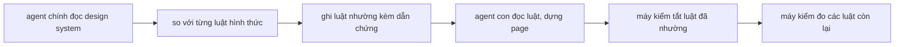
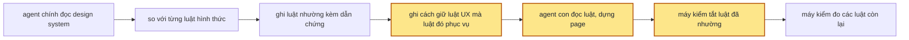

> **Nối tiếp:** [003](003-design-uiux-principles.md) đưa vào một bộ nguyên tắc và giới hạn cho page, phần đo được do máy kiểm. Plan này chia lại bộ luật đó theo việc từng luật lo: người dùng hiểu đúng và làm được, hay page gọn và đồng bộ.
> **Phụ thuộc:** [011](011-design-uiux-page-dang-dung-de-hieu.md) sửa cùng SKILL.md, khuôn bản tóm tắt chung và `check.mjs`. Plan này làm trên bản đã có các thay đổi của 011.

## 1. Problem

Agent dựng page đọc một file luật có hai danh sách: 13 nguyên tắc và 10 giới hạn. File chia hai danh sách theo việc
luật có nhường design system hay không, và mở đầu bằng câu "Nguyên tắc > design system > giới hạn". Người đọc vì vậy
tưởng design system quyết thứ tự giữa hai danh sách. Thật ra hai danh sách lo hai việc riêng: nguyên tắc lo người dùng
hiểu đúng và làm được, giới hạn lo page gọn và đồng bộ.

Cách chia hiện tại xếp sai ba luật. Hai luật về hình thức nằm trong nhóm nguyên tắc: cùng vai thì cùng khuôn, nhịp chữ
trong khối. Luật không dùng số âm cho khoảng cách không thuộc nhóm nào. Khi design system làm khác một giới hạn, agent
ghi "nhường" và máy kiểm tắt luật đó. Không ai hỏi page có còn giữ được điều giới hạn đó bảo vệ không. Ví dụ, bài mẫu
01 có design system đổ bóng cho card, nên luật "bóng chỉ cho lớp nổi" nhường. Không bước nào hỏi modal còn tách khỏi
trang hay không.

## 2. Goal

- Agent dựng page đọc hai file luật. File luật UI chứa luật về thứ người dùng thấy: màu, chữ, khoảng cách, hình
  khối. File luật UX chứa luật về thứ người dùng cảm nhận: hiểu đúng, làm được, không bị bất ngờ. Mỗi luật nằm đúng
  một file. Skill không còn gọi luật dựng page là "nguyên tắc" hay "giới hạn", kể cả trên nhãn tiến độ.
- Mỗi luật UI ghi nó phục vụ luật UX nào, hoặc ghi là chỉ thuần gu. Thay cho thứ tự ba bậc, file luật UI có một câu:
  lựa chọn UI nào làm hỏng một luật UX thì luật UX thắng.
- Khi design system làm khác một luật UI, bản tóm tắt chung ghi dẫn chứng. Nếu luật UI đó phục vụ một luật UX, thì
  bản tóm tắt chung ghi thêm cách page vẫn giữ luật UX đó. Thiếu cách giữ thì máy kiểm báo lỗi.
- Khi bản tóm tắt chung ghi nhường một luật UX, máy kiểm báo lỗi. Không design system nào tắt được luật UX.
- Máy kiểm bắt cùng những lỗi như trước khi tách. Dòng lỗi mở đầu bằng mã mới: chữ thiếu tương phản là `[UX10]`,
  khoảng cách ngoài thang là `[UI4]`.

**Ngoài scope:** luật mới, kể cả các luật lấy từ Web Interface Guidelines của Vercel (focus nhìn thấy được, nhãn cho
ô nhập). Chữ của từng luật giữ nguyên, trừ câu trỏ sang file kia và dòng ghi luật UI phục vụ luật UX nào.

## 3. Mental model

**Bây giờ chạy thế nào** — Agent chính đọc design system, rồi so nó với mười giới hạn. Giới hạn nào design system
làm khác (tài liệu viết ra, hay component của dự án đang làm vậy), thì agent chính ghi vào bảng "giới hạn nhường"
của bản tóm tắt chung, kèm câu trích làm dẫn chứng. Agent con đọc file luật, dựng page. Máy kiểm đo mọi luật, trừ
các giới hạn trong bảng nhường. Bảng nhường không ghi gì về điều giới hạn đó bảo vệ, nên page có thể mất điều đó mà
máy kiểm vẫn báo sạch.



**Sau plan chạy thế nào** — Cùng đường đó, với ba chỗ khác. Agent con đọc hai file: luật UX và luật UI. Agent chính
so design system với các luật UI. Khi một luật UI nhường mà luật đó phục vụ một luật UX, agent chính ghi thêm cách
page vẫn giữ luật UX đó, ví dụ "modal tách khỏi trang bằng lớp phủ tối". Máy kiểm tắt luật UI đã nhường, vẫn đo mọi
luật UX, và báo lỗi khi bảng nhường thiếu cách giữ.



**Hành vi đổi ra sao:**

| #     | Tình huống | Bây giờ | Sau plan |
| ----- | ---------- | ------- | -------- |
| `BH1` | Design system đổ bóng cho card | Bảng nhường ghi luật bóng, kèm dẫn chứng. Máy kiểm tắt luật bóng. | Bảng nhường ghi luật bóng, kèm dẫn chứng và cách modal vẫn tách khỏi trang. Thiếu cách giữ thì máy kiểm báo lỗi. |
| `BH2` | Design system dùng hai họ chữ, luật UI đó chỉ thuần gu | Bảng nhường ghi luật họ chữ, kèm dẫn chứng. | Như bây giờ. Cột cách giữ được để trống. |
| `BH3` | Bảng nhường ghi một luật về người dùng hiểu đúng | Máy kiểm báo nguyên tắc không nhường được. | Máy kiểm báo luật UX không nhường được. |
| `BH4` | Bản tóm tắt chung của một thư mục design cũ ghi mã cũ | Máy kiểm đọc được. | Máy kiểm báo mã cũ và tên mã mới cần đổi sang. |
| `BH5` | Máy kiểm gặp chữ thiếu tương phản | Dòng lỗi mở đầu `[N13]`. | Dòng lỗi mở đầu `[UX10]`, cùng nội dung. |
| `BH6` | Component dự án viết số tiền theo cách khác page | Luật "cùng vai cùng khuôn" là nguyên tắc, không nhường được. | Luật đó là luật UI. Có dẫn chứng thì nhường được. |
| `BH7` | Agent con dựng xong, tự soát trên ảnh | Đi danh sách tự kiểm của một file, dòng mang mã `N` và `G`. | Đi danh sách tự kiểm của hai file, dòng mang mã `UX` và `UI`. Bỏ dòng của luật UI đã nhường. |
| `BH8` | Người xem mở page lúc agent con mới bắt đầu đọc | Nhãn tiến độ ghi "Đọc brief và nguyên tắc". | Nhãn tiến độ ghi "Đọc brief và luật UX, UI". |

**Không đụng:** shell (thanh công cụ, panel), cách dựng page theo bước, tiến độ dựng, cách chọn phương án, chữ của
từng luật.

---

## 5. Decisions

**Ai quyết:** 🤖 = agent tự quyết, chưa hỏi ai — **chỗ người duyệt phải soi** · 👤 = user chốt lúc bàn (luật 22).

### D0 👤 — Tách `references/page-principles.md` thành `references/ux-principles.md` và `references/ui-principles.md`

**Lý do:** hai danh sách lo hai việc riêng (người dùng hiểu đúng và làm được, page gọn và đồng bộ). Tên file nói
được việc đó. → DS2
**Phương án đã loại:** giữ một file, thêm một câu dưới mỗi tiêu đề. Cách này không sửa được ba luật xếp sai nhóm.

### D1 👤 — Mã luật là `UX<n>` và `UI<n>`; `UI1`–`UI10` giữ số của `G1`–`G10`

**Lý do:** mã cũ `N` và `G` không khớp tên file. Giữ số của giới hạn thì người đã quen `G6` đọc `UI6` là nhận ra.
Luật UX đánh số lại liền từ `UX1`, vì mất ba luật thì số cũ có lỗ. → DS1

### D2 👤 — Luật không dùng số âm (`N11`) vào file luật UI, mã `UI12`

**Lý do:** người dùng không thấy margin âm, nên luật này không hẳn là UI. Nó gần luật khoảng cách trong thang nhất.
Thêm file thứ ba chỉ cho một luật thì không đáng. → DS1

### D3 🤖 — "Vai màu" để ở file luật UI; bảng "Đánh dấu trong page" vào SKILL.md mục "Dựng một page theo bước"; "Trả về danh sách tự kiểm" vào SKILL.md mục "Bước 5"

**Lý do:** vai màu là cách đọc tên token, tức chuyện UI. Luật UX về màu trỏ sang đó. Đánh dấu dùng lúc viết page.
Trả về dùng lúc kiểm. → DS2
**Phương án đã loại:** cả ba vào "Bước 5" (đề xuất trong chat). Vai màu và đánh dấu dùng lúc viết page, không dùng
lúc kiểm, nên agent con sẽ đọc chúng muộn.

### D4 👤 — Một luật thay thứ tự ba bậc: lựa chọn UI nào làm hỏng một luật UX thì luật UX thắng

**Lý do:** design system chỉ quyết phần UI, không đứng giữa hai nhóm luật. Hai nhóm chỉ đụng nhau khi một lựa chọn UI
làm hỏng UX. → DS2

### D5 👤 — Mỗi luật UI có dòng `**Phục vụ:**` ghi luật UX nó phục vụ; luật chỉ thuần gu ghi `—`

**Lý do:** khi nhường, agent cần biết phải giữ điều gì bằng cách khác. Ép mọi luật UI chọn một luật UX thì phải bịa
quan hệ cho các luật thuần gu (họ chữ, bo góc). → DS1
**Đổi (2026-10-09):** cho phép ghi `—`. Đây là phần agent tự thêm vào quyết định của user.

### D6 🤖 — Bảng nhường đổi tên thành "Luật UI theo design system", thêm cột "Giữ luật UX bằng"; luật có `Phục vụ` khác `—` mà cột trống thì máy kiểm báo lỗi

**Lý do:** chỉ ghi trong file luật thì agent đọc rồi quên. Có cột trong bảng và có máy đếm thì điều đó mới thành
việc phải làm. → DS3

### D7 🤖 — Bảng ghi mã cũ `G<n>` thì máy kiểm báo lỗi kèm mã mới, không tự đọc thành `UI<n>`

**Lý do:** sửa một dòng trong bản tóm tắt chung của thư mục cũ là đủ. → DS3
**Phương án đã loại:** máy kiểm tự đọc `G` thành `UI`. Hai tên cho một luật sẽ sống mãi trong code.

### D8 👤 — Bỏ hai khái niệm "nguyên tắc" và "giới hạn"; luật dựng page chỉ chia UI (người dùng thấy gì) và UX (người dùng cảm nhận gì)

**Lý do:** hai khái niệm cũ nói quyền ưu tiên, không nói luật lo việc gì. Quyền nhường design system đi theo UI và UX
(luật UI nhường được, luật UX thì không), nên không cần tên thứ ba. → DS2 · DS6
**Ngoài phạm vi:** "nguyên tắc thiết kế shell" trong `references/shell-principles.md`. Đó là luật cho shell, không cho page.

## 6. Design

### DS1 — Ánh xạ mã cũ → mới

| Cũ | Mới | Tên luật | Phục vụ |
| --- | --- | --- | --- |
| `N1` | `UX1` | Theo quy ước số đông | |
| `N2` | `UX2` | Đổi trạng thái thì giao diện không nhảy chỗ | |
| `N3` | `UX3` | Mỗi trạng thái đều được dựng, liếc là phân biệt được | |
| `N4` | `UX4` | Một tín hiệu cho một ý | |
| `N5` | `UX5` | Màu nói trạng thái, luôn có chữ đi kèm | |
| `N7` | `UX6` | Chữ nói được việc | |
| `N8` | `UX7` | Không làm hộ, không đoán hộ | |
| `N9` | `UX8` | Không che, không cắt thứ cần để quyết định | |
| `N10` | `UX9` | Mọi thao tác đi được bằng chuột, phím, tay | |
| `N13` | `UX10` | Chữ đọc được: tương phản đủ | |
| `G1` | `UI1` | Một màu nhấn | `UX4` · `UX5`: màu nhấn chỉ cho một chỗ mỗi khối; màu trạng thái không lẫn màu trang trí |
| `G2` | `UI2` | Một họ chữ cho nội dung | — |
| `G3` | `UI3` | Cỡ chữ trong thang, có thứ bậc | `UX4`: thứ nặng nhất trả lời "đang xem gì" |
| `G4` | `UI4` | Khoảng cách trong thang | — |
| `G5` | `UI5` | Bo góc trong thang | — |
| `G6` | `UI6` | Bóng chỉ cho lớp nổi | `UX4`: lớp nổi tách khỏi trang bằng một dấu chỉ lớp nổi có |
| `G7` | `UI7` | Viền: đường tóc, tối đa một bậc đậm hơn | — |
| `G8` | `UI8` | Lồng khối tối đa 2 tầng | — |
| `G9` | `UI9` | Dòng chữ tối đa 75 ký tự | — |
| `G10` | `UI10` | Tối đa 4 dạng nút | `UX4`: nút chính vẫn là nút nặng nhất |
| `N6` | `UI11` | Cùng vai thì cùng khuôn | `UX4`: cùng một ý thì cùng một dấu |
| `N11` | `UI12` | Không dùng số âm cho khoảng cách | — |
| `N12` | `UI13` | Chữ trong khối có thứ bậc, có nhịp | `UX4`: thứ bậc trong khối |

### DS2 — Cấu trúc file

`references/ux-principles.md` (`<!-- spec: F5.2 -->`):

| Mục | Nội dung |
| --- | --- |
| mở đầu | luật UX là luật về thứ người dùng cảm nhận: hiểu đúng, làm được, không bị bất ngờ; ai đọc; mỗi luật có **Máy kiểm** và **Tự kiểm**; luật UX không nhường design system nào |
| `## Luật` | `UX1`–`UX10`, chữ chép từ `N` tương ứng; `UX5` trỏ "Vai màu" của file luật UI |

`references/ui-principles.md` (`<!-- spec: F5.2 F3.4 F3.9 -->`):

| Mục | Nội dung |
| --- | --- |
| mở đầu | luật UI là luật về thứ người dùng thấy: màu, chữ, khoảng cách, hình khối; ai đọc; mỗi luật có **Máy kiểm** và **Tự kiểm** |
| `## Khi design system làm khác` | luật D4; design system "làm khác" khi tài liệu viết ra hay component đang làm vậy, chỉ có token thì chưa tính; theo cách dùng của design system, không theo lỗi của nó; ghi vào bảng "Luật UI theo design system" kèm dẫn chứng và cách giữ luật UX |
| `## Luật` | `UI1`–`UI13`, chữ chép từ luật tương ứng, thêm dòng `**Phục vụ:**` theo DS1 |
| `## Vai màu` | bảng vai màu, chép nguyên |

SKILL.md:

| Mục | Thêm hay đổi |
| --- | --- |
| "Dựng một page theo bước" | bảng "Đánh dấu trong page", cột "Kiểm dựa vào" dùng mã mới |
| "Bước 5" | khối "Trả về danh sách tự kiểm", ví dụ dùng mã mới; luật UI đã nhường thì bỏ dòng tự kiểm của nó |
| mọi chỗ trỏ `page-principles.md` | trỏ một trong hai file, hay cả hai khi đọc hết |

### DS3 — Bảng "Luật UI theo design system"

Trong `templates/brief.md`, mục `## Design system`:

```markdown
### Luật UI theo design system

| Luật | Design system nói | Dẫn chứng | Giữ luật UX bằng |
| ---- | ----------------- | --------- | ---------------- |
| <UI…> | <design system làm gì khác luật> | <câu trích, hay đường dẫn component> | <cách page giữ luật UX trong dòng Phục vụ; luật ghi `—` thì để trống> |
```

`readYielded` trong `principles-check.mjs`:

| Dòng trong bảng | Kết quả |
| --- | --- |
| `UI<n>` đủ ba cột đầu, `Phục vụ` là `—` | nhường |
| `UI<n>` đủ bốn cột, `Phục vụ` khác `—` | nhường |
| `UI<n>`, `Phục vụ` khác `—`, cột 4 trống | lỗi `luật UI6 nhường mà chưa ghi cách giữ UX4` |
| `G<n>` | lỗi `G6 là mã cũ, đổi thành UI6` |
| `UX<n>` | lỗi `UX4 là luật UX, không nhường được` |
| mã khác | lỗi `"…" không phải một luật trong references/ui-principles.md` |
| thiếu `### Luật UI theo design system` | lỗi như hiện tại, tên mục mới |

`Phục vụ` của từng luật đọc từ dòng `**Phục vụ:**` ngay dưới luật trong `ui-principles.md`.

### DS4 — Máy kiểm đọc hai file

| Chỗ | Bây giờ | Sau plan |
| --- | --- | --- |
| `check.mjs` đọc mã luật | `references/page-principles.md`, `^\*\*([NG]\d+)\.` | cả hai file, `^\*\*(UX\d+|UI\d+)\.` |
| luật thiếu kiểm hay kiểm thừa | exit 2, tên một file | exit 2, tên file chứa luật |
| luật được nhường | mã bắt đầu `G` | mã bắt đầu `UI` |
| `checks` và mọi `rule:` trong `principles-check.mjs` | `N…`, `G…` | theo DS1 |
| `ruleTag` trong `check.mjs` (`N2`, `N7`) | `N…` | theo DS1 |
| comment nhắc mã luật: `shell.css`, `example.html`, `new-design.mjs`, `tokens.mjs` | `N…` | theo DS1 |

Ngoài phạm vi đổi mã: tên ca `G1`–`G6` trong `test-new-design.mjs` và mã checklist `G1` trong `samples/README.md` là
mã ca thử, không phải mã luật.

### DS6 — Thay chữ "nguyên tắc", "giới hạn"

| Chỗ | Bây giờ | Sau plan |
| --- | --- | --- |
| `SKILL.md` "Bước 1", "Agent chính chuẩn bị", "Bước 5", "Bước 6" | giới hạn nhường, nguyên tắc và giới hạn, dò nguyên tắc | luật UI theo design system, luật UX và luật UI, dò luật |
| `SPEC.md` mục 2 `F3.4`, mục 3.6, mục 4 bảng "Kiểm", mục 5, mục 6 | nguyên tắc `N`, giới hạn `G`, thứ tự ba bậc | luật UX, luật UI, luật D4 |
| `scripts/new-design.mjs` `FIRST_DOING` | `Đọc brief và nguyên tắc` | `Đọc brief và luật UX, UI` |
| `scripts/test-progress.mjs`, `scripts/test-shell.mjs` | chuỗi mong đợi `Đọc brief và nguyên tắc` | `Đọc brief và luật UX, UI` |
| comment `check.mjs`, `principles-check.mjs`, `tokens.mjs` | nguyên tắc, giới hạn | luật UX, luật UI |
| `samples/01-orders-screen/sample.md`, `samples/faults/L6.patch` | giới hạn `G6`, giới hạn đã nhường | luật `UI6`, luật UI theo design system |

Giữ nguyên: chữ "giới hạn" theo nghĩa thường ("giới hạn 3 lượt hỏi", "thời gian chạy có giới hạn") và "nguyên tắc
thiết kế shell".

### DS5 — Test Strategy

| Phép thử | Chứng minh |
| --- | --- |
| `check.mjs` trên `.design/003-lich-hen-hom-nay` trước Phase 1, lưu `truoc.log`; sau Phase 1, lưu `sau.log`; đổi mã trong `truoc.log` theo DS1 rồi `diff` với `sau.log` | đổi mã không đổi phép đo |
| `test-check.mjs` ca `C15`: bảng ghi `UI6` đủ bốn cột, page có card có bóng | không dòng `[UI6]`, không lỗi bảng |
| `C16`: bảng ghi `G6` | lỗi `G6 là mã cũ, đổi thành UI6` |
| `C17`: bảng ghi `UX4` | lỗi `UX4 là luật UX, không nhường được` |
| `C18`: bảng ghi `UI6`, cột 4 trống | lỗi `chưa ghi cách giữ UX4` |
| `C19`: bảng ghi `UI2`, cột 4 trống | không lỗi bảng |

Kết quả để ở `.test/design-uiux/062-doi-ma-luat/`.

## 7. Phases

**Legend:** 🤖 = agent tự kiểm được (chạy lệnh, test, grep) · 👤 = cần người kiểm (số đo thật, UI, hạ tầng).

- [x] 👤 plan này được duyệt — 2026-10-09, Andy duyệt trong chat ("triển khai 012 đi"); `N11` giữ ở UI theo D2

### Phase 0 — ghi doc nguồn

**Goal:** SPEC và PLANS của design-uiux khớp plan này.
**Cover:** —

**Actions:**

- [x] 🤖 `SPEC.md` mục 2: `F5.2` thành "Máy kiểm đo phần đo được của từng luật trong `references/ux-principles.md` và `references/ui-principles.md`." — 2026-10-09
- [x] 🤖 `SPEC.md` mục 2: `F3.4` thành "Nếu tài liệu hay component của design system làm khác một luật UI, thì page theo design system và `brief.md` ghi dẫn chứng." — 2026-10-09
- [x] 🤖 `SPEC.md` mục 2: `F3.9` mới "Nếu design system làm khác một luật UI có phục vụ một luật UX, thì `brief.md` ghi cách page vẫn giữ luật UX đó." — 2026-10-09: chen ngay sau `F3.4`
- [x] 🤖 `SPEC.md` mục 3.5, 3.6, 5, 6: tên hai file, mã `[UX10]`, `[UI4]`, chữ theo DS6; mục 4 bảng "Kiểm": dòng thứ tự ba bậc thành luật D4, dòng file riêng nói hai file, thêm dòng D8 (D0 · D4 · D8) — 2026-10-09: mục 4 thay dòng thứ tự ba bậc bằng ba dòng (hai file, luật UX thắng, dòng Phục vụ)
- [x] 🤖 `PLANS.md`: mục `### 012` lên `approved` — 2026-10-09

**Gate:**

- [x] 🤖 `grep -c "ux-principles\|ui-principles" skills/design-uiux/SPEC.md` ≥ 3; `grep -c "page-principles" skills/design-uiux/SPEC.md` = 0 — 2026-10-09: 7 dòng; 0 dòng
- [x] 🤖 `python3 ~/.claude/skills/write-plan/verify.py .plan/012-design-uiux-tach-ui-ux-principles.md` — 0 ERROR — 2026-10-09: 0 ERROR · 0 WARN

### Phase 1 — hai file luật, mã mới

**Goal:** agent dựng page đọc hai file luật; máy kiểm báo lỗi bằng mã `UX` và `UI`, bắt cùng những lỗi như trước.
**Cover:** DS1 · DS2 · DS4 · DS6 · DS5 (một phần)

**Actions:**

- [x] 🤖 trước mọi sửa: `check.mjs .design/003-lich-hen-hom-nay` → `.test/design-uiux/062-doi-ma-luat/truoc.log` — 2026-10-09: 2 page · 363 tổ hợp · 41 lỗi
- [x] 🤖 `references/ux-principles.md`, `references/ui-principles.md` theo DS2; xoá `references/page-principles.md` (D0 · D2 · D3 · D4 · D5) — 2026-10-09: `git rm` file cũ
- [x] 🤖 `scripts/principles-check.mjs`: mọi mã theo DS1; comment đầu file nói hai file (D1) — 2026-10-09: 106 chỗ đổi
- [x] 🤖 `scripts/check.mjs`: đọc mã từ hai file theo DS4; luật được nhường bắt đầu `UI`; `ruleTag` theo DS1 (D1) — 2026-10-09: lỗi lệch in tên file chứa luật
- [x] 🤖 comment trong `shell/shell.css`, `templates/example.html`, `scripts/new-design.mjs`, `scripts/tokens.mjs` theo DS1 — 2026-10-09: 5 file
- [x] 🤖 `SKILL.md`: bảng "Đánh dấu trong page" ở "Dựng một page theo bước"; "Trả về danh sách tự kiểm" ở "Bước 5"; lời giao agent con đọc cả hai file; mọi mã `N`, `G` theo DS1 (D3) — 2026-10-09: bảng ở "Dựng một page theo bước", khối trả về ở "Bước 5"
- [x] 🤖 chữ theo DS6 ở mọi chỗ của Phase 1; `test-progress.mjs`, `test-shell.mjs` đổi chuỗi mong đợi (D8) — 2026-10-09
- [x] 🤖 sau mọi sửa: `check.mjs .design/003-lich-hen-hom-nay` → `.test/design-uiux/062-doi-ma-luat/sau.log` — 2026-10-09: 2 page · 363 tổ hợp · 41 lỗi

**Gate:**

- [x] 🤖 `truoc.log` đổi mã theo DS1 rồi `diff` với `sau.log` — không dòng nào khác — DS1 · DS4 · DS5 · BH5 — 2026-10-09: `diff truoc-doi-ma.log sau.log` rỗng; lỗi còn lại 12 `[UX4]`, 16 `[UX9]`
- [x] 🤖 `grep -rn "page-principles\|\[N[0-9]\|\[G[0-9]" skills/design-uiux --exclude-dir=node_modules` chỉ ra dòng trong `PLANS.md` — DS2 · DS4 — 2026-10-09: chỉ `PLANS.md:258`, phần Mục tiêu tả hiện trạng cũ
- [x] 🤖 hai file luật: `UX1`–`UX10` và `UI1`–`UI13` đúng tên DS1; mọi luật UI có dòng `**Phục vụ:**` khớp DS1 — DS1 · DS2 — 2026-10-09: `readServes` đọc 13 luật UI, khớp cột Phục vụ của DS1
- [x] 🤖 `grep -rniE "nguyên tắc|giới hạn" skills/design-uiux --exclude-dir=node_modules --exclude=PLANS.md --exclude=history.md` chỉ ra dòng của "Giữ nguyên" trong DS6 — DS6 — 2026-10-09: còn `SKILL.md:160`, `SKILL.md:254`, `SPEC.md:511`, `SPEC.md:540`, `shell-principles.md`: đúng các chỗ giữ nguyên
- [x] 🤖 `test-progress.mjs` và `test-shell.mjs --pw $TMPDIR/design-uiux-pw` mọi ca ✓, nhãn ghi "Đọc brief và luật UX, UI" — DS6 · BH8 — 2026-10-09: 26 ✓ · 77 ✓
- [x] 🤖 `node scripts/spec-check.mjs skills/design-uiux` exit 0 — DS2 — 2026-10-09: 55 sub-scope; chạy sau Phase 2 vì `F3.9` có trong SPEC từ Phase 0

### Phase 2 — bảng "Luật UI theo design system"

**Goal:** khi design system làm khác một luật UI, bản tóm tắt chung ghi cách giữ luật UX, thiếu thì máy kiểm báo.
**Cover:** DS3 · DS5

**Actions:**

- [x] 🤖 `templates/brief.md`: mục "Luật UI theo design system" theo DS3 (D6) — 2026-10-09
- [x] 🤖 `scripts/principles-check.mjs`: `readYielded` theo bảng DS3; đọc `Phục vụ` từ `ui-principles.md` (D6 · D7) — 2026-10-09: thêm `readServes`
- [x] 🤖 `scripts/fixtures/check/hai-page-brief.md`, `luong-brief.md`: tên mục mới — 2026-10-09
- [x] 🤖 `scripts/test-check.mjs`: ca `C15`–`C19` theo DS5 — 2026-10-09
- [x] 🤖 `SKILL.md` "Bước 1", "Agent chính chuẩn bị", "Bước 5": so design system với luật UI, ghi bảng mới kèm cách giữ; gắn `F3.9` (D6) — 2026-10-09: `F3.9` gắn thêm ở "Bước 5", "Bước 6"
- [x] 🤖 `samples/01-orders-screen/sample.md`: `G6` thành `UI6`; `samples/faults/L2.patch`, `L7.patch` viết lại theo SKILL.md mới — 2026-10-09: L2, L6, L7 viết lại bằng `diff -u` trên SKILL.md mới

**Gate:**

- [x] 🤖 `node skills/design-uiux/scripts/test-check.mjs --pw $TMPDIR/design-uiux-pw` — mọi ca ✓, gồm `C15`–`C19` — DS3 · DS5 · BH1 · BH2 · BH3 · BH4 · BH6 — 2026-10-09: 19/19 ✓
- [x] 🤖 `patch --dry-run` của `L2.patch`, `L7.patch` vào `SKILL.md` áp được — DS3 — 2026-10-09: L2, L6, L7 áp được; L3, L5 không áp được cả ở HEAD, lỗi có từ trước
- [x] 🤖 `node scripts/spec-check.mjs skills/design-uiux` exit 0, `F3.9` gắn ở "Bước 1" và "Agent chính chuẩn bị" — DS3 — 2026-10-09: 55 sub-scope, 0 lỗi
- [x] 🤖 `templates/brief.md` có đúng một `### Luật UI theo design system`, dưới 10 KB — DS3 — 2026-10-09: 5.328 byte, 1 mục; lượt chạy thử Phase 3 bắt được bản 3,6 MB (lệnh thay chuỗi rỗng), đã khôi phục từ chính file đó

### Phase 3 — nghiệm thu

**Goal:** mỗi bullet §2 có một lượt chạy thật, kết quả ghi lại cạnh ô tick.
**Cover:** —

**Actions:**

- [x] 🤖 chạy bài mẫu 01 (design system đổ bóng cho card) với `--auto`, `prepare.mjs 01-orders-screen --slug nghiem-thu-012`, không chạy vòng góp ý — 2026-10-09: `.test/design-uiux/064-sample-01-orders-screen-nghiem-thu-012/`; người chạy trả lượt trước khi hai agent con xong, agent chính chép báo cáo A, B và chạy `check.log`
- [x] 🤖 đọc `brief.md`, `check.log` và khối tự kiểm agent con trả về của lượt chạy đó — 2026-10-09

**Gate:**

- [x] 🤖 §2 bullet 1: lời giao agent con trong log đọc cả `ux-principles.md` và `ui-principles.md`; `references/` không còn `page-principles.md`; `progress.js` của lượt chạy ghi "Đọc brief và luật UX, UI" — BH7 · BH8 — 2026-10-09: `references/` còn `shell-principles.md`, `ui-principles.md`, `ux-principles.md`; lời giao ở SKILL.md:529 đọc cả hai file; báo cáo A, B tự kiểm theo mã `UX`/`UI`. Việc con "Đọc brief và luật UX, UI" bị việc con sau ghi đè trong `progress.js` của lượt chạy, bằng chứng nằm ở `test-progress.mjs` và `test-shell.mjs` (Phase 1)
- [x] 🤖 §2 bullet 2: mọi luật UI có dòng `**Phục vụ:**`; `ui-principles.md` có câu "luật UX thắng" — 2026-10-09: 13 dòng `**Phục vụ:**`, 1 câu "luật UX thắng"
- [x] 🤖 §2 bullet 3: `brief.md` của lượt chạy có dòng `UI6` kèm dẫn chứng và cột "Giữ luật UX bằng" có chữ; `C18` báo lỗi khi cột trống — BH1 — 2026-10-09: `brief.md:58` dòng `UI6`, dẫn chứng trích `DESIGN.md` mục "Đơn hoả tốc", cột giữ: "`UX4`: … modal, menu tách khỏi trang bằng lớp phủ tối (`bg-canvas/70`)"; C18 ✓
- [x] 🤖 §2 bullet 4: `C17` báo `UX4 là luật UX, không nhường được` — BH3 — 2026-10-09: C17 ✓
- [x] 🤖 §2 bullet 5: `diff` ở Phase 1 rỗng; `check.log` của lượt chạy chỉ có mã `UX` và `UI` — BH5 — 2026-10-09: diff Phase 1 rỗng; `check.log` lượt chạy `✓ 2 page · 316 tổ hợp · 0 lỗi`; lỗi giữa chừng agent con B báo là `[UX4]`, A báo `UX9`
- [x] 🤖 khối tự kiểm của agent con dùng mã `UX`, `UI`, không có dòng `UI6` — BH7 — 2026-10-09: A 12 dòng, B 15 dòng, mọi dòng mang mã `UX`/`UI`, 0 mã `N`/`G`, không dòng nào tự kiểm `UI6`
- [x] 🤖 `python3 ~/.claude/skills/write-plan/verify.py .plan/012-design-uiux-tach-ui-ux-principles.md` — 0 ERROR — 2026-10-09: 0 ERROR
