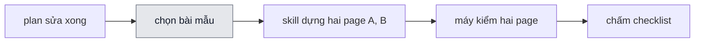
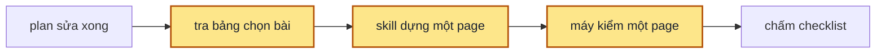

> **Nối tiếp:** [007](007-design-uiux-bai-mau-dat-chuan.md) dựng bốn bài mẫu cố định để chạy thử skill. Plan này chọn một bài làm bài mặc định khi nghiệm thu, và chỉ ra khi nào dùng bài khác.

## 1. Problem

Mỗi plan của skill design-uiux xong phần sửa thì nghiệm thu bằng một lượt chạy skill thật trên một bài mẫu. Bài hay
được dùng là màn Đơn hàng: skill dựng hai page, mỗi page một agent con, rồi máy kiểm chạy gần 500 tổ hợp. Một lượt như
vậy mất khoảng 34 phút và tốn nhiều token. Lượt chạy một page chỉ mất khoảng 9 phút. Plan chỉ sửa một luật vẫn phải
chờ cả lượt dài, vì chưa có quy ước dùng bài nào.

## 2. Goal

- Plan không chạm phần nào bài mặc định thiếu thì nghiệm thu bằng bài mặc định: một màn mới, skill dựng một page.
- Bài mặc định đi đường "dự án không có design system": chat in danh sách design của getdesign, skill tự chọn một bộ.
- Khi đề một màn xin một phương án, skill dựng đúng một page và nói lý do trong chat.
- Đường "đề ghi sẵn design của getdesign" vẫn có một bài mẫu kiểm.
- Người viết plan tra được một bảng: plan chạm phần nào của skill thì nghiệm thu bằng bài nào.

**Ngoài scope:** dừng lượt chạy ở bước gate cần; máy kiểm chạy nhanh hơn; đề một page cho bài màn Đơn hàng; gom nhiều
plan vào một lượt chạy.

## 3. Mental model

**Bây giờ chạy thế nào** — Plan sửa xong thì người làm chọn một bài mẫu, thường là màn Đơn hàng vì bài đó có nhiều thứ
nhất. Một agent chạy skill trên đề của bài: đọc dự án, viết brief, gọi hai agent con dựng hai phương án A và B, chạy
máy kiểm trên cả hai page, sửa lỗi, kiểm lại. Một agent khác chấm theo checklist của bài. Người làm chờ hết lượt mới
tick được gate.

**Sau plan chạy thế nào** — Cùng đường đó, chỉ khác bước chọn bài. Người làm tra bảng chọn bài: plan không chạm phần
nào trong bảng thì dùng bài mặc định, một màn lịch hẹn phòng khám. Đề bài này xin một phương án, nên skill dựng một
page và máy kiểm chỉ chạy một page. Đề không ghi design, nên skill in danh sách design rồi tự chọn một bộ, đúng đường
người dùng không có design system hay gặp nhất. Plan chạm phần bài mặc định thiếu, như đọc dự án có sẵn hay hỏi khi đề
mơ hồ, thì bảng chỉ ra bài khác.

**Hành vi đổi ra sao**

| #     | Tình huống | Bây giờ | Sau plan |
| ----- | ---------- | ------- | -------- |
| `BH1` | Plan chỉ sửa một luật dựng page, cần nghiệm thu | người làm chạy bài màn Đơn hàng, hai page, khoảng 34 phút | người làm chạy bài mặc định, một page |
| `BH2` | Người dùng gõ đề một màn và xin một phương án | skill không có luật cho trường hợp này, có thể vẫn dựng A và B | skill dựng một page, chat có dòng "Đề xin một phương án." |
| `BH3` | Chạy bài mặc định | đề ghi sẵn design `linear.app`, chat không in danh sách design | chat in danh sách design, skill tự chọn một bộ |
| `BH4` | Chạy bài luồng onboarding | chat in danh sách design, skill tự chọn | skill dùng design `linear.app` ghi trong đề, chat không in danh sách |
| `BH5` | Plan chạm phần bài mặc định không có (đọc dự án, hỏi khi đề mơ hồ, A/B, luồng, góp ý) | không có chỗ tra, người làm tự đoán bài | bảng chọn bài chỉ đúng bài cần chạy |

**Không đụng:** shell của page, máy kiểm, khuôn brief, bài màn Đơn hàng và bài đề mơ hồ.

---

## 5. Decisions

**Ai quyết:** 🤖 = agent tự quyết, chưa hỏi ai — **chỗ người duyệt phải soi** · 👤 = user chốt lúc bàn (luật 22).

### D0 👤 — Bài 04 là bài mặc định khi nghiệm thu plan

**Lý do:** một page là lượt chạy ngắn nhất còn đi đủ sáu bước của skill: lượt `063` mất 8 phút 41 giây, lượt `059`
của bài 01 mất khoảng 34 phút. → DS2

### D1 👤 — Đề bài 04 xin một phương án

**Lý do:** số page quyết thời gian chạy: mỗi page thêm một agent con và một lượt `check.mjs`. → DS1

### D2 👤 — Đề bài 04 không chỉ định design

**Lý do:** người dùng không có design system là đường hay gặp nhất, bài mặc định nên đi đường đó. → DS1
**Phương án đã loại:** giữ `linear.app` cho chạy ổn định giữa các lượt — loại vì đường đó ít gặp hơn ở người dùng thật.

### D3 🤖 — Bài 02 nhận lệnh `npx getdesign@latest add linear.app` trong đề

**Lý do:** bỏ `linear.app` khỏi bài 04 thì không bài nào kiểm đường "đề chỉ định design" (`F3.1` ở plan 010). Bài 02 là
luồng ba màn, chỉ định sẵn design còn bớt một bước cho bài dài nhất. → DS1

### D4 👤 — Plan nghiệm thu bằng bài nhỏ nhất có đầu vào chạm phần plan đổi

**Lý do:** bài nhỏ mà thiếu đầu vào thì lượt chạy không chạm luật vừa sửa, ví dụ luật `UI6` cần design system đổ bóng
cho card, chỉ bài 01 có. Plan dùng bài khác bài 04 thì ghi lý do cạnh lượt chạy. → DS2

### D5 🤖 — Skill có yêu cầu `F1.19`: đề một màn xin một phương án thì dựng một page

**Lý do:** SKILL.md Bước 3 chỉ có ba trường hợp (còn ≥ 2 hướng, đề xin ≥ 3, còn đúng 1); bài 04 xin một phương án mà
không có luật đứng sau thì kết quả tuỳ agent. → DS3
**Phương án đã loại:** dặn riêng người chạy dựng một page — loại vì người chạy làm khác skill, lượt chạy không đo skill.

### D6 🤖 — Bảng chọn bài nằm ở `samples/README.md`; CLAUDE.md có một câu trỏ về đó

**Lý do:** bảng gắn với bốn bài của design-uiux; CLAUDE.md giữ luật chung cho mọi skill có bài mẫu. → DS2

## 6. Design

### DS1 — Đề và checklist bài mẫu

| Bài | Phần | Hiện có | Sau plan |
| --- | ---- | ------- | -------- |
| 04 | tiêu đề, khía cạnh | "Một màn mới, chạy nhanh"; đề chỉ định `linear.app`, dựng A và B | "Một màn mới, bài mặc định"; không design system, đề xin một phương án |
| 04 | đề | dòng 1 có `Design system: npx getdesign@latest add linear.app` | dòng 1 bỏ lệnh getdesign, thêm câu `Chỉ cần một phương án.` |
| 04 | checklist | "Dòng `Đọc:` nhắc `linear.app`. Chat không in danh sách" · "Có 2 page A và B" | "Chat in danh sách design của getdesign, rồi tự chọn một bộ. `tokens.js` ghi nguồn `getdesign <tên bộ>`" · "Có đúng 1 page, chat có dòng `Đề xin một phương án.`" |
| 02 | khía cạnh, đầu vào | không design system, in danh sách và tự chọn | đề ghi sẵn `linear.app`: không in danh sách, không hỏi design |
| 02 | đề | không có lệnh getdesign | dòng 1 thêm `Design system: npx getdesign@latest add linear.app` |
| 02 | checklist | "Chat in danh sách design của getdesign, rồi tự chọn một bộ…" | "Dòng `Đọc:` đầu chat nhắc `linear.app`. Chat không in danh sách design. `tokens.js` ghi nguồn `getdesign linear.app`." |

### DS2 — Bảng chọn bài trong `samples/README.md`

Bài 04 là bài mặc định. Plan chạm một dòng dưới đây thì thêm (hay thay bằng) bài ở cột phải:

| Plan chạm | Bài 04 thiếu | Dùng bài |
| --------- | ------------ | -------- |
| đọc design system, component, bề rộng trang của dự án (Bước 1); luật UI theo design system | không có `project/` | 01 |
| hỏi khi đề mơ hồ (Bước 2) | đề đủ rõ | 03 |
| A/B: tìm, chọn, đặt tên phương án (Bước 3) | đề xin một phương án | 01 |
| luồng nhiều màn | một màn | 02 |
| đề ghi sẵn design của getdesign | đề không ghi design | 02 |
| vòng góp ý | không có góp ý | 01 |
| luật máy kiểm so giữa các page | một page | 01 |

CLAUDE.md, mục "Chạy thử skill", thêm câu: "Skill có bài mẫu thì plan nghiệm thu bằng bài nhỏ nhất có đầu vào chạm
phần plan đổi. Nếu dùng bài khác bài mặc định, thì plan ghi lý do. Bảng chọn bài nằm trong `samples/README.md` của
skill."

### DS3 — Yêu cầu `F1.19`

| File | Thêm |
| ---- | ---- |
| `SPEC.md` mục F1 | `F1.19` Nếu đề một màn xin một phương án, thì agent dựng một page và nói lý do trong chat. |
| `SPEC.md` technical design của Bước 3 | dòng **Scope:** thêm `F1.19` |
| `SKILL.md` bảng "Sau ba phép thử" | dòng `đề xin một phương án` · `một page A` · `một dòng Đề xin một phương án.` |
| `SKILL.md` mục "Một màn: hai phương án A và B" | dòng `spec:` thêm `F1.19` |
| `PLANS.md` | mục `013`, bảng `F1.19 · new` |

## 7. Phases

**Legend:** 🤖 = agent tự kiểm được (chạy lệnh, test, grep) · 👤 = cần người kiểm (số đo thật, UI, hạ tầng).

- [x] 👤 plan này được duyệt — 2026-10-09, người dùng: "lưu plan và triển khai"

### Phase 1 — skill dựng một page khi đề xin một phương án

**Goal:** đề một màn xin một phương án thì SKILL.md bảo agent dựng một page.
**Cover:** DS3

**Actions:**

- [x] 🤖 `SPEC.md`: thêm `F1.19`, thêm mã vào dòng **Scope:** của technical design Bước 3 (D5) — 2026-10-09: thêm `F1.19` dưới `F1.14`; mục 3.5 Agent đã ghi scope `F1` nên không sửa dòng **Scope:**
- [x] 🤖 `SKILL.md`: thêm dòng bảng "Sau ba phép thử", thêm `F1.19` vào dòng `spec:` của mục (D5) — 2026-10-09: dòng bảng, `spec:` của "Một màn" và "Bước 6", Bước 6 mục 8 nhắc lại `Đề xin một phương án.`
- [x] 🤖 `PLANS.md`: mục `013` ở phần Plan, status `approved`, bảng `F1.19 · new` — 2026-10-09

**Gate:**

- [x] 🤖 `node scripts/spec-check.mjs skills/design-uiux` không báo `F1.19` thiếu mục SKILL.md hay thiếu plan — DS3 — 2026-10-09: `✓ skills/design-uiux · 56 sub-scope · PLANS.md: 0 draft · 10 approved · 2 done · 2 new`
- [x] 🤖 `patch --dry-run` cho `faults/L1`–`L7` trên SKILL.md mới: patch áp được trước plan vẫn áp được — 2026-10-09: L1 L2 L4 L6 L7 áp được; L3, L5 không áp được, đã hỏng từ trước plan này (ghi ở Gate Phase 5 của 011)

### Phase 2 — bài mẫu và bảng chọn bài

**Goal:** người viết plan mở `samples/README.md` thấy bài mặc định và bảng chọn bài; bài 04, bài 02 có đề mới.
**Cover:** DS1 · DS2

**Actions:**

- [x] 🤖 `samples/04-quick-screen/sample.md`: khía cạnh, đầu vào, đề, checklist theo DS1 (D1 · D2) — 2026-10-09: đề thêm `Chỉ cần một phương án.`, bỏ lệnh getdesign; checklist 5 mục
- [x] 🤖 `samples/02-onboarding-flow/sample.md`: khía cạnh, đầu vào, đề, checklist theo DS1 (D3) — 2026-10-09: đề thêm `Design system: npx getdesign@latest add linear.app`; mục L2 nhắm (màn Đăng ký có trạng thái riêng) giữ nguyên
- [x] 🤖 `samples/README.md`: bảng bài theo DS1, mục "Bài mặc định" với bảng chọn bài DS2 (D0 · D4 · D6) — 2026-10-09
- [x] 🤖 `CLAUDE.md` mục "Chạy thử skill": câu theo DS2 (D6) — 2026-10-09
- [x] 🤖 `SPEC.md` bảng file: dòng `samples/` nói bài 04 là bài mặc định — 2026-10-09

**Gate:**

- [x] 🤖 `node skills/design-uiux/samples/lint.mjs` exit 0 — DS1 — 2026-10-09: `✓ 4 bài · 24 mục checklist`
- [x] 🤖 `samples/README.md` có bảng chọn bài đủ 7 dòng của DS2; `CLAUDE.md` có câu trỏ về bảng — DS2 — 2026-10-09: bảng 7 dòng; `CLAUDE.md` dòng 174

### Phase 3 — nghiệm thu

**Goal:** mỗi bullet §2 có một lượt chạy thật, kết quả ghi lại cạnh ô tick.
**Cover:** —

**Actions:**

- [x] 🤖 chạy bài 04 `--auto`: `prepare.mjs 04-quick-screen --slug nghiem-thu-013`, đo thời gian từ lúc gọi skill tới lúc giao — 2026-10-09, `065-sample-04-quick-screen-nghiem-thu-013`, bản chụp skill, 880 giây
- [x] 🤖 chạy bài 02 `--auto`: `prepare.mjs 02-onboarding-flow --slug nghiem-thu-013`, dừng khi đã có `tokens.js` và dòng `Đọc:` — 2026-10-09, `066-sample-02-onboarding-flow-nghiem-thu-013`, bản chụp skill, 45 giây

**Gate** — một dòng ứng một bullet §2:

- [x] 🤖 §2 bullet 1: lượt bài 04 có đúng 1 page trong `pages.js`, `check.log` dòng cuối `1 page` và `0 lỗi`; ghi thời gian chạy — BH1 — 2026-10-09: `pages.js` 1 page `01-bang-lich-hen.html`; `✓ 1 page · 164 tổ hợp · 0 lỗi`; 880 giây (14 phút 40 giây), dài hơn lượt `063` (8 phút 41 giây) vì chạy `init` hai lần để lấy bề rộng trang và một vòng sửa 14 lỗi kiểm đầy đủ
- [x] 🤖 §2 bullet 2: `chat.md` của lượt bài 04 có khối `Design của getdesign dùng được`; `tokens.js` có `"source":"getdesign <tên>"` — BH3 — 2026-10-09: khối 68 bộ, câu chọn 4 đáp án `cal (Khuyên dùng)` · `intercom` · `notion` · `mintlify`; `"source":"getdesign cal"`
- [x] 🤖 §2 bullet 3: `chat.md` của lượt bài 04 có dòng `Đề xin một phương án.` — BH2 — 2026-10-09: `chat.md` dòng 118 (khối phương án) và 160 (tin giao)
- [x] 🤖 §2 bullet 4: lượt bài 02 có `tokens.js` `"source":"getdesign linear.app"`, `chat.md` không có khối `Design của getdesign dùng được` — BH4 — 2026-10-09: `tokens.js` `"source":"getdesign linear.app"`; `grep -c "Design của getdesign dùng được" chat.md` ra 0; dòng `Đọc:` nêu `getdesign linear.app` theo đề
- [x] 🤖 §2 bullet 5: bảng chọn bài trong `samples/README.md` chỉ bài 01 cho plan 012 (luật UI theo design system) — BH5 — 2026-10-09: dòng "đọc design system… luật UI theo design system" chỉ bài 01
- [x] 🤖 `python3 ~/.claude/skills/write-plan/verify.py .plan/013-design-uiux-bai-mau-mac-dinh.md` — 0 ERROR — 2026-10-09: `0 ERROR · 1 WARN` (tên design `linear.app` ở §3)
