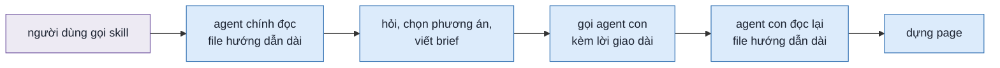
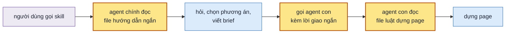

> **Phụ thuộc:** [011](011-design-uiux-page-dang-dung-de-hieu.md) đã sửa xong skill, chỉ còn lượt nghiệm thu; [013](013-design-uiux-bai-mau-mac-dinh.md) đã `done`. Plan này không đổi hành vi skill, nên chạy được trước khi 011 `done`. Lượt mốc để so là lượt nghiệm thu đã chạy của 012 (bài 01) và 013 (bài 04).

## 1. Problem

SKILL.md của skill thiết kế UI dài 800 dòng. Một lần đọc file của agent dừng ở khoảng dòng 517, vì file vượt giới hạn
một lượt đọc. Agent con được giao dựng page chỉ cần hai mục, mà hai mục đó nằm ở dòng 558–720, đúng phần bị cắt. Agent
con còn phải đọc qua phần hỏi người dùng và chọn phương án, là việc của agent chính. Vài luật chỉ nằm trong lời giao cho
agent con. Khi chỉ có một page, agent chính tự dựng page đó và không đọc thấy các luật này. Khoảng một phần tư file là
chữ cho người sửa skill, hoặc nhắc lại luật đã nói ở chỗ khác.

## 2. Goal

- Agent dựng page, dù là agent con hay agent chính, đọc trọn luật dựng page trong một lần đọc file. File đó không có các
  bước hỏi người dùng và chọn phương án.
- Luật dựng page nằm ở đúng một chỗ. Agent chính tự dựng một page cũng theo đủ bộ luật agent con nhận.
- Lời giao cho agent con chỉ có chỗ phải đọc và thông tin riêng của page đó.
- SKILL.md còn khoảng 400–450 dòng, không còn phần chỉ người sửa shell hay sửa skill cần.
- Skill vẫn chạy như trước: bài mẫu đạt checklist như lượt mốc, máy kiểm báo 0 lỗi. Mọi yêu cầu của SPEC còn mục thực
  thi. Mỗi luật không còn chữ trong bộ file mới đều do cố ý bỏ vì đã nói ở chỗ khác.

**Ngoài scope:** sửa nội dung luật (việc của PQ-03); sửa hai file luật UX và luật UI; đổi hành vi của skill hay của shell.

## 3. Mental model

**Bây giờ chạy thế nào** — Người dùng gọi skill. Agent chính đọc một file hướng dẫn dài, hỏi người dùng nếu cần, chọn
phương án, tạo các page trống, viết brief. Rồi nó gọi mỗi page một agent con, kèm một lời giao dài khoảng 20 dòng chép
lại nhiều luật dựng page. Agent con mở lại chính file hướng dẫn dài đó. Lần đọc đầu bị cắt giữa chừng, nên nó phải đọc
thêm lần nữa mới tới phần luật dựng page. Khi chỉ có một page, agent chính tự dựng theo phần luật đó, không qua lời giao.



**Sau plan chạy thế nào** — Cùng đường đó. File hướng dẫn của agent chính chỉ còn việc của agent chính. Luật dựng page
nằm ở một file riêng, ngắn. Agent con đọc trọn file đó trong một lần, cùng brief. Lời giao chỉ còn khoảng 7 dòng: đọc
những file nào, page này là phương án hay màn nào, bố cục, bản phác. Khi chỉ có một page, agent chính đọc cùng file luật
dựng page đó. Khi dự án không có design system, agent chính đọc thêm một file nhỏ về cách chọn design của getdesign.



**Hành vi đổi ra sao**

| #     | Tình huống | Bây giờ | Sau plan |
| ----- | ---------- | ------- | -------- |
| `BH1` | agent con bắt đầu dựng page | đọc file hướng dẫn hai lần vì lần đầu bị cắt; đọc qua cả phần hỏi và chọn phương án | đọc file luật dựng page một lần, trọn file |
| `BH2` | chỉ có một page, agent chính tự dựng | không thấy luật chỉ nằm trong lời giao: cặp màu ngoài bảng thì báo lại, khối ngoài bảng thì báo lại | thấy đủ luật như agent con |
| `BH3` | agent chính đánh dấu xong bước chuẩn bị của mọi page | gõ một vòng lặp qua từng page | gõ một lệnh |
| `BH4` | dự án không có design system | đọc cách chọn design ngay trong file hướng dẫn | đọc file chọn design khi lệnh liệt kê design chạy được; người dùng thấy cùng danh sách, cùng câu hỏi |
| `BH5` | phiên làm việc không cần thiết kế | phần mô tả skill dài 12 dòng nằm sẵn trong mọi phiên | phần mô tả còn 3–4 dòng; skill vẫn được gọi khi người dùng nói "thiết kế màn X", "prototype" |

**Không đụng:** hai file luật UX và luật UI, shell, máy kiểm page, khuôn page và khuôn brief.

---

## 5. Decisions

**Ai quyết:** 🤖 = agent tự quyết, chưa hỏi ai — **chỗ người duyệt phải soi** · 👤 = user chốt lúc bàn (luật 22).

### D0 👤 — Tách SKILL.md theo người đọc: SKILL.md cho agent chính, `references/build-page.md` cho agent dựng page

**Lý do:** agent con chỉ cần luật dựng page; agent chính chỉ cần luật đó khi tự dựng một page. Một file cho cả hai thì
cả hai cùng nạp phần không dùng, và file vượt giới hạn một lượt đọc → DS2.

### D1 🤖 — SKILL.md khai các file nó kéo theo bằng `<!-- spec-files: … -->`; `spec-check` soát các file đó như SKILL.md

**Lý do:** luật "agent chạy skill chỉ đọc SKILL.md" có để yêu cầu nào cũng nằm ở chỗ agent đọc. File được SKILL.md bắt
đọc ở một bước cũng là chỗ agent đọc → DS1.
**Phương án đã loại:** coi mọi file trong `references/` là phần của SKILL.md — `ux-principles.md`, `ui-principles.md`
bị đòi dòng `spec:` cho từng mục luật.

### D2 🤖 — Luật chỉ có trong lời giao chuyển vào `build-page.md`; lời giao chỉ còn chỗ đọc và phần riêng của page

**Lý do:** luật nằm hai nơi thì sửa một bên quên bên kia; luật chỉ nằm trong lời giao thì agent chính tự dựng không
thấy → DS3.

### D3 🤖 — Phần của người sửa skill chuyển sang `references/shell-principles.md`; hình mermaid bỏ khỏi SKILL.md

**Lý do:** agent dựng page không cần biết shell ẩn chữ ở khổ nào hay lệnh test shell. SPEC mục 3.5 đã có hình luồng
agent; hình trong SKILL.md phần lớn là dòng định màu, agent đọc chữ → DS4.

### D4 🤖 — Luật máy kiểm bắt được thì SKILL.md giữ một dòng; chỉ rút khi thông báo lỗi của `check.mjs` đã ghi cách sửa

**Lý do:** agent sửa theo lỗi lệnh in ra; lý do dài trong SKILL.md là chữ nói hai lần. Luật mà thông báo lỗi chưa nói
cách sửa thì giữ nguyên chữ → DS4.

### D5 🤖 — `new-design.mjs progress <thư mục> --prepared --all` đánh dấu bước chuẩn bị của mọi page

**Lý do:** vòng `for` trong SKILL.md là chỗ agent dễ gõ sai đường dẫn; một cờ thay được và có test → DS5.

### D6 🤖 — Mục chọn design của getdesign chuyển sang `references/getdesign.md`, agent chính đọc khi `designs` thoát mã 0

**Lý do:** nhánh dài khoảng 35 dòng, chỉ chạy khi dự án không có design system, điều kiện rõ. "Vòng sau" ngắn và lần
nào cũng dùng nên giữ trong SKILL.md → DS2.

### D7 🤖 — Description còn 3–4 dòng, giữ mọi cụm kích hoạt của description cũ

**Lý do:** description nằm trong mọi phiên; chi tiết cơ chế (data-panel, tiến độ, getdesign) đã có trong thân SKILL.md.

### D8 🤖 — Không đổi chữ yêu cầu nào của SPEC; PLANS.md ghi `F1.3 · fix`, SPEC chỉ sửa technical design

**Lý do:** plan đổi chỗ đặt luật, không đổi skill làm gì. Riêng `F1.3` (một cách xử lý cặp màu cho mọi page) đang làm
chưa đúng khi agent chính tự dựng một page.

## 6. Design

### DS1 — Khai file trong `spec-check`

Dòng khai, ngay dưới `# design-uiux` của SKILL.md:

```markdown
<!-- spec-files: references/build-page.md references/getdesign.md -->
```

| Ca | `spec-check` báo |
| -- | ---------------- |
| file khai không có | `SKILL.md:<dòng> khai <file>, mà file không có` |
| mục `##` / `###` của file khai thiếu dòng `spec:` | `<file>:<dòng> mục "<tên>" chưa có dòng spec: ngay dưới tiêu đề` |
| sub-scope chỉ gắn ở file không khai | `<mã> chưa có trong SKILL.md (chỉ có ở <file>:<dòng>)` — như hiện tại |
| `spec: —` ở file khai | hợp lệ, như SKILL.md |
| `spec: —` ở file không khai | lỗi, như hiện tại |

Sub-scope được tính là có mục thực thi khi được gắn ở SKILL.md hay ở một file khai. `--matrix` ghi mục kèm tên file khi
mục nằm ở file khai (`build-page.md › Bước 5`).

### DS2 — Cấu trúc file

| File | Ai đọc, lúc nào | Gồm |
| ---- | --------------- | --- |
| `SKILL.md` | agent chính, lúc skill được gọi | mental model bằng chữ; bảng file; lệnh; tên các khối điều khiển; `--auto`; bước 1–3; bước 4 phần chuẩn bị và gọi agent con; bước 6; vòng sau; bẫy của agent chính |
| `references/build-page.md` | agent con khi được gọi; agent chính khi thư mục một page | sáu bước dựng; đánh dấu trong page; `window.DESIGN`; trạng thái và dữ liệu giả; page của luồng; viết HTML; luật lấy từ lời giao; kiểm nhanh và kiểm đầy đủ; tự kiểm và cách trả về; bẫy khi viết page |
| `references/getdesign.md` | agent chính, khi `designs` thoát mã 0 | in danh sách; câu chọn design; cách chọn bốn design; tên gõ sai |
| `references/shell-principles.md` | người sửa shell | thêm: chi tiết hiển thị của các khối điều khiển; lệnh `shell`, `test-shell`, `test-progress`; bẫy khi sửa shell |

Mỗi file trong ba file agent đọc: dưới 40 KB, đọc trọn trong một lần đọc. SKILL.md ≤ 450 dòng, `build-page.md` ≤ 260
dòng.

### DS3 — Lời giao cho agent con

```text
Dựng page <NN-slug.html> trong thư mục design <$D>: phương án <A · tên> (hay màn <n · tên> của luồng).
Đọc hết, trước khi viết: <$SKILL>/references/build-page.md, <$SKILL>/references/ux-principles.md,
<$SKILL>/references/ui-principles.md, <$D>/brief.md.
Bố cục: <…>. Tiện cho: <…>.          (luồng: Để làm gì: <…>, theo dòng của màn trong "## Luồng")
Bản phác:
<bản phác đã in cho người dùng>
```

Mọi luật khác của lời giao hiện có nằm ở `build-page.md`: progress từng bước, `--doing`, bị gọi lại, chỉ sửa đúng file,
`variables` theo bảng chung, `data-block` theo bảng "Khối" và báo lại khối ngoài bảng, cặp màu theo bảng và báo lại cặp
ngoài bảng, nút sang màn và key `form.*`, bước kiểm đầy đủ, nội dung trả về.

### DS4 — Ánh xạ mục cũ → chỗ mới

| Mục SKILL.md hiện có | Đi đâu |
| -------------------- | ------ |
| frontmatter `description` | giữ, rút theo D7 |
| Mental model: hình mermaid | bỏ (SPEC 3.5 có hình); thay bằng 6 dòng các bước |
| Mental model: chữ, bảng file, lệnh | giữ; lệnh `shell`, `test-shell`, `test-progress` → `shell-principles.md` |
| Các khối điều khiển | giữ bảng tên khối và các dòng page cần (`$store.design`, `next()` · `prev()`, `form`, URL); chi tiết hiển thị, tự tải lại, màu shell, sửa shell → `shell-principles.md` |
| Cờ `--auto` | giữ |
| Bước 1 | giữ |
| Bước 2 | giữ; mục "Chọn design của getdesign" → `getdesign.md`, để lại một dòng trỏ |
| Bước 3 (một màn, một luồng) | giữ; luật chữ của `--option` · `--layout` · `--good-for` chỉ ở đây |
| Bước 4 · Agent chính chuẩn bị | giữ; bảng "page điền từ cờ" thành một câu; luật ba cờ trỏ về Bước 3; vòng `for` → `--prepared --all`; xử lý lỗi `init --getdesign` giữ |
| Bước 4 · Gọi agent con | giữ; lời giao theo DS3 |
| Bước 4 · Dựng một page theo bước | → `build-page.md` |
| Bước 5 | → `build-page.md`; danh sách "`check.mjs` kiểm gì" rút theo D4; SKILL.md giữ lần kiểm cả thư mục của agent chính |
| Bước 6, Vòng sau | giữ |
| Bẫy đã gặp | mỗi dòng: bỏ khi luật đã nói ở mục khác; bẫy của shell → `shell-principles.md`; bẫy khi viết page → `build-page.md`; còn lại giữ |

### DS5 — Cờ `--prepared --all`

```bash
node $SKILL/scripts/new-design.mjs progress <thư mục design> --prepared --all
```

- Lệnh đánh dấu bước chuẩn bị cho mọi `NN-*.html` có `NN-*.progress.js` trong thư mục, theo thứ tự `pages.js`.
- Page đã qua bước chuẩn bị thì lệnh bỏ qua page đó, không báo lỗi.
- `--all` đi với cờ khác ngoài `--prepared`, hay đi cùng tên file, thì lệnh báo lỗi, exit 1.
- stdout mỗi page một dòng như `--prepared` cho một page.

## 7. Phases

**Legend:** 🤖 = agent tự kiểm được (chạy lệnh, test, grep) · 👤 = cần người kiểm (số đo thật, UI, hạ tầng).

- [x] 👤 plan này được duyệt — 2026-10-09, người dùng: "lưu lại plan và triển khai"

### Phase 0 — ghi SPEC, PLANS.md và lượt mốc

**Goal:** SPEC tả bộ file mới; PLANS.md có mục 014; có lượt mốc đã chấm để so.
**Cover:** —

**Actions:**

- [x] 🤖 `PLANS.md`: mục `014` ở phần Plan, status `approved`, bảng `F1.3 · fix` (D8) — 2026-10-09
- [x] 🤖 `SPEC.md` mục 3.5: agent con đọc `build-page.md`; agent chính tự dựng một page cũng đọc file đó (D0 · D2) — 2026-10-09
- [x] 🤖 `SPEC.md` bảng file (mục 5) và bảng đầu mục 3: thêm `build-page.md`, `getdesign.md`; dòng `SKILL.md` nói khai file kéo theo (D1) — 2026-10-09; dòng `shell-principles.md`, `samples/faults/` sửa theo
- [x] 🤖 `SPEC.md` mục 4: lý do tách file theo người đọc (D0) — 2026-10-09: hai dòng ở bảng "Kiểm"
- [x] 🤖 chấm lượt mốc `064-sample-01-orders-screen-nghiem-thu-012` và `065-sample-04-quick-screen-nghiem-thu-013` theo "Chấm" của `samples/README.md`, ra `result.md` — 2026-10-09, hai agent chấm; bản SKILL.md trước plan chép ở `.test/design-uiux/067-nghiem-thu-014/SKILL.before.md`

**Gate:**

- [x] 🤖 `node scripts/spec-check.mjs skills/design-uiux` ✓ — 2026-10-09: `✓ skills/design-uiux · 56 sub-scope`
- [x] 🤖 hai lượt mốc có `result.md`, ghi số mục đạt — 2026-10-09: `064` bài 01 6/6 (không chạy góp ý), `065` bài 04 5/5

### Phase 1 — `spec-check` soát các file SKILL.md khai

**Goal:** khai một file trong `spec-files` thì `spec-check` soát file đó như SKILL.md.
**Cover:** DS1

**Actions:**

- [x] 🤖 `scripts/spec-check.mjs`: đọc dòng `spec-files`, soát các file khai theo DS1 (D1) — 2026-10-09; `--matrix` ghi `<file> › <mục>`
- [x] 🤖 `CLAUDE.md` mục "SKILL.md theo đúng SPEC": SKILL.md và các file nó khai ở `spec-files` (D1) — 2026-10-09: mục SKILL.md, mục "SKILL.md theo đúng SPEC", mục "Lệnh soát"

**Gate:**

- [x] 🤖 `spec-check` trên skill hiện có vẫn ✓, cùng số sub-scope — 2026-10-09: 56 sub-scope trước và sau
- [x] 🤖 fixture tạm: file khai không có · mục thiếu `spec:` trong file khai · mã chỉ gắn ở file khai — ca 1 và 2 báo lỗi, ca 3 tính là có mục thực thi — DS1 — 2026-10-09: `SKILL.md:20 khai references/khong-co.md, mà file không có`; `references/fx.md:9 mục "Mục thiếu" chưa có dòng spec:`; `F1.19` chỉ gắn ở `fx.md` không bị báo; `spec: —` ở file không khai vẫn báo lỗi

### Phase 2 — tách `build-page.md`, lời giao mới

**Goal:** agent dựng page đọc một file luật ngắn; lời giao chỉ còn phần riêng của page.
**Cover:** DS3

**Actions:**

- [x] 🤖 tạo `references/build-page.md` từ "Dựng một page theo bước" và "Bước 5", thêm các luật chỉ có trong lời giao (D0 · D2) — 2026-10-09, 221 dòng
- [x] 🤖 SKILL.md: lời giao theo DS3; mục "Gọi agent con" và câu "thư mục một page" trỏ `build-page.md`; dòng `spec-files` (D1 · D2) — 2026-10-09
- [x] 🤖 `ux-principles.md`, `ui-principles.md`: câu trỏ "Bước 5 của SKILL.md" thành `build-page.md` — 2026-10-09; thêm comment `new-design.mjs:261`

**Gate:**

- [x] 🤖 `spec-check` ✓ — 2026-10-09
- [x] 🤖 mọi câu trong lời giao hiện có thuộc một trong hai: có trong `build-page.md`, hay là phần riêng của page trong DS3 — DS3 — 2026-10-09: agent so luật không báo câu nào của lời giao cũ bị mất

### Phase 3 — cắt chữ thừa, cờ `--all`, file chọn design

**Goal:** SKILL.md ≤ 450 dòng, không còn phần của người sửa skill; bài mẫu gài lỗi vẫn dùng được.
**Cover:** DS2 · DS4 · DS5

**Actions:**

- [x] 🤖 `scripts/new-design.mjs`: cờ `--all` theo DS5; `scripts/test-progress.mjs`: ca `--all` (D5) — 2026-10-09; `parseArgs` coi cờ đứng trước cờ khác là cờ không giá trị
- [x] 🤖 SKILL.md theo DS4: bỏ hình, chuyển phần shell, dọn "Bẫy đã gặp", gộp luật ba cờ, rút bảng điền cờ, `--prepared --all` (D3 · D4 · D5) — 2026-10-09; bẫy còn lại (mở thẳng `templates/`) thành một dòng ở Bước 4
- [x] 🤖 tạo `references/getdesign.md`; SKILL.md bước 1, bước 2 trỏ tới file đó (D6) — 2026-10-09, 46 dòng
- [x] 🤖 `shell-principles.md`: nhận phần shell; câu trỏ "Các khối điều khiển của SKILL.md" sửa theo (D3) — 2026-10-09: mục "Lệnh khi sửa shell", "Bẫy khi sửa shell"; câu trỏ vẫn đúng vì SKILL.md giữ mục đó
- [x] 🤖 rút description (D7) — 2026-10-09: 12 dòng còn 5
- [x] 🤖 `samples/faults/L1`–`L7` viết lại cho bộ file mới; lệnh `patch` trong `samples/README.md` áp cho cả thư mục skill — 2026-10-09: `patch -d $L/design-uiux -p0`; L2 sửa `references/build-page.md`

**Gate:**

- [x] 🤖 `spec-check` ✓; `node skills/design-uiux/scripts/test-progress.mjs` sạch — DS5 — 2026-10-09: 28 ✓ 0 ✗; `test-new-design.mjs` 6/6; `test-shell.mjs` exit 0
- [ ] 🤖 `wc -l`: SKILL.md ≤ 450, `build-page.md` ≤ 260; ba file agent đọc mỗi file < 40 KB — DS2
  Chưa đạt — 2026-10-09: SKILL.md 507 dòng, 43 KB; `build-page.md` 221 dòng, 17,7 KB; `getdesign.md` 46 dòng. Read trả về trọn SKILL.md và `build-page.md` (agent so luật xác nhận), nên mục đích "đọc trọn một lượt" đạt. Phần còn lại của SKILL.md là luật agent chính dùng; rút thêm cần chuyển cách điền `brief.md` sang khuôn, ngoài DS4. Chờ người dùng chọn: nhận 507 dòng hay mở việc mới.
- [x] 🤖 một agent mới, không biết plan, so SKILL.md ở `HEAD` với bộ file mới, liệt kê luật không còn chữ; mỗi dòng nó báo có đích "bỏ" trong DS4 — DS4 — 2026-10-09: so với `SKILL.before.md` (bản trước plan, `HEAD` còn thiếu 011–013). 15 dòng: 1 chỗ hở thật (lý do `pageWidth` không ai ghi vào brief) đã sửa ở `build-page.md` mục Trả về và SKILL.md Bước 5; 3 dòng yếu đi đã viết lại (`--title` luôn là…, `:style="biến"`, exit 2 `skill lệch`); dòng lệnh `check.mjs [--quick]` mâu thuẫn đã tách; 10 dòng còn lại là mô tả `check.mjs` hay shell, đúng đích "rút theo D4" và "→ shell-principles.md"
- [x] 🤖 mỗi patch `L1`–`L7` áp được bằng `patch --dry-run` trên bản chụp skill mới — 2026-10-09: 7/7; L3, L5 hỏng từ trước plan này, giờ áp được
- [x] 🤖 mọi cụm trong ngoặc kép của description cũ còn trong description mới — BH5 — 2026-10-09: 10/10

### Phase 4 — nghiệm thu

**Goal:** mỗi bullet §2 có một lượt chạy thật hay một lệnh, kết quả ghi cạnh ô tick.
**Cover:** —

**Actions:**

- [ ] 🤖 chạy bài 04 `--auto` trên bản chụp skill mới: `prepare.mjs 04-quick-screen --slug nghiem-thu-014`, chấm ra `result.md`
- [ ] 🤖 chạy bài 01 `--auto` trên bản chụp skill mới: `prepare.mjs 01-orders-screen --slug nghiem-thu-014`, chấm ra `result.md`

**Gate** — một dòng ứng một bullet §2:

- [ ] 🤖 §2 bullet 1: `subagent-*.md` hay transcript agent con của lượt bài 01 đọc `build-page.md` một lần, không đọc SKILL.md — BH1
- [ ] 🤖 §2 bullet 2: lượt bài 04 (một page, agent chính tự dựng) có `chat.md` ghi đọc `build-page.md`; luật cặp màu, khối ngoài bảng có trong `build-page.md` — BH2
- [ ] 🤖 §2 bullet 3: lời giao trong `chat.md` của lượt bài 01 theo khuôn DS3; `chat.md` có lệnh `--prepared --all` — BH3
- [ ] 🤖 §2 bullet 4: `wc -l SKILL.md` ≤ 450; SKILL.md không còn `test-shell`, `box-sizing`, `@layer`
- [ ] 🤖 §2 bullet 5: hai lượt mới có số mục đạt bằng lượt mốc (`lint.mjs --compare`), `check.log` dòng cuối `0 lỗi`; lượt bài 04 có danh sách design của getdesign — BH4
- [ ] 🤖 `python3 ~/.claude/skills/write-plan/verify.py .plan/014-design-uiux-rut-gon-skill-md.md` — 0 ERROR
