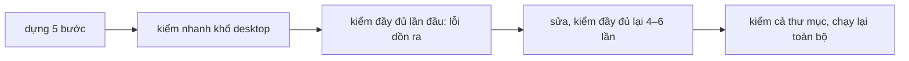
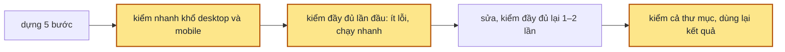

> **Nối tiếp:** [013](013-design-uiux-bai-mau-mac-dinh.md) chọn bài mẫu một page làm bài mặc định để nghiệm thu nhanh, lượt đo khi đó mất 8 phút 41 giây. Plan này giải cái 013 để hở: cùng bài đó giờ chạy 15–24 phút.

## 1. Problem

Bài mẫu mặc định (một màn, một page) chạy từ 9 tới 24 phút, bài màn Đơn hàng (hai page) mất 33 phút; người làm skill
phải chờ chừng đó mới thấy bản hoàn chỉnh. Ba nguyên nhân, đo trên transcript các lượt chạy cũ:

- Một lần kiểm đầy đủ một page mất 85–105 giây khi máy rảnh; cùng page đó, máy kiểm ngày 07/10 kiểm trong 30 giây.
- Kiểm đầy đủ chạy lại nhiều lần mỗi page: page A 4 lần, page B 6 lần, page bài mặc định 5 lần. Lý do: lỗi khổ mobile
  chỉ hiện ở lần kiểm đầy đủ đầu tiên; máy kiểm đọc nhầm bảng preset trong brief thành lỗi mà page không sửa được; page
  đã sạch vẫn được kiểm lại.
- 18 trên 29 agent dựng page tự viết script mở trình duyệt để bấm thử, có lần chạy hỏng vì bắt nhầm nút của toolbar.

## 2. Goal

- Kiểm đầy đủ một page chạy dưới một nửa thời gian lúc trước trên cùng máy, và báo đúng từng dòng lỗi như lúc trước.
- Page và mọi thứ page đọc không đổi thì lần kiểm sau in lại kết quả ngay, không mở trình duyệt.
- Kiểm nhanh sau mỗi bước dựng đo cả khổ desktop và khổ mobile, nên lỗi khổ mobile hiện ở bước gây ra nó.
- Brief còn chỗ trống hay bảng sai thì lệnh đánh dấu chuẩn bị xong từ chối, trước khi page nào được dựng.
- Agent dựng page bấm thử một nút bằng lệnh kiểm nhanh, không tự viết script.
- Mỗi lượt chạy để lại nhật ký trong thư mục design: mở ra biết từng bước dựng của từng page dài bao lâu, máy kiểm
  chiếm bao nhiêu, không cần transcript.

**Ngoài scope:** khung page hiện sớm theo bố cục ngay từ đầu; hạ mức suy nghĩ hay đổi model; lệnh tạo thư mục design
chạy hai lần để lấy bề rộng trang.

## 3. Mental model

**Bây giờ chạy thế nào** — Agent dựng page qua năm bước, mỗi bước kiểm nhanh ở khổ desktop rồi đánh dấu xong. Tới bước
sáu, lần kiểm đầy đủ đầu tiên mới chạy khổ mobile và bấm từng nút, nên lỗi dồn ra một lúc. Agent sửa một ít rồi kiểm đầy
đủ lại, mỗi lần gần hai phút, lặp bốn tới sáu lần. Trong mỗi lần kiểm, máy kiểm mở lại page cho từng nút, chờ cố định
sau mỗi lần rê và bấm, tải lại thư viện từ mạng mỗi lần mở. Xong, agent chính kiểm cả thư mục, chạy lại toàn bộ thêm
một hai lần dù page không đổi.



**Sau plan chạy thế nào** — Cùng đường đó. Kiểm nhanh đo cả khổ mobile, nên lỗi lộ ở bước gây ra nó, khi sửa còn rẻ.
Kiểm đầy đủ chạy hai khổ cùng lúc, chia các cú bấm cho hai tab, chờ tới khi hiệu ứng chạy xong thay vì chờ cố định,
thư viện tải một lần. Page không đổi thì kiểm lại in kết quả cũ ngay, nên kiểm cả thư mục sau khi page vừa sạch không
chạy lại trình duyệt.



**Hành vi đổi ra sao**

| #     | Tình huống | Bây giờ | Sau plan |
| ----- | ---------- | ------- | -------- |
| `BH1` | page có chữ tràn ngang ở khổ mobile | lộ ở lần kiểm đầy đủ đầu tiên, bước sáu | lộ ở lần kiểm nhanh của bước gây ra nó |
| `BH2` | brief có bảng preset ngay dưới bảng nút dữ liệu | mọi lần kiểm đầy đủ báo "thiếu Preset", page không sửa được | không báo |
| `BH3` | brief còn chỗ trống lúc agent chính đánh dấu chuẩn bị xong | các page vẫn sang bước dựng | lệnh từ chối, in chỗ trống, không page nào sang bước dựng |
| `BH4` | kiểm lại page không đổi, hay kiểm cả thư mục ngay sau khi page vừa sạch | chạy lại gần hai phút | in lại kết quả cũ, dòng cuối ghi page dùng lại |
| `BH5` | agent muốn biết bấm nút "Thêm lịch" thì hộp thoại có vỡ không | tự viết script mở trình duyệt | chạy kiểm nhanh có cờ bấm, xem lỗi và ảnh sau cú bấm |
| `BH6` | người làm skill hỏi lượt chạy vừa rồi chậm ở bước nào | gom timeline từ transcript bằng script riêng, chỉ trên máy đã chạy | chạy lệnh đọc nhật ký của thư mục design, ra bảng từng bước của từng page |

**Không đụng:** shell và toolbar của page, cách hỏi và chọn phương án, khuôn page và khuôn brief.

---

## 4. Probe

### P1 — Một lần kiểm đầy đủ tốn thời gian ở lượt nào?

**Biết để làm gì:** lượt tổ hợp chiếm phần lớn thì chia tổ hợp ra nhiều tab; lượt bấm chiếm phần lớn thì sửa cách bấm.
**Cách chạy lại:** `PW_DIR=$TMPDIR/design-uiux-pw node .probe/015-design-uiux-tang-toc/P1-luot-ton-thoi-gian/probe.mjs` (chép `check.mjs` của `before-skill/`, chèn mốc giờ trước mỗi lượt, chạy trên `corpus/c2-mot-page-063`)
**Kết quả:** 105 giây: khởi động, lượt tĩnh, đo 1920px 21,6s · vặn từng nút 13,8s · 122 tổ hợp hai khổ ~11s · lượt bấm 33 nút × 2 khổ ~55s — 2026-10-09, Node 24.14.1, Chrome 141. Bản `check.mjs` của `670ae63` (chưa có lượt bấm, lượt vặn) kiểm cùng page trong 30,3s; shell cũ hay mới đều 84s.

### P2 — Lỗi của lần kiểm đầy đủ đầu tiên nằm ở khổ nào?

**Biết để làm gì:** lỗi phần lớn ở khổ mobile thì kiểm nhanh đo thêm khổ mobile là đáng; ít thì giữ kiểm nhanh một khổ.
**Cách chạy lại:** `node .probe/015-design-uiux-tang-toc/P2-loi-kho-375/probe.mjs` (đọc transcript trong `~/.claude/projects`)
**Kết quả:** 20 agent dựng page, 13 agent có lỗi ở lần đầu, 127 dòng lỗi: 102 dòng có chỗ ở 375px, 84 dòng chỉ ở 375px; 12/13 agent có ít nhất một lỗi chỉ ở 375px — 2026-10-09, `P2-loi-kho-375/probe.log`

### P3 — Chia lượt bấm ra mấy tab thì nhanh nhất mà vẫn ra đúng lỗi?

**Biết để làm gì:** thêm tab không nhanh hơn (máy nghẽn) thì giữ một tab mỗi khổ; nhanh hơn thì chọn số tab nhỏ nhất đạt gần hết mức nhanh.
**Cách chạy lại:** `PW_DIR=$TMPDIR/design-uiux-pw node .probe/015-design-uiux-tang-toc/P3-so-tab/probe.mjs 1,2,3` (chạy `corpus/run.mjs` với `CHECK_CLICK_LANES` = 1, 2, 3, so với `results/before`)
**Kết quả:** tổng 5 ca, bản trước 684,1s: 1 tab 295,3s (43%) · 2 tab 231,4s (34%) · 3 tab 203,3s (30%); cả ba khớp từng dòng lỗi — 2026-10-09, Node 24.14.1, `P3-so-tab/probe.log`

## 5. Decisions

**Ai quyết:** 🤖 = agent tự quyết, chưa hỏi ai — **chỗ người duyệt phải soi** · 👤 = user chốt lúc bàn (luật 22).

### D0 👤 — Bài mặc định chạy một mình trên máy phải xong trong 12 phút

**Lý do:** lượt mốc của 013 mất 8'41"; 12 phút chừa chỗ cho model mỗi lượt nghĩ một khác.

### D1 🤖 — Mục "Nút dữ liệu chung" chỉ đọc bảng đầu tiên

**Lý do:** bảng preset viết ngay dưới bảng nút dữ liệu làm máy kiểm báo "thiếu Preset" ở mọi lần kiểm của mọi page.

### D2 🤖 — Đánh dấu chuẩn bị xong cho mọi page thì soát brief trước, brief sai thì từ chối

**Lý do:** agent dựng page không được sửa brief; lỗi brief lọt qua bước này thì mỗi agent kiểm lại nhiều lần trên cùng một lỗi.
**Phương án đã loại:** SKILL.md dặn agent chính tự chạy lệnh soát brief — agent quên được, lệnh đánh dấu thì không.

### D3 🤖 — Kiểm đầy đủ nhớ kết quả từng page theo hash mọi thứ page đọc

**Lý do:** lượt bài mặc định chạy lại 3 lần trên page đã sạch hay chỉ đổi brief; mỗi lần gần hai phút. → DS2
**Phương án đã loại:** cờ chỉ chạy lại tổ hợp vừa lỗi — đo xong kiểm đầy đủ đã đủ nhanh, thêm cờ là thêm luật cho agent nhớ.

### D4 🤖 — Hai khổ chạy cùng lúc, lượt bấm chia tab, chờ hiệu ứng xong thay chờ cố định, thư viện tải một lần

**Lý do:** lượt bấm chiếm hơn nửa thời gian, mỗi cú bấm chờ cố định 600ms — dựa vào `P1` · `P3`. Mặc định 2 tab: lên 3 tab chỉ bớt thêm 28s, mà 2–5 agent con kiểm cùng lúc thì 3 tab thành 12–30 tab Chrome. → DS1 · DS2

### D5 🤖 — Kiểm nhanh đo cùng tổ hợp ở cả 1280px và 375px

**Lý do:** 12 trên 13 agent có lỗi chỉ xảy ra ở 375px, lộ ở bước sáu — dựa vào `P2`. Hai tab chạy cùng lúc nên thêm chưa tới một giây.

### D7 👤 — Mọi lệnh của skill tự ghi một dòng vào `run.log` của thư mục design

**Lý do:** người dùng đề xuất lúc bàn: cần trace tốc độ của từng lượt. Lệnh tự ghi thì lượt nào cũng có, agent không phải nhớ. → DS2
**Phương án đã loại:** đọc transcript — chỉ có trên máy đã chạy, không gắn với page hay bước dựng.

### D6 🤖 — Kiểm nhanh có cờ bấm một nút; luật dựng page cấm tự viết script bấm thử hay sinh dữ liệu

**Lý do:** 18 trên 29 agent dựng page tự viết script vì kiểm nhanh không bấm. → DS2 · DS3

## 6. Design

### DS1 — Test Strategy

Bộ kiểm ở `.probe/015-design-uiux-tang-toc/corpus/`: thư mục design chép từ các lượt chạy cũ trong `.test/`, kèm shell.

| Ca | Từ lượt | Thử gì |
| -- | ------- | ------ |
| `c1-mot-page` | `068` bài mặc định | một page, 178 tổ hợp |
| `c2-mot-page-063` | `063` | một page, bản dựng khác |
| `c3-ab` | `071` bài Đơn hàng | hai page A/B, so giữa các page |
| `c4-luong` | `058` onboarding | ba màn, lượt đi luồng |
| `c5-gai-loi` | `068` + `inject-faults.mjs` | 4 lỗi chỉ lượt bấm, lượt rê, khổ 375 bắt được |

```bash
PW_DIR=$TMPDIR/design-uiux-pw node .probe/015-design-uiux-tang-toc/corpus/run.mjs .probe/015-design-uiux-tang-toc/before-skill/scripts before
PW_DIR=$TMPDIR/design-uiux-pw node .probe/015-design-uiux-tang-toc/corpus/run.mjs skills/design-uiux/scripts after --args --fresh
node .probe/015-design-uiux-tang-toc/corpus/run.mjs --compare before after
```

`before-skill/` là bản chụp `scripts/`, `references/`, `shell/` lúc bắt đầu plan. Đáp án là danh sách dòng lỗi đã sắp
xếp của bản trước; bản sau phải khớp từng dòng. `test-check.mjs` và `test-progress.mjs` phải xanh.

**Mốc:** bản trước 684,1s cho 5 ca, bản sau (2 tab mỗi khổ) 231,4s, danh sách lỗi khớp — 2026-10-09, Node 24.14.1, `results/before`, `results/after`.

### DS2 — CLI Surface của `check.mjs` và `new-design.mjs`

| Lệnh | Làm gì |
| ---- | ------ |
| `check.mjs <page> --quick [--state] [--preset]` | một tổ hợp, đo ở 1280px và 375px cùng lúc; ảnh `--quick.png`, `--quick-375.png` |
| `check.mjs <page> --quick --click "<nhãn>"` | thêm một cú bấm ở 1280px vào nút có tên hay `aria-label` đúng hay bắt đầu bằng `<nhãn>`; đo như lượt bấm; ảnh `--quick-click.png`; không có nút thì in tên các nút đang hiện |
| `check.mjs <thư mục> --brief` | chỉ phần `brief.md`, `pages.js` của lượt tĩnh; dòng cuối `✓ brief · <thư mục> · 0 lỗi` |
| `check.mjs <thư mục \| page>` | như cũ; page có mục khớp hash trong `.check-cache.json` thì in lại lỗi đã nhớ; dòng cuối thêm `· <n> page không đổi, dùng lại kết quả lần trước` |
| `check.mjs … --fresh` | bỏ bộ nhớ, kiểm lại mọi page |
| `new-design.mjs progress <thư mục> --prepared --all` | chạy `check.mjs --brief` trước; exit 1 kèm lỗi brief, không đánh dấu page nào |
| `CHECK_CLICK_LANES=<n>` | số tab bấm mỗi khổ, mặc định 2 |
| `run-log.mjs <thư mục design>` | đọc `run.log`: mốc chung, bảng từng page (bước · xong lúc · dài · máy kiểm lần và giây · còn lại của agent), máy kiểm cả lượt, 5 lần kiểm đầy đủ chậm nhất |

`run.log`: mỗi lệnh `new-design.mjs` (init, page, prepared, prepared-all, doing, done, insert, round, delivered, delivered-all, touch) và `check.mjs` (brief, quick, click, full, folder) chạy xong ghi một dòng sáu cột cách bằng tab: giờ ISO kèm múi giờ · lệnh · việc · page hay `-` · giây · chi tiết. Dòng `check.mjs` ghi số tổ hợp, số lỗi, page dùng lại, giây từng lượt.

Khoá nhớ: sha256 của page, `tokens.js`, `pages.js`, bảng nút dữ liệu và bảng luật nhường của `brief.md`, `shell.js`,
`shell.css`, `check.mjs`, `principles-check.mjs`, cờ ảnh.

### DS3 — Ánh xạ luật cũ → mới trong `build-page.md`

| Chỗ | Cũ | Mới |
| --- | -- | --- |
| bảng sáu bước, bước 4 | kiểm `--quick` | `--quick`, rồi `--quick --click "<nhãn>"` cho từng nút mở modal, sheet, thêm, xoá |
| mục "Kiểm", kiểm nhanh | một tổ hợp ở 1280px | một tổ hợp ở 1280px và 375px |
| mục "Kiểm" | — | không viết script riêng để bấm thử, chụp ảnh, sinh dữ liệu |
| mục "Kiểm" | — | page không đổi thì kiểm đầy đủ in lại kết quả cũ; lỗi chỉ ở brief thì ghi lại rồi trả về |

## 7. Phases

**Legend:** 🤖 = agent tự kiểm được (chạy lệnh, test, grep) · 👤 = cần người kiểm (số đo thật, UI, hạ tầng).

- [x] 👤 plan này được duyệt — 2026-10-09, Andy: "lưu plan và triển khai luôn"

### Phase 1 — máy kiểm nhanh hơn, ra đúng lỗi

**Goal:** chạy kiểm đầy đủ trên bộ kiểm nhanh hơn một nửa, khớp từng dòng lỗi với bản trước.
**Cover:** DS1

**Actions:**

- [x] 🤖 `corpus/`: chép 4 thư mục design, gài lỗi `c5`, `run.mjs` chạy và so — 2026-10-09
- [x] 🤖 chạy bản trước ra đáp án `results/before/` — 2026-10-09: tổng 684,1s (c1 98,3 · c2 84,9 · c3 300,4 · c4 94,3 · c5 106,2), c5 ra 10 dòng lỗi gồm cả 4 lỗi gài
- [x] 🤖 `check.mjs`: `sectionRows` chỉ đọc bảng đầu tiên (D1) — 2026-10-09
- [x] 🤖 `check.mjs`: hai khổ cùng lúc, lượt bấm chia tab, sổ lỗi chép theo thứ tự cũ, chờ hiệu ứng, CDN nhớ trong bộ nhớ (D4) — 2026-10-09, hàm `clickOnce`, `fromCache`
- [x] 🤖 chạy P3 với 1, 2, 3 tab, chọn mặc định — 2026-10-09: 295,3 / 231,4 / 203,3s, chọn 2

**Gate:**

- [x] 🤖 `run.mjs --compare before after`: mọi ca khớp từng dòng lỗi, kể cả 4 lỗi gài của `c5` — DS1 · BH2 — 2026-10-09, `results/after/summary.json`: 5/5 ca ✓, c5 10 → 10 lỗi
- [x] 🤖 tổng thời gian bộ kiểm còn dưới 50% bản trước — DS1 — 2026-10-09: 684,1s → 231,4s (34%); c1 98,3 → 30,8 · c2 84,9 → 28,6 · c3 300,4 → 96,6 · c4 94,3 → 43,4 · c5 106,2 → 32,0
- [ ] 🤖 `node skills/design-uiux/scripts/test-check.mjs --pw $TMPDIR/design-uiux-pw` exit 0

### Phase 2 — nhớ kết quả, soát brief, kiểm nhanh hai khổ, cờ bấm

**Goal:** kiểm lại page không đổi in kết quả ngay; brief sai bị chặn; kiểm nhanh thấy lỗi mobile và bấm được một nút.
**Cover:** DS2

**Actions:**

- [x] 🤖 `check.mjs`: `.check-cache.json`, `--fresh`, mở Chrome chỉ khi có page phải kiểm (D3) — 2026-10-09
- [x] 🤖 `check.mjs --brief`; `new-design.mjs progress --prepared --all` gọi nó (D2) — 2026-10-09
- [x] 🤖 `check.mjs --quick` đo 1280px và 375px; `--click "<nhãn>"` (D5 · D6) — 2026-10-09: c5 `--quick` 2,1s, `--click` 3,0s
- [x] 🤖 `test-progress.mjs`: ca brief còn chỗ trống thì `--prepared --all` exit 1 (D2) — 2026-10-09
- [x] 🤖 `test-check.mjs`: ca nhớ kết quả, ca `--click`, ca `--quick` bắt lỗi chỉ ở 375px, ca bảng preset dưới bảng nút dữ liệu — 2026-10-09, C20–C25
- [x] 🤖 `scripts/run-log.mjs`: `appendRun`, `readRun`, bảng từng page; `new-design.mjs`, `check.mjs` gọi `appendRun` (D7) — 2026-10-09

**Gate:**

- [x] 🤖 kiểm `c1` hai lần liền: lần hai dưới 3 giây, cùng dòng lỗi, dòng cuối ghi page dùng lại — DS2 · BH4 — 2026-10-09: trên c5, lần một 31,7s, lần hai 0,0s, cùng 10 dòng lỗi, dòng cuối `1 page không đổi, dùng lại kết quả lần trước`; ca C21
- [x] 🤖 `--prepared --all` trên brief còn chỗ trống: exit 1, không page nào đổi — DS2 · BH3 — 2026-10-09, `test-progress.mjs`
- [x] 🤖 `--quick` trên `c5` báo cuộn ngang ở 375px; `--quick --click "L4 mở khung"` báo khung lọt màn hình — DS2 · BH1 · BH5 — 2026-10-09: `--quick` 3 lỗi gồm cuộn ngang 375px; `--click` thêm dòng khung lọt màn hình; ca C22, C23
- [x] 🤖 `run.log` có dòng init, page, prepared, prepared-all; `run-log.mjs` in bảng từng page có dòng chuẩn bị — DS2 · BH6 — 2026-10-09, `test-progress.mjs`
- [x] 🤖 `test-check.mjs`, `test-progress.mjs` exit 0 — 2026-10-09: test-check 25/25 ca, test-progress exit 0, test-shell 78 ✓ exit 0

### Phase 3 — luật dựng page

**Goal:** agent dựng page đọc luật mới: kiểm nhanh hai khổ, bấm thử bằng cờ, không tự viết script.
**Cover:** DS3

**Actions:**

- [x] 🤖 SPEC: `F5.6` update; thêm `F5.9`, `F5.10`, `F5.11`, `F6.12`; mục 3.6 Máy kiểm (D2 · D3 · D5 · D6 · D7) — 2026-10-09
- [x] 🤖 `references/build-page.md` theo DS3; SKILL.md: danh sách lệnh, bước chuẩn bị, Bước 5 (D6) — 2026-10-09
- [x] 🤖 `PLANS.md`: mục 015 — 2026-10-09

**Gate:**

- [x] 🤖 `node scripts/spec-check.mjs skills/design-uiux` 0 lỗi — DS3 — 2026-10-09: `✓ skills/design-uiux · 62 sub-scope`
- [x] 🤖 `grep -n "click" skills/design-uiux/references/build-page.md` ra bảng sáu bước và mục "Kiểm" — DS3 — 2026-10-09: dòng 48, 177, 184

### Phase 4 — nghiệm thu

**Goal:** mỗi bullet §2 có một lượt chạy thật, kết quả ghi cạnh ô tick.
**Cover:** —

**Actions:**

- [x] 🤖 chạy bài 04 `--auto` một mình trên máy, `claude -p` trong thư mục của `prepare.mjs 04-quick-screen --slug nghiem-thu-015`, đo từ lúc gọi tới tin giao, gom timeline bằng `timeline.mjs` của lượt `068` — 2026-10-09, `072-sample-04-quick-screen-nghiem-thu-015`: 17:01:32 → 17:13:11, `duration_ms` 694605
- [x] 🤖 chấm lượt đó theo "Chấm" của `samples/README.md`, so `result.md` với lượt `065` — 2026-10-09: agent chấm, 4/5, trượt C2; dòng trong `samples/history.md`

**Gate:**

- [ ] 🤖 §2 bullet 1: `run.mjs --compare before after` khớp, tổng thời gian dưới 50%
- [x] 🤖 §2 bullet 2: lượt nghiệm thu có lần kiểm cả thư mục ghi `page không đổi, dùng lại kết quả lần trước` — 2026-10-09: `check.log` của `072`: "✓ 1 page · 150 tổ hợp · 0 lỗi · 1 page không đổi, dùng lại kết quả lần trước"; `run.log` dòng `folder` 0,0s
- [x] 🤖 §2 bullet 3: transcript lượt nghiệm thu: lần kiểm đầy đủ đầu tiên không có lỗi chỉ ở 375px — 2026-10-09: lần đầu 7 lỗi (6 vặn tại chỗ khác mở lại link, 1 `[UX4]` sau cú bấm ở cả 375 và 1280px), 0 lỗi chỉ ở 375px; `068` có 0 lỗi lần đầu nhưng 3 lần kiểm
- [x] 🤖 §2 bullet 4: Phase 2 gate BH3 chạy lại trên bản cuối — 2026-10-09: `test-progress.mjs` exit 0 sau khi thêm run-log
- [x] 🤖 §2 bullet 5: transcript lượt nghiệm thu không có script tự viết mở trình duyệt (quét như `P2`) — 2026-10-09: 0 lệnh Bash hay Write có Playwright ngoài `check.mjs`; agent dùng `--click` 3 lần
- [x] 🤖 §2 bullet 6: `run-log.mjs` trên thư mục design của lượt nghiệm thu ra bảng sáu bước, khớp timeline gom từ transcript trong vòng vài giây — BH6 — 2026-10-09: bảng ra chuẩn bị + 6 bước; bước 1 xong 17:08:26 theo `run.log`, 17:08:27 theo `progress.log` của `watch-progress.mjs`
- [ ] 🤖 bài 04 xong trong 12 phút, `result.md` cùng kết quả với `065` — D0
  Chưa đạt vế sau — 2026-10-09: 11'39" (đạt vế thời gian), nhưng `result.md` 4/5, `065` 5/5. C2 "chat in danh sách design" trượt; lượt `068` trước plan cũng trượt mục này khi chạy bằng `claude -p`, nên không do plan này. Ghi thành `PQ-05`.
- [ ] 🤖 `python3 ~/.claude/skills/write-plan/verify.py .plan/015-design-uiux-tang-toc.md` — 0 ERROR
