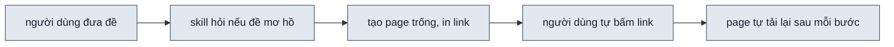
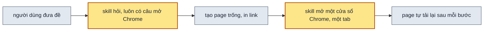

> **Nối tiếp:** [009](009-design-uiux-tien-do-dung.md) làm page tự tải lại mỗi khi một bước dựng xong, nên mở sớm là
> thấy page lớn dần. Plan này giải cái 009 để hở: người dùng vẫn phải tự bấm link mới thấy.
> **Phụ thuộc:** [015](015-design-uiux-tang-toc.md) xong trước. Plan này thêm một lệnh vào `new-design.mjs`, và lệnh
> đó ghi `run.log` theo cách 015 đặt ra.

## 1. Problem

Sau khi tạo page trống, skill in link `file://` của từng page vào chat rồi dựng tiếp. Người dùng muốn xem page lớn dần
thì phải tự chép hay bấm link đó. Đề A/B có hai link, đề một luồng có mỗi màn một link. Nhiều người không bấm, nên chỉ
thấy page lúc tin giao cuối, sau 9–24 phút ở bài mẫu một page. Cả lúc đó họ cũng vẫn phải tự mở.

## 2. Goal

- Khi chạy không có `--auto`, lượt hỏi đầu tiên của skill có câu "có mở page trong Chrome không", kể cả khi đề đã rõ.
- Khi người dùng chọn mở, ngay sau khi link được in, một cửa sổ Chrome mới hiện ra. Cửa sổ có đúng một tab: phương án
  A, hay màn 1 của luồng. Cửa sổ dùng profile Chrome người dùng dùng gần nhất. Các cửa sổ Chrome đang mở không thêm
  tab nào.
- Khi máy không có Chrome, page mở bằng trình duyệt mặc định và chat báo là không có Chrome. Trên hệ điều hành không
  phải macOS hay Linux, skill chỉ in link.
- Ở vòng góp ý, skill không hỏi lại và không mở thêm cửa sổ nào.
- Khi chạy với `--auto`, skill vẫn soạn câu hỏi đó và tự chọn "không mở". Không cửa sổ nào hiện ra.

**Ngoài scope:** tab đang xem page A không hiện tiến độ của page B; người xem bấm sang B mới thấy. Windows. Tự đóng cửa
sổ lúc giao.

## 3. Mental model

**Bây giờ chạy thế nào** — Người dùng đưa đề. Skill đọc dự án, hỏi nếu đề mơ hồ, chia đề thành page, rồi tạo các page
trống. Skill in link từng page vào chat và bắt đầu dựng. Mỗi khi một bước dựng xong, page nào đang mở trong trình
duyệt tự tải lại. Người dùng chỉ thấy điều đó nếu đã tự bấm link. Không bấm thì họ chờ tới tin giao cuối.



**Sau plan chạy thế nào** — Lượt hỏi đầu tiên luôn có thêm câu "có mở page trong Chrome không". Đề đã rõ thì lượt đó
chỉ có câu này. Người dùng chọn mở thì ngay sau khi in link, skill mở một cửa sổ Chrome mới, chỉ một tab, ở page đầu
tiên. Người xem sang phương án hay màn khác bằng nút trên thanh công cụ của page. Từ đó page tự tải lại như cũ. Khi
chạy thử với `--auto`, skill soạn câu hỏi, tự chọn không mở và đi tiếp.



**Hành vi đổi ra sao:**

| #     | Tình huống | Bây giờ | Sau plan |
| ----- | ---------- | ------- | -------- |
| `BH1` | đề rõ, chạy không có `--auto` | skill không hỏi gì, dựng luôn | skill hỏi đúng một câu: có mở page trong Chrome không |
| `BH2` | người dùng chọn mở, đề A/B | chat có hai link, người dùng tự bấm | một cửa sổ Chrome mới hiện ra, một tab ở phương án A; nút A B chuyển sang B |
| `BH3` | người dùng chọn không mở | chat có link | chat có link, không cửa sổ nào hiện ra |
| `BH4` | máy không có Chrome | chat có link | page mở bằng trình duyệt mặc định; chat báo không có Chrome |
| `BH5` | vòng góp ý | page đang mở tự tải lại sau mỗi ý | như bây giờ; skill không hỏi lại, không mở thêm cửa sổ |
| `BH6` | chạy `--auto` | không hỏi, không mở | câu hỏi mở Chrome có trong các câu đã soạn, đáp án tự chọn là không mở; không cửa sổ nào hiện ra |

**Không đụng:** thanh công cụ và cách page tự tải lại; máy kiểm vẫn chạy trình duyệt ẩn.

---

## 4. Probe

### P1 — Trên macOS, khi Chrome đang chạy, lệnh `open -na "Google Chrome" --args --new-window <url>` có mở đúng một cửa sổ mới, một tab, mà không chạy thêm một Chrome thứ hai không?

**Biết để làm gì:** nếu được, thì một lệnh hệ điều hành là đủ, không cần tiến trình nào phải tắt. Nếu không, thì phải
điều khiển Chrome bằng Playwright, và khi đó không dùng được profile thật vì Chrome khoá thư mục profile đang chạy.
**Cách chạy lại:** `node .probe/016-design-uiux-mo-page-trong-chrome/P1-open-new-window/probe.mjs` (mở một cửa sổ
thật, tự đóng sau 3 giây; cần Chrome đang chạy)
**Kết quả:** được — 2026-10-09, macOS 26.5.1, Chrome 154.0.8037.98, `probe.log`. Lệnh trả về sau 85 ms, exit 0. Số
cửa sổ tăng từ 2 lên 3. Cửa sổ mới có 1 tab, đúng URL. Đường dẫn có dấu và dấu cách được mã hoá đúng (`th%E1%BB%AD%20trang.html`).
Vẫn chỉ có một tiến trình Chrome chính. Khi tên ứng dụng sai, lệnh thoát mã 1 với `Unable to find application named`.
AppleScript không đọc được profile của cửa sổ, nên profile phải được người kiểm bằng mắt ở phase nghiệm thu.

## 5. Decisions

**Ai quyết:** 🤖 = agent tự quyết, chưa hỏi ai — **chỗ người duyệt phải soi** · 👤 = user chốt lúc bàn (luật 22).

### D0 👤 — Câu hỏi mở Chrome luôn nằm ở bước 2, trong lượt hỏi đầu tiên

**Lý do:** người dùng chọn hỏi sớm, dù đề rõ cũng thêm một lần dừng.
**Phương án đã loại:** hỏi sau khi gọi agent con. Cách này không thêm lần dừng, nhưng người dùng muốn một chỗ hỏi cố định.

### D1 👤 — Một cửa sổ Chrome mới, đúng một tab, mở page đầu tiên trong `pages.js`

**Lý do:** option-switcher chuyển được giữa các phương án và các màn, nên thêm tab là thừa. Cửa sổ riêng thì các cửa sổ
người dùng đang mở không bị chen thêm tab.

### D2 👤 — Mở bằng lệnh của hệ điều hành; macOS `open -na`, Linux `google-chrome --new-window`, hệ khác chỉ in link

**Lý do:** dựa vào `P1`. Lệnh trả về ngay, không để lại tiến trình nào phải tắt.
**Phương án đã loại:** Playwright có cửa sổ. Cách này cần tiến trình chạy nền tới lúc giao, và không dùng được profile thật.

### D3 👤 — Cửa sổ dùng profile Chrome dùng gần nhất; không truyền `--profile-directory`, không tạo profile mới

**Lý do:** dựa vào `P1`: lệnh gửi URL vào Chrome đang chạy. Page không cần đăng nhập hay cookie, nên profile thật
không làm sai page.
**Phương án đã loại:** profile mới. Cách này chạy thêm một Chrome, hiện màn chào lần đầu và để lại thư mục phải dọn.

### D4 👤 — Không có Chrome thì mở bằng trình duyệt mặc định và báo trong chat

**Lý do:** dựa vào `P1`: `open -na` thoát mã 1 khi không tìm thấy ứng dụng, nên lệnh biết lúc nào phải đổi cách.

### D5 👤 — Vòng góp ý không hỏi lại, không mở lại

**Lý do:** cửa sổ còn mở thì page tự tải lại sau mỗi ý. Nếu người dùng đã đóng cửa sổ, thì link nằm trong tin giao.

### D6 👤 — `--auto` không mở trình duyệt

**Lý do:** lượt chạy thử không có người xem.

### D7 🤖 — `--auto` vẫn soạn câu hỏi mở Chrome, tự chọn "Không mở" thay đáp án khuyên dùng, ghi một dòng `--auto` vào `## Quyết định`

**Lý do:** lượt chạy thử luôn là `--auto`. Có câu đã soạn thì lượt chạy thử mới kiểm được rằng câu hỏi tồn tại.
Câu này là ngoại lệ duy nhất của luật "`--auto` lấy đáp án khuyên dùng" → DS2.

### D8 🤖 — Mở bằng lệnh mới `new-design.mjs open`, không để agent tự gõ lệnh hệ điều hành

**Lý do:** lệnh gom bốn việc: tìm page đầu trong `pages.js`, mã hoá đường dẫn thành URL, chọn lệnh theo hệ điều hành,
đổi sang trình duyệt mặc định khi thiếu Chrome. Agent tự gõ thì mỗi lượt gõ một kiểu → DS1.
**Phương án đã loại:** agent gõ `open -na …` thẳng. Cách này không có chỗ kiểm bằng test.

### D9 🤖 — Biến môi trường `DESIGN_UIUX_CHROME_APP` đổi tên ứng dụng Chrome trên macOS, chỉ để test nhánh thiếu Chrome

**Lý do:** dựa vào `P1`: nhánh thiếu Chrome chỉ tạo được bằng một tên ứng dụng không có. Không có biến này thì nhánh đó
không có test nào.

### D10 🤖 — Agent chạy `open` ngay sau khi in link, trước khi viết `brief.md`

**Lý do:** page đã có khối chờ "Đang chuẩn bị", nên mở sớm là thấy page đi qua từng trạng thái.

## 6. Design

### DS1 — CLI Surface của `new-design.mjs open`

```bash
node $SKILL/scripts/new-design.mjs open <thư mục design> [--dry-run]
```

| Hệ điều hành | Lệnh chạy | Khi lệnh lỗi |
| --- | --- | --- |
| macOS | `open -na "${DESIGN_UIUX_CHROME_APP:-Google Chrome}" --args --new-window <url>` | exit ≠ 0 → `open <url>` |
| Linux | `google-chrome --new-window <url>`, tách khỏi tiến trình cha (`detached`, `unref`) | không có `google-chrome` trên `PATH` → `xdg-open <url>` |
| hệ khác | không chạy gì | — |

- `<url>` = `pathToFileURL(<thư mục design>/<file của dòng đầu pages.js>)`.
- stdout một dòng, chữ đầu nói đã mở bằng gì: `chrome <url>` · `default <url>` · `none <url>`.
- stderr khi đổi sang trình duyệt mặc định: `new-design: không có Google Chrome, mở bằng trình duyệt mặc định`.
- `--dry-run`: in thêm dòng `$ <lệnh sẽ chạy>` ra stdout, không chạy lệnh nào.
- Exit `0` đã mở hay hệ khác · `1` thư mục design sai hay `pages.js` rỗng · `2` cả hai lệnh mở đều lỗi.
- Ghi một dòng `run.log`: `new-design  open  <file>  <giây>  chrome | default | none`.

### DS2 — Luật trong SKILL.md

| Mục SKILL.md | Thêm gì | Mã |
| --- | --- | --- |
| Danh sách lệnh | dòng `new-design.mjs open <thư mục design>` | `F6.14` |
| Cờ `--auto`, bảng "Chỗ thường dừng hỏi" | dòng "Bước 2, hỏi mở page trong Chrome": vẫn soạn câu, chọn "Không mở", không chạy `open` | `F1.4` |
| Bước 2 | mục `### Hỏi mở page trong Chrome`: câu luôn có trong lượt hỏi đầu tiên; đề rõ thì lượt đó chỉ có câu này; một dòng `## Quyết định` | `F6.13` |
| Bước 4, ngay sau khối in link | nếu người dùng chọn mở, thì chạy `open`; stdout `default` thì báo trong chat không có Chrome; `none` thì không báo gì | `F6.14` `F6.15` |
| Vòng sau | một dòng: không hỏi lại, không chạy `open` | `F6.14` |

Câu hỏi:

| Trường | Giá trị |
| --- | --- |
| `question` | "Mở page trong một cửa sổ Chrome riêng để xem page lớn dần không?" |
| đáp án 1 | "Mở (Khuyên dùng)" — một cửa sổ Chrome mới, một tab ở page đầu; sang page khác bằng nút trên toolbar |
| đáp án 2 | "Không mở" — chỉ in link vào chat |

### DS3 — Test Strategy

| File | Vai |
| --- | --- |
| `scripts/test-open.mjs` | dựng thư mục design tạm bằng `init` + `page`, chạy `open --dry-run`, so stdout |

| Ca | Đầu vào | Mong đợi |
| --- | --- | --- |
| C1 | thư mục A/B, hai page | `$ open -na "Google Chrome" --args --new-window file://…/01-…html`; chỉ một URL |
| C2 | thư mục luồng ba màn | URL là màn 1 |
| C3 | đường dẫn thư mục design có dấu cách và dấu | URL mã hoá `%20`, `%E1%BB%…` |
| C4 | `DESIGN_UIUX_CHROME_APP="Không Có"`, chạy thật (không `--dry-run`) trên macOS | stdout `default …`, stderr có "không có Google Chrome" — chạy `open <url>` thật, nên ca này mở page ở trình duyệt mặc định; test bỏ ca này trừ khi có cờ `--real` |
| C5 | thư mục không có `pages.js` | exit 1 |
| C6 | sau C1–C3 | `--dry-run` không ghi `run.log`; C4 chạy thật thì ghi dòng `new-design	open	…	default` |

Test xoá thư mục tạm khi xong. Với `--keep`, test giữ thư mục A/B của C1 và in đường dẫn của nó.

```bash
node skills/design-uiux/scripts/test-open.mjs          # C1–C3, C5, C6
node skills/design-uiux/scripts/test-open.mjs --real   # thêm C4, mở một tab ở trình duyệt mặc định
node skills/design-uiux/scripts/test-open.mjs --keep   # giữ thư mục A/B để mở thử bằng tay
```

## 7. Phases

**Legend:** 🤖 = agent tự kiểm được (chạy lệnh, test, grep) · 👤 = cần người kiểm (số đo thật, UI, hạ tầng).

- [x] 👤 plan này được duyệt — 2026-10-09, Andy: "triển khai đi, chạy song song cùng các plan khác không phải là vấn đề"

### Phase 0 — ghi doc nguồn

**Goal:** SPEC có các yêu cầu mới; mục 016 trong PLANS.md ở `approved`.
**Cover:** —

**Actions:**

- [x] 🤖 SPEC `F1.4` update: "Với `--auto`, agent không dừng hỏi: câu làm rõ lấy đáp án khuyên dùng, câu mở Chrome lấy đáp án không mở." (D6 · D7) — 2026-10-09
- [x] 🤖 SPEC `F6.13`: "Agent hỏi người dùng có mở page trong Chrome không, trong lượt hỏi đầu tiên." (D0) — 2026-10-09
- [x] 🤖 SPEC `F6.14`: "Khi người dùng chọn mở, agent mở page đầu tiên trong một cửa sổ Chrome mới có đúng một tab, ngay sau khi in link." (D1 · D10) — 2026-10-09
- [x] 🤖 SPEC `F6.15`: "Nếu máy không có Chrome, thì agent mở page bằng trình duyệt mặc định và báo trong chat." (D4) — 2026-10-09
- [x] 🤖 SPEC §3.5 Agent: dòng **Scope:** thêm `F6.13`–`F6.15`; một gạch đầu dòng nói lệnh, profile, vòng góp ý (D2 · D3 · D5). §4 "Vì sao": một dòng bảng cho lệnh hệ điều hành và profile gần nhất. §5 I/O: dòng `scripts/test-open.mjs` — 2026-10-09: §3.5 gạch đầu dòng "Mở page trong Chrome", §4 Dựng hai dòng, §5 dòng `test-open.mjs`
- [x] 🤖 PLANS.md: mục `016` lên `approved` — 2026-10-09

**Gate:**

- [x] 🤖 `grep -n "F6.1[345]" skills/design-uiux/SPEC.md` ra ba sub-scope và dòng **Scope:** của §3.5 — 2026-10-09: dòng 104, 105, 107, 329
- [x] 🤖 `python3 ~/.claude/skills/write-plan/verify.py .plan/016-design-uiux-mo-page-trong-chrome.md` — 0 ERROR — 2026-10-09

### Phase 1 — lệnh mở page

**Goal:** `new-design.mjs open <thư mục design>` mở page đầu trong một cửa sổ Chrome mới.
**Cover:** DS1 · DS3

**Actions:**

- [x] 🤖 `new-design.mjs`: lệnh `open`, `--dry-run`, ba nhánh hệ điều hành, đổi sang trình duyệt mặc định, `appendRun` (D2 · D3 · D4 · D8 · D9) — 2026-10-09, hàm `openPage`
- [x] 🤖 `scripts/test-open.mjs`: ca C1–C6 theo DS3; dòng `// spec: F6.14 F6.15` ở đầu file — 2026-10-09

**Gate:**

- [x] 🤖 `node skills/design-uiux/scripts/test-open.mjs` exit 0, C1–C3, C5, C6 ✓ — DS1 · DS3 · BH2 — 2026-10-09: exit 0, 5 ca ✓; C1 ra đúng một URL `01-bang.html`, không có `02-the.html`
- [x] 🤖 `node skills/design-uiux/scripts/test-open.mjs --real` C4 ✓: stdout `default`, stderr báo không có Chrome — DS1 · BH4 — 2026-10-09: exit 0, stdout `default file://…/01-bang.html`, `run.log` có dòng `default`
- [x] 🤖 `test-progress.mjs`, `test-new-design.mjs` vẫn exit 0 — 2026-10-09: test-progress exit 0 (40 ✓), test-new-design 6/6 ca ✓

### Phase 2 — luật trong SKILL.md

**Goal:** agent chạy skill đọc được khi nào hỏi, khi nào mở, `--auto` làm gì.
**Cover:** DS2

**Actions:**

- [x] 🤖 SKILL.md: năm chỗ theo bảng DS2, mỗi mục mới có dòng `<!-- spec: … -->` (D0 · D5 · D7 · D10) — 2026-10-09; thêm `references/getdesign.md`: lượt đầu còn tối đa 2 câu làm rõ khi có câu chọn design

**Gate:**

- [x] 🤖 `node scripts/spec-check.mjs skills/design-uiux` 0 lỗi; `--matrix` cho `F6.13`–`F6.15` mỗi mã một mục SKILL.md — DS2 — 2026-10-09: `✓ 65 sub-scope`; `F6.13` → "Hỏi mở page trong Chrome", `F6.14` → "Agent chính chuẩn bị" · "Vòng sau", `F6.15` → "Agent chính chuẩn bị"
- [x] 🤖 `grep -n "new-design.mjs open" skills/design-uiux/SKILL.md` ra dòng danh sách lệnh và dòng Bước 4 — DS2 · BH5 — 2026-10-09: dòng 66, 378, 548

### Phase 3 — nghiệm thu

**Goal:** mỗi bullet §2 có bằng chứng từ một lượt chạy thật hay từ lệnh `open` chạy thật.
**Cover:** —

Lượt chạy thử luôn là `--auto`, nên nhánh "người dùng chọn mở" không có lượt chạy skill nào tạo ra được. Bullet 2 và 3
được kiểm bằng lệnh `open` chạy thật trên thư mục design của lượt nghiệm thu. Bài 04 là bài mặc định và đủ rõ, nên lượt
hỏi đầu tiên chỉ có câu mở Chrome. Bài 04 không có vòng góp ý, nên sau tin giao, lượt nghiệm thu gửi thêm một góp ý
bằng `claude -p --resume`.

**Actions:**

- [x] 🤖 chạy bài 04 `--auto` từ `prepare.mjs 04-quick-screen --slug nghiem-thu-016`; đếm cửa sổ Chrome bằng AppleScript trước và sau — 2026-10-09: `.test/design-uiux/074-sample-04-quick-screen-nghiem-thu-016-auto/`, 17:17:40–17:32:12, chế độ `auto`. Lượt `073` dừng ở bước 1 vì `run.sh` ép `acceptEdits`, lệnh `node` bị chặn; lỗi của cách gọi, không của skill
- [x] 🤖 `claude -p --resume <session> "--auto Góp ý: tiêu đề bảng to hơn"`; đếm cửa sổ Chrome trước và sau — 2026-10-09: câu bắt đầu bằng `--` bị `claude` đọc thành cờ (`feedback.stream.err`), chạy lại với "Góp ý, vẫn chạy --auto: tiêu đề bảng to hơn" (`feedback2.sh`)
- [ ] 👤 chạy `new-design.mjs open` trên thư mục design A/B của `test-open.mjs` (giữ lại bằng `--keep`), nhìn cửa sổ mở ra — 2026-10-09: agent đã chạy, `chrome file://…/001-open-ab/01-bang.html`, số cửa sổ 2 → 3, cửa sổ mới 1 tab "Lịch hẹn · A · Bảng gọn"; chờ Andy nhìn

**Gate:**

- [x] 🤖 §2 bullet 1: transcript lượt nghiệm thu có câu "Mở page trong một cửa sổ Chrome riêng" trong các câu đã soạn ở bước 2, dù bài 04 không có câu làm rõ — BH1 — 2026-10-09: `chat.md` dòng 17 "**Mở Chrome** \"Mở page trong một cửa sổ Chrome riêng để xem page lớn dần không?\" Agent chọn **Không mở**", cùng lượt với câu chọn design
- [ ] 👤 §2 bullet 2: một cửa sổ mới, một tab ở phương án A, avatar góc phải là profile dùng gần nhất, cửa sổ cũ không thêm tab; bấm B thì sang B — BH2
- [x] 🤖 §2 bullet 3: `test-open.mjs --real` C4 trên bản cuối — BH4 — 2026-10-09: `test-open.mjs --real` exit 0, C4 ✓ trên bản cuối
- [x] 🤖 §2 bullet 4: transcript lượt góp ý không có `new-design.mjs open`, không có câu hỏi; số cửa sổ Chrome không đổi — BH5 — 2026-10-09: `feedback2.stream.jsonl` 5 tool_use, 1 `--round`, 0 `new-design.mjs open`, 0 AskUserQuestion; cửa sổ Chrome 2 → 2
- [x] 🤖 §2 bullet 5: transcript lượt nghiệm thu không có `new-design.mjs open`; `## Quyết định` có dòng mở Chrome, đáp án "Không mở", ai quyết `--auto`; số cửa sổ Chrome không đổi — BH6 · BH3 — 2026-10-09: 0 tool_use chứa `new-design.mjs open` hay `open -na`; `run.log` không có dòng `open`; `brief.md` dòng 20 `| Mở page trong Chrome | Không mở | --auto |`; cửa sổ Chrome 2 → 2; AskUserQuestion 0 lần
- [x] 🤖 `python3 ~/.claude/skills/write-plan/verify.py .plan/016-design-uiux-mo-page-trong-chrome.md` — 0 ERROR — 2026-10-09: 0 ERROR · 0 WARN
