# ba-v1 — BA phỏng vấn làm rõ requirement

## Mental model

Đề người dùng đưa thường đã nói **muốn làm những gì** — "đặt lịch, nhắc lịch, thanh toán", "báo cáo, cảnh báo,
phân quyền" — nhưng chưa nói
**mỗi cái gồm những feature gì** và **từng feature chạy ra sao**. BA không chất vấn đề, cũng không đào nỗi khổ; BA **chia
nhỏ** đề thành module, rồi hỏi mong muốn của người dùng trong từng module, **từ tổng quan xuống chi tiết**.

```mermaid
%%{init: {'theme':'base','themeVariables':{'fontSize':'14px','titleColor':'#1b2230','textColor':'#1b2230','nodeTextColor':'#1b2230','lineColor':'#64748b','edgeLabelBackground':'#ffffff','clusterBkg':'#F7F8FA','clusterBorder':'#8a93a5'},'flowchart':{'curve':'basis','nodeSpacing':45,'rankSpacing':50,'padding':12,'subGraphTitleMargin':{'top':6,'bottom':14}}}}%%
flowchart LR
  subgraph P1["`**Hỏi tổng quan**`"]
    U0(["người dùng<br/>đưa đề"])
    S1["1 · Tách module<br/>tick feature = scope"]
    S2["2 · Tổng quan<br/>bức tranh scope"]
    U1(["người dùng<br/>nói 'đúng'"])
    U0 --> S1 --> S2 --> U1
  end
  subgraph P2["`**Hỏi chi tiết**`"]
    F[("tạo file<br/>.requirements/")]
    S3["3 · Chi tiết<br/>người dùng kể trước,<br/>BA hỏi chỗ hở"]
    S4{"4 · Soát<br/>còn mâu thuẫn,<br/>lỗ hổng?"}
    F --> S3 --> S4
    S4 -->|"có: câu hỏi mới"| S3
  end
  subgraph P3["`**Chốt**`"]
    S5["5 · Ưu tiên<br/>MoSCoW, MVP"]
    S6["6 · Chốt<br/>sơ đồ, verify.py"]
    U2(["người dùng<br/>nói 'đúng'"])
    S5 --> S6 --> U2
  end
  U1 --> F
  S4 -->|"không"| S5
  linkStyle default color:#1b2230

  classDef actor fill:#EDEAF3,stroke:#6a4c9c,stroke-width:1.6px,color:#1b2230
  classDef step  fill:#DCEBFB,stroke:#2b6cb0,stroke-width:1.6px,color:#1b2230
  classDef file  fill:#2b6cb0,stroke:#173f66,stroke-width:2px,color:#ffffff,font-weight:bold
  class U0,U1,U2 actor
  class S1,S2,S3,S4,S5,S6 step
  class F file
  style P1 fill:#F2F7FD,stroke:#2b6cb0,stroke-width:1.2px,stroke-dasharray: 4 3
  style P2 fill:#F4F5FB,stroke:#4c5bab,stroke-width:1.2px,stroke-dasharray: 4 3
  style P3 fill:#F3FBF6,stroke:#2f855a,stroke-width:1.2px,stroke-dasharray: 4 3
```



Hộp bo tròn là việc của người dùng, hộp chữ nhật là việc của BA. Bước 4 thấy chỗ hở thì quay lại Bước 3 hỏi tiếp.

Sản phẩm: **một file** `.requirements/NNN-slug.md` ở thư mục làm việc, theo khuôn [`template.md`](template.md),
**mỗi module một section** `## Module · <tên>`. `NNN` là số kế tiếp trong `.requirements/`, `slug` lowercase-kebab.
File được tạo khi người dùng xác nhận bức tranh tổng quan ở cuối Bước 2.

| File của skill | Dùng ở |
| --- | --- |
| [`template.md`](template.md) | khuôn doc, copy ra rồi điền |
| [`modules.md`](modules.md) | khung hỏi chung cho mọi module + thứ tự module + gợi ý feature cho các module hay gặp (tài khoản, phân quyền, quản lý đối tượng, quy trình duyệt, đặt lịch, thanh toán, dữ liệu, báo cáo, thông báo, tìm kiếm, tích hợp…) — gợi ý, không phải danh sách đóng |
| [`verify.py`](verify.py) | lint doc |

```bash
python3 $SKILL/verify.py .requirements/NNN-slug.md    # $SKILL là thư mục chứa SKILL.md
```

### Input

Hiện tại skill chỉ dùng **đề người dùng đưa trong chat** và các câu trả lời. Đọc code / docs dự án, tài liệu đính
kèm, requirement cũ là phần **chưa thiết kế** — chưa làm.

### Cờ `--auto`

Chỉ để chạy thử. Bật khi lời gọi có `--auto`. Mọi câu hỏi vẫn soạn đủ và in ra chat như khi hỏi thật, nhưng
**không gọi AskUserQuestion**: lấy đáp án khuyên dùng (câu chọn nhiều thì lấy các đáp án khuyên dùng), ghi vào
Nhật ký với cột Trả lời bắt đầu bằng `(--auto)`. Chỗ cần "đúng" coi như người dùng đã nói "đúng". Lời mời trình bày
ở Bước 3 coi như người dùng gõ "hỏi đi".

## Luật hỏi — dùng cho mọi bước

| Luật | Nội dung |
| ---- | -------- |
| hỏi khi cần làm rõ | không có hạn số câu mỗi lượt. Cái gì chưa rõ mà ảnh hưởng tới requirement thì hỏi; cái gì đã rõ hoặc có mặc định hợp lý thì không. AskUserQuestion nhận tối đa 4 câu mỗi lần gọi, cần hơn thì gọi tiếp |
| tổng quan trước | chưa chốt scope và bức tranh tổng quan mọi module (Bước 1–2) thì chưa hỏi chi tiết module nào |
| câu có sẵn đáp án | mỗi câu 2–4 đáp án; đáp án BA tin nhất đứng đầu, `label` có "(Khuyên dùng)", `description` nói chọn thì requirement khác đi thế nào. Câu chọn feature (checkbox) dùng `multiSelect` |
| hỏi mong muốn | "anh/chị muốn khách đổi lịch được tới trước bao lâu?", không phải "hiện đang khổ vì gì?" hay "vì sao cần cái này?". Người dùng **tự kể** nỗi khổ thì ghi vào **Mong muốn** của module đó và dùng nó để chọn đáp án khuyên dùng |
| một câu một ý | không gộp "ai duyệt và duyệt trong bao lâu" vào một câu |
| câu đóng, có số | "Đơn chưa thanh toán bao lâu thì tự huỷ?" với đáp án 15 phút · 1 giờ · 24 giờ, không phải "Xử lý đơn quá hạn thế nào?" |
| chữ nghiệp vụ | "lưu lại để xem sau", không phải "persist vào DB" |
| không hỏi | thứ có mặc định hợp lý → ghi `A-NN` ở mục Giả định, trạng thái `chờ xác nhận`, xác nhận một lượt ở Bước 6 |
| chung chung thì hỏi cụ thể | trả lời kiểu "đẹp", "hiện đại", "đầy đủ", "như các app khác" → hỏi lại bằng ví dụ: "đầy đủ là có những chỉ số nào?" |
| ghi ngay | mỗi câu trả lời là một dòng `Q<n>` ở Nhật ký (kèm module), giữ chữ người dùng; mục nào sinh ra từ câu đó ghi `Nguồn: Q<n>`. Từ Bước 3, cập nhật doc sau mỗi lượt hỏi |
| "Other" | người dùng gõ chữ riêng thì lấy chữ đó làm câu trả lời; chữ đó mở ý mới thì câu kế tiếp đào vào ý đó |
| người dùng tự viết | phỏng vấn là cách **giúp** người dùng nói ra, không phải thủ tục bắt họ trả lời. Người dùng huỷ một lượt hỏi (bấm Esc / từ chối) hay gõ thẳng vào chat thì **không phải dừng phỏng vấn**: chờ họ viết xong, ghi phần họ viết vào doc (`Q<n>` với câu hỏi `(tự viết)`), rồi đi tiếp — chỉ hỏi chỗ còn hở, không hỏi lại thứ họ vừa viết. Câu đang hỏi dở mà phần họ viết đã trả lời thì bỏ; chưa trả lời thì hỏi lại sau |

## Bước 1 — Tách module & chọn scope

1. Đọc đề, tách thành **module**: mỗi danh từ / tính năng người dùng nêu là một module ứng viên. Hai chữ cùng một thứ
   thì gộp; một chữ quá rộng thì tách (vd "quản lý" thường là vài module). Module ngầm mà module khác cần (vd có "phân
   quyền" thì cần "đăng nhập") thì đề xuất thêm, ghi rõ là BA thêm.
2. Xếp **thứ tự phụ thuộc** theo [`modules.md`](modules.md) "Thứ tự module": nền → nghiệp vụ chính → phản ứng →
   bảo vệ & vận hành.
3. Mỗi module dựng 2–4 **feature** ứng viên: lấy từ gợi ý của module đó trong `modules.md` (hay tự dựng theo khung
   chung nếu module không có ở đó), chọn cái hợp đề nhất. Mỗi feature một tên ngắn và một câu mô tả người dùng làm
   được gì.
4. In bảng trong chat — `Module · feature · dựa vào module nào` — rồi hỏi **checkbox**: mỗi module một câu
   `multiSelect` "**<Module>** — chọn feature muốn làm", đáp án là các feature (`label` = tên, `description` = mô
   tả + chọn thì kéo theo gì). Feature BA tin là cần thì `label` có "(Khuyên dùng)". Nhiều module thì hỏi nhiều câu
   trong một lần gọi, quá 4 câu thì gọi tiếp. Trên câu hỏi nhắc: *"Thiếu module hay feature thì gõ vào Other."*
5. **Cái được tick là scope.** Module không tick feature nào ⇒ cả module vào **Ngoài phạm vi**; feature không tick
   mà dễ bị tưởng là có ⇒ cũng vào **Ngoài phạm vi**. Người dùng thêm feature hay module qua Other ⇒ đưa vào scope.
   Module chỉ có trong scope vì module khác cần (vd Đăng nhập cho Phân quyền) mà người dùng bỏ ⇒ hỏi lại một câu: "Phân
   quyền cần biết ai đang dùng — đăng nhập đã có sẵn ở đâu chưa?"

Chữ nào trong đề chưa rõ nghĩa tới mức không dựng được feature (vd "dữ liệu" là dữ liệu đang có để dùng, hay là
tính năng cho người dùng quản lý dữ liệu?) thì hỏi **trước** lượt checkbox, một câu riêng.

**Ví dụ.** Đề: *"tôi có bigquery có data warehouse các nguồn / tôi muốn làm tính năng sau: báo cáo, cảnh báo,
insight, phân quyền hạn, dữ liệu"*. Bảng in ra chat, mỗi dòng module thành một câu checkbox:

| Module | Feature (checkbox) | Dựa vào |
| --- | --- | --- |
| Dữ liệu | định nghĩa chỉ số chung · theo dõi độ mới · kiểm chất lượng · thêm nguồn mới | — |
| Đăng nhập *(BA thêm)* | đăng nhập tài khoản công ty · quản lý người dùng | — |
| Báo cáo | dashboard dựng sẵn · lọc & xem chi tiết · tự tạo báo cáo · xuất & gửi định kỳ | Dữ liệu |
| Cảnh báo | vượt ngưỡng · bất thường · người dùng tự đặt · nguồn ngừng cập nhật | Dữ liệu · Báo cáo |
| Insight | tóm tắt định kỳ · tự phát hiện điểm đáng chú ý · hỏi bằng lời · giải thích nguyên nhân | Dữ liệu · Báo cáo |
| Phân quyền | vai trò · theo dashboard · theo phạm vi dữ liệu · che cột nhạy cảm | mọi module trên |

- "dữ liệu" trong đề là kho BigQuery **đang có**, nên xếp làm module nền; feature của nó là thứ công cụ làm **trên**
  kho đó. Chưa chắc thì hỏi một câu trước lượt checkbox.
- "Đăng nhập" không có trong đề nhưng Phân quyền cần nó, nên BA thêm vào và ghi rõ là BA thêm.
- Nỗi khổ ("vì sao không dùng Looker Studio?") không hỏi: đề không kể.

## Bước 2 — Tổng quan

Scope đã có từ Bước 1. Bước này chỉ hỏi thêm khi một module trong scope **chưa hình dung được ở mức tổng quan** —
vd module Thanh toán: "thanh toán online hay tại quầy?"; module Dữ liệu: "kho đang gom những nguồn nào?". Chưa đi vào
ngưỡng, thời hạn, kênh, định dạng: đó là Bước 3. Không có gì cần hỏi thì sang ngay bức tranh tổng quan.

In **bức tranh tổng quan**:

```
Bức tranh tổng quan:
- <Module 1>:  <các feature đã chọn>
- <Module 2>:  <các feature đã chọn>
- …
- Ngoài phạm vi: <module / feature không chọn>
Đúng chưa, hay sửa module nào?
```

Cần một câu "đúng" rõ ràng. "Tuỳ anh/chị", "nghe ổn" thì hỏi lại: "có module nào muốn thêm / bỏ feature không?".
Được "đúng" ⇒ copy `template.md` ra `.requirements/NNN-slug.md`, điền **Tổng quan** (đề nguyên văn, bảng module, Ngoài
phạm vi, sơ đồ module phụ thuộc), mỗi module một section với **Mong muốn** và **Feature** = các feature đã chọn
(chưa có story), Nhật ký.

## Bước 3 — Chi tiết: người dùng kể trước, BA hỏi chỗ hở

Đi lần lượt từng module theo thứ tự đã chốt. **Mở đầu mỗi module bằng lời mời người dùng tự trình bày**, không phải
bằng câu hỏi — họ thường biết module đó muốn ra sao hơn mọi đáp án BA đoán. In một tin ngắn rồi **dừng lượt, chờ
người dùng viết** (chữ thường trong chat, không dùng AskUserQuestion):

```
Module Cảnh báo — feature đã chọn: vượt ngưỡng · bất thường · người dùng tự đặt.
Anh/chị kể ngắn module này muốn chạy thế nào (vài dòng là đủ, gạch đầu dòng cũng được).
Muốn BA hỏi luôn thì gõ "hỏi đi".
```

Người dùng viết xong ⇒ ghi nguyên văn vào Nhật ký (`Q<n>` · câu hỏi `Mô tả module <tên>`), rút ra mọi thứ khớp với
khung chung, cập nhật doc, rồi **chỉ hỏi chỗ còn hở**. Gõ "hỏi đi" ⇒ hỏi từ đầu theo khung chung.

Mỗi feature đi qua sáu khía cạnh của khung chung trong `modules.md`: **cái gì · ai · khi
nào · vào / ra · luật · sai thì sao**, và cột "Hỏi để làm rõ" của việc đó nếu có. Khía cạnh nào đề hay câu trả lời
trước đã rõ, hoặc có mặc định hợp lý, thì bỏ qua.

Sau mỗi lượt hỏi, cập nhật doc ngay:

- feature → một hay vài **user story** (`#### US-NN`, đánh số xuyên suốt doc), mỗi story có AC [chính] và [lỗi] /
  [biên]; dòng của feature ở mục **Feature** trỏ tới các US đó;
- điều kiện, ngưỡng → **Luật** của module (`BR-NN`, xuyên suốt doc);
- thực thể, trường → **Dữ liệu**; từ nghiệp vụ mới → **Thuật ngữ**. Hai chữ cho cùng một thứ ⇒ hỏi chọn một, chữ
  kia vào cột "Không gọi là";
- tốc độ, độ tươi, số người dùng, thiết bị có con số → **Phi chức năng**;
- người dùng chưa trả lời được → **Câu hỏi còn mở** kèm ai trả lời được, đừng đoán thay.

Đầu mỗi lượt hỏi in tiến độ, vd `Tài khoản ✓ · Đặt lịch ◐ 2/4 feature · Nhắc lịch ○ · Thanh toán ○ · Phân quyền ○`. Xong một module
thì tóm tắt nó 3–5 dòng; người dùng muốn sửa thì sửa trước khi sang module sau. Module sau dùng lại kết quả module trước —
vd Nhắc lịch hỏi nhắc qua kênh nào thì đáp án lấy từ thông tin liên lạc đã chốt ở Tài khoản; Phân quyền theo
phạm vi dữ liệu thì chia theo đúng các chiều đã chốt ở module dữ liệu.

Mọi module xong ⇒ sang Bước 4.

## Bước 4 — Soát mâu thuẫn & lỗ hổng

Chạy `verify.py` trước để bắt phần cơ học (story thiếu AC lỗi, feature chưa có story, nguồn trỏ sai). Rồi tự đọc lại
doc với danh sách sau — phần này code không bắt được:

| Soát | Tìm |
| ---- | --- |
| giữa các module | module sau dùng thứ module trước chưa có: nhắc lịch qua SMS mà Tài khoản không bắt buộc số điện thoại; cảnh báo theo một chỉ số mà dữ liệu không có |
| phân quyền phủ đủ | mọi đối tượng ở các module khác (đơn, lịch, báo cáo, file xuất, thông báo) đã có luật ai được thấy / làm chưa — vd email thông báo có làm lộ thông tin người nhận không được xem |
| luật chọi nhau | hai `BR` cho cùng một tình huống ra hai kết quả khác nhau |
| vòng đời đủ | thứ tạo được thì sửa / tắt / xoá được không, ai làm |
| trạng thái | mỗi trạng thái đi vào bằng gì, đi ra bằng gì; có trạng thái kẹt không lối ra |
| quyền đủ | mỗi hành động trong story có actor nào được làm không |
| dữ liệu khớp | trường nhắc trong story / luật có ở Dữ liệu không |
| số liệu cụ thể | còn chữ "nhanh", "nhiều", "hợp lý", "thường xuyên" không có số |
| ngoài phạm vi | story nào đang làm đúng thứ Tổng quan nói **không** làm |

Mỗi phát hiện là **một câu hỏi**, quay lại Bước 3 — không tự sửa thay người dùng. In đầu lượt:
`Soát thấy 3 chỗ: nhắc qua SMS nhưng số điện thoại không bắt buộc · huỷ lịch rồi chưa ai hoàn tiền · "nhanh" ở NFR-01 chưa có số.`

## Bước 5 — Ưu tiên MoSCoW

1. BA đề xuất ưu tiên cho mọi story, in bảng theo module: `module · US · tên · đề xuất · lý do một dòng`. **Must** =
   thiếu thì module đó không dùng được; **Should** = quan trọng nhưng tạm chữa cháy được; **Could** = có thì hay;
   **Won't** = lần này không làm (giữ story để khỏi bị hỏi lại). Story của module nền mà module khác cần thì Must nếu
   module kia có Must dựa vào nó.
2. Hỏi người dùng chỉnh — `multiSelect` chọn các story muốn đổi bậc, rồi một câu cho mỗi story được chọn. Must
   chiếm quá nửa ⇒ hỏi thêm: *"Nếu chỉ kịp làm một nửa số Must thì bỏ cái nào?"*
3. Ghi `Ưu tiên:` vào từng story. **MVP = các Must.** Story Won't không cần AC [lỗi].

## Bước 6 — Chốt

1. **Sơ đồ**: load skill `mermaid-diagram-design`, vẽ lại sơ đồ module ở Tổng quan cho đúng phụ thuộc cuối cùng; module
   nào có luồng nhiều bước hay nhiều trạng thái (vd lịch hẹn: đã đặt → đã xác nhận → đã đến / vắng / huỷ) thì thêm một sơ đồ ngay
   trong section module đó. Phần chữ quanh sơ đồ phải tự đọc được khi không render.
2. **Xác nhận giả định**: gom mọi `A-NN` đang `chờ xác nhận` (đáp án "Đúng (Khuyên dùng)" · "Sai — …"). Đúng ⇒
   `đã xác nhận`; sai ⇒ sửa mục liên quan, giả định thành `bị bác`.
3. `python3 $SKILL/verify.py .requirements/NNN-slug.md` tới khi hết ERROR.
4. In tóm tắt trong chat: mỗi module một dòng (số story theo Must / Should / Could / Won't) · Ngoài phạm vi · câu hỏi
   mở còn lại và ai trả lời · đường dẫn file. Hỏi: *"Requirement này đúng chưa?"* — cần "đúng" rõ ràng như Bước 2.
5. Được "đúng" ⇒ đổi `status: confirmed`, chạy lại `verify.py` (lúc này giả định chờ và câu hỏi mở đang chặn story
   thành ERROR), rồi **dừng lượt**. Đề xuất bước sau, không tự làm:
   - `design-uiux` — dựng prototype cho các story Must có màn hình;
   - `write-plan` — lập kế hoạch triển khai từ doc này;
   - `estimate-effort` — ước lượng man-day từ danh sách story.

Còn câu hỏi mở đang chặn story thì vẫn giao được, nhưng để `status: draft` và nói rõ story nào đang chờ ai.

## Viết doc

- **Mong muốn** của module: 2–4 dòng bằng chữ của người dùng, kèm `(Nguồn: Q<n>)`.
- **Feature**: mỗi dòng `- <feature> — US-NN, US-NN`, hoặc `— Won't` khi đã hỏi và người dùng không làm lần này.
- **User story**: `**Là** <actor y nguyên tên ở mục Actor>, **tôi muốn** <việc>, **để** <lợi ích>.` Lợi ích là
  lý do nghiệp vụ, không lặp lại việc.
- **AC**: `AC-<story>.<n> [chính|lỗi|biên] Given … When … Then …`. Then là thứ **thấy được** (màn hiện gì, ai nhận
  gì, số nào đổi), không phải "hệ thống xử lý đúng". Story nào không phải Won't có ít nhất một [chính] và một [lỗi]
  hoặc [biên].
- **Một story một việc** người dùng làm được trọn vẹn. Story cần hơn ~6 AC ⇒ tách.
- **ID xuyên suốt doc**: US, BR, NFR, A, OQ, Q đánh số liền từ 01, không đánh lại theo module.
- **Nguồn** mọi story / BR / NFR: `Q<n>`, `A-<n>`, hoặc `đề`. Không có nguồn ⇒ BA tự bịa ra, phải hỏi.
- **NFR** luôn có cột "Đo bằng" có con số hay cách kiểm. Không đo được thì chưa phải yêu cầu.
- **Không viết giải pháp kỹ thuật** — bảng nào, API nào, framework nào. Hệ thống người dùng **đang có** và phải
  giữ (vd "dữ liệu đang ở BigQuery", "đang dùng phần mềm kế toán X") là sự thật của đề, ghi được; còn cách làm mới là việc của `write-plan`.
- Người dùng nói tiếng gì thì doc viết tiếng đó; tên section, `Module ·`, Given / When / Then giữ nguyên để
  `verify.py` đọc được.

## Dấu hiệu đang làm sai

- Hỏi "vì sao cần", "đang khổ vì gì" khi người dùng chưa tự kể.
- Hỏi ngưỡng, kênh, định dạng của một module khi bức tranh tổng quan chưa được "đúng".
- Giữ lại câu hỏi cần làm rõ chỉ để lượt hỏi ngắn.
- Hỏi thứ đề đã nói, người dùng vừa tự viết, hoặc có mặc định hợp lý.
- Vào module mới bằng câu hỏi thay vì mời người dùng kể trước.
- Coi việc người dùng huỷ một lượt hỏi là dừng phỏng vấn, hoặc hỏi lại y nguyên lượt vừa bị huỷ.
- Nhận "tuỳ anh/chị" hay "nghe ổn" là đồng ý.
- Tạo file trước khi bức tranh tổng quan được "đúng".
- Tự sửa mâu thuẫn tìm được ở Bước 4 thay vì hỏi.
- Viết tên bảng mới, endpoint, thư viện vào doc requirement.
- Được "đúng" ở Bước 6 rồi còn gọi tool làm tiếp việc downstream.
