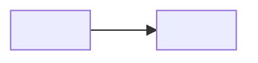

## Tổng quan

> <đề người dùng đưa, chép nguyên văn>

| Module | Gồm | Phụ thuộc |
| --- | --- | --- |
| <tên module, trùng tên trong heading Module> | <các feature đã chọn, ngăn bằng ·> | <module nó dựa vào, hoặc —> |

**Ngoài phạm vi:** <thứ dễ bị tưởng là có nhưng không làm, ngăn bằng ·>

## Actor

| Actor | Là ai | Dùng module |
| --- | --- | --- |
| <tên actor> | <mô tả một dòng> | <các module, ngăn bằng ·> |

## Module · <tên module>

**Mong muốn:** <2–4 dòng, giữ chữ của người dùng: họ muốn module này làm được gì cho họ.> (Nguồn: Q1)

### Feature

- <feature người dùng đã tick> — US-01
- <feature đã hỏi nhưng lần này không làm> — Won't

### User story

#### US-01 · <tên ngắn>

**Là** <actor ở mục Actor>, **tôi muốn** <việc>, **để** <lợi ích>.

Ưu tiên: Must · Nguồn: Q1

- AC-01.1 [chính] Given <bối cảnh> When <hành động> Then <kết quả thấy được>
- AC-01.2 [lỗi] Given <bối cảnh> When <hành động sai / thiếu> Then <hệ thống phản ứng thế nào>

### Luật

| ID | Luật | Nguồn |
| --- | --- | --- |
| BR-01 | <luật, có số cụ thể> | Q1 |

## Thuật ngữ & dữ liệu

### Thuật ngữ

| Thuật ngữ | Nghĩa trong dự án này | Không gọi là |
| --- | --- | --- |
| <từ> | <định nghĩa một dòng> | <từ đồng nghĩa bị cấm, để mọi người nói cùng một chữ> |

### Dữ liệu — <thực thể>

| Trường | Kiểu | Bắt buộc | Luật | Ví dụ |
| --- | --- | --- | --- | --- |
| <trường> | <chữ · số · ngày · tiền · enum(…)> | <có · không> | <ràng buộc, hoặc BR-NN> | <giá trị thật> |

## Phi chức năng

| ID | Module | Yêu cầu | Đo bằng | Nguồn |
| --- | --- | --- | --- | --- |
| NFR-01 | <module, hoặc chung> | <yêu cầu> | <con số / cách kiểm> | Q1 |

## Giả định

| ID | Module | Giả định | Trạng thái |
| --- | --- | --- | --- |
| A-01 | <module, hoặc chung> | <thứ BA tự đoán, chưa hỏi> | chờ xác nhận |

## Câu hỏi còn mở

| ID | Module | Câu hỏi | Ai trả lời | Chặn |
| --- | --- | --- | --- | --- |
| OQ-01 | <module, hoặc chung> | <câu hỏi> | <người / vai> | <US-NN, hoặc —> |

## Nhật ký phỏng vấn

| Q | Lượt | Module | Câu hỏi | Trả lời |
| --- | --- | --- | --- | --- |
| Q1 | 1 | <module, hoặc chung> | <câu hỏi> | <trả lời của người dùng, giữ chữ của họ> |
