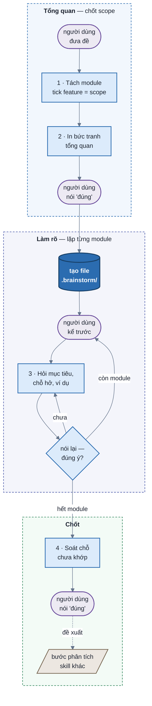

# SPEC — `brainstorm-v1`

## 1. Vấn đề

Người dùng thường đưa đề kiểu *"tôi muốn làm báo cáo, cảnh báo, phân quyền"*. Đề nói **muốn làm những gì**, nhưng
chưa nói mỗi cái **gồm gì**, **để đạt được gì**, **trông ra sao khi dùng**. Nếu nhảy thẳng vào code hay viết
requirement từ đề như vậy, agent sẽ lấp chỗ trống bằng phỏng đoán. Tới khi thấy sản phẩm, người dùng mới nhận ra không
phải điều mình muốn.

Hỏi luôn ngưỡng, thời hạn, trường hợp lỗi ngay từ đầu cũng không giải quyết được: người dùng phải trả lời những câu
họ chưa nghĩ tới, cuộc trao đổi nặng, mà điều cơ bản nhất — họ thực sự muốn gì — vẫn chưa chắc đã rõ.

## 2. Skill này làm gì

Chỉ **làm rõ**: dẫn người dùng nói ra điều họ muốn, tới khi hai bên hình dung được cùng một thứ. **Phân tích** là
bước sau, do một skill riêng làm, đọc file brief của skill này làm đầu vào.

| Làm rõ — skill này | Phân tích — bước sau |
| --- | --- |
| muốn feature nào, để đạt được gì | user story, AC Given/When/Then |
| ai dùng, lúc nào, nhận lại gì | luật có con số: ngưỡng, thời hạn, giới hạn |
| một ví dụ thật người dùng xác nhận | trường hợp lỗi: thiếu, trùng, quá hạn, không có quyền |
| chỗ người dùng nói chưa khớp nhau | soát vòng đời, trạng thái, phân quyền phủ đủ |
| | ưu tiên MoSCoW, phi chức năng, data dictionary |

Ranh giới trong một câu hỏi: *"đơn chưa thanh toán có tự huỷ không?"* là làm rõ; *"bao lâu thì huỷ?"* là phân tích.

## 3. Luồng

Hộp bo tròn là việc của người dùng, hộp chữ nhật là việc của agent.

- **Tổng quan.** Agent tách đề thành module, gợi ý 2–4 feature mỗi module. Người dùng tick, cái được tick là scope.
  Agent in bức tranh tổng quan; người dùng nói "đúng" thì mới tạo file.
- **Làm rõ.** Mỗi module: người dùng kể trước, agent hỏi mục tiêu, rồi hỏi chỗ còn hở theo *cái gì · ai · khi nào ·
  nhận lại gì*, xin một ví dụ thật. Xong thì agent nói lại bằng lời mình; người dùng thấy chưa đúng thì hỏi tiếp chỗ đó.
- **Chốt.** Agent soát chỗ nói chưa khớp giữa các module, chỗ lệch mục tiêu, feature chưa có ví dụ. Thấy gì thì quay
  lại Làm rõ, hỏi đúng chỗ đó. Người dùng nói "đúng" thì file thành `confirmed`, agent dừng và đề xuất bước sau.

## 4. Cách trao đổi

Agent và người dùng trao đổi theo ba dạng. Dạng nào dùng lúc nào tuỳ vào thứ agent cần lấy từ người dùng.

| Dạng | Là gì | Dùng khi | Vì sao |
| --- | --- | --- | --- |
| **Questionnaire** | câu hỏi kèm vài đáp án soạn sẵn, chọn một hoặc chọn nhiều; luôn gõ được đáp án riêng | agent đoán được vài đáp án hợp lý | chọn nhanh hơn viết, và các đáp án cho người dùng thấy những khả năng có thể chọn |
| **Q&A** | câu hỏi mở, người dùng viết tự do | cần chữ của chính người dùng: lời kể, ví dụ thật | đáp án soạn sẵn ở đây sẽ lái người dùng theo ý agent |
| **Xác nhận** | agent trình bày cách mình hiểu, người dùng duyệt bằng chữ | cuối bức tranh tổng quan, cuối mỗi module, cuối buổi | chỗ cần sửa không đoán trước được, nên không soạn đáp án |

Mỗi module đi theo nhịp **Q&A → Questionnaire → Xác nhận**. Lời kể của người dùng đi trước để agent không áp khung
của mình lên họ. Câu có đáp án lấp nhanh những chỗ còn hở. Lời nói lại ở cuối bắt những chỗ hai bên hiểu khác nhau.

Dạng là gợi ý của agent, không phải luật cho người dùng: người dùng có thể bỏ đáp án để tự viết, hoặc bảo agent hỏi
luôn thay vì phải kể, lúc nào cũng được.

**Khi câu trả lời chưa dùng được** — chung chung, hai nghĩa, lạc câu hỏi, chọi câu trước — thì coi như câu hỏi chưa
tốt, không phải người dùng trả lời sai. Agent hỏi lại bằng cách khác chứ không lặp câu cũ, và không bỏ phần người
dùng đã nói dù nó lạc chỗ. Một chỗ chỉ hỏi lại tối đa hai lần rồi để vào Câu hỏi còn mở: làm rõ là giúp người dùng
nói ra, không phải tra hỏi tới khi có đáp án; chỗ còn trống có thể để người khác hay bước phân tích trả lời.

## 5. Vì sao thiết kế như vậy

| Quyết định | Lý do |
| --- | --- |
| tách module, cho tick feature trước | người dùng chọn dễ hơn tự nghĩ ra. Cái không tick ghi vào Ngoài phạm vi, để sau này không ai tưởng là có |
| tổng quan trước chi tiết | hỏi sâu một module khi scope chưa chốt thì scope đổi là phải hỏi lại |
| người dùng kể trước | họ biết module muốn chạy thế nào hơn mọi đáp án agent đoán; agent chỉ hỏi chỗ còn hở |
| hỏi mục tiêu, không hỏi nỗi khổ | "muốn được gì" gợi ý được đáp án, và dùng để chọn đáp án khuyên dùng cho câu sau. "Đang khổ vì gì" đẩy người dùng vào thế phải bảo vệ đề |
| một ví dụ thật mỗi feature | hai người đọc cùng một câu mô tả có thể hiểu hai kiểu; ví dụ có tên người, có số thì không |
| nói lại bằng lời agent | người dùng nhận ra "không phải thế" dễ hơn tự nói ra "phải thế này". Đây là chỗ bắt hiểu lầm chính |
| mọi ý có nguồn `Q<n>` | đọc lại biết ý nào người dùng nói, ý nào agent đoán (`A-NN`, phải được xác nhận) |

## 6. I/O

| | |
| --- | --- |
| **Input** | đề người dùng đưa trong chat và các câu trả lời. Chưa đọc code, docs dự án |
| **Output** | một file brief `.brainstorm/NNN-slug.md` theo `templates/brief.md`: đề nguyên văn, module + feature đã chọn, ai dùng, mỗi module có mục tiêu và các ý đã rõ của từng feature (kèm ví dụ), giả định, câu hỏi còn mở, nhật ký trao đổi |
| **Verify** | `python3 scripts/verify.py <brief.md>` — khung section, bảng Tổng quan khớp module và feature, nguồn trỏ về câu hỏi có thật, feature thiếu ví dụ, dấu hiệu trượt sang phân tích |
| **Mutate** | chỉ tạo và sửa file brief. Không sửa code dự án, không gọi skill khác |

| File | Vai trò |
| --- | --- |
| `SKILL.md` | phần vận hành: luật hỏi, cách trao đổi, từng bước, cách viết file, dấu hiệu làm sai — đủ để agent chạy mà không cần đọc SPEC |
| `SPEC.md` | file này: tư tưởng thiết kế — vấn đề, mental model, lý do của từng quyết định, ranh giới phạm vi |
| `templates/brief.md` | khuôn file brief |
| `templates/modules.md` | khung hỏi chung, thứ tự module, gợi ý feature cho các module hay gặp |
| `scripts/verify.py` | lint file brief |

## 7. Không thuộc phạm vi

- User story, AC, luật có con số, trường hợp lỗi, phi chức năng, ưu tiên — việc của bước phân tích.
- Giải pháp kỹ thuật: bảng nào, API nào, framework nào. Hệ thống người dùng đang có thì ghi được, vì đó là sự thật của đề.
- Đọc code, docs, tài liệu đính kèm của dự án — chưa thiết kế.
- Nghĩ sản phẩm khác thay người dùng. Agent gợi ý module và feature để tick, nhưng coi đề là đúng.
