# design-uiux

## Mental model

```mermaid
%%{init: {'theme':'base','themeVariables':{'fontSize':'14px','titleColor':'#1b2230','textColor':'#1b2230','nodeTextColor':'#1b2230','lineColor':'#64748b','edgeLabelBackground':'#ffffff','clusterBkg':'#F7F8FA','clusterBorder':'#8a93a5'},'flowchart':{'curve':'basis','nodeSpacing':55,'rankSpacing':60,'padding':14,'subGraphTitleMargin':{'top':6,'bottom':14}}}}%%
flowchart TB
  subgraph P1["`**1 · Đọc và hỏi**`"]
    U1(["người dùng đưa đề"])
    S1["đọc design system,<br/>màn hiện có"]
    S2{"đề mơ hồ?"}
    U2(["người dùng trả lời<br/>câu có sẵn đáp án"])
    U1 --> S1
    S1 --> S2
    S2 -->|"có, ≤ 3 lượt"| U2
  end
  subgraph P2["`**2 · Chọn phương án**`"]
    S3["tìm phương án<br/>theo tình huống dùng"]
    S4{"còn mấy<br/>phương án?"}
    U3(["người dùng tick 1–3<br/>(--auto: chọn hết)"])
    S3 --> S4
    S4 -->|"2–3"| U3
  end
  subgraph P3["`**3 · Dựng** — song song`"]
    S5["brief.md<br/>+ page trống"]
    C1[["agent con:<br/>dựng một page"]]
    C2[["agent con:<br/>check.mjs page đó"]]
    S5 -->|"mỗi phương án<br/>một agent con"| C1
    C1 --> C2
  end
  subgraph P4["`**4 · Kiểm và giao**`"]
    S6["check.mjs<br/>cả thư mục"]
    S7["giao link"]
    U4(["người dùng<br/>mở link, góp ý"])
    S6 --> S7
    S7 --> U4
  end
  S2 -->|"không"| S3
  U2 --> S3
  S4 -->|"1"| S5
  U3 --> S5
  C2 --> S6
  U4 -.->|"sửa page,<br/>thêm<br/>phương án"| C1
  linkStyle default color:#1b2230

  classDef actor fill:#EDEAF3,stroke:#6a4c9c,stroke-width:1.6px,color:#1b2230
  classDef fe    fill:#DCEBFB,stroke:#2b6cb0,stroke-width:1.6px,color:#1b2230
  classDef svc   fill:#DFE3F5,stroke:#4c5bab,stroke-width:1.6px,color:#1b2230
  classDef core  fill:#2b6cb0,stroke:#173f66,stroke-width:2px,color:#ffffff,font-weight:bold
  class U1,U2,U3,U4 actor
  class S1,S2,S3,S4,S6,S7 fe
  class S5 core
  class C1,C2 svc
  style P1 fill:#F2F7FD,stroke:#2b6cb0,stroke-width:1.2px,stroke-dasharray: 4 3
  style P2 fill:#F7F5FA,stroke:#6a4c9c,stroke-width:1.2px,stroke-dasharray: 4 3
  style P3 fill:#F4F5FB,stroke:#4c5bab,stroke-width:1.2px,stroke-dasharray: 4 3
  style P4 fill:#F3FBF6,stroke:#2f855a,stroke-width:1.2px,stroke-dasharray: 4 3
```



Hộp bo tròn là việc của người dùng, hộp chữ nhật là agent chính, hộp viền đôi là agent con. `--auto` bỏ qua hai chỗ
người dùng trả lời và tick, tự chọn thay.

Một **thư mục design** `.design/NNN-slug/` cho mỗi đề, ở thư mục làm việc lúc gọi skill. Mọi thư mục design trong
`.design/` dùng chung một shell ở `.design/_shell/`:

| File | Ai viết | Vai |
| ---- | ------- | --- |
| `.design/_shell/` | `new-design.mjs init` (hay `shell`) chép bản mới nhất từ skill | shell: toolbar và panel (mục "Các khối điều khiển" ngay dưới), khung mobile / tablet, ghi URL. Dùng chung cho mọi thư mục design; chỉ bọc quanh page nên cập nhật không đổi hình design cũ |
| `tokens.js` | `new-design.mjs init --tokens --page-width` | mọi màu, chữ, bo góc, khoảng cách, bề rộng trang; giao diện còn thiếu do suy ra |
| `brief.md` | agent chính, từ khuôn `templates/brief.md` | bốn mục đầu cho người đọc: tóm tắt đề, quyết định kèm ai quyết, design system, pages; các mục sau cho agent con: tình huống, dữ liệu chung, nút dữ liệu chung, số kiểm chéo |
| `pages.js` | `new-design.mjs page` | danh sách page: chữ và tên phương án, câu hỏi trung tâm, đơn vị chính, cái hy sinh; option-switcher hiện thành nút A B C, đưa chuột vào thấy mô tả |
| `NN-slug.html` | agent con (hay agent chính khi chỉ một phương án), từ khuôn `templates/details.html` | mỗi phương án được chọn đúng một page |
| `shots/` | `check.mjs` | ảnh từng tổ hợp và từng cú bấm để soi bằng mắt |

### Các khối điều khiển

**shell** là mọi thứ `_shell/` vẽ quanh page, nằm ngoài bản thiết kế: **toolbar** và **panel**. Gọi đúng các tên
này trong SKILL.md, code, comment, plan và lúc nói chuyện với người dùng.

| Nhóm | Khối | Ở đâu | Làm gì | Trong code |
| ---- | ---- | ----- | ------ | ---------- |
| **toolbar** | **option-switcher** | giữa toolbar, thiếu chỗ thì dồn sang trái | nút A B C chuyển giữa các page của thư mục; đưa chuột hay chạm giữ thấy mô tả phương án; thư mục một page thì không có | `.ds-pages`, `[data-ds-option]` |
| | **view-controller** | phải toolbar | đổi cách nhìn, page không đổi: khổ desktop / tablet / mobile, sáng / tối, số khối. Ngoại lệ: nút về mặc định trả panel về `default` | `.ds-bar-view` |
| **panel** | **data-panel** | thẻ bên trái | vặn `variables` và chọn preset: dữ liệu page hiển thị | `[data-ds-panel="variables"]` |
| | **config-panel** | thẻ bên phải | vặn `tweaks`: role, bố cục, độ dày | `[data-ds-panel="tweaks"]` |

- toolbar là một khối liền (`[data-ds-toolbar]`) trong thanh trên cùng (`.ds-bar`); option-switcher và
  view-controller luôn cùng một dòng. Hai mép thanh thẳng mép chữ của trang, không sát mép màn hình.
- Màn đủ rộng thì panel luôn mở ở lề hai bên. Không đủ thì panel gập thành hai nút "Dữ liệu", "Cấu hình" ở hai đầu
  thanh; thanh không vừa một dòng thì hai nút này lên dòng trên, toolbar nguyên khối ở dòng dưới.
- shell cùng sáng tối với page nhưng nền xám, viền ngoài rõ vừa, để tách khỏi giao diện đang thiết kế mà không chói
  như đảo màu.
- Nguyên tắc thiết kế shell (màu, bố cục, cách data-panel và config-panel hiện từng loại ô vặn) ở
  [`shell/PRINCIPLES.md`](shell/PRINCIPLES.md). Đọc trước khi sửa shell.
- Sửa shell của skill (`shell/`) thì chạy `scripts/test-shell.mjs`: tự dựng một `.design/` mẫu trong thư mục tạm,
  kiểm toolbar và panel ở 1600 / 1280 / 700 / 375px, sáng và tối, trong vài giây. Không cần chạy `check.mjs`: lệnh
  đó kiểm page.

Sản phẩm là **HTML prototype**, không nối gì với code dự án. Đọc code dự án chỉ để lấy design system và biết màn hiện có trông ra sao. **Không ghi vào repo dự án** ngoài `.design/` ở thư mục làm việc.

Lệnh, `$SKILL` là thư mục chứa `SKILL.md`:

```bash
node $SKILL/scripts/new-design.mjs init <slug> [--root .design] [--tokens <DESIGN.md | file CSS có @theme>] [--page-width <1280px | 80rem | full>]
node $SKILL/scripts/new-design.mjs page <thư mục design> <slug> --title "<tên>" --option "<A · tên phương án>" --question "<câu hỏi trung tâm>" [--unit "<đơn vị chính>"] [--tradeoff "<cái hy sinh>"]
node $SKILL/scripts/new-design.mjs touch <thư mục design> <file> --note "<góp ý vừa sửa>"
node $SKILL/scripts/new-design.mjs shell [--root .design]   # chép shell mới nhất; chuyển thư mục design cũ (có _shell/ riêng) sang shell chung
node $SKILL/scripts/check.mjs <thư mục design | page.html> [--pw <thư mục có playwright>]
node $SKILL/scripts/test-shell.mjs [--pw <thư mục có playwright>] [--out <thư mục ảnh>]
```

### Cờ `--auto`

Bật khi lời gọi có `--auto` (`/design-uiux --auto <đề>`), hay người dùng nói rõ "tự chọn hết, đừng hỏi". Dùng để chạy thử.

| Chỗ thường dừng hỏi | Có `--auto` |
| ------------------- | ----------- |
| Bước 2, hỏi khi đề mơ hồ | vẫn soạn đủ câu hỏi và đáp án như khi hỏi thật, nhưng **không gọi AskUserQuestion**: lấy đáp án khuyên dùng của từng câu, coi như một lượt trả lời |
| Bước 3, chọn phương án | vẫn in bảng tình huống và từng phương án như khi hỏi thật, rồi **chọn tất cả** phương án qua ba phép thử |

Mỗi câu đã tự trả lời là một dòng trong bảng `## Quyết định` của `brief.md`, cột "Ai quyết" ghi `--auto`. Mọi bước khác giữ nguyên.

## Bước 1 — Đọc đề và dự án

Không hỏi những gì tự tìm được.

- **Design system**, lấy theo thứ tự:
  1. đề chỉ định (một lệnh như `npx getdesign@latest add <tên>` thì chạy lệnh đó, nó ra `DESIGN.md`). Với
     `getdesign` luôn thêm `--out ./DESIGN.md`: không có cờ này nó ghi vào **gốc git repo**, không phải thư
     mục đang đứng;
  2. file CSS có `@theme` của dự án (`grep -rl "@theme" --include=*.css . | grep -v node_modules`);
  3. `DESIGN.md` ở gốc dự án;
  4. không có gì thì để trống `--tokens`, skill dùng `shell/default-design.md`.

  File CSS có `@theme` thắng `DESIGN.md` khi cả hai cùng có, vì đó là giá trị app đang chạy.
- **Màn liên quan** (đề cải thiện một màn): tìm route (`grep -rn "<đường dẫn>" --include=*.tsx`), đọc file màn và component nó dùng. Ghi lại các khối đang có, chữ, trạng thái, số liệu thật, chỗ đang vướng. Không tự chạy app; người dùng đưa ảnh hay URL đang chạy thì dùng cái đó.
- **Component của dự án** (`ls` thư mục component dùng chung): page vẽ cho **trông giống** chúng (dáng, cỡ, trạng thái), không cần trùng code.
- **Bề rộng trang**: có codebase thì lấy theo app, không tự chọn. Tìm layout bọc màn (route cha, `Layout`, `AppShell`)
  và `max-w-*` / `max-width` của khung chứa nội dung (`grep -rn "max-w-\|max-width" <thư mục layout>`). Khung tràn
  hết phần còn lại thì `full`. Không có codebase thì bỏ cờ, mặc định `64rem` (1024px). Giá trị này đi vào
  `init --page-width`; mọi page cùng dùng nên đặt cạnh nhau so được.
- **Giới hạn nhường cho design system**: đọc xong design system thì so với các giới hạn `G1`–`G10` trong
  `principles.md`. Giới hạn nào tài liệu design system viết khác, hay component dự án đang làm khác, thì ghi vào brief ở
  bước 4, kèm câu trích hay đường dẫn component. Chỉ có token thì chưa tính là nói khác (`principles.md`, "Thứ tự ưu
  tiên").

Ra một dòng `Đọc:`, in ở đầu tin của bước 3 (hay bước 2 nếu phải hỏi):

> Đọc: design system từ `packages/ui/src/tokens.css` (chỉ có tối, sáng sẽ suy ra); bề rộng trang `80rem` theo `AppLayout.tsx`; màn `/insights` ở `routes/insights.tsx`, 6 khối; vẽ theo `StatTile`, `DataTable`, `BarChart` của dự án.

## Bước 2 — Đề mơ hồ thì hỏi

Đề **mơ hồ** khi một trong hai điều còn chưa trả lời được từ đề hay từ dự án:

- **tình huống dùng**: chưa viết được 3 tình huống (ai dùng, lúc nào, để biết hay làm gì);
- **dữ liệu**: chưa biết có gì (thực thể, trường, đơn vị, khoảng giá trị).

Không mơ hồ thì sang bước 3. Mơ hồ thì hỏi bằng AskUserQuestion:

| Luật | Giá trị |
| ---- | ------- |
| số câu mỗi lượt | ≤ 4, một lần gọi |
| đáp án mỗi câu | 2–4, đáp án khuyên dùng đứng đầu, `label` có "(Khuyên dùng)"; `description` nói chọn thì page khác đi thế nào |
| không hỏi | thứ đọc được từ dự án; thứ có mặc định hợp lý (một dòng `AI đoán` trong `## Quyết định`, báo lúc giao) |
| hỏi gì trước | câu đổi bộ tình huống (ai dùng, để làm gì), rồi câu đổi dữ liệu, cuối cùng mới tới chi tiết |
| điểm dừng | viết được 3 tình huống và biết dữ liệu có gì, hoặc hết **3 lượt**; hết lượt mà còn mơ hồ thì đoán, ghi dòng `AI đoán` vào `## Quyết định` |

Người dùng chọn "Other" kèm chữ thì lấy chữ đó làm câu trả lời. Câu hỏi nào cũng thành một dòng trong `## Quyết định` của `brief.md`, cột "Ai quyết" ghi `người dùng`.

## Bước 3 — Tìm phương án theo tình huống dùng

Phương án là **một câu trả lời khác nhau cho "màn này phục vụ ai trước, lúc nào, để biết gì"**, không phải một kiểu bày khác.

1. Liệt kê 3–5 **tình huống dùng** thật trong đề: ai, lúc nào, muốn biết hay làm gì.
2. Rút **câu hỏi chính** của từng tình huống.
3. Mỗi phương án chọn một câu hỏi làm trung tâm và khai ba thứ:
   - **câu hỏi trung tâm**: lên đầu trang, chiếm chỗ lớn nhất;
   - **đơn vị chính** người dùng nhìn vào: tuần, session, ngày, người…;
   - **cái hy sinh**: câu hỏi nào trả lời chậm đi.
4. Bảng **tình huống × phương án**, mỗi ô `nhanh` / `được` / `chậm`.
5. Ba phép thử, trượt phép nào thì xử lý ngay:

| Phép thử | Trượt khi | Xử lý |
| -------- | --------- | ----- |
| tweak | B dựng được từ A bằng một nút ở config-panel (bố cục, độ dày, grid/list, đổi loại biểu đồ trên cùng dữ liệu) | B thành tweak của A |
| thắng | phương án không `nhanh` ở tình huống nào | bỏ |
| trùng | hai phương án `nhanh` ở cùng nhóm tình huống, hay cùng hy sinh một thứ | gộp |

Tối đa 3 phương án. Còn **1** thì sang bước 4, không hỏi. Còn **2–3** thì in vào chat, theo thứ tự:

1. dòng `Đọc:`;
2. đề cải thiện một màn thì thêm khối **Đang có gì**: hiện trạng tóm tắt, chỗ đang vướng;
3. bảng tình huống × phương án;
4. mỗi phương án một khối: tên, bản phác bằng chữ ≤ 10 dòng (ô, cột, thứ gì nằm trên cùng), câu hỏi trung tâm, đơn vị chính, cái hy sinh, hợp khi.

Rồi hỏi bằng AskUserQuestion: `multiSelect: true`, mỗi phương án một đáp án, `label` là tên ≤ 5 chữ, `description` là câu hỏi trung tâm. Phương án thắng tình huống hay gặp nhất đứng đầu, kèm "(Khuyên dùng)". Câu hỏi chọn nhiều không hiện được bản phác, nên phần nhìn phải nằm sẵn trong chat ngay trước câu hỏi.

- Không tick gì thì hỏi lại một lần; vẫn không thì dựng phương án khuyên dùng.
- Chọn "Other" kèm chữ thì đọc như góp ý: sửa các phương án, in lại, hỏi lại.

## Bước 4 — Dựng: brief chung, mỗi phương án một agent con

### Agent chính chuẩn bị (tuần tự)

```bash
D=$(node $SKILL/scripts/new-design.mjs init <slug> --tokens <nguồn> [--page-width <bề rộng ở bước 1>])
node $SKILL/scripts/new-design.mjs page "$D" <slug-a> --title "<Tên màn> · <tên A>" --option "A · <tên A>" \
  --question "<câu hỏi trung tâm>" --unit "<đơn vị chính>" --tradeoff "<cái hy sinh>"
node $SKILL/scripts/new-design.mjs page "$D" <slug-b> --title "<Tên màn> · <tên B>" --option "B · <tên B>" \
  --question "<câu hỏi trung tâm>" --unit "<đơn vị chính>" --tradeoff "<cái hy sinh>"
```

Chữ của phương án (A, B, C) giữ đúng như lúc in ra chat, kể cả khi người dùng chỉ chọn B và C: option-switcher hiện nút B, C, và
bảng `## Pages` cùng câu hỏi chọn vẫn khớp nhau. Bốn cờ `--option` · `--question` · `--unit` · `--tradeoff` chép từ
dòng của phương án đó trong `## Pages`; thư mục từ 2 page trở lên mà thiếu `--option` đúng dạng hay `--question` thì
`check.mjs` báo lỗi. Một phương án duy nhất thì bỏ được bốn cờ này.

Điền `$D/brief.md` **trước khi** gọi agent con: hết mọi chỗ `<…>` (thẻ HTML thì viết trong backtick). Bốn mục đầu để người
dùng mở ra là biết đã chốt gì:

- **`## Tóm tắt đề`**: 2–4 dòng, màn gì, cho ai, để làm gì. Đề nguyên văn để ở `## Đề gốc` cuối file.
- **`## Quyết định`**: bảng `Câu hỏi` · `Chọn` · `Ai quyết`, mỗi câu hỏi làm rõ, bước chọn phương án và mỗi điều phải
  đoán là một dòng. "Ai quyết" chỉ là `người dùng`, `--auto` hay `AI đoán`.
- **`## Design system`**: nguồn token, giao diện gốc và suy ra, font thay, component vẽ theo, bề rộng trang lấy từ đâu. Đề cải thiện một màn thì
  thêm mục `## Màn hiện có`: khối "Đang có gì" đã in ra chat. Bảng **"Giới hạn nhường cho design system"** ghi giới
  hạn `G` nào design system nói khác (bước 1), mỗi dòng kèm dẫn chứng; không có thì ghi `Không có.` `check.mjs` bỏ kiểm
  của giới hạn có trong bảng, báo lỗi dòng ghi `N`, ID lạ hay thiếu dẫn chứng.
- **`## Pages`**: mỗi phương án một dòng, cả phương án chưa chọn (`File` là `—`, trạng thái `chưa chọn`). Bảng phải khớp
  `pages.js`; `check.mjs` bắt dòng thiếu hay thừa.

Ba mục quyết việc so được giữa các page:

- **`## Dữ liệu chung`**: thực thể, số lượng, giá trị mẫu, quan hệ giữa các con số, ca biên. Mọi page sinh dữ liệu giả theo đúng mục này, nên đặt cạnh nhau là cùng con số.
- **`## Nút dữ liệu chung`**: bảng `key` · `type` · khoảng · `default` của mọi variable, có `state`. Mọi page khai **đúng** bộ key này trong `variables`; `check.mjs` bắt page thiếu hay thừa. Tweaks thì mỗi phương án tự khai.
- **`## Số kiểm chéo ở mặc định`**: 3–5 con số agent chính **tự tính** từ công thức ở giá trị mặc định. Công thức viết bằng chữ
  luôn có chỗ hai người hiểu khác nhau (session đang chạy tính cả cost hay phần đã ăn); con số cụ thể chốt cách hiểu. Agent
  con trả về các số này, agent chính so với brief trước khi giao.

### Gọi agent con

Từ 2 phương án trở lên: gọi **mọi agent con trong cùng một lượt** (Agent tool, `subagent_type: "general-purpose"`, mỗi phương án một lần gọi, cùng một tin). Một phương án thì agent chính tự dựng theo mục "Viết một page".

Lời giao cho mỗi agent con:

```
Dựng page cho phương án <A · tên> trong thư mục design <$D>.
Đọc trước: <$SKILL>/SKILL.md, mục "Viết một page" và "Bước 5"; <$SKILL>/principles.md (hết file); <$D>/brief.md.
Chỉ sửa đúng file <$D>/<NN-slug.html>. Không đụng brief.md, pages.js, tokens.js, ../_shell/ hay page khác.
Phương án: trung tâm là "<câu hỏi>"; đơn vị chính <…>; hy sinh <…>. Bản phác:
<bản phác đã in cho người dùng>
variables khai đúng bảng "Nút dữ liệu chung"; dữ liệu giả theo "Dữ liệu chung"; tweaks tự chọn cho phương án này.
Xong thì chạy: node <$SKILL>/scripts/check.mjs <$D>/<NN-slug.html> [--pw <dir>] tới khi exit 0, tối đa ba vòng;
mở ảnh <$D>/shots/<NN-slug>--* ra, đi danh sách tự kiểm của principles.md.
Trả về: dòng cuối của check.mjs; khối "Tự kiểm" theo principles.md; variables, tweaks, preset; trạng thái riêng đã thêm;
chỗ còn lấn cấn.
```

Lệnh `check.mjs` của các agent con chạy song song được: mỗi page một bộ ảnh tên riêng trong cùng `shots/`.

### Viết một page

Sửa file page theo khuôn `templates/details.html`, giữ nguyên thứ tự nạp script ở `<head>`.

**Màu dùng vào đâu, cỡ chữ, khoảng cách, bóng, nút chính, đánh dấu `h1` / `aria-*` / `data-chart`**: theo
`principles.md`. Đọc hết file đó trước khi viết; luật không chép lại ở đây.

**Khai nút: `window.DESIGN`**

```js
window.DESIGN = {
  lang: "vi",                                   // "en" khi đề tiếng Anh: chữ trên toolbar và panel đổi theo
  variables: [ /* đổi DỮ LIỆU UI hiển thị: đúng bảng "Nút dữ liệu chung" của brief.md */ ],
  tweaks:    [ /* đổi CẤU HÌNH UI: role, bố cục, độ dày */ ],
  presets:   [{ label: "Dữ liệu dày", values: { weeks: 12, warnAt: 20 } }],
  // pageWidth: { value: "90rem", why: "bảng 9 cột" },  // chỉ khi phương án cần rộng khác bề rộng chung
};
```

| `type` | field | panel vẽ |
| ------ | ----- | -------- |
| `number` | `min` · `max` · `step` · `unit` · `default` | có cả `min` và `max` thì thanh kéo kèm số đang chọn; thiếu một trong hai thì ô số có đơn vị |
| `select` | `options`: chuỗi hoặc `{ value, label }` · `default` | ≤ 4 lựa chọn và tổng chữ ≤ 24 ký tự thì dãy nút bấm (thấy hết lựa chọn, như A B C); nhiều hơn thì ô chọn thả xuống. Nhãn ngắn để được dãy nút |
| `toggle` | `default` | công tắc |
| `text` | `maxLength` · `default` | ô chữ |

- `help` (không bắt buộc): một hai câu nói nút là gì và vặn thì page đổi gì, hiện ở icon ⓘ cạnh nhãn. Chỉ khai khi
  nhãn chưa tự nói rõ ("Cảnh báo dưới", "Mức dùng"); nhãn đã rõ ("Trạng thái", "Độ dày") thì bỏ.
- **variables** là thứ dữ liệu thật mang tới: số lượng, phần trăm, ngưỡng, giờ, tên dài, và `state`.
- **tweaks** là thứ quyết định giao diện trông thế nào cho ai: role (đổi quyền thì nút, menu đổi), kiểu bố cục (grid / list), độ dày.
- Khổ màn và sáng / tối là nút cố định của view-controller, **không khai**.
- **Vặn nút nào UI cũng phải đổi thấy được**, không thì đừng khai (`check.mjs` bắt). Đọc giá trị bằng `$store.design.<key>`.
- Kết quả chỉ hiện ra **sau một cú bấm** (lưu lỗi, gửi thất bại, hết hạn giữa chừng) thì làm thành một giá trị của
  `state` ("Lưu thất bại": page hiện sẵn cảnh đã sửa mà lưu không được), đừng làm variable kiểu "khi bấm Lưu thì lỗi":
  vặn nó không thấy gì, người xem không biết nó có tác dụng.
- `presets` cho ca biên và dữ liệu dày, để người xem bấm một lần ra cả bộ.

**Trạng thái và dữ liệu giả**

- Variable `state` bắt buộc, `options` có ít nhất `data` · `loading` · `empty` · `error`, cộng trạng thái riêng của đề (vượt ngưỡng, quá hạn, sắp reset). Đang tải là khung chờ đúng hình dòng thật; rỗng có câu nói vì sao và nút làm tiếp; lỗi có câu nói chuyện gì và nút thử lại.
- Dữ liệu giả sinh từ variables (đổi số là đổi dữ liệu), theo `## Dữ liệu chung`, có ca biên: tên dài tràn hai dòng, số `0`, số rất lớn, thiếu ảnh hay mô tả, một phần tử. Số giữa các khối phải khớp nhau (tổng ở đầu trang bằng tổng các dòng).
- **Bấm được như thật** bằng state Alpine trong page: tab, lọc, tìm, sắp xếp, mở modal, thêm, xoá, đổi trên dữ liệu giả. Không gọi API. Nút nào thấy được cũng phải làm gì đó; không làm được (role thiếu quyền) thì `disabled` kèm `title` nói vì sao.
- Mỗi khối chính có `data-block="<số>"`; cùng khối ở các page giữ cùng số.

**Viết HTML**

- Class Tailwind theo tên token: `bg-canvas`, `bg-surface-card`, `text-ink`, `text-body`, `text-muted`, `border-hairline`, `bg-primary text-on-primary`, `text-title-md`, `font-display`, `rounded-md`, `gap-sm`. Tên có trong `tokens.js` (`--color-<k>` → `bg-<k>`, `--text-<k>` → `text-<k>`, `--spacing-<k>` → `p-<k>`, `--radius-<k>` → `rounded-<k>`).
- **Không mã màu nào trong page** (`#hex`, `rgb()`, `text-[#…]`): màu chỉ ở `tokens.js`, đổi giao diện sáng tối mới đổi theo. Thiếu màu thì dùng `bg-primary/10` hay token gần nhất.
- Mọi thứ nằm trong `<main id="design">`. Icon `<i data-lucide="tên">`; shell tự vẽ lại khi Alpine thêm icon mới.
- Khối ngoài cùng trong `#design` giữ `mx-auto max-w-page` của khuôn, **không đổi sang `max-w-4xl`, `max-w-6xl`** vì
  thấy hợp phương án: bề rộng là của app, không phải của phương án. Phương án thật sự cần rộng khác (bảng nhiều cột)
  thì khai `pageWidth: { value, why }` trong `window.DESIGN`, dùng `max-w-[<value>]`, ghi lý do vào `## Design system`.
- Media query chạy thật trong khung mobile / tablet: dựng responsive bằng `sm:` `md:` `lg:`, không bằng JS đo bề rộng.
- Khung nổi (modal, panel, toast, lớp phủ) đặt `z-[1100]`: toolbar ở `z-index: 1000`, khung nổi thấp hơn
  thì phần mép trên (tiêu đề, nút đóng) nằm dưới toolbar. `check.mjs` bắt lỗi này.
- Dòng có nút hành động bên phải (Nhắc, Đổi hạn, Xoá): ở 375px cho nút xuống hàng riêng (`w-full justify-end sm:w-auto`),
  không thì nút ép chữ của dòng thành một cột hẹp mà `check.mjs` không bắt được.

## Bước 5 — Kiểm bằng code, bắt buộc

```bash
node $SKILL/scripts/check.mjs "$D"
```

Agent con kiểm page của mình; agent chính, sau khi mọi agent con trả về, kiểm **cả thư mục** một lần nữa. Chưa có Playwright thì lệnh in câu cài vào thư mục tạm (`npm i --prefix "$TMPDIR/design-uiux-pw" playwright`), chạy lại kèm `--pw`. **Không cài vào dự án.**

`check.mjs` chạy mọi tổ hợp tweak × sáng tối × `state` cộng từng preset ở 375 và 1280px, cộng một lượt bấm từng loại thứ bấm được trong page, và kiểm:
- **file**: thứ tự nạp, mã màu, `pages.js`, `brief.md` đủ mục, hết chỗ trống, cột "Ai quyết" hợp lệ, bảng `## Pages` khớp `pages.js`, variables đúng bảng "Nút dữ liệu chung", `state` đủ bốn giá trị;
- **khi chạy**: lỗi console, nút khai mà vặn không đổi UI, nút câm, URL mở lại đúng giá trị, khung tablet / mobile đúng bề rộng, nhãn "(suy ra)", khối ngoài cùng đúng bề rộng trang;
- **bố cục**: cuộn ngang, chữ đè chữ, chữ bị ép mỗi dòng một chữ, khung nổi lọt ra ngoài màn hình hay nằm dưới toolbar, ô số trong data-panel bị cắt;
- **nguyên tắc và giới hạn**: phần **Máy kiểm** của từng luật trong `principles.md` (`scripts/principles-check.mjs`), ở
  từng dòng file, mọi tổ hợp, lượt rê và bấm, và cả thư mục. Lỗi mở đầu bằng ID luật (`[N13]`, `[G4]`): mở đúng mục
  đó để sửa. Giới hạn có trong bảng nhường của `brief.md` thì không kiểm. Luật trong `principles.md` mà chưa có kiểm thì
  lệnh dừng với exit 2.

- Sửa tới khi **exit 0**, tối đa ba vòng. Còn lỗi sau ba vòng thì lúc giao ghi từng dòng lỗi và vì sao chưa sửa; không giao như thể đã sạch.
- Exit 0 xong vẫn **mở ảnh trong `shots/` ra**: 1280 và 375, sáng và tối, `state` rỗng và lỗi, preset ca biên, ảnh
  `--bam-*` của modal và panel. Trên các ảnh đó đi hết dòng **Tự kiểm** của `principles.md` (phần máy không đo được),
  trả về theo mục "Trả về danh sách tự kiểm".

## Bước 6 — Giao

Theo tiếng người dùng đang viết, ngắn:

1. Link `file://` của từng page vừa dựng hay vừa sửa (đường dẫn tuyệt đối), page nào là phương án nào.
2. `Đọc:` lấy design system ở đâu; giao diện nào suy ra; font nào thay (`window.DESIGN_THEME.fonts` trong `tokens.js`).
3. Nút vặn: data-panel (variables chung, preset), config-panel (tweaks của từng page).
4. Các dòng `AI đoán` và `--auto` trong `## Quyết định` của `brief.md`, mỗi dòng kèm "muốn khác thì nói". Chạy `--auto` thì mở đầu bằng "Chạy `--auto`, đã tự trả lời:" rồi liệt kê. Kèm link `brief.md`.
5. Kết quả `check.mjs` cả thư mục: số page, số tổ hợp, số lỗi.
6. Giới hạn đã nhường cho design system (bảng trong `## Design system` của `brief.md`), mỗi dòng kèm dẫn chứng; không
   có thì bỏ mục này.
7. Dòng tự kiểm còn `[ ]` agent con trả về, mỗi dòng kèm page và lý do chưa sửa.
8. Còn phương án chưa chọn thì nhắc một dòng: "Còn <C · tên>, muốn dựng thêm thì nói."

## Vòng sau

**Mỗi phương án đúng một page. Góp ý thì sửa thẳng page đó** tới khi người dùng thấy xong.

- Góp ý đổi bố cục, khối, nút, dữ liệu, chữ → sửa page của phương án đó, chạy lại `check.mjs`, rồi
  `new-design.mjs touch "$D" <file> --note "<góp ý>"` để khung mô tả của nút phương án ghi ngày sửa và góp ý cuối.
- Góp ý đổi dữ liệu chung hay nút dữ liệu chung → sửa `brief.md` trước, rồi sửa **mọi** page cho khớp.
- Thêm một phương án chưa chọn (người dùng nói, hay tick ở câu hỏi nhắc lại các dòng `chưa chọn` trong
  `## Pages`) → `new-design.mjs page … --option --question --unit --tradeoff`, điền file và đổi trạng thái dòng đó trong `brief.md`, thêm một dòng
  vào `## Quyết định`, gọi một agent con.
  Page cũ không đụng tới.
- Muốn bản tối, khổ mobile (view-controller), bản cho role khác (config-panel): đó là nút sẵn có, không cần sửa page.
- Đừng đẻ page `-v2`, `-final` cho mỗi vòng góp ý: option-switcher thành một dãy nút bản nháp, người dùng không biết
  page nào là bản đang làm.

## Bẫy đã gặp

| Bẫy | Hậu quả | Cách tránh |
| --- | ------- | ---------- |
| Mở thẳng file trong `templates/` | page vỡ: thiếu `tokens.js`, `_shell/` | khuôn chỉ dùng qua `new-design.mjs page` |
| Thẻ đọc `$store` nằm ngoài khối `x-data` | Alpine không vẽ, chữ trống | shell gắn `x-data` cho `body`; khối nào cũng nằm trong `<main id="design" x-data>` |
| Biểu thức Alpine dùng nháy kép trong attribute nháy kép | lỗi cú pháp, toolbar và panel chết | trong attribute dùng nháy đơn hay template literal |
| Token để trong file `.css` | Tailwind bản trình duyệt không đọc được qua `file://` | token trong `tokens.js` |
| Rule ngoài `@layer` đặt `position` | đè `sticky` / `absolute` của Tailwind | rule của shell trong `@layer base` |
| `box-sizing: border-box` cho iframe | khung 375 còn 373, media query lệch | shell đặt `content-box` cho iframe |
| Design system có khoảng cách `sm`, `md`… | Tailwind đọc `max-w-sm` thành 12px, modal còn một chữ mỗi dòng | `tokens.mjs` khai sẵn `--max-width-<k>`; sinh lại `tokens.js` cho thư mục design cũ |
| Chỉ kiểm thứ vặn được ở panel | modal, sheet, hàng mở rộng vỡ mà máy vẫn báo sạch | `check.mjs` có lượt bấm; vẫn mở ảnh `--bam-*` trong `shots/` |
| Chọn phương án theo kiểu hiển thị (timeline, lưới, biểu đồ) | hai phương án trả lời cùng một câu, câu hay gặp nhất không ai trả lời | đi từ tình huống dùng, qua ba phép thử ở bước 3 |
| Khung nổi `z-40`, `z-50` | panel trượt từ mép trên bị toolbar che tiêu đề và nút đóng | khung nổi `z-[1100]` |
| Mỗi agent con tự tạo page | tranh nhau ghi `pages.js`, số page trùng | agent chính tạo page trống trước, agent con chỉ sửa file của mình |
| Agent con tự đổi `max-w-*` của khối ngoài cùng | đổi page thì nội dung co giãn, phương án hẹp trông thoáng hơn chỉ vì hẹp; panel đè lên nội dung | `max-w-page` từ `--page-width`; `check.mjs` đo ở 1920px |
