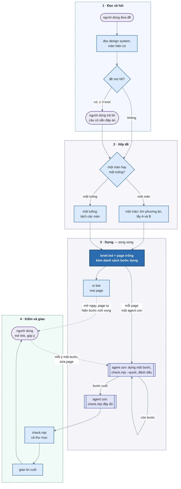

# design-uiux

## Mental model

<!-- spec: — -->



Hộp bo tròn là việc của người dùng, hộp chữ nhật là agent chính, hộp viền đôi là agent con. Chọn phương án không hỏi
người dùng: một màn ra A và B, một luồng ra mỗi màn một page. `--auto` bỏ qua chỗ người dùng trả lời câu hỏi làm rõ,
tự chọn thay.

Mỗi page có một **danh sách bước dựng** riêng (`NN-slug.progress.js`): sáu bước cố định, góp ý thêm bước theo vòng.
Danh sách là chỗ duy nhất nói page đã tới đâu: agent con lấy bước tiếp theo từ đó, shell đọc nó để hiện tiến độ và
tự tải lại page, agent bị ngắt rồi gọi lại đọc nó để làm tiếp, `check.mjs` đọc nó để chặn page dựng dở. Mỗi page một
danh sách, một agent con, nên các page vẫn dựng cùng lúc, không page nào chờ page khác.

Một **thư mục design** `.design/NNN-slug/` cho mỗi đề, ở thư mục làm việc lúc gọi skill. Mọi thư mục design trong
`.design/` dùng chung một shell ở `.design/_shell/`:

| File | Ai viết | Vai |
| ---- | ------- | --- |
| `.design/_shell/` | `new-design.mjs init` (hay `shell`) chép bản mới nhất từ skill | shell: toolbar và panel (mục "Các khối điều khiển"), khung mobile / tablet, ghi URL. Dùng chung cho mọi thư mục design; chỉ bọc quanh page nên cập nhật không đổi hình design cũ |
| `tokens.js` | `new-design.mjs init --tokens --page-width` | mọi màu, chữ, bo góc, khoảng cách, bề rộng trang; giao diện còn thiếu do suy ra |
| `brief.md` | agent chính, từ khuôn `templates/brief.md` | bốn mục đầu cho người đọc: tóm tắt đề, quyết định kèm ai quyết, design system, pages (đề một màn) hay luồng (đề một luồng); các mục sau cho agent con: tình huống, dữ liệu chung, nút dữ liệu chung, khối, số kiểm chéo |
| `pages.js` | `new-design.mjs page` | danh sách page theo thứ tự. Đề một màn: chữ và tên phương án, câu hỏi trung tâm, đơn vị chính, cái hy sinh; option-switcher hiện thành nút A B. Đề một luồng: số và tên màn, màn để làm gì; option-switcher hiện thành dãy màn. Đưa chuột vào thấy mô tả |
| `NN-slug.html` | `new-design.mjs page` chép khuôn trống `templates/page.html` (chỉ có khối "Đang dựng"); agent con (hay agent chính khi thư mục chỉ một page) dựng tiếp | mỗi phương án, hay mỗi màn của luồng, đúng một page. Cách khai nút, viết khối, dựng `state`: đọc page mẫu `templates/example.html` (màn Thành viên), không chép nó |
| `NN-slug.progress.js` | `new-design.mjs page` tạo; chỉ agent dựng page đó ghi, qua `new-design.mjs progress` | danh sách bước dựng của page; shell đọc lại mỗi 2 giây |
| `shots/` | `check.mjs` | ảnh từng tổ hợp và từng cú bấm để soi bằng mắt |

Sản phẩm là **HTML prototype**, không nối gì với code dự án. Đọc code dự án chỉ để lấy design system và biết màn hiện có trông ra sao. **Không ghi vào repo dự án** ngoài `.design/` ở thư mục làm việc.

Lệnh, `$SKILL` là thư mục chứa `SKILL.md`:

```bash
node $SKILL/scripts/new-design.mjs init <slug> [--root .design] [--tokens <DESIGN.md | file CSS có @theme> | --getdesign <tên>] [--page-width <1280px | 80rem | full>]
node $SKILL/scripts/new-design.mjs designs   # design của getdesign dùng được, mỗi dòng `tên - mô tả`
node $SKILL/scripts/new-design.mjs page <thư mục design> <slug> --title "<tên>" --option "<A · tên phương án>" --question "<câu hỏi trung tâm>" [--unit "<đơn vị chính>"] [--tradeoff "<cái hy sinh>"]
node $SKILL/scripts/new-design.mjs page <thư mục design> <slug> --title "<luồng> · <tên màn>" --screen "<n> · <tên màn>" --purpose "<màn để làm gì>"   # đề một luồng
node $SKILL/scripts/new-design.mjs progress <thư mục design> <file>                    # in danh sách, bước dựng đầu tiên chưa xong
node $SKILL/scripts/new-design.mjs progress <thư mục design> <file> --done <n>         # bước n xong (đúng bước đầu tiên chưa xong)
node $SKILL/scripts/new-design.mjs progress <thư mục design> <file> --insert "<việc>"  # chèn một bước trước bước kiểm đầy đủ
node $SKILL/scripts/new-design.mjs progress <thư mục design> <file> --round "<ý 1>" ["<ý 2>" …]   # vòng góp ý mới
node $SKILL/scripts/new-design.mjs touch <thư mục design> <file> --note "<góp ý vừa sửa>"
node $SKILL/scripts/new-design.mjs shell [--root .design]   # chép shell mới nhất; chuyển thư mục design cũ (có _shell/ riêng) sang shell chung
node $SKILL/scripts/check.mjs <page.html> --quick [--state <giá trị>] [--preset "<nhãn>"] [--pw <thư mục có playwright>]   # 1–2 giây, trước mỗi --done
node $SKILL/scripts/check.mjs <thư mục design | page.html> [--pw <thư mục có playwright>]   # kiểm đầy đủ
node $SKILL/scripts/test-shell.mjs [--pw <thư mục có playwright>] [--out <thư mục ảnh>]
node $SKILL/scripts/test-progress.mjs   # sau khi sửa lệnh progress
```

### Các khối điều khiển

<!-- spec: F2 F2.6 F2.7 F6.3 F6.4 F6.5 -->

**shell** là mọi thứ `_shell/` vẽ quanh page, nằm ngoài bản thiết kế: **toolbar** và **panel**. Gọi đúng các tên
này trong SKILL.md, code, comment, plan và lúc nói chuyện với người dùng.

| Nhóm | Khối | Ở đâu | Làm gì | Trong code |
| ---- | ---- | ----- | ------ | ---------- |
| **toolbar** | **nhãn tiến độ** | trái toolbar | "● Đang dựng 3/6", "● Đang sửa 1/3" hay "✓ Xong · 08/10", đọc từ danh sách bước dựng của page; bấm vào thấy các bước theo vòng (✓ xong, ● đang làm, ○ còn lại). Page không có danh sách là page đã xong | `[data-ds-status]`, `[data-ds-status-list]` |
| | **option-switcher** | giữa toolbar, thiếu chỗ thì lệch về phía cột hẹp hơn | đề một màn: nút A B chuyển giữa hai phương án; đề một luồng: dãy màn "1 · Welcome → 2 · Đăng ký", màn ≤ 480px chỉ còn số. Đưa chuột hay chạm giữ thấy mô tả; thư mục một page thì không có | `.ds-pages`, `[data-ds-option]`, `[data-ds-screen]` |
| | **view-controller** | phải toolbar | đổi cách nhìn, page không đổi: khổ desktop / tablet / mobile, sáng / tối, số khối. Ngoại lệ: nút về mặc định trả panel về `default` | `.ds-bar-view` |
| **panel** | **data-panel** | thẻ bên trái | vặn `variables` và chọn preset: dữ liệu page hiển thị | `[data-ds-panel="variables"]` |
| | **config-panel** | thẻ bên phải | vặn `tweaks`: role, bố cục, độ dày | `[data-ds-panel="tweaks"]` |

- toolbar là một khối liền (`[data-ds-toolbar]`) trong thanh trên cùng (`.ds-bar`); option-switcher và
  view-controller luôn cùng một dòng. Hai mép thanh thẳng mép chữ của trang, không sát mép màn hình.
- Màn đủ rộng thì panel luôn mở ở lề hai bên. Không đủ thì panel gập thành hai nút "Dữ liệu", "Cấu hình" ở hai đầu
  thanh; thanh không vừa một dòng thì hai nút này lên dòng trên, toolbar nguyên khối ở dòng dưới.
- shell cùng sáng tối với page nhưng nền xám, viền ngoài rõ vừa, để tách khỏi giao diện đang thiết kế mà không chói
  như đảo màu.
- Mọi giá trị đang xem (phương án, khổ màn, sáng tối, variables, tweaks) nằm trên URL: chép link gửi đi hay tải lại
  trang thì mở ra đúng giá trị đó. Page đọc giá trị qua `$store.design`, không tự ghi URL.
- **Tự tải lại khi có bước mới xong.** Shell đọc lại `NN-slug.progress.js` mỗi 2 giây; khi một bước được đánh dấu xong
  (`rev` đổi) thì page đang mở tự tải lại, giữ mọi giá trị trên URL và vị trí cuộn. Nếu người xem đang gõ trong ô
  nhập (cả trong khung mobile / tablet), thì page đợi con trỏ rời ô mới tải. Không có nút tải lại; người dùng để page
  mở là thấy page lớn dần.
- Thư mục luồng: page gọi `$store.design.next()` · `prev()` để sang màn kề, giữ mọi giá trị trên URL; ở khung mobile /
  tablet thì trang cha chuyển theo. Chữ người xem gõ nằm ở `$store.design.form`, shell lưu vào `sessionStorage` nên
  sang màn khác hay quay lại vẫn còn, và không lên URL. Nút về mặc định xoá `form`.
- Nguyên tắc thiết kế shell (màu, bố cục, cách data-panel và config-panel hiện từng loại ô vặn) ở
  [`references/shell-principles.md`](references/shell-principles.md). Đọc trước khi sửa shell.
- Sửa shell của skill (`shell/`) thì chạy `scripts/test-shell.mjs`: tự dựng một `.design/` mẫu trong thư mục tạm,
  kiểm toolbar và panel ở 1600 / 1280 / 700 / 375px, sáng và tối, trong vài giây. Không cần chạy `check.mjs`: lệnh
  đó kiểm page.

### Cờ `--auto`

<!-- spec: F1.4 F1.6 -->

Bật khi lời gọi có `--auto` (`/design-uiux --auto <đề>`), hay người dùng nói rõ "tự chọn hết, đừng hỏi". Dùng để chạy thử.

| Chỗ thường dừng hỏi | Có `--auto` |
| ------------------- | ----------- |
| Bước 2, hỏi khi đề mơ hồ hay chưa rõ một màn hay một luồng | vẫn soạn đủ câu hỏi và đáp án như khi hỏi thật, nhưng **không gọi AskUserQuestion**: lấy đáp án khuyên dùng của từng câu, coi như một lượt trả lời |
| Bước 2, chọn design của getdesign | vẫn in danh sách và soạn câu chọn design; lấy design khuyên dùng (đáp án đầu) |

Bước 3 không hỏi người dùng chọn phương án, nên không có gì để `--auto` thay.

Mỗi câu đã tự trả lời là một dòng trong bảng `## Quyết định` của `brief.md`, cột "Ai quyết" ghi `--auto`. Mọi bước khác giữ nguyên.

## Bước 1 — Đọc đề và dự án

<!-- spec: F1.1 F1.3 F1.7 F3.1 F3.4 F3.5 F3.6 F3.9 -->

Không hỏi những gì tự tìm được.

- **Design system**, lấy theo thứ tự:
  1. đề chỉ định. Đề ghi lệnh `npx getdesign@latest add <tên>` thì **không chạy lệnh đó**: ghi lại `<tên>`, bước 4
     dùng `init --getdesign <tên>`. Chạy thẳng `getdesign add` thì file nằm ở gốc git repo hay thư mục làm việc, ngoài
     `.design/`;
  2. file CSS có `@theme` của dự án (`grep -rl "@theme" --include='*.css' . | grep -v node_modules`).
     Mẫu `*.css` phải có nháy: zsh tự mở `*` trước khi tới `grep`, không khớp file nào thì báo `no matches found` và
     `grep` không chạy. Lệnh báo lỗi là chưa tìm được gì, không có nghĩa dự án không có file `@theme`;
  3. `DESIGN.md` ở gốc dự án;
  4. không có gì thì chạy `node $SKILL/scripts/new-design.mjs designs`, giữ stdout cho mục "Chọn design của
     getdesign" ở bước 2. Lệnh thoát mã 2 (mất mạng, getdesign hỏng) thì bỏ qua việc chọn: để trống `--tokens`, skill
     dùng `shell/default-design.md`, và in vào chat dòng `Không lấy được design của getdesign (<dòng lỗi stderr>); dựng
     bằng bộ mặc định.`

  File CSS có `@theme` thắng `DESIGN.md` khi cả hai cùng có, vì đó là giá trị app đang chạy.
- **Màn liên quan** (đề cải thiện một màn): tìm route (`grep -rn "<đường dẫn>" --include='*.tsx' .`), đọc file màn và component nó dùng. Ghi lại các khối đang có, chữ, trạng thái, số liệu thật, chỗ đang vướng. Không tự chạy app; người dùng đưa ảnh hay URL đang chạy thì dùng cái đó.
- **Component của dự án** (`ls` thư mục component dùng chung): page vẽ cho **trông giống** chúng (dáng, cỡ, trạng thái), không cần trùng code.
- **Bề rộng trang**: có codebase thì lấy theo app, không tự chọn. Tìm layout bọc màn (route cha, `Layout`, `AppShell`)
  và `max-w-*` / `max-width` của khung chứa nội dung (`grep -rn "max-w-\|max-width" <thư mục layout>`). Khung tràn
  hết phần còn lại thì `full`. Không có codebase mà tài liệu design system ghi bề rộng nội dung (`max-width`, "content
  width", "Max content width: ~1200px") thì dùng số đó, bỏ dấu `~`. Không nguồn nào ghi thì bỏ cờ, mặc định `64rem`
  (1024px). Giá trị này đi vào `init --page-width`; mọi page cùng dùng nên đặt cạnh nhau so được. `## Design system`
  của `brief.md` ghi bề rộng lấy từ đâu.
- **Giới hạn nhường cho design system**: đọc xong design system thì so với các giới hạn `G1`–`G10` trong
  `references/page-principles.md`. Giới hạn nào tài liệu design system viết khác, hay component dự án đang làm khác, thì ghi vào brief ở
  bước 4, kèm câu trích hay đường dẫn component. Chỉ có token thì chưa tính là nói khác (`references/page-principles.md`, "Thứ tự ưu
  tiên").

Ra một dòng `Đọc:`, in ở đầu tin của bước 3 (hay bước 2 nếu phải hỏi):

> Đọc: design system từ `packages/ui/src/tokens.css` (chỉ có tối, sáng sẽ suy ra); bề rộng trang `80rem` theo `AppLayout.tsx`; màn `/insights` ở `routes/insights.tsx`, 6 khối; vẽ theo `StatTile`, `DataTable`, `BarChart` của dự án.

Không có design system:

> Đọc: không có design system (đề không chỉ định, không có file `@theme` hay `DESIGN.md`); sẽ hỏi chọn một bộ của getdesign; bề rộng trang mặc định `64rem`.

## Bước 2 — Đề mơ hồ thì hỏi

<!-- spec: F1.1 F1.6 F1.7 F1.12 -->

Đề **mơ hồ** khi một trong ba điều còn chưa trả lời được từ đề hay từ dự án:

- **tình huống dùng**: chưa viết được 3 tình huống (ai dùng, lúc nào, để biết hay làm gì);
- **dữ liệu**: chưa biết có gì (thực thể, trường, đơn vị, khoảng giá trị);
- **loại đề**: chưa xếp được là một màn hay một luồng (bảng ở bước 3). Câu hỏi: "Một màn hay cả luồng?", hai đáp án.
  Đáp án khuyên dùng là **một màn** khi đề nhắc đúng một màn có sẵn trong dự án, ngược lại là **một luồng**.

Không mơ hồ thì sang bước 3, trừ khi phải chọn design của getdesign (mục "Chọn design của getdesign" dưới đây). Mơ hồ thì hỏi bằng AskUserQuestion:

| Luật | Giá trị |
| ---- | ------- |
| số câu mỗi lượt | ≤ 4, một lần gọi |
| đáp án mỗi câu | 2–4, đáp án khuyên dùng đứng đầu, `label` có "(Khuyên dùng)"; `description` nói chọn thì page khác đi thế nào |
| không hỏi | thứ đọc được từ dự án; thứ có mặc định hợp lý (một dòng `AI đoán` trong `## Quyết định`, báo lúc giao) |
| hỏi gì trước | câu đổi bộ tình huống (ai dùng, để làm gì), rồi câu đổi dữ liệu, cuối cùng mới tới chi tiết |
| điểm dừng | viết được 3 tình huống và biết dữ liệu có gì, hoặc hết **3 lượt**; hết lượt mà còn mơ hồ thì đoán, ghi dòng `AI đoán` vào `## Quyết định` |

Người dùng chọn "Other" kèm chữ thì lấy chữ đó làm câu trả lời. Câu hỏi nào cũng thành một dòng trong `## Quyết định` của `brief.md`, cột "Ai quyết" ghi `người dùng`.

### Chọn design của getdesign

<!-- spec: F3.6 F3.7 F3.9 F1.4 F1.6 -->

Chỉ làm khi bước 1 đã chạy `designs` và lệnh thoát mã 0. Việc này chạy **kể cả khi đề không mơ hồ**.

1. In stdout của `designs` vào chat, nguyên văn, trong một khối code `text`, có dòng mở `Design của getdesign dùng
   được (<số dòng> bộ):`. In trước lần gọi AskUserQuestion.
2. Câu chọn design nằm trong **lượt hỏi đầu tiên**, cùng một lần gọi AskUserQuestion với các câu làm rõ đề (nếu có).
   Đề không mơ hồ thì lượt đó chỉ có câu này. Câu này không tính vào giới hạn 3 lượt hỏi làm rõ, nhưng tính vào giới
   hạn 4 câu mỗi lần gọi: lượt đầu còn tối đa 3 câu làm rõ.

| Phần | Giá trị |
| ---- | ------- |
| `header` | `Design` |
| `question` | `Dựng page theo design nào? Gõ tên khác trong danh sách nếu muốn.` |
| đáp án 1–4 | `label` là tên design đúng như danh sách; đáp án 1 thêm ` (Khuyên dùng)`. `description` là mô tả của getdesign và một câu vì sao hợp đề |

Không có đáp án "bộ mặc định": `shell/default-design.md` chỉ dùng khi `designs` hay `init --getdesign` thoát mã 2.

Chọn bốn design trong danh sách đã in, xét theo thứ tự:

1. cùng ngành với app trong đề: app tài chính → `wise`, `revolut`, `stripe`; app nhắn tin → `discord`, `intercom`;
2. tính chất app: công cụ nhập liệu, bảng số nhiều → bộ nền sáng, ít ảnh; app giải trí → bộ nhiều màu;
3. bỏ bộ mà mô tả nói về ảnh lớn, trang giới thiệu (`photography-driven`, `cinematic`, `monumental`) khi đề là app công
   cụ.

Sau khi có câu trả lời:

- Tên là một trong bốn design hay tên gõ qua "Other" có trong danh sách đã in → bước 4 dùng `init --getdesign <tên>`.
- Tên gõ qua "Other" không có trong danh sách → nói "`<tên>` không có trong danh sách", hỏi lại đúng câu này một lần
  (lượt riêng, không tính vào 3 lượt). Lần hai vẫn không có → lấy đáp án khuyên dùng, ghi `AI đoán`.
- Ghi vào `## Quyết định` của `brief.md` một dòng `Design system` · `<tên>` · `người dùng` hay `--auto`.

## Bước 3 — Xếp đề: một màn hay một luồng

<!-- spec: F1.11 F1.6 -->

Trước khi tìm phương án, xếp đề vào một trong hai loại. Hai loại đi hai nhánh khác nhau từ đây.

| Loại | Người dùng làm việc trên | Nhận ra khi | Ví dụ |
| ---- | ------------------------ | ----------- | ----- |
| **một màn** | đúng một màn hình | đề nói tới một màn: sửa màn có sẵn, tạo một màn mới, một modal, một trang cài đặt | "thiết kế lại màn đăng nhập", "màn Đơn hàng nhìn rối" |
| **một luồng** | nhiều màn hình nối nhau | đề liệt kê ≥ 2 màn nối nhau, hay gọi tên một luồng: onboarding, đăng ký, thanh toán, "luồng", "các bước", "wizard", "flow" | "luồng onboarding 3 màn", "flow đặt lịch từ chọn dịch vụ tới thanh toán" |

Không xếp được (đề gọi tên một phần của app mà không nói một màn hay nhiều, như "làm phần đăng ký cho app") thì đó
là câu hỏi của bước 2. Kết quả là một dòng `Loại đề` · `một màn` hay `một luồng` trong `## Quyết định` của
`brief.md`; tự xếp từ chữ trong đề thì "Ai quyết" ghi `AI đoán`.

Chữ "màn" là màn hình người dùng thấy trong app; "page" là file HTML của skill. Đề một màn ra hai page A, B; đề một
luồng ra mỗi màn một page.

### Một màn: hai phương án A và B

<!-- spec: F1.2 F1.13 F1.14 -->

Phương án là **một câu trả lời khác nhau cho "màn này phục vụ ai trước, lúc nào, để biết gì"**, không phải một kiểu bày khác.

1. Liệt kê 3–5 **tình huống dùng** thật trong đề: ai, lúc nào, muốn biết hay làm gì.
2. Rút **câu hỏi chính** của từng tình huống.
3. Mỗi phương án chọn một câu hỏi làm trung tâm và khai ba thứ:
   - **câu hỏi trung tâm**: lên đầu trang, chiếm chỗ lớn nhất;
   - **đơn vị chính** người dùng nhìn vào: tuần, session, ngày, người…;
   - **cái hy sinh**: câu hỏi nào trả lời chậm đi.
4. Bảng **tình huống × phương án**, mỗi ô `nhanh` / `được` / `chậm`.
5. Ba phép thử, trượt phép nào thì xử lý ngay:

| Phép thử | Trượt khi | Xử lý |
| -------- | --------- | ----- |
| tweak | B dựng được từ A bằng một nút ở config-panel (bố cục, độ dày, grid/list, đổi loại biểu đồ trên cùng dữ liệu) | B thành tweak của A |
| thắng | phương án không `nhanh` ở tình huống nào | bỏ |
| trùng | hai phương án `nhanh` ở cùng nhóm tình huống, hay cùng hy sinh một thứ | gộp |

6. Lấy **hai** phương án `nhanh` ở hai nhóm tình huống hay gặp nhất: A là phương án thắng tình huống hay gặp nhất, B
   là phương án thắng nhóm tình huống hay gặp thứ hai. **Không hỏi người dùng chọn**, không gọi AskUserQuestion: dựng
   luôn cả hai, song song.

| Sau ba phép thử | Dựng | Chat ghi thêm |
| --------------- | ---- | ------------- |
| còn ≥ 2 phương án | A và B | còn phương án thứ ba thì một dòng `Hướng khác: C · <tên> — <câu hỏi trung tâm>. Muốn xem thì nói, sẽ dựng thay A hay B.` |
| đề xin ≥ 3 phương án | vẫn chỉ A và B | một dòng `Đề xin <n> phương án; mỗi màn tối đa hai phương án A/B để so từng cặp.` |
| còn đúng 1 | một page A | một dòng `Chỉ một hướng: <lý do>`, vd "hướng kia chỉ khác bố cục, đã là nút Bố cục ở config-panel" |

**Mỗi màn tối đa hai page.** So A/B là so từng cặp; `check.mjs` báo lỗi thư mục phương án có từ ba page.

In vào chat, theo thứ tự, rồi sang bước 4 ngay:

1. dòng `Đọc:`;
2. dòng `Một màn: dựng A và B song song.` (hay `Một màn: dựng một page.`);
3. đề cải thiện một màn thì thêm khối **Đang có gì**: hiện trạng tóm tắt, chỗ đang vướng;
4. bảng tình huống × phương án;
5. mỗi phương án được dựng một khối: tên, bản phác bằng chữ ≤ 10 dòng (ô, cột, thứ gì nằm trên cùng), câu hỏi trung tâm, đơn vị chính, cái hy sinh, hợp khi;
6. các dòng thêm của bảng trên.

Bản phác cho người dùng biết sắp thấy gì; sai hướng thì họ ngắt hay góp ý, không cần một lượt hỏi chọn.

### Một luồng: tách thành các màn

<!-- spec: F1.15 F1.16 F1.17 -->

Một luồng chỉ **một phương án**: không đi bảng tình huống × phương án, không A/B. Việc của bước này là tách luồng
thành các màn để mỗi màn thành một page, dựng song song.

1. Liệt kê các màn theo thứ tự người dùng đi. Màn nào đề đã kể tên thì giữ đúng tên và thứ tự đó.
2. Mỗi màn một dòng: tên, để làm gì, nhận gì từ màn trước, đưa gì cho màn sau, trạng thái riêng.
   - "Đưa cho màn sau" là thứ người xem gõ hay chọn ở màn này mà màn sau cần (email, gói đã chọn), viết thành key
     `form.<key>`: `form.email`, `form.plan`. Màn sau đọc đúng key đó.
   - Nhánh lỗi (email trùng, mã sai) là **trạng thái riêng** của màn đó, không là màn riêng. Luồng có nhánh rẽ thật
     (hai đường đi khác nhau) thì đi đường chính, ghi đường kia vào `## Quyết định` dòng `AI đoán`.
3. Ghi bảng này vào `## Luồng` của `brief.md` ở bước 4, cột `File` theo `NN-slug.html` mà `new-design.mjs page` in ra.

In vào chat, theo thứ tự, rồi sang bước 4 ngay, không hỏi xác nhận:

1. dòng `Đọc:`;
2. dòng `Một luồng: một phương án, <n> màn, mỗi màn một page, dựng song song.`;
3. bảng các màn (như `## Luồng`, chưa cần cột `File`).

Sai màn thì người dùng góp ý ở vòng sau.

## Bước 4 — Dựng: brief chung, mỗi page một agent con

<!-- spec: — -->

### Agent chính chuẩn bị (tuần tự)

<!-- spec: F1.2 F1.3 F1.5 F1.6 F1.8 F1.16 F1.17 F3.1 F3.4 F3.5 F3.8 F3.9 -->

Đề một màn: mỗi phương án một page.

```bash
D=$(node $SKILL/scripts/new-design.mjs init <slug> [--tokens <nguồn> | --getdesign <tên>] [--page-width <bề rộng ở bước 1>])
node $SKILL/scripts/new-design.mjs page "$D" <slug-a> --title "<Tên màn> · <tên A>" --option "A · <tên A>" \
  --question "<câu hỏi trung tâm>" --unit "<đơn vị chính>" --tradeoff "<cái hy sinh>"
node $SKILL/scripts/new-design.mjs page "$D" <slug-b> --title "<Tên màn> · <tên B>" --option "B · <tên B>" \
  --question "<câu hỏi trung tâm>" --unit "<đơn vị chính>" --tradeoff "<cái hy sinh>"
```

Đề một luồng: mỗi màn một page, tạo theo đúng thứ tự màn (thứ tự trong `pages.js` là thứ tự đi).

```bash
D=$(node $SKILL/scripts/new-design.mjs init <slug> [--tokens <nguồn> | --getdesign <tên>] [--page-width <bề rộng ở bước 1>])
node $SKILL/scripts/new-design.mjs page "$D" <slug-1> --title "<Tên luồng> · <tên màn 1>" --screen "1 · <tên màn 1>" --purpose "<để làm gì>"
node $SKILL/scripts/new-design.mjs page "$D" <slug-2> --title "<Tên luồng> · <tên màn 2>" --screen "2 · <tên màn 2>" --purpose "<để làm gì>"
```

Một thư mục là thư mục phương án (`--option`) hay thư mục luồng (`--screen`); `new-design.mjs` từ chối trộn.

`page` chép khuôn trống `templates/page.html`: page mở ra chỉ có khối "Đang dựng <tên phương án hay tên màn>". Cùng
lúc nó tạo `NN-slug.progress.js` với sáu bước dựng chưa xong. Không chạy lại `page` cho page đã có: mỗi lần chạy là một
page mới.

`init` in đường dẫn thư mục ra stdout, in danh sách cặp màu dưới 4.5 : 1 ra stderr. Đọc danh sách đó trước khi điền
bảng "Cặp màu không đủ đọc" của brief.

`--getdesign <tên>` (tên từ đề, hay người dùng chọn ở bước 2) tải design đó vào `$D/DESIGN.md`; `tokens.js` ghi nguồn
`getdesign <tên>`. Không dùng cùng `--tokens`. Nếu `init` lỗi, thì nó không tạo thư mục nào:

- exit 1 (`getdesign không có <tên>`, `<tên> chỉ có phần chữ`): tên sai. Hỏi lại câu chọn design như mục "Chọn design
  của getdesign" ở bước 2.
- exit 2 (`không tải được <tên> từ getdesign`): chạy lại `init` không có `--getdesign`, in vào chat dòng `Không lấy được
  design của getdesign (<dòng lỗi>); dựng bằng bộ mặc định.`, sửa dòng `Design system` của `## Quyết định` thành `bộ
  mặc định` · `AI đoán`.

`## Design system` của brief ghi `getdesign <tên> (DESIGN.md trong thư mục này)`; đọc `$D/DESIGN.md` như mọi
`DESIGN.md` khác (bề rộng trang, giới hạn nhường).

Chữ của phương án (A, B) giữ đúng như lúc in ra chat. Bốn cờ `--option` · `--question` · `--unit` · `--tradeoff` chép
từ dòng của phương án đó trong `## Pages`; thư mục từ 2 page trở lên mà thiếu `--option` đúng dạng hay `--question` thì
`check.mjs` báo lỗi. Một phương án duy nhất thì bỏ được bốn cờ này. Thư mục luồng: `--screen` là `<n> · <tên màn>`
với `n` đúng thứ tự màn, `--purpose` chép từ cột "Để làm gì" của `## Luồng`.

Điền `$D/brief.md` **trước khi** gọi agent con: hết mọi chỗ `<…>` (thẻ HTML thì viết trong backtick). Bốn mục đầu để người
dùng mở ra là biết đã chốt gì:

- **`## Tóm tắt đề`**: 2–4 dòng, màn gì, cho ai, để làm gì. Đề nguyên văn để ở `## Đề gốc` cuối file.
- **`## Quyết định`**: bảng `Câu hỏi` · `Chọn` · `Ai quyết`. Dòng đầu là `Loại đề` (bước 3); mỗi câu hỏi làm rõ, phương
  án được dựng và mỗi điều phải đoán là một dòng. "Ai quyết" chỉ là `người dùng`, `--auto` hay `AI đoán`.
- **`## Design system`**: nguồn token, giao diện gốc và suy ra, font thay, component vẽ theo, bề rộng trang lấy từ đâu.
  Bảng **"Cặp màu không đủ đọc"**: `init` in ra stderr các cặp màu dưới 4.5 : 1 ở cả giao diện gốc và giao diện suy ra.
  Cặp nào page sẽ dùng làm chữ (nút chính, chữ phụ, link) thì ghi một dòng, chốt một cách dùng thay lấy từ token của
  chính design system (chữ `ink` trên nền `primary`, nút chính dạng viền). Cặp chỉ dùng làm nền (cột biểu đồ, chấm
  trạng thái) thì bỏ qua. Agent con dựng song song không thấy page của nhau: để mỗi agent tự lách thì nút chính mỗi
  page một màu, `check.mjs` báo lỗi cả thư mục. Đề cải thiện một màn thì
  thêm mục `## Màn hiện có`: khối "Đang có gì" đã in ra chat. Bảng **"Giới hạn nhường cho design system"** ghi giới
  hạn `G` nào design system nói khác (bước 1), mỗi dòng kèm dẫn chứng; không có thì ghi `Không có.` `check.mjs` bỏ kiểm
  của giới hạn có trong bảng, báo lỗi dòng ghi `N`, ID lạ hay thiếu dẫn chứng.
- **`## Pages`** (đề một màn): mỗi phương án một dòng, cả hướng không dựng (`File` là `—`, trạng thái `chưa chọn`). Bảng
  phải khớp `pages.js`; `check.mjs` bắt dòng thiếu hay thừa. Xoá mục `## Luồng`.
- **`## Luồng`** (đề một luồng): bảng các màn ở bước 3, thêm cột `File`, theo đúng thứ tự `pages.js`; `check.mjs` bắt
  dòng thiếu, thừa hay sai thứ tự. Xoá `## Pages` và `## Tình huống`. Agent con của màn nào cũng đọc cả bảng, nên
  nút sang màn kề và key `form.*` của các màn khớp nhau dù chúng dựng song song, không thấy page của nhau.

Bốn mục quyết việc so được giữa các page:

- **`## Dữ liệu chung`**: thực thể, số lượng, giá trị mẫu, quan hệ giữa các con số, ca biên. Mọi page sinh dữ liệu giả theo đúng mục này, nên đặt cạnh nhau là cùng con số.
- **`## Nút dữ liệu chung`**: bảng `key` · `type` · khoảng · `default` của mọi variable, có `state`. Mọi page khai **đúng** bộ key này trong `variables`; `check.mjs` bắt page thiếu hay thừa. Tweaks thì mỗi phương án tự khai.
  Vì mọi page khai đủ bộ key, và vặn nút nào UI cũng phải đổi, nên mỗi variable chung phải đổi thấy được ở **mọi**
  page, kể cả page của phương án đã hy sinh thứ nó điều khiển. Variable chỉ có nghĩa ở một phương án thì làm thành
  tweak của page đó.
- **`## Khối`**: bảng `Số` · `Khối` · `Có ở page`, mỗi khối chính một số. Khối giống nhau ở các page (dải tổng,
  bảng session, thanh tiến độ của luồng) mang cùng số; khối riêng của một page lấy số riêng. Agent con đánh `data-block` đúng bảng;
  `check.mjs` báo page dùng số ngoài bảng.
- **`## Số kiểm chéo ở mặc định`**: 3–5 con số agent chính **tự tính** từ công thức ở giá trị mặc định. Công thức viết bằng chữ
  luôn có chỗ hai người hiểu khác nhau (session đang chạy tính cả cost hay phần đã ăn); con số cụ thể chốt cách hiểu. Agent
  con trả về các số này, agent chính so với brief trước khi giao.

### Gọi agent con

<!-- spec: F1.3 F1.5 F5.1 F5.2 F5.5 F6.1 F6.6 F6.7 -->

Mục tiêu là dựng nhanh nhất: mọi page dựng **song song**. Thư mục từ 2 page trở lên (A và B, hay các màn của luồng):
gọi **mọi agent con trong cùng một lượt** (Agent tool, `subagent_type: "general-purpose"`, chạy nền, mỗi page một lần
gọi, cùng một tin). Luồng 5 màn là 5 agent con chạy cùng lúc, không dựng màn này xong mới tới màn kia. Thư mục một
page thì agent chính tự dựng theo mục "Dựng một page theo bước": nó đã đọc dự án, agent con mới thì phải đọc lại.

**Link có trước khi page có khối đầu tiên.** Ngay sau khi gọi các agent con (hay, thư mục một page, ngay trước bước
dựng 1), in vào chat:

```
Đang dựng, mở ngay được — page tự hiện bản mới mỗi khi một bước xong, để mở là thấy:
- A · <tên>: file://<đường dẫn tuyệt đối tới page A>
- B · <tên>: file://<…>
```

Luồng thì mỗi màn một dòng `<n> · <tên màn>: file://…`. Tin giao cuối (bước 6) vẫn đợi kiểm cả thư mục sạch.

Lời giao cho mỗi agent con:

```
Dựng page cho phương án <A · tên> (hay màn <n · tên> của luồng) trong thư mục design <$D>.
Đọc trước: <$SKILL>/SKILL.md, mục "Dựng một page theo bước" và "Bước 5"; <$SKILL>/references/page-principles.md (hết file); <$D>/brief.md.
Cách khai nút, viết khối, dựng state: đọc <$SKILL>/templates/example.html, không chép nó đè lên page.
Dựng theo danh sách bước dựng: node <$SKILL>/scripts/new-design.mjs progress <$D> <NN-slug.html> in bước tiếp theo.
Mỗi bước: dựng, chạy check.mjs <$D>/<NN-slug.html> --quick tới khi sạch, rồi progress … --done <n>. Bước cuối là kiểm đầy đủ.
Bị gọi lại giữa chừng: chạy progress không cờ, đọc page đang có, làm tiếp từ bước nó in ra; không dựng lại từ đầu.
Chỉ sửa đúng file <$D>/<NN-slug.html>, và danh sách bước của nó chỉ qua lệnh progress. Không đụng brief.md, pages.js, tokens.js, ../_shell/ hay page khác.
Phương án: trung tâm là "<câu hỏi>"; đơn vị chính <…>; hy sinh <…>. Bản phác:
<bản phác đã in cho người dùng>
(Luồng thì thay hai dòng trên: Màn <n · tên>, để làm gì <…>, theo dòng của nó trong "## Luồng". Nút sang màn sau
gọi $store.design.next(), về màn trước gọi $store.design.prev(); ô người xem gõ dùng x-model="$store.design.form.<key>"
đúng key cột "Đưa cho màn sau"; thứ màn trước đưa sang đọc từ $store.design.form.<key>.)
variables khai đúng bảng "Nút dữ liệu chung"; dữ liệu giả theo "Dữ liệu chung"; tweaks tự chọn cho phương án này.
data-block lấy đúng số trong bảng "Khối"; khối chưa có trong bảng thì báo lại, không tự đặt số.
Cặp màu có trong bảng "Cặp màu không đủ đọc" dùng đúng cột "Dùng thay"; cặp khác trượt N13 thì báo lại, không tự chọn.
Bước kiểm đầy đủ: node <$SKILL>/scripts/check.mjs <$D>/<NN-slug.html> [--pw <dir>] tới khi exit 0, tối đa ba vòng;
mở ảnh <$D>/shots/<NN-slug>--* ra, đi danh sách tự kiểm của references/page-principles.md; rồi progress … --done <n>.
Trả về: dòng cuối của check.mjs; khối "Tự kiểm" theo references/page-principles.md; variables, tweaks, preset; trạng thái riêng đã thêm;
chỗ còn lấn cấn.
```

Lệnh `check.mjs` của các agent con chạy song song được: mỗi page một bộ ảnh tên riêng trong cùng `shots/`. Bốn page
cùng chạy `--quick` một lúc thì mỗi lượt vẫn dưới 3 giây.

**Agent con bị ngắt.** Nếu một agent con trả về lỗi, bị dừng, hay trả về mà `progress` của page nó còn bước chưa
xong, thì agent chính **chỉ gọi lại agent đó**, cùng lời giao như lần đầu. Các agent con khác đang chạy thì để chạy
tiếp, không dừng, không gọi lại. Agent được gọi lại đọc danh sách bước dựng và làm tiếp từ bước đầu tiên chưa xong.
Thư mục một page mà agent chính bị ngắt thì lần sau cũng chạy `progress` không cờ trước rồi làm tiếp.

### Dựng một page theo bước

<!-- spec: F1.3 F1.9 F2.1 F2.2 F2.6 F2.7 F3.1 F3.2 F3.3 F5.2 F5.6 F6.2 F6.6 -->

Page mới chỉ có khối chờ "Đang dựng". Dựng nó qua **sáu bước** trong `NN-slug.progress.js`, từng bước một:

1. `node $SKILL/scripts/new-design.mjs progress "$D" <file>` in bước dựng đầu tiên chưa xong.
2. Dựng đúng phần của bước đó (bảng dưới). Ghi page sau mỗi bước, không gom nhiều bước rồi ghi một lần.
3. Chạy lệnh kiểm của bước đó tới khi sạch.
4. `node $SKILL/scripts/new-design.mjs progress "$D" <file> --done <n>`. Page đang mở trên trình duyệt tự tải lại.

| Bước | Dựng gì, xong khi | Kiểm trước khi `--done` |
| ---- | ----------------- | ----------------------- |
| 1 · Khung các khối, dữ liệu mặc định | khai đủ `variables` theo "Nút dữ liệu chung" (có `state` đủ bốn giá trị) và `tweaks`; khối chờ thay bằng mọi khối thật, mỗi khối một `data-block` theo bảng "Khối", hiện đúng ở giá trị mặc định | `check.mjs <page> --quick` |
| 2 · Đang tải · rỗng · lỗi | `state` `loading`, `empty`, `error` đã dựng | `--quick --state loading`, rồi `empty`, rồi `error` |
| 3 · Trạng thái riêng của đề | các `state` riêng trong brief đã dựng | `--quick --state <từng giá trị>` |
| 4 · Tương tác: bấm, gõ, mở, đóng | mọi nút làm gì đó, hay khoá kèm `title`; tab, lọc, modal, thêm, xoá chạy trên dữ liệu giả. Màn của luồng: có nút gọi `$store.design.next()` (trừ màn cuối) và `prev()` (trừ màn đầu), ô gõ dùng `$store.design.form.<key>` | `--quick` |
| 5 · Preset và ca biên | `presets` khai xong, ca biên (tên dài, số 0, số rất lớn) dựng xong | `--quick --preset "<từng nhãn>"` |
| 6 · Kiểm đầy đủ và tự kiểm | `check.mjs` đầy đủ exit 0, đã đi danh sách tự kiểm trên ảnh | `check.mjs <page>` (bước 5 dưới đây) |

- Bước 1 phải ra **bản xem được** ngay: đúng các khối, đúng số liệu mặc định. Các bước sau thêm dần thứ người xem vặn
  ra được.
- Đề cần một phần lớn không vừa các bước trên (bảng so sánh gói, biểu đồ riêng) thì chèn thêm bước:
  `progress … --insert "<việc>"`. Bước chèn nằm trước bước kiểm đầy đủ. Không bớt bước nào.
- Chỉ `--done` sau khi `--quick` sạch: page lỗi JS thì trắng đúng lúc người dùng đang xem.
- `--done` chỉ nhận đúng bước đầu tiên chưa xong; số khác thì lệnh báo lỗi kèm tên bước đúng.
- Bị gọi lại giữa chừng: chạy `progress` không cờ, đọc page đang có (bước dở có thể đã viết một phần), làm tiếp từ
  bước nó in ra. Không chép lại khuôn, không dựng lại từ đầu.
- Cách khai nút, viết khối, dựng `state`: đọc `templates/example.html` (màn Thành viên đã dựng xong). Giữ nguyên thứ tự
  nạp script ở `<head>` của page.

**Màu dùng vào đâu, cỡ chữ, khoảng cách, bóng, nút chính, đánh dấu `h1` / `aria-*` / `data-chart`**: theo
`references/page-principles.md`. Đọc hết file đó trước khi viết; luật không chép lại ở đây.

**Khai nút: `window.DESIGN`**

```js
window.DESIGN = {
  lang: "vi",                                   // "en" khi đề tiếng Anh: chữ trên toolbar và panel đổi theo
  variables: [ /* đổi DỮ LIỆU UI hiển thị: đúng bảng "Nút dữ liệu chung" của brief.md */ ],
  tweaks:    [ /* đổi CẤU HÌNH UI: role, bố cục, độ dày */ ],
  presets:   [{ label: "Dữ liệu dày", values: { weeks: 12, warnAt: 20 } }],
  // pageWidth: { value: "90rem", why: "bảng 9 cột" },  // chỉ khi phương án cần rộng khác bề rộng chung
};
```

| `type` | field | panel vẽ |
| ------ | ----- | -------- |
| `number` | `min` · `max` · `step` · `unit` · `default` | có cả `min` và `max` thì thanh kéo kèm số đang chọn; thiếu một trong hai thì ô số có đơn vị |
| `select` | `options`: chuỗi hoặc `{ value, label }` · `default` | ≤ 4 lựa chọn và tổng chữ ≤ 24 ký tự thì dãy nút bấm (thấy hết lựa chọn mà không phải mở); nhiều hơn thì ô chọn thả xuống. Nhãn ngắn để được dãy nút |
| `toggle` | `default` | công tắc |
| `text` | `maxLength` · `default` | ô chữ |

- `help` (không bắt buộc): một hai câu nói nút là gì và vặn thì page đổi gì, hiện ở icon ⓘ cạnh nhãn. Chỉ khai khi
  nhãn chưa tự nói rõ ("Cảnh báo dưới", "Mức dùng"); nhãn đã rõ ("Trạng thái", "Độ dày") thì bỏ.
- **variables** là thứ dữ liệu thật mang tới: số lượng, phần trăm, ngưỡng, giờ, tên dài, và `state`.
- **tweaks** là thứ quyết định giao diện trông thế nào cho ai: role (đổi quyền thì nút, menu đổi), kiểu bố cục (grid / list), độ dày.
- Khổ màn và sáng / tối là nút cố định của view-controller, **không khai**.
- **Vặn nút nào UI cũng phải đổi thấy được**, không thì đừng khai (`check.mjs` bắt). Đọc giá trị bằng `$store.design.<key>`.
- Kết quả chỉ hiện ra **sau một cú bấm** (lưu lỗi, gửi thất bại, hết hạn giữa chừng) thì làm thành một giá trị của
  `state` ("Lưu thất bại": page hiện sẵn cảnh đã sửa mà lưu không được), đừng làm variable kiểu "khi bấm Lưu thì lỗi":
  vặn nó không thấy gì, người xem không biết nó có tác dụng.
- `presets` cho ca biên và dữ liệu dày, để người xem bấm một lần ra cả bộ.

**Trạng thái và dữ liệu giả**

- Variable `state` bắt buộc, `options` có ít nhất `data` · `loading` · `empty` · `error`, cộng trạng thái riêng của đề (vượt ngưỡng, quá hạn, sắp reset). Đang tải là khung chờ đúng hình dòng thật; rỗng có câu nói vì sao và nút làm tiếp; lỗi có câu nói chuyện gì và nút thử lại.
- Dữ liệu giả sinh từ variables (đổi số là đổi dữ liệu), theo `## Dữ liệu chung`, có ca biên: tên dài tràn hai dòng, số `0`, số rất lớn, thiếu ảnh hay mô tả, một phần tử. Số giữa các khối phải khớp nhau (tổng ở đầu trang bằng tổng các dòng).
- **Bấm được như thật** bằng state Alpine trong page: tab, lọc, tìm, sắp xếp, mở modal, thêm, xoá, đổi trên dữ liệu giả. Không gọi API. Nút nào thấy được cũng phải làm gì đó; không làm được (role thiếu quyền) thì `disabled` kèm `title` nói vì sao.
- Mỗi khối chính có `data-block="<số>"`, số lấy từ bảng `## Khối` của `brief.md`.

**Page của một màn trong luồng**

- Nút đi tiếp ("Tiếp tục", "Xác nhận", "Bắt đầu") gọi `$store.design.next()`; nút quay lại gọi `$store.design.prev()`.
  Màn đầu không cần nút quay lại, màn cuối không cần nút đi tiếp. Shell sang page của màn kề, giữ mọi giá trị trên URL.
- Ô người xem gõ hay chọn mà màn sau cần thì `x-model="$store.design.form.<key>"`, key đúng cột "Đưa cho màn sau" của
  `## Luồng`. Thứ màn trước đưa sang thì đọc `$store.design.form.<key>`, kèm chữ thay khi rỗng
  (`$store.design.form.email || 'ban@vidu.vn'`), vì người xem có thể mở thẳng màn giữa.
- Kiểm hợp lệ (email sai, mật khẩu yếu) chặn nút đi tiếp như app thật, nhưng chữ mẫu hợp lệ phải qua được: máy kiểm
  điền `an@vidu.vn`, `MatKhau#2026`, `0901234567`, `Chữ mẫu` rồi bấm đi tiếp.
- Không giữ chữ người xem gõ trong state Alpine riêng của page (`x-data="{ email: '' }"`): sang màn khác là mất.

**Viết HTML**

- Class Tailwind theo tên token: `bg-canvas`, `bg-surface-card`, `text-ink`, `text-body`, `text-muted`, `border-hairline`, `bg-primary text-on-primary`, `text-title-md`, `font-display`, `rounded-md`, `gap-sm`. Tên có trong `tokens.js` (`--color-<k>` → `bg-<k>`, `--text-<k>` → `text-<k>`, `--spacing-<k>` → `p-<k>`, `--radius-<k>` → `rounded-<k>`).
- **Không mã màu nào trong page** (`#hex`, `rgb()`, `text-[#…]`): màu chỉ ở `tokens.js`, đổi giao diện sáng tối mới đổi theo. Thiếu màu thì dùng `bg-primary/10` hay token gần nhất.
- Mọi thứ nằm trong `<main id="design">`. Icon `<i data-lucide="tên">`; shell tự vẽ lại khi Alpine thêm icon mới.
- Khối ngoài cùng trong `#design` giữ `mx-auto max-w-page` của khuôn, **không đổi sang `max-w-4xl`, `max-w-6xl`** vì
  thấy hợp phương án: bề rộng là của app, không phải của phương án. Phương án thật sự cần rộng khác (bảng nhiều cột)
  thì khai `pageWidth: { value, why }` trong `window.DESIGN`, dùng `max-w-[<value>]`, ghi lý do vào `## Design system`.
- Media query chạy thật trong khung mobile / tablet: dựng responsive bằng `sm:` `md:` `lg:`, không bằng JS đo bề rộng.
- Khung nổi (modal, panel, toast, lớp phủ) đặt `z-[1100]`: toolbar ở `z-index: 1000`, khung nổi thấp hơn
  thì phần mép trên (tiêu đề, nút đóng) nằm dưới toolbar. `check.mjs` bắt lỗi này.
- Dòng có nút hành động bên phải (Nhắc, Đổi hạn, Xoá): ở 375px cho nút xuống hàng riêng (`w-full justify-end sm:w-auto`),
  không thì nút ép chữ của dòng thành một cột hẹp mà `check.mjs` không bắt được.

## Bước 5 — Kiểm bằng code, bắt buộc

<!-- spec: F1.13 F3.4 F3.5 F5.1 F5.2 F5.3 F5.4 F5.5 F5.6 F5.7 F5.8 -->

```bash
node $SKILL/scripts/check.mjs "$D/<file>" --quick [--state <giá trị>] [--preset "<nhãn>"]   # trước mỗi progress --done
node $SKILL/scripts/check.mjs "$D"                                                         # kiểm đầy đủ
```

**Kiểm nhanh** (`--quick`, 1–2 giây) chạy trước mỗi lần đánh dấu một bước dựng xong: lượt đọc file, lỗi console, lỗi
JS, bố cục và nguyên tắc ở **một** tổ hợp (1280px, sáng, tweak mặc định, `state` theo `--state` hay preset theo
`--preset`). Không vặn từng nút, không bấm, không khổ tablet / mobile. Ảnh: `shots/<page>--quick.png`. `--quick` chỉ
nhận một page.

**Kiểm đầy đủ** là bước dựng cuối của page. Agent con kiểm page của mình; agent chính, sau khi mọi agent con trả về,
kiểm **cả thư mục** một lần nữa. Kiểm đầy đủ báo `còn bước chưa xong: <tên bước>` khi danh sách bước dựng của page còn
bước chưa xong ngoài bước kiểm đầy đủ của vòng đang mở; page không có danh sách thì bỏ qua. Chưa có Playwright thì lệnh in câu cài vào thư mục tạm (`npm i --prefix "$TMPDIR/design-uiux-pw" playwright`), chạy lại kèm `--pw`. **Không cài vào dự án.**

`check.mjs` chạy mọi tổ hợp tweak × sáng tối × `state` cộng từng preset ở 375 và 1280px, cộng một lượt bấm từng loại thứ bấm được trong page. Thứ chỉ hiện ở một giá trị khác mặc định (nút "Đặt mục tiêu" khi mục tiêu bằng 0) được bấm ở đúng giá trị đó. Lệnh kiểm:
- **file**: thứ tự nạp, mã màu, `x-show` cùng `:style` chuỗi trên một thẻ, `pages.js`, `brief.md` đủ mục, hết chỗ trống, cột "Ai quyết" hợp lệ, bảng `## Pages` khớp `pages.js`, variables đúng bảng "Nút dữ liệu chung", `state` đủ bốn giá trị;
- **khi chạy**: lỗi console, nút khai mà vặn không đổi UI, nút câm, URL mở lại đúng giá trị, page vặn tại chỗ hiện khác page mở lại từ link (Alpine không vẽ lại đúng), khung tablet / mobile đúng bề rộng, nhãn "(suy ra)", khối ngoài cùng đúng bề rộng trang;
- **cả thư mục**: `data-block` ngoài bảng `## Khối` của `brief.md`; nút chính các page khác màu nền hay màu chữ (đo ở
  1280px giao diện sáng, mọi tổ hợp); thư mục phương án có từ ba page;
- **luồng** (thư mục có `screen`): bảng `## Luồng` khớp `pages.js` cùng thứ tự; màn 1..n−1 có nút gọi `next()`, màn
  2..n có nút gọi `prev()`; **lượt đi luồng** mở màn 1, điền các ô `form.*` bằng chữ mẫu, bấm đi tiếp tới màn cuối,
  rồi quay lại một màn và kiểm ô còn chữ. Ở lượt bấm, cú bấm sang page khác trong `pages.js` là hợp lệ;
- **bố cục**: cuộn ngang, chữ đè chữ, chữ bị ép mỗi dòng một chữ, khung nổi lọt ra ngoài màn hình hay nằm dưới toolbar, ô số trong data-panel bị cắt;
- **nguyên tắc và giới hạn**: phần **Máy kiểm** của từng luật trong `references/page-principles.md` (`scripts/principles-check.mjs`), ở
  từng dòng file, mọi tổ hợp, lượt rê và bấm, và cả thư mục. Lỗi mở đầu bằng ID luật (`[N13]`, `[G4]`): mở đúng mục
  đó để sửa. Giới hạn có trong bảng nhường của `brief.md` thì không kiểm. Luật trong `references/page-principles.md` mà chưa có kiểm thì
  lệnh dừng với exit 2.

- Sửa tới khi **exit 0**, tối đa ba vòng. Còn lỗi sau ba vòng thì lúc giao ghi từng dòng lỗi và vì sao chưa sửa; không giao như thể đã sạch.
- Exit 0 xong vẫn **mở ảnh trong `shots/` ra**: 1280 và 375, sáng và tối, `state` rỗng và lỗi, preset ca biên, ảnh
  `--bam-*` của modal và panel. Trên các ảnh đó đi hết dòng **Tự kiểm** của `references/page-principles.md` (phần máy không đo được),
  trả về theo mục "Trả về danh sách tự kiểm".

## Bước 6 — Giao

<!-- spec: F1.2 F1.4 F1.6 F1.10 F1.13 F1.14 F1.16 F3.1 F3.4 F3.5 F3.8 F3.9 F5.3 -->

Theo tiếng người dùng đang viết, ngắn:

1. Link `file://` của từng page vừa dựng hay vừa sửa (đường dẫn tuyệt đối), page nào là phương án nào. Đề một luồng:
   link màn 1 trước (người xem đi tiếp bằng nút trong page hay dãy màn), rồi bảng các màn kèm link từng màn.
2. `Đọc:` lấy design system ở đâu (design của getdesign thì ghi `getdesign <tên>` và ai chọn; không tải được thì ghi
   lại dòng `Không lấy được design của getdesign`); giao diện nào suy ra; font nào thay (`window.DESIGN_THEME.fonts`
   trong `tokens.js`).
3. Nút vặn: data-panel (variables chung, preset), config-panel (tweaks của từng page).
4. Các dòng `AI đoán` và `--auto` trong `## Quyết định` của `brief.md`, mỗi dòng kèm "muốn khác thì nói". Chạy `--auto` thì mở đầu bằng "Chạy `--auto`, đã tự trả lời:" rồi liệt kê. Kèm link `brief.md`.
5. Kết quả `check.mjs` cả thư mục: số page, số tổ hợp, số lỗi.
6. Giới hạn đã nhường cho design system (bảng trong `## Design system` của `brief.md`), mỗi dòng kèm dẫn chứng; không
   có thì bỏ mục này.
7. Dòng tự kiểm còn `[ ]` agent con trả về, mỗi dòng kèm page và lý do chưa sửa.
8. Đề một màn còn hướng không dựng thì nhắc một dòng: "Còn <C · tên>, muốn xem thì nói, sẽ dựng thay A hay B." Chỉ dựng
   một page thì nhắc lại dòng `Chỉ một hướng: <lý do>`. Đề xin ≥ 3 phương án thì nhắc dòng "mỗi màn tối đa hai".

## Vòng sau

<!-- spec: F1.2 F1.5 F1.6 F1.8 F1.13 F1.17 F4 F4.4 -->

**Mỗi phương án, hay mỗi màn của luồng, đúng một page. Góp ý thì sửa thẳng page đó** tới khi người dùng thấy xong.

- Góp ý đổi bố cục, khối, nút, dữ liệu, chữ → **mỗi ý một bước** trong danh sách bước dựng của page đó, rồi sửa như
  lúc dựng:
  1. `new-design.mjs progress "$D" <file> --round "<ý 1>" "<ý 2>" …`: mở vòng mới, mỗi ý thành bước `Góp ý: <ý>`, thêm
     bước `Kiểm đầy đủ` cuối vòng. Nhãn tiến độ chuyển sang "Đang sửa 0/<n>". Bước của vòng cũ giữ nguyên.
  2. Mỗi ý: sửa page, `check.mjs --quick` sạch, `progress --done <n>`. Page đang mở tự hiện bản mới sau mỗi ý.
  3. Bước `Kiểm đầy đủ`: `check.mjs` đầy đủ, rồi `--done`.
  4. `new-design.mjs touch "$D" <file> --note "<góp ý>"` để khung mô tả của nút phương án và nhãn "✓ Xong" ghi ngày sửa.
  Góp ý chạm nhiều page thì mỗi page một vòng riêng trong danh sách của nó; từ hai page trở lên thì mỗi page một agent
  con, chạy song song như lúc dựng.
- Góp ý đổi dữ liệu chung hay nút dữ liệu chung → sửa `brief.md` trước, tính lại `## Số kiểm chéo ở mặc định`,
  rồi sửa **mọi** page cho khớp và chạy `check.mjs` cả thư mục: các page vẫn cùng bộ key, cùng con số.
- Muốn xem một hướng không dựng (dòng `chưa chọn` trong `## Pages`) → hỏi thay A hay B nếu người dùng chưa nói, rồi
  dựng hướng đó **đè lên page bị thay**: giữ tên file, sửa `option` · `question` · `unit` · `tradeoff` của page đó
  trong `pages.js`, đổi hai dòng trong `## Pages` (hướng mới `đã dựng`, hướng bị thay `chưa chọn`), thêm một dòng vào
  `## Quyết định`. Thư mục vẫn tối đa hai page; không thêm page thứ ba.
- Luồng thêm hay bớt màn → sửa `## Luồng` trước. Màn mới: `new-design.mjs page … --screen --purpose`, rồi đặt lại thứ
  tự trong `pages.js` và số `n` của `screen` cho khớp `## Luồng`. Sửa nút `next()` · `prev()` và key `form.*` của hai
  màn kề. Chạy `check.mjs` cả thư mục để lượt đi luồng đi lại từ đầu.
- Muốn bản tối, khổ mobile (view-controller), bản cho role khác (config-panel): đó là nút sẵn có, không cần sửa page.
- Đừng đẻ page `-v2`, `-final` cho mỗi vòng góp ý: option-switcher thành một dãy nút bản nháp, người dùng không biết
  page nào là bản đang làm.

## Bẫy đã gặp

<!-- spec: F1.2 F1.3 F1.5 F2 F3.1 F3.2 F3.6 F5.1 F5.4 F5.5 F5.6 F6.1 F6.2 F6.7 -->

| Bẫy | Hậu quả | Cách tránh |
| --- | ------- | ---------- |
| Ghi cả page một lần rồi mới kiểm | người dùng đợi tới cuối mới có gì để xem; lỗi dồn một chỗ; bị ngắt là mất cả page | dựng từng bước theo `progress`, ghi page sau mỗi bước |
| Đánh dấu bước dựng trước khi `--quick` sạch | page lỗi JS trắng xoá đúng lúc người dùng đang xem | `--quick` sạch rồi mới `progress --done` |
| Đợi mọi page xong mới in link | người dùng ngồi chờ, thấy sai hướng cũng không ngắt sớm được | in link ngay sau khi gọi agent con (hay trước bước dựng 1) |
| Sửa tay `NN-slug.progress.js` | ghi dở thì shell đọc trúng file hỏng; sai thứ tự thì nhãn tiến độ nói sai | chỉ ghi qua `new-design.mjs progress` (ghi file tạm rồi rename) |
| Gọi lại cả lượt khi một agent con bị ngắt | page đang dựng tốt bị dựng lại, mất thời gian song song | chỉ gọi lại agent bị ngắt; nó làm tiếp từ bước dở |
| Chép `templates/example.html` đè lên page | page có màn Thành viên thay cho đề; danh sách bước nói đang ở bước 1 mà page đã đầy | page tạo từ `templates/page.html`; example chỉ để đọc |
| Mở thẳng file trong `templates/` | page vỡ: thiếu `tokens.js`, `_shell/` | khuôn chỉ dùng qua `new-design.mjs page` |
| Chạy thẳng `npx getdesign add <tên>` | không có `--out` thì file nằm ở gốc git repo; `--out` trỏ thư mục làm việc thì file nằm ở đó: cả hai ngoài `.design/` | `init --getdesign <tên>` |
| Không có design system mà lặng lẽ dùng bộ mặc định | mọi prototype không có design system trông như nhau; người dùng không biết có thể chọn | chạy `designs`, hỏi chọn ở bước 2 |
| Thẻ đọc `$store` nằm ngoài khối `x-data` | Alpine không vẽ, chữ trống | shell gắn `x-data` cho `body`; khối nào cũng nằm trong `<main id="design" x-data>` |
| Biểu thức Alpine dùng nháy kép trong attribute nháy kép | lỗi cú pháp, toolbar và panel chết | trong attribute dùng nháy đơn hay template literal |
| Token để trong file `.css` | Tailwind bản trình duyệt không đọc được qua `file://` | token trong `tokens.js` |
| Rule ngoài `@layer` đặt `position` | đè `sticky` / `absolute` của Tailwind | rule của shell trong `@layer base` |
| `box-sizing: border-box` cho iframe | khung 375 còn 373, media query lệch | shell đặt `content-box` cho iframe |
| Design system có khoảng cách `sm`, `md`… | Tailwind đọc `max-w-sm` thành 12px, modal còn một chữ mỗi dòng | `tokens.mjs` khai sẵn `--max-width-<k>`; sinh lại `tokens.js` cho thư mục design cũ |
| Chỉ kiểm thứ vặn được ở panel | modal, sheet, hàng mở rộng vỡ mà máy vẫn báo sạch | `check.mjs` có lượt bấm; vẫn mở ảnh `--bam-*` trong `shots/` |
| Chọn phương án theo kiểu hiển thị (timeline, lưới, biểu đồ) | hai phương án trả lời cùng một câu, câu hay gặp nhất không ai trả lời | đi từ tình huống dùng, qua ba phép thử ở bước 3 |
| Gộp cả luồng vào một page, đổi màn bằng một nút vặn | một agent dựng tuần tự, lâu có bản đầu; người xem không đi qua luồng như app thật | đề một luồng: mỗi màn một page (`--screen`), dựng song song |
| Giữ chữ người xem gõ trong `x-data` riêng của page | sang màn khác hay quay lại là mất chữ | `x-model="$store.design.form.<key>"`; `check.mjs` đi luồng và kiểm ô còn chữ |
| Dựng phương án thứ ba cho đề một màn | người dùng phải so ba bản; `check.mjs` báo lỗi thư mục | tối đa A và B; hướng thứ ba dựng thay A hay B |
| `x-show` cùng `:style` chuỗi trên một thẻ (`` :style="`bottom:${…}%`" ``) | `:style` tính lại thì Alpine ghi đè cả thuộc tính `style`, mất `display: none`: vặn một số là vạch, khung đang ẩn hiện ở mọi cột | `:style` dạng object viết thẳng trong thuộc tính (`` :style="{ bottom: `${…}%` }" ``) hay `:class` `hidden`. Lúc đọc file, `check.mjs` chỉ bắt chuỗi viết thẳng. `:style="biến"` chứa chuỗi thì chỉ lộ ở phép so lúc vặn |
| Khung nổi `z-40`, `z-50` | panel trượt từ mép trên bị toolbar che tiêu đề và nút đóng | khung nổi `z-[1100]` |
| Mỗi agent con tự tạo page | tranh nhau ghi `pages.js`, số page trùng | agent chính tạo page trống trước, agent con chỉ sửa file của mình |
| Agent con tự đổi `max-w-*` của khối ngoài cùng | đổi page thì nội dung co giãn, phương án hẹp trông thoáng hơn chỉ vì hẹp; panel đè lên nội dung | `max-w-page` từ `--page-width`; `check.mjs` đo ở 1920px |
