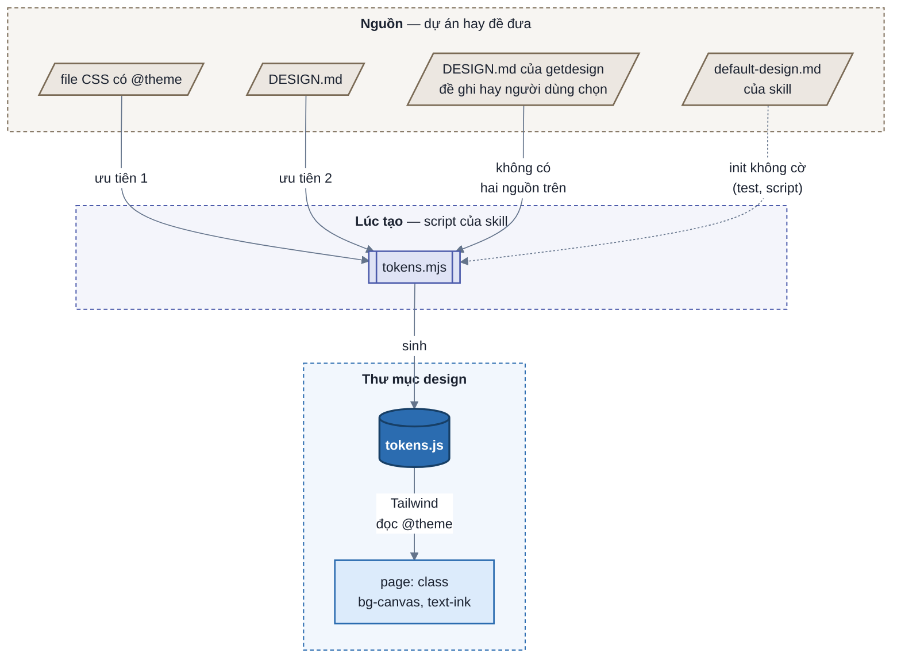
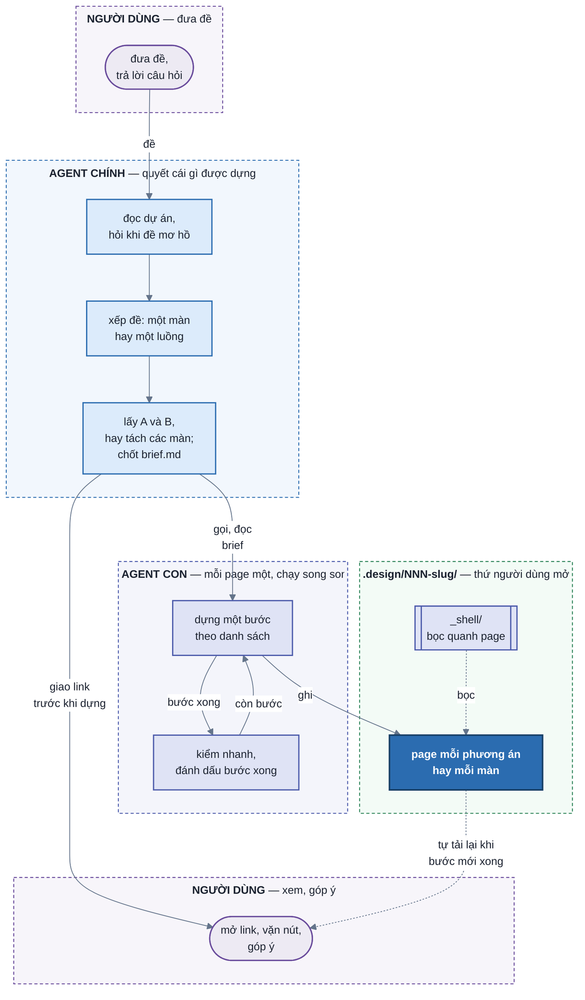

# SPEC — `design-uiux`

## 1. Mục tiêu

Skill nhận đề thiết kế và dựng prototype HTML bấm được, để người dùng thử UI, UX trước khi có code.

## 2. Feature requirement

Mỗi scope là một nhóm chức năng, chia thành sub-scope. Mỗi phần của mục 3 mở đầu bằng dòng **Scope:** ghi các scope
hay sub-scope nó phục vụ.

SPEC chỉ tả những gì skill đang làm. Yêu cầu nào do việc nào đưa vào, việc nào còn chờ: [PLANS.md](PLANS.md).

- **`F1` Đề và phương án**
  - `F1.1` Nếu agent chưa viết được 3 tình huống dùng hay chưa biết dữ liệu có gì, thì agent hỏi người dùng bằng câu
    có sẵn đáp án, tối đa 3 lượt.
  - `F1.7` Agent không hỏi thứ đọc được từ dự án: design system, màn đang có, bề rộng trang.
  - `F1.11` Agent xếp đề vào một màn (người dùng làm việc trên một màn hình) hay một luồng (người dùng đi qua nhiều
    màn hình nối nhau) trước khi tìm phương án.
  - `F1.12` Nếu chưa xếp được đề là một màn hay một luồng, thì agent hỏi người dùng trong lượt hỏi làm rõ.
  - `F1.2` Khi đề là một màn, agent dựng hai phương án A và B và không hỏi người dùng chọn.
  - `F1.13` Nếu đề một màn xin hơn hai phương án, thì agent dựng hai phương án A và B và nói lý do trong chat.
  - `F1.14` Nếu ba phép thử chỉ còn một phương án, thì agent dựng một page và nói lý do trong chat.
  - `F1.19` Nếu đề một màn xin một phương án, thì agent dựng một page và nói lý do trong chat.
  - `F1.18` Agent đặt tên phương án bằng cụm danh từ tả cách cả page được bày.
  - `F1.15` Khi đề là một luồng, agent dựng đúng một phương án.
  - `F1.16` Khi đề là một luồng, agent in bảng các màn của luồng vào chat trước khi dựng.
  - `F1.8` Mỗi phương án được dựng là một page.
  - `F1.17` Mỗi màn của luồng là một page.
  - `F1.3` Mọi page dùng chung: một bộ dữ liệu, một bộ nút dữ liệu, một bề rộng trang, một bảng số khối, một cách
    xử lý cặp màu không đủ đọc.
  - `F1.9` Nếu một phương án cần rộng hơn bề rộng chung, thì page khai bề rộng riêng kèm lý do.
  - `F1.4` Với `--auto`, agent chọn đáp án khuyên dùng thay người dùng, không dừng hỏi.
  - `F1.10` Với `--auto`, lúc giao agent kể lại từng lựa chọn đã tự chọn.
  - `F1.5` Nếu thư mục có từ hai page trở lên, thì mỗi page do một agent con dựng, các agent con chạy song song.
  - `F1.6` Agent ghi vào `brief.md` mọi câu hỏi, lựa chọn và điều phải đoán, kèm ai quyết: người dùng, `--auto`, AI
    đoán.
- **`F2` Shell**
  - `F2.1` Người xem vặn từng nút dữ liệu, hoặc chọn một bộ dữ liệu có sẵn.
  - `F2.2` Người xem vặn cấu hình: role, bố cục, độ dày.
  - `F2.3` Người xem đổi khổ màn (desktop, tablet, mobile) và giao diện (sáng, tối).
  - `F2.4` Người xem chuyển giữa các phương án bằng nút A B.
  - `F2.5` Khi người xem mở một link đã chép, page hiện đúng các giá trị lúc chép.
  - `F2.6` Trong lúc xem thư mục luồng, người xem chuyển màn bằng dãy màn trên toolbar hay nút trong page.
  - `F2.7` Khi người xem chuyển màn trong luồng, chữ đã nhập ở các màn giữ nguyên.
- **`F3` Page**
  - `F3.1` Page lấy màu, chữ, khoảng cách từ design system được đưa: `DESIGN.md`, file token, component của dự án.
  - `F3.5` Nếu design system thiếu giao diện sáng hay tối, thì `tokens.mjs` suy ra giao diện đó và shell ghi
    "(suy ra)".
  - `F3.6` Nếu đề không chỉ định design system và dự án không có file CSS có `@theme` hay `DESIGN.md`, thì agent in
    vào chat danh sách các design của getdesign mà `tokens.mjs` đọc được.
  - `F3.7` Khi agent đã in danh sách design của getdesign, agent hỏi người dùng chọn một design bằng câu có sẵn đáp
    án: bốn design hợp đề nhất.
  - `F3.8` Khi người dùng chọn một design của getdesign, page lấy màu, chữ, khoảng cách từ `DESIGN.md` của design đó,
    tải vào thư mục design.
  - `F3.2` Khi người xem bấm tab, lọc, modal, thêm hay xoá, page đổi theo trên dữ liệu giả.
  - `F3.3` Page có đủ trạng thái: có dữ liệu, đang tải, rỗng, lỗi, và trạng thái riêng của đề.
  - `F3.4` Nếu tài liệu hay component của design system làm khác một luật UI, thì page theo design system và
    `brief.md` ghi dẫn chứng.
  - `F3.9` Nếu design system làm khác một luật UI có phục vụ một luật UX, thì `brief.md` ghi cách page vẫn giữ luật UX
    đó.
- **`F4` Góp ý**
  - `F4.1` Khi người dùng góp ý một phương án, agent sửa thẳng page của phương án đó, không tạo page mới.
  - `F4.2` Nút phương án hiện ngày sửa và góp ý cuối của page đó.
  - `F4.3` Nếu góp ý đổi dữ liệu chung, thì agent sửa mọi page theo dữ liệu mới.
  - `F4.4` Khi người dùng góp ý một page, mỗi ý thành một bước dựng mới trong danh sách bước dựng của page đó.
- **`F5` Kiểm tra trước khi giao**
  - `F5.1` Máy kiểm chạy page qua mọi tổ hợp: cấu hình × sáng tối × trạng thái, từng bộ dữ liệu có sẵn, khổ mobile và
    desktop.
  - `F5.4` Máy kiểm bấm thử từng loại thứ bấm được trên page.
  - `F5.8` Khi kiểm thư mục luồng, máy kiểm đi được từ màn đầu tới màn cuối bằng nút trong page.
  - `F5.2` Máy kiểm đo phần đo được của từng luật trong `references/ux-principles.md` và `references/ui-principles.md`.
  - `F5.5` Agent soát phần còn lại của từng luật trên ảnh trong `shots/`.
  - `F5.3` Nếu còn lỗi chưa sửa được, thì lúc giao agent kể ra từng lỗi.
  - `F5.6` Agent chạy kiểm nhanh một tổ hợp trước khi đánh dấu một bước dựng xong.
  - `F5.7` Nếu page còn bước dựng chưa xong ngoài bước kiểm đầy đủ, thì máy kiểm báo lỗi.
- **`F6` Tiến độ dựng**
  - `F6.1` Khi agent bắt đầu dựng một page, agent đưa link page đó trong chat trước khi page có khối đầu tiên.
  - `F6.2` Agent dựng page theo danh sách bước dựng và đánh dấu từng bước khi bước đó xong.
  - `F6.3` Khi một bước dựng được đánh dấu xong, page đang mở tự tải lại và giữ nguyên giá trị đang xem và vị trí cuộn.
  - `F6.4` Nếu người xem đang gõ trong ô nhập ở bất kỳ khổ màn nào, thì page đợi tới khi con trỏ rời ô mới tải lại.
  - `F6.5` Toolbar hiện page đang chuẩn bị, đang dựng, đang sửa theo góp ý, đang kiểm lại hay đã xong.
  - `F6.6` Nếu agent dựng page bị ngắt, thì agent được gọi lại làm tiếp từ bước dựng đầu tiên chưa xong.
  - `F6.7` Nếu một agent con bị ngắt trong lúc các agent con khác đang dựng, thì agent chính chỉ gọi lại agent bị ngắt.
  - `F6.8` Trong lúc một bước dựng chưa xong, danh sách bước dựng trên toolbar hiện việc con agent đang làm, một dòng thụt vào ngay dưới bước đó.
  - `F6.9` Trong lúc page chưa có khối đầu tiên, page hiện tên màn, tên page, bố cục page hay việc của màn, và các việc page tiện cho.
  - `F6.10` Toolbar chỉ ghi page đã xong sau khi agent chính đánh dấu bước giao.
  - `F6.11` Toolbar ghi ngày sửa cuối của page ở cuối danh sách bước dựng, không ghi trên nhãn trạng thái.

Bảng dưới phân biệt phương án (`F1.2`) và màn của luồng (`F1.17`) với thứ người xem vặn được (`F2`).

| Hai bản khác nhau ở | Là | Người xem đổi bằng |
| --- | --- | --- |
| màn này phục vụ ai trước, lúc nào, để biết gì | **phương án** (`F1.2`) | nút A B trên toolbar, mỗi phương án một page |
| người dùng đang ở chỗ nào của luồng | **màn của luồng** (`F1.17`) | dãy màn trên toolbar, nút trong page, mỗi màn một page |
| bố cục, độ dày, role, loại biểu đồ trên cùng dữ liệu | **tweak** (`F2.2`) | config-panel của page đó |
| dữ liệu mang tới: số lượng, ngưỡng, tên dài, `state` | **variable** (`F2.1`) | data-panel, mọi page chung một bộ |
| khổ màn, sáng tối | **cách nhìn** (`F2.3`) | view-controller, page không khai |

## 3. Technical design

Bốn phần, mỗi phần một chủ:

| Phần | Là gì | Chủ | Scope |
| --- | --- | --- | --- |
| **agent** | agent chính hỏi, chọn phương án, chuẩn bị; agent con dựng page theo danh sách bước dựng | `SKILL.md` cho agent chính, `references/build-page.md` cho agent dựng page | `F1` `F4` `F6.1` `F6.2` `F6.5` `F6.6` `F6.7` `F6.8` `F6.10` |
| **bản thiết kế** | page `NN-slug.html`, `tokens.js`, danh sách bước dựng `NN-slug.progress.js` | agent dựng, script sinh token, `new-design.mjs progress` | `F3` `F6.2` `F6.9` |
| **shell** | `_shell/` bọc quanh page: toolbar, panel, khung mobile / tablet, URL, nhãn tiến độ, tự tải lại | skill mang theo, page không đụng | `F2` `F4.2` `F6.3`–`F6.5` `F6.8` `F6.10` `F6.11` |
| **máy kiểm** | `check.mjs`, `principles-check.mjs` | skill mang theo | `F5` |

### 3.1 Thư mục design

**Scope:** `F1.2` `F1.3` `F1.8` `F1.16` `F1.17` `F4` `F6.2` `F6.5` `F6.8` `F6.9` `F6.10`

Mỗi đề một thư mục `.design/NNN-slug/` ở thư mục làm việc lúc gọi skill. Mọi thư mục design dùng chung
`.design/_shell/`. Một thư mục là **thư mục phương án** (đề một màn, mỗi page một phương án) hay **thư mục luồng**
(đề một luồng, mỗi page một màn), không trộn.

| File | Ai ghi | Vai |
| --- | --- | --- |
| `brief.md` | agent chính | thoả thuận chung mọi page phải theo: quyết định, design system, cặp màu không đủ đọc, dữ liệu chung, nút dữ liệu chung, số khối, số kiểm chéo; thư mục luồng thêm bảng Luồng: mỗi màn để làm gì, nhận gì từ màn trước, đưa gì cho màn sau |
| `tokens.js` | `new-design.mjs init` | token của design system |
| `pages.js` | `new-design.mjs page` · `touch` | danh sách page theo thứ tự: tên phương án, bố cục và việc page tiện cho (`option`), hay tên màn và việc của màn (`screen`); ngày sửa, góp ý cuối |
| `NN-slug.html` | `new-design.mjs page` tạo với khối chờ; agent con dựng tiếp, mỗi agent đúng một file | một phương án, hay một màn của luồng |
| `NN-slug.progress.js` | `new-design.mjs page` tạo; agent chính đánh dấu bước chuẩn bị và bước giao; agent dựng page đó ghi phần còn lại; mọi lần ghi qua `new-design.mjs progress` | bước chuẩn bị (`prep`); bước giao (`deliver`); danh sách bước dựng của page: sáu bước dựng, rồi các bước góp ý theo vòng; bước nào xong; việc con của bước dở (`doing`); `rev` tăng mỗi lần đánh dấu, ghi việc con thì không |
| `shots/` | `check.mjs` | ảnh từng tổ hợp, từng cú bấm |

Mỗi file đúng một người ghi tại một lúc, nên các agent con chạy song song không giẫm nhau. Agent chính chỉ ghi bước
chuẩn bị và bước giao của mọi page: bước chuẩn bị trước khi gọi agent con, bước giao sau khi mọi agent con đã trả về.
Danh sách bước dựng là chỗ duy nhất
nói page đã tới đâu: shell đọc nó để hiện tiến độ, agent được gọi lại đọc nó để làm tiếp, máy kiểm đọc nó để chặn page
dựng dở.

Sáu bước dựng cố định cho mọi page: khung các khối và dữ liệu mặc định · đang tải, rỗng, lỗi · trạng thái riêng của đề
· tương tác · preset và ca biên · kiểm đầy đủ. Agent được chèn bước trước bước kiểm đầy đủ, không được bớt. Lệnh
`progress` ghi ra file tạm rồi rename, để shell không đọc phải file ghi dở. Mọi thứ các page phải giống nhau
nằm ở `brief.md` và `tokens.js`, không nằm trong từng page.

Bước chuẩn bị là việc agent chính viết `brief.md`. Nó nằm riêng, ngoài sáu bước dựng, nên sáu bước giữ nguyên số. Lúc
bước chuẩn bị chưa xong, lệnh `progress` không nhận đánh dấu hay ghi việc con của bước dựng. File tiến độ không có bước
chuẩn bị là page tạo trước khi có bước này: coi như đã chuẩn bị xong.

Bước giao là việc agent chính kiểm lại rồi giao: kiểm cả thư mục, so số kiểm chéo, viết tin giao. Nó nằm riêng, sau
mọi vòng, vì agent con không làm được việc đó. Agent chính đánh dấu bước giao ngay trước tin giao, và chỉ khi mọi bước
dựng đã xong. Mở vòng góp ý thì bước giao mở lại. File tiến độ không có bước giao coi như đã giao.

Page mới chỉ có khối chờ, `new-design.mjs page` điền từ cờ của lệnh: dòng tên màn (phần trước ` · ` của `--title`),
tiêu đề (`--option` hay `--screen`), phụ đề (`--layout` hay `--purpose`), dòng nhỏ ("Tiện cho: `--good-for`"). Cờ
nào thiếu thì không có dòng đó. Câu hỏi trung tâm, đơn vị chính, cái hy sinh là cách agent so phương án, nằm ở bảng
`## Tình huống` của `brief.md`, không in ra page. Bước dựng 1 thay khối chờ bằng các khối thật.

### 3.2 Design system thành token

**Scope:** `F3.1` `F3.5` `F3.6` `F3.7` `F3.8`

- `tokens.mjs` đọc khối `@theme` của file CSS hay phần YAML đầu `DESIGN.md`, ra `tokens.js`. File này chèn một thẻ
  `<style type="text/tailwindcss">` có `@theme` vào page; Tailwind bản trình duyệt đọc nó và sinh class theo tên
  token (`--color-canvas` → `bg-canvas`). Token để ở file `.js` chứ không ở `.css` vì mở bằng `file://` thì Tailwind
  không đọc được stylesheet ngoài.
- File CSS có `@theme` thắng `DESIGN.md` vì đó là giá trị app đang chạy.
- Đề không chỉ định design system và dự án không có hai nguồn trên thì agent cho người dùng chọn một design của
  getdesign:
  - `new-design.mjs designs` đọc `templates/` của gói `getdesign` qua `npx`, giữ bộ nào `tokens.mjs` đọc được, in
    `tên - mô tả`. Bộ chỉ có phần chữ, không có YAML đầu file, bị bỏ.
  - `new-design.mjs init --getdesign <tên>` tải bằng `getdesign add --out` vào thư mục tạm, sinh token, rồi mới tạo
    thư mục design và chép `DESIGN.md` vào đó. `tokens.js` ghi nguồn `getdesign <tên>`.
  - Đề tự ghi lệnh `npx getdesign@latest add <tên>` cũng đi qua `init --getdesign`, để không file nào nằm ngoài
    `.design/`.
  - Hai lệnh thoát mã 2 khi `npx` hỏng (gói đổi cấu trúc, registry lỗi); agent dừng, in dòng lỗi vào chat, không
    dựng page.
- `default-design.md` chỉ là token khi `init` không có `--tokens` hay `--getdesign`: các script kiểm của skill dùng nó.
  Agent không dựng page bằng bộ này.
- Sáng tối là biến thể `dark` của Tailwind, bật bằng `[data-theme="dark"]`.
- Nếu design system chỉ có một giao diện, thì `tokens.mjs` suy giao diện kia theo vai màu:
  - nền, chữ, viền: đảo độ sáng;
  - màu nhấn: giữ sắc, chỉnh độ sáng tới khi đủ tương phản;
  - `primary`: giữ nguyên.
- `window.DESIGN_THEME.derived` ghi giao diện nào là suy ra. Shell đọc nó để hiện chữ "(suy ra)".
- Page không có mã màu nào; mọi màu đi qua token.

### 3.3 Page chạy thế nào

**Scope:** `F2` `F3.2`

- **Thứ tự nạp cố định:** `tokens.js` → `pages.js` → `window.DESIGN` → `shell.js` → Tailwind → icon → Alpine (defer).
  Danh sách page và token nạp bằng thẻ `<script>` vì Chrome chặn `fetch` file local.
- **Một store cho mọi giá trị vặn.** `shell.js` dựng `Alpine.store("design")` từ `default` của từng nút, đè bằng giá
  trị trên URL. Khổ màn và sáng tối là hai key cố định của store. Page đọc `$store.design.<key>`; vặn nút thì Alpine
  chỉ vẽ lại phần phụ thuộc key đó, modal đang mở và ô đang gõ giữ nguyên.
- **URL là bản lưu.** Mỗi lần store đổi, `history.replaceState` ghi giá trị khác mặc định lên URL, không tải lại trang.
  Chép link là chép đúng cái đang xem; tải lại không mất gì.
- **Khổ mobile / tablet là iframe của chính page** kèm `frame=1`, để media query chạy thật. Trang cha gửi giá trị vào
  iframe bằng `postMessage`, vì mở bằng `file://` thì không đọc thẳng được vào iframe. Page trong iframe không vẽ shell.
- **Tương tác của page** (tab, lọc, modal, thêm, xoá) là state Alpine riêng trong từng khối, chạy trên dữ liệu giả sinh
  từ variables. Không gọi API.

### 3.4 Shell

**Scope:** `F2` `F4.2` `F6.3` `F6.4` `F6.5` `F6.8`

| Khối | Đọc từ | Làm gì |
| --- | --- | --- |
| option-switcher | `pages.js` | thư mục phương án: nút A B sang page khác, giữ khổ màn và sáng tối; rê vào thấy mô tả phương án, ngày sửa và góp ý cuối. Thư mục luồng: dãy màn "1 · Welcome → 2 · Đăng ký", sang page khác giữ mọi giá trị trên URL; rê vào thấy việc của màn |
| view-controller | `DESIGN_THEME` | khổ màn, sáng tối, số khối, về mặc định |
| data-panel | `DESIGN.variables`, `presets` | vặn dữ liệu; loại ô theo `type` của nút |
| config-panel | `DESIGN.tweaks` | vặn cấu hình |
| nhãn tiến độ | `NN-slug.progress.js`, `pages.js` | "Đang chuẩn bị", "Đang dựng a/b", "Đang sửa a/b", "Đang kiểm lại" hay "✓ Xong"; nhãn xong không có con số, ngày sửa cuối là dòng cuối danh sách ("Sửa lần cuối 9 thg 10"); khi page chưa xong, nhãn có vòng lan từ chấm, việc con "· <việc>" và thanh tiến độ ở đáy có vệt sáng chạy, chỉ vẽ lại khi nội dung đổi; bấm vào thấy danh sách bước dựng theo vòng; bước dở có `doing` thì thêm một dòng việc con thụt vào ngay dưới nó |

- **Tự tải lại theo danh sách bước dựng.** Trang cha cứ 2 giây, khi tab đang hiện, chèn lại thẻ `<script>` trỏ tới
  `NN-slug.progress.js?t=<giờ>`; đây là cách duy nhất đọc lại một file trên `file://` mà không tải page. Khi `rev`
  khác lần đọc trước, trang cha tải lại. Khi `rev` giữ nguyên, trang cha chỉ vẽ lại danh sách bước, để việc con mới
  hiện ra. Giá trị vặn nằm trên URL nên còn nguyên; vị trí cuộn lưu vào `sessionStorage` lúc rời trang và lấy lại khi
  lần mở là một lần tải lại.
- **Đợi người xem gõ xong.** Nếu ô nhập đang có con trỏ, thì trang cha đợi con trỏ rời ô mới tải lại. Ở khổ tablet,
  mobile, ô nhập nằm trong iframe mà trang cha không đọc vào được, nên page trong iframe báo lên bằng `postMessage`
  mỗi khi con trỏ vào hay rời ô.
- **Lượt đọc hỏng không phải là hết tiến độ.** Thẻ script báo lỗi nạp thì page không có danh sách: coi như đã xong,
  thôi đọc (page dựng trước khi có danh sách bước dựng). Nạp được mà thiếu dữ liệu là đọc phải file đang ghi: bỏ lượt
  đó, đọc lại lượt sau.
- Một shell chung ở `.design/_shell/`, `new-design.mjs init` hay `shell` chép bản mới nhất của skill vào. Shell chỉ
  bọc quanh page nên cập nhật shell không đổi hình bản thiết kế cũ.
- Thư mục luồng: shell cho page `$store.design.next()` · `prev()` để nút "Tiếp tục", "Quay lại" trong page sang màn
  kề, giữ mọi giá trị trên URL. Chữ người xem gõ ở các màn nằm trong `$store.design.form`, shell lưu nó vào
  `sessionStorage` của thư mục design; chữ gõ không lên URL, nên link chép không mang theo mật khẩu mẫu.
- Chữ trên shell theo `DESIGN.lang`. Màu, bố cục, cách vẽ từng loại ô: [`references/shell-principles.md`](references/shell-principles.md).
  Sửa shell thì chạy `scripts/test-shell.mjs`.

### 3.5 Agent

**Scope:** `F1` `F4` `F6.1` `F6.2` `F6.5` `F6.6` `F6.7`

- **Agent chính quyết cái gì được dựng** (`F1.1` `F1.2` `F1.11`–`F1.16` `F3.6` `F3.7`), theo thứ tự:
  1. Đọc design system và màn đang có. Không có design system thì lấy danh sách design của getdesign.
  2. Nếu đề mơ hồ, hay chưa rõ là một màn hay một luồng, thì hỏi bằng AskUserQuestion. Không có design system thì
     in danh sách design vào chat và đưa câu chọn design vào lượt hỏi đầu tiên; câu này không tính vào 3 lượt hỏi
     làm rõ. Đề không mơ hồ thì lượt đó chỉ có câu chọn design.
  3. Xếp đề: một màn hay một luồng.
  4. Một màn: tìm phương án theo tình huống dùng, lấy hai phương án A và B, in bản phác vào chat, không hỏi chọn. Ba
     phép thử chỉ còn một phương án thì dựng một và nói lý do. Một luồng: tách luồng thành các màn, điền bảng Luồng,
     in bảng vào chat.
  5. Tạo page trống bằng `new-design.mjs page` (`--option` cho phương án, `--screen` cho màn), rồi in link mọi page
     ngay (`F6.1`). Mỗi page trống có khối chờ, bước chuẩn bị và danh sách sáu bước dựng. Tên phương án là cụm danh từ
     tả cách cả page được bày (`F1.18`).
  6. Chốt `brief.md`, rồi đánh dấu bước chuẩn bị của mọi page (`F6.5`).
  7. Từ hai page trở lên thì gọi mọi agent con trong cùng một lượt, chạy nền; một page thì agent chính tự dựng.
  8. Khi mọi page xong, kiểm cả thư mục và so số kiểm chéo với brief.
  9. Đánh dấu bước giao của mọi page (`F6.10`), rồi giao tin cuối.
- **Agent con dựng đúng một page**, theo thứ tự (`F6.2`):
  1. Đọc `references/build-page.md`, `references/ux-principles.md`, `references/ui-principles.md` và `brief.md`.
     Lời giao chỉ mang chỗ phải đọc và phần riêng của page: phương án hay màn, bố cục, tiện cho, bản phác. Thư mục
     một page thì agent chính tự dựng theo đúng file `build-page.md` đó, nên luật dựng page không phụ thuộc ai dựng.
  2. Lấy bước dựng đầu tiên chưa xong bằng `new-design.mjs progress`, dựng bước đó, chạy `check.mjs --quick`, sạch thì
     đánh dấu bước xong. Lặp tới bước kiểm đầy đủ.
  3. Bước kiểm đầy đủ: chạy `check.mjs` tới khi sạch, mở ảnh trong `shots/`, đi danh sách tự kiểm.
  4. Trả kết quả về agent chính.
- **Bị ngắt** (`F6.6` `F6.7`): agent chính chỉ gọi lại agent con bị ngắt, cùng lời giao; các agent con khác chạy tiếp.
  Agent được gọi lại đọc danh sách bước dựng, đọc page đang có, rồi làm tiếp từ bước đầu tiên chưa xong.
- **`brief.md` giữ các page so được** (`F1.3`): mọi page sinh dữ liệu giả theo "Dữ liệu chung", khai đúng bộ key của
  "Nút dữ liệu chung", đánh `data-block` theo bảng "Khối", dùng cặp màu theo "Cặp màu không đủ đọc", trả về các "Số
  kiểm chéo" để agent chính so. `new-design.mjs init` in các cặp màu dưới 4.5 : 1 để agent chính chốt bảng đó trước khi
  gọi agent con.
- **Góp ý** (`F4`): `new-design.mjs progress --round` thêm mỗi ý thành một bước của vòng mới (`F4.4`), sửa thẳng page
  của phương án đó theo từng bước như lúc dựng, chạy lại `check.mjs`, rồi `new-design.mjs touch` ghi ngày và góp ý
  vào `pages.js`. Góp ý đổi dữ liệu chung thì sửa `brief.md` trước, rồi sửa mọi page cho khớp.
- **Bảng Luồng giữ các màn nối khớp** (`F1.16` `F1.17`): mỗi màn một dòng: tên, để làm gì, nhận gì từ màn trước, đưa
  gì cho màn sau (key `form.*`), trạng thái riêng, file. Agent con của màn nào cũng đọc cả bảng, nên nút "Tiếp tục" và
  ô nhập của các màn kề nhau khớp key.
- **`--auto`** (`F1.4`): vẫn soạn câu hỏi làm rõ, nhưng thay chỗ gọi AskUserQuestion bằng đáp án khuyên dùng; mỗi lựa
  chọn là một dòng `--auto` trong bảng Quyết định của `brief.md`. Chọn phương án không hỏi người dùng nên không có gì
  để `--auto` thay.

### 3.6 Máy kiểm

**Scope:** `F5` `F3.4` `F3.9` `F1.3` `F1.2`

- **`check.mjs --quick`** (`F5.6`) kiểm một page ở một tổ hợp: lượt tĩnh, lỗi console, lỗi JS, bố cục và dò luật ở
  1280px, sáng, tweak mặc định, `state` theo `--state` hay preset theo `--preset`. Chạy 1–2 giây, nên chạy được sau
  từng bước dựng, kể cả khi bốn agent con cùng chạy một lúc.
- **`check.mjs`** chỉ đọc, không sửa page. Nó chạy ba lượt:
  - **Lượt tĩnh** đọc file: thứ tự nạp, mã màu, `brief.md`, `pages.js`, bộ key variables.
  - **Lượt tổ hợp** mở page bằng Playwright qua `file://`, chạy mọi tổ hợp tweak × sáng tối × `state` cộng từng preset
    ở 375 và 1280px.
  - **Lượt bấm** bấm từng loại thứ bấm được trên page, ở tổ hợp đầu tiên thứ đó hiện ra.
- Lượt tổ hợp và lượt bấm đo: lỗi console, cuộn ngang, chữ đè, khung nổi lọt màn hình, nút vặn mà UI không đổi, URL
  mở lại đúng giá trị, page vặn tại chỗ hiện khác page mở lại từ link. Ảnh lưu vào `shots/`.
- Cả thư mục: page dùng `data-block` ngoài bảng "Khối" của `brief.md`, nút chính các page khác màu, thư mục phương án
  có quá hai page.
- Kiểm đầy đủ báo `còn bước chưa xong` nếu danh sách bước dựng của page còn bước chưa xong ngoài bước kiểm đầy đủ của
  vòng đang mở (`F5.7`). Page không có danh sách thì bỏ qua.
- **Lượt đi luồng** (thư mục luồng): mở màn 1 ở mặc định, điền các ô `form.*` bằng chữ mẫu, bấm thứ gọi `next()` tới
  màn cuối, rồi `prev()` một lần và kiểm ô của màn trước còn chữ. Ở lượt bấm, cú bấm làm page sang một file trong
  `pages.js` là hợp lệ.
- **`principles-check.mjs`** đo phần máy đo được của từng luật trong [`references/ux-principles.md`](references/ux-principles.md)
  và [`references/ui-principles.md`](references/ui-principles.md) ở lượt tĩnh, mỗi tổ hợp, lượt bấm và cả thư mục; lỗi
  mang ID luật (`[UX10]`, `[UI4]`). Luật UI có trong bảng "Luật UI theo design system" của `brief.md` thì bỏ qua. Bảng
  ghi luật UX, mã cũ, hay luật UI có dòng `Phục vụ` mà thiếu cột "Giữ luật UX bằng", thì máy kiểm báo lỗi. Luật có
  trong hai file mà không có phép kiểm thì dừng.
- Exit `0` sạch · `1` có lỗi · `2` không chạy được. Playwright cài vào thư mục tạm, không cài vào dự án.

## 4. Vì sao thiết kế như vậy

### Hỏi và chọn phương án

| Quyết định | Lý do |
| --- | --- |
| không hỏi thứ đọc được từ dự án | design system, màn đang có, bề rộng trang đều nằm trong code; hỏi lại là bắt người dùng làm việc của agent |
| hỏi bằng câu có sẵn đáp án, đáp án khuyên dùng đứng đầu | chọn nhanh hơn viết, và đáp án cho người dùng thấy các khả năng. Gõ chữ riêng vẫn được |
| "đủ rõ" là viết được 3 tình huống dùng và biết dữ liệu có gì; tối đa 3 lượt | cần một điểm dừng đo được, không thì hỏi mãi. Ba lượt mà chưa rõ thì đoán có ghi lại vẫn tốt hơn bắt trả lời tiếp |
| phương án đi từ tình huống dùng, không từ kiểu hiển thị | chọn theo hình dáng ra hai phương án trả lời cùng một câu và bỏ sót câu hay gặp nhất. Bảng tình huống × phương án bắt được cả hai |
| ba phép thử: tweak · thắng · trùng | phương án chỉ khác bố cục thì một nút ở config-panel đã làm được; dựng page riêng là tốn công mà người dùng phải chọn giữa hai bản gần giống nhau |
| xếp đề vào một màn hay một luồng trước khi tìm phương án | một màn cần so hướng; một luồng cần thấy đủ các màn nối nhau. Hai việc khác nhau từ đầu, nên đi hai nhánh khác nhau |
| gọi là "một màn" và "một luồng", không "step / flow" hay "single page / multiple pages" | "step" nghe như một bước bên trong flow; "page" đã là một file HTML, mà đề một màn ra hai page. "Màn", "luồng" là chữ người dùng tự viết trong đề |
| đề một màn dựng hai phương án A và B, không hỏi chọn | người dùng có hai bản để so ngay, không phải đọc bảng rồi tick trước khi có gì để xem |
| tối đa 2 phương án, kể cả khi đề xin nhiều hơn | so A/B là so từng cặp, như A/B testing. Muốn xem hướng thứ ba thì dựng nó thay A hay B |
| ba phép thử chỉ còn một phương án thì dựng một page, nói lý do | bịa B chỉ khác bố cục là bắt người dùng so hai bản gần giống nhau; khác bố cục đã là một nút ở config-panel |
| phương án tả bằng chữ trong chat, không dựng page để chọn | page để chọn tốn công như page thật mà chỉ xem một lần. Bản phác trong chat cho người dùng biết sắp thấy gì, sai hướng thì ngắt sớm |
| đề một luồng chỉ một phương án | nhiều phương án × nhiều màn là quá nhiều page để so |
| bảng các màn in vào chat rồi dựng luôn, không hỏi xác nhận | hỏi thêm một lượt là thêm một lần chờ trước khi có link; sai màn thì góp ý sau |
| mọi quyết định ghi vào brief kèm ai quyết (`người dùng` · `--auto` · `AI đoán`) | người đọc thấy ngay chỗ nào AI đoán để soi, thay vì quyết định rải ở nhiều mục |
| không có design system thì hỏi chọn một bộ của getdesign, không lặng lẽ dùng bộ mặc định | bộ mặc định làm mọi prototype không có design system trông như nhau dù đề là app gì; người dùng không biết có lựa chọn khác |
| danh sách chỉ gồm design `tokens.mjs` đọc được | 8/76 bộ của getdesign chỉ có phần chữ, không có YAML. Chọn rồi mới báo không dựng được thì người dùng phải chọn lại. Agent tự chép màu từ phần chữ thì dễ gán sai vai màu |
| câu chọn design có bốn design getdesign hợp đề, không có đáp án bộ mặc định; tên khác gõ qua "Other" | AskUserQuestion cho tối đa 4 đáp án. Bộ mặc định làm mọi prototype trông như nhau, đúng thứ việc chọn design muốn tránh |
| câu chọn design đi chung lượt hỏi đầu, không tính vào 3 lượt | hỏi lượt riêng là thêm một lần chờ; câu này không làm rõ đề nên không ăn vào số lượt dành cho đề |
| danh sách in đủ vào chat, trước câu hỏi | ba gợi ý không cho người dùng biết còn gì để chọn |
| getdesign lỗi thì dừng, báo lỗi, không lùi về bộ mặc định | máy chạy skill luôn có mạng; getdesign lỗi là việc phải sửa, dựng bằng bộ mặc định thì che mất lỗi |
| `--auto` vẫn soạn đủ câu hỏi và phương án, chỉ không dừng | chạy thử không phải ngồi trả lời, mà vẫn để lại dấu đã tự chọn gì để so với lần hỏi thật |

### Dựng

| Quyết định | Lý do |
| --- | --- |
| mỗi phương án một agent con, chạy song song | chọn ba phương án thì không phải chờ ba lượt nối nhau |
| agent chính tạo thư mục, `pages.js`, page trống và brief trước; agent con chỉ sửa đúng file của mình | để agent con tự tạo page thì chúng tranh nhau ghi `pages.js`, số page trùng |
| brief chốt dữ liệu chung, bộ key variables chung và vài con số kiểm chéo | các page phải so được trên cùng con số. Công thức viết bằng chữ luôn có chỗ hai người hiểu khác nhau; con số cụ thể chốt cách hiểu |
| brief chốt số khối và cách xử lý cặp màu không đủ đọc trước khi gọi agent con | agent con chạy song song không thấy page của nhau; để mỗi agent tự quyết thì cùng khối mang số khác, nút chính mỗi page một màu |
| bề rộng trang lấy từ layout của app, mọi page dùng chung | bề rộng là của app, không phải của phương án. Mỗi page tự chọn thì phương án hẹp trông thoáng hơn chỉ vì hẹp |
| mỗi màn của luồng một page, không gộp cả luồng vào một page | các page dựng song song được; đi qua luồng bằng nút "Tiếp tục" giống đi qua các màn thật. Gộp vào một page thì một agent dựng tuần tự, page lớn, lâu có bản đầu |
| bảng Luồng trong brief chốt mỗi màn nhận gì, đưa gì | agent con dựng song song không thấy page của nhau; không có bảng thì màn 2 đưa `email`, màn 3 đọc `mail`
| dựng theo sáu bước cố định, đánh dấu từng bước | ghi cả page một lần thì 3–5 phút đầu người dùng không có gì để xem và bị ngắt là mất cả page. Bước 1 ra ngay bản xem được; mỗi bước sau thêm một thứ người xem vặn thấy. Agent tự đặt bước thì mỗi page một kiểu, kiểm đầy đủ không biết lấy gì để so |
| đưa link ngay sau khi tạo page trống, trước khi dựng | link sớm là điều kiện để người dùng xem và ngắt sớm khi thấy sai hướng; tin giao cuối vẫn đợi kiểm cả thư mục sạch |
| danh sách bước dựng ở file riêng mỗi page, chỉ agent của page đó ghi | page chỉ đọc lại được một file `.js` riêng mà không tải lại. Để trong page thì chỉ đọc được sau khi tải; để trong `pages.js` thì các agent con tranh nhau ghi |
| ghi danh sách ra file tạm rồi rename; lượt đọc thiếu dữ liệu thì bỏ qua | đo thử: ghi thẳng thì khoảng 9% lượt đọc trúng file ghi dở; rename còn vài lượt khi ghi dồn dập. File ghi dở luôn trông như nạp được mà thiếu dữ liệu, không như file không có, nên shell phân biệt được |
| song song giữ nguyên khi thêm tiến độ: không có bước nào chờ chung | mỗi page một danh sách, một agent; một agent con bị ngắt thì chỉ gọi lại agent đó. Gọi lại cả lượt thì page đang dựng tốt bị dựng lại |

### Page và shell

| Quyết định | Lý do |
| --- | --- |
| HTML mở thẳng bằng `file://`, không server | người xem mở là chạy, không có tiến trình phải bật tắt. Chrome chặn `fetch` file local, nên `pages.js`, `tokens.js` nạp bằng thẻ `<script>` |
| Tailwind bản trình duyệt, class theo tên token, không mã màu trong page | mọi màu đi qua token nên không lệch design system, đổi sáng tối là đổi theo. CSS viết tay thì mỗi page tự đặt tên class |
| Alpine.js, giá trị vặn ghi lên URL | vặn nút chỉ vẽ lại phần phụ thuộc, modal đang mở và ô đang gõ giữ nguyên; chép link gửi đi mở ra đúng giá trị đang xem; tải lại không mất gì |
| khổ mobile / tablet là iframe của chính page | media query chạy thật, không phải giả bằng JS đo bề rộng |
| chữ người xem gõ ở các màn của luồng nằm trong `sessionStorage`, không trên URL | quay lại màn trước phải còn chữ như app thật; để trên URL thì link chép mang theo mật khẩu mẫu, link dài |
| design system thiếu sáng hay tối thì suy ra, ghi "(suy ra)" | prototype phải xem được cả hai giao diện, mà người xem cần biết giao diện nào không đến từ design system |
| vẽ cho trông giống component của dự án, không chép code | prototype không nối với code; cái cần là đặt cạnh màn đang có thì so được |
| vặn nút nào UI cũng phải đổi thấy được; kết quả chỉ có sau một cú bấm thì là một giá trị của `state` | nút vặn mà không thấy gì thì người xem không biết nó có tác dụng |
| một shell chung `.design/_shell/` cho mọi thư mục design | shell chỉ bọc quanh page, không chạm vào bản thiết kế: cập nhật shell thì page cũ có toolbar mới mà hình thiết kế không đổi |
| shell có màu trung tính riêng, không dùng token của design system | shell phải tách khỏi bản thiết kế mà không chói; dùng token thì đổi design system là đổi luôn công cụ xem |
| page tự tải lại khi có bước dựng mới xong, không có nút tải lại, không có server | người dùng muốn thấy tiến độ mà không phải nhớ bấm; server là thêm tiến trình phải bật tắt, chiếm cổng |
| tải lại khi một bước được đánh dấu xong, không phải mỗi lần agent ghi file | bước chỉ được đánh dấu sau khi kiểm nhanh sạch, nên người xem chỉ thấy bản đã chạy được, không thấy page trắng vì lỗi JS giữa chừng |
| đang gõ thì đợi rời ô; ở khổ tablet, mobile thì iframe báo lên bằng `postMessage` | tải lại giữa lúc gõ làm mất chữ. Trên `file://` trang cha không đọc được vào iframe, nên không tự biết người xem đang gõ |
| page không có danh sách bước dựng coi như đã xong | page dựng trước khi có danh sách vẫn mở và kiểm như cũ, không phải sửa |
| bước chuẩn bị nằm riêng ngoài sáu bước dựng, agent chính đánh dấu trước khi gọi agent con | nhãn phải nói đúng việc đang diễn ra: lúc agent chính viết brief, chưa ai dựng. Thêm làm bước dựng 1 thì "a/6" thành "a/7" và số bước lệch bảng sáu bước |
| bước giao nằm riêng sau mọi vòng, agent chính đánh dấu ngay trước tin giao; vòng góp ý mở lại bước này | bước kiểm đầy đủ là của agent con; sau đó agent chính còn kiểm cả thư mục, sửa tới ba vòng. Nhãn báo xong lúc agent con xong thì sai đúng lúc người xem đang đợi. `check.mjs` không tự đánh dấu khi sạch, vì còn lỗi sau ba vòng thì agent vẫn giao |
| nhãn xong không có con số, ngày sửa cuối ở cuối danh sách bước | "09/10" cạnh nhãn "Xong" đọc thành 9 trên 10 bước. Ngày không giúp biết page xong chưa, nên không cần nằm trên nhãn |
| in link ngay sau khi tạo page trống, trước khi viết brief | viết brief mất vài phút; người dùng có link sớm hơn và thấy page đang chuẩn bị |
| khối chờ chỉ có dữ liệu của page: tên màn, tên page, bố cục hay việc của màn, các việc page tiện cho | khối chờ là thứ người mở link sớm đọc đầu tiên; câu hướng dẫn kể chuyện, còn nhãn tiến độ đã nói page đang ở đâu |
| page tả bố cục và việc tiện cho, không in câu hỏi trung tâm, đơn vị chính, cái hy sinh | người xem cần biết page bày thế nào, dùng vào việc gì. "Hy sinh", "đơn vị chính" là chữ agent dùng để so phương án; đọc trên page thì không hiểu, và một câu hỏi trung tâm thu cả page về một nhu cầu |
| tên phương án là cụm danh từ tả cách cả page được bày | tên kiểu chuỗi động từ ("Tìm nhanh để đánh dấu đến") bỏ mất ai làm, làm với cái gì. Tên tả một widget ("Ô tìm bệnh nhân ở đầu trang") làm người xem tưởng page chỉ có widget đó |
| việc con nằm trên bước dở (`doing`), ghi việc con không tăng `rev` | một bước dựng kéo dài 2–3 phút, chỉ thấy tên bước thì người xem không biết agent còn chạy hay đã treo. Việc con không đổi page, nên shell chỉ vẽ lại danh sách; tăng `rev` thì page tải lại mà không có gì mới. Việc con không thành bước riêng, để "a/6" giữ nghĩa |

### Kiểm

| Quyết định | Lý do |
| --- | --- |
| đầu ra kiểm bằng code; chưa sạch thì không nói là xong | lời khai của agent không đáng tin bằng phép đo. Mỗi hứa hẹn về page có một phép kiểm trong `check.mjs` |
| mỗi luật tách phần máy đo được và phần tự kiểm | phần máy đo được thì không để agent tự khai; phần còn lại thành danh sách mở ảnh ra soát, dòng trượt hiện trong tin giao |
| luật chia hai file: luật UI (người dùng thấy gì) và luật UX (người dùng cảm nhận gì); không có khái niệm thứ ba | luật UI lo màu, chữ, khoảng cách, hình khối, nên design system được đưa quyết; luật UX lo người dùng hiểu đúng và làm được, nên không design system nào đè. Quyền nhường đi theo UI và UX, không cần tên riêng cho nó |
| lựa chọn UI nào làm hỏng một luật UX thì luật UX thắng | hai nhóm chỉ đụng nhau ở chỗ đó. Design system tô ba nút cùng nặng thì người dùng không biết bấm nút nào: page vẫn chỉ có một nút chính |
| mỗi luật UI ghi luật UX nó phục vụ; nhường thì `brief.md` ghi cách page vẫn giữ luật UX đó | nhiều luật UI là cách mặc định để đạt một luật UX: bóng chỉ cho lớp nổi giữ cho modal tách khỏi trang. Nhường luật UI mà không ai hỏi điều nó bảo vệ thì page mất điều đó, máy kiểm vẫn báo sạch. Luật chỉ thuần gu ghi `—`, nhường là xong |
| design system "nói khác" một luật UI chỉ khi tài liệu viết ra hay component đang làm vậy | design system nào cũng khai token bóng, màu phụ; có token không có nghĩa là dùng cho card hay cho trạng thái. Nhường phải kèm dẫn chứng |
| luật không có phép kiểm thì `check.mjs` dừng | không có chốt này thì luật thêm sau sẽ chỉ nằm trên giấy |
| kiểm báo nhầm thì sửa phép kiểm; page không có cách tắt kiểm | có lối tắt trong page thì agent dùng lối tắt thay vì sửa page. 28 page chạy thử cũ là bộ đo báo nhầm |
| `check.mjs` có lượt bấm, và vẫn bắt mở ảnh `shots/` | chỉ kiểm thứ vặn ở panel thì modal, sheet, hàng mở rộng vỡ mà máy vẫn báo sạch |
| sửa tối đa ba vòng, còn lỗi thì kể từng dòng lúc giao | đổi lấy thời gian chạy có giới hạn, nhưng không giao như thể đã sạch |
| luật UX và luật UI ở file riêng trong `references/` | chỉ agent dựng page cần; để trong `SKILL.md` thì lượt hỏi và chọn phương án cũng phải nạp |
| luật dựng page ở `references/build-page.md`, tách khỏi `SKILL.md` | `SKILL.md` gộp cả hai người đọc thì vượt giới hạn một lượt đọc file, và agent con đọc qua phần hỏi, chọn phương án nó không dùng. Luật chép vào lời giao thì nằm hai nơi, và agent chính tự dựng một page không thấy |
| `SKILL.md` khai các file nó kéo theo (`spec-files`); `spec-check` soát chúng như `SKILL.md` | agent đọc file đó ở một bước của skill, nên yêu cầu gắn ở đó vẫn là yêu cầu agent biết. Chỉ file được khai mới tính, để file luật UX, UI không bị đòi dòng `spec:` |
| kiểm nhanh một tổ hợp trước mỗi lần đánh dấu bước; kiểm đầy đủ chỉ ở bước cuối | bản lỗi JS thì page trắng đúng lúc người dùng đang xem. Một tổ hợp mất 1–2 giây, bốn page cùng kiểm vẫn dưới 3 giây; kiểm đầy đủ mất ~30 giây, chạy sau mỗi bước thì chậm gấp sáu |
| kiểm đầy đủ chặn page còn bước dựng chưa xong | không có chốt này thì agent bỏ dở một bước mà vẫn giao như đã xong |

### Vòng góp ý

| Quyết định | Lý do |
| --- | --- |
| mỗi phương án đúng một page, góp ý sửa thẳng page đó | đẻ page `-v2`, `-final` mỗi vòng thì option-switcher thành dãy bản nháp, người dùng không biết page nào đang làm |
| sửa xong thì ghi ngày và góp ý cuối vào nút phương án | không có bản nháp để so thì người mở page cần biết bản đang xem sửa lần cuối khi nào, theo ý nào |
| đổi dữ liệu chung thì sửa brief trước, rồi sửa mọi page | các page chỉ so được khi cùng một bộ dữ liệu |
| mỗi ý góp ý thành một bước trong cùng danh sách, ghi số vòng; bước vòng cũ giữ nguyên | page tự cập nhật trong lúc sửa như lúc dựng; xem lại được góp ý nào đã sửa. Xoá danh sách cũ viết lại thì mất dấu |

## 5. I/O

| | |
| --- | --- |
| **Input** | đề trong chat; design system (file CSS có `@theme`, `DESIGN.md`, design của getdesign do đề chỉ định hay người dùng chọn, hay bộ mặc định); code dự án nếu có, chỉ để đọc |
| **Output** | thư mục `.design/NNN-slug/` ở thư mục làm việc: `brief.md`, `tokens.js`, `pages.js`, mỗi phương án một `NN-slug.html` kèm danh sách bước dựng `NN-slug.progress.js`, ảnh `shots/`. Mọi thư mục design dùng chung `.design/_shell/` |
| **Verify** | `check.mjs --quick` trên page sau mỗi bước dựng; `check.mjs` trên page hay cả thư mục: thứ tự nạp, brief, mọi tổ hợp tweak × sáng tối × `state` × preset ở 375 và 1280px, lượt bấm, luật UX và luật UI. `test-shell.mjs` khi sửa shell |
| **Mutate** | chỉ ghi trong `.design/`. Không sửa code dự án, không cài gì vào dự án (Playwright cài vào thư mục tạm) |

| File | Vai trò |
| --- | --- |
| `SKILL.md` | phần vận hành của agent chính: từng bước, lệnh, lời giao cho agent con — cùng các file nó khai ở dòng `spec-files`, đủ để chạy mà không đọc SPEC |
| `references/build-page.md` | luật dựng một page cho agent con, và cho agent chính khi thư mục một page: sáu bước dựng, viết page, kiểm, tự kiểm |
| `references/getdesign.md` | cách hỏi chọn design của getdesign, agent chính đọc khi dự án không có design system |
| `SPEC.md` | file này: vấn đề, mental model, lý do của từng quyết định, ranh giới phạm vi |
| `references/ux-principles.md` | luật UX (`UX1`…) cho agent dựng page: người dùng hiểu đúng, làm được; mỗi luật có phần máy kiểm và phần tự kiểm |
| `references/ui-principles.md` | luật UI (`UI1`…) cho agent dựng page: màu, chữ, khoảng cách, hình khối; mỗi luật ghi luật UX nó phục vụ, có phần máy kiểm và phần tự kiểm; bảng vai màu |
| `references/shell-principles.md` | nguyên tắc thiết kế shell: màu, bố cục, cách vẽ từng loại ô; cách các khối điều khiển hiện ở từng khổ; lệnh và bẫy khi sửa shell |
| `shell/` | shell (`shell.js`, `shell.css`), bộ token dự phòng (`default-design.md`) |
| `templates/` | khuôn `brief.md`; khuôn page trống `page.html` mà `new-design.mjs page` chép ra; page mẫu `example.html` chỉ để đọc cách viết |
| `scripts/new-design.mjs` | tạo thư mục design, page kèm danh sách bước dựng, đánh dấu bước dựng, ghi ngày sửa, chép shell; in danh sách design của getdesign, tải design đã chọn |
| `scripts/tokens.mjs` | đổi design system thành `tokens.js`, suy giao diện còn thiếu |
| `scripts/check.mjs` · `principles-check.mjs` | máy kiểm page; phép kiểm của từng luật trong `references/ux-principles.md` và `references/ui-principles.md` |
| `scripts/test-shell.mjs` | kiểm shell trên một thư mục design mẫu, gồm nhãn tiến độ và tự tải lại |
| `scripts/test-progress.mjs` | kiểm lệnh `progress`: thứ tự đánh dấu, vòng góp ý, chèn bước, ghi qua file tạm |
| `scripts/test-new-design.mjs` | kiểm `designs` và `init --getdesign`: lọc bộ chỉ có chữ, tên lạ, `npx` hỏng (exit 2) |
| `samples/` | bốn đề cố định để thử nhanh sau mỗi lần sửa skill, mỗi đề thử một khía cạnh, kèm checklist ngắn về thứ người dùng thấy; agent chạy skill không đọc. Bài 04 (một page) là bài mặc định khi nghiệm thu plan; `samples/README.md` có bảng plan chạm phần nào thì dùng bài nào |
| `samples/lint.mjs` · `prepare.mjs` | soát hình dạng checklist: danh sách ngắn, không mã yêu cầu, không chữ cảm tính; tạo thư mục chạy thử cho một bài |
| `samples/faults/` · `history.md` | lỗi gài sẵn vào SKILL.md hay file nó khai để thử bài có trượt không; mỗi lượt chạy một dòng kết quả |

## 6. Không thuộc phạm vi

- Chuyển prototype thành code dự án, hay ghi bất cứ gì vào repo dự án ngoài `.design/`.
- Gọi API thật, chạy logic thật. Page chỉ chạy trên dữ liệu giả.
- Gu thẩm mỹ riêng của skill: component mẫu, bố cục mẫu từng loại màn. Skill theo design system được đưa; luật UI
  chỉ lấp chỗ design system không nói tới.
- Đọc `DESIGN.md` chỉ có phần chữ, không có YAML đầu file, kể cả design của getdesign dạng đó.
- Design trả phí trên getdesign.md; skill chỉ dùng các bộ đi kèm gói npm `getdesign`.
- Tự chạy app để chụp hiện trạng. Hiện trạng đọc từ code; có ảnh hay URL người dùng đưa thì dùng cái đó.
