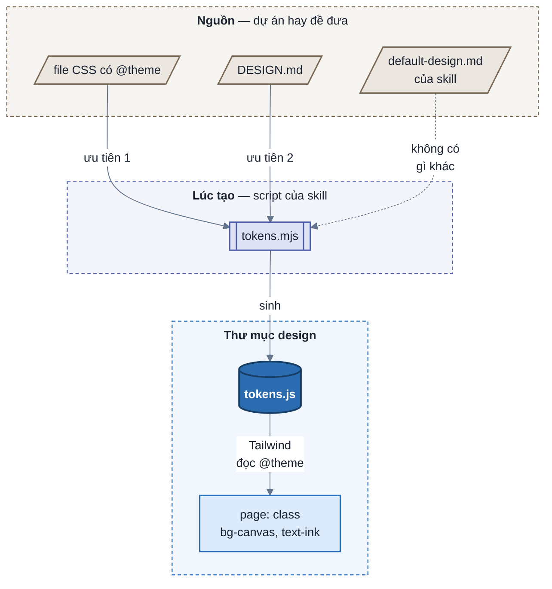
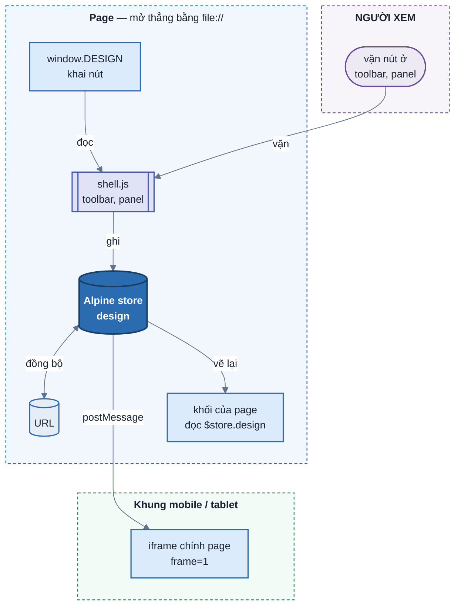
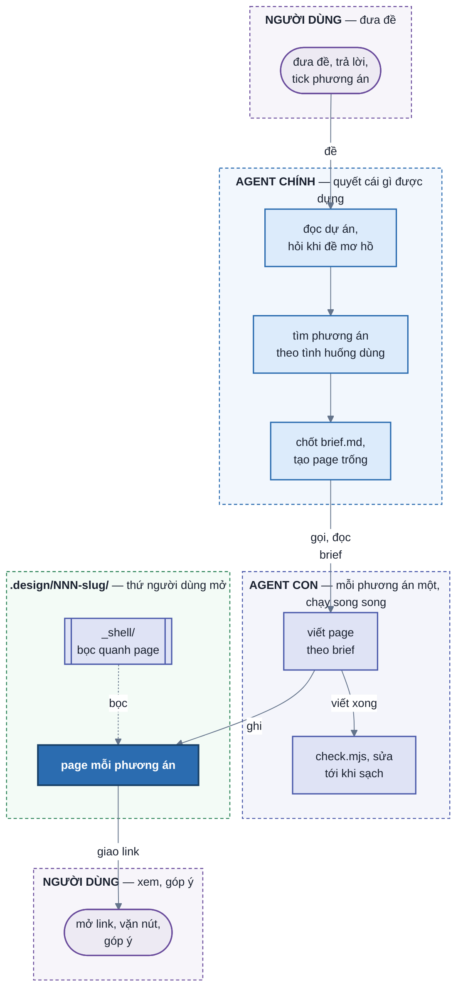

# SPEC — `design-uiux`

## 1. Mục tiêu

Skill nhận đề thiết kế và dựng prototype HTML bấm được, để người dùng thử UI, UX trước khi có code.

## 2. Feature requirement

Mỗi scope là một nhóm chức năng, chia thành sub-scope. Mỗi phần của mục 3 mở đầu bằng dòng **Scope:** ghi các scope
hay sub-scope nó phục vụ.

SPEC chỉ tả những gì skill đang làm. Yêu cầu nào do việc nào đưa vào, việc nào còn chờ: [PLANS.md](PLANS.md).

- **`F1` Đề và phương án**
  - `F1.1` Nếu agent chưa viết được 3 tình huống dùng hay chưa biết dữ liệu có gì, thì agent hỏi người dùng bằng câu
    có sẵn đáp án, tối đa 3 lượt.
  - `F1.7` Agent không hỏi thứ đọc được từ dự án: design system, màn đang có, bề rộng trang.
  - `F1.2` Nếu đề có nhiều cách trả lời cho câu "màn phục vụ ai trước, lúc nào, để biết gì", thì agent tả 2–3
    phương án trong chat cho người dùng chọn.
  - `F1.8` Mỗi phương án được chọn là một page.
  - `F1.3` Mọi page dùng chung: một bộ dữ liệu, một bộ nút dữ liệu, một bề rộng trang.
  - `F1.9` Nếu một phương án cần rộng hơn bề rộng chung, thì page khai bề rộng riêng kèm lý do.
  - `F1.4` Với `--auto`, agent chọn đáp án khuyên dùng và mọi phương án thay người dùng, không dừng hỏi.
  - `F1.10` Với `--auto`, lúc giao agent kể lại từng lựa chọn đã tự chọn.
  - `F1.5` Nếu có từ hai phương án trở lên, thì mỗi phương án do một agent con dựng, các agent con chạy song song.
  - `F1.6` Agent ghi vào `brief.md` mọi câu hỏi, lựa chọn và điều phải đoán, kèm ai quyết: người dùng, `--auto`, AI
    đoán.
- **`F2` Shell**
  - `F2.1` Người xem vặn từng nút dữ liệu, hoặc chọn một bộ dữ liệu có sẵn.
  - `F2.2` Người xem vặn cấu hình: role, bố cục, độ dày.
  - `F2.3` Người xem đổi khổ màn (desktop, tablet, mobile) và giao diện (sáng, tối).
  - `F2.4` Người xem chuyển giữa các phương án bằng nút A B C.
  - `F2.5` Khi người xem mở một link đã chép, page hiện đúng các giá trị lúc chép.
- **`F3` Page**
  - `F3.1` Page lấy màu, chữ, khoảng cách từ design system được đưa: `DESIGN.md`, file token, component của dự án.
  - `F3.5` Nếu design system thiếu giao diện sáng hay tối, thì `tokens.mjs` suy ra giao diện đó và shell ghi
    "(suy ra)".
  - `F3.2` Khi người xem bấm tab, lọc, modal, thêm hay xoá, page đổi theo trên dữ liệu giả.
  - `F3.3` Page có đủ trạng thái: có dữ liệu, đang tải, rỗng, lỗi, và trạng thái riêng của đề.
  - `F3.4` Nếu tài liệu hay component của design system làm khác một giới hạn `G`, thì page theo design system và
    `brief.md` ghi dẫn chứng.
- **`F4` Góp ý**
  - `F4.1` Khi người dùng góp ý một phương án, agent sửa thẳng page của phương án đó, không tạo page mới.
  - `F4.2` Nút phương án hiện ngày sửa và góp ý cuối của page đó.
  - `F4.3` Nếu góp ý đổi dữ liệu chung, thì agent sửa mọi page theo dữ liệu mới.
- **`F5` Kiểm tra trước khi giao**
  - `F5.1` Máy kiểm chạy page qua mọi tổ hợp: cấu hình × sáng tối × trạng thái, từng bộ dữ liệu có sẵn, khổ mobile và
    desktop.
  - `F5.4` Máy kiểm bấm thử từng loại thứ bấm được trên page.
  - `F5.2` Máy kiểm đo phần đo được của từng luật trong `references/page-principles.md`.
  - `F5.5` Agent soát phần còn lại của từng luật trên ảnh trong `shots/`.
  - `F5.3` Nếu còn lỗi chưa sửa được, thì lúc giao agent kể ra từng lỗi.

Bảng dưới phân biệt phương án (`F1.2`) với thứ người xem vặn được (`F2`).

| Hai bản khác nhau ở | Là | Người xem đổi bằng |
| --- | --- | --- |
| màn này phục vụ ai trước, lúc nào, để biết gì | **phương án** (`F1.2`) | nút A B C trên toolbar, mỗi phương án một page |
| bố cục, độ dày, role, loại biểu đồ trên cùng dữ liệu | **tweak** (`F2.2`) | config-panel của page đó |
| dữ liệu mang tới: số lượng, ngưỡng, tên dài, `state` | **variable** (`F2.1`) | data-panel, mọi page chung một bộ |
| khổ màn, sáng tối | **cách nhìn** (`F2.3`) | view-controller, page không khai |

## 3. Technical design

Bốn phần, mỗi phần một chủ:

| Phần | Là gì | Chủ | Scope |
| --- | --- | --- | --- |
| **agent** | agent chính hỏi, chọn phương án, chuẩn bị; agent con dựng page | `SKILL.md` | `F1` `F4` |
| **bản thiết kế** | page `NN-slug.html` và `tokens.js` | agent dựng, script sinh token | `F3` |
| **shell** | `_shell/` bọc quanh page: toolbar, panel, khung mobile / tablet, URL | skill mang theo, page không đụng | `F2` `F4.2` |
| **máy kiểm** | `check.mjs`, `principles-check.mjs` | skill mang theo | `F5` |

### 3.1 Thư mục design

**Scope:** `F1.2` `F1.3` `F1.8` `F4`

Mỗi đề một thư mục `.design/NNN-slug/` ở thư mục làm việc lúc gọi skill. Mọi thư mục design dùng chung
`.design/_shell/`.

| File | Ai ghi | Vai |
| --- | --- | --- |
| `brief.md` | agent chính | thoả thuận chung mọi page phải theo: quyết định, design system, dữ liệu chung, nút dữ liệu chung, số kiểm chéo |
| `tokens.js` | `new-design.mjs init` | token của design system |
| `pages.js` | `new-design.mjs page` · `touch` | danh sách page cho nút A B C: tên phương án, câu hỏi trung tâm, ngày sửa, góp ý cuối |
| `NN-slug.html` | agent con, mỗi agent đúng một file | một phương án |
| `shots/` | `check.mjs` | ảnh từng tổ hợp, từng cú bấm |

Mỗi file đúng một người ghi, nên các agent con chạy song song không giẫm nhau. Mọi thứ các page phải giống nhau
nằm ở `brief.md` và `tokens.js`, không nằm trong từng page.

### 3.2 Design system thành token

**Scope:** `F3.1` `F3.5`

- `tokens.mjs` đọc khối `@theme` của file CSS hay phần YAML đầu `DESIGN.md`, ra `tokens.js`. File này chèn một thẻ
  `<style type="text/tailwindcss">` có `@theme` vào page; Tailwind bản trình duyệt đọc nó và sinh class theo tên
  token (`--color-canvas` → `bg-canvas`). Token để ở file `.js` chứ không ở `.css` vì mở bằng `file://` thì Tailwind
  không đọc được stylesheet ngoài.
- File CSS có `@theme` thắng `DESIGN.md` vì đó là giá trị app đang chạy.
- Sáng tối là biến thể `dark` của Tailwind, bật bằng `[data-theme="dark"]`.
- Nếu design system chỉ có một giao diện, thì `tokens.mjs` suy giao diện kia theo vai màu:
  - nền, chữ, viền: đảo độ sáng;
  - màu nhấn: giữ sắc, chỉnh độ sáng tới khi đủ tương phản;
  - `primary`: giữ nguyên.
- `window.DESIGN_THEME.derived` ghi giao diện nào là suy ra. Shell đọc nó để hiện chữ "(suy ra)".
- Page không có mã màu nào; mọi màu đi qua token.

### 3.3 Page chạy thế nào

**Scope:** `F2` `F3.2`

- **Thứ tự nạp cố định:** `tokens.js` → `pages.js` → `window.DESIGN` → `shell.js` → Tailwind → icon → Alpine (defer).
  Danh sách page và token nạp bằng thẻ `<script>` vì Chrome chặn `fetch` file local.
- **Một store cho mọi giá trị vặn.** `shell.js` dựng `Alpine.store("design")` từ `default` của từng nút, đè bằng giá
  trị trên URL. Khổ màn và sáng tối là hai key cố định của store. Page đọc `$store.design.<key>`; vặn nút thì Alpine
  chỉ vẽ lại phần phụ thuộc key đó, modal đang mở và ô đang gõ giữ nguyên.
- **URL là bản lưu.** Mỗi lần store đổi, `history.replaceState` ghi giá trị khác mặc định lên URL, không tải lại trang.
  Chép link là chép đúng cái đang xem; tải lại không mất gì.
- **Khổ mobile / tablet là iframe của chính page** kèm `frame=1`, để media query chạy thật. Trang cha gửi giá trị vào
  iframe bằng `postMessage`, vì mở bằng `file://` thì không đọc thẳng được vào iframe. Page trong iframe không vẽ shell.
- **Tương tác của page** (tab, lọc, modal, thêm, xoá) là state Alpine riêng trong từng khối, chạy trên dữ liệu giả sinh
  từ variables. Không gọi API.

### 3.4 Shell

**Scope:** `F2` `F4.2`

| Khối | Đọc từ | Làm gì |
| --- | --- | --- |
| option-switcher | `pages.js` | nút A B C sang page khác, giữ khổ màn và sáng tối; rê vào thấy mô tả phương án, ngày sửa và góp ý cuối |
| view-controller | `DESIGN_THEME` | khổ màn, sáng tối, số khối, về mặc định |
| data-panel | `DESIGN.variables`, `presets` | vặn dữ liệu; loại ô theo `type` của nút |
| config-panel | `DESIGN.tweaks` | vặn cấu hình |

- Một shell chung ở `.design/_shell/`, `new-design.mjs init` hay `shell` chép bản mới nhất của skill vào. Shell chỉ
  bọc quanh page nên cập nhật shell không đổi hình bản thiết kế cũ.
- Chữ trên shell theo `DESIGN.lang`. Màu, bố cục, cách vẽ từng loại ô: [`references/shell-principles.md`](references/shell-principles.md).
  Sửa shell thì chạy `scripts/test-shell.mjs`.

### 3.5 Agent

**Scope:** `F1` `F4`

- **Agent chính quyết cái gì được dựng** (`F1.1` `F1.2`), theo thứ tự:
  1. Đọc design system và màn đang có.
  2. Nếu đề mơ hồ, thì hỏi bằng AskUserQuestion.
  3. Tìm phương án theo tình huống dùng, cho người dùng tick.
  4. Chốt `brief.md`, tạo page trống bằng `new-design.mjs page`.
  5. Gọi mọi agent con trong cùng một lượt.
  6. Khi mọi agent con xong, kiểm cả thư mục và so số kiểm chéo với brief.
  7. Giao link.
- **Agent con dựng đúng một page**, theo thứ tự:
  1. Đọc `brief.md` và `references/page-principles.md`, viết page.
  2. Chạy `check.mjs` tới khi sạch.
  3. Mở ảnh trong `shots/`, đi danh sách tự kiểm.
  4. Trả kết quả về agent chính.
- **`brief.md` giữ các page so được** (`F1.3`): mọi page sinh dữ liệu giả theo "Dữ liệu chung", khai đúng bộ key của
  "Nút dữ liệu chung", trả về các "Số kiểm chéo" để agent chính so.
- **Góp ý** (`F4`): sửa thẳng page của phương án đó, chạy lại `check.mjs`, rồi `new-design.mjs touch` ghi ngày và góp ý
  vào `pages.js`. Góp ý đổi dữ liệu chung thì sửa `brief.md` trước, rồi sửa mọi page cho khớp.
- **`--auto`** (`F1.4`): vẫn soạn câu hỏi và phương án, nhưng thay chỗ gọi AskUserQuestion bằng đáp án khuyên dùng và
  chọn mọi phương án; mỗi lựa chọn là một dòng `--auto` trong bảng Quyết định của `brief.md`.

### 3.6 Máy kiểm

**Scope:** `F5` `F3.4`

- **`check.mjs`** chỉ đọc, không sửa page. Nó chạy ba lượt:
  - **Lượt tĩnh** đọc file: thứ tự nạp, mã màu, `brief.md`, `pages.js`, bộ key variables.
  - **Lượt tổ hợp** mở page bằng Playwright qua `file://`, chạy mọi tổ hợp tweak × sáng tối × `state` cộng từng preset
    ở 375 và 1280px.
  - **Lượt bấm** bấm từng loại thứ bấm được trên page.
- Lượt tổ hợp và lượt bấm đo: lỗi console, cuộn ngang, chữ đè, khung nổi lọt màn hình, nút vặn mà UI không đổi, URL
  mở lại đúng giá trị. Ảnh lưu vào `shots/`.
- **`principles-check.mjs`** đo phần máy đo được của từng luật trong [`references/page-principles.md`](references/page-principles.md) ở lượt tĩnh,
  mỗi tổ hợp, lượt bấm và cả thư mục; lỗi mang ID luật (`[N13]`, `[G4]`). Giới hạn `G` mà `brief.md` ghi là nhường cho
  design system thì bỏ qua. Luật có trong `references/page-principles.md` mà không có phép kiểm thì dừng.
- Exit `0` sạch · `1` có lỗi · `2` không chạy được. Playwright cài vào thư mục tạm, không cài vào dự án.

## 4. Vì sao thiết kế như vậy

### Hỏi và chọn phương án

| Quyết định | Lý do |
| --- | --- |
| không hỏi thứ đọc được từ dự án | design system, màn đang có, bề rộng trang đều nằm trong code; hỏi lại là bắt người dùng làm việc của agent |
| hỏi bằng câu có sẵn đáp án, đáp án khuyên dùng đứng đầu | chọn nhanh hơn viết, và đáp án cho người dùng thấy các khả năng. Gõ chữ riêng vẫn được |
| "đủ rõ" là viết được 3 tình huống dùng và biết dữ liệu có gì; tối đa 3 lượt | cần một điểm dừng đo được, không thì hỏi mãi. Ba lượt mà chưa rõ thì đoán có ghi lại vẫn tốt hơn bắt trả lời tiếp |
| phương án đi từ tình huống dùng, không từ kiểu hiển thị | chọn theo hình dáng ra hai phương án trả lời cùng một câu và bỏ sót câu hay gặp nhất. Bảng tình huống × phương án bắt được cả hai |
| ba phép thử: tweak · thắng · trùng | phương án chỉ khác bố cục thì một nút ở config-panel đã làm được; dựng page riêng là tốn công mà người dùng phải chọn giữa hai bản gần giống nhau |
| tối đa 3 phương án | quá ba thì người dùng không nhớ nổi khác biệt khi so; đề thật hiếm khi có hơn ba câu hỏi trung tâm khác nhau |
| phương án tả bằng chữ trong chat, không dựng page để chọn | page để chọn tốn công như page thật mà chỉ xem một lần. Câu hỏi chọn nhiều không hiện được bản phác, nên bản phác in ngay trước câu hỏi |
| mọi quyết định ghi vào brief kèm ai quyết (`người dùng` · `--auto` · `AI đoán`) | người đọc thấy ngay chỗ nào AI đoán để soi, thay vì quyết định rải ở nhiều mục |
| `--auto` vẫn soạn đủ câu hỏi và phương án, chỉ không dừng | chạy thử không phải ngồi trả lời, mà vẫn để lại dấu đã tự chọn gì để so với lần hỏi thật |

### Dựng

| Quyết định | Lý do |
| --- | --- |
| mỗi phương án một agent con, chạy song song | chọn ba phương án thì không phải chờ ba lượt nối nhau |
| agent chính tạo thư mục, `pages.js`, page trống và brief trước; agent con chỉ sửa đúng file của mình | để agent con tự tạo page thì chúng tranh nhau ghi `pages.js`, số page trùng |
| brief chốt dữ liệu chung, bộ key variables chung và vài con số kiểm chéo | các page phải so được trên cùng con số. Công thức viết bằng chữ luôn có chỗ hai người hiểu khác nhau; con số cụ thể chốt cách hiểu |
| bề rộng trang lấy từ layout của app, mọi page dùng chung | bề rộng là của app, không phải của phương án. Mỗi page tự chọn thì phương án hẹp trông thoáng hơn chỉ vì hẹp |

### Page và shell

| Quyết định | Lý do |
| --- | --- |
| HTML mở thẳng bằng `file://`, không server | người xem mở là chạy, không có tiến trình phải bật tắt. Chrome chặn `fetch` file local, nên `pages.js`, `tokens.js` nạp bằng thẻ `<script>` |
| Tailwind bản trình duyệt, class theo tên token, không mã màu trong page | mọi màu đi qua token nên không lệch design system, đổi sáng tối là đổi theo. CSS viết tay thì mỗi page tự đặt tên class |
| Alpine.js, giá trị vặn ghi lên URL | vặn nút chỉ vẽ lại phần phụ thuộc, modal đang mở và ô đang gõ giữ nguyên; chép link gửi đi mở ra đúng giá trị đang xem; tải lại không mất gì |
| khổ mobile / tablet là iframe của chính page | media query chạy thật, không phải giả bằng JS đo bề rộng |
| design system thiếu sáng hay tối thì suy ra, ghi "(suy ra)" | prototype phải xem được cả hai giao diện, mà người xem cần biết giao diện nào không đến từ design system |
| vẽ cho trông giống component của dự án, không chép code | prototype không nối với code; cái cần là đặt cạnh màn đang có thì so được |
| vặn nút nào UI cũng phải đổi thấy được; kết quả chỉ có sau một cú bấm thì là một giá trị của `state` | nút vặn mà không thấy gì thì người xem không biết nó có tác dụng |
| một shell chung `.design/_shell/` cho mọi thư mục design | shell chỉ bọc quanh page, không chạm vào bản thiết kế: cập nhật shell thì page cũ có toolbar mới mà hình thiết kế không đổi |
| shell có màu trung tính riêng, không dùng token của design system | shell phải tách khỏi bản thiết kế mà không chói; dùng token thì đổi design system là đổi luôn công cụ xem |

### Kiểm

| Quyết định | Lý do |
| --- | --- |
| đầu ra kiểm bằng code; chưa sạch thì không nói là xong | lời khai của agent không đáng tin bằng phép đo. Mỗi hứa hẹn về page có một phép kiểm trong `check.mjs` |
| mỗi luật tách phần máy đo được và phần tự kiểm | phần máy đo được thì không để agent tự khai; phần còn lại thành danh sách mở ảnh ra soát, dòng trượt hiện trong tin giao |
| thứ tự: nguyên tắc > design system > giới hạn | nguyên tắc là đúng sai (đọc được, màu nói đúng trạng thái); giới hạn chỉ là gu mặc định, và design system được đưa phải thắng gu của skill |
| design system "nói khác" một giới hạn chỉ khi tài liệu viết ra hay component đang làm vậy | design system nào cũng khai token bóng, màu phụ; có token không có nghĩa là dùng cho card hay cho trạng thái. Nhường phải kèm dẫn chứng |
| luật không có phép kiểm thì `check.mjs` dừng | không có chốt này thì luật thêm sau sẽ chỉ nằm trên giấy |
| kiểm báo nhầm thì sửa phép kiểm; page không có cách tắt kiểm | có lối tắt trong page thì agent dùng lối tắt thay vì sửa page. 28 page chạy thử cũ là bộ đo báo nhầm |
| `check.mjs` có lượt bấm, và vẫn bắt mở ảnh `shots/` | chỉ kiểm thứ vặn ở panel thì modal, sheet, hàng mở rộng vỡ mà máy vẫn báo sạch |
| sửa tối đa ba vòng, còn lỗi thì kể từng dòng lúc giao | đổi lấy thời gian chạy có giới hạn, nhưng không giao như thể đã sạch |
| nguyên tắc và giới hạn ở file riêng `references/page-principles.md` | chỉ agent dựng page cần; để trong `SKILL.md` thì lượt hỏi và chọn phương án cũng phải nạp |

### Vòng góp ý

| Quyết định | Lý do |
| --- | --- |
| mỗi phương án đúng một page, góp ý sửa thẳng page đó | đẻ page `-v2`, `-final` mỗi vòng thì option-switcher thành dãy bản nháp, người dùng không biết page nào đang làm |
| sửa xong thì ghi ngày và góp ý cuối vào nút phương án | không có bản nháp để so thì người mở page cần biết bản đang xem sửa lần cuối khi nào, theo ý nào |
| đổi dữ liệu chung thì sửa brief trước, rồi sửa mọi page | các page chỉ so được khi cùng một bộ dữ liệu |

## 5. I/O

| | |
| --- | --- |
| **Input** | đề trong chat; design system (lệnh `getdesign`, file CSS có `@theme`, `DESIGN.md`, hay không có gì); code dự án nếu có, chỉ để đọc |
| **Output** | thư mục `.design/NNN-slug/` ở thư mục làm việc: `brief.md`, `tokens.js`, `pages.js`, mỗi phương án một `NN-slug.html`, ảnh `shots/`. Mọi thư mục design dùng chung `.design/_shell/` |
| **Verify** | `check.mjs` trên page hay cả thư mục: thứ tự nạp, brief, mọi tổ hợp tweak × sáng tối × `state` × preset ở 375 và 1280px, lượt bấm, nguyên tắc và giới hạn. `test-shell.mjs` khi sửa shell |
| **Mutate** | chỉ ghi trong `.design/`. Không sửa code dự án, không cài gì vào dự án (Playwright cài vào thư mục tạm) |

| File | Vai trò |
| --- | --- |
| `SKILL.md` | phần vận hành: từng bước, lệnh, lời giao cho agent con, luật viết page, bẫy đã gặp — đủ để chạy mà không đọc SPEC |
| `SPEC.md` | file này: vấn đề, mental model, lý do của từng quyết định, ranh giới phạm vi |
| `references/page-principles.md` | nguyên tắc `N` và giới hạn `G` cho agent dựng page, mỗi luật có phần máy kiểm và phần tự kiểm |
| `references/shell-principles.md` | nguyên tắc thiết kế shell: màu, bố cục, cách vẽ từng loại ô |
| `shell/` | shell (`shell.js`, `shell.css`), bộ token dự phòng (`default-design.md`) |
| `templates/` | khuôn `brief.md`; khuôn page `details.html` mà `new-design.mjs page` chép ra |
| `scripts/new-design.mjs` | tạo thư mục design, page, ghi ngày sửa, chép shell |
| `scripts/tokens.mjs` | đổi design system thành `tokens.js`, suy giao diện còn thiếu |
| `scripts/check.mjs` · `principles-check.mjs` | máy kiểm page; phép kiểm của từng luật trong `references/page-principles.md` |
| `scripts/test-shell.mjs` | kiểm shell trên một thư mục design mẫu |

## 6. Không thuộc phạm vi

- Chuyển prototype thành code dự án, hay ghi bất cứ gì vào repo dự án ngoài `.design/`.
- Gọi API thật, chạy logic thật. Page chỉ chạy trên dữ liệu giả.
- Gu thẩm mỹ riêng của skill: component mẫu, bố cục mẫu từng loại màn. Skill theo design system được đưa; giới hạn
  `G` chỉ lấp chỗ design system không nói tới.
- Bộ design system mặc định đầy đủ khi đề không đưa gì. Skill chỉ có bộ token dự phòng `shell/default-design.md`.
- Tự chạy app để chụp hiện trạng. Hiện trạng đọc từ code; có ảnh hay URL người dùng đưa thì dùng cái đó.
