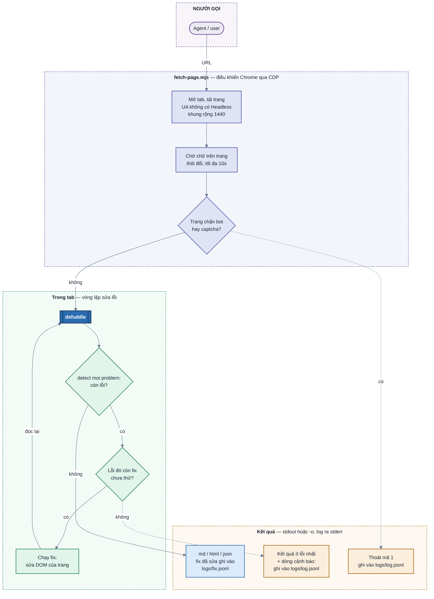
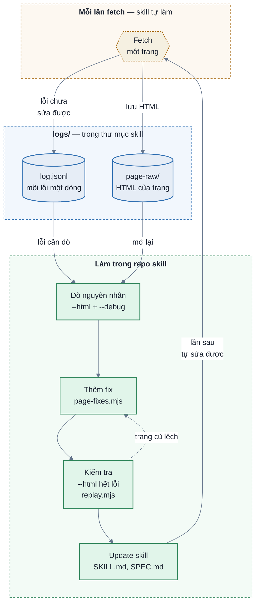

# fetch-page — workflow

`fetch-page.mjs` mở URL trong Chrome headless đã cấu hình giống trình duyệt desktop thật, chờ JS của
trang chạy xong, rồi chạy defuddle ngay trong tab để lấy phần thân bài. Sau đó nó kiểm tra kết quả có
lỗi nào đã biết không. Có lỗi thì sửa trang, cho defuddle đọc lại, rồi kiểm tra tiếp, cho tới khi hết
lỗi hoặc hết cách sửa. Trang chặn bot hoặc captcha thì dừng hẳn.

## Lấy một trang

**Trang bình thường:** tải trang → chờ ổn định → defuddle một lần → không có lỗi → in kết quả. Một bài
báo mất khoảng 2–6 giây.

**Trước vòng lặp: cấu hình để lấy được trang ngay lần đầu.** Mấy thứ này phải đặt trước khi tải trang,
vì hỏng rồi thì sửa trong tab không cứu được nữa:

- User-Agent bỏ chữ `HeadlessChrome`, nếu không Cloudflare trả trang "Just a moment...".
- Khung màn hình rộng 1440 giả làm desktop, nếu không AP News coi là mobile và gập nửa sau bài.

**Trang chặn bot hoặc captcha → chấp nhận lỗi, thoát mã 1.** Tiêu đề kiểu "Just a moment..." sau 10 giây
vẫn chưa qua, hoặc trang captcha AWS WAF (arstechnica.com). Chạy lại cũng ra y hệt nên không thử lại.
Lần fetch vẫn được ghi vào `logs/` (xem dưới).

**Vòng lặp sửa lỗi.** Danh sách `PROBLEMS` trong `page-fixes.mjs` liệt kê các kiểu lỗi defuddle hay mắc.
Mỗi lỗi có một hàm `detect` và một số `fixes`:

- `detect` đọc kết quả defuddle và nhìn hiện tượng, không nhìn site. Nhờ vậy gặp site lạ mắc cùng
  kiểu lỗi thì vẫn phát hiện được.
- Mỗi fix là một nguyên nhân đã gặp thật. Fix sửa phần bọc quanh chữ (thẻ, thuộc tính), không thêm chữ,
  vì chữ vốn đã có trong trang.
- Mỗi fix chỉ thử một lần. Vòng lặp dừng khi hết lỗi, khi không fix nào sửa được gì, hoặc sau 5 vòng.
  Kết quả in ra là kết quả ít lỗi nhất.

| Problem | detect thấy gì | Fix đã có (site gặp lần đầu) |
|---|---|---|
| `code bị vẽ thành bảng` | Bảng có một ô chứa dãy số dòng 1, 2, 3… | Thay khối code Urvanov/Crayon bằng `<pre><code>` lấy từ textarea ẩn (machinelearningmastery.com) |
| `thiếu chữ` | `
` đang hiện, cùng container với đoạn được giữ, mà không có trong kết quả: từ 50 từ và 20% thân bài trở lên | Gỡ `aria-hidden` khỏi các khối có chữ đang hiện, cùng container với đoạn bị mất. Paywall Kiosq (tomshardware.com), trước chỉ lấy được 98/709 từ |

**Phát hiện được lỗi nhưng chưa có fix → vẫn in kết quả, kèm dòng `cảnh báo:` ở stderr.** Ví dụ gặp một
plugin highlight chưa biết: `detect` vẫn thấy bảng số dòng, nhưng chưa có fix cho plugin đó. Một phần
bài vẫn có ích, và cảnh báo là tín hiệu để bắt đầu vòng lặp cải tiến bên dưới.

**Mọi lỗi đều được ghi lại** trong `logs/` của thư mục skill, mỗi dòng một object phẳng, chỉ append:

- `log.jsonl`: lỗi **chưa** sửa được (cảnh báo, trang chặn bot, captcha), mỗi dòng là một việc cần dò. Kèm
  HTML của trang trước mọi fix trong `page-raw/`, mở lại được bằng `--html` mà không cần fetch lại.
- `fix.jsonl`: lỗi **đã** được fix sửa, không lưu HTML. Dùng để tổng hợp site nào đang cần fix nào, và
  fix nào lâu rồi không được dùng tới.

Tách làm hai file để `log.jsonl` chỉ còn những việc phải làm.

## Vòng lặp cải tiến

Skill tự tốt lên qua ba việc lặp lại: **lưu log** mỗi lần gặp lỗi chưa sửa được, **thêm fix** cho lỗi
đó, rồi **update skill**. Lần sau site đó, cùng mọi site mắc cùng lỗi, tự được sửa.

- **Lưu log**: skill tự làm, mỗi lỗi chưa sửa được thành một dòng trong `log.jsonl`, kèm HTML trong
  `page-raw/`.
- **Dò nguyên nhân**: mở lại HTML đã lưu bằng `--html`, không cần fetch lại. Thêm `--debug` để thấy
  defuddle xoá khối nào, ở bước nào, vì selector nào.
- **Thêm fix**: nguyên nhân mới của lỗi đã biết thì thêm fix vào problem đó; kiểu lỗi mới thì thêm
  problem. `detect` theo hiện tượng, không theo site. `name` của fix nói cụ thể nó làm gì với phần tử nào.
- **Kiểm tra**: chạy lại bằng `--html` phải ra `hết lỗi`; `replay.mjs` trên các trang đã lưu trước đây
  phải không lệch.
- **Update skill**: thêm dòng vào bảng problem ở trên và bảng "Vì sao script đặt những thứ này" trong
  SKILL.md.

Chi tiết cách chạy và các flag nằm trong [SKILL.md](SKILL.md).
