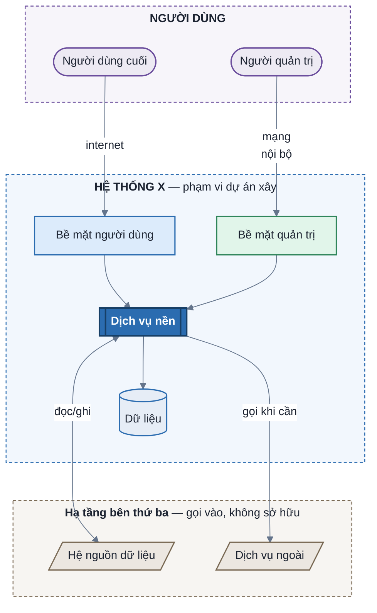

# Mermaid diagram design — zone-tinted flowchart

Design contract: [SPEC.md](SPEC.md).

**Mental model.** Hình đọc được ở 3 tầng, đúng thứ tự mắt người:
`vùng` (nền màu = ranh giới trách nhiệm) → `hộp` (shape = loại thành phần) → `mũi tên` (kiểu nét = loại quan hệ).
Người đọc lấy được 80% thông điệp ở tầng 1 mà chưa cần đọc chữ trong hộp.

---

## 1. Preamble bắt buộc

```
%%{init: {'theme':'base','themeVariables':{'fontSize':'15px','titleColor':'#1b2230','textColor':'#1b2230','nodeTextColor':'#1b2230','lineColor':'#64748b','edgeLabelBackground':'#ffffff','clusterBkg':'#F7F8FA','clusterBorder':'#8a93a5'},'flowchart':{'curve':'basis','nodeSpacing':55,'rankSpacing':70,'padding':14,'subGraphTitleMargin':{'top':6,'bottom':14}}}}%%
flowchart TB
```

Copy **nguyên khối**, không rút gọn còn `fontSize`. Mỗi token chữa 1 lỗi đã gặp thật:

| Token | Thiếu nó thì |
|---|---|
| `theme:'base'` | theme khác ghi đè `fill` của `classDef` → hình xám hết |
| `titleColor` | nhãn `subgraph` lấy màu theme tự tính → **mờ nhạt, mất tên vùng** khi host ở dark mode |
| `textColor` · `nodeTextColor` | chữ ngoài hộp (nhãn edge) theo màu host → dark mode ra chữ trắng, đọc không được |
| `edgeLabelBackground:'#ffffff'` | nhãn edge trong suốt → **nét mũi tên xuyên qua chữ** |
| `lineColor` | nét mảnh xanh nhạt mặc định, xuất PDF là mất. `#64748b` đạt ≥4:1 trên **cả** nền trắng và nền đen |
| `subGraphTitleMargin` | tên vùng dính vào hàng hộp đầu tiên |
| `nodeSpacing` · `rankSpacing` | nhãn edge không có chỗ → đè lên nét bên cạnh |

- `fontSize` 15px cho C1/C2 (ít hộp), 13-14px cho hình >18 hộp.
- **Không set `fontFamily`** — verified 2026-08-27 (mmdc): override không đổi được font thật, chỉ thêm rủi ro lệch phép đo bề rộng nhãn.
- `TB` khi có phân tầng người → hệ → hệ ngoài. `LR` khi là chuỗi bước (user flow).
- Ngoài khối init, mỗi hình còn **bắt buộc 1 dòng `linkStyle`** — xem §1.1.

### 1.1 Đọc được ở cả dark mode và light mode

Hình **không** đổi màu theo host. Nó tự mang đủ màu để đọc trên mọi nền — nguyên tắc: *không thừa hưởng màu gì từ trang*.

| Thành phần | Màu đến từ đâu | Nếu không pin |
|---|---|---|
| Chữ trong hộp | `classDef ... color:#1b2230` (inline per hộp) | thừa hưởng màu chữ trang → dark mode ra chữ trắng trên fill pastel |
| Nhãn vùng | themeVariable `titleColor` (CSS `.cluster span`) | theme tự tính → mờ nhạt |
| **Nhãn edge** | **`linkStyle default color:#1b2230`** | mermaid render `.edgeLabel { background-color }` mà **không set `color`** → chữ thừa hưởng màu trang. Đây là lỗi "chữ mờ trong background": pill trắng + chữ trắng |
| Nền nhãn edge | `edgeLabelBackground:'#ffffff'` | trong suốt → nét mũi tên xuyên qua chữ |
| Nét mũi tên | `lineColor:'#64748b'` | nét nhạt, mất trên nền tối |

```
linkStyle default color:#1b2230
```

Đặt **sau toàn bộ edge**, trước `classDef`. `linkStyle` là đường duy nhất mermaid cho phép đặt màu chữ nhãn edge — verified 2026-08-27: nó sinh `style="color:#1b2230 !important"` inline trên `div.labelBkg` + `span.edgeLabel`, thắng mọi CSS của host.

Kết quả: fill pastel + chữ đậm + pill trắng. Dark mode chỉ đổi nền **quanh** hình và khe giữa các vùng; mọi chữ vẫn nằm trên nền sáng của chính nó.

**Đã thử và loại:** bọc tất cả trong 1 `subgraph CANVAS` nền trắng để bịt luôn khe nền tối. Dagre lồng cluster làm layout tự nhảy `TB` → `LR`, không điều khiển được → không dùng.

### 1.2 `sequenceDiagram` — chỉ che được một nửa

`sequenceDiagram` ngoài phạm vi style zone-tinted (SPEC §4: không có `subgraph`/`classDef`/`linkStyle`), nhưng **vẫn bị đúng lỗi thừa hưởng màu** — và ở đây chỉ chữa được một phần. Khối init riêng:

```
%%{init: {'theme':'base','themeVariables':{'fontSize':'15px','textColor':'#64748b','actorBkg':'#EDEAF3','actorBorder':'#6a4c9c','actorTextColor':'#1b2230','signalColor':'#64748b','signalTextColor':'#64748b','loopTextColor':'#64748b','noteBkgColor':'#F5F0E1','noteBorderColor':'#a86a12','noteTextColor':'#1b2230','labelBoxBkgColor':'#ffffff','labelBoxBorderColor':'#8a93a5','labelTextColor':'#1b2230','altSectionBkgColor':'#ffffff','activationBkgColor':'#DFE3F5','activationBorderColor':'#4c5bab','sequenceNumberColor':'#1b2230'}}}%%
```

**Vì sao chữ message là `#64748b` chứ không `#1b2230`.** Nhãn message của sequence **không có nền nhãn** — không có var nào tương đương `edgeLabelBackground`. Chữ nằm trực tiếp trên nền trang, nên pin đen là mất ở dark mode, pin trắng là mất ở light mode. `#64748b` là giá trị duy nhất đạt ~4.5:1 trên **cả hai** nền (cùng lý do skill chọn nó cho `lineColor`). Đổi lại: chữ message xám hơn chữ trong hộp — chấp nhận, vì phương án khác là không đọc được ở một trong hai nền.

Thứ **có** nền thì vẫn pin đậm được: hộp participant (`actorTextColor`), note (`noteTextColor`), nhãn `alt/loop` (`labelTextColor`), số thứ tự.

**3 var dễ bỏ sót** — verified 2026-08-27 bằng render probe (đặt màu rực để xem var nào ăn):

| Var | Điều khiển | Bỏ sót thì |
|---|---|---|
| `signalTextColor` | chữ trên mũi tên message | mờ |
| `loopTextColor` | nhãn nhánh `[Không gắn cờ]` của `alt`/`loop`/`opt` | **mờ hơn message rõ rệt** — `textColor` KHÔNG điều khiển cái này, đây là var riêng |
| `textColor` | chữ còn lại rơi ngoài 2 var trên | mờ |

## 2. Shape = nghĩa (không cần legend)

| Shape | Cú pháp | Nghĩa |
|---|---|---|
| Stadium | `A(["Tên"])` | Người / vai (actor) |
| Chữ nhật | `A["Tên"]` | App, màn hình, bề mặt người dùng |
| Subroutine | `A[["Tên"]]` | Dịch vụ nền (backend service) |
| Cylinder | `A[("Tên")]` | Kho dữ liệu |
| Parallelogram | `A[/"Tên"/]` | Hệ thống ngoài — **không thuộc phạm vi xây** |
| Hexagon | `A{{"Tên"}}` | Sự kiện / trigger từ ngoài |
| Rhombus | `A{"Tên?"}` | Nhánh quyết định nghiệp vụ (chỉ trong user flow, cite `R-00N`) |

Luật: parallelogram = "cái này không phải việc của mình". Đây là shape đắt giá nhất ở proposal — nó chốt ranh giới trách nhiệm mà không cần một câu văn nào.

## 3. Vùng — mỗi khối 1 nền riêng

```
subgraph ZONE["Tên vùng — ý nghĩa ranh giới"]
  direction TB
  ...hộp...
end
style ZONE fill:#F2F7FD,stroke:#2b6cb0,stroke-width:1.2px,stroke-dasharray: 4 3
```

- Nhãn vùng phải nói **ranh giới**, không nói phân loại: ✅ `"Bề mặt quản trị — mạng nội bộ"` · ❌ `"Nhóm 2"`.
- Bọc tên vùng trong backtick + `**` để bật markdown label: `subgraph SYS["\`**HỆ THỐNG X** — phạm vi dự án xây\`"]`. Bold giữ tên vùng đọc được cả khi renderer làm nhạt màu chữ.
- Nền vùng = bản nhạt hơn màu hộp bên trong (cột "Tint" §4). Hộp phải nổi trên nền, không hoà vào.
- Viền vùng **nét đứt** — ranh giới logic, không phải hộp.
- **Không có hộp trần.** Mọi hộp phải thuộc 1 vùng — actor cũng có vùng riêng (`"NGƯỜI DÙNG"`). Hộp trần làm nhãn edge rơi xuống nền trang, mất nền trắng → dark mode đọc không ra.
- 2-5 vùng. 1 vùng = không cần vùng. >5 vùng = gộp lại hoặc tách thành 2 hình.

## 4. Palette

| Class | Dùng cho | fill | stroke | Tint nền vùng |
|---|---|---|---|---|
| `actor` | Người / vai | `#EDEAF3` | `#6a4c9c` | `#F7F5FA` |
| `fe` | Bề mặt chính (người dùng cuối) | `#DCEBFB` | `#2b6cb0` | `#F2F7FD` |
| `fe2` | Bề mặt phụ (quản trị / admin) | `#E1F5EA` | `#2f855a` | `#F3FBF6` |
| `fe3` | Bề mặt công khai / vận hành | `#FBEEDD` | `#a86a12` | `#FDF8F1` |
| `svc` | Dịch vụ nền | `#DFE3F5` | `#4c5bab` | `#F4F5FB` |
| `core` | **Nhấn** — hộp trung tâm (≤3 hộp/hình) | `#2b6cb0` | `#173f66` | — |
| `data` | Kho dữ liệu | `#E6EDF6` | `#2b6cb0` | — |
| `ext` | Hệ thống ngoài | `#ECE7E1` | `#7a6a55` | `#F7F5F2` |
| `evt` | Sự kiện / trigger | `#F5F0E1` | `#a86a12` | — |

Block copy-paste (chữ luôn `#1b2230`, trừ `core` là trắng đậm):

```
classDef actor fill:#EDEAF3,stroke:#6a4c9c,stroke-width:1.6px,color:#1b2230
classDef fe    fill:#DCEBFB,stroke:#2b6cb0,stroke-width:1.6px,color:#1b2230
classDef fe2   fill:#E1F5EA,stroke:#2f855a,stroke-width:1.6px,color:#1b2230
classDef fe3   fill:#FBEEDD,stroke:#a86a12,stroke-width:1.6px,color:#1b2230
classDef svc   fill:#DFE3F5,stroke:#4c5bab,stroke-width:1.6px,color:#1b2230
classDef core  fill:#2b6cb0,stroke:#173f66,stroke-width:2px,color:#ffffff,font-weight:bold
classDef data  fill:#E6EDF6,stroke:#2b6cb0,stroke-width:1.6px,color:#1b2230
classDef ext   fill:#ECE7E1,stroke:#7a6a55,stroke-width:1.6px,color:#1b2230
classDef evt   fill:#F5F0E1,stroke:#a86a12,stroke-width:1.4px,stroke-dasharray: 3 2,color:#1b2230
```

**Vì sao pastel + viền đậm cùng tông:** fill nhạt cho chữ đen đọc được ở mọi cỡ; viền cùng hue đậm hơn 3 bậc giữ hộp không loãng khi in đen trắng hoặc xuất PDF. Không dùng fill đậm cho hộp thường — chỉ `core` được đậm, và đậm chỉ có nghĩa khi nó là thiểu số.

## 5. Mũi tên

| Nét | Cú pháp | Nghĩa |
|---|---|---|
| Liền | `A -->|"nhãn"| B` | Luồng chính, đồng bộ, luôn xảy ra |
| Nét đứt | `A -.->|"nhãn"| B` | Có điều kiện: ngoại lệ, chính sách, cấu hình, cross-cutting |
| Hai chiều | `A <-->|"nhãn"| B` | Đọc-ghi cả hai phía (integration) |

- Nhãn = **động từ nghiệp vụ**, không phải protocol: ✅ `"đưa thư vào kiểm duyệt"` · ❌ `"HTTPS"`. Protocol chỉ ghi khi nó là quyết định.
- Cắt nhãn bằng `<br/>` ở ~22 ký tự. Nhãn dài đẩy layout giãn ngang → mũi tên bắt đầu bắt chéo.
- **Nhãn edge cross-zone ≤ 2 dòng, mỗi dòng ~12 ký tự** — nhãn này nằm giữa 2 vùng, chỗ hẹp nhất của hình. Cần cite assumption/ghi chú thì chỉ để mã ngắn trong nhãn, câu đầy đủ ghi bullet dưới hình.
- Dòng `linkStyle default color:#1b2230` là **bắt buộc** (§1.1) — không có nó nhãn edge mờ trong dark mode.
- Quan hệ "mọi hộp trong vùng gọi vào X" → vẽ **1 edge từ id của subgraph** (`ZONE -.-> X`), đừng vẽ 7 edge song song.

## 6. Chống mũi tên đâm hộp

Dagre xếp theo thứ tự khai. 4 luật, theo đúng thứ tự này trong block:

1. Khai **actor** trước (lên trên cùng với `TB`).
2. Khai từng `subgraph` + edge **nội bộ** vùng bên trong nó.
3. Khai hệ thống ngoài.
4. Khai **toàn bộ edge cross-zone ở cuối**, sau khi đã `end` hết subgraph. Trộn edge cross-zone vào giữa các subgraph là nguyên nhân #1 của mũi tên đâm cluster.
5. Ép vùng ngoài **xuống dưới**, không để nó dạt sang phải: thêm invisible link từ hộp cuối vùng trên tới hộp đầu vùng ngoài — `DB ~~~ E1`. Không có nó, dagre xếp vùng ngoài cạnh kho dữ liệu → edge từ hộp trung tâm phải đi chéo hết chiều ngang vùng, cắt qua mọi nhãn trên đường.
6. Cuối cùng: `classDef` → `class` → `style {zone}`.

Vẫn rối → giảm hộp (≤18 cho C2) hoặc tách 1 vùng ra hình riêng, đừng chữa bằng cách bỏ nhãn.

### 6.1 Hành vi renderer đã kiểm chứng (mmdc v11, 2026-08-27)

Ba thứ dagre làm mà đọc source không đoán được. Verify bằng `npx -y @mermaid-js/mermaid-cli@11 -i x.mmd -o x.png`:

1. **`direction LR` trong `subgraph` bị BỎ QUA** khi cluster đó có edge đi ra ngoài. Đừng viết rồi tin — kiểm bằng render. Muốn ép hộp nằm ngang thì đổi `direction` của **cả hình**, không phải của cluster.
2. **Edge có 1 đầu là `subgraph` id bị CẮT ở viền cluster.** `A -.-> ZONE` vẽ mũi tên từ viền `A` tới viền cluster `ZONE`, **không** chạm hộp nào bên trong. Vẫn dùng được cho ý "toàn vùng gọi vào", nhưng nhãn **phải tự gọi tên đích** (ví dụ `"mọi app ghi nhật ký"`), vì hình không chỉ được.
3. **`TB` vs `LR` đổi độ chính xác, không chỉ đổi hình dáng.**
   - `TB`: edge từ actor **chạm đúng hộp** bên trong cluster → chọn khi câu hỏi chính là "ai vào bề mặt nào" (C1).
   - `LR`: edge từ actor bị cắt ở viền cluster, nhưng hình gọn hơn nhiều và fan edge cross-zone ngắn lại → chọn khi có >15 hộp và nhiều edge cross-zone (C2).
   - Hình bị kéo dài dòng, edge thành chùm dây song song → đổi `TB` ↔ `LR` **trước** khi nghĩ đến bỏ nhãn hay bỏ hộp.

Rule of thumb: C1 (ít hộp, cần actor chạm đúng bề mặt) → `TB`. C2 (>15 hộp, nhiều edge cross-zone) → `LR`; bản `TB` của một hình cỡ đó dễ dài quá 2000px và edge thành chùm dây.

## 7. Skeleton

### C1 — System Context



Khối này đã render verify 2026-08-27 (mmdc, **2 nền: trắng + `#0b0d10`**): nhãn vùng đậm, nhãn edge đậm trên pill trắng, không nét nào xuyên chữ, edge cross-zone đi thẳng xuống. Assumption ghi đầy đủ ở bullet dưới hình, không nhồi vào nhãn.

### C2 — Modules

Cùng khung, đổi: 1 `subgraph` per **vùng triển khai** (không phải per loại module), hộp = `M-0N` + tên 1 dòng, `<br/>` giữa mã và tên. Dịch vụ nền dùng `svc`, không dùng `core` (5 hộp đậm = không nhấn gì). `ContainerDb` → `data`.

### User flow (swimlane)

`flowchart LR` + 1 `subgraph` per **vai** (không per bước). Bước liền nhau nối `-->` bên trong lane; chuyển vai = edge cross-lane khai ở cuối. Nhánh nghiệp vụ dùng rhombus + cite mã rule trong nhãn. Ngoại lệ → bullet dưới hình, không vẽ vào hình.

## 8. Checklist trước khi dán

- [ ] Khối `%%{init}%%` copy **đủ token** §1 (`titleColor` · `textColor` · `edgeLabelBackground` · `subGraphTitleMargin`), không rút gọn còn `fontSize`
- [ ] Không có `C4Context` / `C4Container`
- [ ] Mỗi vùng có `style {zone}` nền tint riêng, viền nét đứt; tên vùng bọc `` `**...**` ``
- [ ] Không hộp nào ở ngoài vùng (actor cũng có vùng)
- [ ] Mọi hộp có `class`, không hộp nào rơi về xám mặc định
- [ ] ≤3 hộp `core`
- [ ] Hệ thống ngoài đều là `[/parallelogram/]`
- [ ] Nhãn edge là động từ nghiệp vụ, đã `<br/>` nếu >22 ký tự; nhãn cross-zone ≤2 dòng ngắn
- [ ] Edge cross-zone khai sau khi đóng hết `subgraph`, có invisible link `~~~` ép vùng ngoài xuống rank dưới
- [ ] Có dòng `linkStyle default color:#1b2230` sau phần edge (§1.1)
- [ ] Không có hộp legend giải thích màu
- [ ] Đã chạy `verify.py` sạch ERROR **và** đã xem ảnh render ở cả 2 nền (§9)

---

## 9. Verify — bắt buộc trước khi dán

Lint không thấy lỗi thị giác. Verify = **2 lớp**, không bỏ lớp nào.

### Lớp 1 — lint tự động

```bash
python3 {SKILL_DIR}/verify.py {file.md|file.mmd}
```

`{SKILL_DIR}` = thư mục chứa `SKILL.md` này. Tuỳ agent và scope cài:

| Agent | Project | Global |
|---|---|---|
| Claude Code | `.claude/skills/mermaid-diagram-design` | `~/.claude/skills/mermaid-diagram-design` |
| Codex · Cursor · OpenCode · Copilot | `.agents/skills/mermaid-diagram-design` | `~/.config/agents/skills/mermaid-diagram-design` |

Không chắc thì: `find . ~/.claude ~/.agents ~/.config/agents -name verify.py -path '*mermaid-diagram-design*' 2>/dev/null | head -1`

Quét mọi block ```` ```mermaid ```` trong file. `ERROR` = phải sửa, `WARN` = judge. Bắt được: `C4Context`, thiếu token init, thiếu `linkStyle default color:`, hộp trần ngoài vùng, vùng thiếu `style`, hộp không có `class`, >3 `core`, `ext` không phải parallelogram, edge cross-zone khai giữa các subgraph, nhãn edge quá dài, thiếu `~~~`, số vùng ngoài khoảng 2-5, chữ `legend`.

Stdlib thuần, không cần `uv`.

### Lớp 2 — render rồi XEM ẢNH

```bash
python3 {SKILL_DIR}/verify.py {file} --render {outdir}
```

`{outdir}` = thư mục tạm bất kỳ, ngoài tài liệu đang sửa. Ra **2 PNG mỗi block**: `-light.png` (nền trắng) và `-dark.png` (nền `#0b0d10`). Cần Node + `npx` (lần đầu `npx` tự tải `@mermaid-js/mermaid-cli`).

Agent **phải mở cả 2 ảnh** và soát bằng mắt. 6 lỗi sau chỉ hiện ở ảnh, lint không bao giờ thấy:

| Soát gì | Dấu hiệu sai |
|---|---|
| Chữ mờ | nhãn edge/nhãn vùng nhạt trên nền của nó — so ảnh dark với ảnh light, **hai ảnh phải đọc như nhau** |
| Nét cắt chữ | mũi tên đi xuyên qua nhãn hoặc qua tên vùng |
| Nét đâm hộp/cluster | mũi tên xuyên mặt hộp hoặc cắt ngang viền vùng thay vì chạm cạnh |
| Chùm dây | ≥3 nét gần song song chồng nhau ở cùng một khe |
| Vùng dạt sai chỗ | vùng ngoài nằm **cạnh** vùng hệ thống thay vì dưới → edge đi chéo cả hình (§6 luật 5) |
| Nhãn bị cắt chữ | tên vùng mất ký tự cuối (nhãn dài hơn bề rộng cluster) |

Vẫn sai → sửa cấu trúc (giảm hộp, tách hình, đổi thứ tự khai), **không** chữa bằng cách bỏ nhãn.

### Khi nào được bỏ lớp 2

Chỉ khi sửa thuần chữ trong nhãn (typo) và không thêm/bớt hộp hay edge. Mọi thay đổi khác về cấu trúc → render lại.
