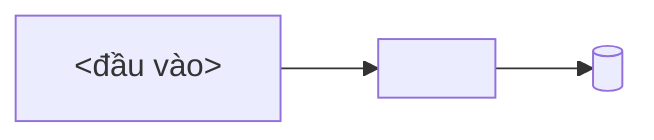

# Viết doc plan

## Mental model

Plan doc là **nơi quyết định thiết kế sống trong lúc còn có thể đổi**. **Doc nguồn** (PRD, kiến trúc,
backlog…) chỉ nhận thay đổi **sau khi plan được duyệt** — ghi sớm thì mỗi lần đổi hướng là viết lại doc
nguồn một lượt, và doc nguồn biến thành nơi lưu tranh luận.

```
bàn trong chat → plan doc (draft) → 👤 duyệt → phase 0 ghi doc nguồn → implement, tick tới đâu xong tới đó
```

Ngoại lệ **duy nhất** được chạm doc nguồn trước khi duyệt: **thêm ID công việc mới** vào backlog — không
có ID thì plan mồ côi.

Doc chia hai nửa, ngăn bằng `---` sau §2: **§1–§2 cho người duyệt**, **§3–§7 cho người làm**.

## Bước 0 — đọc **binding** của project (làm trước mọi thứ)

Skill quy định **hình dạng doc**; project quy định **chỗ cắm**. Thứ tự ưu tiên: `CLAUDE.md` / `AGENTS.md`
→ thư mục doc sẵn có (`ls -d .docs .plans docs`, mở plan gần nhất) → hỏi user → default.

| Binding cần biết                                    | Default nếu project không quy định                                           |
| --------------------------------------------------- | ---------------------------------------------------------------------------- |
| Thư mục + cách đặt tên doc plan                     | `.docs/NNN-slug.md` — không có thì `.plans/NNN-slug.md`; slug lowercase-kebab, `NNN` = số kế tiếp |
| Front matter thêm ngoài bộ chuẩn                    | không có ⇒ dùng đúng bộ ở skeleton                                           |
| **Doc nguồn** nào phải ghi ở phase 0                | không có ⇒ phase 0 rút còn "chốt scope + gate duyệt"                         |
| **Hệ ID công việc** (backlog/issue/ticket)          | không có ⇒ bỏ bước ID, plan tự mô tả scope                                   |
| Lệnh kiểm để đưa vào checklist                      | `npm test` · `npm run build`; đọc `package.json`/`Makefile` để lấy đúng lệnh |
| Doc design/UI phải tuân theo                        | không có ⇒ bỏ                                                                |
| Việc kèm theo khi deploy (bump version, migration…) | không có ⇒ bỏ                                                                |

⚠️ Plan cũ chỉ cho **binding** (thư mục, cách đánh số, hệ ID, doc nguồn). **Không** lấy hình dạng — thứ
tự section, tên section, cách đánh số heading: plan cũ thường là fork của skill này ở version trước,
copy nó là nhân bản drift.

Project có `CLAUDE.md`/`AGENTS.md` **chép lại luật viết plan** ⇒ nói user rút nó về binding + trỏ tới
skill này, đừng giữ hai bản luật.

## Quy trình — 19 luật

> Đánh số ổn định: doc cũ trích `luật 2`, `luật 10`… là trỏ tới danh sách này.

1. **Chưa được yêu cầu thì không lưu file** — trình bày plan trong chat để review; user nói "lưu lại
   plan" mới ghi. Chỗ nào nhiều nhánh / nhiều tầng thì **dùng skill `explain-with-diagrams`** để bàn —
   nó cho link `mermaid.live` mở được ngay, user nhìn hình gật nhanh hơn đọc 20 dòng mô tả.
2. **Duyệt xong mới ghi doc nguồn.** Tới lúc đó quyết định nằm **trong plan doc**. Plan có **phase 0 =
   "ghi doc nguồn"**, gate của nó là `👤 plan được duyệt`. Ngoại lệ duy nhất: luật 3.
3. **Chốt ID công việc** plan này phủ. Chưa có ID ⇒ dừng, thêm vào backlog trước.
4. **Tạo file** theo binding bước 0, front matter `type: plan` + `implements: [...]`.
5. **`## 1. Problem` đứng trước `## 2. Goal`**, cả hai bắt buộc:
   - **Problem** — 2–4 dòng **hiện trạng**: ai đau, đau vì gì, hỏng ở đâu, số đo thật nếu có ("build
     40′", "71 lượt load skill trên 347 transcript"). Chưa nói giải pháp.
   - **Goal** — 3–5 bullet **trạng thái quan sát được** sau khi xong: mở được trang nào, chạy được lệnh
     nào, endpoint trả gì. Viết cái **có**, không viết cái **muốn** — "chạy `npx foo` lên được server ở
     :4000", **không** "cải thiện observability". Thêm `**Ngoài scope:**` nếu dễ bị hiểu lầm là có.
6. **Legend** `🤖` = agent tự kiểm được (lệnh, test, grep) · `👤` = cần người kiểm (số đo thật, hạ tầng,
   UI, quyết định) — đặt **ngay dưới heading `## 7. Phases`**, không để đầu doc, không thành section riêng.
7. **Mỗi phase đúng 4 phần, đủ nhãn:**
   - **Goal** — 1 dòng: sau phase này _dùng được_ cái gì (cùng giọng với §2).
   - **Cover** — 1 dòng `6.x` phase này hiện thực (luật 17).
   - **Actions** — checklist file/hàm/test/doc cụ thể. Action thực thi một quyết định ⇒ ghi `(D<n>)` cuối
     dòng — **chú giải "vì sao dòng này viết thế"**, không phải sổ phủ: `D` không sinh action thì thôi,
     không cần đánh dấu gì (luật 17).
   - **Gate** — checklist **bằng chứng** phase xong: lệnh xanh, số đo, người xác nhận. Chưa đủ Gate thì
     không sang phase sau.

   Mọi item ở Actions và Gate gắn `🤖` hoặc `👤`.

8. **Item phải kiểm được** (`npm pack` → tarball < 2MB), không phải "đã làm xong X".
9. **Backlog trỏ ngược lại**: thêm link tới plan mới ở nhóm ID tương ứng.
10. **Làm tới đâu tick tới đó** — `[ ]` → `[x]` **ngay trong cùng lần làm việc**, không dồn cuối phase,
    không báo "xong" khi plan còn `[ ]`.
    - **Bằng chứng ghi cạnh ô tick**: `- [x] 🤖 pnpm test xanh — 1311 passed / 463 skipped`,
      `- [x] 👤 plan này được duyệt — 2026-09-03`. `[x]` trơ không số/ngày chỉ là lời khai.
    - Item `👤` chưa ai xác nhận ⇒ để `[ ]`, nói rõ đang chờ ai kiểm cái gì.
    - Item không làm được ⇒ để `[ ]` + một dòng lý do ngay dưới (chặn ở đâu, phase sau có bị chặn theo
      không). **Không xoá** — xoá là mất dấu vết phần chưa đạt.
11. **Heading `##` đánh số cứng 1–7** ⇒ `§5` luôn là Decisions, `§7` luôn là Phases, trích chéo liên doc
    không trượt. Bắt buộc đủ 6 section; **`§4 Probe` là section duy nhất được vắng** — vắng thì bỏ hẳn
    heading, không section nào được dồn lên chiếm số 4.
12. **Lead-in chỉ viết khi có quan hệ với plan khác**, dùng đúng 3 nhãn đóng (§Lead-in).
13. **Mỗi quyết định có ID `D0`…`Dn` và ≤5 dòng.** Dài hơn ⇒ chi tiết xuống §6, và `D` **trỏ bằng ID**:
    `→ DS4`, không viết "xem phần thiết kế bên dưới".
14. **`D-ID` · `P-ID` · `DS-ID` đều append-only** — không đánh số lại, không tái dùng. Bỏ đi ⇒ giữ
    heading/dòng, sửa thành `### ~~D4~~ — bỏ (YYYY-MM-DD): <lý do>` (`DS` cũng vậy). ID **không phải số
    thứ tự**: §6 sắp xếp lại thoải mái cho dễ đọc, `DS3` vẫn là `DS3`.
15. **`status` đi một chiều, đúng 3 giá trị**, đổi tới đâu bump `updated`: `draft` → `approved` (ô
    `👤 plan được duyệt` được tick) → `done` (mọi Gate đã tick). Plan bị plan khác lật thì **không** đổi
    status — dấu vết nằm ở `supersedes` + lead-in `**Lật:**` của plan mới.
16. **Khả thi kỹ thuật còn là câu hỏi ⇒ probe trước, quyết sau.** Kết quả thăm dò có thể lật một `D` ⇒
    chạy **trước khi viết plan**, ghi vào `§4` với ID `P1`…`Pn`. Duyệt plan mà nền của nó chưa biết đúng
    sai là duyệt giả định. Không probe trước được ⇒ để `P` ở trạng thái **chưa chạy** + ghi `chặn D<n>`.
    Không có câu hỏi kiểu đó ⇒ **bỏ hẳn §4** (luật 11).
17. **Phase phải phủ hết §6** (chỉ §6 — xem vế cuối). Mỗi phase khai dòng `Cover:` ngay dưới Goal, liệt kê
    `DS` mà phase **hoàn thành**; làm dở ghi `DS3 (một phần)`. Ba phép kiểm chéo:
    - **Mỗi `DS` phải có đúng một phase cover trọn.** Không phase nào ⇒ thiết kế chết: cắt `DS` đó hoặc
      thêm phase. Nhiều phase cùng nhận trọn ⇒ contract chưa cắt xong, tách `DS` ra.
    - **Phase không cover `DS` nào** chỉ hợp lệ với phase 0. Còn lại ⇒ đang implement thứ §6 chưa chốt,
      quay về viết §6 trước.
    - **Gate phải có ít nhất một item chứng minh đúng contract vừa cover** — "gửi trùng key → 409, DB còn
      1 row — DS2", không phải "test xanh" trơn.

    **`D` không có nghĩa vụ phủ — bất đối xứng này là cố ý.** `DS` là **vật giao được**: có trạng thái
    xong/dở, nên "phase nào nhận trọn" có nghĩa. `D` là **ràng buộc**: không có trạng thái xong, được tuân
    ở nhiều phase hoặc chẳng ở đâu cả — `D0 — chọn Postgres`, `D3 — không hỗ trợ multi-tenant v1` là
    quyết định thật mà không action nào "thực thi". Ép `D` phủ như `DS` là ép một nửa số `D` bịa ra việc.
    Sợi dây §5 → §7 vẫn còn, nhưng **một chiều**: action nào có `(D<n>)` thì `D` đó phải tồn tại và chưa
    bị gạch bỏ; chiều ngược lại không bắt buộc.

18. **Trước khi chốt §7: rà bẫy, nhưng không ghi bẫy vào doc.** Liệt kê ra ngoài doc những chỗ dễ hỏng
    (làm sai thứ tự, quên migrate dữ liệu cũ, đụng module không được đụng…). Mỗi cái phải chỉ được **một
    Gate cụ thể** bắt được nó; chỉ không được ⇒ §7 thiếu gate, thêm gate rồi rà lại. Rà xong **vứt danh
    sách** — cái đọng lại là Gate, không phải bảng rủi ro. Rủi ro đã quyết định chấp nhận thì thuộc `D`
    (`D3 — không hỗ trợ multi-tenant v1`), không phải chỗ này.

19. **Chạm plan doc ⇒ chạy `verify.py` rồi mới báo xong.** Sửa file, tick ô, đổi `status` — lần nào cũng
    chạy. ERROR là lỗi **ngữ nghĩa**: sửa **doc**, không sửa linter, không bỏ qua check. Hướng sửa thường
    là một quyết định (cắt `DS` hay thêm phase?) ⇒ nói cho user chọn, đừng tự chọn im lặng.

## Khung cố định — 7 section (§4 optional), không thêm không bớt

| §   | Tên              | Vai                                                                    |
| --- | ---------------- | ---------------------------------------------------------------------- |
| 1   | **Problem**      | đau gì, số đo thật, chưa nói giải pháp                                 |
| 2   | **Goal**         | trạng thái quan sát được sau khi xong + Ngoài scope                    |
| —   | `---`            | ngăn phần người duyệt (1–2) với phần người làm (3–7)                   |
| 3   | **Mental model** | lời: chạy thế nào · **ta đụng vào đâu** · không đụng — sơ đồ khi cần rõ |
| 4   | **Probe** _(optional)_ | `P1`…`Pn` — thăm dò khả thi: câu hỏi · cách chạy · kết quả · ⇒ `D` nào |
| 5   | **Decisions**    | `D0`…`Dn`, mỗi D ≤5 dòng — **cái được duyệt, cái plan sau lật**        |
| 6   | **Design**       | `DS1`…`DSn` append-only — contract đối chiếu được; **số & tên tùy bài toán**  |
| 7   | **Phases**       | Legend → `### Phase 0…n` (Goal · **Cover** · Actions · Gate)           |

**Probe → Decisions → Design** là thứ tự bằng chứng → quyết định → khai triển: §4 là **cái đo được**,
§5 là **mục lục lựa chọn** (thứ người duyệt gật, thứ lead-in plan sau trỏ vào), §6 là **chỗ khai triển**
cho người implement.

**Ranh giới cần plan doc:** không có §5 lẫn §6 ⇒ việc không đủ lớn để cần plan doc, làm thẳng. Ngược lại,
chưa viết được §5 vì thiếu dữ kiện ⇒ chưa tới lúc viết plan, đi probe đã (luật 16).

## §4 Probe — optional, chỉ khi khả thi kỹ thuật còn là câu hỏi

Probe = **thăm dò để biết thiết kế có đứng được không**, chạy trước khi chốt `D` (luật 16). Câu trả lời
đã có sẵn từ doc/kinh nghiệm ⇒ không probe, **bỏ hẳn §4**.

Mỗi thăm dò một `P`, một dòng bảng:

| P    | Câu hỏi chưa biết                            | Cách thăm dò                          | Kết quả (ngày · version)             | ⇒        |
| ---- | -------------------------------------------- | ------------------------------------- | ------------------------------------ | -------- |
| `P1` | Pooler có giữ được `LISTEN/NOTIFY` 30′ không? | `scripts/probe-notify.mjs`, 200 event | rớt 3/200 sau 6′ — 2026-09-04, pg15.4 | `D2`     |
| `P2` | <câu hỏi>                                    | <lệnh sẽ chạy>                        | **chưa chạy**                        | chặn `D5` |

- **Câu hỏi phải trả được bằng có/không hoặc bằng số.** "Tìm hiểu về queue" không phải câu hỏi.
- **Cột `⇒` bắt buộc trỏ tới `D`** — probe không đổi được quyết định nào là probe thừa, cắt.
- **Cách thăm dò ghi đủ để chạy lại** (script · lệnh · commit), không phải "đã thử tay thấy được".
- `P` chưa chạy vẫn **để nguyên dòng** + `chặn D<n>`: `D` đứng trên probe chưa chạy là `D` chưa có nền,
  người duyệt phải nhìn thấy.
- `P-ID` append-only như `D` (luật 14).

**Khác `DS Test Strategy`:** `P` hỏi *có làm được không* — trước khi quyết. Test Strategy đo *đã làm tới
đâu* — sau khi quyết, dùng lại ở Gate §7. Cùng một script phục vụ cả hai thì `DS` đó **trỏ về `P1`**, không chép lại.

## §6 Design — hình dạng tùy bài toán

§6 trả đúng một câu: **người implement cần chốt sẵn cái gì để không phải đoán?** Cái đó khác nhau theo
bài toán, nên §6 **không có bộ subsection cố định** — chỉ có 4 luật chung:

1. **Một hạng mục cần chốt = một `### DS<n> — <tên hạng mục>`** — `DS1 — Database Schema`,
   `DS2 — API Design`, `DS3 — Test Strategy`. Heading nói **loại contract** để skim được; instance cụ thể
   (`order`, `POST /orders`) nằm trong thân section. Cấm nhãn rỗng không nói loại gì: "Cơ chế", "Chi tiết".
2. **Viết ở dạng đối chiếu được**: bảng field/kiểu/bắt buộc, chữ ký hàm, mẫu request–response, bảng
   state → transition, cây thư mục, bảng ánh xạ cũ → mới. Đoạn văn kể cách hoạt động là §3, không phải §6.
3. **Chỉ giữ `DS` có phase cover.** `DS` không xuất hiện ở dòng `Cover:` nào ⇒ không ai build theo, cắt
   (luật 17 — đây là chỗ grep ra được, không phải lời khuyên suông).
4. **Số đo thật ghi kèm điều kiện đo** (version, ngày, cách đo).
5. **`DS-ID` append-only** (luật 14): hạng mục mới lấy số kế tiếp, bỏ thì gạch
   `### ~~DS2~~ — bỏ (ngày)`. ID rời khỏi vị trí nên **sắp xếp lại §6 không phá `Cover:`**.

Skeleton bên dưới điền sẵn §6 bằng ví dụ của **một** bài (bảng field + endpoint + test strategy) — đọc để
lấy **dạng trình bày**, không copy tên section.

Gợi ý thứ thường phải chốt — chọn đúng bài, **không điền cho đủ bảng**:

| Bài toán              | Hạng mục `DS` thường có — dùng thẳng làm tên heading                               |
| --------------------- | ---------------------------------------------------------------------------------- |
| API / service         | `API Design` (endpoint · payload · mã lỗi) · `Idempotency & Retry`                 |
| Dữ liệu / storage     | `Database Schema` (bảng · index) · `Migration` (cách backfill)                     |
| UI / màn hình         | `State Machine` (state + transition) · `Empty–Loading–Error` (dữ liệu mỗi state)   |
| CLI / tool            | `CLI Surface` (lệnh + flag · exit code) · `Output Format` (stdout/stderr)          |
| Pipeline / job        | `Trigger` · `Đơn vị xử lý & trạng thái` · `Chạy lại` (retry, dedupe)               |
| Thư viện / SDK        | `Public API` (chữ ký) · `Compatibility` (cái gì tính là breaking)                  |
| Doc / skill / prompt  | `Cấu trúc file` · `Trigger` · `Ví dụ vào–ra`                                       |
| Refactor / migration  | `Ánh xạ cũ → mới` · `Kế hoạch tương thích` (giữ gì, xoá khi nào)                   |
| Bài nào có baseline   | `Test Strategy` (fixture · script chấm · lệnh chạy lại · baseline + ngày)          |

## Lead-in — optional, 3 nhãn đóng

Blockquote 2–4 dòng ngay dưới front matter. **Chỉ viết khi** `sources:` chứa một **doc plan khác** (không
tính PRD/SAD/backlog), hoặc plan này đổi hành vi mà một plan cũ đã định nghĩa. Không có quan hệ ⇒ vào
thẳng `## 1. Problem`.

| Nhãn                       | Nội dung                                                    |
| -------------------------- | ----------------------------------------------------------- |
| `**Nối tiếp:**`            | plan cũ làm xong phần nào, plan này giải cái nó để hở       |
| `**Lật:**` + `**Giữ:**`    | D nào của plan cũ bị bác, D nào còn hiệu lực                |
| `**Phụ thuộc:**`           | plan nào phải chạy trước, và vì sao                         |

- Nhãn không có quan hệ ⇒ **bỏ dòng đó**, không viết "không có". Mỗi nhãn ≤1 ý; dài hơn ⇒ nó thuộc §1 hoặc §5.
- **Không** nhét `status` (đã ở front matter) hay phạm vi/ngoài scope (đã ở §2).
- `supersedes: [024]` là **mức doc** cho máy; `**Lật:** D3 · D6 của 024. **Giữ:** D1 · D2` là **mức quyết
  định** cho người — chỉ có field YAML thì người đọc tưởng 024 chết hẳn.

## Skeleton

Thay `<…>` bằng giá trị lấy ở bước 0. Bỏ hẳn thứ project không có (doc nguồn, ID, design doc) — nhưng
**không bỏ section nào trong 7 section**.

````markdown
---
doc: NNN # doc · version: chỉ khi project dùng
type: plan
title: <tiêu đề> (<ID1> · <ID2>)
status: draft # draft → approved → done
version: 0.1
updated: YYYY-MM-DD
implements: [ID1, ID2]
sources: [<doc nguồn>, <plan liên quan>]
supersedes: [] # doc plan bị lật một phần hoặc toàn bộ
---

> **Nối tiếp:** [NNN](NNN-slug.md) — <plan đó làm được gì>. Plan này giải cái nó để hở: <cái gì>.
> **Lật:** D3 · D6 của [NNN](NNN-slug.md). **Giữ:** D1 · D2.
> **Phụ thuộc:** [NNN](NNN-slug.md) chạy trước — <vì sao>.

## 1. Problem

2–4 dòng hiện trạng đang đau (luật 5): ai đau, đau vì gì, số đo thật nếu có. Chưa nói giải pháp.

## 2. Goal

3–5 bullet **trạng thái quan sát được** sau khi plan xong (luật 5).

**Ngoài scope:** <1 dòng, nếu dễ bị hiểu lầm là có>

---

## 3. Mental model

**Chạy thế nào** — <3–6 dòng lời: đi theo **một** đường thật (một request, một job, một lần đồng bộ)
từ đầu vào tới nơi lưu, nối lại với §1. Lời là nguồn: mermaid không render ở terminal / diff / một số
viewer, nên đọc riêng phần lời phải hiểu được.>

<Sơ đồ **tuỳ** — vẽ khi luồng có nhiều nhánh / nhiều tầng / nhiều trạng thái, đọc chữ không nắm nổi.
Thẳng một mạch 3 bước thì bỏ, lời đã đủ. Có vẽ thì theo `explain-with-diagrams`, và trong file **dán
code**, không dán link `mermaid.live`.>



**Ta đụng vào đâu:**

| Thành phần        | Bây giờ            | Sau plan                    |
| ----------------- | ------------------ | --------------------------- |
| `<file/module>`   | <hành vi hiện tại> | <hành vi mới>               |
| `<file/module>`   | — (chưa có)        | <thêm mới, làm gì>          |

**Không đụng:** <1 dòng — thứ người đọc dễ tưởng là có đổi; trỏ được về Gate `git diff --stat` thì càng tốt>

## 4. Probe

_(optional — bỏ hẳn section này nếu khả thi kỹ thuật không phải câu hỏi; không section nào dồn lên số 4)_

| P    | Câu hỏi chưa biết | Cách thăm dò   | Kết quả (ngày · version) | ⇒         |
| ---- | ----------------- | -------------- | ------------------------ | --------- |
| `P1` | <có/không · số>   | `<lệnh chạy>`  | <số đo + ngày + version> | `D0`      |
| `P2` | <câu hỏi>         | `<lệnh sẽ chạy>` | **chưa chạy**          | chặn `D1` |

## 5. Decisions

### D0 — <câu quyết định, 1 dòng>

**Lý do:** <1 dòng — dựa vào `P1` nếu có probe>
**Phương án đã loại:** <1 dòng — cái gì, vì sao loại> _(bỏ dòng này nếu không có)_

### D1 — <…>

_(mỗi D ≤5 dòng — luật 13. Chi tiết dài hơn xuống `DS<n>` ở §6, D trỏ tới)_

### ~~D2~~ — bỏ (YYYY-MM-DD): <lý do>

_(luật 14 — giữ heading, không đánh số lại)_

## 6. Design

> ⚠️ **Ba mục dưới đây là ví dụ của _một_ bài toán (đặt hàng: có bảng dữ liệu + endpoint + baseline) —
> không phải khuôn phải theo.** Bài khác ⇒ tên và số `DS` khác hẳn. Giữ lại **dạng trình bày** (đối
> chiếu được), thay sạch nội dung. Bảng gợi ý theo loại bài: §"§6 Design — hình dạng tùy bài toán".
> Nhãn `_(ví dụ — …)_` chỉ sống trong skeleton này; plan thật viết heading trơn: `### DS1 — Database Schema`.

### DS1 — Database Schema _(ví dụ — dạng bảng field)_

Bảng `order`:

| field      | kiểu   | bắt buộc | ghi chú                                |
| ---------- | ------ | -------- | -------------------------------------- |
| `id`       | `uuid` | ✓        | PK                                     |
| `idem_key` | `text` | ✓        | unique — chặn tạo trùng trong 24h (D1) |
| `state`    | `enum` | ✓        | `new` → `paid` → `shipped`             |

### DS2 — API Design _(ví dụ — dạng contract request–response)_

```http
POST /orders   { idem_key, items[] }
201 → { id, state: "new" }
409 → { error: "duplicate_idem_key" }   # cùng idem_key trong 24h
```

### DS3 — Test Strategy _(ví dụ — chỉ khi plan có baseline chạy lại được)_

| File                    | Vai                                        |
| ----------------------- | ------------------------------------------ |
| `fixtures/orders/*.json` | 12 ca gửi trùng `idem_key` ở các mốc thời gian |
| `scripts/score.mjs`     | đếm row `order` tạo ra vs số mong đợi mỗi ca |

```bash
node scripts/score.mjs fixtures/orders
```

**Baseline:** 9/12 ca đúng — 2026-09-04, `v0.3.1`

## 7. Phases

**Legend:** 🤖 = agent tự kiểm được (chạy lệnh, test, grep) · 👤 = cần người kiểm (số đo thật, UI, hạ tầng).

### Phase 0 — ghi doc nguồn

**Goal:** doc nguồn khớp thiết kế đã duyệt; backlog trỏ về plan này.
**Cover:** — _(phase 0 là phase duy nhất được để trống — luật 17)_

**Actions** — chỉ làm sau khi item đầu được tick (luật 2):

- [ ] 👤 plan này được duyệt
- [ ] 🤖 <doc yêu cầu §x>: <câu cụ thể thêm vào>
- [ ] 🤖 <doc kiến trúc §y>: <contract/entity/service cụ thể>
- [ ] 🤖 <backlog>: row `ID1` · `ID2` + link doc này

**Gate:**

- [ ] 🤖 grep `<câu/contract vừa thêm>` ra trong <doc nguồn> · backlog có link doc này
- [ ] 🤖 `python3 .claude/skills/write-plan/verify.py <doc này>` — 0 ERROR

### Phase 1 — <cái dùng được trước> (ID1)

**Goal:** <1 dòng — cái dùng được sau phase này, vd "chạy `npx foo` lên server ở :4000">
**Cover:** DS1 · DS2 · DS3 (một phần)

**Actions:**

- [ ] 🤖 <file/hàm cụ thể>: <hành vi> (D0)
- [ ] 🤖 Test <tên file>: <ca số một — ca mà nếu sai thì cả feature vô nghĩa> (D1)

**Gate:**

- [ ] 🤖 <bằng chứng đúng contract vừa cover, vd "gửi trùng `idem_key` → 409, DB còn 1 row"> — DS1 · DS2
- [ ] 🤖 `<lệnh test>` xanh · `<lệnh typecheck/build>` xanh — <số passed/failed khi tick>
- [ ] 👤 <số đo thật / xem trên UI / deploy> — <ngày + ai xác nhận khi tick>

### Phase 2 — … (ID2)

**Goal:** <1 dòng>
**Cover:** DS3 — _(phase 1 mới làm một phần; đúng một phase nhận trọn — luật 17)_

**Actions:**

- [ ] 🤖 <…>

**Gate:**

- [ ] 🤖 <bằng chứng> — DS3
````

## Luật viết

**Chia phase theo _cái gì dùng được trước_, không theo tầng** (không "phase 1 = toàn bộ backend"). Phase
trước không được phụ thuộc phase sau.

**Item phải kiểm được**, không phải "đã làm xong X":

| ✅                                                                       | ❌                    |
| ------------------------------------------------------------------------ | --------------------- |
| `npm pack` → tarball < 2MB                                               | đóng gói xong         |
| Test dedupe: 3 lượt trong 5′ ⇒ **1 row**; lượt thứ 4 sau 16′ ⇒ **2 row** | có test cho dedupe    |
| `git diff --stat` chứng minh `lease.ts` không đổi dòng nào               | không ảnh hưởng lease |

**Văn phong:**

- **Không narrative**: câu khẳng định trạng thái ("endpoint trả 409 khi trùng key"), không kể quá trình
  ("đầu tiên ta kiểm tra key, sau đó…").
- **Ngắn nhưng đọc là hiểu ngay** — cắt chữ đệm, không cắt thông tin. Tên file/hàm/field/lệnh viết đủ,
  không viết tắt tự nghĩ ("`POST /orders` trả 409", không "trả lỗi", không "409" trơ trọi).
- Ưu tiên bảng · bullet · mermaid hơn đoạn văn. Một ý một dòng. Sơ đồ dùng ```mermaid, không ASCII art.
- **Vẽ sơ đồ ⇒ theo `explain-with-diagrams`** (nền tối, màu theo ngữ nghĩa, chú giải nằm ngoài hình).
  Khác một chỗ: trong file **dán code** ```mermaid, link `mermaid.live` chỉ dùng lúc bàn trong chat
  (luật 1).
- Đổi quyết định giữa chừng: **một dòng** `**Đổi (YYYY-MM-DD):** <cái mới> — <lý do ngắn>` ngay trong `D`
  tương ứng, không viết lại lịch sử tranh luận.
- Không section changelog — git history là changelog. Chỉ bump `version` + `updated`.

**Chạm UI / deploy / migration** ⇒ đưa vào checklist đúng ràng buộc project đã khai ở bước 0 (doc design,
bump version, chạy migration…). Không có ràng buộc nào thì thôi, đừng bịa.

## Kiểm doc — `verify.py`

```bash
python3 .claude/skills/write-plan/verify.py .docs/042-slug.md   # exit 1 nếu có ERROR
```

| Mức       | Bắt gì                                                                                                                                                                                                                                                                                                  |
| --------- | -------------------------------------------------------------------------------------------------------------------------------------------------------------------------------------------------------------------------------------------------------------------------------------------------- |
| **ERROR** | khung section thiếu · sai tên · sai thứ tự · `Cover:` / `(D<n>)` / `→ DS<n>` / `chặn D<n>` trỏ vào ID không tồn tại hoặc đã gạch · `DS` không phase nào nhận trọn (hoặc ≥2 phase cùng nhận) · phase ≠ 0 không cover `DS` nào · phase thiếu Actions/Gate · `status: done` mà còn `[ ]` · `status: approved` mà ô duyệt chưa tick · duyệt khi còn `P` **chưa chạy** |
| **WARN**  | `D` dài >5 dòng · `[x]` không có số/ngày làm bằng chứng · item thiếu 🤖/👤 · phase nhận trọn `DSn` mà Gate không nhắc `DSn`                                                                                                                                                                              |
| **INFO**  | bảng phủ `DS → phase` · `P` chưa chạy đang chặn `D` nào · `D` không action nào trích — **không phải lỗi** (luật 17)                                                                                                                                                                                     |

**Có ERROR thì làm gì** — `verify.py` không tự sửa doc (`--fix` sẽ luôn đoán sai, vì mỗi ERROR có ít nhất
hai hướng sửa lệch nhau về scope):

| ERROR                                       | Hai hướng sửa                                              | Ai quyết                          |
| ------------------------------------------- | ---------------------------------------------------------- | --------------------------------- |
| `DS4` không phase nào cover trọn            | cắt `DS4` (thiết kế thừa) · thêm/đổi phase để nhận nó      | **user** — đây là đổi scope       |
| `Cover:` / `(D<n>)` trỏ ID không tồn tại    | sửa số cho đúng · viết nốt mục còn thiếu                   | agent, nếu rõ ràng là gõ nhầm     |
| phase ≠ 0 không cover `DS` nào              | viết `DS` còn thiếu ở §6 · gộp vào phase khác              | **user** — nội dung §6 phải gật   |
| `status: done` mà còn `[ ]`                 | hạ `status` · làm nốt rồi tick                             | agent hạ status; làm nốt thì hỏi  |
| duyệt khi còn `P` **chưa chạy**             | chạy probe rồi điền kết quả · hạ `status` về `draft`       | **user** (luật 16)                |

**Không bắt được, phải tự đọc:** item có kiểm được thật không · Gate có đúng bằng chứng cho contract không ·
phase chia theo "cái dùng được trước" hay theo tầng · `DS` có phải contract đối chiếu được hay chỉ là văn xuôi.
Lint sạch ≠ plan tốt.

## Bẫy hành vi — thứ `verify.py` không bắt

Lỗi **hình dạng doc** đã có luật + linter lo. Bảng này chỉ giữ lỗi **hành vi**: thứ agent làm _quanh_ cái
doc, không nằm trong doc, nên không grep ra được.

| Bẫy                                                             | Chặn bằng                                                        |
| --------------------------------------------------------------- | ---------------------------------------------------------------- |
| Tự tạo file plan khi user mới chỉ hỏi ý kiến                    | luật 1 — trình bày trong chat trước, user nói "lưu" mới ghi      |
| Copy hình dạng doc từ plan cũ của project                       | bước 0 — plan cũ chỉ cho **binding**; nó thường là fork cũ của skill này |
| Ghi vào doc nguồn ngay khi vừa có ý tưởng                       | luật 2 — gate `👤 plan được duyệt` của phase 0                    |
| Probe chạy rồi nhưng chỉ kể trong chat, doc không có số         | luật 16 — mỗi `P` một dòng §4: cách chạy lại + kết quả + ngày · version |
| Đánh "xong" khi mới viết xong, chưa chạy                        | luật 10 — chỉ tick khi **chạy được và có bằng chứng** cạnh ô tick |
| Xoá dòng cũ trong backlog khi bỏ scope                          | luật 9 + 14 — backlog trỏ ngược lại; ID append-only, đánh dấu bỏ chứ không xoá |
