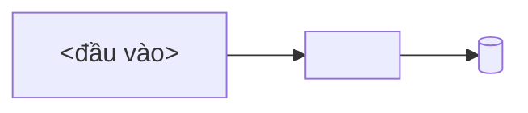

# Viết doc plan

## Mental model

Plan doc là **nơi quyết định thiết kế sống trong lúc còn có thể đổi**. **Doc nguồn** (PRD, kiến trúc,
backlog…) chỉ nhận thay đổi **sau khi plan được duyệt** — ghi sớm thì mỗi lần đổi hướng là viết lại doc
nguồn một lượt, và doc nguồn biến thành nơi lưu tranh luận.

```
bàn trong chat → plan doc (draft) → 👤 duyệt → phase 0 ghi doc nguồn → implement, tick tới đâu xong tới đó
```

Ngoại lệ **duy nhất** được chạm doc nguồn trước khi duyệt: **thêm ID công việc mới** vào backlog — không
có ID thì plan mồ côi.

Doc chia hai nửa, ngăn bằng `---` sau §2: **§1–§2 cho người duyệt**, **§3–§7 cho người làm**.

## Bước 0 — đọc **binding** của project (làm trước mọi thứ)

Skill quy định **hình dạng doc**; project quy định **chỗ cắm**. Thứ tự ưu tiên: `CLAUDE.md` / `AGENTS.md`
→ thư mục doc sẵn có (`ls -d .docs .plans docs`, mở plan gần nhất) → hỏi user → default.

| Binding cần biết                                    | Default nếu project không quy định                                           |
| --------------------------------------------------- | ---------------------------------------------------------------------------- |
| Thư mục + cách đặt tên doc plan                     | `.docs/NNN-slug.md` — không có thì `.plans/NNN-slug.md`; slug lowercase-kebab, `NNN` = số kế tiếp |
| Front matter thêm ngoài bộ chuẩn                    | không có ⇒ dùng đúng bộ ở skeleton                                           |
| **Doc nguồn** nào phải ghi ở phase 0                | không có ⇒ phase 0 rút còn "chốt scope + gate duyệt"                         |
| **Hệ ID công việc** (backlog/issue/ticket)          | không có ⇒ bỏ bước ID, plan tự mô tả scope                                   |
| Lệnh kiểm để đưa vào checklist                      | `npm test` · `npm run build`; đọc `package.json`/`Makefile` để lấy đúng lệnh |
| Doc design/UI phải tuân theo                        | không có ⇒ bỏ                                                                |
| Việc kèm theo khi deploy (bump version, migration…) | không có ⇒ bỏ                                                                |

⚠️ Plan cũ chỉ cho **binding** (thư mục, cách đánh số, hệ ID, doc nguồn). **Không** lấy hình dạng — thứ
tự section, tên section, cách đánh số heading: plan cũ thường là fork của skill này ở version trước,
copy nó là nhân bản drift.

Project có `CLAUDE.md`/`AGENTS.md` **chép lại luật viết plan** ⇒ nói user rút nó về binding + trỏ tới
skill này, đừng giữ hai bản luật.

## Quy trình — 15 luật

> Đánh số ổn định: doc cũ trích `luật 2`, `luật 10`… là trỏ tới danh sách này.

1. **Chưa được yêu cầu thì không lưu file** — trình bày plan trong chat để review; user nói "lưu lại
   plan" mới ghi.
2. **Duyệt xong mới ghi doc nguồn.** Tới lúc đó quyết định nằm **trong plan doc**. Plan có **phase 0 =
   "ghi doc nguồn"**, gate của nó là `👤 plan được duyệt`. Ngoại lệ duy nhất: luật 3.
3. **Chốt ID công việc** plan này phủ. Chưa có ID ⇒ dừng, thêm vào backlog trước.
4. **Tạo file** theo binding bước 0, front matter `type: plan` + `implements: [...]`.
5. **`## 1. Problem` đứng trước `## 2. Goal`**, cả hai bắt buộc:
   - **Problem** — 2–4 dòng **hiện trạng**: ai đau, đau vì gì, hỏng ở đâu, số đo thật nếu có ("build
     40′", "71 lượt load skill trên 347 transcript"). Chưa nói giải pháp.
   - **Goal** — 3–5 bullet **trạng thái quan sát được** sau khi xong: mở được trang nào, chạy được lệnh
     nào, endpoint trả gì. Viết cái **có**, không viết cái **muốn** — "chạy `npx foo` lên được server ở
     :4000", **không** "cải thiện observability". Thêm `**Ngoài scope:**` nếu dễ bị hiểu lầm là có.
6. **Legend** `🤖` = agent tự kiểm được (lệnh, test, grep) · `👤` = cần người kiểm (số đo thật, hạ tầng,
   UI, quyết định) — đặt **ngay dưới heading `## 6. Phases`**, không để đầu doc, không thành section riêng.
7. **Mỗi phase đúng 3 phần, đủ nhãn:**
   - **Goal** — 1 dòng: sau phase này _dùng được_ cái gì (cùng giọng với §2).
   - **Actions** — checklist file/hàm/test/doc cụ thể. Action thực thi một quyết định ⇒ ghi `(D<n>)` cuối
     dòng: sợi dây §4 → §6.
   - **Gate** — checklist **bằng chứng** phase xong: lệnh xanh, số đo, người xác nhận. Chưa đủ Gate thì
     không sang phase sau.

   Mọi item ở Actions và Gate gắn `🤖` hoặc `👤`.

8. **Item phải kiểm được** (`npm pack` → tarball < 2MB), không phải "đã làm xong X".
9. **Backlog trỏ ngược lại**: thêm link tới plan mới ở nhóm ID tương ứng.
10. **Làm tới đâu tick tới đó** — `[ ]` → `[x]` **ngay trong cùng lần làm việc**, không dồn cuối phase,
    không báo "xong" khi plan còn `[ ]`.
    - **Bằng chứng ghi cạnh ô tick**: `- [x] 🤖 pnpm test xanh — 1311 passed / 463 skipped`,
      `- [x] 👤 plan này được duyệt — 2026-09-03`. `[x]` trơ không số/ngày chỉ là lời khai.
    - Item `👤` chưa ai xác nhận ⇒ để `[ ]`, nói rõ đang chờ ai kiểm cái gì.
    - Item không làm được ⇒ để `[ ]` + một dòng lý do ngay dưới (chặn ở đâu, phase sau có bị chặn theo
      không). **Không xoá** — xoá là mất dấu vết phần chưa đạt.
11. **Heading `##` đánh số cứng 1–7 và luôn đủ 7** ⇒ `§4` luôn là Decisions, `§6` luôn là Phases, trích
    chéo liên doc không trượt.
12. **Lead-in chỉ viết khi có quan hệ với plan khác**, dùng đúng 3 nhãn đóng (§Lead-in).
13. **Mỗi quyết định có ID `D0`…`Dn` và ≤5 dòng.** Dài hơn ⇒ chi tiết xuống `§5.x`, `D` trỏ tới.
14. **`D-ID` append-only** — không đánh số lại, không tái dùng. Bỏ một quyết định ⇒ giữ heading, sửa thành
    `### ~~D4~~ — bỏ (YYYY-MM-DD): <lý do>`. Đánh số lại là làm hỏng mọi trích dẫn đã có.
15. **`status` đi một chiều, đúng 3 giá trị**, đổi tới đâu bump `updated`: `draft` → `approved` (ô
    `👤 plan được duyệt` được tick) → `done` (mọi Gate đã tick). Plan bị plan khác lật thì **không** đổi
    status — dấu vết nằm ở `supersedes` + lead-in `**Lật:**` của plan mới.

## Khung cố định — 7 section, không thêm không bớt

| §   | Tên              | Vai                                                                    |
| --- | ---------------- | ---------------------------------------------------------------------- |
| 1   | **Problem**      | đau gì, số đo thật, chưa nói giải pháp                                 |
| 2   | **Goal**         | trạng thái quan sát được sau khi xong + Ngoài scope                    |
| —   | `---`            | ngăn phần người duyệt (1–2) với phần người làm (3–7)                   |
| 3   | **Mental model** | 2–4 dòng **lời** → sơ đồ mermaid                                       |
| 4   | **Decisions**    | `D0`…`Dn`, mỗi D ≤5 dòng — **cái được duyệt, cái plan sau lật**        |
| 5   | **Design**       | `5.1`, `5.2`… cơ chế · contract · schema · API · cách đo               |
| 6   | **Phases**       | Legend → `### Phase 0…n` (Goal · Actions · Gate)                       |
| 7   | **Risks**        | bảng `Bẫy \| Chặn bằng`                                                |

**Decisions trước Design** vì §4 là **mục lục lựa chọn** — thứ người duyệt gật, thứ lead-in plan sau trỏ
vào; §5 là **chỗ khai triển** cho người implement.

**Ranh giới cần plan doc:** không có §4 lẫn §5 ⇒ việc không đủ lớn để cần plan doc, làm thẳng.

## Lead-in — optional, 3 nhãn đóng

Blockquote 2–4 dòng ngay dưới front matter. **Chỉ viết khi** `sources:` chứa một **doc plan khác** (không
tính PRD/SAD/backlog), hoặc plan này đổi hành vi mà một plan cũ đã định nghĩa. Không có quan hệ ⇒ vào
thẳng `## 1. Problem`.

| Nhãn                       | Nội dung                                                    |
| -------------------------- | ----------------------------------------------------------- |
| `**Nối tiếp:**`            | plan cũ làm xong phần nào, plan này giải cái nó để hở       |
| `**Lật:**` + `**Giữ:**`    | D nào của plan cũ bị bác, D nào còn hiệu lực                |
| `**Phụ thuộc:**`           | plan nào phải chạy trước, và vì sao                         |

- Nhãn không có quan hệ ⇒ **bỏ dòng đó**, không viết "không có". Mỗi nhãn ≤1 ý; dài hơn ⇒ nó thuộc §1 hoặc §4.
- **Không** nhét `status` (đã ở front matter) hay phạm vi/ngoài scope (đã ở §2).
- `supersedes: [024]` là **mức doc** cho máy; `**Lật:** D3 · D6 của 024. **Giữ:** D1 · D2` là **mức quyết
  định** cho người — chỉ có field YAML thì người đọc tưởng 024 chết hẳn.

## Skeleton

Thay `<…>` bằng giá trị lấy ở bước 0. Bỏ hẳn thứ project không có (doc nguồn, ID, design doc) — nhưng
**không bỏ section nào trong 7 section**.

````markdown
---
doc: NNN # doc · version: chỉ khi project dùng
type: plan
title: <tiêu đề> (<ID1> · <ID2>)
status: draft # draft → approved → done
version: 0.1
updated: YYYY-MM-DD
implements: [ID1, ID2]
sources: [<doc nguồn>, <plan liên quan>]
supersedes: [] # doc plan bị lật một phần hoặc toàn bộ
---

> **Nối tiếp:** [NNN](NNN-slug.md) — <plan đó làm được gì>. Plan này giải cái nó để hở: <cái gì>.
> **Lật:** D3 · D6 của [NNN](NNN-slug.md). **Giữ:** D1 · D2.
> **Phụ thuộc:** [NNN](NNN-slug.md) chạy trước — <vì sao>.

## 1. Problem

2–4 dòng hiện trạng đang đau (luật 5): ai đau, đau vì gì, số đo thật nếu có. Chưa nói giải pháp.

## 2. Goal

3–5 bullet **trạng thái quan sát được** sau khi plan xong (luật 5).

**Ngoài scope:** <1 dòng, nếu dễ bị hiểu lầm là có>

---

## 3. Mental model

2–4 dòng **lời**: hệ thống chạy thế nào sau khi có, nối lại với §1. Lời là nguồn — đọc một mình
phải hiểu, vì mermaid không render ở terminal / diff / một số viewer.



## 4. Decisions

### D0 — <câu quyết định, 1 dòng>

**Lý do:** <1 dòng>
**Phương án đã loại:** <1 dòng — cái gì, vì sao loại> _(bỏ dòng này nếu không có)_

### D1 — <…>

_(mỗi D ≤5 dòng — luật 13. Chi tiết dài hơn xuống §5.x, D trỏ tới)_

### ~~D2~~ — bỏ (YYYY-MM-DD): <lý do>

_(luật 14 — giữ heading, không đánh số lại)_

## 5. Design

### 5.1 <Cơ chế / Contract>

Bảng · bullet · schema · endpoint. Số đo thật ghi kèm điều kiện đo (version, ngày, cách đo).

### 5.2 <API / Data model>

### 5.3 Cách đo _(chỉ khi plan có baseline chạy lại được)_

| File                | Vai                        |
| ------------------- | -------------------------- |
| `<fixture>`         | <dựng ca gì>               |
| `<script chấm>`     | <chấm theo tiêu chí gì>    |

```bash
<lệnh chạy lại>
```

**Baseline:** <số đo + ngày + version>

## 6. Phases

**Legend:** 🤖 = agent tự kiểm được (chạy lệnh, test, grep) · 👤 = cần người kiểm (số đo thật, UI, hạ tầng).

### Phase 0 — ghi doc nguồn

**Goal:** doc nguồn khớp thiết kế đã duyệt; backlog trỏ về plan này.

**Actions** — chỉ làm sau khi item đầu được tick (luật 2):

- [ ] 👤 plan này được duyệt
- [ ] 🤖 <doc yêu cầu §x>: <câu cụ thể thêm vào>
- [ ] 🤖 <doc kiến trúc §y>: <contract/entity/service cụ thể>
- [ ] 🤖 <backlog>: row `ID1` · `ID2` + link doc này

**Gate:**

- [ ] 🤖 grep `<câu/contract vừa thêm>` ra trong <doc nguồn> · backlog có link doc này

### Phase 1 — <cái dùng được trước> (ID1)

**Goal:** <1 dòng — cái dùng được sau phase này, vd "chạy `npx foo` lên server ở :4000">

**Actions:**

- [ ] 🤖 <file/hàm cụ thể>: <hành vi> (D1)
- [ ] 🤖 Test <tên file>: <ca số một — ca mà nếu sai thì cả feature vô nghĩa>

**Gate:**

- [ ] 🤖 `<lệnh test>` xanh · `<lệnh typecheck/build>` xanh — <số passed/failed khi tick>
- [ ] 👤 <số đo thật / xem trên UI / deploy> — <ngày + ai xác nhận khi tick>

### Phase 2 — … (ID2)

## 7. Risks

| Bẫy              | Chặn bằng                        |
| ---------------- | -------------------------------- |
| <sai lầm dễ mắc> | <gate/test/phase/§ cụ thể>       |
````

## Luật viết

**Chia phase theo _cái gì dùng được trước_, không theo tầng** (không "phase 1 = toàn bộ backend"). Phase
trước không được phụ thuộc phase sau.

**Item phải kiểm được**, không phải "đã làm xong X":

| ✅                                                                       | ❌                    |
| ------------------------------------------------------------------------ | --------------------- |
| `npm pack` → tarball < 2MB                                               | đóng gói xong         |
| Test dedupe: 3 lượt trong 5′ ⇒ **1 row**; lượt thứ 4 sau 16′ ⇒ **2 row** | có test cho dedupe    |
| `git diff --stat` chứng minh `lease.ts` không đổi dòng nào               | không ảnh hưởng lease |

**§7 Risks là phép kiểm chéo, không phải chỗ liệt kê lo lắng.** Cột phải bắt buộc trỏ tới **một gate /
test / phase / § cụ thể**. Điền không được cột phải ⇒ plan chưa có chỗ nào bắt được rủi ro đó, phải thêm gate.

**Văn phong:**

- **Không narrative**: câu khẳng định trạng thái ("endpoint trả 409 khi trùng key"), không kể quá trình
  ("đầu tiên ta kiểm tra key, sau đó…").
- **Ngắn nhưng đọc là hiểu ngay** — cắt chữ đệm, không cắt thông tin. Tên file/hàm/field/lệnh viết đủ,
  không viết tắt tự nghĩ ("`POST /orders` trả 409", không "trả lỗi", không "409" trơ trọi).
- Ưu tiên bảng · bullet · mermaid hơn đoạn văn. Một ý một dòng. Sơ đồ dùng ```mermaid, không ASCII art.
- Đổi quyết định giữa chừng: **một dòng** `**Đổi (YYYY-MM-DD):** <cái mới> — <lý do ngắn>` ngay trong `D`
  tương ứng, không viết lại lịch sử tranh luận.
- Không section changelog — git history là changelog. Chỉ bump `version` + `updated`.

**Chạm UI / deploy / migration** ⇒ đưa vào checklist đúng ràng buộc project đã khai ở bước 0 (doc design,
bump version, chạy migration…). Không có ràng buộc nào thì thôi, đừng bịa.

## Bẫy hay gặp

| Bẫy                                                                            | Chặn bằng                                                       |
| ------------------------------------------------------------------------------ | --------------------------------------------------------------- |
| Copy hình dạng doc từ plan cũ của project (thường là fork cũ của skill này)    | bước 0 — plan cũ chỉ cho **binding**, không cho hình dạng        |
| Ghi vào doc nguồn ngay khi có ý tưởng                                          | gate 👤 của phase 0                                              |
| Tự tạo file plan khi user mới chỉ hỏi ý kiến                                   | luật 1 — trình bày trong chat trước                              |
| Quyết định rải trong prose cơ chế, không có D-ID ⇒ plan sau không trích được   | luật 13 — mọi quyết định vào §4 với ID                           |
| `D` phình thành cả cơ chế ⇒ §4 dài 60 dòng không skim được, §5 rỗng            | luật 13 — D ≤5 dòng, chi tiết xuống §5.x                         |
| Lead-in phình thành tóm tắt plan / chép `status` / chép Ngoài scope            | luật 12 — 3 nhãn đóng, không có quan hệ thì không viết           |
| Mermaid có mà không có lời ⇒ đọc ở diff/terminal là mù                         | §3 — 2–4 dòng lời là nguồn, sơ đồ là minh hoạ                    |
| Xoá dòng cũ trong backlog khi bỏ scope                                         | đánh dấu bỏ, ID không tái sử dụng                                |
| Đánh "xong" khi mới viết xong chưa chạy                                        | chỉ đánh xong khi **chạy được và có bằng chứng**                 |
| Doc plan lỗi thời bị xoá                                                       | luật 14 — plan mới ghi `supersedes: [NNN]` + lead-in `**Lật:**`, doc cũ giữ nguyên |
