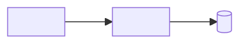
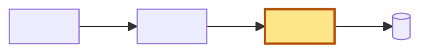

> **Nối tiếp:** [NNN](NNN-slug.md) — <plan đó làm được gì>. Plan này giải cái nó để hở: <cái gì>.
> **Lật:** D3 · D6 của [NNN](NNN-slug.md). **Giữ:** D1 · D2.
> **Phụ thuộc:** [NNN](NNN-slug.md) chạy trước — <vì sao>.

## 1. Problem

<2–4 dòng hiện trạng đang đau: ai đau, đau vì gì, số đo thật nếu có. Chưa nói giải pháp — luật 5.>

## 2. Goal

- <trạng thái quan sát được, vd "chạy `npx foo` lên được server ở :4000">
- <trạng thái quan sát được 2>
- <trạng thái quan sát được 3 — 3–5 bullet, viết cái **có**, không viết cái **muốn** (luật 5)>

**Ngoài scope:** <1 dòng, nếu dễ bị hiểu lầm là có>

## 3. Mental model

_(§1–§3 viết cho người chưa mở repo — luật 23: chữ thường, chỉ gọi tên thứ người đọc thấy hoặc gõ như
nút, trang, lệnh; tên hàm · field · file · payload để dành cho §6–§7; không trỏ `P`/`D`/`DS`)_

**Bây giờ chạy thế nào** — <3–5 dòng: kể **một** đường thật (một lần bấm, một job, một lần đồng bộ) từ
lúc bắt đầu tới khi xong, bằng chuyện xảy ra: ai làm gì, hệ thống làm gì, cuối cùng thấy gì. Đây là
**cơ chế**, không phải nỗi đau — ai đau và số đo nằm ở §1. Đọc riêng phần lời phải hiểu được, vì
mermaid không render ở terminal / diff / một số viewer.>



**Sau plan chạy thế nào** — <3–5 dòng: **cùng đường đó**, chỉ nói chỗ khác đi và vì sao chỗ đó giải
được §1. Không tả lại đoạn không đổi.>



_(Hình mặc định có — chỉ bỏ khi luồng thẳng một mạch ≤3 bước. Nhãn node bằng chữ thường, không tên
hàm. Hình dạng luồng không đổi, chỉ đổi giá trị ⇒ vẽ **một** hình. Vẽ hai thì **cùng node, cùng hướng**,
**chỉ tô màu chỗ đổi**; màu set thẳng trên node kèm màu chữ, không dựa theme. Chi tiết: §"§3 Mental
model" trong SKILL.md)_

**Hành vi đổi ra sao** — mỗi dòng một nhánh của đúng luồng vừa vẽ, tả cái **người dùng thấy**; payload,
mã lỗi là §6, file nào phải sửa là §7 Actions. `BH<n>` để Gate ở §7 trỏ ngược lại (`— BH2`),
append-only như `D`/`DS` (luật 14):

| #     | Tình huống            | Bây giờ                | Sau plan                 |
| ----- | --------------------- | ---------------------- | ------------------------ |
| `BH1` | <nhánh chính>         | <người dùng thấy gì>   | <người dùng thấy gì>     |
| `BH2` | <nhánh lỗi / ca biên> | <…>                    | <…>                      |

**Không đụng:** <1 dòng, gọi bằng tên người đọc hiểu — thứ dễ bị tưởng là có đổi; trỏ được về Gate `git diff --stat` thì càng tốt>

---

## 4. Probe

_(optional — bỏ hẳn section này nếu khả thi kỹ thuật không phải câu hỏi; không section nào dồn lên số 4)_

### P1 — <câu hỏi chưa biết, trả được bằng có/không hoặc bằng số>

**Biết để làm gì:** <kết quả này đổi cái gì — tả ngã ba đường, đừng chép tên `D` nào>
**Cách chạy lại:** `<script · lệnh · commit>` — đủ để người khác chạy lại, không phải "đã thử tay thấy được"
**Kết quả:** <số đo + ngày + version>

### P2 — <câu hỏi>

**Biết để làm gì:** <kết quả này đổi cái gì>
**Cách chạy lại:** `<lệnh sẽ chạy>`
**Kết quả:** **chưa chạy** — plan không lên `approved` được khi còn dòng này (luật 16)

## 5. Decisions

**Ai quyết:** 🤖 = agent tự quyết, chưa hỏi ai — **chỗ người duyệt phải soi** · 👤 = user chốt lúc bàn (luật 22).

### D0 🤖 — <câu quyết định, 1 dòng>

**Lý do:** <1 dòng — **không phải `D` nào cũng có probe**; `D` này không cần nên không trỏ `P` nào>
**Phương án đã loại:** <1 dòng — cái gì, vì sao loại> _(bỏ dòng này nếu không có)_

### D1 👤 — <câu quyết định, 1 dòng>

**Lý do:** <1 dòng> — dựa vào `P1` · `P2` _(mỗi `P` phải có ít nhất một `D` nhắc, chiều ngược lại không bắt buộc — luật 16)_
_(mỗi D ≤5 dòng — luật 13. Chi tiết dài hơn xuống `DS<n>` ở §6, D trỏ tới)_

### ~~D2~~ — <câu quyết định cũ, giữ nguyên chữ>

**Đổi (YYYY-MM-DD):** bỏ — <lý do>
_(luật 14 — gạch ID, giữ nguyên câu cũ, không đánh số lại; ngày nằm ở dòng `**Đổi**`, không lên heading)_

## 6. Design

> ⚠️ **Ba mục dưới đây là ví dụ của _một_ bài toán (đặt hàng: có bảng dữ liệu + endpoint + baseline) —
> không phải khuôn phải theo.** Bài khác ⇒ tên và số `DS` khác hẳn. Giữ lại **dạng trình bày** (đối
> chiếu được), thay sạch nội dung. Bảng gợi ý theo loại bài: §"§6 Design — hình dạng tùy bài toán".
> Nhãn `_(ví dụ — …)_` chỉ sống trong template này; plan thật viết heading trơn: `### DS1 — Database Schema`.

### DS1 — Database Schema _(ví dụ — dạng bảng field)_

Bảng `order`:

| field      | kiểu   | bắt buộc | ghi chú                                |
| ---------- | ------ | -------- | -------------------------------------- |
| `id`       | `uuid` | ✓        | PK                                     |
| `idem_key` | `text` | ✓        | unique — chặn tạo trùng trong 24h (D1) |
| `state`    | `enum` | ✓        | `new` → `paid` → `shipped`             |

### DS2 — API Design _(ví dụ — dạng contract request–response)_

```http
POST /orders   { idem_key, items[] }
201 → { id, state: "new" }
409 → { error: "duplicate_idem_key" }   # cùng idem_key trong 24h
```

### DS3 — Test Strategy _(ví dụ — chỉ khi plan có baseline chạy lại được)_

| File                    | Vai                                        |
| ----------------------- | ------------------------------------------ |
| `fixtures/orders/*.json` | 12 ca gửi trùng `idem_key` ở các mốc thời gian |
| `scripts/score.mjs`     | đếm row `order` tạo ra vs số mong đợi mỗi ca |

```bash
node scripts/score.mjs fixtures/orders
```

**Baseline:** 9/12 ca đúng — 2026-09-04, `v0.3.1`

## 7. Phases

**Legend:** 🤖 = agent tự kiểm được (chạy lệnh, test, grep) · 👤 = cần người kiểm (số đo thật, UI, hạ tầng).

- [ ] 👤 plan này được duyệt — <ngày>

_(ô trên đứng ngoài mọi phase và chặn cả §7: chưa tick thì không phase nào được bắt đầu — luật 2)_

### Phase 0 — ghi doc nguồn

_(optional — project không có doc nguồn thì **bỏ hẳn phase này**, để trống số 0, mở màn bằng Phase 1)_

**Goal:** doc nguồn khớp thiết kế đã duyệt; backlog trỏ về plan này.
**Cover:** — _(phase 0 và phase nghiệm thu không cover `DS` — luật 17)_

**Actions:**

- [ ] 🤖 <doc yêu cầu §x>: <câu cụ thể thêm vào>
- [ ] 🤖 <doc kiến trúc §y>: <contract/entity/service cụ thể>
- [ ] 🤖 <backlog>: row `ID1` · `ID2` + link doc này

**Gate:**

- [ ] 🤖 grep `<câu/contract vừa thêm>` ra trong <doc nguồn> · backlog có link doc này
- [ ] 🤖 `python3 .claude/skills/write-plan/verify.py <doc này>` — 0 ERROR

### Phase 1 — <cái dùng được trước> (ID1)

**Goal:** <1 dòng — cái dùng được sau phase này, vd "chạy `npx foo` lên server ở :4000">
**Cover:** DS1 · DS2 · DS3 (một phần)

**Actions:**

- [ ] 🤖 <file/hàm cụ thể>: <hành vi> (D0)
- [ ] 🤖 Test <tên file>: <ca số một — ca mà nếu sai thì cả feature vô nghĩa> (D1)

**Gate:**

- [ ] 🤖 <bằng chứng đúng contract vừa cover, vd "gửi trùng `idem_key` → 409, DB còn 1 row"> — DS1 · DS2 · BH1
- [ ] 🤖 `<lệnh test>` xanh · `<lệnh typecheck/build>` xanh — <số passed/failed khi tick>
- [ ] 👤 <số đo thật / xem trên UI / deploy> — <ngày + ai xác nhận khi tick>

### Phase 2 — … (ID2)

**Goal:** <1 dòng>
**Cover:** DS3 — _(phase 1 mới làm một phần; đúng một phase nhận trọn — luật 17)_

**Actions:**

- [ ] 🤖 <…>

**Gate:**

- [ ] 🤖 <bằng chứng> — DS3

### Phase 3 — nghiệm thu

**Goal:** mỗi bullet §2 có một lượt chạy thật, kết quả ghi lại cạnh ô tick.
**Cover:** — _(luật 21)_

**Actions:**

- [ ] 🤖 chạy `<lệnh ở §2 bullet 1>` trên máy sạch, giữ output
- [ ] 👤 đi đúng đường người dùng đi ở <§2 bullet 2>

**Gate** — một dòng ứng một bullet §2, không phải "test xanh" trơn:

- [ ] 🤖 §2 bullet 1: `npx foo` lên server :4000 · `curl :4000/health` → 200
- [ ] 👤 §2 bullet 2: <kết quả thật quan sát được> — <ngày + ai xác nhận> · BH2
- [ ] 👤 §2 bullet 3: <kết quả thật quan sát được> — <ngày + ai xác nhận>
- [ ] 🤖 `python3 .claude/skills/write-plan/verify.py <doc này>` — 0 ERROR
